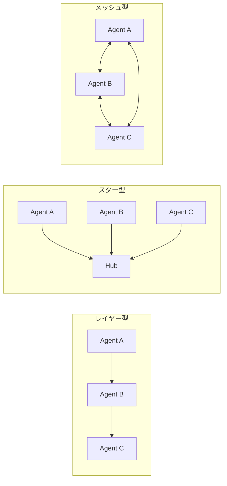

本記事は [arXiv:2402.01680](https://arxiv.org/abs/2402.01680) の解説記事です。

## 論文概要（Abstract）

Guo et al.（2024）は、LLMベースのマルチエージェントシステムを「環境（Environment）」「プロファイル（Profile）」「コミュニケーション（Communication）」「能力（Capability）」の4軸で体系的に分類したサーベイ論文である。IJCAI 2024に採択された本論文は、150件以上の先行研究を横断的にレビューし、問題解決・社会シミュレーション・世界シミュレーションの3つの応用領域における成果と課題を整理している。特にハルシネーション伝播・コスト増大・調整困難性という3つの根本的課題の分析が実務者にとって有用である。

この記事は [Zenn記事: マルチエージェントシステムの進化：古典的MASからLLMベースMASへの技術比較](https://zenn.dev/0h_n0/articles/3848dd01781b58) の深掘りです。

## 情報源

- **arXiv ID**: 2402.01680
- **URL**: [https://arxiv.org/abs/2402.01680](https://arxiv.org/abs/2402.01680)
- **著者**: Guo et al.
- **発表年**: 2024
- **採択先**: IJCAI 2024（International Joint Conference on Artificial Intelligence）
- **分野**: cs.AI, cs.CL, cs.MA

## 背景と動機（Background & Motivation）

2023年以降、ChatDev、MetaGPT、CAMEL、AutoGenといったLLMベースのマルチエージェントフレームワークが急速に登場した。しかし、これらのシステムを統一的に理解するための分類体系が不在であり、研究者・実務者がフレームワーク選定やアーキテクチャ設計を行う際の判断基準が不明確であった。

著者らは、既存のサーベイがLLMエージェントの「個体」に焦点を当てているのに対し、本論文は「複数エージェント間の相互作用」に焦点を絞ることで差別化している。特に、エージェント間のコミュニケーション構造がシステム全体の性能に与える影響を体系的に分析している点が本論文の独自性である。

## 主要な貢献（Key Contributions）

- **貢献1**: LLMマルチエージェントを「環境・プロファイル・コミュニケーション・能力」の4軸で分類する統一的なタクソノミーを提案した
- **貢献2**: 問題解決（ソフトウェア開発、科学研究）・社会シミュレーション（社会現象の再現）・世界シミュレーション（ゲーム環境の構築）の3応用領域で成果を整理した
- **貢献3**: ハルシネーション伝播・コスト増大・調整困難性・セキュリティリスクなど、LLMマルチエージェント固有の課題を体系的に分析した

## 技術的詳細（Technical Details）

### 4軸分類タクソノミー

著者らが提案するタクソノミーの各軸を詳述する。

#### 軸1: 環境（Environment）

エージェントが動作する環境は2つのカテゴリに分かれる。

**サンドボックス環境**: ソフトウェア開発（ChatDev、MetaGPT）、ゲーム（Werewolf、Avalon）、社会シミュレーション（Smallville）など、制御された環境内でエージェントが相互作用する。環境のルールが明確に定義されており、エージェントの行動空間が制約される。

**物理環境**: ロボット群制御やドローン群制御など、現実世界でエージェントが動作する。センサーノイズ、通信遅延、物理制約が追加の課題となる。

著者らは、現時点のLLMマルチエージェント研究の大半がサンドボックス環境に集中しており、物理環境での適用は初期段階にあると指摘している。

#### 軸2: プロファイル（Profile）

エージェントへの役割付与方式を3カテゴリに分類している。

**事前定義型**: プロンプトテンプレートで明示的に役割を指定する。MetaGPTでは「プロダクトマネージャー → アーキテクト → エンジニア → QA」というソフトウェア開発ワークフローを直接写像する。

**生成型**: LLMが動的に役割を生成する。AgentVerseのモジュラー専門家チームでは、タスクの性質に応じて必要な専門家を自動構成する。

**データ駆動型**: 実在の人物や組織のデータに基づいてプロファイルを構築する。社会シミュレーション（Smallville）で用いられる。

```python
from dataclasses import dataclass, field

@dataclass
class AgentProfile:
    """LLMマルチエージェントのプロファイル定義"""
    name: str
    role: str
    goal: str
    backstory: str
    constraints: list[str] = field(default_factory=list)
    tools: list[str] = field(default_factory=list)

    def to_system_prompt(self) -> str:
        """プロファイルをLLMのシステムプロンプトに変換"""
        parts = [
            f"あなたは{self.role}です。",
            f"目標: {self.goal}",
            f"背景: {self.backstory}",
        ]
        if self.constraints:
            parts.append(f"制約: {', '.join(self.constraints)}")
        if self.tools:
            parts.append(f"使用可能なツール: {', '.join(self.tools)}")
        return "\n".join(parts)

# 事前定義型の例: ソフトウェア開発チーム
pm = AgentProfile(
    name="PM",
    role="プロダクトマネージャー",
    goal="ユーザー要件を分析し、PRD（製品要件定義書）を作成する",
    backstory="10年のプロダクト開発経験を持つシニアPM",
    constraints=["技術的実現可能性を考慮する", "スコープクリープを防ぐ"],
)

architect = AgentProfile(
    name="Architect",
    role="ソフトウェアアーキテクト",
    goal="PRDに基づき、システム設計書を作成する",
    backstory="大規模分散システムの設計経験が豊富",
    constraints=["既存の技術スタックとの互換性を保つ"],
    tools=["code_search", "architecture_diagram"],
)
```

#### 軸3: コミュニケーション（Communication）

著者らはエージェント間通信を**構造**と**内容**の2視点で分析している。

**通信構造**: 以下の3パターンに分類される。



- **レイヤー型（Sequential）**: エージェントが直列に接続され、前のエージェントの出力が次のエージェントの入力となる。ChatDevのウォーターフォール型ワークフローが典型例
- **スター型（Centralized）**: 中央のオーケストレータが各エージェントにタスクを割り振る。LangGraphのSupervisorパターンが該当
- **メッシュ型（Decentralized）**: 全エージェントが相互に通信可能。AutoGenのGroupChatが該当

著者らの分析によると、レイヤー型は予測可能性が高く監査に向くが、ボトルネックが発生しやすい。メッシュ型は柔軟だが、エージェント数 $n$ に対して通信コストが $O(n^2)$ に増大する。

**通信内容**: 自然言語メッセージが主流だが、構造化されたJSON形式やコードブロックを用いるケースも増加している。著者らは、非構造化な自然言語通信がハルシネーション伝播のリスクを高めると指摘している。

#### 軸4: 能力（Capability）

LLMエージェントの能力を以下の4つに分類している。

- **推論（Reasoning）**: Chain-of-Thought、Tree-of-Thought、Graph-of-Thoughtによる構造化推論
- **計画（Planning）**: タスク分解、サブゴール生成、リプランニング
- **ツール使用（Tool Use）**: 外部API呼び出し、コード実行、データベースクエリ
- **記憶（Memory）**: 短期記憶（コンテキスト内）と長期記憶（外部ストレージ）

### 3つの応用領域

#### 領域1: 問題解決（Problem Solving）

**ソフトウェア開発**: ChatDevは4エージェント（CEO・CTO・プログラマー・テスター）の協調でソフトウェアを生成する。MetaGPTは型付きI/Oスキーマを導入し、エージェント間の情報損失を抑制している。

**科学研究**: ChemCrowは化学実験の自動設計・実行にLLMマルチエージェントを適用している。

**数学推論**: マルチエージェント議論（Multi-Agent Debate）では、複数のLLMエージェントが同じ問題に対する解答を提示し、相互批判を通じて最終回答の精度を向上させる。著者らは、GSM8Kベンチマークでの実験結果として、3エージェントによる議論が単一エージェントに対して約5%の精度向上をもたらすと報告されている研究を引用している。

#### 領域2: 社会シミュレーション

**Smallville sandbox**: 25エージェントが自律的に情報拡散・関係形成を行う社会シミュレーション環境。各エージェントは「記憶ストリーム」（経験の時系列記録）と「リフレクション」（経験からの抽象化）メカニズムを持つ。

**社会的行動の創発**: 著者らは、エージェント間の反復的な相互作用から「社会規範」「リーダーシップ構造」「情報伝播パターン」が自発的に生まれることを複数の研究が確認していると報告している。

#### 領域3: 世界シミュレーション

ゲーム環境（Minecraft、Overcooked等）でのマルチエージェント協調。Voyagerは自己進化するコード生成ループにより、Minecraftで長期的な探索・構築タスクを遂行する。

### LLMマルチエージェントの根本的課題

著者らが特に強調する3つの課題を解説する。

#### 課題1: ハルシネーション伝播

1エージェントの誤った情報が他エージェントに伝播し、システム全体の信頼性を低下させる。著者らはこれを「エラーのカスケード効果」と呼んでいる。

対策として、以下の戦略が提示されている：
- **マルチエージェント議論**: 競争型アーキテクチャで相互検証
- **型付きI/Oスキーマ**: 構造化された出力形式でハルシネーションの発生を抑制（MetaGPTアプローチ）
- **外部検証**: ツール呼び出しやコード実行による事実確認

#### 課題2: コスト増大

マルチエージェントシステムでは、エージェント間の通信にトークンが消費される。著者らの分析によると、AutoGenの会話ベースアーキテクチャでは「合意形成」のためのマルチターン対話が発生し、単一エージェントの数倍のコストになるケースがある。

コスト最適化戦略として著者らは以下を挙げている：
- **モデル混合**: ルーティングには軽量モデル（Haiku級）、複雑な推論には大規模モデル（Opus級）を使い分ける
- **メッセージ剪定**: 不要な通信を削減するイベントトリガ型通信
- **キャッシング**: 同一のプロンプト・コンテキストに対する応答をキャッシュ

#### 課題3: 調整困難性

エージェント数の増加に伴い、協調の複雑度が非線形に増大する。著者らはこれを分散システムにおけるCAP定理（一貫性・可用性・分断耐性のトレードオフ）になぞらえ、MASにおいても「協調品質・応答速度・スケーラビリティ」の間にトレードオフが存在すると論じている。

$$
\text{Coordination Cost} \propto n \cdot \log(n) \cdot d
$$

ここで、$n$ はエージェント数、$d$ は通信ラウンド数である。完全メッシュ通信では $O(n^2 \cdot d)$ となるが、階層的オーケストレーション（スター型）では $O(n \cdot d)$ に削減可能である。

## 実験結果（Results）

本論文はサーベイであり独自の実験は含まないが、著者らは既存研究の比較を以下のように整理している。

### フレームワーク比較

| フレームワーク | 通信構造 | プロファイル型 | 主な応用 |
|--------------|---------|-------------|---------|
| ChatDev | レイヤー型 | 事前定義 | ソフトウェア開発 |
| MetaGPT | レイヤー型 | 事前定義（型付き） | ソフトウェア開発 |
| CAMEL | メッシュ型 | 事前定義 | ロールプレイ対話 |
| AutoGen | メッシュ型（GroupChat） | 事前定義/生成 | 汎用タスク |
| AgentVerse | スター型 | 生成型 | 汎用タスク |
| Smallville | メッシュ型 | データ駆動 | 社会シミュレーション |

### 性能比較（著者らが引用する既存研究より）

マルチエージェント議論（Multi-Agent Debate）のベンチマーク結果として、著者らは以下の傾向を報告している：
- エージェント数が3〜5の範囲で最も効率的な性能向上が得られる
- エージェント数が10を超えると、通信オーバーヘッドによる性能低下が顕著になる
- モデル混合（軽量モデル + 大規模モデル）がコスト対性能比で最も優れる

## 実運用への応用（Practical Applications）

著者らの分析に基づくと、LLMマルチエージェントの実運用での成功パターンは以下の通りである。

### パターン1: 役割特化型チーム

各エージェントに明確な役割を割り当て、レイヤー型またはスター型の通信構造で接続する。ソフトウェア開発（ChatDev/MetaGPT）が代表例。本番環境では監査証跡の確保が重要であり、LangGraphのチェックポイント機構が有効である。

### パターン2: 議論型品質保証

複数エージェントが同一タスクに対して独立に結果を生成し、相互批判を通じて最終結果を洗練する。コード生成の品質保証やファクトチェックに適用される。

### パターン3: シミュレーション型検証

実環境への適用前に、マルチエージェントシミュレーションでシステムの挙動を検証する。A/Bテストの代替として注目されている。

## 関連研究（Related Work）

- **Wang et al. (2026)**: 古典的MASからLLMベースMASまでを包括的にカバーするサーベイ。本論文がLLMマルチエージェントに特化しているのに対し、古典的制御理論やMARL（マルチエージェント強化学習）も含む上位概念として位置づけられる
- **Xi et al. (2023)**: LLMベースエージェントの一般的サーベイ。単一エージェントの設計に焦点を当てており、マルチエージェント間の通信・協調は副次的な扱い
- **Talebirad & Nadiri (2023)**: LLMマルチエージェントの初期サーベイ。本論文はより多くのフレームワーク（150件超）をカバーし、課題分析が詳細

## まとめと今後の展望

Guo et al.のサーベイは、LLMマルチエージェントの設計空間を「環境・プロファイル・コミュニケーション・能力」の4軸で構造化した点で、フレームワーク選定やアーキテクチャ設計の実務的な指針となる。

著者らが示す今後の研究方向として特に重要なのは以下の3点である：

1. **ハルシネーション耐性の向上**: 型付き通信プロトコルと外部検証の組み合わせによるエラーカスケードの防止
2. **コスト効率的なスケーリング**: モデル混合戦略とメッセージ剪定アルゴリズムの発展
3. **安全性と制御可能性**: マルチエージェント間の権限境界設計とHuman-in-the-Loopガバナンスの体系化

本論文は2024年2月時点の成果であり、2025年以降のMCP・A2Aプロトコル標準化やAAIF（Agentic AI Foundation）の設立はカバーされていない点に留意が必要である。最新の通信プロトコルについてはWang et al. (2026)のサーベイを併読することが推奨される。

## 参考文献

- **arXiv**: [https://arxiv.org/abs/2402.01680](https://arxiv.org/abs/2402.01680)
- **Related Zenn article**: [https://zenn.dev/0h_n0/articles/3848dd01781b58](https://zenn.dev/0h_n0/articles/3848dd01781b58)
- **Wang et al. (2026)**: [https://arxiv.org/abs/2604.18133](https://arxiv.org/abs/2604.18133)
- **Xi et al. (2023)**: [https://arxiv.org/abs/2309.07864](https://arxiv.org/abs/2309.07864)
