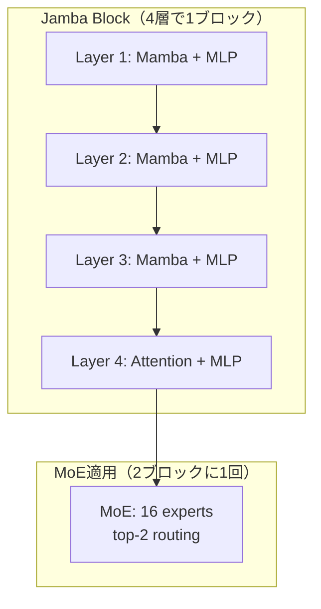

> **本記事は [Jamba: A Hybrid Transformer-Mamba Language Model (arXiv:2403.19887)](https://arxiv.org/abs/2403.19887) の解説記事です。ICLR 2025 採択論文。**

## 論文概要（Abstract）

Jambaは、AI21 Labsが提案したTransformerとMamba（State Space Model, SSM）のハイブリッド言語モデルである。Attention層とMamba層を1:7の比率で交互に配置し、さらにMixture-of-Experts（MoE）を組み合わせることで、52Bパラメータ（アクティブ12B）を単一80GB GPUで動作可能にしている。256Kトークンのコンテキスト長をサポートし、Mixtral 8x7B比で3倍のスループットを報告している。

この記事は [Zenn記事: Attention機構の全史 Bahdanauから FlashAttention4・MLAまでの数学と実装](https://zenn.dev/0h_n0/articles/b03b57bf327edf) の深掘りです。

## 情報源

- **会議名**: ICLR 2025
- **年**: 2025
- **URL**: [https://arxiv.org/abs/2403.19887](https://arxiv.org/abs/2403.19887)
- **著者**: Opher Lieber, Barak Lenz et al.（AI21 Labs）
- **発表形式**: Conference Paper

## カンファレンス情報

Jambaは2024年3月にプレプリントとして公開され、ICLR 2025に採択された。SSM（State Space Model）とTransformerのハイブリッドアーキテクチャとしては初のプロダクションレベルのモデルであり、オープンウェイト（Apache 2.0ライセンス）で公開されている。

## 技術的詳細（Technical Details）

### なぜハイブリッドか：AttentionとSSMの相補性

AttentionとSSMはそれぞれ異なる強みと弱みを持つ。

| 特性 | Attention | SSM（Mamba） |
|------|-----------|-------------|
| 計算量（シーケンス長 $n$） | $O(n^2 d)$ | $O(n d)$ |
| 情報検索精度 | 高い（全トークンペアを明示的に比較） | 低い（再帰的に圧縮された状態から検索） |
| 長距離依存性 | KVキャッシュが線形増加 | 固定サイズの状態で表現 |
| 並列学習効率 | 高い（全位置を同時計算可能） | 中程度（再帰計算にシーケンシャル成分あり） |

著者らは、2025年のアブレーション研究でAttention層を完全に除去すると検索精度が0%に低下することを確認しており、SSMだけでは「正確な情報の取り出し」が困難であることが実験的に裏付けられている。

### Mambaの基本メカニズム

Jambaが採用するMambaは、Selective State Space Model（S6）とも呼ばれ、入力に応じてSSMのパラメータを動的に変化させる機構を持つ。

**離散時間SSMの定式化**:

$$
h_t = \bar{A} h_{t-1} + \bar{B} x_t
$$
$$
y_t = C h_t
$$

ここで、
- $h_t \in \mathbb{R}^{N}$: 隠れ状態（状態次元 $N$）
- $x_t \in \mathbb{R}^{D}$: 入力
- $\bar{A} \in \mathbb{R}^{N \times N}$: 離散化された状態遷移行列
- $\bar{B} \in \mathbb{R}^{N \times D}$: 入力射影行列
- $C \in \mathbb{R}^{D \times N}$: 出力射影行列

**Mambaの選択機構（Selective Scan）**: 標準SSMでは $A, B, C$ は入力非依存の固定パラメータだが、Mambaでは入力 $x_t$ に依存して $B_t, C_t, \Delta_t$（離散化ステップ）を動的に生成する。

$$
B_t = \text{Linear}(x_t), \quad C_t = \text{Linear}(x_t), \quad \Delta_t = \text{softplus}(\text{Linear}(x_t))
$$

これにより、モデルは入力の内容に応じて「何を記憶し、何を忘れるか」を選択的に制御できる。

### Jambaのブロック構成

Jambaは以下の階層構造で構成される。



**具体的な構成**:
- **Attention : Mamba比率** = 1 : 7（8層のうち1層がAttention）
- **MoE適用頻度**: 2ブロック（8層）に1回
- **エキスパート数**: 16（うち2を活性化、top-2 routing）
- **全パラメータ数**: 52B
- **アクティブパラメータ数**: 12B（トークンあたり）
- **コンテキスト長**: 256K トークン

### メモリ効率の分析

Jambaのメモリ効率が高い理由は、KVキャッシュがAttention層のみに限定されることにある。

**KVキャッシュ比較（256Kコンテキスト時、論文Table 3より概算）**:

| モデル | KVキャッシュサイズ（概算） | 備考 |
|--------|-------------------------|------|
| Llama-2 70B（全層Attention） | ~128 GB | 全80層でKV保持 |
| Mixtral 8x7B（全層Attention） | ~48 GB | 32層、GQA使用 |
| Jamba 52B（1/8がAttention） | ~8 GB | 7/8層はSSMで固定サイズ状態のみ |

Mamba層は固定サイズの隠れ状態（$h_t$）のみを保持するため、シーケンス長に依存しないメモリ消費となる。これがJambaの256Kコンテキスト対応を可能にしている核心である。

### 実装例

```python
import torch
import torch.nn as nn

class JambaBlock(nn.Module):
    """Jamba Block: 3 Mamba layers + 1 Attention layer"""
    def __init__(
        self,
        d_model: int = 4096,
        n_heads: int = 32,
        ssm_state_dim: int = 16,
        ssm_expand: int = 2,
    ):
        super().__init__()
        # 3 Mamba layers + 1 Attention layer
        self.mamba_layers = nn.ModuleList([
            MambaLayer(d_model, ssm_state_dim, ssm_expand)
            for _ in range(3)
        ])
        self.attention_layer = AttentionLayer(d_model, n_heads)

        self.layer_norms = nn.ModuleList([
            nn.RMSNorm(d_model) for _ in range(4)
        ])

    def forward(
        self,
        x: torch.Tensor,
        ssm_states: list[torch.Tensor] | None = None,
        kv_cache: torch.Tensor | None = None,
    ) -> tuple[torch.Tensor, list[torch.Tensor], torch.Tensor]:
        new_ssm_states = []

        # Mamba layers (3/4)
        for i, (mamba, norm) in enumerate(
            zip(self.mamba_layers, self.layer_norms[:3])
        ):
            residual = x
            x = norm(x)
            state_in = ssm_states[i] if ssm_states else None
            x, state_out = mamba(x, state_in)
            x = x + residual
            new_ssm_states.append(state_out)

        # Attention layer (1/4)
        residual = x
        x = self.layer_norms[3](x)
        x, new_kv_cache = self.attention_layer(x, kv_cache)
        x = x + residual

        return x, new_ssm_states, new_kv_cache


class MambaLayer(nn.Module):
    """Simplified Mamba (Selective SSM) layer"""
    def __init__(self, d_model: int, state_dim: int, expand: int):
        super().__init__()
        d_inner = d_model * expand
        self.in_proj = nn.Linear(d_model, d_inner * 2, bias=False)
        self.conv1d = nn.Conv1d(d_inner, d_inner, kernel_size=4,
                                padding=3, groups=d_inner)
        # Selective parameters
        self.x_proj = nn.Linear(d_inner, state_dim * 2 + 1, bias=False)
        self.dt_proj = nn.Linear(1, d_inner, bias=True)
        self.A_log = nn.Parameter(torch.randn(d_inner, state_dim))
        self.D = nn.Parameter(torch.ones(d_inner))
        self.out_proj = nn.Linear(d_inner, d_model, bias=False)

    def forward(
        self,
        x: torch.Tensor,
        ssm_state: torch.Tensor | None = None,
    ) -> tuple[torch.Tensor, torch.Tensor]:
        B, T, D = x.shape
        xz = self.in_proj(x)
        x_in, z = xz.chunk(2, dim=-1)

        x_conv = self.conv1d(x_in.transpose(1, 2))[:, :, :T].transpose(1, 2)
        x_conv = torch.silu(x_conv)

        # Selective scan (simplified)
        ssm_params = self.x_proj(x_conv)
        A = -torch.exp(self.A_log)

        # Recurrent computation
        if ssm_state is None:
            ssm_state = torch.zeros(B, x_in.size(-1), A.size(-1),
                                     device=x.device)

        outputs = []
        for t in range(T):
            ssm_state = ssm_state * torch.exp(A.unsqueeze(0)) + \
                        x_conv[:, t:t+1, :].unsqueeze(-1)
            y_t = (ssm_state @ ssm_params[:, t:t+1, :A.size(-1)].unsqueeze(-1)
                   ).squeeze(-1)
            outputs.append(y_t)

        y = torch.stack(outputs, dim=1)
        y = y * torch.silu(z)
        output = self.out_proj(y)

        return output, ssm_state
```

## 実装のポイント（Implementation）

**Mamba SSMライブラリへの依存**: Jambaの実行にはMamba SSMライブラリ（`mamba-ssm`パッケージ）が必要であり、これはTritonに依存する。CUDAバージョンとの互換性に注意が必要。

**Attention/Mamba比率の選択**: 著者らは1:7（8層中1層がAttention）を推奨しているが、タスクの性質によって最適な比率は異なる。検索精度が重要なRAGタスクでは、Attention層の比率を高める（1:3や1:5）ことが有効な場合がある。

**メモリ管理**: 推論時、Mamba層のSSM状態は固定サイズ（$d_{inner} \times N_{state}$）であるのに対し、Attention層のKVキャッシュはシーケンス長に比例して増大する。長コンテキスト推論では、Attention層のKVキャッシュがメモリボトルネックとなりうる。

**Hugging Face Hub**: `ai21labs/Jamba-v0.1` としてモデル重みが公開されており、`transformers` ライブラリ経由でロード可能（Apache 2.0ライセンス）。

## Production Deployment Guide

### AWS実装パターン（コスト最適化重視）

Jambaモデルの推論構成を示す。Jambaは52Bパラメータだが12Bアクティブのため、単一GPUでの推論が可能である。

| 規模 | 月間リクエスト | 推奨構成 | 月額コスト概算 | 主要サービス |
|------|--------------|---------|---------------|------------|
| **Small** | ~3,000 | SageMaker Serverless | $200-500 | SageMaker (g5.2xlarge) |
| **Medium** | ~30,000 | SageMaker Real-time | $2,500-5,000 | SageMaker (g5.12xlarge × 2) |
| **Large** | 300,000+ | EKS Self-managed | $8,000-18,000 | EKS + g5.48xlarge / p5 |

**単一GPU動作のメリット**: Jamba 52Bは80GB GPU 1枚で動作するため、マルチGPU分散推論のオーバーヘッドが不要。g5.48xlarge（A10G×8）でバッチ推論を行う場合、Mixtral 8x7B比で3倍のスループットが期待できる。

**コスト試算の注意事項**: 上記は2026年4月時点のAWS東京リージョン料金に基づく概算値。Jambaの長コンテキスト対応（256K）を活用する場合、KVキャッシュ用メモリが追加で必要となる。

### Terraformインフラコード

```hcl
resource "aws_sagemaker_model" "jamba" {
  name               = "jamba-hybrid-inference"
  execution_role_arn = aws_iam_role.sagemaker.arn

  primary_container {
    image = "763104351884.dkr.ecr.ap-northeast-1.amazonaws.com/pytorch-inference:2.3.0-gpu-py311-cu121-ubuntu22.04-sagemaker"
    model_data_url = "s3://${aws_s3_bucket.model.bucket}/jamba/model.tar.gz"
    environment = {
      MODEL_NAME       = "ai21labs/Jamba-v0.1"
      MAX_CONTEXT_LEN  = "262144"
      MAMBA_SSM_VERSION = "1.2.0"
    }
  }
}

resource "aws_sagemaker_endpoint_configuration" "jamba" {
  name = "jamba-config"

  production_variants {
    variant_name           = "default"
    model_name             = aws_sagemaker_model.jamba.name
    instance_type          = "ml.g5.12xlarge"
    initial_instance_count = 1
  }
}

resource "aws_cloudwatch_metric_alarm" "ssm_state_memory" {
  alarm_name          = "jamba-memory-usage"
  comparison_operator = "GreaterThanThreshold"
  evaluation_periods  = 2
  metric_name         = "GPUMemoryUtilization"
  namespace           = "AWS/SageMaker"
  period              = 300
  statistic           = "Maximum"
  threshold           = 90.0
  alarm_description   = "GPUメモリ90%超過: コンテキスト長の制限またはインスタンスサイズ変更を検討"
}
```

### コスト最適化チェックリスト

- [ ] Jamba単一GPU推論でマルチGPU分散コスト回避
- [ ] Mamba層の固定メモリ消費を活用した長コンテキスト推論
- [ ] SageMaker Autoscaling設定
- [ ] Spot Instances活用（g5: 最大60%削減）
- [ ] Continuous Batching有効化（vLLM Jamba対応設定）
- [ ] CloudWatch GPU メモリ/使用率アラーム設定
- [ ] AWS Budgets月額予算アラート
- [ ] 開発環境エンドポイント夜間削除
- [ ] Cost Anomaly Detection有効化
- [ ] 長コンテキスト推論のバッチサイズ最適化

## 実験結果（Results）

著者らが報告している主要な実験結果を以下にまとめる（論文Table 1-4より）。

| ベンチマーク | Mixtral 8x7B | Llama-2 70B | Jamba 52B (12B active) |
|-------------|-------------|------------|----------------------|
| HellaSwag | 86.7 | 87.3 | 87.1 |
| WinoGrande | 81.2 | 83.7 | 82.5 |
| ARC-Challenge | 65.7 | 67.3 | 64.4 |
| PIQA | 83.2 | 82.8 | 83.2 |

**スループット比較（論文Figure 6より）**:
- Jamba: Mixtral 8x7B比で約3倍のスループット（128Kコンテキスト時）
- メモリ使用量: 長コンテキストでの増加率がTransformerのみのモデルと比較して大幅に低い

**制約事項**: 短文タスク（ARC-Challenge等）ではLlama-2 70BやMixtral 8x7Bに対して若干劣るケースがある。これはアクティブパラメータ数の差（12B vs 47B/70B）に起因すると考えられる。長コンテキストタスクでの優位性が、Jambaの主要な価値となっている。

## 実運用への応用（Practical Applications）

Jambaの実運用上の主要な価値は、**単一GPUで256Kトークンのコンテキストを処理できる**点にある。これは以下のユースケースで特に有用である。

**ドキュメント分析**: 長い法律文書や技術文書（100ページ以上）を1回のコンテキストで処理可能。Attention層が精密な情報検索を担保し、Mamba層が長距離の文脈把握を担う。

**コード理解**: 大規模コードベース（数千行）をコンテキストに含めた上でのコード生成・レビュー。

**マルチターン対話**: 長い対話履歴を保持しつつ効率的な推論が可能。

ただし、Mamba SSMライブラリの成熟度はTransformerエコシステムと比較して発展途上であり、推論フレームワーク（vLLM等）のJamba対応も限定的である点は実運用上の考慮事項である。

## まとめと今後の展望

Jambaは、TransformerとMamba（SSM）を1:7の比率で組み合わせたハイブリッドアーキテクチャにより、長コンテキスト処理のメモリ効率と推論スループットを大幅に改善した。52Bパラメータを単一80GB GPUで動作させた点は、デプロイメントコストの観点からも意義がある。

今後の方向性としては、Attention/SSM比率の動的調整（タスクに応じた適応的切り替え）、MambaとMLAの組み合わせによるさらなるKVキャッシュ削減、およびJamba 1.5以降のスケールアップが注目される。

## 参考文献

- **arXiv**: [https://arxiv.org/abs/2403.19887](https://arxiv.org/abs/2403.19887)
- **ICLR Proceedings**: [https://proceedings.iclr.cc/paper_files/paper/2025/file/a9ed43fa31dc8b4a7d7a673d713dcb5f-Paper-Conference.pdf](https://proceedings.iclr.cc/paper_files/paper/2025/file/a9ed43fa31dc8b4a7d7a673d713dcb5f-Paper-Conference.pdf)
- **AI21 Labs**: [https://www.ai21.com/research/jamba-a-hybrid-transformer-mamba-language-model/](https://www.ai21.com/research/jamba-a-hybrid-transformer-mamba-language-model/)
- **Hugging Face**: ai21labs/Jamba-v0.1（Apache 2.0）
- **Related Zenn article**: [https://zenn.dev/0h_n0/articles/b03b57bf327edf](https://zenn.dev/0h_n0/articles/b03b57bf327edf)
