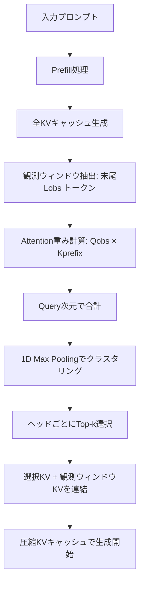

## 論文概要

本記事は [SnapKV: LLM Knows What You are Looking for Before Generation](https://arxiv.org/abs/2404.14469) の解説記事です。
この記事は [Zenn記事: Neural Garbage Collection―LLMが自ら忘却を学ぶKVキャッシュ管理](https://zenn.dev/0h_n0/articles/a571af34a7694f) の深掘りです。

SnapKVは、LLMの推論時に肥大化するKVキャッシュを**ファインチューニングなし**で圧縮する手法である。プロンプト末尾の「observation window（観測ウィンドウ）」におけるattentionパターンを解析し、各attention headが注目するKV位置を特定して不要なKVを除去する。著者らは、16Kトークン入力で生成速度3.6倍・メモリ効率8.2倍の改善を達成し、単一A100-80GB GPUで380Kトークンの処理が可能であると報告している。

## 情報源

- **arXiv ID**: 2404.14469
- **URL**: [https://arxiv.org/abs/2404.14469](https://arxiv.org/abs/2404.14469)
- **著者**: Yuhong Li, Yingbing Huang, Bowen Yang, et al.（計9名）
- **年**: 2024（v1: 2024年4月22日、v2: 2024年6月17日）
- **分野**: cs.CL, cs.AI
- **GitHub**: [https://github.com/FasterDecoding/SnapKV](https://github.com/FasterDecoding/SnapKV)

## 背景と動機

LLMの推論においてKVキャッシュは不可欠な仕組みだが、入力シーケンス長に比例してメモリ消費と計算コストが増大する。特にRAG（Retrieval-Augmented Generation）やチャットボットのように入力が長大なユースケースでは、生成トークン数に対して入力トークン数が圧倒的に大きく、**入力側のKVキャッシュが主要なボトルネック**となる。

従来手法には以下の問題があった。

- **H2O（Heavy-Hitter Oracle）**: 生成フェーズでのKV圧縮に注力し、入力シーケンスの圧縮を見落としている
- **StreamLLM**: 先頭トークンとローカルトークンのみを保持するため、中間の重要な文脈情報を喪失する
- **ScissorHands**: 生成ウィンドウのみに着目し、広範な入力処理を考慮していない

これらはいずれも、入力プロンプトの長大さという実運用上の主要課題に十分対処できていなかった。SnapKVは「LLMはprefill（入力処理）の段階で、生成に必要な情報がどこにあるか既に把握している」という観察に基づき、この問題に取り組む。

## 主要な貢献

1. **Observation Windowの発見**: プロンプト末尾の少数トークン（16〜64トークン）のattentionパターンが、生成時のattentionパターンを高い精度で予測できることを実験的に示した
2. **Per-Head KV選択**: 各attention headが異なるKV位置に注目するという特性を活かし、ヘッドごとに独立した重要度判定を行う仕組みを構築した
3. **Attention Poolingによるクラスタリング**: 単純なtop-k選択では情報の断片化が起きる問題を、1次元max poolingで解決した
4. **ファインチューニング不要**: 既存のHuggingFace実装にわずかなコード変更を加えるだけで適用可能
5. **380Kトークン処理**: 単一A100-80GB GPUで380Kトークンの処理を実現し、Needle-in-a-Haystack testでほぼ精度劣化なしと報告している

## 技術的詳細

### Observation Window（観測ウィンドウ）

SnapKVの核心は、プロンプト末尾の $$ L_{\text{obs}} $$ トークン（観測ウィンドウ）におけるattention重みが、生成時のattentionパターンと高い一致率を示すという観察である。

著者らは「Hit Rate」を定義して、この一致率を定量評価している。

$$
H = \frac{\sum O}{\sum M_{\theta, \text{cur}}}
$$

ここで $$ O $$ は観測ウィンドウで特定された重要位置と、実際の生成時の重要位置（attention重みが閾値 $$ \theta $$ を超える位置）の重複を表す。$$ p = 0.05 $$（上位5%）、$$ \theta = 0.05 $$ の設定において、Mistral-7B-Instruct-v0.2で全Transformer層にわたり高いHit Rateが確認されたと著者らは報告している。

### SnapKVアルゴリズム

SnapKVは2段階で動作する。

**Stage 1 - 重要KV位置の投票（Voting）**:

1. 観測ウィンドウのquery $$ Q_{\text{obs}} \in \mathbb{R}^{H \times L_{\text{obs}} \times d} $$ とプレフィックスのkey $$ K_{\text{prefix}} \in \mathbb{R}^{H \times L_{\text{prefix}} \times d} $$ の間でattention重みを計算
2. query次元で合計し、各head・各KV位置の重要度スコアを得る
3. 1次元max poolingでクラスタリング（カーネルサイズ $$ k $$）
4. ヘッドごとにtop-kインデックスを選択（$$ k = \lfloor p \times L_{\text{prefix}} \rfloor $$ または固定バジェット）

**Stage 2 - KVキャッシュの更新**:

- 選択されたKV位置のkey/valueと観測ウィンドウのkey/valueを連結
- 圧縮済みKVキャッシュとして保存し、生成フェーズで使用



### Attention Poolingの役割

単純なtop-k選択では、注意が高い位置のみを離散的に選択するため、周辺の文脈情報が失われる。例えば電話番号「03-1234-5678」の一部の桁にのみattentionが集中している場合、top-k選択では番号の一部しか保持されない。

SnapKVは1次元max poolingにより、高attention位置の周辺も含めたブロック単位でKVを保持する。

$$
\text{attn\_cache}[h, i] = \max_{j \in [i - \lfloor k/2 \rfloor, i + \lfloor k/2 \rfloor]} \text{attn\_sum}[h, j]
$$

ここで $$ h $$ はhead index、$$ i $$ はKV位置、$$ k $$ はカーネルサイズである。これにより情報の完全性を保ちつつ、重要な文脈クラスタを維持する。

## 実装のポイント

SnapKVの実装はHuggingFace Transformersへのmonkey-patchとして提供されている。以下は核心となるKV圧縮ロジックの実装例である。

```python
import torch
import torch.nn.functional as F


def snap_kv_compress(
    query_states: torch.Tensor, key_states: torch.Tensor,
    value_states: torch.Tensor, window_size: int = 32,
    max_capacity: int = 1024, kernel_size: int = 7,
) -> tuple[torch.Tensor, torch.Tensor]:
    """SnapKVによるKVキャッシュ圧縮.

    prefill後のKVキャッシュを観測ウィンドウのattentionパターンに基づき圧縮する。

    Args:
        query_states: Query tensor [batch, heads, seq_len, head_dim]
        key_states: Key tensor [batch, heads, seq_len, head_dim]
        value_states: Value tensor [batch, heads, seq_len, head_dim]
        window_size: 観測ウィンドウサイズ（末尾Nトークン）
        max_capacity: 圧縮後の最大KV数（観測ウィンドウ含む）
        kernel_size: Attention Poolingのカーネルサイズ

    Returns:
        圧縮されたkey_states, value_statesのタプル
    """
    bsz, num_heads, seq_len, head_dim = query_states.shape
    if seq_len <= max_capacity:
        return key_states, value_states

    # 観測ウィンドウのqueryとプレフィックスのkeyでattention計算
    q_obs = query_states[:, :, -window_size:, :]
    k_prefix = key_states[:, :, :-window_size, :]
    attn_weights = torch.matmul(q_obs, k_prefix.transpose(-2, -1))
    attn_weights = F.softmax(attn_weights / (head_dim ** 0.5), dim=-1)

    # Query次元で合計 → 1D Max Pooling → ヘッドごとにTop-k選択
    attn_sum = attn_weights.sum(dim=-2)
    attn_pooled = F.max_pool1d(
        attn_sum, kernel_size=kernel_size, padding=kernel_size // 2, stride=1)
    budget = max_capacity - window_size
    indices = attn_pooled.topk(budget, dim=-1).indices
    indices = indices.unsqueeze(-1).expand(-1, -1, -1, head_dim)

    # 選択されたKVを収集し、観測ウィンドウのKVと連結
    k_compressed = k_prefix.gather(dim=2, index=indices)
    v_compressed = value_states[:, :, :-window_size, :].gather(dim=2, index=indices)
    key_out = torch.cat([k_compressed, key_states[:, :, -window_size:, :]], dim=2)
    value_out = torch.cat([v_compressed, value_states[:, :, -window_size:, :]], dim=2)
    return key_out, value_out
```

**推奨ハイパーパラメータ**（論文Table 1およびSection 4より）:

| パラメータ | 推奨値 | 用途 |
|-----------|--------|------|
| `window_size` | 32 | 一般的なLongBench評価 |
| `window_size` | 16 | Needle-in-a-Haystack（380K） |
| `window_size` | 64 | Command-R（35B, 128K） |
| `max_capacity` | 1024〜4096 | KVバジェット（タスク・精度要件に依存） |
| `kernel_size` | 7 | LongBench標準（7Bモデル） |
| `kernel_size` | 13 | Command-R（35Bモデル） |
| `kernel_size` | 5 | Needle-in-a-Haystack |

## Production Deployment Guide

SnapKVを用いたKVキャッシュ圧縮付きLLM推論をAWS上にデプロイする構成を示す。

### 1. AWS実装パターン

| 規模 | 月間リクエスト | 推奨構成 | 月額コスト | 主要サービス |
|------|--------------|---------|-----------|------------|
| Small | ~3,000 (100/日) | Serverless | $50-150 | Lambda + Bedrock + DynamoDB |
| Medium | ~30,000 (1,000/日) | Hybrid | $300-800 | Lambda + ECS Fargate + ElastiCache |
| Large | 300,000+ (10,000/日) | Container | $2,000-5,000 | EKS + Karpenter + EC2 Spot |

**Small**: Lambda（512MB）+ Bedrock + DynamoDB（On-Demand）。**Medium**: ECS Fargate（2vCPU/8GB）+ ElastiCache（Redis, r7g.medium）でKVキャッシュ共有。**Large**: EKS + Karpenter（g5.xlarge Spot）でSnapKV統合vLLM/TGIをサービング。

**コスト削減**: EC2 Spot最大90%削減、RI最大72%、Batch API 50%、Prompt Caching 30-90%。

> コスト注意事項: 上記は2026年4月時点のap-northeast-1概算です。

### 2. Terraformインフラコード

**Small構成（Serverless）**:

```hcl
# SnapKV推論 Serverless構成
terraform {
  required_version = ">= 1.9"
  required_providers {
    aws = { source = "hashicorp/aws", version = "~> 5.80" }
  }
}

provider "aws" { region = "ap-northeast-1" }

module "vpc" {
  source  = "terraform-aws-modules/vpc/aws"
  version = "~> 5.16"
  name    = "snapkv-inference-vpc"
  cidr    = "10.0.0.0/16"
  azs             = ["ap-northeast-1a", "ap-northeast-1c"]
  private_subnets = ["10.0.1.0/24", "10.0.2.0/24"]
  public_subnets  = ["10.0.101.0/24", "10.0.102.0/24"]
  enable_nat_gateway = false  # コスト削減
}

resource "aws_iam_role" "lambda_role" {
  name = "snapkv-lambda-role"
  assume_role_policy = jsonencode({
    Version = "2012-10-17"
    Statement = [{ Action = "sts:AssumeRole", Effect = "Allow",
      Principal = { Service = "lambda.amazonaws.com" } }]
  })
}

resource "aws_iam_role_policy" "lambda_bedrock" {
  name = "bedrock-invoke"
  role = aws_iam_role.lambda_role.id
  policy = jsonencode({
    Version = "2012-10-17"
    Statement = [{ Effect = "Allow", Action = ["bedrock:InvokeModel"],
      Resource = "arn:aws:bedrock:ap-northeast-1::foundation-model/*" }]
  })
}

resource "aws_lambda_function" "inference" {
  function_name = "snapkv-inference"
  runtime       = "python3.12"
  handler       = "handler.lambda_handler"
  memory_size   = 512
  timeout       = 30
  role          = aws_iam_role.lambda_role.arn
  filename      = "lambda.zip"
}

resource "aws_dynamodb_table" "sessions" {
  name         = "snapkv-sessions"
  billing_mode = "PAY_PER_REQUEST"
  hash_key     = "session_id"
  attribute { name = "session_id"; type = "S" }
  ttl { attribute_name = "expires_at"; enabled = true }
}
```

**Large構成（Container）**:

```hcl
# SnapKV推論 EKS構成（GPU + Spot）
module "eks" {
  source          = "terraform-aws-modules/eks/aws"
  version         = "~> 20.31"
  cluster_name    = "snapkv-inference"
  cluster_version = "1.31"
  vpc_id          = module.vpc.vpc_id
  subnet_ids      = module.vpc.private_subnets

  eks_managed_node_groups = {
    gpu_spot = {
      instance_types = ["g5.xlarge"]
      capacity_type  = "SPOT"
      min_size = 0; max_size = 10; desired_size = 2
      labels = { "nvidia.com/gpu" = "true", workload = "snapkv-inference" }
      taints = [{ key = "nvidia.com/gpu", value = "true", effect = "NO_SCHEDULE" }]
    }
  }
}

resource "aws_secretsmanager_secret" "model_config" {
  name = "snapkv/model-config"
}

resource "aws_budgets_budget" "monthly" {
  name         = "snapkv-monthly-budget"
  budget_type  = "COST"
  limit_amount = "5000"
  limit_unit   = "USD"
  time_unit    = "MONTHLY"
  notification {
    comparison_operator        = "GREATER_THAN"
    threshold                  = 80
    threshold_type             = "PERCENTAGE"
    notification_type          = "ACTUAL"
    subscriber_email_addresses = ["alert@example.com"]
  }
}
```

### 3. セキュリティベストプラクティス

- **ネットワーク**: VPCエンドポイント経由でBedrock/DynamoDBにアクセス。パブリックサブネットにGPUノードを配置しない
- **認証**: IAMロールベース。Lambda/ECSタスクに最小権限ポリシーを付与
- **シークレット**: Secrets Managerで管理。環境変数にAPIキーを直接記載しない
- **監査**: CloudTrailで全API呼び出しを記録。GuardDutyで異常検知
- **データ保護**: KVキャッシュデータはインメモリ処理のみ。永続化する場合はKMS暗号化必須

### 4. 運用・監視設定

**CloudWatch Logs Insightsクエリ（レイテンシ監視）**:

```
fields @timestamp, @message
| filter @message like /duration_ms/
| stats avg(duration_ms) as avg_latency,
        pct(duration_ms, 95) as p95_latency,
        pct(duration_ms, 99) as p99_latency
  by bin(5m)
| sort @timestamp desc
```

**CloudWatchアラーム設定（Python boto3）**:

```python
import boto3


def create_latency_alarm(function_name: str, threshold_ms: float = 5000.0) -> dict:
    """推論レイテンシP99のCloudWatchアラームを作成する.

    Args:
        function_name: Lambda関数名
        threshold_ms: アラーム閾値（ミリ秒）

    Returns:
        CloudWatch APIレスポンス
    """
    client = boto3.client("cloudwatch", region_name="ap-northeast-1")
    return client.put_metric_alarm(
        AlarmName=f"{function_name}-high-latency",
        ComparisonOperator="GreaterThanThreshold",
        EvaluationPeriods=3, MetricName="Duration",
        Namespace="AWS/Lambda", Period=300, Statistic="p99",
        Threshold=threshold_ms, ActionsEnabled=True,
        Dimensions=[{"Name": "FunctionName", "Value": function_name}],
    )
```

**X-Rayトレーシング設定**:

```python
from aws_xray_sdk.core import xray_recorder, patch_all


def configure_xray(service_name: str = "snapkv-inference") -> None:
    """X-Rayトレーシングを初期化する.

    Args:
        service_name: X-Rayサービス名
    """
    xray_recorder.configure(service=service_name)
    patch_all()
```

**Cost Explorer自動レポート**: `boto3.client("ce")` の `get_cost_and_usage` APIで `SERVICE` フィルタを適用し、月次コストを監視する。EKS/Lambda/Bedrockの各サービス別コストを追跡し、予算超過時にSNS通知を発火する構成を推奨する。

### 5. コスト最適化チェックリスト

**アーキテクチャ選択**:
- [ ] リクエスト量に応じた構成選択（Small/Medium/Large）
- [ ] Serverless vs Container のブレイクイーブン分析実施
- [ ] マルチAZ構成の要否判断
- [ ] GPU vs CPU推論のコスト比較

**リソース最適化**:
- [ ] EC2 Spot活用（GPU推論ノード、最大90%削減）
- [ ] Reserved Instances/Savings Plans検討（ベースライン負荷）
- [ ] Karpenter/Cluster Autoscalerでのスケールダウン設定
- [ ] 不要リソースの自動停止（夜間・休日）

**LLMコスト**:
- [ ] SnapKVのmax_capacityを精度要件に応じて最小化
- [ ] Prompt Caching活用（繰り返しシステムプロンプト、30-90%削減）
- [ ] Batch API活用（非リアルタイム処理で50%削減）
- [ ] 量子化（GPTQ/AWQ）との併用検討

**監視・管理**:
- [ ] Budgetsアラート設定（80%/100%閾値）
- [ ] Cost Anomaly Detection有効化
- [ ] タグベースのコスト配分・月次レビュー

## 実験結果

### LongBench評価

著者らはLWM-Text-Chat-1M、LongChat-7b-v1.5-32k、Mistral-7B-Instruct-v0.2、Mixtral-8x7B-Instruct-v0.1の4モデルで16データセットを用いた評価を行っている（論文Table 1より）。

| 設定 | 圧縮率 | NrtvQA | QMSum | Lcc | 備考 |
|------|--------|--------|-------|-----|------|
| All KV（LWM） | 0% | 18.18 | 24.9 | 44.4 | ベースライン |
| SnapKV-4096 | 68% | - | - | - | 性能維持 |
| SnapKV-2048 | 85% | - | - | - | 性能維持 |
| SnapKV-1024 | 92% | 18.02 | 24.44 | 43.34 | わずかな劣化 |

特筆すべきは、Mistral-7Bにおいて**SnapKV-1024がH2O-4096を11/16ベンチマークで上回った**点である（例: TriviaQA 86.48 vs 86.16）。これはSnapKVが4倍少ないKVバジェットで、H2Oの4倍のバジェットを上回る性能を示したことを意味する。

### Needle-in-a-Haystack

380Kトークンの文脈でNeedle-in-a-Haystack testを実施し、KVバジェット1024（圧縮率380倍）で160Kトークンまでは正確に情報を検索でき、それ以降もわずかな精度低下のみであったと著者らは報告している。ベースライン（圧縮なし）は33Kトークンでメモリ不足となった。

### Command-R（35B, 128K）

KVバジェット4096で2〜32倍の圧縮を実現し、以下の結果が報告されている。

- Needle-in-a-Haystack: スコア差 -0.5%（9.866 → 9.819）
- RAG Citation（20-40Kトークン）: F1差 -1.2%
- RAG Generation（200文書, 24Kトークン）: F1差 **+5.4%**（ノイズ除去効果と著者らは分析）

### 速度・メモリ

16Kトークン入力・バッチサイズ2の条件で、生成速度3.6倍（ベースライン>0.1 s/token → SnapKV <0.04 s/token）、メモリ効率8.2倍の改善が報告されている。

## 実運用への応用

### Zenn記事（NGC）との関連

SnapKVはNGC（Neural Garbage Collection, [arXiv:2604.18002](https://arxiv.org/abs/2604.18002)）の直接比較対象である。両手法の根本的な違いは**KV除去の判断タイミング**にある。

| 観点 | SnapKV | NGC |
|------|--------|-----|
| 除去タイミング | prefill時に一度だけ | 推論中にリアルタイム |
| 判断基準 | 観測ウィンドウのattention | 強化学習による離散アクション |
| 適応性 | 静的（生成内容に非依存） | 動的（生成内容に応じて変化） |
| Countdown精度 | 21.2% | 49.6%（2.3倍） |
| 追加学習 | 不要 | 必要（Gumbel-Top-k学習） |

SnapKVの限界は、**prefill時の一度きりの判断が生成中の文脈変化に対応できない**点である。Countdown課題のように推論過程で必要な情報が動的に変化するタスクでは、NGCのリアルタイム判断が有利となる。一方、RAGや要約のように入力文脈が固定的なタスクではSnapKVの静的圧縮でも十分な性能が得られる。

### プロダクション視点

SnapKVは以下のユースケースで実用的である。

1. **RAGパイプライン**: 大量の検索文書を入力するケースで、KV圧縮によりGPUメモリを節約しつつスループットを向上
2. **長文要約**: 論文・レポートの要約タスクで、入力側の圧縮が直接的なコスト削減につながる
3. **チャットボット**: 長い会話履歴を持つセッションで、メモリ制約内での処理を実現

ただし、多段推論や数学的推論など情報が動的に変化するタスクでは、prefill時の静的判断では不十分な場合がある。

## 関連研究

- **H2O (Heavy-Hitter Oracle)**: 生成フェーズのKV除去に特化。SnapKVとは相補的で、入力圧縮（SnapKV）と生成圧縮（H2O）の組み合わせが考えられる
- **PyramidKV**: 層ごとに異なるKVバジェットを割り当てる手法。SnapKVの均一バジェット配分とは対照的
- **NGC (Neural Garbage Collection)**: 強化学習でKV除去を学習。推論中のリアルタイム判断が可能だがファインチューニングが必要
- **StreamingLLM**: 先頭の「attention sink」トークンとローカルウィンドウのみを保持。中間の重要情報を喪失するリスクがある

## まとめと今後の展望

SnapKVは「LLMはprefill時に生成に必要な情報の所在を既に把握している」という観察に基づき、観測ウィンドウのattentionパターンからKVキャッシュを効率的に圧縮する手法である。ファインチューニング不要で既存モデルに適用できる実用性の高さが強みであり、LongBenchやNeedle-in-a-Haystackで高い圧縮率と性能維持が報告されている。

一方、prefill時の静的判断に留まるため、推論中に重要情報が変化するタスクには限界がある。NGCのようなリアルタイム除去手法との統合や、層ごとの適応的バジェット配分（PyramidKV的アプローチ）との組み合わせが今後の研究方向として考えられる。

## 参考文献

- [SnapKV: LLM Knows What You are Looking for Before Generation](https://arxiv.org/abs/2404.14469) - Yuhong Li et al., 2024
- [GitHub: FasterDecoding/SnapKV](https://github.com/FasterDecoding/SnapKV) - Apache-2.0ライセンス
- [Zenn記事: Neural Garbage Collection―LLMが自ら忘却を学ぶKVキャッシュ管理](https://zenn.dev/0h_n0/articles/a571af34a7694f)

:::message
この記事はAI（Claude Code）により自動生成されました。内容の正確性については原論文もご確認ください。
:::
