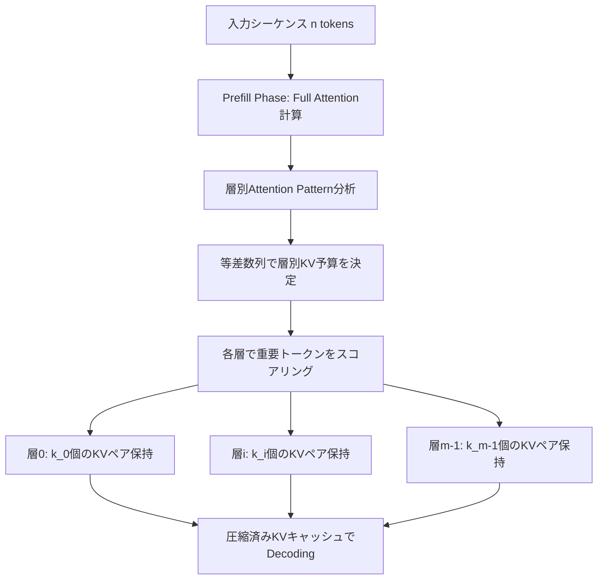

## 論文概要

本記事は [PyramidKV: Dynamic KV Cache Compression based on Pyramidal Information Funneling](https://arxiv.org/abs/2406.02069) の解説記事です。
この記事は [Zenn記事: Neural Garbage Collection―LLMが自ら忘却を学ぶKVキャッシュ管理](https://zenn.dev/0h_n0/articles/a571af34a7694f) の深掘りです。

PyramidKVは、Transformerモデルの各層で注意（attention）パターンが体系的に異なることを実験的に明らかにし、その知見に基づいてKVキャッシュの層別動的圧縮を行う手法である。低層では注意が広範囲に分散し、高層では少数の重要トークンに集中する「ピラミッド型情報集約（Pyramidal Information Funneling）」パターンを活用し、低層に多く・高層に少なくKVキャッシュ予算を配分する。LongBenchにおいてフルKVキャッシュの12%で同等性能を維持し、極端な圧縮（0.7%）でもTRECデータセットで20.5ポイントの精度改善を達成したと報告されている。

## 情報源

- **arXiv ID**: 2406.02069
- **URL**: [https://arxiv.org/abs/2406.02069](https://arxiv.org/abs/2406.02069)
- **著者**: Zefan Cai, Yichi Zhang, Bofei Gao, et al.
- **年**: 2024（初版2024年6月、最新v4 2025年5月）
- **分野**: cs.CL, cs.AI
- **GitHub**: [https://github.com/Zefan-Cai/PyramidKV](https://github.com/Zefan-Cai/PyramidKV)

## 背景と動機

LLMの長文コンテキスト処理では、KVキャッシュのメモリ消費がボトルネックとなる。シーケンス長 $$n$$、層数 $$L$$、ヘッド数 $$h$$、ヘッド次元 $$d$$ のモデルでは、KVキャッシュのメモリ量は $$2 \times L \times h \times n \times d$$ に比例して増大する。32Kトークンのコンテキストを持つLLaMA-3-8Bでは、KVキャッシュだけで約6.7GBを消費する。

従来のKVキャッシュ圧縮手法には、StreamingLLM（初期トークン＋直近トークンの固定保持）、H2O（累積attention scoreによる動的エビクション）、SnapKV（attention scoreに基づくクラスタリング選択）がある。しかし、これらの手法はすべて「全層で同一のKVキャッシュサイズを維持する」という暗黙の前提を置いていた。

著者らは、この前提が適切であるかを検証するため、各層のattentionパターンを定量的に分析した。その結果、低層から高層へと注意パターンが体系的に変化する「ピラミッド型情報集約」を発見し、層ごとに異なるキャッシュ予算を割り当てるべきだという知見を得た。

## 主要な貢献

- **Pyramidal Information Funnelingの発見**: Transformerの低層では注意が全トークンに分散し、中間層で文書単位に局所化し、高層で少数の重要トークンに集中するという段階的パターンを実験的に明らかにした
- **層別動的KVキャッシュ配分**: 等差数列に基づく予算配分アルゴリズムにより、低層に多く・高層に少なくキャッシュを割り当てる手法を提案
- **極端な圧縮下での性能優位性**: KVキャッシュを0.7%（64エントリ）まで圧縮した条件で、固定予算手法に対し最大20.5ポイントの精度改善を達成
- **統一フレームワーク KVCache-Factory**: PyramidKV、SnapKV、H2O、StreamingLLMを統一的に評価できるオープンソースフレームワークを公開

## 技術的詳細

### Pyramidal Information Funneling の定量分析

著者らはLLaMA-3-8Bの各層における注意分布を可視化・定量化した。層 $$l$$ のattention行列 $$\mathbf{A}^{(l)} \in \mathbb{R}^{n \times n}$$ について、注意の集中度を分析すると以下の3段階のパターンが観察される。

- **低層（Layer 0-10）**: 注意が入力トークン全体に概ね均一に分散する。多くのKVペアが情報伝達に寄与しており、大きなキャッシュ予算が必要
- **中間層（Layer 11-21）**: 注意が文書境界やセグメント単位に局所化し始める。適度なキャッシュ予算で対応可能
- **高層（Layer 22-31）**: 注意が少数の「attention sink」トークンに集中する（massive attention現象）。少ないKVペアで十分な情報を保持可能

この段階的変化が「ピラミッド」の名前の由来であり、KVキャッシュ予算を低層で大きく高層で小さくする設計の根拠となっている。

### KVキャッシュ予算配分アルゴリズム

PyramidKVは以下の2ステップで動作する。

**ステップ1: 層別予算の決定**

全層で共有する総KVキャッシュ予算を $$k_{\text{total}}$$、層数を $$m$$ とする。各層 $$i$$（$$i = 0, 1, \ldots, m-1$$）に割り当てるKVキャッシュサイズ $$k^{(i)}$$ を等差数列で決定する。

$$k^{(0)} = \frac{2 \cdot k_{\text{total}}}{m}$$

$$k^{(m-1)} = \frac{k_{\text{total}}}{\beta \cdot m}$$

ここで $$\beta$$ はピラミッド形状を制御するハイパーパラメータである（著者らは $$\beta = 20$$ を推奨）。中間層の予算は以下の等差数列で補間される。

$$k^{(i)} = k^{(0)} + i \cdot \frac{k^{(m-1)} - k^{(0)}}{m - 1}$$

この配分により、低層は高層の $$2\beta$$ 倍のKVキャッシュを保持する。

**ステップ2: 重要トークンの選択**

各層で保持するKVペアの選択には、instruction tokenからのattention scoreを利用する。最後の $$\alpha$$ トークン（指示トークン、著者らは $$\alpha = 8$$ を推奨）を常に保持し、残りは以下のスコアで選択する。

$$s_i^{(l)} = \sum_{j=n-\alpha}^{n} A_{ij}^{(l)}$$

ここで $$A_{ij}^{(l)}$$ は層 $$l$$ における位置 $$i$$ から位置 $$j$$ へのattention weightである。スコア $$s_i^{(l)}$$ が高いトークンから順に $$k^{(l)} - \alpha$$ 個を選択して保持する。

全体の流れを以下に示す。



## 実装のポイント

以下にPyramidKVの予算配分とKV選択の核心部分を示す。実装はKVCache-Factoryリポジトリ（MITライセンス）に基づく。

```python
import torch
from typing import List, Tuple


def compute_pyramid_budget(
    total_budget: int,
    num_layers: int,
    beta: float = 20.0,
    alpha: int = 8,
) -> List[int]:
    """各層のKVキャッシュ予算を等差数列で計算する。

    Args:
        total_budget: 全層で共有するKVキャッシュの総予算
        num_layers: Transformerの層数
        beta: ピラミッド形状パラメータ（大きいほど急勾配）
        alpha: 常時保持するinstruction tokenの数

    Returns:
        各層のKVキャッシュ予算のリスト（低層ほど大きい）
    """
    k_first: float = (2.0 * total_budget) / num_layers
    k_last: float = total_budget / (beta * num_layers)

    budgets: List[int] = []
    for i in range(num_layers):
        k_i = k_first + i * (k_last - k_first) / (num_layers - 1)
        budgets.append(max(int(k_i), alpha))
    return budgets


def select_kv_per_layer(
    attention_weights: torch.Tensor,
    layer_budget: int,
    alpha: int = 8,
) -> torch.Tensor:
    """Attention scoreに基づきKVキャッシュに保持するトークンを選択する。

    Args:
        attention_weights: Attention行列 [batch, heads, seq_len, seq_len]
        layer_budget: この層のKVキャッシュ予算
        alpha: 常時保持する末尾トークン数

    Returns:
        選択されたトークンのインデックス [batch, heads, layer_budget]
    """
    seq_len: int = attention_weights.shape[-1]
    # 末尾alpha個のトークンからのattention scoreを集約
    scores: torch.Tensor = attention_weights[
        :, :, :, seq_len - alpha : seq_len
    ].sum(dim=-1)  # [batch, heads, seq_len]

    # 末尾alphaトークンは常時保持のため候補から除外
    candidate_scores = scores[:, :, : seq_len - alpha]
    num_select: int = layer_budget - alpha

    # 上位スコアのトークンインデックスを取得
    _, top_indices = candidate_scores.topk(
        k=min(num_select, candidate_scores.shape[-1]), dim=-1
    )

    # 末尾alphaトークンのインデックスを追加
    tail_indices = torch.arange(
        seq_len - alpha, seq_len, device=attention_weights.device
    )
    tail_indices = tail_indices.unsqueeze(0).unsqueeze(0).expand_as(
        top_indices[:, :, :alpha]
    )

    selected = torch.cat([top_indices, tail_indices], dim=-1)
    return selected
```

**推奨ハイパーパラメータ**（論文Table 4のアブレーション結果に基づく）:
- $$\beta = 20$$（LongBench平均37.25）。$$\beta = 14$$ でも37.51と安定しており、14-20の範囲で堅牢
- $$\alpha = 8$$（instruction token数）
- `max_capacity_prompts`: タスクに応じて64（極端な圧縮）、128（バランス型）、2048（高品質）

## Production Deployment Guide

PyramidKVを用いた動的KVキャッシュ圧縮付きLLM推論をAWS上にデプロイする構成を示す。

### 1. AWS実装パターン

| 規模 | 月間リクエスト | 推奨構成 | 月額コスト | 主要サービス |
|------|--------------|---------|-----------|------------|
| Small | ~3,000 (100/日) | Serverless | $50-150 | Lambda + Bedrock + DynamoDB |
| Medium | ~30,000 (1,000/日) | Hybrid | $300-800 | Lambda + ECS Fargate + ElastiCache |
| Large | 300,000+ (10,000/日) | Container | $2,000-5,000 | EKS + Karpenter + EC2 Spot |

**Small**: Lambda + Bedrock + DynamoDB。月額内訳: Lambda $5-10、Bedrock $30-100、DynamoDB $5-15。
**Medium**: Fargate推論サーバ + ElastiCache + API Gateway。月額内訳: Fargate $120-200、ElastiCache $80-150、その他 $100-450。
**Large**: EKS + Karpenter Spot GPU（g5系）+ vLLM/TGI統合。月額内訳: EKS $73、Spot GPU $800-2,500、その他 $1,127-2,427。

**コスト削減**: Spot最大90%、RI最大72%、Batch API 50%、Prompt Caching 30-90%削減。

> 上記は2026年4月時点のap-northeast-1概算です。

### 2. Terraformインフラコード

**Small構成（Serverless）の主要リソース**:

```hcl
# PyramidKV推論API - Serverless構成
terraform {
  required_version = ">= 1.9"
  required_providers {
    aws = { source = "hashicorp/aws", version = "~> 5.80" }
  }
}

provider "aws" { region = "ap-northeast-1" }

# VPC（NAT Gateway不使用 - コスト削減）
module "vpc" {
  source  = "terraform-aws-modules/vpc/aws"
  version = "~> 5.16"
  name    = "pyramidkv-vpc"
  cidr    = "10.0.0.0/16"
  azs            = ["ap-northeast-1a", "ap-northeast-1c"]
  public_subnets = ["10.0.1.0/24", "10.0.2.0/24"]
  enable_nat_gateway = false
}

# Lambda（最小権限IAMロール付き）
resource "aws_lambda_function" "inference" {
  function_name = "pyramidkv-inference"
  runtime       = "python3.12"
  handler       = "handler.lambda_handler"
  role          = aws_iam_role.lambda_role.arn
  memory_size   = 512
  timeout       = 30
  filename      = "lambda.zip"
  environment {
    variables = { CACHE_TABLE = aws_dynamodb_table.cache_metadata.name }
  }
}

# DynamoDB（On-Demand + TTL）
resource "aws_dynamodb_table" "cache_metadata" {
  name         = "pyramidkv-cache-metadata"
  billing_mode = "PAY_PER_REQUEST"
  hash_key     = "request_id"
  attribute { name = "request_id"; type = "S" }
  ttl { attribute_name = "expires_at"; enabled = true }
}
```

**Large構成（Container）の主要リソース**:

```hcl
# EKS + Karpenter（Spot優先GPU推論）
module "eks" {
  source  = "terraform-aws-modules/eks/aws"
  version = "~> 20.31"
  cluster_name    = "pyramidkv-cluster"
  cluster_version = "1.31"
  vpc_id     = module.vpc.vpc_id
  subnet_ids = module.vpc.private_subnets
  eks_managed_node_groups = {
    system = { instance_types = ["m6i.large"]; min_size = 2; max_size = 3 }
  }
}

resource "helm_release" "karpenter" {
  name = "karpenter"; repository = "oci://public.ecr.aws/karpenter"
  chart = "karpenter"; version = "1.1.1"; namespace = "kube-system"
}

resource "aws_budgets_budget" "monthly" {
  name = "pyramidkv-monthly"; budget_type = "COST"
  limit_amount = "5000"; limit_unit = "USD"; time_unit = "MONTHLY"
  notification {
    comparison_operator = "GREATER_THAN"; threshold = 80
    threshold_type = "PERCENTAGE"; notification_type = "FORECASTED"
    subscriber_email_addresses = ["ops@example.com"]
  }
}
```

### 3. セキュリティベストプラクティス

- **ネットワーク**: VPCエンドポイント経由でBedrock/DynamoDB接続、パブリックサブネットはALBのみ
- **認証・シークレット**: Cognito/IAM認証、Secrets Manager一元管理（環境変数埋め込み禁止）
- **監査・保護**: CloudTrail + GuardDuty、Transit/At-rest暗号化（TLS 1.3/AES-256）

### 4. 運用・監視設定

**CloudWatch Logs Insightsクエリ（レイテンシ P95/P99）**:

```
fields @timestamp, duration_ms
| filter event = "inference_complete"
| stats percentile(duration_ms, 95) as p95, percentile(duration_ms, 99) as p99
  by bin(5m)
| sort @timestamp desc
```

**CloudWatchアラーム・X-Ray設定（Python）**:

```python
import boto3
from aws_xray_sdk.core import xray_recorder, patch_all
from typing import Any


def create_latency_alarm(
    function_name: str,
    threshold_ms: float = 5000.0,
) -> dict[str, Any]:
    """PyramidKV推論のP99レイテンシアラームを作成する。

    Args:
        function_name: Lambda関数名
        threshold_ms: アラーム閾値（ミリ秒）

    Returns:
        CloudWatch APIレスポンス
    """
    client = boto3.client("cloudwatch", region_name="ap-northeast-1")
    return client.put_metric_alarm(
        AlarmName=f"{function_name}-p99-latency",
        MetricName="Duration",
        Namespace="AWS/Lambda",
        Statistic="p99",
        Period=300,
        EvaluationPeriods=3,
        Threshold=threshold_ms,
        ComparisonOperator="GreaterThanThreshold",
        Dimensions=[{"Name": "FunctionName", "Value": function_name}],
        AlarmActions=["arn:aws:sns:ap-northeast-1:123456789012:ops-alert"],
    )


def init_xray_tracing(service_name: str = "pyramidkv-inference") -> None:
    """X-Rayトレーシングを初期化しKV圧縮をサブセグメントで記録可能にする。

    Args:
        service_name: X-Rayサービス名
    """
    xray_recorder.configure(service=service_name)
    patch_all()
```

Cost Explorer APIの `get_cost_and_usage` を `Tags.Key=Project, Values=["pyramidkv"]` フィルタで呼び出し、`DAILY` 粒度でサービス別コストを集計する週次レポートを設定する。

### 5. コスト最適化チェックリスト

**アーキテクチャ・リソース**:
- [ ] 月間リクエスト数に応じた構成選択（Small/Medium/Large）
- [ ] PyramidKV圧縮率をタスク要件に合わせ調整（128 KV = 1.6%保持で多くのタスクに十分）
- [ ] Batch API（50%削減）・Prompt Caching（30-90%削減）の適用
- [ ] Karpenter Spot優先（最大90%削減）、安定負荷にRI（最大72%削減）
- [ ] EBSをgp3統一、不要NAT GatewayをVPCエンドポイントに代替

**LLM・監視**:
- [ ] KV予算を精度許容範囲内で最小化、量子化（fp16→int8）の影響評価
- [ ] Budgets 80%アラート、Cost Explorer週次レポート、Trusted Advisor月次確認

## 実験結果

### LongBenchベンチマーク

著者らはLLaMA-3-8B-InstructおよびMistral-7B-Instructを用いて、17データセット・6カテゴリのLongBenchで評価を行った。以下はLLaMA-3-8Bでの代表的な結果である（論文Table 1およびTable 2より）。

| 手法 | KVサイズ | メモリ | TREC | QMSum | 平均スコア |
|------|---------|--------|------|-------|-----------|
| FullKV | 8192 | 6,723MB | 68.00 | 23.40 | 39.52 |
| StreamingLLM | 128 | 107MB | 43.50 | 16.58 | 32.00 |
| H2O | 128 | 107MB | 38.50 | 18.54 | 35.37 |
| SnapKV | 128 | 107MB | 45.00 | 19.15 | 35.50 |
| **PyramidKV** | **128** | **107MB** | **66.50** | **18.97** | **37.25** |

KVサイズ128（フルキャッシュの1.6%）でPyramidKVはTRECで66.50を達成し、SnapKV（45.00）を21.5ポイント上回った。平均スコアでも37.25と、全圧縮手法の中で最高値を記録している。

### Needle-in-a-Haystack

LLaMA-3-70Bを用いた長文コンテキスト（最大32Kトークン）での情報検索テストでは、128 KVエントリのみで100.0%の精度を達成したと報告されている。他の圧縮手法では同条件で大幅な精度低下が観測されており、PyramidKVの層別配分が長文理解能力の保持に寄与していることが示唆される。

### ハイパーパラメータの感度分析

論文Table 4では $$\beta$$ パラメータの影響を検証している。$$\beta = 14$$ で37.51、$$\beta = 20$$ で37.25と、広範囲で安定した性能を示しており、ハイパーパラメータチューニングの負荷が低い手法であることが確認されている。

## 実運用への応用

### Zenn記事（NGC）との関連

PyramidKVは、関連Zenn記事で解説されているNGC（Neural Garbage Collection, arXiv:2604.18002）の主要な比較対象である。両手法はKVキャッシュ圧縮という同一の課題に取り組むが、アプローチが根本的に異なる。

- **PyramidKV**: ヒューリスティック（attention patternの観察に基づく等差数列配分）。追加学習不要で即座に適用可能
- **NGC**: 強化学習（Gumbel-Top-kによる離散アクション選択をタスク報酬から学習）。タスク固有の最適化が可能だが学習コストが発生

NGCの論文では、PyramidKVが推論タスク（Countdown課題）で21.2%にとどまるのに対し、NGCは49.6%を達成したと報告されている。これは、PyramidKVのヒューリスティックな予算配分が「どのトークンが推論に必要か」を十分に捉えられない場合があることを示唆している。

### プロダクション視点

PyramidKVは追加学習なしでモデルのKVキャッシュを大幅に削減できるため、既存のLLMサービスへの導入障壁が低い。特に以下のユースケースで有効と考えられる。

- **長文要約・QA**: LongBenchの結果が示す通り、12%のKVキャッシュで十分な性能を維持
- **メモリ制約環境**: エッジデバイスや小規模GPUでの推論時にKVキャッシュ量を削減
- **スループット最適化**: KVキャッシュ削減によりバッチサイズを拡大し、同一GPUでより多くのリクエストを処理

一方、推論チェーン（Chain-of-Thought）のような逐次的な論理展開が必要なタスクでは、ヒューリスティックな予算配分の限界が顕在化する可能性がある。そのようなケースではNGCのような学習ベースの手法が適している。

## 関連研究

- **StreamingLLM**（Xiao et al., 2023）: 初期トークン（attention sink）と直近トークンのみを保持する固定方式。シンプルだが中間の重要トークンを失うリスクがある
- **H2O**（Zhang et al., 2023）: 累積attention scoreに基づく動的エビクション。全層同一予算のため、層ごとの注意パターンの違いを活用できない
- **SnapKV**（Li et al., 2024）: Observation windowのattention scoreをクラスタリングして重要トークンを選択。PyramidKVと同様にattention scoreベースだが、全層同一予算という制約を共有する
- **NGC**（arXiv:2604.18002, 2026）: 強化学習でKVキャッシュ除去を最適化。PyramidKVのヒューリスティックな限界を学習で克服するが、追加の訓練コストが必要

PyramidKVの独自性は「層間のattention pattern差異」に着目した点にある。SnapKVやH2Oが「どのトークンを残すか」の選択精度を高めるのに対し、PyramidKVは「各層にどれだけのキャッシュを割り当てるか」という上位の設計判断を最適化している。

## まとめと今後の展望

PyramidKVは、Transformerの注意パターンが層によって体系的に異なるという実験的発見に基づき、KVキャッシュの層別動的配分を実現した手法である。フルKVキャッシュの12%で同等性能を維持できることはプロダクション環境でのLLM運用に大きな意味を持つ。

一方で、以下の限界も存在する。英語のみでの評価であること、テストモデルがLLaMA-3-8BとMistral-7Bに限定されていること、そしてヒューリスティックな予算配分が推論集約型タスクでは最適でない可能性がある点である。NGCのような学習ベースの手法との組み合わせ---例えば、PyramidKVの等差数列予算を初期値として強化学習で微調整する---は、今後の有望な研究方向と考えられる。

## 参考文献

- [PyramidKV: Dynamic KV Cache Compression based on Pyramidal Information Funneling (arXiv:2406.02069)](https://arxiv.org/abs/2406.02069)
- [KVCache-Factory GitHub リポジトリ](https://github.com/Zefan-Cai/PyramidKV)
- [Zenn記事: Neural Garbage Collection―LLMが自ら忘却を学ぶKVキャッシュ管理](https://zenn.dev/0h_n0/articles/a571af34a7694f)

:::message
この記事はAI（Claude Code）により自動生成されました。内容の正確性については原論文もご確認ください。
:::
