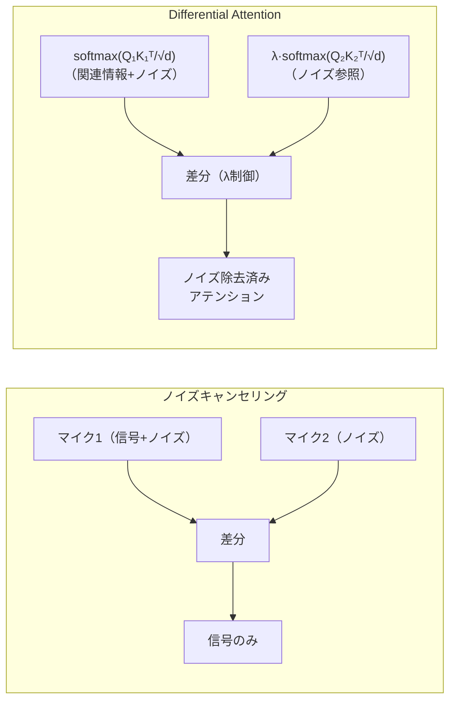

> **本記事は [Differential Transformer (arXiv:2410.05258)](https://arxiv.org/abs/2410.05258) の解説記事です。ICLR 2025 Oral 採択論文。**

## 論文概要（Abstract）

Differential Transformerは、2つのsoftmaxアテンションマップの差分をアテンションスコアとして使用する手法である。著者ら（Tianzhu Ye, Li Dong, Yuqing Xia, Yutao Sun, Yi Zhu, Gao Huang, Furu Wei）は、標準Transformerが関連性の低いトークンにもアテンション重みを分散させる「アテンションノイズ」問題に着目し、ノイズキャンセリングの原理を応用してこれを解決した。3Bおよび13Bスケールの実験において、同等性能を達成するために必要なモデルサイズが約65%に削減されると報告している。

この記事は [Zenn記事: Attention機構の全史 Bahdanauから FlashAttention4・MLAまでの数学と実装](https://zenn.dev/0h_n0/articles/b03b57bf327edf) の深掘りです。

## 情報源

- **会議名**: ICLR 2025（International Conference on Learning Representations）
- **年**: 2025
- **URL**: [https://arxiv.org/abs/2410.05258](https://arxiv.org/abs/2410.05258)
- **著者**: Tianzhu Ye, Li Dong, Yuqing Xia, Yutao Sun, Yi Zhu, Gao Huang, Furu Wei
- **発表形式**: Oral

## カンファレンス情報

ICLRは機械学習・深層学習分野の最高峰会議の一つであり、表現学習（Representation Learning）に焦点を当てている。Differential Transformerは**Oral**として採択されており、これは全投稿のうち上位数%に相当する高い評価を受けたことを意味する。

## 技術的詳細（Technical Details）

### アテンションノイズ問題

標準的なSelf-Attentionでは、softmax関数の性質上、すべてのトークンに対してゼロでないアテンション重みが割り当てられる。理論的には無関係なトークンの重みは限りなく小さくなるはずだが、実際には多数の無関係トークンへの小さな重みの合計が無視できない大きさになり得る。

著者らはこれを「アテンションノイズ」と定義し、以下の問題を引き起こすと指摘している。
- **ハルシネーション**: 無関係な情報へのアテンションが誤った生成を促進
- **長文コンテキストでの精度低下**: コンテキストが長くなるほどノイズの累積効果が増大
- **活性化値の外れ値**: 特定トークンへのアテンション集中（attention sink）と分散の不均衡

### Differential Attentionの数式

Differential Attentionの核心は、Query（Q）とKey（K）をそれぞれ2つのグループに分割し、2つのアテンションマップの差分を計算することにある。

$$
\text{DiffAttn}(X) = \left(\text{softmax}\left(\frac{Q_1 K_1^\top}{\sqrt{d}}\right) - \lambda \cdot \text{softmax}\left(\frac{Q_2 K_2^\top}{\sqrt{d}}\right)\right) V
$$

ここで、
- $Q_1, Q_2 \in \mathbb{R}^{n \times d}$: Queryを2グループに分割したもの
- $K_1, K_2 \in \mathbb{R}^{n \times d}$: Keyを2グループに分割したもの
- $V \in \mathbb{R}^{n \times 2d}$: Value（元の次元を維持）
- $\lambda$: 学習可能なスカラーパラメータ（ノイズ除去強度を制御）
- $d$: 各グループのヘッド次元（元の $d_k$ の半分）
- $n$: シーケンス長

**分割方法**: 元のヘッド次元 $d_k$ を半分に分割する。$h$ ヘッドのMHAをDifferential Attentionに置換する場合、各ヘッドの $Q, K$ を半分ずつの $Q_1, Q_2, K_1, K_2$ に分割する。パラメータ数は増加しない。

### ノイズキャンセリングとの対応

著者らは、この機構がノイズキャンセリングヘッドフォンの原理と数学的に類似していると説明している。



2つのアテンションマップはどちらも同じ入力から計算されるが、異なる重み行列を通すことで、共通するノイズ成分を打ち消し合い、タスクに関連する信号成分を強調する。

### λパラメータの初期化と学習

$\lambda$ は層ごとの学習可能パラメータであり、著者らは以下の初期化スケジュールを報告している（論文Section 3.2より）。

$$
\lambda_{\text{init}} = 0.8 - 0.6 \cdot \exp(-0.3 \cdot (l - 1))
$$

ここで $l$ は層インデックス（1始まり）。浅い層では $\lambda$ が小さく（差分が控えめ）、深い層では $\lambda$ が大きく（差分が強調される）初期化される。

**数値安定性の注意**: 著者らは、FP16学習で $\lambda$ が負値になり学習が不安定化するケースを認識しており、BF16での学習を推奨している。

### グループノーマライゼーション

各ヘッドの差分アテンション出力に対してグループノーマライゼーションを適用することで、学習の安定化を図っている。

$$
\hat{O}_i = \text{GroupNorm}(O_i) \cdot (1 - \lambda_{\text{init}}) + \lambda_{\text{init}}
$$

このリスケーリングにより、初期段階ではDifferential Attentionの出力が標準アテンションに近い振る舞いをし、学習が進むにつれてノイズキャンセリング効果が増大する。

### 実装例

```python
import torch
import torch.nn as nn
import torch.nn.functional as F

class DifferentialAttention(nn.Module):
    def __init__(
        self,
        d_model: int,
        n_heads: int,
        layer_idx: int,
    ):
        super().__init__()
        self.n_heads = n_heads
        self.d_head = d_model // n_heads
        self.d_half = self.d_head // 2

        self.W_q = nn.Linear(d_model, d_model, bias=False)
        self.W_k = nn.Linear(d_model, d_model, bias=False)
        self.W_v = nn.Linear(d_model, d_model, bias=False)
        self.W_o = nn.Linear(d_model, d_model, bias=False)

        # λ: 層ごとの学習可能パラメータ
        lambda_init = 0.8 - 0.6 * torch.exp(
            torch.tensor(-0.3 * (layer_idx - 1), dtype=torch.float32)
        )
        self.lambda_param = nn.Parameter(
            torch.full((1,), lambda_init.item())
        )

        self.group_norm = nn.GroupNorm(
            num_groups=n_heads, num_channels=d_model
        )

    def forward(self, x: torch.Tensor) -> torch.Tensor:
        B, T, D = x.shape

        q = self.W_q(x).view(B, T, self.n_heads, self.d_head)
        k = self.W_k(x).view(B, T, self.n_heads, self.d_head)
        v = self.W_v(x).view(B, T, self.n_heads, self.d_head)

        # Q, K を2グループに分割
        q1, q2 = q[..., :self.d_half], q[..., self.d_half:]
        k1, k2 = k[..., :self.d_half], k[..., self.d_half:]

        q1, q2 = q1.transpose(1, 2), q2.transpose(1, 2)
        k1, k2 = k1.transpose(1, 2), k2.transpose(1, 2)
        v = v.transpose(1, 2)

        scale = self.d_half ** -0.5

        # 2つのアテンションマップを計算
        attn1 = F.softmax(q1 @ k1.transpose(-2, -1) * scale, dim=-1)
        attn2 = F.softmax(q2 @ k2.transpose(-2, -1) * scale, dim=-1)

        # 差分アテンション
        diff_attn = attn1 - self.lambda_param * attn2

        output = diff_attn @ v
        output = output.transpose(1, 2).contiguous().view(B, T, D)

        # グループノーマライゼーション
        output = self.group_norm(output.transpose(1, 2)).transpose(1, 2)

        return self.W_o(output)
```

## 実装のポイント（Implementation）

**既存コードへの導入**: Differential Attentionは標準的なMHAのアテンション計算部分のみを置換するため、Transformerの他の部分（FFN、Layer Norm等）はそのまま使用できる。著者らの実装は [microsoft/unilm](https://github.com/microsoft/unilm) リポジトリで公開されている（MITライセンス）。

**FlashAttentionとの統合**: 現時点では、Differential Attention専用のFlashAttentionカーネルは限定的である。2つのsoftmaxを個別に計算する必要があるため、標準FlashAttentionを2回呼び出す実装が一般的だが、メモリ帯域幅の観点では最適ではない。今後の統合最適化が期待される。

**精度に関する注意**: $\lambda$ の符号が負になるとアテンションの意味が逆転し学習が破綻する。BF16を使用し、$\lambda$ にクリッピング（$\lambda \geq 0$）を適用することが推奨される。

## Production Deployment Guide

### AWS実装パターン（コスト最適化重視）

Differential Transformer搭載モデルの推論構成を示す。

| 規模 | 月間リクエスト | 推奨構成 | 月額コスト概算 | 主要サービス |
|------|--------------|---------|---------------|------------|
| **Small** | ~3,000 | API利用 | $50-200 | Bedrock / SageMaker Serverless |
| **Medium** | ~30,000 | Managed Endpoint | $2,000-4,000 | SageMaker (g5.xlarge × 2) |
| **Large** | 300,000+ | Self-managed | $6,000-15,000 | EKS + g5/p5 |

**コスト試算の注意事項**: 上記は2026年4月時点のAWS東京リージョン料金に基づく概算値。Differential Transformer固有のコスト増（2回のsoftmax計算）は標準Transformerと比較して5-10%程度であり、モデルサイズ削減効果（同等性能で65%のサイズ）によるコスト削減がこれを上回る。

### Terraformインフラコード

```hcl
resource "aws_sagemaker_model" "diff_transformer" {
  name               = "diff-transformer-inference"
  execution_role_arn = aws_iam_role.sagemaker.arn

  primary_container {
    image = "763104351884.dkr.ecr.ap-northeast-1.amazonaws.com/pytorch-inference:2.3.0-gpu-py311-cu121-ubuntu22.04-sagemaker"
    model_data_url = "s3://${aws_s3_bucket.model.bucket}/diff-transformer/model.tar.gz"
    environment = {
      MODEL_TYPE          = "differential_transformer"
      USE_BF16            = "true"
      LAMBDA_CLIPPING     = "true"
    }
  }
}

resource "aws_sagemaker_endpoint_configuration" "diff_transformer" {
  name = "diff-transformer-config"

  production_variants {
    variant_name  = "default"
    model_name    = aws_sagemaker_model.diff_transformer.name
    instance_type = "ml.g5.2xlarge"
    initial_instance_count = 2
  }
}

resource "aws_cloudwatch_metric_alarm" "hallucination_rate" {
  alarm_name          = "diff-transformer-hallucination"
  comparison_operator = "GreaterThanThreshold"
  evaluation_periods  = 3
  metric_name         = "HallucinationRate"
  namespace           = "Custom/DiffTransformer"
  period              = 3600
  statistic           = "Average"
  threshold           = 0.05
  alarm_description   = "ハルシネーション率5%超過: モデル/プロンプトの見直しを検討"
}
```

### コスト最適化チェックリスト

- [ ] Diff Transformerのモデルサイズ削減効果（65%）でGPUコスト削減
- [ ] BF16推論で精度維持しつつスループット向上
- [ ] SageMaker Autoscaling設定（リクエスト量に応じたスケール）
- [ ] Spot Instances活用（SageMaker Managed Spot Training）
- [ ] プロンプトキャッシュでRAGタスクのレイテンシ削減
- [ ] CloudWatch アラーム設定（GPU使用率、レイテンシ）
- [ ] AWS Budgets月額予算アラート
- [ ] 開発環境エンドポイント夜間削除（自動化）
- [ ] Cost Anomaly Detection有効化
- [ ] ハルシネーション率のカスタムメトリクス監視

## 実験結果（Results）

著者らが報告している主要な実験結果を以下にまとめる。

**スケーリング実験（論文Table 1-2より）**:

| 構成 | Transformer | Diff Transformer | 備考 |
|------|------------|-----------------|------|
| 3B, 1T tokens | ベースライン | 同等性能 | Diff Transformerは約65%のパラメータで同等性能 |

**タスク別の改善（論文Section 4より）**:

| タスク | 改善内容 |
|--------|---------|
| 長文コンテキスト情報検索（RULER） | 標準Transformer比で顕著な改善 |
| ハルシネーション低減（TruthfulQA） | 著者らはQA・要約タスクで改善を報告 |
| In-context Learning（MultiNLI） | +3.2ポイントの精度向上 |
| 活性化値外れ値 | 外れ値の大幅削減を報告 |

**制約事項**: 実験は主に3Bおよび同等規模でのスケーリング比較であり、70B以上の大規模モデルでの検証は本論文では報告されていない。また、FlashAttention統合カーネルが未整備のため、実際の推論速度は標準Transformerと比較して若干のオーバーヘッドが生じうる。

## 実運用への応用（Practical Applications）

Differential Transformerの実運用上の価値は、特に以下の2つのユースケースで顕在化する。

**RAG（Retrieval-Augmented Generation）**: 大量の検索結果をコンテキストに含めるRAGパイプラインでは、無関係なドキュメントのノイズがハルシネーションの原因となりうる。Differential Attentionのノイズ除去効果は、RAGの信頼性向上に直接寄与する。

**長文コンテキスト処理**: 128K-1Mトークンのコンテキストを扱う場合、アテンションノイズの累積は深刻な問題となる。Differential Attentionは長文コンテキストでの情報検索精度を改善し、attention sinkの軽減にも効果がある。

ただし、新規モデルの事前学習が必要であり、既存モデルの後付け改造は困難である。ファインチューニングでの部分的導入可能性は、著者らの後続研究（Revisiting Differential Attention, 2025）で検討されている。

## まとめと今後の展望

Differential Transformerは、ノイズキャンセリングの原理をアテンション機構に応用した手法であり、2つのsoftmaxの差分という比較的シンプルな変更で、ハルシネーション低減・長文コンテキスト精度向上・活性化値外れ値削減を同時に実現した。ICLR 2025でOralとして採択されたことは、この手法の学術的新規性と実用的価値の高さを示している。

今後の方向性としては、FlashAttention統合カーネルの開発、既存モデルへのファインチューニング適用、およびMLAやGQAとの組み合わせが考えられる。

## 参考文献

- **Conference URL**: [https://iclr.cc/virtual/2025/oral/31859](https://iclr.cc/virtual/2025/oral/31859)
- **arXiv**: [https://arxiv.org/abs/2410.05258](https://arxiv.org/abs/2410.05258)
- **Code**: [https://github.com/microsoft/unilm](https://github.com/microsoft/unilm)（MITライセンス）
- **Microsoft Research**: [https://www.microsoft.com/en-us/research/publication/differential-transformer/](https://www.microsoft.com/en-us/research/publication/differential-transformer/)
- **Related Zenn article**: [https://zenn.dev/0h_n0/articles/b03b57bf327edf](https://zenn.dev/0h_n0/articles/b03b57bf327edf)
