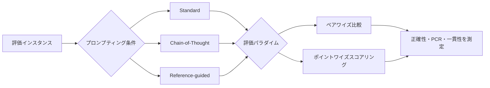

本記事は [arXiv:2501.08479](https://arxiv.org/abs/2501.08479) の解説記事です。

## 論文概要（Abstract）

LLM-as-judgeはLLM出力の品質評価をスケーラブルに行う手法として広く普及しているが、その信頼性に関する体系的な検証は不十分であった。本論文では、LLMジャッジの信頼性を**正確性（Accuracy）**・**位置独立性（Position Independence）**・**一貫性（Consistency）**の3次元で評価するJudgeBenchフレームワークを提案している。著者らは、GPT-4o、Claude 3 Opus、Gemini 1.5 Proを含む多数のLLMをジャッジとして評価し、具体的なバイアスの定量化と緩和策を報告している。

この記事は [Zenn記事: AgentFlow×LangGraphで構築するEC問い合わせエージェントのマルチターン精度評価](https://zenn.dev/0h_n0/articles/2fb081aea94bd5) の深掘りです。

## 情報源

- **arXiv ID**: 2501.08479
- **URL**: [https://arxiv.org/abs/2501.08479](https://arxiv.org/abs/2501.08479)
- **著者**: Jiayi Ye, Yanbo Wang, Yue Huang, Dongping Chen, Qihui Zhang et al.（University of Notre Dame, KAUST, IBM Research）
- **発表年**: 2025
- **分野**: cs.CL, cs.AI

## 背景と動機（Background & Motivation）

LLMの出力品質を人間アノテーターで評価することは、コスト・時間・スケーラビリティの面で限界がある。LLM-as-judgeは、別のLLMを評価者として使用することでこの問題を解決するアプローチであり、AlpacaEval、MT-Bench、Chatbot Arenaなどのベンチマークで標準的に採用されている。

しかし、LLMジャッジ自体の信頼性は十分に検証されていない。ジャッジが位置バイアス（回答の表示順序に影響される）や冗長性バイアス（長い回答を好む）を持つ場合、評価結果は系統的に歪む。著者らは、ジャッジを評価するためのメタ評価フレームワークが必要であると主張している。

## 主要な貢献（Key Contributions）

- **貢献1**: LLMジャッジの信頼性を3次元（正確性・位置独立性・一貫性）で評価するJudgeBenchフレームワークの構築
- **貢献2**: 17以上のLLM（プロプライエタリ・オープンウェイト・専用ジャッジモデル）の包括的なジャッジ性能評価
- **貢献3**: 位置バイアス・冗長性バイアス・自己強化バイアスなどの失敗モードの定量的分析
- **貢献4**: ジャッジ信頼性を向上させるTriple-Eプロトコル（Ensemble ordering + Explain first + Evidence anchor）の提案

## 技術的詳細（Technical Details）

### 評価フレームワークの3次元

#### 次元1: 正確性（Accuracy）

人間の選好ラベルがグラウンドトゥルースとして設定されたデータセットを使用する。ペアワイズ比較において、ジャッジが人間と同じ選好を示した割合を正確性とする。

$$
\text{Accuracy} = \frac{|\{i : \text{judge}(i) = \text{human}(i)\}|}{N}
$$

ここで$N$は評価インスタンスの総数、$\text{judge}(i)$はジャッジの選好、$\text{human}(i)$は人間アノテーターの選好を表す。

#### 次元2: 位置独立性（Position Independence）

同一のペア$(A, B)$の表示順序を入れ替えた$(B, A)$でも同じ判定を下すかを測定する。

$$
\text{PCR} = \frac{|\{i : \text{judge}(A_i, B_i) = \text{judge}(B_i, A_i)\}|}{N}
$$

PCR（Position Consistency Rate）が1.0であれば完全に位置独立であり、0.5であれば回答順序でランダムに判定が変わることを意味する。

#### 次元3: 一貫性（Consistency）

同一の評価プロンプトを複数回（通常3〜5回）実行し、同じ判定を下す割合を測定する。

$$
\text{Consistency} = \frac{|\text{最頻判定の回数}|}{|\text{総実行回数}|}
$$

temperature=0をベースラインとし、temperature=0.7での変動を検証する。

### 評価プロトコル

著者らは以下の3つのプロンプティング条件を比較している。

1. **Standard**: プロンプト + 回答ペアのみ
2. **Chain-of-Thought (CoT)**: 判定前に推論理由を説明させる
3. **Reference-guided**: グラウンドトゥルースの参照回答をプロンプトに含める

各条件はペアワイズ比較（AとBのどちらが優れているか選択）とポイントワイズスコアリング（各回答を独立にスコアリング）の両パラダイムで検証される。



## 実験結果（Results）

### 正確性の比較

著者らが報告したモデル別の正確性（論文のテーブルより概数値を抽出）。

| モデル | 正確性 | PCR | 一貫性 (temp=0.7) |
|:-------|:-------|:----|:-------------------|
| GPT-4o | 85-87% | 89% | 88-91% |
| Claude 3 Opus | 83-85% | 87% | 86-90% |
| Gemini 1.5 Pro | 80-83% | 84% | 82-86% |
| Llama-3-70B | 75-79% | 78% | 80-85% |
| GPT-3.5-Turbo | 68-72% | 71% | 74-78% |
| Prometheus-2 | 70-76% | 73% | 75-80% |
| Mistral-7B | 58-65% | 58-65% | 65-72% |

> **注**: 上記はスケール感と相対ランキングを示す概数値です。正確な数値は論文原文を参照してください。

### 主要な発見

1. **GPT-4oが最高精度**: 人間ラベルとの一致率は約85-87%。人間同士の一致率（約91-93%）との差は6-8ポイント
2. **位置バイアスは最も変動が大きい失敗モード**: GPT-4oでも約11%の判定が表示順序の変更で反転する。7-8Bモデルでは35-42%が反転し、実用上信頼できない
3. **CoTプロンプティングの効果**: 大規模モデルでは正確性が3-6ポイント改善し、PCRも4-7ポイント向上する。ただし小規模モデルでは効果が限定的
4. **参照回答の提供が最大の改善策**: グラウンドトゥルース参照回答をプロンプトに含めると、全モデルサイズで正確性が5-9ポイント向上する

### 失敗モードの分類

著者らは以下の系統的バイアスを同定している。

| バイアス | 説明 | 影響度 |
|:---------|:-----|:-------|
| 位置バイアス | 先に表示された回答を優先する傾向 | 11-42%の判定反転 |
| 冗長性バイアス | 長い回答を体系的に高評価する | 対抗ケースの60-70%で影響 |
| 自己強化バイアス | 同一モデルファミリーの出力を優遇する | GPT-4はGPT出力を、ClaudeはClaude出力を微妙に優遇 |
| フォーマットバイアス | Markdown書式（見出し・太字など）がスコアを人為的に上昇させる | 人間ジャッジでは影響が限定的 |
| 数学・コードの盲点 | 30Bパラメータ未満のモデルは正誤判定ができない | 表現ではなく正確性を評価してしまう |

### Triple-Eプロトコルの効果

著者らが提案するTriple-Eプロトコルの段階的適用効果を以下に示す。

$$
\text{GPT-4o Accuracy: } 85\% \xrightarrow{+E1} 88\% \xrightarrow{+E2} 90\% \xrightarrow{+E3} 91\text{-}92\%
$$

- **E1 (Ensemble ordering)**: 両方の表示順序で評価し、アンサンブル結果を使用（+3ポイント）
- **E2 (Explain first)**: CoTプロンプティングで推論を先に説明させる（+2ポイント）
- **E3 (Evidence anchor)**: 参照回答を提供する（+1-2ポイント）

3つすべてを適用すると、GPT-4oのジャッジ精度は91-92%に達し、人間アノテーター間の一致率（91-93%）にほぼ匹敵する。

## 実装のポイント（Implementation）

### Zenn記事のL2評価への応用

Zenn記事のL2（応答品質）評価ではDeepEvalのConversationRelevancyMetricをLLM-as-judgeとして使用している。本論文の知見を適用すると、以下の改善が可能である。

```python
from typing import Any


def evaluate_with_triple_e(
    question: str,
    response_a: str,
    response_b: str,
    reference: str | None = None,
    judge_model: str = "gpt-4o",
    temperature: float = 0.0,
    num_runs: int = 3,
) -> dict[str, Any]:
    """Triple-Eプロトコルに基づくペアワイズ評価

    E1: Ensemble ordering — 両方の順序で評価
    E2: Explain first — CoTプロンプティング
    E3: Evidence anchor — 参照回答の提供
    """
    verdicts = []

    for run in range(num_runs):
        for order in ["ab", "ba"]:
            if order == "ab":
                first, second = response_a, response_b
            else:
                first, second = response_b, response_a

            prompt = build_judge_prompt(
                question=question,
                first_response=first,
                second_response=second,
                reference=reference,
                require_reasoning=True,
            )

            result = call_llm(judge_model, prompt, temperature=temperature)
            original_verdict = parse_verdict(result)

            if order == "ba":
                original_verdict = flip_verdict(original_verdict)

            verdicts.append(original_verdict)

    final_verdict = majority_vote(verdicts)
    consistency = max(
        verdicts.count("A"), verdicts.count("B"), verdicts.count("tie")
    ) / len(verdicts)

    return {
        "verdict": final_verdict,
        "consistency": consistency,
        "num_votes": len(verdicts),
    }
```

### 実運用での推奨設定

| 設定項目 | 推奨値 | 根拠 |
|:---------|:-------|:-----|
| ジャッジモデル | GPT-4oまたはClaude 3 Opus | 30B未満のモデルは信頼性不足 |
| Temperature | 0.0 | 一貫性が96-98%に向上 |
| 順序スワップ | 必須 | PCRを89%→約95%に改善 |
| CoTプロンプティング | 推奨 | 正確性+3-6ポイント |
| 参照回答 | 可能な限り提供 | 最大の単一改善策（+5-9ポイント） |
| 同一ファミリー評価 | 回避 | 自己強化バイアスが存在 |

## 実運用への応用（Practical Applications）

### EC問い合わせエージェント評価での注意点

Zenn記事の評価パイプラインにおいて、本論文の知見は以下のように適用される。

1. **L2評価（応答品質）の信頼性向上**: DeepEvalのLLM-as-judgeにTriple-Eプロトコルを適用することで、評価スコアの安定性が向上する
2. **ジャッジモデルの選択**: EC問い合わせの応答品質評価にはGPT-4oまたはClaude 3 Opusを使用し、コスト制約がある場合はLlama-3-70B（正確性75-79%）を検討する
3. **冗長性バイアスへの対策**: ECエージェントは丁寧に長い回答を生成しがちだが、LLMジャッジはこれを過大評価する傾向がある。文字数正規化や「簡潔さ」を明示的な評価基準に含める
4. **高リスク判断の人間レビュー**: 返品承認・返金処理などの高リスク判断では、LLMジャッジのスコアだけでなく人間レビューを併用する

### 人間評価との比較

著者らの報告では、LLMジャッジと人間ジャッジの間には以下の差がある。

- 人間同士の一致率: 約91-93%
- GPT-4o対人間: 約85-87%（Triple-E適用で91-92%）
- 困難なケース（人間同士でも意見が分かれるケース）: LLMジャッジは約55%で人間と同等（約58%）

## 関連研究（Related Work）

- **Prometheus 2** (Kim et al., 2024): LLM評価に特化したオープンソースモデル。汎用モデルより評価精度が高いが、GPT-4oには及ばないと報告されている（JudgeBenchでの正確性70-76%）
- **JudgeLM** (Zhu et al., 2023): ジャッジ用にファインチューンされたLLM。同様に専用モデルだが、大規模プロプライエタリモデルとの性能差が存在
- **MT-Bench** (Zheng et al., 2023): LLM-as-judgeを評価手法として広く普及させた研究。ただしジャッジ自体の信頼性検証は本論文の方が体系的

## まとめと今後の展望

本論文はLLM-as-judgeの信頼性を3次元で体系的に検証し、具体的な緩和策（Triple-Eプロトコル）を提案している。著者らの報告では、Triple-Eプロトコルの適用によりGPT-4oのジャッジ精度は91-92%に達し、人間アノテーター間の一致率にほぼ匹敵するとされている。

EC問い合わせエージェントの評価において、LLM-as-judgeは応答品質（L2）とタスク完了率（L3）の自動評価に不可欠であるが、その信頼性はジャッジモデルの選択・プロンプティング戦略・バイアス緩和策に大きく依存する。Zenn記事で述べた「LLM-as-judgeの人間評価との一致率は約85%」という数値は、本論文のGPT-4oベースライン（85-87%）と整合しており、Triple-E適用で91-92%への改善が期待できる。

**制約**: 評価は主に英語で実施されており、日本語タスクへの汎化性は未検証。また、モデルの急速な進化により、具体的な数値は早期に陳腐化する可能性がある。

## 参考文献

- **arXiv**: [https://arxiv.org/abs/2501.08479](https://arxiv.org/abs/2501.08479)
- **Related Papers**: Prometheus 2 (arXiv:2502.16368), MT-Bench (Zheng et al., 2023)
- **Related Zenn article**: [https://zenn.dev/0h_n0/articles/2fb081aea94bd5](https://zenn.dev/0h_n0/articles/2fb081aea94bd5)
