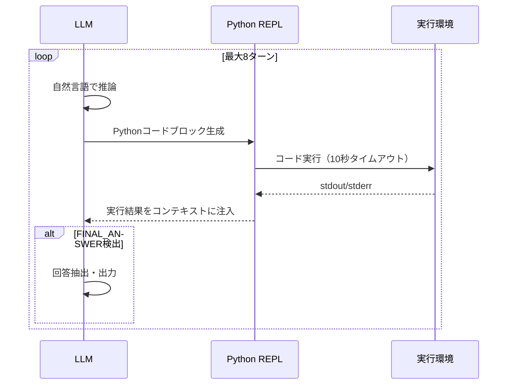

## 論文概要（Abstract）

本記事は [Scaling LLM Test-Time Compute with REPL (arXiv:2502.06807)](https://arxiv.org/abs/2502.06807) の解説記事です。

この論文は、LLMの推論時にPython REPL（Read-Eval-Print Loop）環境を統合し、自然言語推論と実行可能コードを交互に生成することでテスト時計算をスケーリングする手法を提案している。著者らは、MATHベンチマークでCoT比+8.3%、AIME 2024でBest-of-8比+6.7%の精度向上を報告しており、Best-of-Nサンプリングよりも少ないトータルトークン数で高い精度を達成している。新規ベンチマークSciREPL（科学計算500問）も公開されている。

この記事は [Zenn記事: Recursive Language Models コンテキスト100倍超を実現する推論手法](https://zenn.dev/0h_n0/articles/acfc7763441dd1) の深掘りです。RLMが使用するREPL環境の原理と応用可能性を理解するための参考資料として位置づけられる。

## 情報源

- **arXiv ID**: 2502.06807
- **URL**: [https://arxiv.org/abs/2502.06807](https://arxiv.org/abs/2502.06807)
- **著者**: Sizhe Wang, Da Yin, Ziru Chen, Huan Sun
- **発表年**: 2025
- **分野**: cs.CL, cs.LG

## 背景と動機（Background & Motivation）

LLMの推論能力を向上させるアプローチとして、テスト時計算（test-time compute）のスケーリングが注目されている。Chain-of-Thought（CoT）やBest-of-Nサンプリングが代表的だが、いずれも課題がある。CoTは自然言語のみで中間計算を行うため算術ミスが発生しやすい。Best-of-Nは$N$個の独立した解を生成するためトークン消費が$N$倍になり、統計的にも同種のエラーを繰り返しやすい。

著者らはPython REPLを「外部化されたスクラッチパッド」として活用することで、中間計算の正確性を保証しつつ適応的にテスト時計算をスケーリングする手法を提案している。REPL経由の計算結果はPythonインタープリタが保証するため、CoTにおける算術ミスの主要因を排除できる。

## 主要な貢献（Key Contributions）

- **貢献1**: 自然言語推論とPythonコード実行を交互に行うREPLベースの推論フレームワークの提案
- **貢献2**: 85K（数学）+43K（科学）のREPL軌道データセットの構築とSFT学習パイプライン
- **貢献3**: Best-of-Nよりも少ないトークンで高い精度を達成する適応的スケーリングの実証
- **貢献4**: 科学計算500問の新規ベンチマークSciREPLの公開（Apache 2.0ライセンス）

## 技術的詳細（Technical Details）

### REPLフレームワークの構造

フレームワークの中核は、LLMがPython REPLセッションの「ドライバ」として動作する設計にある。各ステップでモデルは以下のいずれかを生成する。

1. 自然言語による推論テキスト
2. Pythonコードブロック（実行対象）
3. 実行結果に基づく次のアクション



### 推論ループのアルゴリズム

論文のアルゴリズムに対応する推論ループの構造は以下の通りである。

```python
def repl_solve(
    model: LLM,
    problem: str,
    repl_env: PythonSandbox,
    max_turns: int = 8,
) -> str:
    """REPLベースの推論ループ

    Args:
        model: 推論を行うLLM
        problem: 解くべき問題
        repl_env: Pythonサンドボックス環境
        max_turns: 最大ターン数

    Returns:
        最終回答の文字列
    """
    context = system_prompt + problem
    for turn in range(max_turns):
        response = model.generate(context)
        if contains_code_block(response):
            code = extract_code(response)
            output = repl_env.execute(code)
            context += response + format_output(output)
        else:
            context += response
        if contains_final_answer(response):
            return extract_answer(response)
    return extract_best_answer(context)
```

### 学習データの生成とフィルタリング

著者らはGPT-4-turboを教師モデルとしてREPL軌道を生成し、以下の基準でフィルタリングしている。

1. 最終回答が正解であること
2. コードブロックが最低1回使用されていること（純粋CoT軌道は除外）
3. コード実行失敗が3回以下であること
4. 総トークン数が8,000以下であること

この結果、数学85K + 科学43K = 計128Kの学習軌道が得られている。学習は標準的なSFTで行い、コードブロックと実行出力を示す特殊トークン（`<|execute_start|>`, `<|execute_end|>`, `<|output_start|>`, `<|output_end|>`）を語彙に追加している。

### Best-of-NとREPLの比較

論文の中心的な主張は、REPLスケーリングがBest-of-Nスケーリングよりも**トークン効率が高い**点にある。

Best-of-Nは$N$個の独立した解を並列生成し最良を選ぶ。各サンプルは独立しているため、同種のエラーを$N$回繰り返す無駄が生じる。一方、REPLスケーリングは適応的であり、前ステップの実行結果に基づいて次のステップを条件付ける。

AIME 2024でのトークン効率比較（論文記載値）：

| 手法 | 精度 | 平均トークン数 |
|---|---|---|
| Best-of-8 | 41.3% | 25,680 |
| REPL（平均4イテレーション） | 46.7% | 6,320 |

Best-of-8の4分の1のトークン数で5.4ポイント高い精度を達成している。

## 実験結果（Results）

### MATHベンチマーク（論文Table 1より）

| モデル | 手法 | 精度 |
|---|---|---|
| Qwen2.5-7B-Instruct | Standard | 78.2% |
| Qwen2.5-7B-Instruct | CoT | 80.4% |
| Qwen2.5-7B-Instruct | Best-of-8 | 83.1% |
| Qwen2.5-7B-Instruct + REPL SFT | REPL | 88.7% |
| Qwen2.5-72B-Instruct | Standard | 87.4% |
| Qwen2.5-72B-Instruct + REPL SFT | REPL | 92.3% |

7Bモデルでの改善幅が特に大きく、CoT比で+8.3ポイントの向上が報告されている。

### SciREPL（新規ベンチマーク、論文Table 4より）

| モデル | 手法 | 精度 |
|---|---|---|
| Qwen2.5-7B-Instruct | CoT | 31.4% |
| Qwen2.5-7B-Instruct + REPL SFT | REPL | 58.2% |
| Qwen2.5-72B-Instruct | CoT | 44.8% |
| Qwen2.5-72B-Instruct + REPL SFT | REPL | 71.3% |

科学計算タスクではREPLの効果が顕著であり、7Bモデルで+26.8ポイントの改善が報告されている。数値計算、微分方程式、統計分析などをPython（numpy, scipy, sympy）に委譲できることが大きく寄与している。

### アブレーション（論文Table 5より）

| 構成 | MATH精度 | AIME精度 |
|---|---|---|
| Full REPL | 88.7% | 46.7% |
| 反復なし（single-shotコード） | 84.2% | 36.7% |
| コードなし（CoT SFTのみ） | 81.3% | 33.3% |
| 軌道フィルタリングなし | 85.9% | 40.0% |

反復的なコード修正が最も大きな効果を持ち、これを除くと4.5ポイントの精度低下が生じる。LiveCodeBenchでは問題あたり平均2.3回のコード実行が報告されており、実行エラーからの自動回復がREPLの重要な機能である。

## 実装のポイント（Implementation）

### 実行環境のセキュリティ

REPL環境はDocker化されたPython 3.11サンドボックスで実行される。利用可能なライブラリはnumpy、scipy、sympy、pandas、matplotlib（出力抑制）、math、statisticsに限定されている。各コードブロックの実行タイムアウトは10秒、ネットワークアクセスは無効、/tmp以外のファイル書き込みは禁止されている。

### 学習の計算コスト

- 7Bモデル: 2x A100 80GBで学習
- 72Bモデル: 8x H100 80GBで約72時間
- 学習率: 1e-5（7B）/ 5e-6（72B）
- エポック数: 2
- 最大推論ターン数: 8（中央値は3）

## Production Deployment Guide

### AWS実装パターン

REPLベースの推論システムでは、LLM推論とPython実行環境を分離するマイクロサービス構成が推奨される。

| 規模 | 推奨構成 | 月額コスト目安 |
|------|---------|-------------|
| **Small** | Lambda（推論）+ Lambda（REPL） | $50-150 |
| **Medium** | ECS Fargate（推論+REPL同居） | $300-800 |
| **Large** | EKS + サイドカーREPLコンテナ | $2,000-5,000 |

**コスト試算の注意事項**: 2026年4月時点のAWS ap-northeast-1料金に基づく。REPLの反復回数（平均3-4回）によりLambda実行回数が増加するため、Provisioned Concurrencyの検討を推奨する。

### Terraformインフラコード

```hcl
resource "aws_lambda_function" "repl_executor" {
  filename      = "repl_executor.zip"
  function_name = "repl-python-executor"
  role          = aws_iam_role.lambda_repl.arn
  handler       = "index.handler"
  runtime       = "python3.12"
  timeout       = 30
  memory_size   = 512
  environment {
    variables = {
      ALLOWED_LIBRARIES  = "numpy,scipy,sympy,pandas,math,statistics"
      EXECUTION_TIMEOUT  = "10"
      SANDBOX_MODE       = "restricted"
    }
  }
}

resource "aws_lambda_function" "llm_orchestrator" {
  filename      = "orchestrator.zip"
  function_name = "repl-llm-orchestrator"
  role          = aws_iam_role.lambda_orchestrator.arn
  handler       = "index.handler"
  runtime       = "python3.12"
  timeout       = 120
  memory_size   = 1024
  environment {
    variables = {
      BEDROCK_MODEL_ID  = "anthropic.claude-sonnet-4-6-20260414"
      REPL_FUNCTION_ARN = aws_lambda_function.repl_executor.arn
      MAX_TURNS         = "8"
    }
  }
}
```

### コスト最適化チェックリスト

- [ ] REPL実行をLambdaで分離（コールドスタート対策にProvisioned Concurrency検討）
- [ ] Bedrock Prompt Caching有効化（システムプロンプト固定で30-90%削減）
- [ ] max_turns制限（デフォルト8、タスクに応じて削減）
- [ ] コード実行タイムアウト10秒設定（無限ループ防止）
- [ ] ライブラリ制限によるセキュリティ確保
- [ ] Best-of-NからREPLへの移行でトークンコスト75%削減
- [ ] CloudWatchでREPL実行回数/問題を監視
- [ ] AWS Budgets月額予算設定

## 実運用への応用（Practical Applications）

REPLベースの推論は、計算の正確性が求められるタスクで特に有効である。科学計算、統計分析、数値シミュレーションなど、Pythonライブラリに委譲可能な中間計算を含むタスクで最大の効果が得られる。

RLM（arXiv:2512.24601）との関連では、RLMのREPL環境がこの論文のフレームワークと概念的に共通しており、RLMの`llm_query()`による再帰的サブLLM呼び出しは、本論文のREPLループを入れ子にしたものと見ることができる。両手法の組み合わせ（REPL内での再帰的LLM呼び出し）は、長文コンテキスト+計算集約的タスクへの応用可能性を持つ。

ただし、自然言語の出力が求められるタスク（要約、翻訳、自由回答QA）ではREPLの恩恵は限定的であり、コード実行環境の本番運用にはサンドボックスの維持コストが発生する点に注意が必要である。

## 関連研究（Related Work）

- **PAL (Gao et al., 2023)**: プログラム支援言語モデルの先駆的研究。REPLの反復的改善がない点が本論文との差異
- **ToRA (Gou et al., 2023)**: ツール統合推論。本論文はREPLに特化し、より体系的なフレームワークを構築
- **CodeAct (Wang et al., 2024)**: コードアクションによるエージェント。本論文は推論タスクに焦点

## まとめと今後の展望

REPLベースの推論スケーリングは、コード実行による「接地された」計算をLLMの推論に統合する有効なアプローチである。Best-of-Nの4分の1のトークンで高い精度を達成する効率性は、本番環境でのコスト最適化において重要な利点となる。著者らはマルチターン対話や逐次的意思決定への拡張を今後の課題として挙げている。

## 参考文献

- **arXiv**: [https://arxiv.org/abs/2502.06807](https://arxiv.org/abs/2502.06807)
- **Code**: Apache 2.0ライセンスで公開（論文内記載）
- **Related Zenn article**: [https://zenn.dev/0h_n0/articles/acfc7763441dd1](https://zenn.dev/0h_n0/articles/acfc7763441dd1)
