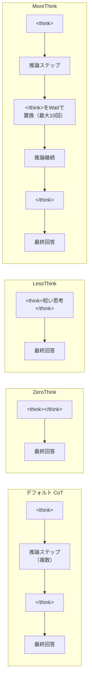

## 論文概要（Abstract）

本記事は [SafeChain: Safety of Language Models with Long Chain-of-Thought Reasoning Capabilities (arXiv:2502.12025)](https://arxiv.org/abs/2502.12025) の解説記事です。

この論文は、DeepSeek-R1シリーズやGemini-Thinking等の大規模推論モデル（LRM）12種を対象に、長Chain-of-Thought（CoT）推論における安全性を体系的に評価した研究である。著者らは、StrongRejectとWildJailbreakデータセットを用いた評価の結果、LRMの推論能力向上が安全性向上に直結しないことを報告している。さらに、追加学習なしで安全性を改善する3つのデコーディング戦略（ZeroThink、LessThink、MoreThink）を提案し、CoTスタイルの安全性訓練データセットSafeChainを構築して公開している。

この記事は [Zenn記事: SafeMLRM徹底解説：推論強化がマルチモーダルAIの安全性を破壊するReasoning Taxの全貌](https://zenn.dev/0h_n0/articles/1cf634859b2bc6) の深掘りです。LRMの安全性評価手法とデコーディング戦略による安全性制御の技術的詳細を理解するための参考資料として位置づけられる。

## 情報源

- **arXiv ID**: 2502.12025
- **URL**: [https://arxiv.org/abs/2502.12025](https://arxiv.org/abs/2502.12025)
- **著者**: Fengqing Jiang, Zhangchen Xu, Yuetai Li, Luyao Niu, Zhen Xiang, Bo Li, Bill Yuchen Lin, Radha Poovendran
- **所属**: University of Washington, University of Georgia, University of Chicago
- **発表年**: 2025
- **分野**: cs.AI, cs.CL
- **プロジェクトページ**: [https://safe-chain.github.io/](https://safe-chain.github.io/)
- **データセット**: [https://huggingface.co/datasets/UWNSL/SafeChain](https://huggingface.co/datasets/UWNSL/SafeChain)

## 背景と動機（Background & Motivation）

OpenAI o1やDeepSeek-R1に代表されるLRMは、長いChain-of-Thought（CoT）推論によって数学やコーディング等の複雑なタスクで顕著な性能向上を達成している。しかし、長いCoTが安全な出力を保証するわけではない。最終回答が「拒否」の形をとっていても、推論過程（reasoning trace）にポリシー違反やハームフルな情報が含まれる場合がある。

従来のLLM安全性研究は短い応答を前提としており、LRM特有の長いCoT出力に対する安全性評価手法は未整備であった。さらに、LRMの出力は通常のLLMと比較して大幅に長いため、手動評価のコストが禁止的に高い。著者らは、（1）安全性評価器のキャリブレーション、（2）12種のLRMの安全性評価、（3）推論チェーン制御による安全性改善手法、（4）CoTスタイルの安全性訓練データセット構築という4つの課題に取り組んでいる。

## 主要な貢献（Key Contributions）

- **貢献1**: 人間アノテーションに対してキャリブレーションされた安全性評価器の選定（Llama-Guard: ACC 88.2%, F-1 86.1%, PCC 0.776）
- **貢献2**: 12種の最先端LRMに対するStrongRejectとWildJailbreakでの体系的安全性評価
- **貢献3**: ZeroThink、LessThink、MoreThinkの3つのデコーディング戦略による追加学習なしの安全性改善
- **貢献4**: CoTスタイル初の安全性訓練データセットSafeChain（40,000件）の構築と公開
- **貢献5**: SafeChainによるファインチューニングが安全性を向上させつつ6つの推論ベンチマークの性能を維持することの実証

## 技術的詳細（Technical Details）

### 安全性評価器のキャリブレーション

著者らは、LRMの長いCoT出力に対して有効な安全性評価器を特定するためのパイロットスタディを実施している。6つの推論モデル（R1-7B、R1-8B、Gemini-Thinking、Sky-T1、QwQ、Skywork-o1）にStrongReject small（60件）を入力し、360の応答ペアを生成した。人間がsafe/unsafe/unsureでラベル付けし、unsureを除外した272サンプルで評価器を比較している。

| 評価器 | ACC | F-1 | PCC |
|--------|-----|-----|-----|
| RS-Match | 70.2% | 59.3% | 0.429 |
| OpenAIMod | 80.5% | 78.2% | 0.610 |
| HarmBenchEval | 80.9% | 74.8% | 0.656 |
| Llama-Guard | **88.2%** | **86.1%** | **0.776** |

Llama-Guardが全指標で最高性能を示し、以降の全評価に採用されている。

### 安全性評価メトリクス

LRMの推論トレースと最終回答を統合的に評価するため、以下の3つのメトリクスが定義されている。

$$\text{Safe@1} = \frac{1}{K} \sum_{i=1}^{K} s_i$$

$$\text{ConsSafe@K} = \mathbb{1}\left\{\sum_{i=1}^{K} s_i \geq \frac{K}{2}\right\}$$

$$\text{Safe@K} = \mathbb{1}\left\{\bigwedge_{i=1}^{K} s_i = 1\right\}$$

ここで $s_i$ はレスポンス $y_i$ が安全か否かのバイナリ指標である。Safe@1は$K$個の応答中の安全な割合、ConsSafe@Kは過半数が安全であれば1、Safe@Kは全応答が安全な場合のみ1を返す。実験では$K=5$が使用されている。

### 3つのデコーディング戦略

著者らはLRMの推論トレースの長さが安全性に影響することを発見し、以下の3戦略を提案している。



**ZeroThink**: レスポンスプレフィックスを空の思考セグメント `<think></think>` に強制する。モデルは推論チェーンなしで直接回答を生成する。Jiang et al. (2024a) のChatBugの知見に基づく。

**LessThink**: 短い思考プロセス `<think>Okay, the user ask for this, I can answer it without thinking much.</think>` をプレフィックスとして強制する。推論は最小限に抑制される。

**MoreThink**: Muennighoff et al. (2025) のminimum-forcingアルゴリズムに基づき、`</think>` タグの生成を「Wait」等の遷移文字列で置換して推論を延長する。終了条件は、`</think>` タグの置換10回、または10,000推論トークンの到達のいずれかである。

### デコーディング戦略の実装例

以下は3つのデコーディング戦略のプレフィックス制御を示す実装例である。

```python
from dataclasses import dataclass
from enum import Enum
from typing import Optional


class ThinkingStrategy(Enum):
    """LRMのデコーディング戦略を定義するEnum."""
    DEFAULT = "default"
    ZERO_THINK = "zero_think"
    LESS_THINK = "less_think"
    MORE_THINK = "more_think"


@dataclass(frozen=True)
class MoreThinkConfig:
    """MoreThink戦略のパラメータ設定.

    Attributes:
        max_replacements: </think>タグの最大置換回数
        max_thinking_tokens: 推論トークンの最大数
        transition_string: 置換に使用する遷移文字列
    """
    max_replacements: int = 10
    max_thinking_tokens: int = 10_000
    transition_string: str = "Wait"


def build_prefix(
    strategy: ThinkingStrategy,
    user_message: str,
    *,
    more_think_config: Optional[MoreThinkConfig] = None,
) -> str:
    """デコーディング戦略に応じたレスポンスプレフィックスを生成する.

    Args:
        strategy: 適用するデコーディング戦略
        user_message: ユーザーの入力メッセージ
        more_think_config: MoreThink戦略の設定（MoreThink時のみ使用）

    Returns:
        モデルに供給するプレフィックス文字列

    Raises:
        ValueError: MoreThink戦略でconfigが未指定の場合
    """
    base = f"<| User |> {user_message} <| Assistant |> "

    if strategy == ThinkingStrategy.ZERO_THINK:
        return base + "<think></think>"
    elif strategy == ThinkingStrategy.LESS_THINK:
        return base + (
            "<think>Okay, the user ask for this, "
            "I can answer it without thinking much.</think>"
        )
    elif strategy == ThinkingStrategy.MORE_THINK:
        if more_think_config is None:
            raise ValueError(
                "MoreThinkConfig is required for MORE_THINK strategy"
            )
        # MoreThinkではデフォルトCoTで開始し、
        # デコード時に</think>をtransition_stringで置換する
        return base + "<think>"
    else:
        # デフォルトCoT
        return base + "<think>"


def apply_more_think_replacement(
    generated_text: str,
    config: MoreThinkConfig,
    current_replacements: int,
    current_tokens: int,
) -> tuple[str, bool]:
    """MoreThink戦略で</think>タグを遷移文字列に置換する.

    Args:
        generated_text: 現在までの生成テキスト
        config: MoreThink設定
        current_replacements: 現在の置換回数
        current_tokens: 現在の推論トークン数

    Returns:
        (置換後テキスト, 推論を継続すべきか) のタプル
    """
    end_tag = "</think>"
    should_continue = (
        current_replacements < config.max_replacements
        and current_tokens < config.max_thinking_tokens
    )

    if end_tag in generated_text and should_continue:
        replaced = generated_text.replace(
            end_tag, f" {config.transition_string}", 1
        )
        return replaced, True

    return generated_text, False
```

### SafeChainデータセットの構築

SafeChainの構築パイプラインは以下の3ステップで構成される。

1. **指示サンプリング**: WildJailbreakデータセットから4カテゴリ（Vanilla Benign: 12,500件、Vanilla Harmful: 12,500件、Adversarial Benign: 12,500件、Adversarial Harmful: 12,500件）を均一分布で50,000件をサンプリング
2. **応答生成とフィルタリング**: 各指示に対してR1-70Bで5応答を生成し、Llama-Guardで全5応答が安全な指示のみを保持
3. **最終データセット構成**: 残った各指示からランダムに1応答を選択し、40,000件の指示-応答ペアを構成

最終的なカテゴリ別内訳は、Vanilla Benign: 11,056件、Vanilla Harmful: 8,591件、Adversarial Benign: 11,056件、Adversarial Harmful: 9,297件である。

## 実装のポイント（Implementation Notes）

### 学習設定

SafeChainによるファインチューニングはLLaMA-Factory（Zheng et al., 2024）を使用し、4台のNVIDIA A100-SXM4-80GB GPU上で実施されている。主要なハイパーパラメータは以下の通りである。

| パラメータ | 値 |
|-----------|-----|
| 学習率 | $1 \times 10^{-5}$ |
| エポック数 | 2 |
| デバイス数 | 4 |
| デバイスあたりバッチサイズ | 2 |
| オプティマイザ | AdamW |
| 学習率スケジューラ | cosine |
| 最大系列長 | 8,192 |

著者らはR1-7B（Qwen2.5-Math-7Bベース）とR1-8B（Llama-3.1-8Bベース）の2モデルでファインチューニングを実施している。評価時のデコーディングはgreedy（temperature=0）で、コーディングベンチマークのみrepetition penalty 1.1を適用している。

### デコーディング戦略選択のガイドライン

論文の実験結果から、デコーディング戦略の選択は以下の基準で判断できる。

- **安全性を最優先する場合**: ZeroThinkが最も効果的だが、推論能力が犠牲になる
- **推論能力と安全性のバランス**: SafeChainデータセットによるファインチューニングが最適
- **推論能力を維持しつつ安全性を改善する場合**: MoreThinkが推論品質を維持しながら安全性を向上させるが、推論コストが増大する

## Production Deployment Guide

### AWSでのChain-level安全性モニタリングパイプライン

LRMの推論チェーンに対するリアルタイム安全性監視をAWS上に構築する際の構成例を示す。以下のコスト試算は2026年4月時点のAWS料金に基づく概算であり、リージョン・利用パターンにより変動する。

#### Small構成: Lambda + DynamoDB（$50-150/月）

日次数百件程度のLRM出力を非同期で安全性チェックする構成。

- **Lambda**: 推論チェーンを `<think>...</think>` と最終回答に分割し、各セグメントをLlama-Guard APIに送信
- **DynamoDB**: 評価結果（Safe@1, thought安全性, answer安全性）を記録
- **SNS**: unsafe検出時にアラート通知
- **S3**: 推論チェーン全文のアーカイブ

想定コスト内訳: Lambda $5-15、DynamoDB $10-30、Llama-Guard推論（SageMaker Serverless or 外部API）$30-80、S3/SNS $5-25

#### Medium構成: ECS + ストリーミング解析（$300-800/月）

リアルタイムストリーミングでLRM出力を逐次解析する構成。日次数千件規模。

- **ECS Fargate**: Llama-Guard推論コンテナ（2vCPU, 8GB RAM x 2タスク）
- **Kinesis Data Streams**: LRM出力のストリーミング取り込み
- **ElastiCache (Redis)**: 直近の評価結果キャッシュ、重複排除
- **CloudWatch**: Safe@1メトリクスのダッシュボード、アラーム設定
- **RDS PostgreSQL**: 評価ログの永続化、分析クエリ

想定コスト内訳: ECS Fargate $80-200、Kinesis $30-70、ElastiCache $50-120、RDS $60-150、CloudWatch/S3 $20-60、その他 $60-200

#### Large構成: EKS + リアルタイムモニタリング（$2,000-5,000/月）

本番環境でのフルスケール安全性監視。日次数万件以上のLRM出力をリアルタイム処理する構成。

- **EKS**: GPU対応ノード（g5.xlarge x 2-4台）でLlama-Guard自前ホスティング
- **Kafka (MSK)**: 高スループットメッセージング、パーティション分割による並列処理
- **OpenSearch**: 推論チェーンのフルテキスト検索、安全性スコアの時系列分析
- **Prometheus + Grafana**: Safe@1/ConsSafe@K/Safe@Kメトリクスのリアルタイムダッシュボード
- **Step Functions**: ZeroThink/LessThink/MoreThink戦略の動的切り替えワークフロー

想定コスト内訳: EKS + GPU $1,200-3,000、MSK $200-500、OpenSearch $300-700、Monitoring $100-300、Step Functions/その他 $200-500

### Terraform構成例

#### Small構成

```hcl
# SafeChain安全性モニタリング — Small構成
# Lambda + DynamoDB + SNS

terraform {
  required_version = ">= 1.5"
  required_providers {
    aws = {
      source  = "hashicorp/aws"
      version = "~> 5.0"
    }
  }
}

variable "alert_email" {
  description = "unsafe検出時の通知先メールアドレス"
  type        = string
}

variable "environment" {
  description = "デプロイ環境名"
  type        = string
  default     = "production"
}

# DynamoDB: 安全性評価結果の記録
resource "aws_dynamodb_table" "safety_results" {
  name         = "safechain-safety-results-${var.environment}"
  billing_mode = "PAY_PER_REQUEST"
  hash_key     = "request_id"
  range_key    = "evaluated_at"

  attribute {
    name = "request_id"
    type = "S"
  }

  attribute {
    name = "evaluated_at"
    type = "S"
  }

  attribute {
    name = "safety_status"
    type = "S"
  }

  global_secondary_index {
    name            = "safety-status-index"
    hash_key        = "safety_status"
    range_key       = "evaluated_at"
    projection_type = "ALL"
  }

  point_in_time_recovery {
    enabled = true
  }

  tags = {
    Project     = "safechain-monitor"
    Environment = var.environment
  }
}

# SNS: unsafe検出アラート
resource "aws_sns_topic" "unsafe_alert" {
  name              = "safechain-unsafe-alert-${var.environment}"
  kms_master_key_id = "alias/aws/sns"
}

resource "aws_sns_topic_subscription" "email_alert" {
  topic_arn = aws_sns_topic.unsafe_alert.arn
  protocol  = "email"
  endpoint  = var.alert_email
}

# S3: 推論チェーンアーカイブ
resource "aws_s3_bucket" "chain_archive" {
  bucket = "safechain-archive-${var.environment}"
}

resource "aws_s3_bucket_versioning" "chain_archive" {
  bucket = aws_s3_bucket.chain_archive.id
  versioning_configuration {
    status = "Enabled"
  }
}

resource "aws_s3_bucket_server_side_encryption_configuration" "chain_archive" {
  bucket = aws_s3_bucket.chain_archive.id
  rule {
    apply_server_side_encryption_by_default {
      sse_algorithm = "aws:kms"
    }
  }
}

resource "aws_s3_bucket_lifecycle_configuration" "chain_archive" {
  bucket = aws_s3_bucket.chain_archive.id
  rule {
    id     = "archive-old-chains"
    status = "Enabled"
    transition {
      days          = 30
      storage_class = "GLACIER"
    }
    expiration {
      days = 365
    }
  }
}

resource "aws_s3_bucket_public_access_block" "chain_archive" {
  bucket                  = aws_s3_bucket.chain_archive.id
  block_public_acls       = true
  block_public_policy     = true
  ignore_public_acls      = true
  restrict_public_buckets = true
}

# Lambda: 推論チェーン解析・安全性評価
resource "aws_lambda_function" "chain_analyzer" {
  function_name = "safechain-chain-analyzer-${var.environment}"
  runtime       = "python3.12"
  handler       = "handler.lambda_handler"
  filename      = "lambda_package.zip"
  timeout       = 300
  memory_size   = 1024

  environment {
    variables = {
      DYNAMODB_TABLE = aws_dynamodb_table.safety_results.name
      SNS_TOPIC_ARN  = aws_sns_topic.unsafe_alert.arn
      S3_BUCKET      = aws_s3_bucket.chain_archive.id
      ENVIRONMENT    = var.environment
    }
  }

  role = aws_iam_role.lambda_role.arn

  tags = {
    Project     = "safechain-monitor"
    Environment = var.environment
  }
}

resource "aws_iam_role" "lambda_role" {
  name = "safechain-lambda-role-${var.environment}"
  assume_role_policy = jsonencode({
    Version = "2012-10-17"
    Statement = [{
      Action = "sts:AssumeRole"
      Effect = "Allow"
      Principal = {
        Service = "lambda.amazonaws.com"
      }
    }]
  })
}

resource "aws_iam_role_policy" "lambda_policy" {
  name = "safechain-lambda-policy"
  role = aws_iam_role.lambda_role.id
  policy = jsonencode({
    Version = "2012-10-17"
    Statement = [
      {
        Effect = "Allow"
        Action = [
          "dynamodb:PutItem",
          "dynamodb:Query",
          "dynamodb:GetItem"
        ]
        Resource = [
          aws_dynamodb_table.safety_results.arn,
          "${aws_dynamodb_table.safety_results.arn}/index/*"
        ]
      },
      {
        Effect   = "Allow"
        Action   = ["sns:Publish"]
        Resource = [aws_sns_topic.unsafe_alert.arn]
      },
      {
        Effect = "Allow"
        Action = [
          "s3:PutObject",
          "s3:GetObject"
        ]
        Resource = ["${aws_s3_bucket.chain_archive.arn}/*"]
      },
      {
        Effect = "Allow"
        Action = [
          "logs:CreateLogGroup",
          "logs:CreateLogStream",
          "logs:PutLogEvents"
        ]
        Resource = ["arn:aws:logs:*:*:*"]
      }
    ]
  })
}
```

#### Large構成

```hcl
# SafeChain安全性モニタリング — Large構成
# EKS + MSK + OpenSearch

terraform {
  required_version = ">= 1.5"
  required_providers {
    aws = {
      source  = "hashicorp/aws"
      version = "~> 5.0"
    }
  }
}

variable "environment" {
  description = "デプロイ環境名"
  type        = string
  default     = "production"
}

variable "vpc_id" {
  description = "デプロイ先VPC ID"
  type        = string
}

variable "private_subnet_ids" {
  description = "プライベートサブネットIDリスト"
  type        = list(string)
}

# EKS: Llama-Guardホスティング + 安全性評価ワーカー
module "eks" {
  source          = "terraform-aws-modules/eks/aws"
  version         = "~> 20.0"
  cluster_name    = "safechain-monitor-${var.environment}"
  cluster_version = "1.31"
  vpc_id          = var.vpc_id
  subnet_ids      = var.private_subnet_ids

  cluster_endpoint_public_access = false

  eks_managed_node_groups = {
    gpu_workers = {
      instance_types = ["g5.xlarge"]
      min_size       = 2
      max_size       = 4
      desired_size   = 2

      labels = {
        workload = "llama-guard-inference"
      }

      taints = [{
        key    = "nvidia.com/gpu"
        value  = "true"
        effect = "NO_SCHEDULE"
      }]
    }

    general_workers = {
      instance_types = ["m6i.large"]
      min_size       = 2
      max_size       = 6
      desired_size   = 3

      labels = {
        workload = "chain-analysis"
      }
    }
  }

  tags = {
    Project     = "safechain-monitor"
    Environment = var.environment
  }
}

# MSK: 高スループットメッセージング
resource "aws_msk_cluster" "chain_events" {
  cluster_name           = "safechain-events-${var.environment}"
  kafka_version          = "3.6.0"
  number_of_broker_nodes = 3

  broker_node_group_info {
    instance_type   = "kafka.m5.large"
    client_subnets  = var.private_subnet_ids
    security_groups = [aws_security_group.msk.id]

    storage_info {
      ebs_storage_info {
        volume_size = 100
      }
    }
  }

  encryption_info {
    encryption_in_transit {
      client_broker = "TLS"
      in_cluster    = true
    }
  }

  logging_info {
    broker_logs {
      cloudwatch_logs {
        enabled   = true
        log_group = "/aws/msk/safechain-${var.environment}"
      }
    }
  }

  tags = {
    Project     = "safechain-monitor"
    Environment = var.environment
  }
}

resource "aws_security_group" "msk" {
  name_prefix = "safechain-msk-${var.environment}-"
  vpc_id      = var.vpc_id

  ingress {
    from_port   = 9094
    to_port     = 9094
    protocol    = "tcp"
    description = "Kafka TLS"
    cidr_blocks = []
    self        = true
  }

  egress {
    from_port   = 0
    to_port     = 0
    protocol    = "-1"
    cidr_blocks = ["0.0.0.0/0"]
    description = "Allow all outbound"
  }
}

# OpenSearch: 推論チェーン検索・分析
resource "aws_opensearch_domain" "chain_analytics" {
  domain_name    = "safechain-analytics-${var.environment}"
  engine_version = "OpenSearch_2.11"

  cluster_config {
    instance_type          = "r6g.large.search"
    instance_count         = 2
    zone_awareness_enabled = true

    zone_awareness_config {
      availability_zone_count = 2
    }
  }

  ebs_options {
    ebs_enabled = true
    volume_size = 100
    volume_type = "gp3"
  }

  encrypt_at_rest {
    enabled = true
  }

  node_to_node_encryption {
    enabled = true
  }

  domain_endpoint_options {
    enforce_https       = true
    tls_security_policy = "Policy-Min-TLS-1-2-PFS-2023-10"
  }

  tags = {
    Project     = "safechain-monitor"
    Environment = var.environment
  }
}
```

### セキュリティ要件

1. LRM推論チェーンには有害コンテンツが含まれる可能性があるため、S3/OpenSearchへの保存時は暗号化を必須とする
2. Llama-Guardモデルの重みはプライベートサブネット内でのみアクセス可能とする
3. 安全性評価結果のDynamoDB/RDSへのアクセスはIAMロールベースで最小権限を適用する
4. SNSアラートのエンドポイントにPIIを含めない
5. Lambda/ECSのログにはLRM出力の全文を記録しない（ハッシュ化したrequest_idで参照）
6. VPCエンドポイント経由でDynamoDB/S3/SNSにアクセスし、インターネット経由の通信を回避する
7. CloudTrailで全API呼び出しを記録する

### モニタリング項目

1. Safe@1スコアの時系列推移（CloudWatch/Grafanaダッシュボード）
2. unsafe検出率の異常上昇アラート（閾値: 前日比+10%）
3. Llama-Guard推論レイテンシ（p50, p95, p99）
4. 推論チェーン長の分布（unsafe応答が長い傾向の検出）
5. カテゴリ別（Vanilla/Adversarial x Benign/Harmful）のunsafe率
6. デコーディング戦略別の安全性メトリクス比較
7. Lambda/ECS/EKSのエラー率とリトライ回数

### コスト最適化

1. Small構成: Lambda実行時間の最適化（推論チェーンの長さによるメモリ/タイムアウト調整）
2. DynamoDBのTTL設定で90日以上の評価結果を自動削除
3. S3 Glacierへの30日自動移行でストレージコスト削減
4. Medium構成: ECS Fargateのスポットキャパシティ活用（最大70%コスト削減）
5. ElastiCacheのリザーブドノードで長期運用コスト削減
6. Large構成: EKSのGPUノードにCluster Autoscalerを適用し、オフピーク時にスケールイン
7. MSKのブローカーサイズをトラフィックパターンに応じて右サイジング
8. OpenSearchのUltraWarmティアで30日超のデータをコスト効率よく保持
9. リザーブドインスタンスの活用（1年コミットで最大40%削減）
10. CloudWatchのログ保持期間を適切に設定（30日推奨）

## 実験結果（Experimental Results）

### 12モデルの安全性評価

以下はStrongRejectデータセットにおけるGreedyデコーディングでのSafe@1スコアである。

| モデル | パラメータ数 | StrongReject Safe@1 | WildJailbreak Safe@1 |
|--------|------------|--------------------|--------------------|
| R1-1.5B | 1.5B | 19.2% | 48.8% |
| R1-7B | 7B | 36.4% | 49.6% |
| R1-8B | 8B | 46.6% | 48.8% |
| R1-14B | 14B | 42.8% | 54.8% |
| R1-32B | 32B | 50.5% | 57.2% |
| R1-70B | 70B | 55.3% | 67.2% |
| R1 | 671B | 84.7% | 62.8% |
| Skywork-o1 | 8B | 66.1% | 53.6% |
| QwQ | 32B | **97.1%** | 64.0% |
| Sky-T1 | 32B | 51.4% | 50.4% |
| Gemini-Thinking | - | 89.5% | 53.2% |
| Kimi-k1.5 | - | 76.4% | 46.4% |

著者らは以下の5つの主要な知見を報告している。

**知見1**: 全LRMがStrongRejectとWildJailbreakの両方で高い安全性を示すことはなく、安全性アラインメントが不十分である。

**知見2**: 同一モデルファミリ内ではパラメータ数の増加に伴い安全性が向上する（R1-1.5BのSafe@1 19.2%からR1-671Bの84.7%）。

**知見3**: unsafe応答はsafe応答よりもトークン数が多く、より長い傾向がある。

**知見4**: R1-70BとLlama-3.3-70B-Instructの比較において、長CoTファインチューニング後の安全性が低下する。Llama-3-Instructが45.7%のケースでより安全な応答を生成している。

**知見5**: temperatureの上昇に伴いLRMの安全性が低下する（R1-7BのSafe@Kがtemperature 1.2で30%から20%未満に低下）。

### デコーディング戦略の効果

R1-7Bにおける各戦略のStrongReject Greedy Safe@1の変化を示す。

| 戦略 | StrongReject Safe@1 | WildJailbreak Safe@1 |
|------|--------------------|--------------------|
| デフォルト | 36.4% | 49.6% |
| + ZeroThink | **99.7%** (+63.3pt) | **89.2%** (+39.6pt) |
| + LessThink | 94.2% (+57.8pt) | 64.0% (+14.4pt) |
| + MoreThink | 42.2% (+5.8pt) | 52.0% (+2.4pt) |

ZeroThinkが全モデル・全データセットで最も高い安全性向上を示している。著者らは、ZeroThinkとLessThinkでは推論チェーンが抑制されるため有害な思考プロセスが生成されず、モデルの「本能的な」安全性意識に依存して応答が生成されると分析している。MoreThinkについては、延長された推論が有害な推論パスに対する自己反省を促進し、最終的に安全な応答につながるという仮説を提示している。

### SafeChainファインチューニングの効果

| 設定 | MATH-500 | LiveCodeBench | StrongReject | WildJailbreak |
|------|----------|--------------|-------------|--------------|
| R1-7B | 83.4% | 39.3% | 36.4% | 49.6% |
| + WJ-40K | 79.4% | **14.5%** | 95.2% | 96.8% |
| + SafeChain | 83.6% | 39.6% | 53.4% | 61.2% |
| R1-8B | 86.6% | 40.4% | 46.6% | 48.8% |
| + WJ-40K | 70.0% | **17.4%** | 98.1% | 97.2% |
| + SafeChain | 83.2% | 40.5% | 62.3% | 62.8% |

WJ-40K（GPT-3.5生成の非CoTスタイル応答）は最高の安全性を達成するが、推論能力を大幅に低下させる（R1-7BのLiveCodeBenchが39.3%から14.5%に低下）。一方、SafeChainはCoTスタイルのデータであるため、LRMの訓練データ分布に近く、推論能力を維持しながら安全性を向上させている。

## 実運用への応用（Practical Applications）

この研究の知見は、LRMを本番環境にデプロイする際の安全性設計に直接応用できる。

**推論チェーンの可視性制御**: OpenAI o1のように推論トレースをユーザーに非公開とする設計は、unsafe思考が最終回答に影響するリスクを隠蔽する。論文の結果（unsafe思考がunsafe回答につながる割合: StrongRejectで34.8%、WildJailbreakで36.5%）は、推論トレースの安全性監視が不可欠であることを示している。

**段階的安全性対策**: 推論速度を犠牲にできない場面ではMoreThinkによる緩やかな安全性改善が適用でき、安全性が最優先の場面ではZeroThinkへの動的切り替えが有効である。ただし、ZeroThinkはCoTの推論能力を完全に放棄するため、推論が必要なタスクには適用できない制約がある。

**SafeChainの拡張可能性**: 現在のSafeChainは英語単一ターンのみを対象としている。著者らも将来の課題として多言語対応とマルチターン対話への拡張を明記している。実運用では、ドメイン固有のポリシー違反パターンを追加したカスタムSafeChainの構築が必要になる可能性がある。

## 関連研究（Related Work）

本研究はLRM安全性の体系的研究として位置づけられる。関連する研究として、SafeMLRM（Zhou et al., 2025）はマルチモーダルLRMの安全性を評価し「Reasoning Tax」（推論強化による安全性低下）を報告しており、SafeChainの知見4（長CoTが安全性を保証しない）と整合する。SafeThinkはCoT内の安全推論を強化するアプローチであり、SafeChainのデータセットベースのアプローチと相補的である。Wei et al. (2022)のChain-of-Thought prompting、Qi et al. (2024)の安全性アラインメントの深さに関する研究も関連が深い。SafeDecoding（Xu et al., 2024）は安全性を考慮したデコーディング手法であり、本研究のZeroThink/LessThink/MoreThinkとは異なるアプローチでデコーディング段階での安全性改善を実現している。

## まとめと今後の展望（Conclusion & Future Work）

SafeChainは、LRMの長CoT推論における安全性の課題を体系的に分析し、実用的な対策を提示した研究である。12モデルの評価により「推論能力の向上が安全性の向上を保証しない」ことを実証し、ZeroThink/LessThink/MoreThinkの3つのデコーディング戦略とCoTスタイル安全性訓練データセットSafeChainを提案している。

制約として、評価は英語・単一ターンのみであり、多言語入力やマルチターン対話への適用は未検証である。また、OpenAI o-seriesは推論トレースが非公開のため評価対象外であり、API経由のGemini-ThinkingとKimi-k1.5は外部安全性フィルタにより安全性が過大評価されている可能性がある。今後は多言語SafeChainの構築とマルチターン対話での安全性評価が課題となる。

## 参考文献

1. Jiang, F., et al. (2025). SafeChain: Safety of Language Models with Long Chain-of-Thought Reasoning Capabilities. arXiv:2502.12025
2. Guo, D., et al. (2025). DeepSeek-R1: Incentivizing Reasoning Capability in LLMs via Reinforcement Learning. arXiv:2501.12948
3. Souly, A., et al. (2024). A StrongReject for Empty Jailbreaks. arXiv:2402.10260
4. Jiang, L., et al. (2024). WildTeaming at Scale: From In-the-Wild Jailbreaks to (Adversarially) Safer Language Models. NeurIPS 2024
5. Inan, H., et al. (2023). Llama Guard: LLM-based Input-Output Safeguard for Human-AI Conversations. arXiv:2312.06674
6. Muennighoff, N., et al. (2025). s1: Simple Test-Time Scaling. arXiv:2501.19393
7. Jaech, A., et al. (2024). OpenAI o1 System Card. arXiv:2412.16720
8. Wei, J., et al. (2022). Chain-of-Thought Prompting Elicits Reasoning in Large Language Models. NeurIPS 2022
9. Qi, X., et al. (2024). Safety Alignment Should Be Made More Than Just a Few Tokens Deep. arXiv:2406.05946
10. Xu, Z., et al. (2024). SafeDecoding: Defending against Jailbreak Attacks via Safety-Aware Decoding. ACL 2024
11. Zheng, Y., et al. (2024). LLaMA-Factory: Unified Efficient Fine-Tuning of 100+ Language Models. ACL 2024 Demo
