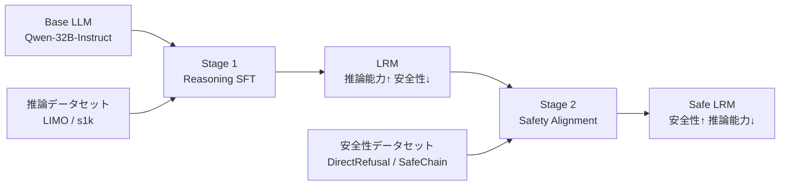

## 論文概要（Abstract）

本記事は [arXiv:2503.00555](https://arxiv.org/abs/2503.00555) の解説記事です。Large Reasoning Model（LRM）に安全性アラインメントを適用すると、安全性は回復できるものの推論能力が劣化するという**Safety Tax**現象を体系的に検証した研究について解説します。著者らはこのトレードオフを定量的に明らかにし、副産物としてDirectRefusalデータセットを公開しています。

関連するZenn記事: [SafeMLRM徹底解説：推論強化がマルチモーダルAIの安全性を破壊するReasoning Taxの全貌](https://zenn.dev/0h_n0/articles/1cf634859b2bc6)

## 情報源

- **arXiv ID**: 2503.00555
- **URL**: [arXiv:2503.00555](https://arxiv.org/abs/2503.00555)
- **著者**: Tiansheng Huang, Sihao Hu, Fatih Ilhan, Selim Furkan Tekin, Zachary Yahn, Yichang Xu, Ling Liu
- **初版**: 2025年3月1日（v2: 2025年6月5日）
- **分野**: Cryptography and Security (cs.CR), Artificial Intelligence (cs.AI), Machine Learning (cs.LG)
- **コードリポジトリ**: [https://github.com/git-disl/Safety-Tax](https://github.com/git-disl/Safety-Tax)

## 背景と動機（Background）

Large Language Model（LLM）の安全性アラインメントは、本番デプロイ前に実施される重要な工程として広く研究されてきた。しかし、推論能力を強化したLarge Reasoning Model（LRM）については、安全性アラインメントの影響が十分に調査されていなかった。

LRMはChain-of-Thought（CoT）データを用いたSupervised Fine-Tuning（SFT）により推論能力を獲得するが、この過程でベースモデルが持っていた安全性が損なわれることが知られている。Zenn記事で取り上げたSafeMLRMの研究は、推論強化が安全性を破壊する方向（Reasoning Tax）を扱っているが、本論文はその**逆方向** -- 安全性アラインメントが推論能力を劣化させるSafety Tax -- を体系的に検証した最初の研究である。

この「推論能力 vs 安全性」の双方向トレードオフの理解は、実運用でのLRM構築パイプライン設計に直結する重要な知見である。

## 主要な貢献（Key Contributions）

1. **Safety Taxの発見と定量化**: LRMに安全性アラインメントを適用すると、安全性は回復するが推論能力が劣化するトレードオフを体系的に検証した最初の研究
2. **DirectRefusalデータセット**: 1,000サンプルからなる安全性アラインメント用データセットを公開。短い思考パターン+直接拒否の構造
3. **安全性アラインメント手法の比較**: DirectRefusal（短い思考パターン）とSafeChain（長いCoT推論軌跡）の2手法を複数モデルで比較評価

## 技術的詳細（Technical Details）

### LRM生産パイプライン

著者らが検証したLRM生産パイプラインは、ベースLLMから安全なLRMを生産するまでの2段階で構成される。



- **Stage 1（Reasoning SFT）**: LIMO、s1kなどのCoTデータセットを用いたSFTにより推論能力を獲得。この段階でベースモデルの安全性が劣化する
- **Stage 2（Safety Alignment）**: 安全性データセットを用いたSFTにより安全性を回復。この段階で推論能力が劣化する（= Safety Tax）

### 安全性アラインメント手法の比較

本論文ではRL-based手法（GRPO、DPO等）ではなく、SFTベースの2手法を比較している。

#### DirectRefusal

BeaverTails-refusalデータセットを基に、固定された短い思考パターンと直接拒否の回答を組み合わせたデータセットである。

- **データ数**: 1,000サンプル
- **構造**: 有害な質問 + 固定思考パターン（`<think>I should not answer this question!</think>`） + 直接拒否回答
- **特徴**: 思考軌跡が短く固定的。安全性の回復効果が高いが、推論能力への副作用も大きい

#### SafeChain

SafeChainデータセットからサブセット1,000サンプルを使用。長いCoT推論軌跡を含む安全性データセットである。

- **データ数**: 1,000サンプル（SafeChainのサブセット）
- **構造**: 有害な質問 + 長いCoT推論軌跡 + 拒否回答
- **特徴**: 推論能力への影響が小さいが、安全性の回復効果もDirectRefusalに劣る

### Safety Taxの定量化

Safety Taxは、安全性アラインメント前後の推論ベンチマークスコアの差分として定量化される。

$$
\Delta_{\text{reasoning}} = \text{Acc}_{\text{LRM}} - \text{Acc}_{\text{LRM+Safety}}
$$

ここで、
- $\text{Acc}_{\text{LRM}}$: 安全性アラインメント適用前のLRMの推論精度
- $\text{Acc}_{\text{LRM+Safety}}$: 安全性アラインメント適用後の推論精度
- $\Delta_{\text{reasoning}} > 0$ の場合、Safety Taxが発生していることを意味する

同様に、安全性の回復量は以下で定義される。

$$
\Delta_{\text{safety}} = \text{Harmful}_{\text{LRM}} - \text{Harmful}_{\text{LRM+Safety}}
$$

- $\text{Harmful}_{\text{LRM}}$: アラインメント前の有害応答率
- $\text{Harmful}_{\text{LRM+Safety}}$: アラインメント後の有害応答率
- $\Delta_{\text{safety}} > 0$ であれば安全性が回復している

### 訓練設定

著者らは以下のハイパーパラメータで安全性アラインメントSFTを実施している。

- **オプティマイザ**: AdamW
- **学習率**: $5 \times 10^{-5}$
- **Weight Decay**: $1 \times 10^{-4}$
- **スケジューラ**: Cosine Decay
- **エポック数**: 5
- **データ数**: 1,000サンプル
- **ハードウェア**: 8 x H200 GPU

### 安全性評価コードの例

以下は、論文の評価パイプラインを簡易的に再現するPythonコードである。

```python
from dataclasses import dataclass
from typing import Literal


@dataclass(frozen=True)
class SafetyTaxResult:
    """Safety Tax評価結果を保持するデータクラス。

    Attributes:
        model_name: 評価対象モデル名
        alignment_method: 安全性アラインメント手法名
        reasoning_before: アラインメント前の推論精度 (0-100)
        reasoning_after: アラインメント後の推論精度 (0-100)
        harmful_before: アラインメント前の有害応答率 (0-100)
        harmful_after: アラインメント後の有害応答率 (0-100)
    """
    model_name: str
    alignment_method: Literal["DirectRefusal", "SafeChain"]
    reasoning_before: float
    reasoning_after: float
    harmful_before: float
    harmful_after: float

    @property
    def reasoning_tax(self) -> float:
        """推論能力の劣化量（Safety Tax）を計算する。

        Returns:
            正の値は推論能力の劣化を意味する
        """
        return self.reasoning_before - self.reasoning_after

    @property
    def safety_gain(self) -> float:
        """安全性の回復量を計算する。

        Returns:
            正の値は安全性の回復を意味する
        """
        return self.harmful_before - self.harmful_after

    @property
    def tax_efficiency(self) -> float:
        """Safety Tax効率（安全性回復量 / 推論劣化量）を計算する。

        値が大きいほど、少ない推論劣化で多くの安全性を回復できている。

        Returns:
            tax_efficiency値。推論劣化が0の場合はfloat('inf')
        """
        if self.reasoning_tax == 0:
            return float("inf")
        return self.safety_gain / self.reasoning_tax


# 論文Table 1のs1.1-32Bモデルの結果を再現
s1_direct = SafetyTaxResult(
    model_name="s1.1-32B",
    alignment_method="DirectRefusal",
    reasoning_before=63.40,  # LRM平均精度
    reasoning_after=32.49,   # +DirectRefusal後
    harmful_before=60.40,    # LRM有害応答率
    harmful_after=0.80,      # +DirectRefusal後
)

s1_safechain = SafetyTaxResult(
    model_name="s1.1-32B",
    alignment_method="SafeChain",
    reasoning_before=63.40,
    reasoning_after=56.31,
    harmful_before=60.40,
    harmful_after=30.80,
)

print(f"DirectRefusal: Tax={s1_direct.reasoning_tax:.2f}%, "
      f"SafetyGain={s1_direct.safety_gain:.2f}%, "
      f"Efficiency={s1_direct.tax_efficiency:.2f}")
# DirectRefusal: Tax=30.91%, SafetyGain=59.60%, Efficiency=1.93

print(f"SafeChain: Tax={s1_safechain.reasoning_tax:.2f}%, "
      f"SafetyGain={s1_safechain.safety_gain:.2f}%, "
      f"Efficiency={s1_safechain.tax_efficiency:.2f}")
# SafeChain: Tax=7.09%, SafetyGain=29.60%, Efficiency=4.18
```

この例から、SafeChainはDirectRefusalに比べてtax_efficiency（安全性回復効率）が約2倍高いことが分かる。すなわち、推論能力の劣化1%あたりの安全性回復量が大きい。

## 実装のポイント（Implementation）

### DirectRefusalデータセットの活用

DirectRefusalデータセットはHugging Face（TianshengHuang）で公開されている。以下のポイントに留意して活用する。

1. **思考パターンの固定性**: DirectRefusalは`<think>I should not answer this question!</think>`という固定された短い思考パターンを使用する。これはLRMの長い思考パターンを上書きする効果があり、安全性回復に有効だが、推論時の思考プロセスにも影響を与える
2. **データ数の効率性**: わずか1,000サンプルで安全性を大幅に回復できる点は実用上の利点である
3. **訓練コストの比較**: DirectRefusalは0.167時間、SafeChainは0.245時間（1.47倍）。メモリ使用量はDirectRefusalが414.36 GB、SafeChainが429.65 GB（1.03倍）
4. **手法選択の指針**: 安全性を最優先する場合はDirectRefusal、推論能力の維持が重要な場合はSafeChainが適している。ただし、SafeChainでも有害応答率は30.80%（s1.1-32B）と残存するため、追加の対策が必要となる場合がある

### 注意点

著者らはRL-based手法（GRPO、DPOなど）を使用しておらず、SFTのみの評価である点に注意が必要である。RL-based手法では異なるトレードオフ特性を示す可能性がある。

## Production Deployment Guide

### AWS実装パターン

Safety Taxを考慮したLRMの安全性アラインメントパイプラインでは、SFT訓練環境とベンチマーク評価環境を分離した構成が推奨される。

| 規模 | 推奨構成 | 月額コスト目安 |
|------|---------|-------------|
| **Small** | SageMaker Training（オンデマンド）+ S3 | $50-150 |
| **Medium** | ECS Fargate（評価）+ SageMaker Training | $300-800 |
| **Large** | EKS + SageMaker Training（マルチGPU）+ CloudWatch | $2,000-5,000 |

**コスト試算の注意事項**: 2026年4月時点のAWS ap-northeast-1料金に基づく概算。Safety Alignment SFTはデータ数1,000と小規模であるため、訓練コスト自体は低い（H200 8台で約10分）。コストの大部分はモデル保存とベンチマーク推論に起因する。

### Terraformインフラコード（Small構成）

```hcl
resource "aws_sagemaker_training_job" "safety_alignment" {
  training_job_name = "safety-alignment-sft"
  role_arn          = aws_iam_role.sagemaker_training.arn

  algorithm_specification {
    training_image = "763104351884.dkr.ecr.ap-northeast-1.amazonaws.com/huggingface-pytorch-training:2.3.0-transformers4.44.2-gpu-py311-cu124-ubuntu22.04"
    training_input_mode = "File"
  }

  resource_config {
    instance_count  = 1
    instance_type   = "ml.p4d.24xlarge"
    volume_size_in_gb = 500
  }

  stopping_condition {
    max_runtime_in_seconds = 3600
  }

  hyper_parameters = {
    epochs          = "5"
    learning_rate   = "5e-5"
    weight_decay    = "1e-4"
    scheduler       = "cosine"
    dataset         = "direct_refusal"
    max_seq_length  = "2048"
  }

  input_data_config {
    channel_name = "training"
    data_source {
      s3_data_source {
        s3_data_type = "S3Prefix"
        s3_uri       = "s3://${aws_s3_bucket.training_data.id}/direct_refusal/"
      }
    }
  }

  output_data_config {
    s3_output_path = "s3://${aws_s3_bucket.model_artifacts.id}/safety-aligned/"
  }
}

resource "aws_s3_bucket" "training_data" {
  bucket = "safety-tax-training-data"
}

resource "aws_s3_bucket" "model_artifacts" {
  bucket = "safety-tax-model-artifacts"
}
```

### Terraformインフラコード（Large構成）

```hcl
resource "aws_eks_cluster" "safety_tax_cluster" {
  name     = "safety-tax-training"
  role_arn = aws_iam_role.eks_cluster.arn

  vpc_config {
    subnet_ids = var.private_subnet_ids
  }
}

resource "aws_eks_node_group" "gpu_nodes" {
  cluster_name    = aws_eks_cluster.safety_tax_cluster.name
  node_group_name = "gpu-training-nodes"
  node_role_arn   = aws_iam_role.eks_node.arn
  subnet_ids      = var.private_subnet_ids
  instance_types  = ["p4d.24xlarge"]

  scaling_config {
    desired_size = 1
    max_size     = 2
    min_size     = 0
  }
}

resource "aws_cloudwatch_metric_alarm" "safety_score_monitor" {
  alarm_name          = "safety-alignment-harmful-rate"
  comparison_operator = "GreaterThanThreshold"
  evaluation_periods  = 1
  metric_name         = "HarmfulResponseRate"
  namespace           = "Custom/SafetyTax"
  period              = 3600
  statistic           = "Average"
  threshold           = 5
  alarm_description   = "安全性アラインメント後の有害応答率が5%を超過"
}

resource "aws_cloudwatch_metric_alarm" "reasoning_degradation" {
  alarm_name          = "safety-tax-reasoning-degradation"
  comparison_operator = "GreaterThanThreshold"
  evaluation_periods  = 1
  metric_name         = "ReasoningDegradation"
  namespace           = "Custom/SafetyTax"
  period              = 3600
  statistic           = "Average"
  threshold           = 20
  alarm_description   = "Safety Taxによる推論精度劣化が20%を超過"
}
```

### セキュリティチェックリスト

- [ ] 訓練データ（DirectRefusal）のS3バケットに暗号化（SSE-S3）を有効化
- [ ] SageMaker訓練ジョブにVPC設定（プライベートサブネット内で実行）
- [ ] IAMロールに最小権限の原則を適用（S3アクセスは訓練データバケットのみ）
- [ ] モデルアーティファクトのS3バケットにバージョニングを有効化
- [ ] CloudTrailで訓練ジョブの操作ログを記録

### モニタリングチェックリスト

- [ ] 安全性ベンチマーク（有害応答率）のCloudWatch監視（閾値5%）
- [ ] 推論ベンチマーク（AIME, GPQA, MATH500）の定期評価パイプライン
- [ ] Safety Tax（推論劣化率）の監視（閾値20%で警告）
- [ ] 訓練ジョブのGPU使用率・メモリ使用量の監視
- [ ] モデルバージョン間のA/B比較ダッシュボード

### コスト最適化チェックリスト

- [ ] DirectRefusal（1,000サンプル）は訓練10分程度のため、オンデマンドインスタンスで十分
- [ ] ベンチマーク評価にはSpotインスタンス活用（中断耐性あり）
- [ ] SageMaker Managed Spot Training（最大90%削減）の活用
- [ ] モデルアーティファクトのS3ライフサイクルポリシー（古いバージョンをGlacierへ移行）
- [ ] EKSノードグループのスケールダウン設定（min_size=0）
- [ ] 不要な訓練ジョブの自動停止（max_runtime設定）
- [ ] CloudWatchログの保持期間設定（30日）
- [ ] AWS Budgets月額予算設定

## 実験結果（Results）

### s1.1-32Bモデルの詳細結果

以下はs1.1-32B（ベースモデル: Qwen-32B-Instruct）での実験結果である（論文Table 1より）。

| モデル状態 | AIME24 | GPQA | MATH500 | 平均精度 | 有害応答率 |
|-----------|--------|------|---------|---------|----------|
| Base（Qwen-32B） | 16.67% | 40.40% | 65.20% | 40.76% | 16.70% |
| LRM（s1.1-32B） | 40.00% | 58.59% | 91.60% | 63.40% | 60.40% |
| LRM + DirectRefusal | 13.33% | 35.35% | 48.80% | 32.49% | 0.80% |
| LRM + SafeChain | 30.00% | 51.52% | 87.40% | 56.31% | 30.80% |

注目すべき点として、DirectRefusalを適用したLRMの推論精度（平均32.49%）はベースモデル（40.76%）を**下回っている**。すなわち、Safety Taxにより推論能力がベースモデル以下にまで劣化している。

### 複数モデルでの再現性（GPQA基準）

論文Table 2では、3つのLRMで同様の傾向が確認されている。

| モデル | LRM GPQA | +DirectRefusal | +SafeChain | LRM有害率 | +DirectRefusal | +SafeChain |
|-------|---------|---------------|-----------|----------|---------------|-----------|
| s1.1-32B | 58.59% | 35.35% | 51.52% | 60.40% | 0.80% | 30.80% |
| DeepSeek-R1-32B | 55.56% | 40.40% | 54.55% | 50.70% | 6.30% | 42.10% |
| LIMO-32B | 49.49% | 34.85% | 41.41% | 29.50% | 1.20% | 30.50% |

全モデルにおいて、DirectRefusalは安全性回復効果が高い（有害率1-6%）が推論劣化が大きく、SafeChainは推論劣化が小さいが安全性回復も限定的（有害率30-42%）という一貫した傾向が報告されている。

### 訓練コスト比較

| 手法 | 訓練時間 | メモリ使用量 | 相対コスト |
|------|---------|------------|----------|
| DirectRefusal | 0.167時間 | 414.36 GB | 1.00x |
| SafeChain | 0.245時間 | 429.65 GB | 1.47x |

SafeChainは長いCoT推論軌跡を含むため、訓練時間が約1.5倍となるが、メモリ使用量の差は3%程度と小さい。

## 実運用への応用（Practical Applications）

Safety Taxの発見は、LRMの本番運用パイプライン設計に以下の示唆を与える。

**手法選択の指針**: 安全性要件が厳格な場合（医療、金融等）はDirectRefusalで有害応答率を1%以下に抑制し、推論精度の劣化は後段のアンサンブルやリトライで補償する戦略が考えられる。一方、推論精度が最優先の場合（数学、コーディング等）はSafeChainを選択し、追加のガードレール（出力フィルタリング等）で残存する有害応答に対処する。

**段階的デプロイ戦略**: 論文の結果から、DirectRefusalによる大幅な推論劣化（30%超）はベースモデル以下の性能を引き起こすリスクがある。本番環境では、安全性アラインメントの強度を段階的に調整し、推論ベンチマークの劣化が許容範囲内に収まることを確認しながらデプロイすることが望ましい。

**制約と限界**: 本論文はSFTベースの手法のみを評価しており、GRPO、DPO、RLHFなどのRL-based手法でのSafety Tax特性は未検証である。著者ら自身もこの点を制約として認めており、RL-based手法での検証を今後の課題として挙げている。

## 関連研究（Related Work）

- **SafeMLRM（Zenn記事で解説）**: 推論強化が安全性を破壊するReasoning Tax（逆方向のトレードオフ）を検証。本論文のSafety Taxと合わせると、推論と安全性の双方向トレードオフが明らかになる
- **SafeChain (Jiang et al., 2025)**: CoTベースの安全性アラインメントデータセット。本論文ではDirectRefusalとの比較対象として使用されている
- **BeaverTails (Ji et al., 2023)**: 安全性評価データセット。DirectRefusalのベースとなったBeaverTails-refusalの元データセット
- **Circuit Breakers (Zou et al., 2024)**: モデルの有害出力を回路レベルで遮断する手法。Safety Taxを回避する別アプローチとして関連する

## まとめと今後の展望

本論文は、LRMの安全性アラインメントが推論能力を劣化させるSafety Tax現象を体系的に検証し、推論と安全性の間のトレードオフを定量的に明らかにした。DirectRefusalは安全性回復に優れるが推論劣化が大きく（30%超）、SafeChainは推論劣化が小さい（7%程度）が安全性回復も限定的という結果が、3つのLRMで一貫して報告されている。

著者らは今後の課題として、RL-based手法（GRPO、DPO）を用いた安全性アラインメントでのSafety Tax検証、およびDirectRefusalのポテンシャルを引き出すための改良訓練アルゴリズムの開発を挙げている。Safety TaxとReasoning Taxの双方を最小化するアラインメント手法の開発は、LRMの実用化における重要な研究方向である。

## 参考文献

- **arXiv**: [https://arxiv.org/abs/2503.00555](https://arxiv.org/abs/2503.00555)
- **GitHub**: [https://github.com/git-disl/Safety-Tax](https://github.com/git-disl/Safety-Tax)
- **DirectRefusal Dataset**: Hugging Face (TianshengHuang)
- **Related Zenn article**: [https://zenn.dev/0h_n0/articles/1cf634859b2bc6](https://zenn.dev/0h_n0/articles/1cf634859b2bc6)
