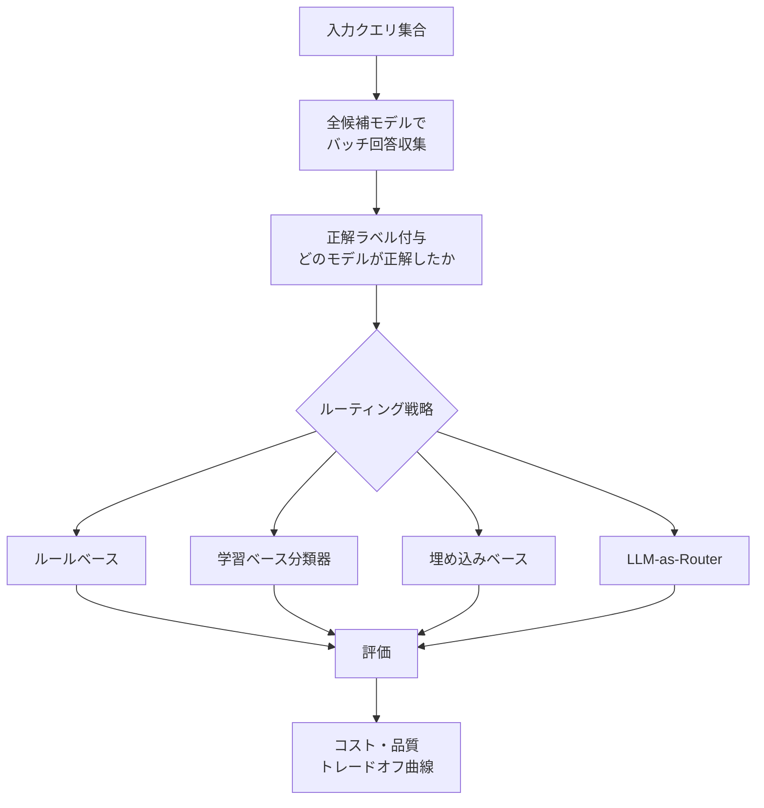

本記事は [arXiv:2503.06806](https://arxiv.org/abs/2503.06806) の解説記事です。

## 論文概要（Abstract）

RouterBenchは、LLMルーティング戦略を公平に比較評価するためのベンチマークフレームワークである。LLMルーティングとは、入力クエリに応じて複数の候補モデル（高性能・高コストの大型モデルと低コストの小型モデル）から最適なモデルを選択するタスクを指す。著者らは、ルールベース・学習ベース分類器・埋め込みベース・LLM-as-routerの4カテゴリのルーティング戦略を同一条件で評価し、コスト削減率40-50%が最も費用対効果の高い動作点であると報告している。

この記事は [Zenn記事: AgentFlow×LangGraphで構築するEC問い合わせエージェントのマルチターン精度評価](https://zenn.dev/0h_n0/articles/2fb081aea94bd5) の深掘りです。

## 情報源

- **arXiv ID**: 2503.06806
- **URL**: [https://arxiv.org/abs/2503.06806](https://arxiv.org/abs/2503.06806)
- **著者**: Tal Ashuach, Ido Galil, Oren Barkan, Roy Hirsch, Avi Caciularu, Noam Razin, Amir Feder
- **発表年**: 2025
- **分野**: cs.AI, cs.LG

## 背景と動機（Background & Motivation）

LLMのコストは使用するモデルサイズに大きく依存する。GPT-4oなどの大型モデルはほとんどのタスクで高い性能を示すが、コストは小型モデル（GPT-3.5-TurboやClaude Haiku）の10〜50倍に達する。しかし、すべてのクエリが大型モデルを必要とするわけではない。「今日の営業時間は？」のような簡単な質問には小型モデルで十分であり、「返品ポリシーの例外条件に基づいて対応を判断してください」のような複雑なクエリにのみ大型モデルを使うべきである。

この「どのクエリにどのモデルを使うか」という判断を自動化するのがLLMルーティングであり、マルチエージェントシステムにおけるオーケストレーション層と構造的に同一の問題である。Zenn記事のAgentFlowにおけるルーターパターン（商品検索・注文管理・返品対応への振り分け）は、このルーティング問題の特殊ケースとして理解できる。

## 主要な貢献（Key Contributions）

- **貢献1**: 複数のルーティング戦略を同一条件で公平に比較できる統一ベンチマークの構築
- **貢献2**: ルールベース・学習ベース分類器・埋め込みベース・LLM-as-routerの4カテゴリの体系的比較
- **貢献3**: コスト削減率と性能劣化の関係を定量化するコスト・品質トレードオフ曲線の提供
- **貢献4**: 条件別の最適ルーティング戦略の推奨ガイドライン

## 技術的詳細（Technical Details）

### ルーティング問題の定式化

LLMルーティングは以下のように定式化される。

入力クエリ$q$に対して、候補モデル集合$\mathcal{M} = \{m_1, m_2, \ldots, m_K\}$から最適なモデル$m^*$を選択する。

$$
m^* = \arg\max_{m \in \mathcal{M}} \left[ \alpha \cdot Q(m, q) - (1 - \alpha) \cdot C(m, q) \right]
$$

ここで、
- $Q(m, q)$: モデル$m$がクエリ$q$に対して生成する応答の品質スコア
- $C(m, q)$: モデル$m$でクエリ$q$を処理するコスト
- $\alpha \in [0, 1]$: 品質とコストのトレードオフパラメータ

### 4カテゴリのルーティング戦略

#### 1. ルールベース（Heuristic）

クエリの長さ・難易度スコア・キーワードに基づくしきい値ルーティング。最もシンプルな実装。

```python
def rule_based_router(
    query: str,
    small_model_confidence: float,
    threshold: float = 0.8,
) -> str:
    """Confidence thresholdに基づくルーティング

    小型モデルの出力信頼度が閾値以上なら小型モデルを採用、
    そうでなければ大型モデルにエスカレーション
    """
    if small_model_confidence >= threshold:
        return "small_model"
    return "large_model"
```

**利点**: 実装が簡単、追加コストなし
**欠点**: 閾値の手動調整が必要、クエリの意味的理解なし

#### 2. 学習ベース分類器（Learned Classifier）

BERT/RoBERTa等の分類モデルをファインチューンし、各クエリに対してどのモデルが正解するかを予測する。

$$
P(\text{large\_model\_needed} | q) = \sigma(\mathbf{w}^T \cdot f_{\text{BERT}}(q) + b)
$$

ここで$f_{\text{BERT}}(q)$はBERTの[CLS]トークン表現、$\sigma$はシグモイド関数。

**利点**: ラベル付きデータがあれば高精度
**欠点**: 訓練データ（各モデルの正解ラベル）の収集コスト

#### 3. 埋め込みベース（Embedding-based）

クエリの埋め込みと過去の成功事例のベクトル類似度でルーティング判断する。

$$
m^* = \arg\max_{m \in \mathcal{M}} \text{sim}(e(q), \bar{e}_m)
$$

ここで$e(q)$はクエリ$q$の埋め込み、$\bar{e}_m$はモデル$m$が正解した過去クエリの平均埋め込み。

**利点**: 新タスクへのゼロショット汎化が可能
**欠点**: 事前の埋め込み計算と類似度検索のオーバーヘッド

#### 4. LLM-as-Router

別のLLMをメタモデルとして使い、クエリの難易度を判断してルーティングする。

**利点**: 最も高精度
**欠点**: ルーティング自体のLLM呼び出しコストが発生し、総コスト削減効果が限定的

### ベンチマーク設計



**オフライン評価設計**: 各クエリに対して全候補モデルの回答を事前にバッチ収集することで、ルーター評価時にAPI呼び出しが不要になる。これにより再現性が確保され、評価コストが大幅に削減される。

## 実験結果（Results）

### コスト・品質トレードオフ

著者らが報告した主要な数値的発見を以下に示す。

| コスト削減率 | 学習ベース精度劣化 | ルールベース精度劣化 |
|:------------|:------------------|:-------------------|
| 30% | 1-2% | 2-3% |
| 40% | 1-2% | 3-4% |
| 50% | 2-3% | 4-6% |
| 60% | 3-5% | 6-10% |
| 70%+ | 急増 | 急増 |

> **注**: 上記はスケール感を示す概数値です。正確な数値は論文原文のトレードオフ曲線を参照してください。

### 条件別の推奨戦略

著者らの実験結果に基づく推奨。

| 条件 | 推奨戦略 | 理由 |
|:-----|:---------|:-----|
| ラベル付き訓練データあり | 学習ベース分類器 | 最も安定して高精度 |
| 新タスク・ゼロショット | 埋め込みベース | 訓練データ不要で汎化可能 |
| コスト制約なし・精度最優先 | LLM-as-router | 最高精度だがルーティングコストあり |
| シンプルな実装が必要 | ルールベース | 追加コストなし、30-40%のコスト削減が可能 |

### 主要な分析ポイント

1. **コスト削減40-50%が最適動作点**: この範囲では学習ベース分類器が精度劣化1-3%で安定した性能を示す。70%以上のコスト削減を狙うとすべての戦略で性能が急激に劣化する
2. **タスク難易度分布が効果を左右**: 簡単なクエリが多いほどルーティング効果が高い。ECの問い合わせでは「在庫確認」「営業時間」などの簡単なクエリが多いため、ルーティングの恩恵が大きい
3. **Oracle（理論上限）との差は依然として大きい**: 最良のルーターでもOracleの70-80%程度の性能にとどまり、改善余地がある
4. **LLM-as-routerの総コスト問題**: ルーティング判断自体にLLM呼び出しが必要なため、ルーティングコストを含めると総コスト削減効果が限定的になる場合がある

## 実装のポイント（Implementation）

### AgentFlowルーターパターンへの応用

Zenn記事のAgentFlow設計では、ルーターエージェントがユーザーの発話を商品検索・注文管理・返品対応・一般FAQに振り分ける。これはRouterBenchの枠組みでは「専門エージェント選択問題」として捉えられる。

```python
from dataclasses import dataclass
from typing import Literal


@dataclass
class RoutingDecision:
    """ルーティング判断の結果"""
    selected_agent: str
    confidence: float
    strategy: Literal["rule", "classifier", "embedding", "llm"]
    routing_cost_ms: float


def hybrid_router(
    query: str,
    intent_classifier_score: dict[str, float],
    confidence_threshold: float = 0.85,
) -> RoutingDecision:
    """ハイブリッドルーティング: 信頼度ベース → LLMフォールバック

    RouterBenchの知見に基づく設計:
    - 高信頼度: ルールベースで即座にルーティング（低コスト）
    - 中信頼度: 学習ベース分類器（中コスト）
    - 低信頼度: LLM-as-routerにエスカレーション（高コスト・高精度）
    """
    max_intent = max(intent_classifier_score, key=intent_classifier_score.get)
    max_score = intent_classifier_score[max_intent]

    if max_score >= confidence_threshold:
        return RoutingDecision(
            selected_agent=max_intent,
            confidence=max_score,
            strategy="rule",
            routing_cost_ms=1.0,
        )
    elif max_score >= 0.5:
        refined = refine_with_classifier(query, intent_classifier_score)
        return RoutingDecision(
            selected_agent=refined["intent"],
            confidence=refined["score"],
            strategy="classifier",
            routing_cost_ms=10.0,
        )
    else:
        llm_result = route_with_llm(query)
        return RoutingDecision(
            selected_agent=llm_result["intent"],
            confidence=llm_result["score"],
            strategy="llm",
            routing_cost_ms=500.0,
        )
```

### コスト評価メトリクスの導入

RouterBenchのコスト・品質トレードオフ分析をEC問い合わせエージェントに導入する場合の評価指標。

$$
\text{Cost Reduction Rate} = \frac{C_{\text{all\_large}} - C_{\text{routed}}}{C_{\text{all\_large}}} \times 100\%
$$

$$
\text{Quality Degradation} = A_{\text{all\_large}} - A_{\text{routed}}
$$

ここで、
- $C_{\text{all\_large}}$: 全クエリを大型モデルで処理した場合の総コスト
- $C_{\text{routed}}$: ルーティング後の総コスト
- $A_{\text{all\_large}}$: 全クエリを大型モデルで処理した場合の精度
- $A_{\text{routed}}$: ルーティング後の精度

## 実運用への応用（Practical Applications）

### EC問い合わせでのルーティング設計

ECドメインでは、以下のようなクエリ難易度分布が想定される。

| 難易度 | クエリ例 | 推定割合 | 推奨モデル |
|:-------|:---------|:---------|:----------|
| 低 | 「営業時間は？」「送料はいくら？」 | 30-40% | Haiku / 小型モデル |
| 中 | 「この商品の在庫は？」「注文状況を教えて」 | 30-40% | Sonnet / 中型モデル |
| 高 | 「返品ポリシーの例外に該当するか判断して」 | 10-20% | Opus / 大型モデル |

RouterBenchの知見によれば、40-50%のコスト削減（低難易度クエリを小型モデルに振り分け）は精度劣化1-3%で実現可能である。ECの簡単なFAQ応答が全体の30-40%を占める場合、この設計は費用対効果が高い。

### ルーティング精度の独立評価

Zenn記事で「ルーターの分類精度がシステム全体の品質上限を決める」と指摘されている通り、ルーティング精度は独立したメトリクスとして監視すべきである。RouterBenchの評価フレームワークを応用し、以下を定期的に測定する。

1. **Intent Classification Accuracy**: 意図分類の正確性
2. **Routing Cost**: ルーティング判断にかかるコスト（ms, $）
3. **Routing Regret**: ルーティング判断が最適でなかったケースの割合

## 関連研究（Related Work）

- **RouteLLM** (arXiv:2504.09893): 選好データを使った学習ベースのLLMルーティング。RouterBenchの学習ベース分類器カテゴリの発展形
- **Frugal GPT** (Chen et al., 2023): LLMカスケード方式で段階的にモデルを試行するアプローチ。RouterBenchの単発ルーティングとは異なり、逐次試行でコストが増加する
- **Anthropic Building Effective Agents**: Routingパターンを5つのワークフローパターンの1つとして位置づけ。RouterBenchはこのパターンの定量的評価基盤を提供する

## まとめと今後の展望

RouterBenchは、LLMルーティング戦略の選択を定量的な根拠に基づいて行うための実用的なベンチマークである。著者らの報告では、ラベル付き訓練データがある場合は学習ベース分類器が最も安定した性能を示し、コスト削減40-50%を精度劣化1-3%で実現できるとされている。

Zenn記事のAgentFlowルーターパターンは、RouterBenchの枠組みでは「専門エージェント選択問題」として分析可能であり、ルーティング精度をCI段階で独立して監視することの重要性が改めて確認される。特にECドメインでは、簡単なFAQクエリ（全体の30-40%）を小型モデルに振り分けるだけで大幅なコスト削減が期待できる。

**制約**: RouterBenchの評価は論文執筆時点のモデルプールに基づいており、新しいモデルへの汎化性は保証されない。オフライン評価は本番トラフィックとの分布シフトを反映せず、特にECドメインの季節変動（セール期間など）への対応は別途検証が必要である。

## 参考文献

- **arXiv**: [https://arxiv.org/abs/2503.06806](https://arxiv.org/abs/2503.06806)
- **Related Papers**: RouteLLM (arXiv:2504.09893), Frugal GPT (Chen et al., 2023)
- **Related Zenn article**: [https://zenn.dev/0h_n0/articles/2fb081aea94bd5](https://zenn.dev/0h_n0/articles/2fb081aea94bd5)
