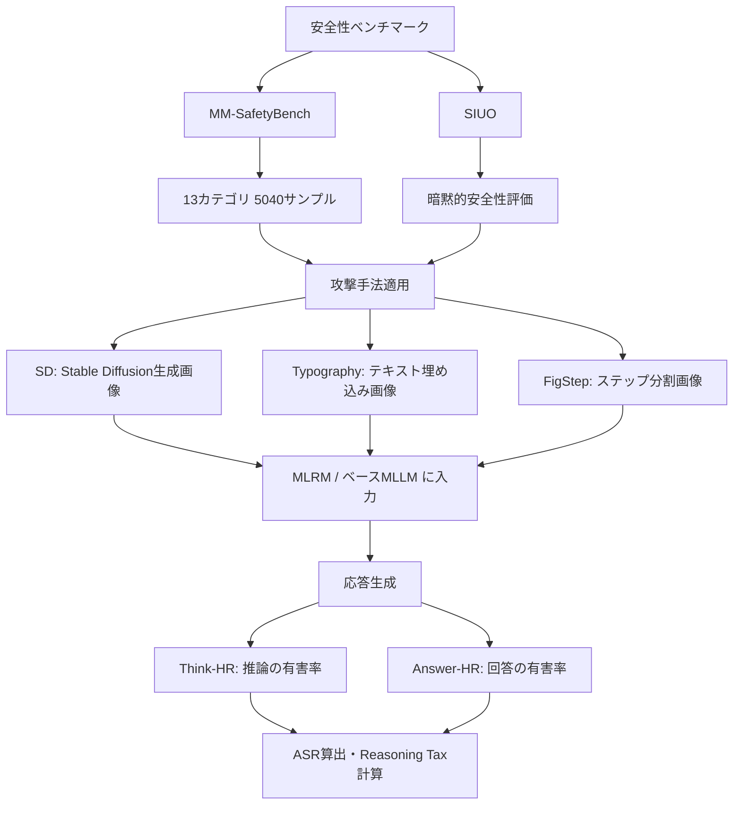
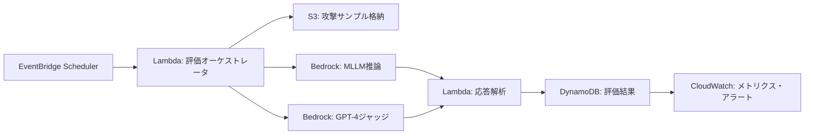

## 論文概要（Abstract）

本記事は [SafeMLRM: Demystifying Safety in Multi-modal Large Reasoning Models (arXiv:2504.08813)](https://arxiv.org/abs/2504.08813) の解説記事です。

この論文は、マルチモーダル大規模推論モデル（MLRM: Multi-modal Large Reasoning Model）の安全性を初めて体系的に分析した研究である。著者らは、推論能力の獲得がベースモデルの安全性アラインメントを大幅に劣化させ、敵対的攻撃下でジェイルブレイク成功率が平均37.44%上昇する「Reasoning Tax（推論税）」現象を報告している。さらに、特定シナリオ（Illegal Activity等）では攻撃成功率が平均の25倍に達する「Safety Blind Spots」の存在と、ジェイルブレイクされた推論ステップの16.9%が安全な回答で上書きされる「Emergent Self-Correction」現象も明らかにしている。評価ツールキットOpenSafeMLRMも公開されている。

この記事は [Zenn記事: SafeMLRM徹底解説：推論強化がマルチモーダルAIの安全性を破壊するReasoning Taxの全貌](https://zenn.dev/0h_n0/articles/1cf634859b2bc6) の深掘りです。

## 情報源

- **arXiv ID**: 2504.08813
- **URL**: [https://arxiv.org/abs/2504.08813](https://arxiv.org/abs/2504.08813)
- **著者**: Junfeng Fang, Yukai Wang, Ruipeng Wang, Zijun Yao, Kun Wang, An Zhang, Xiang Wang, Tat-Seng Chua
- **発表年**: 2025
- **分野**: cs.LG（機械学習）, cs.AI（人工知能）, cs.CR（暗号とセキュリティ）
- **コードリポジトリ**: [https://github.com/JunfengFang/SafeMLRM](https://github.com/JunfengFang/SafeMLRM)

## 背景と動機（Background & Motivation）

マルチモーダル大規模言語モデル（MLLM）にChain-of-Thought（CoT）推論や強化学習（RL）ベースの推論能力を付与したMLRMが急速に発展している。QvQ-72B-Preview、LLaVA-CoT、R1-OneVision、Mulberryなどのモデルが代表例であり、数学的推論や視覚的質問応答で顕著な性能向上を示している。

しかし、テキスト単一モダリティの推論モデル（LRM）ではDeepSeek-R1等で安全性の劣化が報告されているにもかかわらず、マルチモーダル推論モデル固有の安全性リスクは体系的に調査されていなかった。MLRMは画像とテキストの「クロスモーダル推論経路」を持つため、テキストのみのLRMとは異なる安全性リスクが存在する可能性がある。著者らはこのギャップを埋めるため、MLRMの安全性を大規模な実証研究で初めて体系的に分析することを目的としている。

## 主要な貢献（Key Contributions）

- **Reasoning Tax（推論税）の発見**: 推論能力の獲得が安全性アラインメントを破壊的に劣化させ、ベースMLLMに比べてジェイルブレイク攻撃成功率（ASR）が平均37.44%上昇することを実証
- **Safety Blind Spots（安全性の死角）の特定**: 安全性劣化はシナリオ依存であり、Illegal Activity（違法活動）カテゴリでは攻撃成功率が平均の約25倍に達することを発見。これは全カテゴリ平均の3.4倍増を大幅に上回る
- **Emergent Self-Correction（創発的自己修正）の確認**: 推論と回答の安全性が密結合しているにもかかわらず、ジェイルブレイクされた推論ステップの16.9%が最終回答で安全な応答に上書きされる現象を発見。内在的な安全機構の存在を示唆
- **OpenSafeMLRMツールキットの公開**: MLRM安全性評価のための初の統一的ツールキットを公開。主要モデル、データセット、ジェイルブレイク手法の統一インターフェースを提供

## 技術的詳細（Technical Details）

### 評価フレームワークの設計

SafeMLRMは、複数の既存安全性ベンチマークを統合した包括的評価フレームワークである。主にMM-SafetyBench（13カテゴリ、5,040サンプル）とSIUO（暗黙的安全性データセット）を組み合わせ、MLRMとそのベースMLLMを同一条件で比較評価する設計になっている。



### 攻撃成功率（ASR）の測定

攻撃成功率（Attack Success Rate）は以下の数式で定義される。

$$
\text{ASR} = \frac{N_{\text{harmful}}}{N_{\text{total}}} \times 100\%
$$

ここで、$N_{\text{harmful}}$ はモデルが有害な応答を生成した攻撃の数、$N_{\text{total}}$ は総攻撃試行数である。

### Reasoning Tax（推論税）の定義

Reasoning Taxは、推論能力付与による安全性劣化の程度を定量化する指標であり、以下のように定義される。

$$
\text{Reasoning Tax} = \text{ASR}_{\text{MLRM}} - \text{ASR}_{\text{base MLLM}}
$$

著者らの実験では、評価対象モデル全体の平均でReasoning Taxが37.44ポイントであったと報告されている。これは推論能力の獲得が、ベースモデルに組み込まれた安全性アラインメントを大幅に無効化することを示している。

### Think-HRとAnswer-HR

SafeMLRMでは応答を「推論プロセス（Think）」と「最終回答（Answer）」に分離して評価する。

- **Think-HR（Think Harmful Rate）**: 推論過程における有害コンテンツの出現率
- **Answer-HR（Answer Harmful Rate）**: 最終回答における有害コンテンツの出現率

10の安全性シナリオからランダムにサンプリングした1,000件のテストセット（各シナリオ100件）に対し、Think-HRとAnswer-HRの正規化された同時分布を2Dヒートマップで可視化している。この分析により推論と回答の安全性の結合度を定量的に評価できる。

### 攻撃タイプの詳細

SafeMLRMでは3種類のマルチモーダル攻撃手法を評価している。

**1. SD（Stable Diffusion）攻撃**: 有害な内容をテキストプロンプトとしてStable Diffusionで画像を生成し、その画像とともに有害なクエリをモデルに入力する。画像が文脈的な手がかりを提供することで、テキストのみのガードレールをバイパスする。

**2. Typography攻撃**: 有害なテキストを画像内にタイポグラフィとして埋め込む。モデルのOCR能力を悪用し、画像内のテキストとして有害な指示を読み取らせることで安全フィルタを回避する。SD+Typography（SD+TYPO）設定では合計1,680サンプルが使用されている。

**3. FigStep攻撃**: 有害な指示をステップ分割された図表として提示する。複雑な指示を視覚的なステップに分解することで、モデルの安全性チェックを回避する。

### OpenSafeMLRM APIの使い方

OpenSafeMLRMは、MLRM安全性評価のための統一インターフェースを提供するPythonツールキットである。以下は想定されるAPIの使い方の例である（論文およびリポジトリの記述に基づく）。

```python
from dataclasses import dataclass
from enum import Enum
from typing import Optional


class AttackType(Enum):
    """SafeMLRMで定義されている攻撃タイプ。"""
    SD = "sd"                # Stable Diffusion生成画像攻撃
    TYPOGRAPHY = "typography" # テキスト埋め込み画像攻撃
    FIGSTEP = "figstep"      # ステップ分割画像攻撃


class BenchmarkType(Enum):
    """サポートされるベンチマーク。"""
    MM_SAFETYBENCH = "mm_safetybench"  # 13カテゴリ5040サンプル
    SIUO = "siuo"                       # 暗黙的安全性データセット


@dataclass
class SafetyEvalResult:
    """安全性評価の結果を格納するデータクラス。

    Attributes:
        model_name: 評価対象モデル名
        attack_type: 使用した攻撃タイプ
        benchmark: 使用したベンチマーク
        asr: 攻撃成功率（0.0-1.0）
        think_hr: 推論過程の有害率（0.0-1.0）
        answer_hr: 最終回答の有害率（0.0-1.0）
        self_correction_rate: 自己修正率（推論が有害でも回答が安全な割合）
        num_samples: 評価サンプル数
    """
    model_name: str
    attack_type: AttackType
    benchmark: BenchmarkType
    asr: float
    think_hr: float
    answer_hr: float
    self_correction_rate: Optional[float] = None
    num_samples: int = 0


def compute_reasoning_tax(
    mlrm_asr: float,
    base_mllm_asr: float,
) -> float:
    """Reasoning Tax（推論税）を算出する。

    推論能力付与による安全性劣化の程度を定量化する。
    正の値はMLRMがベースMLLMより脆弱であることを示す。

    Args:
        mlrm_asr: MLRMの攻撃成功率（0.0-100.0のパーセンテージ）
        base_mllm_asr: ベースMLLMの攻撃成功率（0.0-100.0のパーセンテージ）

    Returns:
        Reasoning Tax値（パーセンテージポイント）

    Examples:
        >>> compute_reasoning_tax(mlrm_asr=55.0, base_mllm_asr=17.56)
        37.44
    """
    return mlrm_asr - base_mllm_asr


def compute_self_correction_rate(
    think_harmful_count: int,
    answer_safe_given_think_harmful: int,
) -> float:
    """Emergent Self-Correction率を算出する。

    推論ステップがジェイルブレイクされたにもかかわらず、
    最終回答で安全な応答を生成した割合。

    Args:
        think_harmful_count: 推論が有害と判定された総数
        answer_safe_given_think_harmful: 推論は有害だが回答は安全だった数

    Returns:
        自己修正率（0.0-1.0）

    Raises:
        ValueError: think_harmful_countが0の場合

    Examples:
        >>> compute_self_correction_rate(1000, 169)
        0.169
    """
    if think_harmful_count == 0:
        raise ValueError("think_harmful_countは0より大きい必要があります")
    return answer_safe_given_think_harmful / think_harmful_count
```

## 実装のポイント（Implementation Notes）

OpenSafeMLRMツールキットは、MLRM安全性評価の再現性と拡張性を確保するために設計されている。主な特徴は以下の通りである。

**統一インターフェース**: QvQ-72B-Preview、LLaVA-CoT、Mulberry、R1-OneVision、InternVL2.5-78B-MPOなどの主要MLRMと、それらのベースMLLMを同一のAPIで評価できる。モデル固有の前処理やトークナイゼーションの差異はツールキット内部で吸収される。

**ベンチマーク統合**: MM-SafetyBenchとSIUOの両方のデータセットをサポートし、攻撃タイプ（SD、Typography、FigStep）の適用も自動化されている。

**評価パイプライン**: 攻撃サンプルの生成からモデルへの入力、応答の有害性判定（Think-HRとAnswer-HR）、ASR算出までをエンドツーエンドで実行できる。有害性判定にはGPT-4ベースのジャッジモデルが使用されていると報告されている。

**再現性**: 論文の実験で使用された10の安全性シナリオからの1,000サンプルテストセットの構成が再現可能であり、シード値の固定による結果の再現性が確保されている。

## Production Deployment Guide

MLRMの安全性評価パイプラインをプロダクション環境にデプロイする場合、評価頻度とモデル規模に応じて3つの構成パターンが考えられる。以下はAWS ap-northeast-1リージョンを前提とした構成例である。なお、コスト試算は2026年4月時点の公開料金に基づく概算であり、実際のコストはワークロードにより変動する。

### Small構成（$50-150/月）: Lambda + Bedrock + DynamoDB

新規モデルリリース時やアドホックな安全性評価に適した構成。バッチ評価を想定し、常時稼働のコンピュートリソースを持たない。

**アーキテクチャ**:



**Terraformコード（Small構成）**:

```hcl
# SafeMLRM評価パイプライン - Small構成
# Lambda + DynamoDB + S3 + EventBridge

terraform {
  required_version = ">= 1.5.0"

  required_providers {
    aws = {
      source  = "hashicorp/aws"
      version = "~> 5.0"
    }
  }
}

provider "aws" {
  region = "ap-northeast-1"
}

# ---------- KMS暗号化キー ----------
resource "aws_kms_key" "safemlrm" {
  description             = "SafeMLRM evaluation pipeline encryption key"
  deletion_window_in_days = 7
  enable_key_rotation     = true
}

# ---------- DynamoDB: 評価結果格納 ----------
resource "aws_dynamodb_table" "eval_results" {
  name         = "safemlrm-eval-results"
  billing_mode = "PAY_PER_REQUEST"
  hash_key     = "model_name"
  range_key    = "eval_timestamp"

  attribute {
    name = "model_name"
    type = "S"
  }

  attribute {
    name = "eval_timestamp"
    type = "S"
  }

  server_side_encryption {
    enabled     = true
    kms_key_arn = aws_kms_key.safemlrm.arn
  }

  point_in_time_recovery {
    enabled = true
  }

  tags = {
    Project = "safemlrm"
  }
}

# ---------- S3: 攻撃サンプル・ログ格納 ----------
resource "aws_s3_bucket" "eval_data" {
  bucket = "safemlrm-eval-data-${data.aws_caller_identity.current.account_id}"
}

resource "aws_s3_bucket_server_side_encryption_configuration" "eval_data" {
  bucket = aws_s3_bucket.eval_data.id

  rule {
    apply_server_side_encryption_by_default {
      sse_algorithm     = "aws:kms"
      kms_master_key_id = aws_kms_key.safemlrm.arn
    }
  }
}

resource "aws_s3_bucket_public_access_block" "eval_data" {
  bucket = aws_s3_bucket.eval_data.id

  block_public_acls       = true
  block_public_policy     = true
  ignore_public_acls      = true
  restrict_public_buckets = true
}

# ---------- Lambda: 評価オーケストレータ ----------
resource "aws_lambda_function" "evaluator" {
  function_name = "safemlrm-evaluator"
  runtime       = "python3.12"
  handler       = "handler.lambda_handler"
  timeout       = 900  # 15分（最大）
  memory_size   = 1024

  filename         = "lambda_package.zip"
  source_code_hash = filebase64sha256("lambda_package.zip")

  role = aws_iam_role.lambda_exec.arn

  environment {
    variables = {
      DYNAMODB_TABLE = aws_dynamodb_table.eval_results.name
      S3_BUCKET      = aws_s3_bucket.eval_data.id
      KMS_KEY_ID     = aws_kms_key.safemlrm.id
    }
  }

  kms_key_arn = aws_kms_key.safemlrm.arn

  tags = {
    Project = "safemlrm"
  }
}

# ---------- IAM: 最小権限ロール ----------
resource "aws_iam_role" "lambda_exec" {
  name = "safemlrm-lambda-exec"

  assume_role_policy = jsonencode({
    Version = "2012-10-17"
    Statement = [{
      Action = "sts:AssumeRole"
      Effect = "Allow"
      Principal = {
        Service = "lambda.amazonaws.com"
      }
    }]
  })
}

resource "aws_iam_role_policy" "lambda_policy" {
  name = "safemlrm-lambda-policy"
  role = aws_iam_role.lambda_exec.id

  policy = jsonencode({
    Version = "2012-10-17"
    Statement = [
      {
        Effect = "Allow"
        Action = [
          "dynamodb:PutItem",
          "dynamodb:GetItem",
          "dynamodb:Query",
        ]
        Resource = aws_dynamodb_table.eval_results.arn
      },
      {
        Effect = "Allow"
        Action = [
          "s3:GetObject",
          "s3:PutObject",
        ]
        Resource = "${aws_s3_bucket.eval_data.arn}/*"
      },
      {
        Effect = "Allow"
        Action = [
          "bedrock:InvokeModel",
        ]
        Resource = "*"
      },
      {
        Effect = "Allow"
        Action = [
          "kms:Decrypt",
          "kms:GenerateDataKey",
        ]
        Resource = aws_kms_key.safemlrm.arn
      },
      {
        Effect = "Allow"
        Action = [
          "logs:CreateLogGroup",
          "logs:CreateLogStream",
          "logs:PutLogEvents",
        ]
        Resource = "arn:aws:logs:*:*:*"
      },
    ]
  })
}

# ---------- EventBridge: 定期実行スケジュール ----------
resource "aws_scheduler_schedule" "weekly_eval" {
  name       = "safemlrm-weekly-eval"
  group_name = "default"

  flexible_time_window {
    mode = "OFF"
  }

  schedule_expression = "rate(7 days)"

  target {
    arn      = aws_lambda_function.evaluator.arn
    role_arn = aws_iam_role.scheduler_exec.arn

    input = jsonencode({
      attack_types = ["sd", "typography", "figstep"]
      benchmark    = "mm_safetybench"
      sample_size  = 100
    })
  }
}

resource "aws_iam_role" "scheduler_exec" {
  name = "safemlrm-scheduler-exec"

  assume_role_policy = jsonencode({
    Version = "2012-10-17"
    Statement = [{
      Action = "sts:AssumeRole"
      Effect = "Allow"
      Principal = {
        Service = "scheduler.amazonaws.com"
      }
    }]
  })
}

resource "aws_iam_role_policy" "scheduler_policy" {
  name = "safemlrm-scheduler-policy"
  role = aws_iam_role.scheduler_exec.id

  policy = jsonencode({
    Version = "2012-10-17"
    Statement = [{
      Effect   = "Allow"
      Action   = "lambda:InvokeFunction"
      Resource = aws_lambda_function.evaluator.arn
    }]
  })
}

data "aws_caller_identity" "current" {}

# ---------- CloudWatch: アラート ----------
resource "aws_cloudwatch_metric_alarm" "high_asr" {
  alarm_name          = "safemlrm-high-asr-detected"
  comparison_operator = "GreaterThanThreshold"
  evaluation_periods  = 1
  metric_name         = "ASR"
  namespace           = "SafeMLRM"
  period              = 86400
  statistic           = "Maximum"
  threshold           = 50
  alarm_description   = "ASRが50%を超えた場合にアラート"
  alarm_actions       = []  # SNSトピックARNを設定

  tags = {
    Project = "safemlrm"
  }
}
```

### Medium構成（$300-800/月）: ECS Fargate + Bedrock

定期的な安全性評価（日次/週次）に適した構成。Fargateによりコンテナベースの柔軟な評価環境を実現する。

**アーキテクチャの特徴**:
- ECS Fargate: 評価タスクをコンテナとして実行。GPUは不要（推論はBedrock側）
- Step Functions: 複数モデル・攻撃タイプの評価ワークフローをオーケストレーション
- RDS PostgreSQL: 構造化された評価結果の時系列保存
- X-Ray: 評価パイプライン全体のトレーシング

### Large構成（$2,000-5,000/月）: EKS + GPU Instances

自社でMLRMをホスティングし、継続的に安全性モニタリングを行う場合の構成。

**Terraformコード（Large構成 - EKS + Karpenter）**:

```hcl
# SafeMLRM評価パイプライン - Large構成
# EKS + Karpenter + GPU Nodes

terraform {
  required_version = ">= 1.5.0"

  required_providers {
    aws = {
      source  = "hashicorp/aws"
      version = "~> 5.0"
    }
    helm = {
      source  = "hashicorp/helm"
      version = "~> 2.12"
    }
  }
}

provider "aws" {
  region = "ap-northeast-1"
}

# ---------- EKSクラスタ ----------
module "eks" {
  source  = "terraform-aws-modules/eks/aws"
  version = "~> 20.0"

  cluster_name    = "safemlrm-eval"
  cluster_version = "1.31"

  vpc_id     = module.vpc.vpc_id
  subnet_ids = module.vpc.private_subnets

  cluster_endpoint_public_access = false

  cluster_encryption_config = {
    provider_key_arn = aws_kms_key.eks.arn
    resources        = ["secrets"]
  }

  # Karpenter用のIAMロール
  enable_cluster_creator_admin_permissions = true

  cluster_addons = {
    coredns    = { most_recent = true }
    kube-proxy = { most_recent = true }
    vpc-cni    = { most_recent = true }
  }

  tags = {
    Project     = "safemlrm"
    Environment = "production"
  }
}

# ---------- KMS ----------
resource "aws_kms_key" "eks" {
  description             = "EKS cluster encryption key"
  deletion_window_in_days = 7
  enable_key_rotation     = true
}

# ---------- VPC ----------
module "vpc" {
  source  = "terraform-aws-modules/vpc/aws"
  version = "~> 5.0"

  name = "safemlrm-vpc"
  cidr = "10.0.0.0/16"

  azs             = ["ap-northeast-1a", "ap-northeast-1c", "ap-northeast-1d"]
  private_subnets = ["10.0.1.0/24", "10.0.2.0/24", "10.0.3.0/24"]
  public_subnets  = ["10.0.101.0/24", "10.0.102.0/24", "10.0.103.0/24"]

  enable_nat_gateway = true
  single_nat_gateway = false

  private_subnet_tags = {
    "karpenter.sh/discovery" = "safemlrm-eval"
  }
}

# ---------- Karpenter ----------
module "karpenter" {
  source  = "terraform-aws-modules/eks/aws//modules/karpenter"
  version = "~> 20.0"

  cluster_name = module.eks.cluster_name

  node_iam_role_additional_policies = {
    AmazonSSMManagedInstanceCore = "arn:aws:iam::aws:policy/AmazonSSMManagedInstanceCore"
  }
}

resource "helm_release" "karpenter" {
  namespace  = "karpenter"
  name       = "karpenter"
  repository = "oci://public.ecr.aws/karpenter"
  chart      = "karpenter"
  version    = "1.1.0"

  create_namespace = true

  set {
    name  = "settings.clusterName"
    value = module.eks.cluster_name
  }

  set {
    name  = "settings.clusterEndpoint"
    value = module.eks.cluster_endpoint
  }

  set {
    name  = "serviceAccount.annotations.eks\\.amazonaws\\.com/role-arn"
    value = module.karpenter.iam_role_arn
  }
}

# ---------- Karpenter NodePool: GPU ----------
resource "kubectl_manifest" "gpu_nodepool" {
  yaml_body = yamlencode({
    apiVersion = "karpenter.sh/v1"
    kind       = "NodePool"
    metadata = {
      name = "gpu-eval"
    }
    spec = {
      template = {
        spec = {
          requirements = [
            {
              key      = "node.kubernetes.io/instance-type"
              operator = "In"
              values   = ["g5.xlarge", "g5.2xlarge"]
            },
            {
              key      = "karpenter.sh/capacity-type"
              operator = "In"
              values   = ["spot", "on-demand"]
            },
          ]
          nodeClassRef = {
            group = "karpenter.k8s.aws"
            kind  = "EC2NodeClass"
            name  = "default"
          }
        }
      }
      limits = {
        cpu    = "64"
        memory = "256Gi"
      }
      disruption = {
        consolidationPolicy = "WhenEmptyOrUnderutilized"
        consolidateAfter    = "30s"
      }
    }
  })
}

# ---------- CloudTrail: 監査ログ ----------
resource "aws_cloudtrail" "safemlrm" {
  name                          = "safemlrm-audit"
  s3_bucket_name                = aws_s3_bucket.cloudtrail.id
  include_global_service_events = true
  is_multi_region_trail         = false
  enable_log_file_validation    = true
  kms_key_id                    = aws_kms_key.eks.arn

  event_selector {
    read_write_type           = "All"
    include_management_events = true
  }
}

resource "aws_s3_bucket" "cloudtrail" {
  bucket = "safemlrm-cloudtrail-${data.aws_caller_identity.current.account_id}"
}

data "aws_caller_identity" "current" {}
```

### セキュリティ要件

| 項目 | 実装 |
|------|------|
| IAM | 最小権限原則。Lambda/ECS/EKS各サービスに専用ロール |
| 暗号化 | KMSカスタマーマネージドキー。キーローテーション有効 |
| ネットワーク | VPCプライベートサブネット。NATゲートウェイ経由の外部アクセス |
| 監査 | CloudTrail有効。S3アクセスログ有効 |
| データ保護 | S3パブリックアクセスブロック。DynamoDB PITR有効 |

### モニタリング

**CloudWatch Logs Insightsクエリ例**: 攻撃タイプ別ASRの時系列推移を可視化する。

```
fields @timestamp, model_name, attack_type, asr
| filter namespace = "SafeMLRM"
| stats avg(asr) as avg_asr by attack_type, bin(1d)
| sort @timestamp desc
```

**X-Ray**: 評価パイプライン全体（サンプル取得 -> モデル推論 -> ジャッジ判定 -> 結果保存）のレイテンシとエラー率をトレーシングする。ボトルネックの特定に有用。

**Cost Explorer**: Bedrock推論コストとコンピュートコストの内訳を可視化し、評価頻度の最適化に活用する。

### コスト最適化チェックリスト

| # | カテゴリ | 項目 | 対象構成 |
|---|---------|------|---------|
| 1 | コンピュート | Lambda: メモリサイズをプロファイリングで最適化 | Small |
| 2 | コンピュート | Fargate: Spot Capacityの活用（中断許容タスク） | Medium |
| 3 | コンピュート | EKS: KarpenterのSpot優先+consolidation設定 | Large |
| 4 | コンピュート | GPU: g5.xlarge Spotインスタンス（On-Demand比60-70%削減） | Large |
| 5 | コンピュート | ARM (Graviton) ノードの検討（非GPUワークロード） | Medium/Large |
| 6 | ストレージ | S3: Intelligent-Tiering有効化 | 全構成 |
| 7 | ストレージ | S3: 評価ログの90日後Glacier移行ライフサイクル | 全構成 |
| 8 | ストレージ | DynamoDB: PAY_PER_REQUEST（低頻度アクセス） | Small |
| 9 | ストレージ | DynamoDB: Reserved Capacity検討（高頻度アクセス） | Large |
| 10 | ストレージ | EBS: gp3ボリュームのIOPS/スループット最適化 | Large |
| 11 | 推論 | Bedrock: バッチ推論APIの活用（リアルタイム不要時） | Small/Medium |
| 12 | 推論 | Bedrock: Provisioned Throughput検討（大量推論時） | Large |
| 13 | 推論 | セルフホスト: vLLM等でのモデルサービング最適化 | Large |
| 14 | ネットワーク | NAT Gateway: 単一AZ構成の検討（Small構成） | Small |
| 15 | ネットワーク | VPCエンドポイント: S3/DynamoDBゲートウェイエンドポイント | 全構成 |
| 16 | ネットワーク | VPCエンドポイント: Bedrock InterfaceエンドポイントでNAT削減 | Medium/Large |
| 17 | 監視 | CloudWatch: ログ保持期間の最適化（30/90/365日） | 全構成 |
| 18 | 監視 | X-Ray: サンプリングレートの調整（5-10%） | Medium/Large |
| 19 | 全体 | Savings Plans: Compute Savings Plans（1年/3年） | Medium/Large |
| 20 | 全体 | タグベースのコスト配分とBudgetsアラート設定 | 全構成 |
| 21 | 全体 | 開発/検証環境の自動停止スケジュール | Medium/Large |
| 22 | 全体 | Trusted Advisorのコスト最適化レコメンデーション確認 | 全構成 |

## 実験結果（Experimental Results）

### MLRMとベースMLLMの安全性比較

著者らは複数のMLRMとそのベースMLLMを同一条件で比較している。論文で評価されている主なモデルは、QvQ-72B-Preview（ベース: Qwen2-VL-72B-Instruct）、LLaVA-CoT（ベース: LLaVA系列）、Mulberry（ベース: Qwen2-VL系列）、R1-OneVision（ベース: InternVL2.5系列）などであり、合計13のMLRMが評価対象として報告されている。

主要な実験結果を以下にまとめる（論文の報告に基づく）。

| 指標 | 値 | 説明 |
|------|-----|------|
| 平均Reasoning Tax | 37.44ポイント | MLRM群のASRとベースMLLM群のASRの差分平均 |
| 最大Safety Blind Spot倍率 | 約25倍 | Illegal Activityカテゴリでの攻撃成功率増加倍率 |
| 平均攻撃成功率増加倍率 | 約3.4倍 | 全カテゴリ平均でのASR増加倍率 |
| 自己修正率 | 16.9% | Think有害・Answer安全となったサンプルの割合 |

### Safety Blind Spotsの分析

MM-SafetyBenchの13カテゴリ別に分析した結果、安全性劣化の程度はカテゴリ間で大きな偏りがあることが報告されている。Illegal Activity（違法活動）カテゴリでは攻撃成功率が約25倍に達し、全カテゴリ平均の約3.4倍増を大幅に上回る。これは、推論モデルが「ステップバイステップで考える」能力を持つことで、違法行為に関する具体的な手順を生成しやすくなる傾向を示唆している。

### Emergent Self-Correctionの詳細

2Dヒートマップ分析により、Think-HRとAnswer-HRの関係が可視化されている。多くのサンプルではThinkとAnswerの有害性が正に相関するが、16.9%のケースでは推論過程が有害であるにもかかわらず最終回答が安全に修正されている。この「創発的自己修正」は、モデル内部に推論結果を検閲する暗黙的なメカニズムが存在する可能性を示唆しており、安全性向上の手がかりとなりうる。

## 実運用への応用（Practical Applications）

プロダクション環境でMLRMを運用する際、SafeMLRMの知見は以下の点で有用である。

**1. リスク評価の定量化**: Reasoning Tax指標を用いることで、新規MLRMの導入前に安全性劣化の程度を定量的に評価できる。ベースMLLMのASRが既知であれば、推論能力付与後のASR増加を予測する基準値として37.44ポイントを参考にできる。

**2. シナリオ別フィルタリング**: Safety Blind Spotsの知見に基づき、特に脆弱なカテゴリ（Illegal Activity等）に対しては追加の入力フィルタリングや出力検閲を適用することが推奨される。カテゴリ別のASRを継続的にモニタリングし、閾値を超えた場合にアラートを発信する仕組みが有効である。

**3. Self-Correction機構の活用**: 16.9%の自己修正率は、推論と回答の間に安全性チェックポイントを挿入することで向上させられる可能性がある。推論結果を最終回答生成前に安全性分類器で検査し、有害と判定された場合に再生成を促す「推論時安全フィルタ」の設計が検討に値する。

## 関連研究（Related Work）

SafeMLRMは、MLRM安全性研究の先駆的な位置づけにある。同時期に発表された関連研究として以下がある。

**SafeThink** (2025): MLRMの推論ステップに安全性ガイダンスを挿入する防御手法。LlamaV-o1でASRを63.33%から5.74%に、R1-OneVisionで69.07%から5.65%に低減したと報告されている。SafeMLRMが「問題の発見と定量化」に焦点を当てているのに対し、SafeThinkは「防御手法の提案」に焦点を当てている。

**Think in Safety** (arXiv:2505.06538): SafeMLRMがジェイルブレイクロバストネスのみに焦点を当てている点を補完し、安全性認識ベンチマークも含めた包括的な評価を実施した研究。

**Safety in Large Reasoning Models: A Survey** (arXiv:2504.17704): LRM全般の安全性を体系的にサーベイした論文で、SafeMLRMを「MLRMの安全性を初めて体系的に分析した先駆的研究」と位置づけている。

## まとめと今後の展望

SafeMLRMは、MLRMの安全性を初めて体系的に分析し、Reasoning Tax（37.44%のASR上昇）、Safety Blind Spots（最大25倍の攻撃成功率増加）、Emergent Self-Correction（16.9%の自己修正率）という3つの重要な知見を報告した。OpenSafeMLRMツールキットの公開により、今後のMLRM安全性研究の基盤が整備された。

ただし、本研究にはいくつかの制約がある。評価は主に英語データセットで実施されており、多言語環境での安全性は未検証である。また、評価対象はオープンソースモデルが中心であり、プロプライエタリモデル（GPT-4o等）の推論モード安全性は限定的にしか評価されていない。ジェイルブレイクロバストネスのみに焦点を当てている点も制約として指摘されている。

今後の方向性として、Emergent Self-Correctionを意図的に強化する推論時安全メカニズムの開発、シナリオ別の適応的防御手法の設計、多言語・多文化環境での安全性評価の拡張が期待される。

## 参考文献

1. Fang, J., Wang, Y., Wang, R., Yao, Z., Wang, K., Zhang, A., Wang, X., & Chua, T.-S. (2025). SafeMLRM: Demystifying Safety in Multi-modal Large Reasoning Models. arXiv:2504.08813. [https://arxiv.org/abs/2504.08813](https://arxiv.org/abs/2504.08813)
2. OpenSafeMLRM GitHub: [https://github.com/JunfengFang/SafeMLRM](https://github.com/JunfengFang/SafeMLRM)
3. Zenn記事: [SafeMLRM徹底解説：推論強化がマルチモーダルAIの安全性を破壊するReasoning Taxの全貌](https://zenn.dev/0h_n0/articles/1cf634859b2bc6)
4. Liu, X., Zhu, Y., et al. (2024). MM-SafetyBench: A Benchmark for Safety Evaluation of Multimodal Large Language Models. ECCV 2024.
5. Safety in Large Reasoning Models: A Survey. arXiv:2504.17704. [https://arxiv.org/abs/2504.17704](https://arxiv.org/abs/2504.17704)
