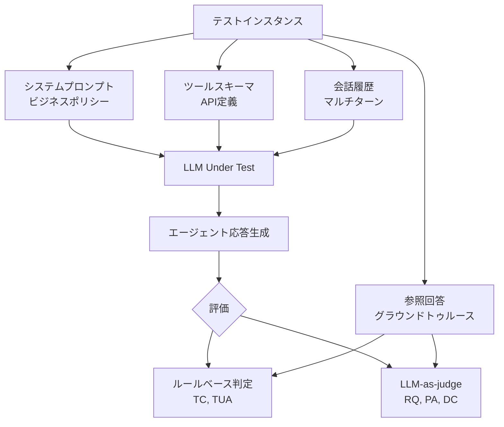

本記事は [arXiv:2504.10139](https://arxiv.org/abs/2504.10139) の解説記事です。

## 論文概要（Abstract）

CustomerServiceBenchは、カスタマーサービス対話におけるLLMの能力を包括的に評価するベンチマークである。著者らは、実際のカスタマーサービスログから構築した1,000件以上のマルチターン対話セッションに対して、タスク完了（TC）・応答品質（RQ）・ツール使用正確性（TUA）・ポリシー遵守（PA）・対話一貫性（DC）の5次元で10以上のLLMを評価している。著者らの報告によれば、プロプライエタリモデルとオープンソースモデルの間に顕著な性能差が存在し、特にツール使用とポリシー遵守の次元でその差が大きいとされている。

この記事は [Zenn記事: AgentFlow×LangGraphで構築するEC問い合わせエージェントのマルチターン精度評価](https://zenn.dev/0h_n0/articles/2fb081aea94bd5) の深掘りです。

## 情報源

- **arXiv ID**: 2504.10139
- **URL**: [https://arxiv.org/abs/2504.10139](https://arxiv.org/abs/2504.10139)
- **著者**: Chunlei Xin, Pengfei Wang, Cheng Shen, Jiazhan Feng, Dong Yu（Tencent AI Lab）
- **発表年**: 2025
- **分野**: cs.CL, cs.AI

## 背景と動機（Background & Motivation）

カスタマーサービスは、マルチターン推論・ツール呼び出し・ビジネスポリシー遵守・自然言語応答品質を同時に要求する複合タスクである。既存のLLM評価ベンチマーク（HELM、AlpacaEval、MT-Benchなど）は汎用的な能力を測定するが、ツール呼び出しの正確性やドメイン固有のポリシー制約への適合といった、カスタマーサービスに固有の要素をカバーしていない。

タスク指向対話ベンチマーク（MultiWOZ、SGDなど）はスロットフィリングや対話状態追跡を評価するものの、実際のビジネスポリシー文書に基づく制約推論やマルチAPI環境でのツール選択精度は評価対象外である。著者らは、この評価の空白を埋めるためにCustomerServiceBenchを構築した。

## 主要な貢献（Key Contributions）

- **貢献1**: EC・金融・通信・エンタメの4ドメインにまたがる実データベースのマルチターン対話ベンチマーク構築。平均12〜15ターンの対話セッション1,000件以上を収録
- **貢献2**: タスク完了・応答品質・ツール使用正確性・ポリシー遵守・対話一貫性の5次元統合評価フレームワークの定義
- **貢献3**: 10以上のLLM（GPT-4o、Claude 3.5 Sonnet、Qwen2-72Bなど）の体系的な比較評価と、具体的なボトルネック分析
- **貢献4**: ルールベース判定とLLM-as-judge（GPT-4使用）のハイブリッド評価手法の提案

## 技術的詳細（Technical Details）

### ベンチマーク構成

データはTencentのカスタマーサービスプラットフォームから収集された実際の会話ログに基づく。各シナリオは以下の4要素で構成される。

1. **システムプロンプト**: ドメイン固有のビジネスポリシーをエンコード
2. **ツールスキーマ**: 呼び出し可能なAPIの定義（ドメインごとに5〜20以上のツール）
3. **マルチターン会話履歴**: 顧客とエージェントの発話系列
4. **参照回答・アクション系列**: 評価のためのグラウンドトゥルース



### 5次元評価メトリクス

著者らが定義した5つの評価次元と、それぞれの測定方法を以下に示す。

#### 1. タスク完了率（Task Completion Rate: TCR）

$$
\text{TCR} = \frac{|\text{成功セッション}|}{|\text{全セッション}|}
$$

顧客の主要な意図を解決できたかどうかを二値判定する。部分的なクレジット（partial credit）も併せて報告される。

#### 2. 応答品質スコア（Response Quality Score: RQS）

LLM judge（GPT-4）が各応答を3つのサブ次元で5段階評価する。

$$
\text{RQS} = \frac{1}{3}(\text{Fluency} + \text{Relevance} + \text{Helpfulness})
$$

ここで各項目は1〜5のLikertスケール（1: 不適切、5: 優秀）。

#### 3. ツール使用精度（Tool Use Accuracy）

ツール呼び出しの正確性をPrecision・Recall・F1で測定する。

$$
\text{TUP} = \frac{|\text{正しいツール呼び出し}|}{|\text{モデルが行った全ツール呼び出し}|}
$$

$$
\text{TUR} = \frac{|\text{正しいツール呼び出し}|}{|\text{グラウンドトゥルースのツール呼び出し}|}
$$

$$
\text{TUF1} = \frac{2 \cdot \text{TUP} \cdot \text{TUR}}{\text{TUP} + \text{TUR}}
$$

「正しいツール呼び出し」とは、ツール名の完全一致**かつ**必須パラメータの値がすべて正しいことを意味する。ツール名は正しいがパラメータ値が異なる場合は不正解として扱われる。

#### 4. ポリシー遵守スコア（Policy Adherence Score: PAS）

各応答がドメイン固有のビジネスルールに準拠しているかを判定する。まずルールマッチングを試行し、曖昧なケースはLLM judgeが判定する。

$$
\text{PAS} = \frac{|\text{準拠応答}|}{|\text{全応答}|}
$$

#### 5. 対話一貫性スコア（Dialogue Coherence Score: DCS）

ターン間の論理的整合性をLLM judgeが5段階で評価する。文脈の引き継ぎ、矛盾のない応答系列、適切なトピック遷移が評価対象。

### 評価プロトコル

評価はターンバイターンのロールアウト方式で実施される。LLMは先行するコンテキスト（システムプロンプト・ツールスキーマ・会話履歴）を受け取り、各エージェントターンを逐次生成する。ユーザー側の発話はオリジナルのログから固定されている。

## 実験結果（Results）

### 主要なベンチマーク結果

著者らが報告した各モデルのスコアを以下に示す（論文Table 2-4より概数値を抽出）。

| モデル | TCR | RQS (1-5) | TUF1 | PAS | DCS (1-5) |
|:-------|:----|:----------|:-----|:----|:----------|
| GPT-4o | 0.72 | 4.1 | 0.68 | 0.65 | 4.0 |
| Claude 3.5 Sonnet | 0.70 | 4.0 | 0.65 | 0.63 | 3.9 |
| Gemini 1.5 Pro | 0.66 | 3.8 | 0.61 | 0.60 | 3.8 |
| Qwen2-72B | 0.60 | 3.6 | 0.55 | 0.55 | 3.6 |
| LLaMA-3-70B | 0.55 | 3.4 | 0.50 | 0.51 | 3.4 |
| Mistral-7B | 0.42 | 3.0 | 0.38 | 0.40 | 3.1 |

> **注**: 上記はスケール感と相対ランキングを示すための概数値です。正確な数値は論文原文のテーブルをご確認ください。

### 分析ポイント

1. **ツール使用とポリシー遵守が最大のボトルネック**: 全モデルを通じてPAS（ポリシー遵守）が最も低いスコアとなっている。ビジネスポリシー文書を読み解いて制約推論を行う能力が不足していることを示唆している
2. **プロプライエタリ vs オープンソースの差が大きい次元**: TUA（ツール使用正確性）とPAS（ポリシー遵守）で最大の差が見られる。応答品質（RQS）では差が比較的小さい
3. **長い対話でのタスク完了率低下**: 著者らは10ターンを超える対話ではすべてのモデルでTCRが顕著に低下すると報告している。コンテキスト管理がボトルネックであることを示す
4. **小型モデルのパラメータ生成失敗**: 7B〜13Bパラメータ帯のモデルはツール名を正しく選択できても、パラメータ値の生成で頻繁に失敗する

## 実装のポイント（Implementation）

本ベンチマークをEC問い合わせエージェントの評価に応用する際のポイントを整理する。

### ルールベースとLLM-as-judgeのハイブリッド設計

CustomerServiceBenchでは、ツール呼び出し（完全一致可能）にはルールベース、応答品質や一貫性（主観的判断を含む）にはLLM-as-judgeを使い分けている。この設計は、Zenn記事で紹介したL1（ツール正確性: ルールベース）とL2（応答品質: LLM-as-judge）の分離と同じ発想である。

```python
from dataclasses import dataclass
from typing import Literal


@dataclass
class EvaluationResult:
    """CustomerServiceBenchスタイルの5次元評価結果"""
    task_completion: float
    response_quality: float
    tool_use_f1: float
    policy_adherence: float
    dialogue_coherence: float

    @property
    def overall_score(self) -> float:
        """加重平均（TC/RQに高い重み、論文の重み設計に従う）"""
        return (
            0.25 * self.task_completion
            + 0.25 * self.response_quality
            + 0.20 * self.tool_use_f1
            + 0.15 * self.policy_adherence
            + 0.15 * self.dialogue_coherence
        )


def evaluate_tool_use(
    predicted_calls: list[dict],
    ground_truth_calls: list[dict],
) -> tuple[float, float, float]:
    """ツール使用のPrecision/Recall/F1をルールベースで算出"""
    correct = 0
    for pred in predicted_calls:
        for gt in ground_truth_calls:
            if (
                pred["tool_name"] == gt["tool_name"]
                and all(
                    pred.get("params", {}).get(k) == v
                    for k, v in gt.get("params", {}).items()
                )
            ):
                correct += 1
                break

    precision = correct / len(predicted_calls) if predicted_calls else 0.0
    recall = correct / len(ground_truth_calls) if ground_truth_calls else 0.0
    f1 = (
        2 * precision * recall / (precision + recall)
        if (precision + recall) > 0
        else 0.0
    )
    return precision, recall, f1
```

### ポリシー遵守の評価設計

ECドメインでは「返品は購入後30日以内」「返金上限は○○円」などのビジネスルールが存在する。CustomerServiceBenchでは、ポリシー文書（500〜2,000語）を各ドメインに用意し、応答がこれに準拠しているかを評価する。自社のエージェント評価に導入する場合は、以下の手順が有効である。

1. ビジネスルールを構造化文書として整理する
2. 各ルールに対するテストケースを作成する（準拠例・違反例の両方）
3. ルールマッチング可能なものはルールベースで判定し、曖昧なケースのみLLM judgeに委託する

## 実運用への応用（Practical Applications）

### Zenn記事の設計との対応関係

Zenn記事で紹介した3層評価（L1: ツール正確性、L2: 応答品質、L3: タスク完了率）とCustomerServiceBenchの5次元の対応を以下に示す。

| Zenn記事の評価層 | CustomerServiceBenchの対応次元 |
|:----------------|:------------------------------|
| L1: ツール正確性 | TUA (Tool Use Accuracy) |
| L2: 応答品質 | RQ (Response Quality) + DC (Dialogue Coherence) |
| L3: タスク完了率 | TC (Task Completion) |
| — | PA (Policy Adherence) ※Zenn記事では未カバー |

注目すべきは、CustomerServiceBenchが**ポリシー遵守（PA）を独立した次元として評価**している点である。Zenn記事の3層評価にPAを追加することで、EC特有のビジネスルール遵守を定量的に監視できるようになる。

### 10ターン超の対話における品質低下への対策

著者らの報告では、10ターンを超える対話で全モデルのタスク完了率が低下する。Zenn記事でもDeepEvalの会話評価でスライディングウィンドウ（`window_size=5`）の活用を推奨しているが、CustomerServiceBenchの知見はこの設計判断を定量的に裏付けている。

## 関連研究（Related Work）

- **MultiWOZ** (Budzianowski et al., 2018): タスク指向対話の代表的ベンチマーク。スロットフィリングと対話状態追跡を評価するが、APIツール呼び出しやビジネスポリシー遵守は評価対象外
- **MT-Bench** (Zheng et al., 2023): LLMのマルチターン対話能力を評価するが、カスタマーサービス特有のドメイン知識やツール使用は含まない
- **ToolBench** (Qin et al., 2024): ツール拡張LLMの評価ベンチマーク。ツール呼び出しに特化するが、対話一貫性やポリシー遵守の評価次元を持たない

CustomerServiceBenchは、これら既存ベンチマークの評価対象を統合し、カスタマーサービスという実務ドメインで5次元を一括評価する点で差別化されている。

## まとめと今後の展望

CustomerServiceBenchは、ECを含むカスタマーサービス対話においてLLMを多角的に評価する実用的なベンチマークである。著者らの報告では、GPT-4oが総合的に最高スコアを達成しているものの、ポリシー遵守率0.65という数値は本番運用には不十分であり、全モデルにおいてこの次元が最大の課題であるとされている。

EC問い合わせエージェントの評価設計においては、Zenn記事の3層評価にポリシー遵守（PA）を4層目として追加することで、ビジネスルール違反の検出と定量化が可能になる。特に返品・返金ポリシーの境界ケースを評価シナリオに組み込むことが、本論文の知見からの具体的な推奨事項である。

**制約**: 本ベンチマークは中国語が主言語であり、日本語や英語への直接の汎化性は検証されていない。また、ユーザー側の発話が固定されている点は、実際の顧客行動の多様性を完全には反映しない。

## 参考文献

- **arXiv**: [https://arxiv.org/abs/2504.10139](https://arxiv.org/abs/2504.10139)
- **Related Zenn article**: [https://zenn.dev/0h_n0/articles/2fb081aea94bd5](https://zenn.dev/0h_n0/articles/2fb081aea94bd5)
