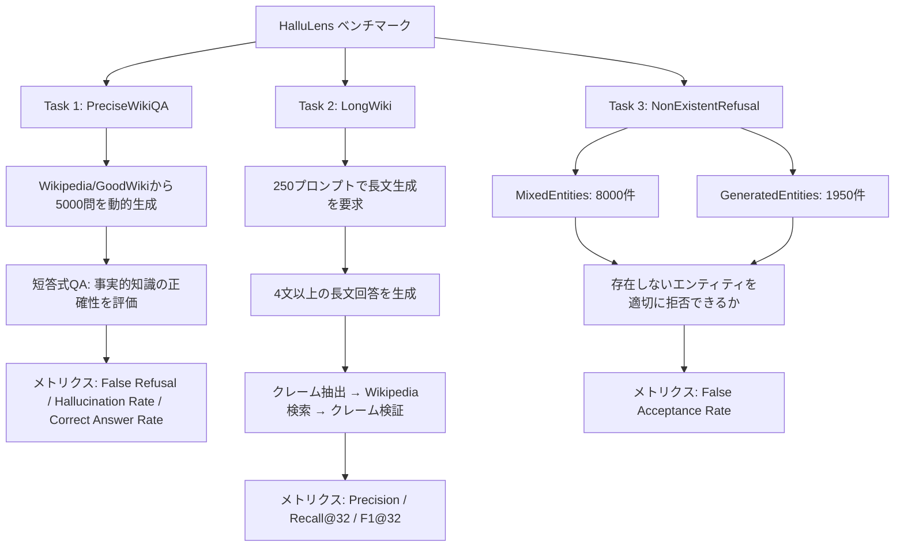
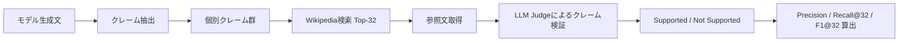
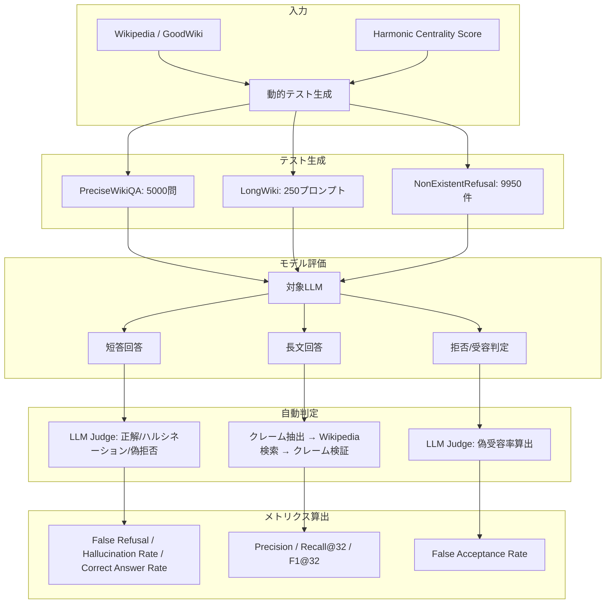

## 論文概要

本記事は [arXiv:2504.17550 HalluLens](https://arxiv.org/abs/2504.17550) の解説記事です。

HalluLensは、LLMのハルシネーションを体系的に評価するための統一ベンチマークである。著者らは、ハルシネーションを**外的ハルシネーション（Extrinsic Hallucination）**と**内的ハルシネーション（Intrinsic Hallucination）**に分類する明確な分類体系を提案し、それぞれを測定する3つの評価タスクを設計している。

従来のベンチマークが抱えていたデータ汚染（data contamination）と静的テストセットの飽和問題に対して、Wikipedia/GoodWikiからの**動的テスト生成**により解決を図った点が最大の特徴である。13のLLMモデルを対象とした大規模実験により、モデルごとのハルシネーション特性の違いを詳細に明らかにしている。

この記事は [Zenn記事: GPT-5.5徹底比較：Claude Opus 4.7・Gemini 3.1 Pro・DeepSeek V4との性能差を検証](https://zenn.dev/0h_n0/articles/b18fe46f73041d) の深掘りであり、特にハルシネーション率の比較手法に焦点を当てている。

## 情報源

- **arXiv ID**: 2504.17550
- **URL**: [arXiv:2504.17550](https://arxiv.org/abs/2504.17550)
- **発表**: ACL 2025（The 63rd Annual Meeting of the Association for Computational Linguistics）
- **公開日**: 2025年4月24日
- **ページ数**: 42ページ
- **分野**: Computation and Language (cs.CL)

## 背景と動機

### 既存ベンチマークの問題点

LLMのハルシネーション評価には、TruthfulQA、HaluEval、FEVERなどの既存ベンチマークが広く用いられてきた。しかし著者らは、これらに以下の根本的な問題があると指摘している。

**1. 静的テストセットの飽和**

固定されたテストセットは、モデルの学習データに含まれることで性能が人為的に向上する。著者らは、既存ベンチマークのスコアが時間とともに飽和し、モデル間の差異を識別できなくなっていると報告している。

**2. データ汚染（Data Contamination）**

LLMの事前学習データにベンチマークの問題と回答が含まれている場合、テスト結果はハルシネーション傾向ではなく暗記能力を測定してしまう。動的生成により、この問題を回避する必要がある。

**3. ハルシネーションと事実性の混同**

多くの既存研究では、ハルシネーション（hallucination）と事実性（factuality）を区別せずに扱っている。著者らは、この2つの概念は異なるオラクル（oracle）に基づいており、明確に区別すべきであると主張している。

### ハルシネーションと事実性の違い

この区別は本論文の根幹をなす。

- **ハルシネーション**: 内的オラクル（学習データ・入力コンテキスト）との整合性。モデルが「知っているはず」の情報と矛盾する出力
- **事実性**: 外的オラクル（世界知識）との整合性。出力が現実世界の事実と一致するか

例えば、あるモデルの学習データに「東京タワーの高さは333m」と含まれている場合、モデルが「東京タワーの高さは500m」と出力すれば、それはハルシネーション（内的オラクルとの不整合）であると同時に事実性の欠如（外的オラクルとの不整合）でもある。一方、学習データに含まれない最新情報についてモデルが誤った回答をした場合、それは事実性の問題であるが、ハルシネーションとは言えない。

## 主要な貢献

著者らは、以下の3点を主要な貢献として挙げている。

1. **ハルシネーション分類体系の整理**: 外的ハルシネーション（Extrinsic）と内的ハルシネーション（Intrinsic）の明確な定義と、事実性との区別
2. **動的テスト生成**: Wikipedia/GoodWikiのharmonic centrality scoreに基づく難易度制御付きのテスト自動生成手法
3. **3つの相補的評価タスク**: PreciseWikiQA（短答式QA）、LongWiki（長文生成）、NonExistentRefusal（存在しないエンティティの拒否）による多面的評価

## 技術的詳細

### ハルシネーション分類体系

著者らが定義する分類体系は以下の通りである。

**外的ハルシネーション（Extrinsic Hallucination）**: モデルの出力が学習データ（内的オラクル）と整合しない場合。学習データに含まれる知識と矛盾する内容の生成がこれに該当する。PreciseWikiQAタスクとNonExistentRefusalタスクで測定される。

**内的ハルシネーション（Intrinsic Hallucination）**: モデルの出力が入力コンテキスト（内的オラクル）と整合しない場合。与えられた文脈から逸脱した内容の生成がこれに該当する。LongWikiタスクで測定される。

評価メトリクスは、情報検索の標準的な指標に基づいている。

LongWikiタスクでは、モデルが生成した文章からクレーム（主張）を抽出し、Wikipedia記事との照合によって各クレームを「サポートされている（supported）」または「サポートされていない（not supported）」に分類する。ここで、クレーム集合 $C$ とWikipediaからの参照文集合 $R$ について以下のように定義する。

**精度（Precision）**: 生成されたクレームのうち、参照文によってサポートされるものの割合

$$\text{Precision} = \frac{|\{c \in C \mid \exists r \in R, \text{supports}(r, c)\}|}{|C|}$$

**再現率（Recall@K）**: 参照文集合から最大 $K$ 件を取得した場合に、サポートされるクレームの割合。$K=32$ が本論文のデフォルト設定である。

$$\text{Recall@K} = \frac{|\{c \in C \mid \exists r \in R_K, \text{supports}(r, c)\}|}{|C|}$$

**F1スコア**: 精度と再現率の調和平均

$$F_1 = \frac{2 \cdot \text{Precision} \cdot \text{Recall@K}}{\text{Precision} + \text{Recall@K}}$$

ここで $R_K$ はWikipedia検索で上位 $K$ 件として取得された参照文集合である。

### 動的テスト生成手法

HalluLensの中核技術は、データ汚染を防ぐための動的テスト生成メカニズムである。

**難易度制御のためのHarmonic Centrality Score**

著者らは、Wikipediaのリンクグラフにおけるharmonic centrality scoreを用いて、各ページの「知名度」を定量化している。harmonic centrality score $H(v)$ は以下で定義される。

$$H(v) = \sum_{u \neq v} \frac{1}{d(u, v)}$$

ここで $d(u, v)$ はノード $u$ から $v$ への最短経路長である。スコアが高いページ（例: "United States"）はほぼ全てのLLMの学習データに含まれている可能性が高く、スコアが低いページ（例: マイナーな地名）はモデルの知識境界付近に位置する。

PreciseWikiQAタスクでは、このスコアに基づいて5000ページを10個のビン（各500ページ）に分割し、難易度を制御している。著者らは、ビン間のばらつきが標準偏差1.01%未満であることを確認しており、動的生成によるテストの安定性を実証している。

### 3つの評価タスク

#### Task 1: PreciseWikiQA（外的ハルシネーション評価）

Wikipedia/GoodWikiから動的に5000問の短答式QAを生成する。各問に対するモデルの回答を以下の3カテゴリに分類する。

- **False Refusal（偽拒否）**: 正解を知っているはずなのに回答を拒否する
- **Hallucination（ハルシネーション）**: 誤った回答を生成する
- **Correct Answer（正解）**: 正しい回答を生成する

評価結果を以下に示す。

| モデル | False Refusal (%) | Hallucination Rate (%) | Correct Answer Rate (%) |
|--------|-------------------|------------------------|------------------------|
| Llama-3.1-8B | 83.09 | 48.37 | 8.73 |
| Llama-3.1-70B | 52.03 | 37.30 | 30.08 |
| Llama-3.1-405B | 56.77 | 26.84 | 31.62 |
| Mistral-7B | 7.77 | 81.19 | 17.34 |
| Gemma-2-9b | 22.89 | 76.01 | 18.50 |
| Qwen2.5-7B | 13.85 | 85.22 | 12.73 |
| Claude-3-haiku | 63.64 | 51.30 | 17.71 |
| Claude-3-sonnet | 56.68 | 56.24 | 18.96 |
| GPT-4o | 4.13 | 45.15 | 52.59 |

著者らは、この結果から「精度-再現率-拒否率のトレードオフ」が明確に存在すると報告している。Llama-3.1-8Bは83.09%と非常に高い偽拒否率を示すが、ハルシネーション率は48.37%に抑えられている。一方、Mistral-7BやQwen2.5-7Bは偽拒否率が低い（7.77%、13.85%）が、ハルシネーション率が81.19%、85.22%と極めて高い。GPT-4oは偽拒否率4.13%、ハルシネーション率45.15%、正解率52.59%と最もバランスの取れた性能を示している。

#### Task 2: LongWiki（内的ハルシネーション評価）

250のプロンプトに対して4文以上の長文回答を要求し、生成された文章の事実的整合性を自動評価する。評価は以下のパイプラインで行われる。

1. **クレーム抽出**: 生成された文章から個別の主張（claim）を自動抽出
2. **Wikipedia検索**: 各クレームに関連するWikipedia記事を検索（上位32件）
3. **クレーム検証**: 検索された参照文とクレームの整合性をLLM judgeで判定

| モデル | Precision (%) | Recall@32 (%) | F1@32 (%) |
|--------|--------------|---------------|-----------|
| GPT-4o | 78.25 | 73.51 | 75.80 |
| Llama-3.1-405B | 63.89 | 60.11 | 61.98 |
| Qwen2.5-14B | 62.31 | 58.05 | 60.11 |
| Claude-3-sonnet | 61.22 | 56.02 | 58.50 |

著者らは、GPT-4oがF1@32で75.80%と突出した性能を示し、次点のLlama-3.1-405B（61.98%）を大きく引き離していると報告している。これは、GPT-4oが長文生成においても事実的整合性を維持する能力に優れていることを示唆している。

#### Task 3: NonExistentRefusal（存在しないエンティティの拒否評価）

存在しないエンティティについて質問された際に、モデルが適切に「知らない」と回答できるかを評価する。以下の2種類のテストセットを用いる。

- **MixedEntities（8000件）**: 実在するエンティティの属性を入れ替えて作成された架空エンティティ
- **GeneratedEntities（1950件）**: 完全に生成された架空エンティティ

メトリクスは**False Acceptance Rate（偽受容率）**であり、存在しないエンティティに対して誤って回答を生成してしまう割合を示す。低いほど良い。

| モデル | MixedEntities (%) | GeneratedEntities (%) | 平均 (%) |
|--------|-------------------|----------------------|----------|
| Llama-3.1-8B | 53.48 | 22.67 | 38.07 |
| Llama-3.1-70B | 20.19 | 4.87 | 12.53 |
| Llama-3.1-405B | 11.48 | 2.28 | 6.88 |
| Mistral-7B | 94.74 | 77.98 | 86.36 |
| Gemma-2-9b | 46.95 | 13.01 | 29.98 |
| Qwen2.5-7B | 87.79 | 67.54 | 77.67 |
| Claude-3-haiku | 33.94 | 11.69 | 22.81 |
| Claude-3-sonnet | 29.64 | 8.72 | 19.18 |
| GPT-4o | 65.89 | 18.74 | 42.31 |

この結果は非常に興味深い。著者らは、GPT-4oが偽受容率42.31%と比較的高いことに注目している。PreciseWikiQAでは最高の正解率を示したGPT-4oが、存在しないエンティティに対しても回答を生成しやすい傾向にある。これは「回答する傾向が強いモデルは、存在しないエンティティも受け入れてしまう」というトレードオフを示している。

一方、Llama-3.1-405Bは偽受容率6.88%と全モデル中最低であり、存在しないエンティティの識別能力が極めて高い。しかし、PreciseWikiQAでは偽拒否率56.77%と高く、正解率も31.62%にとどまっている。

### 自動評価パイプライン

著者らは、人手評価との一致率を検証するためにLLM judgeを使用している。LLM judgeと人手評価の一致率は94.77%～96.67%であり、自動評価の信頼性が高いことを実証している。

評価パイプライン全体の流れを以下に示す。

## 実験結果の分析

### 知識境界効果（Knowledge Boundary Effect）

著者らは、harmonic centrality scoreによる難易度ビンごとのハルシネーション率を分析し、**中頻度エンティティでハルシネーション率がピークに達する**という重要な発見を報告している。

具体的には、最も知名度の高いエンティティ（ビン1）ではモデルが正確に回答でき、最も知名度の低いエンティティ（ビン10）では回答を拒否する傾向にある。しかし、中間の知名度を持つエンティティ（ビン4-7付近）では、モデルが「知っているつもり」で回答するが実際には誤っている、という状況が最も多く発生する。

この知識境界効果は、モデルの知識の「境界面」がハルシネーションの温床であることを示しており、モデル選定や運用における重要な知見である。

### モデルアーキテクチャ間のトレードオフ

3つのタスクの結果を総合すると、以下のパターンが浮かび上がる。

**積極回答型（Low Refusal, High Hallucination）**: Mistral-7B、Qwen2.5-7Bが該当。偽拒否率が低く「とにかく回答する」が、その代償としてハルシネーション率が極めて高い。NonExistentRefusalでも偽受容率が80%を超えている。

**慎重回答型（High Refusal, Lower Hallucination）**: Llama-3.1シリーズ、Claudeシリーズが該当。偽拒否率は高いが、ハルシネーション率は相対的に低い。特にLlama-3.1-405BはNonExistentRefusalで偽受容率6.88%と最良の結果を示す。

**バランス型**: GPT-4oが該当。PreciseWikiQAで正解率52.59%、LongWikiでF1@32が75.80%と高い性能を示すが、NonExistentRefusalでは偽受容率42.31%とやや高い。

### スケーリング効果

Llama-3.1シリーズ（8B→70B→405B）の比較から、モデルサイズの増大に伴う変化が明確に観察される。

- **ハルシネーション率**: 48.37%→37.30%→26.84%と単調減少
- **正解率**: 8.73%→30.08%→31.62%と大幅に改善
- **NonExistentRefusal平均**: 38.07%→12.53%→6.88%と大幅に改善

著者らは、パラメータ数の増加がハルシネーション抑制に直接的に寄与していると結論付けている。ただし、偽拒否率は8B（83.09%）→70B（52.03%）→405B（56.77%）と、70Bから405Bでわずかに増加しており、単純なスケーリングだけでは全指標の同時改善は達成できないことも示唆されている。

### 動的テスト生成の有効性

著者らは、動的生成されたテストセット間の標準偏差が1.01%未満であることを報告しており、テストの再現性と安定性を実証している。これにより、異なる時点で生成されたテストセットでも、モデルの相対的な評価順序が維持されることが保証される。

## 実運用への応用

### モデル選定への示唆

HalluLensの結果は、用途に応じたモデル選定の指針を提供する。

**高精度が求められるQAシステム**: PreciseWikiQAの正解率とハルシネーション率を重視。GPT-4oが最も適している。

**長文生成（レポート・要約）**: LongWikiのF1@32を重視。GPT-4o（75.80%）が突出しており、次点のLlama-3.1-405B（61.98%）との差が大きい。

**安全性重視の用途（医療・法律）**: NonExistentRefusalの偽受容率を重視。Llama-3.1-405B（6.88%）やClaude-3-sonnet（19.18%）が適している。GPT-4o（42.31%）は存在しないエンティティへの回答生成リスクが高い点に注意が必要である。

### Zenn記事との関連

Zenn記事「GPT-5.5徹底比較」では複数のLLMのハルシネーション率を比較しているが、HalluLensが提示するフレームワークは、そうした比較を行う際の方法論的基盤を提供する。特に以下の点が重要である。

1. **単一指標での比較は不十分**: ハルシネーション率だけでなく、偽拒否率やNonExistentRefusalの偽受容率を含む多面的な評価が必要
2. **知識境界効果の考慮**: 中頻度エンティティに関する質問でハルシネーションが最も発生しやすく、評価対象の難易度分布が結果に大きく影響する
3. **動的テスト生成の重要性**: 静的ベンチマークでの比較はデータ汚染リスクがあり、新しいモデルの評価には動的生成が望ましい

## 関連研究

HalluLensは以下の既存研究の課題を踏まえて設計されている。

- **TruthfulQA** (Lin et al., 2022): 817問の静的テストセットでLLMの真実性を評価。固定データセットによるデータ汚染リスクと飽和問題が指摘されている
- **FEVER** (Thorne et al., 2018): Wikipedia文に基づくファクトチェックベンチマーク。事実性の評価に焦点を当てており、ハルシネーションとの区別が不明確
- **HaluEval** (Li et al., 2023): ChatGPTを用いてハルシネーションサンプルを自動生成。生成品質がChatGPTの能力に依存するという制約がある
- **SelfCheckGPT** (Manakul et al., 2023): 外部知識なしでハルシネーションを検出する手法。モデル自身の複数回答の一貫性を利用するが、一貫して誤る場合は検出できない

HalluLensは、これらの研究と比較して、(1) ハルシネーションと事実性の明確な区別、(2) 動的テスト生成によるデータ汚染防止、(3) 3タスクによる多面的評価、という3点で差別化されている。

## まとめと今後の展望

HalluLensは、LLMのハルシネーション評価における以下の課題を解決する統一ベンチマークである。

- **分類体系の整理**: 外的ハルシネーションと内的ハルシネーションの明確な定義、および事実性との区別
- **動的テスト生成**: harmonic centrality scoreに基づく難易度制御付きの自動テスト生成により、データ汚染を防止
- **多面的評価**: PreciseWikiQA、LongWiki、NonExistentRefusalの3タスクにより、ハルシネーションの異なる側面を網羅的に測定
- **知識境界効果の発見**: 中頻度エンティティでハルシネーションがピークに達するという重要な知見

今後の展望として、著者らは以下の方向性を示唆している。多言語対応（現在は英語のみ）、マルチモーダルモデルへの拡張、およびRAG（Retrieval-Augmented Generation）との組み合わせにおけるハルシネーション評価が重要な研究課題となるだろう。特に、RAGの文脈では「検索された文書と生成内容の整合性」という新たな内的ハルシネーションの次元が加わるため、HalluLensのフレームワークを拡張する必要がある。

## 参考文献

1. HalluLens: LLM Hallucination Benchmark. arXiv:2504.17550, ACL 2025.
2. Lin, S. et al. (2022). TruthfulQA: Measuring How Models Mimic Human Falsehoods. ACL 2022.
3. Thorne, J. et al. (2018). FEVER: a Large-scale Dataset for Fact Extraction and VERification. NAACL 2018.
4. Li, J. et al. (2023). HaluEval: A Large-Scale Hallucination Evaluation Benchmark for Large Language Models. EMNLP 2023.
5. Manakul, P. et al. (2023). SelfCheckGPT: Zero-Resource Black-Box Hallucination Detection for Generative Large Language Models. EMNLP 2023.
