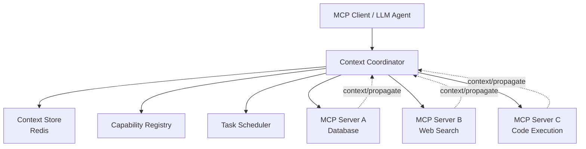
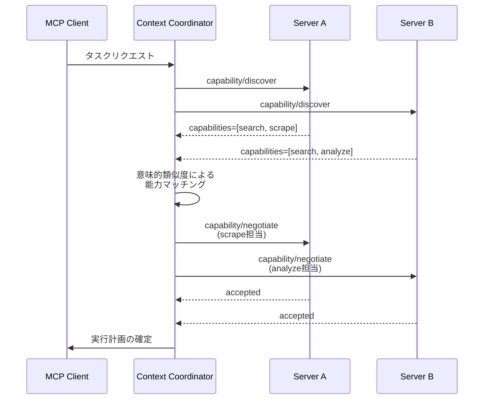
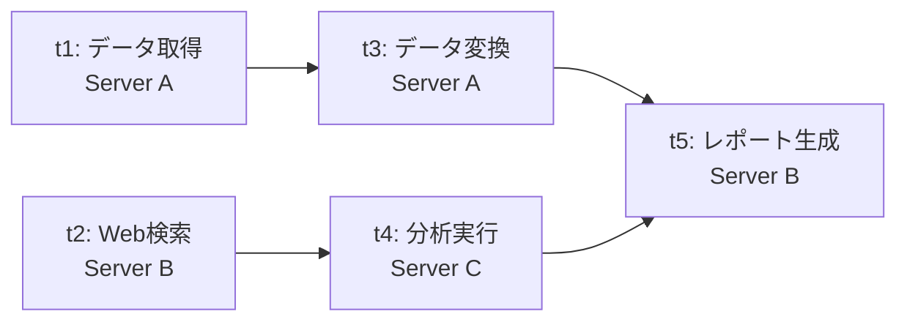
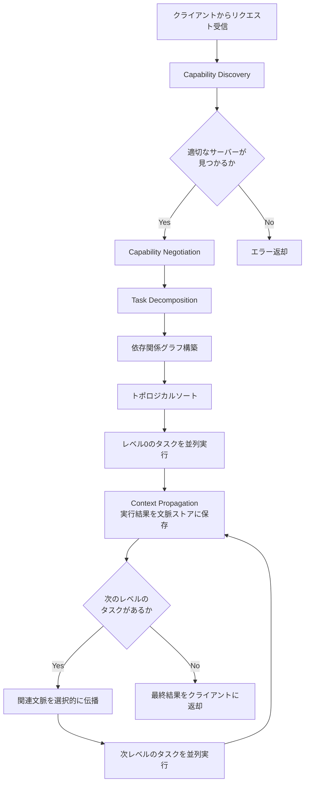
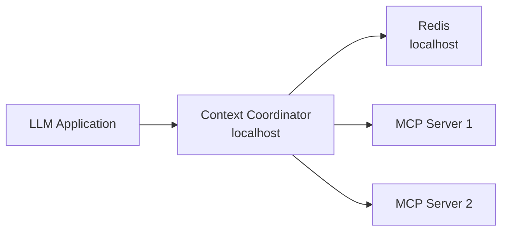
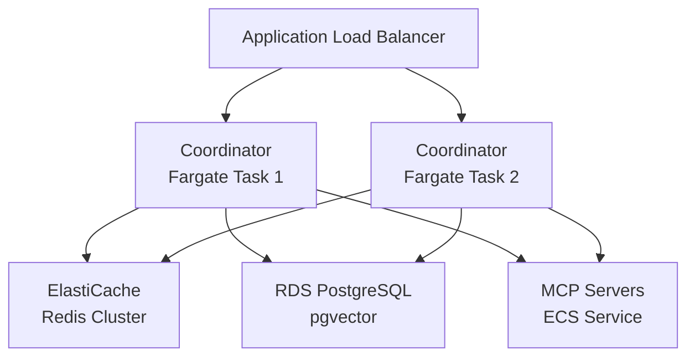

## 論文概要（Abstract）

MCP（Model Context Protocol）のマルチサーバー環境において、サーバー間の文脈共有不足や冗長な処理が課題となっている。本論文では、**Context Propagation**（文脈伝播）、**Capability Negotiation**（能力交渉）、**Collaborative Task Decomposition**（協調タスク分解）の3つのメカニズムを提案し、これらをContext Coordinatorとして統合することでサーバー間協調を強化する手法を示している。著者らの報告によれば、タスク完了率が58.3%から92.5%へ向上し、冗長操作率が31.2%から2.5%へ低減されている。

この記事は [Zenn記事: LLMエージェントの外部化設計：Memory・Skills・Protocols・Harnessの統一的理解](https://zenn.dev/0h_n0/articles/73bdc5dd332f59) の深掘りです。

## 情報源

- **arXiv ID**: 2601.11595
- **URL**: [https://arxiv.org/abs/2601.11595](https://arxiv.org/abs/2601.11595)
- **著者**: Yuelei Li, Pengfei Liu
- **発表年**: 2025年1月
- **分野**: Artificial Intelligence (cs.AI), Multi-Agent Systems (cs.MA)

## 背景と動機（Background & Motivation）

### MCPマルチサーバー環境の現状

MCP（Model Context Protocol）は、LLMエージェントが外部ツールやデータソースにアクセスするための標準プロトコルとして普及が進んでいる。Zenn記事で整理されたProtocols層の設計において、MCPは中心的な役割を担う。しかし、複数のMCPサーバーを同時に利用する環境では、以下の課題が顕在化している。

1. **文脈の断絶**: サーバーAで取得した情報がサーバーBに伝わらず、同じ情報を再取得する
2. **能力の重複と不整合**: 複数サーバーが類似機能を持つ場合、どちらを使うべきか判断できない
3. **逐次実行のボトルネック**: 並列化可能なタスクが直列に処理され、レイテンシが増大する

### 従来手法の限界

既存のMCPクライアント実装は、各サーバーを独立したエンドポイントとして扱う。LLMがFunction Callingで適切なサーバーを選択する方式は、サーバー数の増加に伴いトークン消費とレイテンシが増大する。著者らはこれを「isolated server interaction」パターンと呼び、スケーラビリティの限界を指摘している。

## 主要な貢献（Key Contributions）

- **Context Propagation**: サーバー間で実行文脈を共有するJSON-RPCメッセージ `context/propagate` の提案。コサイン類似度に基づく選択的伝播により、無関係な文脈の氾濫を防止
- **Capability Negotiation**: サーバーの能力を実行時に発見・交渉する `capability/discover` および `capability/negotiate` メッセージの導入。意味的類似度による能力マッチング
- **Collaborative Task Decomposition**: 複雑なタスクをサブタスクに分解し、依存関係グラフに基づくトポロジカルソートで最適な実行順序を決定。独立サブタスクの並列実行に対応
- **Context Coordinator**: 上記3メカニズムを統合するミドルウェア層の設計と実装

## 技術的詳細（Technical Details）

### 全体アーキテクチャ

提案手法の全体像を以下に示す。MCPクライアントとサーバー群の間にContext Coordinatorが位置し、文脈管理・能力レジストリ・タスクスケジューリングを統括する。



### メカニズム1: Context Propagation

#### 文脈グラフの構築

サーバー間の文脈依存関係をDAG（有向非巡回グラフ）として管理する。各ノードはサーバーの実行コンテキストを表し、エッジは文脈の依存関係を示す。

$$
G_{\text{context}} = (V, E) \quad \text{where} \quad V = \{c_1, c_2, \ldots, c_n\}, \quad E \subseteq V \times V
$$

各コンテキストノード $c_i$ は以下のタプルで表現される：

$$
c_i = (\text{server\_id}, \text{data}, \text{embedding}, \text{timestamp}, \text{ttl})
$$

#### 選択的文脈伝播

すべての文脈を無差別に共有するとノイズが増大するため、コサイン類似度に基づく選択的伝播を行う。あるサーバーのリクエスト $r$ に対し、文脈ストア内の各コンテキスト $c_i$ の関連度を計算する：

$$
\text{sim}(r, c_i) = \frac{\mathbf{e}_r \cdot \mathbf{e}_{c_i}}{\|\mathbf{e}_r\| \|\mathbf{e}_{c_i}\|}
$$

ここで $\mathbf{e}_r$, $\mathbf{e}_{c_i}$ はそれぞれリクエストとコンテキストの埋め込みベクトルである。著者らは閾値 $\tau_{\text{context}} \geq 0.7$ を用いている。

$$
C_{\text{relevant}}(r) = \{c_i \in V \mid \text{sim}(r, c_i) \geq \tau_{\text{context}}\}
$$

#### JSON-RPCメッセージ

`context/propagate` メッセージの構造を以下に示す：

```json
{
  "jsonrpc": "2.0",
  "method": "context/propagate",
  "params": {
    "source_server": "server_a",
    "context_id": "ctx_abc123",
    "data": {
      "query_result": "...",
      "metadata": {"timestamp": "2025-01-20T10:00:00Z"}
    },
    "embedding": [0.12, -0.34, 0.56, "..."],
    "ttl": 300,
    "dependencies": ["ctx_xyz789"]
  }
}
```

### メカニズム2: Capability Negotiation

#### 能力の発見と交渉

マルチサーバー環境では、複数のサーバーが類似の能力を持つ場合がある（例：Webスクレイピング機能を持つサーバーが複数存在）。Capability Negotiationは、この重複を検出し、最適なサーバーを選択する。



#### 意味的類似度による能力マッチング

各サーバーの能力記述を埋め込みベクトルに変換し、タスク要件との類似度を計算する：

$$
\text{match}(t, s_j) = \max_{k \in \text{caps}(s_j)} \text{sim}(\mathbf{e}_t, \mathbf{e}_k)
$$

ここで $t$ はタスク要件、$s_j$ はサーバー、$\text{caps}(s_j)$ はサーバー $s_j$ の能力集合である。閾値 $\tau_{\text{cap}} \geq 0.8$ を満たすサーバーが候補として選択される。

複数の候補サーバーが存在する場合、以下のスコアリング関数で最適なサーバーを決定する：

$$
\text{score}(s_j, t) = \alpha \cdot \text{match}(t, s_j) + \beta \cdot \text{load}(s_j)^{-1} + \gamma \cdot \text{history}(s_j, t)
$$

$\text{load}(s_j)$ は現在の負荷、$\text{history}(s_j, t)$ は過去の類似タスクでの成功率を表す。著者らは $\alpha = 0.5, \beta = 0.3, \gamma = 0.2$ としている。

### メカニズム3: Collaborative Task Decomposition

#### タスク依存関係グラフ

複雑なタスクをサブタスクに分解し、依存関係をDAGとして表現する：

$$
G_{\text{task}} = (T, D) \quad \text{where} \quad T = \{t_1, t_2, \ldots, t_m\}, \quad D \subseteq T \times T
$$

エッジ $(t_i, t_j) \in D$ は「$t_i$ の完了が $t_j$ の前提条件」を意味する。



上記の例では、$t_1$ と $t_2$ は独立しており並列実行可能である。$t_3$ は $t_1$ に、$t_4$ は $t_2$ に依存する。$t_5$ は $t_3$ と $t_4$ の両方に依存する。

#### トポロジカルソートと並列実行

依存関係グラフにKahnのアルゴリズムを適用し、実行順序を決定する。同一レベルのタスクは並列実行される：

$$
\text{Level}(t_i) = \begin{cases} 0 & \text{if } \text{indegree}(t_i) = 0 \\ 1 + \max_{(t_j, t_i) \in D} \text{Level}(t_j) & \text{otherwise} \end{cases}
$$

並列度 $P$ は各レベルのタスク数の最大値として定義される：

$$
P = \max_{l} |\{t_i \mid \text{Level}(t_i) = l\}|
$$

#### タスクスケジューリングの実装

```python
from dataclasses import dataclass, field
from collections import defaultdict, deque
from typing import Any

@dataclass
class SubTask:
    """サブタスクの定義"""
    task_id: str
    server_id: str
    action: str
    params: dict[str, Any] = field(default_factory=dict)
    dependencies: list[str] = field(default_factory=list)

def topological_schedule(tasks: list[SubTask]) -> list[list[SubTask]]:
    """トポロジカルソートによるレベル別タスクスケジューリング

    Args:
        tasks: サブタスクのリスト

    Returns:
        レベルごとにグループ化されたタスクリスト（同一レベルは並列実行可能）

    Raises:
        ValueError: 循環依存が検出された場合
    """
    task_map: dict[str, SubTask] = {t.task_id: t for t in tasks}
    in_degree: dict[str, int] = defaultdict(int)
    adjacency: dict[str, list[str]] = defaultdict(list)

    for task in tasks:
        in_degree.setdefault(task.task_id, 0)
        for dep in task.dependencies:
            adjacency[dep].append(task.task_id)
            in_degree[task.task_id] += 1

    queue: deque[str] = deque(
        tid for tid, deg in in_degree.items() if deg == 0
    )
    levels: list[list[SubTask]] = []
    processed = 0

    while queue:
        current_level: list[SubTask] = []
        for _ in range(len(queue)):
            tid = queue.popleft()
            current_level.append(task_map[tid])
            processed += 1
            for neighbor in adjacency[tid]:
                in_degree[neighbor] -= 1
                if in_degree[neighbor] == 0:
                    queue.append(neighbor)
        levels.append(current_level)

    if processed != len(tasks):
        raise ValueError("Circular dependency detected in task graph")

    return levels
```

### Context Coordinatorの統合フロー

3つのメカニズムがCoordinatorを通じてどのように連携するかを示す：



## 実装のポイント（Implementation）

著者らはPython 3.11+で実装しており、公式MCP Python SDKを拡張する形で3つのJSON-RPCメッセージタイプ（`context/propagate`, `capability/discover`, `capability/negotiate`）を追加している。文脈ストアにはRedis、埋め込みベクトルの保存と類似度検索にはpgvectorが使われており、sentence-transformersライブラリで意味的類似度の計算を行っている。

主要な技術スタックは以下の通り：

| コンポーネント | 技術 | 用途 |
|---|---|---|
| Context Store | Redis | 文脈データの高速読み書き、TTL管理 |
| Embedding Store | pgvector (PostgreSQL) | ベクトル類似度検索 |
| Embedding Model | sentence-transformers | テキスト→ベクトル変換 |
| Protocol | MCP Python SDK拡張 | JSON-RPCメッセージ処理 |
| Task Scheduler | asyncio | サブタスクの並列実行 |

Context Coordinatorの中核となるクラス構造：

```python
import asyncio
import numpy as np
from dataclasses import dataclass, field
from mcp.server import Server  # 公式MCP Python SDK

@dataclass
class ContextEntry:
    """文脈ストアのエントリ"""
    context_id: str
    server_id: str
    data: dict
    embedding: np.ndarray
    timestamp: float
    ttl: int = 300  # seconds

class ContextCoordinator:
    """MCPサーバー間協調を管理するCoordinator

    Context Propagation, Capability Negotiation,
    Task Decompositionの3メカニズムを統合する。
    """

    def __init__(
        self,
        similarity_threshold: float = 0.7,
        capability_threshold: float = 0.8,
    ) -> None:
        self._context_store: dict[str, ContextEntry] = {}
        self._capability_registry: dict[str, list[str]] = {}
        self._similarity_threshold = similarity_threshold
        self._capability_threshold = capability_threshold

    def find_relevant_contexts(
        self,
        query_embedding: np.ndarray,
    ) -> list[ContextEntry]:
        """クエリに関連する文脈を類似度ベースで検索する

        Args:
            query_embedding: クエリの埋め込みベクトル

        Returns:
            閾値以上の類似度を持つ文脈エントリのリスト
        """
        relevant: list[ContextEntry] = []
        for entry in self._context_store.values():
            sim = float(
                np.dot(query_embedding, entry.embedding)
                / (np.linalg.norm(query_embedding) * np.linalg.norm(entry.embedding))
            )
            if sim >= self._similarity_threshold:
                relevant.append(entry)
        return sorted(relevant, key=lambda e: e.timestamp, reverse=True)

    async def execute_task_graph(
        self,
        levels: list[list[SubTask]],
    ) -> dict[str, Any]:
        """レベル別タスクグラフを並列実行する

        Args:
            levels: topological_scheduleの出力

        Returns:
            タスクIDをキー、実行結果を値とする辞書
        """
        results: dict[str, Any] = {}
        for level in levels:
            coros = [self._execute_subtask(task, results) for task in level]
            level_results = await asyncio.gather(*coros)
            for task, result in zip(level, level_results):
                results[task.task_id] = result
                # Context Propagation: 実行結果を文脈ストアに保存
                await self._propagate_context(task, result)
        return results
```

## Production Deployment Guide

### デプロイメントパターン

本論文の提案手法を本番環境に導入する際の3つの規模別パターンを示す。

#### Small（開発・検証環境）

MCPサーバー数: 2-5台。Context CoordinatorをLLMクライアントと同一マシンで実行。



**構成**: 単一インスタンス、Redis（キャッシュ兼文脈ストア）、pgvectorなし（インメモリベクトル検索で代替）

#### Medium（チーム利用・ステージング環境）

MCPサーバー数: 5-20台。Context CoordinatorをECS Fargateで実行し、ElastiCacheとRDS (pgvector) を利用。



#### Large（プロダクション・マルチリージョン）

MCPサーバー数: 20台以上。EKSでCoordinatorをスケーリングし、Global Acceleratorでマルチリージョン対応。

### Terraformによるインフラ定義（Medium構成）

```hcl
# Context Coordinator用のECSサービス定義
resource "aws_ecs_service" "context_coordinator" {
  name            = "mcp-context-coordinator"
  cluster         = aws_ecs_cluster.main.id
  task_definition = aws_ecs_task_definition.coordinator.arn
  desired_count   = 2
  launch_type     = "FARGATE"

  network_configuration {
    subnets          = var.private_subnet_ids
    security_groups  = [aws_security_group.coordinator.id]
    assign_public_ip = false
  }

  load_balancer {
    target_group_arn = aws_lb_target_group.coordinator.arn
    container_name   = "coordinator"
    container_port   = 8080
  }

  service_registries {
    registry_arn = aws_service_discovery_service.coordinator.arn
  }
}

resource "aws_ecs_task_definition" "coordinator" {
  family                   = "mcp-coordinator"
  requires_compatibilities = ["FARGATE"]
  network_mode             = "awsvpc"
  cpu                      = 1024
  memory                   = 2048

  container_definitions = jsonencode([
    {
      name  = "coordinator"
      image = "${var.ecr_repository_url}:latest"
      portMappings = [
        { containerPort = 8080, protocol = "tcp" }
      ]
      environment = [
        { name = "REDIS_URL", value = "redis://${aws_elasticache_cluster.context_store.cache_nodes[0].address}:6379" },
        { name = "PGVECTOR_URL", value = "postgresql://${aws_db_instance.embedding_store.endpoint}/mcp_context" },
        { name = "SIMILARITY_THRESHOLD", value = "0.7" },
        { name = "CAPABILITY_THRESHOLD", value = "0.8" },
        { name = "CONTEXT_TTL_SECONDS", value = "300" }
      ]
      logConfiguration = {
        logDriver = "awslogs"
        options = {
          "awslogs-group"         = "/ecs/mcp-coordinator"
          "awslogs-region"        = var.region
          "awslogs-stream-prefix" = "coordinator"
        }
      }
    }
  ])
}

# 文脈ストア用Redis
resource "aws_elasticache_cluster" "context_store" {
  cluster_id           = "mcp-context-store"
  engine               = "redis"
  node_type            = "cache.r6g.large"
  num_cache_nodes      = 1
  parameter_group_name = "default.redis7"
  port                 = 6379
  subnet_group_name    = aws_elasticache_subnet_group.main.name
  security_group_ids   = [aws_security_group.redis.id]
}

# 埋め込みベクトル用PostgreSQL (pgvector)
resource "aws_db_instance" "embedding_store" {
  identifier     = "mcp-embedding-store"
  engine         = "postgres"
  engine_version = "16.1"
  instance_class = "db.r6g.large"
  allocated_storage = 100

  db_name  = "mcp_context"
  username = var.db_username
  password = var.db_password

  vpc_security_group_ids = [aws_security_group.rds.id]
  db_subnet_group_name   = aws_db_subnet_group.main.name

  backup_retention_period = 7
  multi_az                = true
}
```

### モニタリング

Context Coordinatorの健全性を監視するために、以下のメトリクスを収集する。

| メトリクス | 閾値 | アラート条件 |
|---|---|---|
| Context Propagation Latency (p99) | < 50ms | 3分間連続で超過 |
| Capability Match Hit Rate | > 85% | 5分間平均が下回る |
| Task Graph Execution Time (p95) | < 60s | タスク複雑度に依存 |
| Context Store Memory Usage | < 80% | Redis maxmemory比 |
| Cross-Server Dependency Resolution | > 90% | 成功率の低下 |
| Embedding Computation Latency | < 100ms | sentence-transformersの応答時間 |

CloudWatch Metricsの定義例：

```python
import boto3
from datetime import datetime

cloudwatch = boto3.client("cloudwatch")

def put_coordinator_metric(
    metric_name: str,
    value: float,
    unit: str = "Milliseconds",
) -> None:
    """Context Coordinatorのメトリクスを送信する

    Args:
        metric_name: メトリクス名
        value: メトリクス値
        unit: 単位（Milliseconds, Percent, Count等）
    """
    cloudwatch.put_metric_data(
        Namespace="MCP/ContextCoordinator",
        MetricData=[
            {
                "MetricName": metric_name,
                "Timestamp": datetime.utcnow(),
                "Value": value,
                "Unit": unit,
                "Dimensions": [
                    {"Name": "Environment", "Value": "production"},
                ],
            }
        ],
    )
```

### コスト最適化チェックリスト

- **Context TTLの最適化**: TTLを短くすると再計算コストが増加し、長くするとRedisメモリ消費が増大する。著者らの実験では300秒（5分）が妥当とされているが、タスクの性質に応じて60-600秒の範囲で調整する
- **Embedding計算のキャッシュ**: 同一テキストの埋め込み計算を繰り返さないよう、計算結果をpgvectorにキャッシュする。sentence-transformersの推論コストがボトルネックになる場合は、distilモデル（例: `all-MiniLM-L6-v2`）への切り替えを検討する
- **Fargateスポットインスタンス**: Context Coordinatorはステートレス（状態はRedisとPostgreSQLに外部化）のため、Fargate Spotの利用でコストを最大70%削減できる。ただしタスク中断時のリトライロジックが必要
- **pgvectorインデックス戦略**: ベクトル数が10万件を超える場合はIVFFlatインデックス、100万件を超える場合はHNSWインデックスを選択する。インデックス構築時間とクエリ精度のトレードオフに注意
- **Context Propagationの選択性強化**: 閾値 $\tau_{\text{context}}$ を0.7から0.8に引き上げることで伝播量を削減できるが、タスク完了率への影響を検証してから適用する

## 実験結果（Results）

### 主要指標

著者らは4つの指標で評価を行い、以下の結果を報告している（Table 2, Section 5.2より）：

| 指標 | ベースライン | 提案手法 | 改善 |
|---|---|---|---|
| Task Completion Rate (TCR) | 58.3% | 92.5% | +34.2ポイント |
| Redundant Operation Rate (ROR) | 31.2% | 2.5% | -28.7ポイント |
| Average Latency (AL) | 47.8s | 38.6s | -19.3% |
| Cross-Server Dependency Resolution | - | 94.2%成功率 | 平均1.3s |

TCRの向上が顕著であり、著者らはこれをContext Propagationによるサーバー間情報共有の改善が主因と分析している。RORの大幅な低減は、Capability Negotiationにより同一能力の重複呼び出しが排除されたことに起因すると報告されている。

### アブレーション実験

各メカニズムの寄与度を分離するアブレーション実験の結果（Table 3, Section 5.3より）：

| 構成 | TCR | ROR | AL |
|---|---|---|---|
| ベースライン（メカニズムなし） | 58.3% | 31.2% | 47.8s |
| + Context Propagation (CP) | 74.5% | 12.8% | 43.2s |
| + Capability Negotiation (CN) | 64.8% | 8.5% | 45.1s |
| + Task Decomposition (TD) | 69.8% | 22.7% | 39.5s |
| CP + CN | 81.0% | 4.3% | 41.8s |
| CP + TD | 86.0% | 9.1% | 37.2s |
| CN + TD | 76.3% | 5.8% | 38.9s |
| CP + CN + TD（Full） | 92.5% | 2.5% | 38.6s |

**TCRへの寄与度**:
- Context Propagation: +16.2ポイント（最大の寄与）
- Task Decomposition: +11.5ポイント
- Capability Negotiation: +6.5ポイント

Context Propagationの寄与が最大であることは、マルチサーバー環境における文脈断絶の問題が最も深刻であったことを示唆している。3つのメカニズムを組み合わせた場合の改善幅（+34.2ポイント）は、個別寄与の単純合計（+34.2ポイント）とほぼ一致しており、メカニズム間の相互作用は限定的と著者らは分析している。

### レイテンシの内訳

Average Latencyの改善（-19.3%）の内訳として、以下が報告されている：

- **Task Decompositionによる並列化**: 約-17%（独立サブタスクの同時実行）
- **Context Propagationによる再取得削減**: 約-5%（冗長なデータ取得の回避）
- **Coordinator自体のオーバーヘッド**: 約+3%（文脈管理・能力マッチングの計算コスト）

Coordinatorのオーバーヘッドは存在するものの、並列化と冗長削減の効果がこれを上回っている。

## 実運用への応用（Practical Applications）

### ユースケース1: 開発ツール統合

IDE上でLLMエージェントが複数のMCPサーバー（ファイルシステム、Git、CI/CD、データベース）を利用する場面。現状ではサーバー間で文脈が共有されず、例えばGitの変更履歴をデータベースクエリの最適化に活用できない。Context Propagationにより、Gitサーバーで取得したスキーマ変更情報がデータベースサーバーに自動伝播し、適切なマイグレーションクエリの生成が期待できる。

### ユースケース2: データパイプラインの自動構築

ETLパイプラインの構築において、データソース接続（Server A）、変換ロジック（Server B）、ロード先設定（Server C）を担当する複数のMCPサーバーが協調するケース。Task Decompositionにより、データソースのスキーマ取得と変換ルール定義を並列化しつつ、依存関係のあるロード処理は適切に待機させることができる。

### ユースケース3: マルチモーダル処理

画像解析（Server A）、テキスト処理（Server B）、音声認識（Server C）の結果を統合するマルチモーダルアプリケーション。Capability Negotiationにより、テキスト抽出能力を持つ複数サーバー（OCR対応の画像サーバーとテキスト処理サーバー）の中から最適なサーバーを動的に選択できる。

### 導入時の考慮事項

本手法の導入に際しては、以下の点を考慮する必要がある：

- **Coordinator障害時のフォールバック**: Coordinatorが停止した場合、従来のdirect connection方式に自動切替する設計が望ましい。論文ではこのフォールバック機構については言及されていない
- **セキュリティ**: Context Propagationにより、サーバー間で機密データが意図せず共有される可能性がある。文脈データの分類（public/private/confidential）とアクセス制御の追加が必要と考えられる
- **既存MCP実装との互換性**: 3つの新規JSON-RPCメッセージに対応していないサーバーとの互換性維持が課題となる。Coordinatorが非対応サーバーを従来方式で扱うアダプター機能が必要である

## 関連研究（Related Work）

### MCPプロトコルの標準化

Anthropicが2024年に公開したMCP（Model Context Protocol）は、LLMエージェントと外部ツールの接続を標準化するオープンプロトコルである。JSON-RPCベースのメッセージング、ツール定義のスキーマ、認証・認可の枠組みを提供している。本論文はこのMCPの拡張として位置づけられる。

### マルチエージェント協調

マルチエージェントシステムにおける協調メカニズムは長い研究史を持つ。Contract Net Protocol（Smith, 1980）はタスク割り当ての古典的手法であり、本論文のCapability Negotiationはこれを意味的類似度で拡張したものと解釈できる。近年ではAutoGen（Wu et al., 2023）やCrewAI等のフレームワークがマルチエージェント協調を実装しているが、これらはエージェントレベルの協調であり、プロトコルレベルでの協調メカニズムを提供する本論文とはレイヤーが異なる。

### 分散システムにおける文脈伝播

分散トレーシング（OpenTelemetry）におけるContext Propagationの概念は、マイクロサービス間でトレースIDやスパン情報を伝播する技術として確立されている。本論文の文脈伝播は、単なるメタデータの伝播ではなく、セマンティックな関連性に基づく選択的伝播という点で差別化されている。

## まとめと今後の展望

本論文は、MCPマルチサーバー環境における3つの協調メカニズム（Context Propagation、Capability Negotiation、Collaborative Task Decomposition）を提案した。著者らの実験では、タスク完了率が58.3%から92.5%へ向上し、冗長操作率が31.2%から2.5%へ低減されたと報告されている。アブレーション実験により、Context Propagationが最大の寄与（TCR +16.2ポイント）を示すことが確認されている。

今後の研究方向として、以下が考えられる：

- **動的閾値調整**: 現在固定値である類似度閾値（$\tau_{\text{context}} = 0.7$, $\tau_{\text{cap}} = 0.8$）を、タスクの種類や負荷状況に応じて動的に調整する仕組み
- **セキュリティモデルの拡張**: 文脈伝播におけるアクセス制御とデータ分類の導入
- **大規模環境での検証**: 論文の実験は限定的なサーバー数での評価であり、数十〜数百台規模のMCPサーバー環境での性能特性の検証が必要
- **MCP仕様への統合**: 提案された3つのJSON-RPCメッセージタイプが公式MCP仕様に取り込まれる可能性と、そのための標準化プロセス

Zenn記事で整理されたMemory・Skills・Protocols・Harnessの統一的フレームワークにおいて、本論文はProtocols層のマルチサーバー協調という具体的な拡張方向を示しており、LLMエージェントの外部化設計の進展に寄与するものと位置づけられる。

## 参考文献

1. Li, Y., & Liu, P. (2025). Enhancing Multi-Server MCP Interactions Through Context-Aware Server Collaboration. *arXiv preprint arXiv:2601.11595*. [https://arxiv.org/abs/2601.11595](https://arxiv.org/abs/2601.11595)
2. Anthropic. (2024). Model Context Protocol Specification. [https://modelcontextprotocol.io/](https://modelcontextprotocol.io/)
3. Wu, Q., et al. (2023). AutoGen: Enabling Next-Gen LLM Applications via Multi-Agent Conversation. *arXiv preprint arXiv:2308.08155*.
4. Smith, R. G. (1980). The Contract Net Protocol: High-Level Communication and Control in a Distributed Problem Solver. *IEEE Transactions on Computers*, C-29(12), 1104-1113.
5. OpenTelemetry. (2024). Context Propagation. [https://opentelemetry.io/docs/concepts/context-propagation/](https://opentelemetry.io/docs/concepts/context-propagation/)
