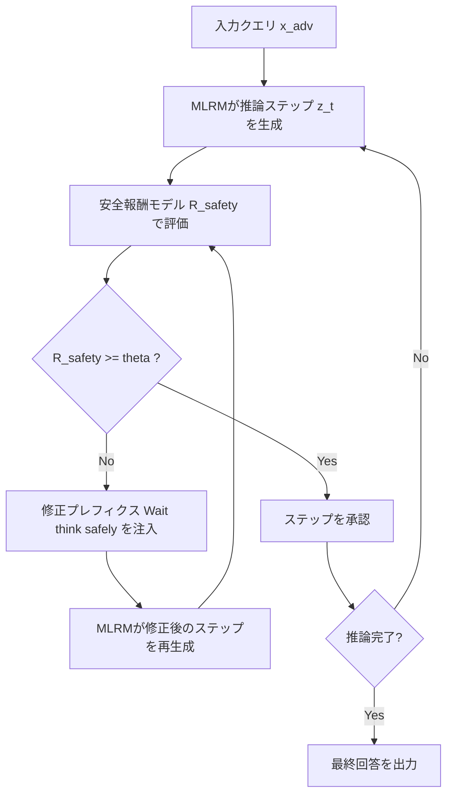

## 論文概要（Abstract）

本記事は [Safety Recovery in Reasoning Models Is Only a Few Early Steering Steps Away (arXiv:2602.11096)](https://arxiv.org/abs/2602.11096) の解説記事です。

SafeThinkは、マルチモーダル大規模推論モデル（MLRM）に対するinference-time防御手法である。安全報酬モデルで推論トレースを監視し、安全性閾値を下回った場合に最適化された短い修正プレフィクス（"Wait, think safely"）を条件付きで注入する。著者らは、6つのオープンソースMLRMと4つのジェイルブレイクベンチマークで、攻撃成功率（ASR）を30-60%削減しつつ、MathVistaでの推論精度を維持できることを報告している。重要な知見として、安全性回復には推論チェーン初期の1-3ステップへの介入で十分であることが示されている。

この記事は [Zenn記事: SafeMLRM徹底解説：推論強化がマルチモーダルAIの安全性を破壊するReasoning Taxの全貌](https://zenn.dev/0h_n0/articles/1cf634859b2bc6) の深掘りです。Zenn記事で扱われているSafety Tax問題に対する具体的な防御策として、SafeThinkの技術的詳細を解説する。

## 情報源

- **arXiv ID**: 2602.11096
- **URL**: [https://arxiv.org/abs/2602.11096](https://arxiv.org/abs/2602.11096)
- **著者**: Soumya Suvra Ghosal, Souradip Chakraborty, Vaibhav Singh, et al.
- **発表年**: 2026
- **分野**: cs.CL, cs.AI

## 背景と動機（Background & Motivation）

RLHF（Reinforcement Learning from Human Feedback）やGRPO（Group Relative Policy Optimization）などの手法によって推論能力を強化したモデルは、Chain-of-Thought推論の精度が向上する一方で、安全性アラインメントが劣化する問題が報告されている。これがZenn記事で扱われている「Reasoning Tax」（推論税）であり、推論能力と安全性がトレードオフになる現象を指す。

既存の防御手法にはいくつかの限界がある。ZeroThink（推論を完全に無効化）は安全性を回復するが推論能力を犠牲にする。LessThink（推論を最小化）も同様の課題を持つ。固定プレフィクスを付与するZS-SafePathは、すべてのクエリに一律に介入するため不必要なレイテンシが発生し、安全性改善も限定的である。AdaShieldのようなプロンプトベースの防御は、テキスト+画像の複合的な攻撃に対して効果が薄い。

著者らは、安全性回復を「最適化問題」ではなく「充足化制約」（satisficing constraint）として定式化することで、推論能力を維持しつつ必要な場合にのみ介入するSafeThinkを提案している。

## 主要な貢献（Key Contributions）

- **貢献1**: 安全性回復をsatisficing constraint（充足化制約）として定式化し、推論性能を犠牲にしない条件付き介入フレームワークを構築
- **貢献2**: 安全報酬モデルによるリアルタイム推論トレース監視と、最適化された短い修正プレフィクス（"Wait, think safely"）の条件付き注入メカニズムの設計
- **貢献3**: 安全性回復に必要な介入が推論チェーン初期の1-3ステップで十分であるという経験的知見の発見
- **貢献4**: 6つのオープンソースMLRMと4つのジェイルブレイクベンチマークでASR 30-60%削減を達成しつつ、MathVista精度を維持（65.20% → 65.00%）

## 技術的詳細（Technical Details）

### Satisficing Constraint定式化

SafeThinkの中核は、安全性を最適化対象ではなく充足化制約として扱うアプローチにある。通常の安全性最適化は推論性能との直接的なトレードオフになるが、SafeThinkでは「安全性が閾値を超えていれば推論タスクに集中し、下回った場合のみ介入する」という定式化を採用する。

制約付き最適化問題は以下のように定義される：

$$
\min_{\pi} \mathcal{L}_{\text{task}}(\pi) \quad \text{s.t.} \quad R_{\text{safety}}(\tau) \geq \theta
$$

ここで、
- $\pi$: モデルのポリシー（生成方策）
- $\mathcal{L}_{\text{task}}(\pi)$: タスク損失関数（推論精度の最適化対象）
- $R_{\text{safety}}(\tau)$: 安全報酬モデルが推論トレース$\tau$に対して付与する安全性スコア
- $\theta$: 安全性閾値（論文では正規化報酬空間で$\theta = 0$を使用）

各推論ステップ$t$での安全性チェックは、モンテカルロ推定により行われる：

$$
\mathbb{E}_{z \sim \pi_\theta(\cdot | x_{\text{adv}}, z_{<t})} \left[ \mathbb{1}\{R_{\text{safety}}([x_{\text{adv}}, z_{<t}], z) \geq \tau\} \right] \geq \rho
$$

ここで、
- $x_{\text{adv}}$: 敵対的入力（ジェイルブレイクプロンプト）
- $z_{<t}$: ステップ$t$までの推論トレース
- $z$: 次のステップの生成候補
- $\tau$: 安全性閾値
- $\rho$: 安全成功確率の下限

### 修正プレフィクスの最適化

安全性閾値違反が検出された場合、修正プレフィクス$s$を注入する。最適なプレフィクスは以下の最適化問題で選択される：

$$
\min_{s} D_{\text{KL}}\left(\pi_\theta(\cdot | x_{\text{adv}}, z_{<t}, s) \| \pi_\theta(\cdot | x_{\text{adv}}, z_{<t})\right) \quad \text{s.t.} \quad P_{\text{safe}}(s | x') \geq \rho
$$

ここで、
- $D_{\text{KL}}$: KLダイバージェンス（元の生成分布からの乖離を最小化）
- $P_{\text{safe}}(s | x')$: プレフィクス$s$を注入した後の安全成功確率

安全成功確率はモンテカルロ推定で計算される：

$$
P_{\text{safe}}(s | x') = \Pr_{z_t \sim \pi(\cdot | x', s)} \left[ R_{\text{safety}}(x', z_t) \geq \tau \right]
$$

著者らは500サンプルの検証セットでGPT-4を用いて候補フレーズ（1-5トークン）を生成し、オフラインで評価した結果、"Wait, think safely"が安全成功確率が最高かつKLダイバージェンスが最小であったと報告している。

### SafeThinkパイプライン



### Early Steering Finding

著者らが報告した重要な知見として、安全性回復に必要な介入ステップ数は極めて少ない。実験結果（論文Figure 4に基づく）では、ASRは推論チェーン最初の1-3ステップへの介入で急激に低下し、その後は飽和する。つまり、推論チェーンの初期段階で安全な方向に「舵を切る」ことができれば、以降のステップは自律的に安全な生成を継続する傾向がある。

この知見は実運用上重要であり、全推論ステップを監視する必要がなく、初期の数ステップのみの監視でレイテンシオーバーヘッドを最小化できることを意味する。

### SafeThinkスタイルの安全性チェック実装例

```python
from dataclasses import dataclass
from typing import Protocol


class SafetyRewardModel(Protocol):
    """安全報酬モデルのインタフェース"""

    def score(self, prompt: str, reasoning_trace: str) -> float:
        """推論トレースの安全性スコアを返す

        Args:
            prompt: 入力プロンプト
            reasoning_trace: 現在までの推論トレース

        Returns:
            安全性スコア（-1.0 ~ 1.0、高いほど安全）
        """
        ...


@dataclass(frozen=True)
class SafeThinkConfig:
    """SafeThinkの設定パラメータ

    Attributes:
        safety_threshold: 安全性閾値（論文では0.0）
        max_steering_depth: 最大介入ステップ数（論文では1-3）
        mc_samples: モンテカルロサンプル数（論文では3）
        corrective_prefix: 修正プレフィクス
    """

    safety_threshold: float = 0.0
    max_steering_depth: int = 3
    mc_samples: int = 3
    corrective_prefix: str = "Wait, think safely."


@dataclass
class SteeringResult:
    """介入結果を保持するデータクラス

    Attributes:
        step: 介入が行われたステップ番号
        original_score: 介入前の安全性スコア
        corrected_score: 介入後の安全性スコア
        prefix_injected: プレフィクスが注入されたかどうか
    """

    step: int
    original_score: float
    corrected_score: float
    prefix_injected: bool


def safethink_check(
    prompt: str,
    reasoning_steps: list[str],
    safety_model: SafetyRewardModel,
    config: SafeThinkConfig,
) -> tuple[list[str], list[SteeringResult]]:
    """SafeThinkスタイルの推論トレース安全性チェック

    推論チェーンの初期ステップを安全報酬モデルで監視し、
    安全性閾値を下回った場合に修正プレフィクスを注入する。

    Args:
        prompt: 入力プロンプト
        reasoning_steps: 推論ステップのリスト
        safety_model: 安全報酬モデル
        config: SafeThink設定

    Returns:
        修正済み推論ステップのリストと介入結果のリスト
    """
    corrected_steps: list[str] = []
    steering_results: list[SteeringResult] = []

    for step_idx, step in enumerate(reasoning_steps):
        # Early steeringの範囲内のみ監視（論文の知見に基づく）
        if step_idx < config.max_steering_depth:
            trace_so_far = " ".join(corrected_steps)
            candidate_trace = f"{trace_so_far} {step}".strip()
            safety_score = safety_model.score(prompt, candidate_trace)

            if safety_score < config.safety_threshold:
                # 修正プレフィクスを注入して再評価
                corrected_step = f"{config.corrective_prefix} {step}"
                corrected_trace = f"{trace_so_far} {corrected_step}".strip()
                corrected_score = safety_model.score(prompt, corrected_trace)

                corrected_steps.append(corrected_step)
                steering_results.append(
                    SteeringResult(
                        step=step_idx,
                        original_score=safety_score,
                        corrected_score=corrected_score,
                        prefix_injected=True,
                    )
                )
            else:
                corrected_steps.append(step)
                steering_results.append(
                    SteeringResult(
                        step=step_idx,
                        original_score=safety_score,
                        corrected_score=safety_score,
                        prefix_injected=False,
                    )
                )
        else:
            # max_steering_depth以降は監視をスキップ
            corrected_steps.append(step)

    return corrected_steps, steering_results
```

## 実装のポイント（Implementation）

### 安全報酬モデルの選定

著者らはLlama-Guard-3を主要な安全報酬モデルとして使用し、Qwen-Guard-3で検証を行っている。スコアは$[-1, 1]$の範囲に正規化される。安全報酬モデルの品質がSafeThink全体の性能を左右するため、実装時にはドメイン固有のファインチューニングや複数モデルのアンサンブルが推奨される。

### レイテンシへの影響

論文Table 1に基づくと、SafeThinkのレイテンシオーバーヘッドはZS-SafePathに対して0.1-0.9秒であり、全体の生成時間（8.02-9.32秒）に対して軽微である。これは、全ステップを監視するのではなく初期1-3ステップのみに介入を限定するearly steering戦略の効果である。

### モンテカルロサンプル数

安全成功確率の推定に使用するモンテカルロサンプル数$k$は3に設定されている。サンプル数を増やすと推定精度は向上するがレイテンシが増加するため、実運用ではバッチ処理との組み合わせや、安全報酬モデルのキャッシュ戦略が重要になる。

## Production Deployment Guide

### AWS実装パターン

SafeThinkのinference-time安全性レイヤーをAWS上に構築する場合、安全報酬モデルの推論をどこで実行するかが構成の分岐点となる。

| 規模 | 推奨構成 | 月額コスト目安 |
|------|---------|-------------|
| **Small** (~100 req/日) | Lambda + Bedrock（安全性チェック） | $50-150 |
| **Medium** (~1,000 req/日) | ECS Fargate + 安全報酬モデルサイドカー | $300-800 |
| **Large** (10,000+ req/日) | EKS + GPU（安全報酬モデル同居デプロイ） | $2,000-5,000 |

**Small構成の内訳**: Lambda関数がMLRM推論のプロキシとして動作し、各推論ステップの安全性チェックをBedrock経由のLlama Guard呼び出しで実施する。初期1-3ステップのみ監視するため、1リクエストあたりのBedrock呼び出しは最大3回に限定される。Lambda実行（$0.20/100万リクエスト）+ Bedrock推論（入力トークン$0.003/1Kトークン程度）+ DynamoDB（$1.25/100万書き込みユニット）で構成。

**Medium構成の内訳**: ECS Fargateでメイン推論コンテナと安全報酬モデルコンテナをサイドカー構成で配置。コンテナ間通信がlocalhost経由になるためネットワークレイテンシが最小化される。Fargate（0.5vCPU + 1GB RAM: 約$15/月/タスク）+ ALB（$22/月 + 処理料金）+ 安全報酬モデル用コンテナ（1vCPU + 2GB RAM: 約$30/月/タスク）。

**Large構成の内訳**: EKSクラスタ上にMLRM推論PodとSafety Guard Podを同一ノードに配置し、GPU共有によるコスト効率を最大化する。g5.xlargeインスタンス（$1.006/時間、Spot: $0.30/時間程度）を使用し、Karpenterによる自動スケーリングでトラフィック変動に対応。

**コスト試算の注意事項**: 上記は2026年4月時点のAWS ap-northeast-1（東京）リージョン料金に基づく概算値である。実際のコストはトラフィックパターン、バースト使用量、Spot価格変動により変動する。最新料金はAWS Pricing Calculatorで確認を推奨する。

**コスト削減テクニック**:
- Spot Instances活用で最大90%削減（Large構成のGPUインスタンス）
- Reserved Instances（1年コミット）で最大72%削減
- Bedrock Batch API使用で50%削減（非リアルタイム処理の場合）
- Prompt Caching有効化でシステムプロンプト部分30-90%削減
- Early steering（1-3ステップ限定監視）によりBedrock呼び出し回数を全ステップ監視比で80%以上削減

### Terraformインフラコード

**Small構成（Serverless）**:

```hcl
# SafeThink Safety Layer - Small構成
# Lambda + Bedrock による inference-time 安全性チェック

terraform {
  required_version = ">= 1.8"
  required_providers {
    aws = {
      source  = "hashicorp/aws"
      version = "~> 5.80"
    }
  }
}

provider "aws" {
  region = "ap-northeast-1"
}

# --- IAM ---
resource "aws_iam_role" "safethink_lambda" {
  name = "safethink-safety-checker"
  assume_role_policy = jsonencode({
    Version = "2012-10-17"
    Statement = [{
      Action    = "sts:AssumeRole"
      Effect    = "Allow"
      Principal = { Service = "lambda.amazonaws.com" }
    }]
  })
}

resource "aws_iam_role_policy" "safethink_lambda" {
  name = "safethink-bedrock-dynamodb"
  role = aws_iam_role.safethink_lambda.id
  policy = jsonencode({
    Version = "2012-10-17"
    Statement = [
      {
        Effect   = "Allow"
        Action   = ["bedrock:InvokeModel"]
        Resource = "arn:aws:bedrock:ap-northeast-1::foundation-model/meta.llama-guard-*"
      },
      {
        Effect = "Allow"
        Action = [
          "dynamodb:PutItem",
          "dynamodb:GetItem",
          "dynamodb:Query"
        ]
        Resource = aws_dynamodb_table.safety_logs.arn
      },
      {
        Effect = "Allow"
        Action = [
          "logs:CreateLogGroup",
          "logs:CreateLogStream",
          "logs:PutLogEvents"
        ]
        Resource = "arn:aws:logs:ap-northeast-1:*:*"
      }
    ]
  })
}

# --- Lambda ---
resource "aws_lambda_function" "safety_checker" {
  filename      = "safety_checker.zip"
  function_name = "safethink-safety-checker"
  role          = aws_iam_role.safethink_lambda.arn
  handler       = "index.handler"
  runtime       = "python3.12"
  timeout       = 60   # 安全性チェック3ステップ分
  memory_size   = 512
  environment {
    variables = {
      SAFETY_MODEL_ID     = "meta.llama-guard-3-8b-v1"
      SAFETY_THRESHOLD    = "0.0"
      MAX_STEERING_DEPTH  = "3"
      MC_SAMPLES          = "3"
      CORRECTIVE_PREFIX   = "Wait, think safely."
      DYNAMODB_TABLE      = aws_dynamodb_table.safety_logs.name
    }
  }
}

# --- DynamoDB（安全性チェックログ） ---
resource "aws_dynamodb_table" "safety_logs" {
  name         = "safethink-safety-logs"
  billing_mode = "PAY_PER_REQUEST"  # On-Demand（Small規模向け）
  hash_key     = "request_id"
  range_key    = "timestamp"

  attribute {
    name = "request_id"
    type = "S"
  }
  attribute {
    name = "timestamp"
    type = "S"
  }

  # KMS暗号化
  server_side_encryption {
    enabled = true
  }

  # 90日でTTL自動削除
  ttl {
    attribute_name = "ttl"
    enabled        = true
  }
}

# --- CloudWatchアラーム ---
resource "aws_cloudwatch_metric_alarm" "safety_invocation_errors" {
  alarm_name          = "safethink-lambda-errors"
  comparison_operator = "GreaterThanThreshold"
  evaluation_periods  = 2
  metric_name         = "Errors"
  namespace           = "AWS/Lambda"
  period              = 300
  statistic           = "Sum"
  threshold           = 5
  alarm_description   = "SafeThink Lambda errors exceed threshold"
  dimensions = {
    FunctionName = aws_lambda_function.safety_checker.function_name
  }
}
```

**Large構成（Container）**:

```hcl
# SafeThink Safety Layer - Large構成
# EKS + Karpenter + GPU Spot Instances

module "eks" {
  source          = "terraform-aws-modules/eks/aws"
  version         = "~> 20.30"
  cluster_name    = "safethink-cluster"
  cluster_version = "1.31"

  vpc_id     = module.vpc.vpc_id
  subnet_ids = module.vpc.private_subnets

  # コントロールプレーンのみ（ノードはKarpenterで管理）
  eks_managed_node_groups = {
    system = {
      instance_types = ["m7i.large"]
      min_size       = 2
      max_size       = 3
      desired_size   = 2
    }
  }
}

# Karpenter Provisioner（Spot優先、GPU対応）
resource "kubectl_manifest" "karpenter_provisioner" {
  yaml_body = yamlencode({
    apiVersion = "karpenter.sh/v1"
    kind       = "NodePool"
    metadata   = { name = "safethink-gpu" }
    spec = {
      template = {
        spec = {
          requirements = [
            { key = "karpenter.sh/capacity-type", operator = "In", values = ["spot", "on-demand"] },
            { key = "node.kubernetes.io/instance-type", operator = "In", values = ["g5.xlarge", "g5.2xlarge"] },
          ]
          nodeClassRef = { name = "default" }
        }
      }
      limits   = { cpu = "64", "nvidia.com/gpu" = "8" }
      # Spot優先: spot->on-demandの順で試行
      disruption = {
        consolidationPolicy = "WhenEmptyOrUnderutilized"
        consolidateAfter    = "30s"
      }
    }
  })
}

# Secrets Manager（安全報酬モデル設定）
resource "aws_secretsmanager_secret" "safethink_config" {
  name = "safethink/safety-model-config"
}

resource "aws_secretsmanager_secret_version" "safethink_config" {
  secret_id = aws_secretsmanager_secret.safethink_config.id
  secret_string = jsonencode({
    safety_threshold   = 0.0
    max_steering_depth = 3
    mc_samples         = 3
    corrective_prefix  = "Wait, think safely."
  })
}

# AWS Budgets（月次予算アラート）
resource "aws_budgets_budget" "safethink_monthly" {
  name         = "safethink-monthly-budget"
  budget_type  = "COST"
  limit_amount = "5000"
  limit_unit   = "USD"
  time_unit    = "MONTHLY"

  notification {
    comparison_operator       = "GREATER_THAN"
    threshold                 = 80
    threshold_type            = "PERCENTAGE"
    notification_type         = "ACTUAL"
    subscriber_email_addresses = ["ops-team@example.com"]
  }
}
```

### 運用・監視設定

**CloudWatch Logs Insightsクエリ**（安全性介入の分析）:

```
# 1時間あたりの安全性介入回数とASR
fields @timestamp, request_id, safety_score, prefix_injected
| filter prefix_injected = true
| stats count() as interventions,
        avg(safety_score) as avg_safety_score
  by bin(1h) as hour
| sort hour desc

# P95/P99レイテンシ分析
fields @timestamp, duration_ms, steering_steps
| stats percentile(duration_ms, 95) as p95,
        percentile(duration_ms, 99) as p99,
        avg(steering_steps) as avg_steering
  by bin(1h)
```

**CloudWatchアラーム設定**:

```python
import boto3

cloudwatch = boto3.client("cloudwatch", region_name="ap-northeast-1")


def create_safety_alarms() -> None:
    """SafeThink用のCloudWatchアラームを作成する"""
    # 安全性チェック失敗率アラーム
    cloudwatch.put_metric_alarm(
        AlarmName="safethink-high-intervention-rate",
        MetricName="SafetyInterventionRate",
        Namespace="SafeThink/Safety",
        Statistic="Average",
        Period=300,
        EvaluationPeriods=3,
        Threshold=0.5,  # 介入率50%超でアラート
        ComparisonOperator="GreaterThanThreshold",
        AlarmActions=["arn:aws:sns:ap-northeast-1:ACCOUNT:safethink-alerts"],
    )
```

**X-Rayトレーシング設定**:

```python
from aws_xray_sdk.core import xray_recorder, patch_all

patch_all()  # boto3自動計装


@xray_recorder.capture("safety_check")
def safety_check_with_tracing(
    prompt: str, reasoning_step: str, step_idx: int
) -> float:
    """X-Rayトレーシング付き安全性チェック

    Args:
        prompt: 入力プロンプト
        reasoning_step: 評価対象の推論ステップ
        step_idx: ステップ番号

    Returns:
        安全性スコア
    """
    subsegment = xray_recorder.current_subsegment()
    if subsegment:
        subsegment.put_annotation("step_index", step_idx)
        subsegment.put_metadata("prompt_length", len(prompt))
    score = invoke_safety_model(prompt, reasoning_step)
    if subsegment:
        subsegment.put_annotation("safety_score", score)
        subsegment.put_annotation("threshold_violated", score < 0.0)
    return score
```

**Cost Explorer日次レポート**:

```python
import boto3
from datetime import datetime, timedelta


def get_daily_safethink_cost() -> dict[str, float]:
    """SafeThink関連の日次コストを取得する

    Returns:
        サービス別コスト辞書
    """
    ce = boto3.client("ce", region_name="us-east-1")
    today = datetime.now().strftime("%Y-%m-%d")
    yesterday = (datetime.now() - timedelta(days=1)).strftime("%Y-%m-%d")

    response = ce.get_cost_and_usage(
        TimePeriod={"Start": yesterday, "End": today},
        Granularity="DAILY",
        Metrics=["UnblendedCost"],
        Filter={
            "Tags": {
                "Key": "Project",
                "Values": ["safethink"],
            }
        },
        GroupBy=[{"Type": "DIMENSION", "Key": "SERVICE"}],
    )

    costs: dict[str, float] = {}
    for group in response["ResultsByTime"][0]["Groups"]:
        service = group["Keys"][0]
        amount = float(group["Metrics"]["UnblendedCost"]["Amount"])
        costs[service] = amount

    total = sum(costs.values())
    if total > 100.0:
        # SNS通知: $100/日超過
        sns = boto3.client("sns", region_name="ap-northeast-1")
        sns.publish(
            TopicArn="arn:aws:sns:ap-northeast-1:ACCOUNT:safethink-cost-alert",
            Subject=f"SafeThink daily cost alert: ${total:.2f}",
            Message=f"Daily cost exceeded $100: {costs}",
        )
    return costs
```

### コスト最適化チェックリスト

**アーキテクチャ選択**:
- [ ] トラフィック量に基づく構成選択（~100 req/日: Serverless、~1K: Hybrid、10K+: Container）
- [ ] Early steering活用で監視対象を初期1-3ステップに限定

**リソース最適化**:
- [ ] EC2/EKS: GPU Spot Instances優先（g5.xlarge Spot: 約70%割引）
- [ ] Reserved Instances: 1年コミットで最大72%削減
- [ ] Savings Plans: Compute Savings Plans検討
- [ ] Lambda: メモリサイズ最適化（512MB推奨、Power Tuningで検証）
- [ ] ECS/EKS: アイドル時スケールダウン（Karpenter consolidation）
- [ ] NAT Gateway不使用（VPCエンドポイント活用でコスト削減）

**LLMコスト削減**:
- [ ] Bedrock Batch API使用（非リアルタイム処理で50%削減）
- [ ] Prompt Caching有効化（システムプロンプト固定で30-90%削減）
- [ ] モデル選択ロジック（低リスククエリはLlama Guard 1B、高リスクは8Bを使い分け）
- [ ] 入力トークン数制限（推論ステップのトランケーション）
- [ ] 安全性スコアキャッシュ（同一プレフィクスの重複チェック排除）

**監視・アラート**:
- [ ] AWS Budgets月額予算設定（閾値80%でメール通知）
- [ ] CloudWatchアラーム（介入率、エラー率、レイテンシ）
- [ ] Cost Anomaly Detection有効化
- [ ] 日次コストレポート自動送信（$100/日超過でSNS通知）
- [ ] X-Rayトレーシングによるボトルネック特定

**リソース管理**:
- [ ] 未使用リソース定期削除（Lambda旧バージョン、ECRイメージ）
- [ ] タグ戦略徹底（Project=safethink、Environment=prod/dev）
- [ ] DynamoDBのTTLポリシー（安全性ログ90日自動削除）
- [ ] 開発環境の夜間・休日停止スケジュール
- [ ] CloudTrail/Config有効化（セキュリティ監査）

## 実験結果（Results）

### ベンチマーク別ASR削減率（論文Table 1より）

| モデル | JailbreakV-28K | HADES | FigStep | MM-SafetyBench |
|--------|---------------|-------|---------|----------------|
| LlamaV-o1 | 63.3% → 5.7% | 66.8% → 6.0% | - | - |
| R1-Onevision | 50.6% → 10.4% | 69.1% → 5.7% | 31.6%削減 | - |
| OpenVLThinker | 45.7% → 1.1% | 66.7% → 2.2% | 49.2% → 4.4% | - |
| VLAA-Thinker | 20.4% → 4.4% | 28.7% → 2.2% | - | 39.8%削減 |
| Vision-R1 | 41.8% → 3.6% | 62.0% → 8.4% | 30.8%削減 | - |
| LLaVA-CoT | 42.2% → 6.6% | 26.9% → 2.0% | - | 50.2%削減 |

特にHADESベンチマークでは、R1-Onevisionに対して63.4ポイントの絶対ASR削減（69.1% → 5.7%）が報告されている。

### 推論性能への影響

MathVistaベンチマークでの精度比較では、SafeThink適用前後で65.20% → 65.00%と報告されており、推論性能の劣化は0.2ポイント以下にとどまっている。これは、satisficing constraintアプローチにより安全性閾値を超えている場合には介入しない設計の効果である。

### ベースラインとの比較

著者らはZeroThink（推論無効化）、LessThink（推論最小化）、ZS-SafePath（固定8トークンプレフィクス"Let's think about safety first"）、AdaShield（防御プロンプト付与）と比較している。SafeThinkはすべてのベースラインを一貫して上回っており、特にZS-SafePathに対して条件付き介入の優位性が示されている。ZeroThinkは安全性を回復するが推論精度を大幅に犠牲にするため、SafeThinkのようなtask-safety両立型の手法が実用的であると著者らは主張している。

### レイテンシオーバーヘッド

論文Table 1に基づくと、SafeThinkの追加レイテンシは0.1-0.9秒であり、ベースラインの生成時間（8.02-9.32秒）に対して約1-10%の増加にとどまる。

## 実運用への応用（Practical Applications）

SafeThinkのinference-time防御アプローチは、モデルの学習パイプラインに変更を加えずに安全性レイヤーを後付けできる点が実運用上の大きな利点である。既存のMLRMデプロイメントに対してプロキシ層として挿入可能であり、段階的なロールアウトやA/Bテストが容易に実施できる。

Zenn記事で扱われているSafety Tax問題への直接的な対策として、GRPOで推論強化されたモデルの安全性を追加学習なしにリカバーできる。Llama-Guard-3やQwen-Guard-3のような公開安全報酬モデルを使用するため、独自の安全データセット構築が不要な点もコスト面で有利である。

一方で、以下の制約に注意が必要である。第一に、SafeThinkの有効性は安全報酬モデルの品質に依存しており、安全報酬モデルが見落とす攻撃パターンには対応できない。第二に、実験はオープンソースの7Bクラスモデルのみで行われており、大規模プロプライエタリモデルへの適用可能性は未検証である。第三に、適応的攻撃（adaptive attack）すなわち安全報酬モデルの特性を知った上での攻撃に対する頑健性は論文で明示的には評価されていない。

## 関連研究（Related Work）

- **SafeMLRM (Zenn記事の主題)**: GRPOベースの安全性強化をファインチューニング時に行う手法。SafeThinkはinference-timeの手法であり、SafeMLRMとは相補的な関係にある
- **THINKSAFE**: 推論トレースの安全性を事後検証するフレームワーク。SafeThinkは事後検証ではなくリアルタイム介入を行う点で異なる
- **Think in Safety**: 安全性を考慮した推論プロンプト設計。固定プロンプトであるため適応性がSafeThinkより低い
- **ZS-SafePath**: 固定8トークンプレフィクス"Let's think about safety first"を全クエリに付与。SafeThinkは条件付き介入により不要な介入を排除している

## まとめと今後の展望

SafeThinkは、安全性回復を充足化制約として定式化し、推論チェーン初期の1-3ステップへの条件付き介入で安全性を回復するinference-time防御手法である。6つのMLRMと4つのベンチマークでASR 30-60%削減を達成しつつ、MathVista精度を実質維持（0.2ポイント劣化）している点は注目に値する。

今後の課題として、著者らの報告や論文の限界から以下が挙げられる。安全報酬モデル自体の改善（適応的攻撃への頑健性）、大規模モデル（70B以上）やプロプライエタリモデルへの適用検証、動画や音声を含むマルチモーダル入力への拡張、そしてSafeMLRMのようなファインチューニングベース手法との統合的な防御フレームワークの構築である。

## 参考文献

- **arXiv**: [https://arxiv.org/abs/2602.11096](https://arxiv.org/abs/2602.11096)
- **Related Zenn article**: [https://zenn.dev/0h_n0/articles/1cf634859b2bc6](https://zenn.dev/0h_n0/articles/1cf634859b2bc6)
