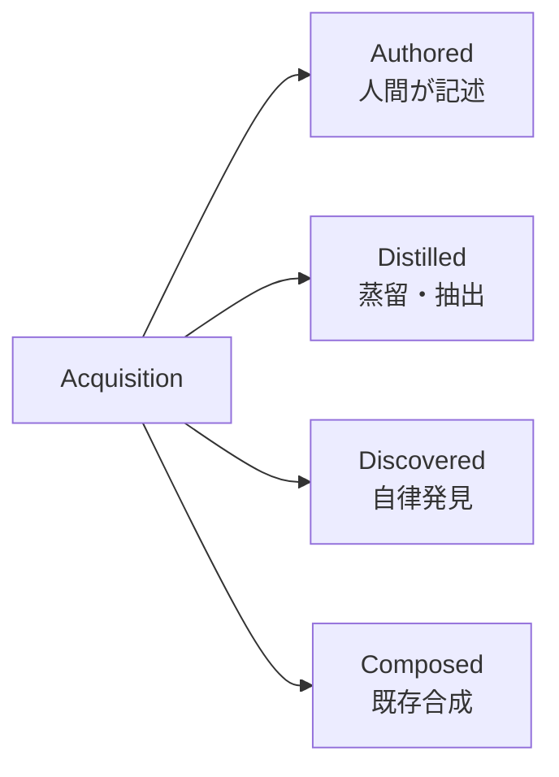

本記事は [Skills for Scalable AI Agents (arXiv:2602.12430)](https://arxiv.org/abs/2602.12430) の解説記事です。

## 論文概要（Abstract）

Li et al.（2026）は、LLMエージェントにおける「スキル（Skill）」を統一的に整理した論文を発表した。著者らはスキルを**取得方法（Acquisition）・表現形式（Representation）・呼び出し方法（Invocation）**の3軸で分類するタクソノミーを提案し、これらの組み合わせから42種類の実装バリアントを体系化している。特筆すべき発見として、スキルライブラリの規模が臨界点を超えるとエージェントの問題解決能力が非線形に向上する「相転移」現象が報告されている。

この記事は [Zenn記事: LLMエージェントの外部化設計：Memory・Skills・Protocols・Harnessの統一的理解](https://zenn.dev/0h_n0/articles/73bdc5dd332f59) の深掘りです。

## 情報源

- **arXiv ID**: 2602.12430
- **URL**: [https://arxiv.org/abs/2602.12430](https://arxiv.org/abs/2602.12430)
- **著者**: Changhao Li, Tianle Cai, Chi Han et al.
- **発表年**: 2026年2月
- **分野**: cs.AI, cs.CL, cs.LG

## 背景と動機（Background & Motivation）

LLMエージェントが自律的なタスク実行に進む中で、「ツール」と「スキル」の区別が曖昧なまま実装が進んでいる状況があった。OpenAI Function Calling（2023年）の登場以降、単一関数呼び出しとしてのツール利用は急速に普及したが、複数ステップの手順を再利用可能な単位として管理する「スキル」の設計論は体系化されていなかった。

著者らは、Voyager（Wang et al., 2023）がMinecraft環境でスキルライブラリを自律構築した成功事例と、ToolBench（Qin et al., 2023）が16,000以上のREST APIをベンチマーク化した取り組みを踏まえ、これらの散在する知見を統一フレームワークで整理する必要性を指摘している。

## 主要な貢献（Key Contributions）

著者らが主張する貢献は以下の通りである。

- **貢献1**: Skill vs Tool の形式的な区別と、3軸タクソノミー（Acquisition × Representation × Invocation）の提案
- **貢献2**: 42種類の実装バリアントの体系的マッピングと、既存システムの設計空間上の位置づけ
- **貢献3**: スキルライブラリのスケーリング時に生じる相転移現象の報告と、セキュリティリスクの分類

## 技術的詳細（Technical Details）

### Skill と Tool の形式的区別

著者らはToolを「事前に設計された固定APIインターフェース」、Skillを「エージェントが取得・表現・呼び出す再利用可能な能力ユニット」と定義している。スキル $S$ は以下のトリプルで形式化される。

$$
S = (A, R, I)
$$

ここで、

- $A$: Acquisition method（取得方法）
- $R$: Representation（表現形式）
- $I$: Invocation strategy（呼び出し方法）

ToolがSkillの構成要素になり得る一方、Skillはツールより広い抽象度を持つ。例えば「データベースマイグレーション」というSkillは、SQL実行ツール・ファイル読み書きツール・バックアップ手順を組み合わせた複合的な手続き知識である。

### 3軸タクソノミーの詳細

#### 軸1: Acquisition（取得方法）— 4カテゴリ

**Authored（人間記述型）**: エンジニアがスキルを明示的に定義。OpenAI Function Callingの関数定義が典型例。信頼性は高いが拡張コストも高い。

**Distilled（蒸留型）**: 大規模モデルの出力や成功した実行軌跡からスキルを自動抽出。ToolFormer（Schick et al., 2023）がAPIコール埋め込みを自己教師あり学習で獲得した事例が代表的。

**Discovered（発見型）**: エージェントが環境との相互作用を通じてスキルを自律獲得。Voyagerが Minecraft環境で探索を通じてJavaScriptスキルライブラリを構築した事例が該当する。

**Composed（合成型）**: 既存スキルを組み合わせて新しい複合スキルを構成。HuggingGPT（Shen et al., 2023）が複数AIモデルをオーケストレーションする構成が例として挙げられる。

#### 軸2: Representation（表現形式）— 3カテゴリ

| 表現形式 | 特徴 | 代表例 |
|---|---|---|
| **Code** | 実行可能・検証可能・デバッグ容易 | CodeAct、Voyagerスキルライブラリ |
| **Natural Language** | 人間可読性高・LLMが直接利用可能・曖昧性あり | ReActのアクション記述 |
| **API Specification** | 機械処理容易・型安全・表現力制限 | OpenAI Function Calling JSON |

#### 軸3: Invocation（呼び出し方法）— 3カテゴリ

**Direct（直接呼び出し）**: スキル名を直接指定して呼び出す。低レイテンシだがスキル名の事前知識が必要。

**Retrieval-based（検索ベース）**: 埋め込み類似度によるスキル検索。大規模ライブラリに対応可能だが検索品質がボトルネック。

**LLM-generated（LLM生成型）**: LLMがその場でスキルをコードとして生成・実行。最も柔軟だがハルシネーションリスクが高い。

### スキルの有用性スコアリング

著者らはスキル選択の定式化として、タスク $q$ に対するスキル $s$ の有用性スコア $U(s)$ を以下のように定義している。

$$
U(s) = \alpha \cdot \text{Relevance}(s, q) + \beta \cdot \text{Reliability}(s) + \gamma \cdot \text{Efficiency}(s)
$$

ここで、

- $\text{Relevance}(s, q)$: 埋め込みコサイン類似度等で測定されるタスクとの関連度
- $\text{Reliability}(s)$: 過去の実行成功率
- $\text{Efficiency}(s)$: 実行コスト（APIコール数、トークン消費量）の逆数
- $\alpha, \beta, \gamma$: タスク・ドメイン依存の重みパラメータ

実用的には、Top-k選択にはグリーディ選択またはMMR（Maximal Marginal Relevance）が使用される。

### 42種類の実装バリアント

3軸の組み合わせ Acquisition(4) × Representation(3) × Invocation(3) から**36種類の基本組み合わせ**が生成され、一部カテゴリの細分化により計42バリアントとなる。著者らは既存システムを以下のようにマッピングしている。

| システム | 取得方法 | 表現形式 | 呼び出し方法 |
|---|---|---|---|
| Voyager | Discovered + Authored | Code | Retrieval-based |
| ToolFormer | Distilled | API Spec | Direct |
| HuggingGPT | Composed | NL + API Spec | LLM-generated |
| CodeAct | Discovered | Code | LLM-generated |
| ReAct | Discovered | Natural Language | LLM-generated |
| ToolBench | Authored + Distilled | API Spec | Retrieval-based |

著者らの分析によれば、**Distilled × Code × Retrieval-based** の組み合わせが最も未開拓な設計領域として指摘されている。

### 相転移現象（Phase Transition）

著者らが報告する重要な発見の一つが、スキルライブラリのスケーリング時に生じる**相転移現象**である。スキルライブラリのサイズ $N$ とエージェント性能 $P(N)$ の関係は以下のモデルで近似される。

$$
P(N) = P_{\text{base}} + A \cdot \left(1 - e^{-N/N_{\text{critical}}}\right)
$$

ここで、

- $P_{\text{base}}$: スキルなしでのベースライン性能
- $A$: 最大性能向上幅
- $N_{\text{critical}}$: 相転移が発生する臨界スキル数

著者らはVoyagerの実験を分析し、$N_{\text{critical}}$ が約50-100スキル付近にあると報告している。具体的には、$N < 30$ では基本タスクのみ達成可能であったのが、$N \approx 80$ を超えると複雑な長期タスク（例: Minecraftでのダイヤモンド採掘）が急激に達成可能になるとされる。タスク達成率は $N = 50$ 付近の約40%から $N = 100$ で約80%へと非線形に向上したと報告されている。

この現象は、スキル間の相補性（complementarity）が臨界点以上で創発的に機能するためと解釈されているが、その理論的基盤（なぜ特定の $N$ で転移が起こるのか）は未解明のままである。

## 実装のポイント（Implementation）

著者らは実装上の最大の課題として**スキル粒度の設計**を挙げている。

- **粒度が細かすぎる場合**: 組み合わせ爆発が発生し、検索空間が過大になる
- **粒度が粗すぎる場合**: 再利用性が低下し、新しいタスクへの適応が困難になる

推奨される設計パターンは「自然言語記述 + コード実装 + 使用例」の3点セットでスキルを表現し、埋め込み類似度ベースの検索（dense retrieval）で選択する方式である。

### セキュリティリスクの分類

著者らはスキル実行に伴う5つのリスクカテゴリを識別している。

1. **Prompt Injection**: 悪意ある入力によるエージェント行動の乗っ取り
2. **Skill Poisoning**: スキルライブラリへの悪意あるスキル注入（サプライチェーン攻撃）
3. **Privilege Escalation**: スキル実行権限を悪用した過剰なシステムアクセス
4. **Skill Hallucination**: 存在しないスキルの参照・実行試行
5. **Cross-Skill Interference**: 複数スキルの並列実行時の状態競合

特にDistilledおよびDiscoveredスキルは品質検証が困難であり、スキルの署名・ハッシュ検証やサンドボックス実行が対策として推奨されている。

## 実験結果に基づく評価（Results）

著者らは既存ベンチマークの結果を横断的に分析し、スキルベースエージェントの性能を比較している。

**ToolBench（Qin et al., 2023）の結果引用**: 16,464のREST APIを対象に、3段階の難易度（I1: 単一ツール、I2: 同カテゴリ、I3: クロスカテゴリ）で評価。Retrieval-basedの呼び出し方法がI3（最難）で最も安定した性能を示したと報告されている。

**Voyager（Wang et al., 2023）の結果引用**: Minecraft環境でのTech Tree Progress（テクノロジーツリー達成度）において、スキルライブラリを持つVoyagerがAutoGPTやReActベースラインを大幅に上回ったとされる。

## 実運用への応用（Practical Applications）

本タクソノミーは、エージェントシステムにおけるスキル管理の設計判断に直接活用できる。

- **スキル数が少ない初期段階（N < 50）**: Authored + API Spec + Direct の組み合わせが低コストで信頼性が高い
- **スキル数が増加する成長段階（50 < N < 200）**: Retrieval-based呼び出しへの移行が必要。検索インフラの整備がボトルネック
- **大規模スキルライブラリ（N > 200）**: Composed + Code + Retrieval-basedの組み合わせが推奨。スキル間依存関係のDAG管理が必須

相転移現象の知見は、スキルライブラリの投資判断に示唆を与える。$N_{\text{critical}}$ に到達する前に投資を打ち切ると、スキルライブラリの効果を過小評価するリスクがある。

## 関連研究（Related Work）

- **Externalization in LLM Agents（Yang et al., 2026, arXiv 2604.08224）**: 本論文のスキル分類は、この外部化フレームワークのSkills次元における主要参考文献として位置付けられている
- **CoALA（Sumers et al., 2023）**: 手続き記憶（Procedural Memory）の分類がスキルの外部ストレージ形態に対応
- **Toolformer（Schick et al., 2023）**: Distilled型スキル取得の先駆的研究
- **Voyager（Wang et al., 2023）**: Discovered型スキル取得とコード表現の実装基盤

## まとめと今後の展望

Li et al.（2026）は、LLMエージェントにおけるスキルを3軸タクソノミーで統一的に分類し、42種類の実装バリアントを体系化した。相転移現象の報告は、スキルライブラリへの投資が臨界点を超えると劇的な効果を生む可能性を示唆している。

未解決の課題として、最適なスキル粒度の決定方法、スキルライブラリの数千規模へのスケーリング時の検索効率、あるドメインで獲得したスキルの別ドメインへの転移方法が挙げられる。また、スキル実行サンドボックスの標準化やDistilledスキルの品質保証プロトコルの策定が実用化に向けた課題として残されている。

## 参考文献

- **arXiv**: [https://arxiv.org/abs/2602.12430](https://arxiv.org/abs/2602.12430)
- **Related Zenn article**: [https://zenn.dev/0h_n0/articles/73bdc5dd332f59](https://zenn.dev/0h_n0/articles/73bdc5dd332f59)
- **Voyager (Wang et al., 2023)**: [https://arxiv.org/abs/2305.16291](https://arxiv.org/abs/2305.16291)
- **ToolBench (Qin et al., 2023)**: [https://arxiv.org/abs/2305.16504](https://arxiv.org/abs/2305.16504)
- **Toolformer (Schick et al., 2023)**: [https://arxiv.org/abs/2302.04761](https://arxiv.org/abs/2302.04761)
