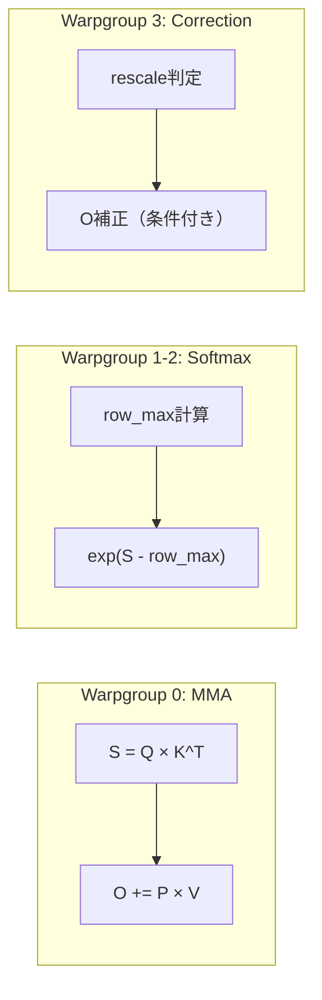

> **本記事は [FlashAttention-4: Algorithm and Kernel Pipelining Co-Design for Asymmetric Hardware Scaling (arXiv:2603.05451)](https://arxiv.org/abs/2603.05451) の解説記事です。**

## 論文概要（Abstract）

FlashAttention-4は、NVIDIA Blackwell世代GPU（B200/GB200）の非対称なハードウェアスケーリング特性に対応するため、アルゴリズムとGPUカーネルのパイプライン設計を統合的に再設計したアテンション実装である。著者らは、テンソルコアのスループットが倍増する一方で指数演算ユニットや共有メモリ帯域幅はほぼ据え置きという非対称性に着目し、ソフトウェアによる指数関数エミュレーションや条件付きオンラインsoftmaxリスケーリングを導入した。B200上でBF16において1605 TFLOPS/s（理論値の71%）を達成し、cuDNN 9.13比で最大1.3倍の高速化を報告している。

この記事は [Zenn記事: Attention機構の全史 Bahdanauから FlashAttention4・MLAまでの数学と実装](https://zenn.dev/0h_n0/articles/b03b57bf327edf) の深掘りです。

## 情報源

- **arXiv ID**: 2603.05451
- **URL**: [https://arxiv.org/abs/2603.05451](https://arxiv.org/abs/2603.05451)
- **著者**: Ted Zadouri, Markus Hoehnerbach, Jay Shah, Timmy Liu, Vijay Thakkar, Tri Dao
- **発表年**: 2026年3月
- **分野**: cs.CL（Computation and Language）
- **コード**: [https://github.com/Dao-AILab/flash-attention](https://github.com/Dao-AILab/flash-attention)

## 背景と動機（Background & Motivation）

FlashAttentionシリーズは、GPUのメモリ階層を活用してアテンション計算を高速化するアプローチとして2022年に登場した。FlashAttention-2（2023年）ではワーク分割の改善、FlashAttention-3（2024年）ではH100のWGMMA命令と非同期TMAを活用し、世代ごとにGPUアーキテクチャの新機能に対応してきた。

2025-2026年にかけてNVIDIA Blackwell世代（B200/GB200）が本格稼働を開始したが、このアーキテクチャには根本的な課題がある。テンソルコアのスループットはHopper世代比で約2倍に向上した一方、指数演算ユニット（MUFU）のスループットは据え置き、共有メモリ帯域幅の向上幅も限定的である。この**非対称スケーリング**により、FlashAttention-3のパイプライン設計をそのまま移植しても性能が頭打ちになるという問題が顕在化した。

FlashAttention-4はこの課題に対し、アルゴリズムレベル（softmax計算の再設計）とカーネルレベル（パイプラインの協調設計）を統合的に最適化することで解決を図っている。

## 主要な貢献（Key Contributions）

著者らが報告している主要な貢献は以下の3点である。

- **貢献1**: Blackwellの完全非同期MMAと大型タイルサイズを活用した新しいforward/backwardパイプライン設計。テンソルコア・softmax指数演算・メモリ操作のオーバーラップを実現
- **貢献2**: FMA（Fused Multiply-Add）ユニット上での多項式近似による指数関数のソフトウェアエミュレーション。MUFU指数演算ユニットのボトルネックを回避
- **貢献3**: CuTe-DSL（CUTLASSのPython DSL）による実装。C++テンプレートベースのカーネルと比較して20-30倍高速なコンパイル時間を実現

## 技術的詳細（Technical Details）

### Blackwell GPUの非対称スケーリング問題

B200 GPUのSM（Streaming Multiprocessor）あたりの性能特性（論文Table 1より、M=N=D=128の場合）を以下に示す。

| リソース | スループット | 備考 |
|----------|-------------|------|
| テンソルコア（BF16） | 8,192 ops/cycle | Hopper比約2倍 |
| 指数演算ユニット（MUFU） | 16 ops/cycle | Hopper世代と同等 |
| 共有メモリ帯域幅 | 128 bytes/cycle | 向上幅限定的 |

テンソルコアのスループットが突出して高いため、softmaxに必要な指数演算がボトルネックとなる。著者らはこの非対称性を定量的に分析し、指数演算がパイプライン全体の律速段階であることを示している。

### Forwardパスの新パイプライン設計

FlashAttention-4のForwardパスは、Ping-Pongスケジューリングに基づくパイプラインを採用している。各CTA（Cooperative Thread Array）は2つのQ/Oタイルを保持し、以下の3種のオペレーションを並行実行する。



**ソフトウェア指数関数エミュレーション（論文Section 3.2より）**

Blackwellでは指数演算ユニット（MUFU）がボトルネックになるため、著者らはFMAユニット上で $2^x$ を多項式近似するソフトウェアエミュレーションを導入した。

**ステップ1: レンジリダクション（Cody-Waite分解）**

$$
2^x = 2^n \cdot 2^f, \quad n = \lfloor x \rfloor, \quad f = x - n
$$

整数部 $n$ は左シフト（ビット操作）で高速に計算し、小数部 $f \in [0, 1)$ のみ多項式で近似する。

**ステップ2: 多項式近似**

$$
2^f \approx p_0 + p_1 f + p_2 f^2 + p_3 f^3
$$

論文で報告されている係数は $p_0 = 1.0, p_1 \approx 0.6951, p_2 \approx 0.2276, p_3 \approx 0.0771$ である。この3次多項式はFMAユニット3回の呼び出しで計算可能であり、MUFUの $e^x$ 命令を代替する。

**条件付きオンラインsoftmaxリスケーリング（論文Section 3.3より）**

標準的なオンラインsoftmaxでは、各ブロック処理後に $O$ を $\exp(m_{j-1} - m_j)$ でリスケーリングする。しかし、多くのケースで $m_j = m_{j-1}$（最大値が更新されない）となるため、著者らは条件分岐を導入している。

$$
O_j = \begin{cases}
\exp(m_{j-1} - m_j) O_{j-1} + \exp(S_j - m_j) V_j & \text{if } m_j - m_{j-1} > \tau \\
O_{j-1} + \exp(S_j - m_j) V_j & \text{otherwise}
\end{cases}
$$

閾値 $\tau$ を超えた場合のみリスケーリングを実行することで、不要な指数演算を削減している。

### Backwardパスの最適化

Backwardパスでは、以下の2つの最適化が導入されている。

1. **テンソルメモリ（TMEM）活用**: Blackwellの256KB/SM TMEMに中間結果を格納し、共有メモリトラフィックを削減
2. **2-CTA MMAモード**: 2つのCTAにまたがるTMEMを活用して256×256×16タイルを処理。アトミックリダクションを半減

### CuTe-DSL実装

FlashAttention-4はCUTLASSのPython DSL（CuTe-DSL）で実装されている。PythonからPTX、さらにGPUマシンコードへコンパイルされる。著者らは、C++テンプレートベースの実装と比較して20-30倍のコンパイル速度向上を報告している。

```python
# CuTe-DSLによるカーネル定義の概念的構造（論文に基づく簡略化）
# 実際のコードはGitHub Dao-AILab/flash-attentionを参照
@cute_kernel
def flash_attn_fwd(Q, K, V, O, softmax_lse):
    # タイルサイズ: Blackwell向けに最適化
    BLOCK_M, BLOCK_N = 128, 128

    # Ping-Pong: 2つのQタイルを交互に処理
    for q_tile_idx in range(0, seq_len_q, BLOCK_M * 2):
        q_tile_0 = load_tile(Q, q_tile_idx)
        q_tile_1 = load_tile(Q, q_tile_idx + BLOCK_M)

        for kv_tile_idx in range(0, seq_len_kv, BLOCK_N):
            k_tile = load_tile_async(K, kv_tile_idx)  # TMAで非同期ロード
            v_tile = load_tile_async(V, kv_tile_idx)

            # テンソルコア（非同期MMA）
            s_0 = tcgen05_mma(q_tile_0, k_tile)  # Q @ K^T
            s_1 = tcgen05_mma(q_tile_1, k_tile)

            # softmax（FMAベース指数演算）
            p_0 = software_exp2(s_0 - row_max_0)  # 多項式近似
            p_1 = software_exp2(s_1 - row_max_1)

            # 出力更新（条件付きリスケーリング）
            o_0 = conditional_rescale(o_0, p_0, v_tile)
            o_1 = conditional_rescale(o_1, p_1, v_tile)
```

## 実装のポイント（Implementation）

FlashAttention-4を実際に利用する際の注意点を以下に整理する。

**ハードウェア要件**: Blackwell世代GPU（B200/GB200）が必須。Hopper世代（H100/H200）以前のGPUでは、非同期MMAやTMEMが利用できないため、FlashAttention-3の利用が適切である。

**インストールと利用方法**: `pip install flash-attn` でインストール可能（BSD-3-Clauseライセンス）。PyTorch 2.0以降では `torch.nn.functional.scaled_dot_product_attention` 経由でFlashAttentionが自動適用されるため、多くの場合ユーザーコードの変更は不要である。

**精度の考慮事項**: BF16での多項式近似による指数関数エミュレーションは、MUFU命令と比較して若干の精度差が生じうる。著者らは、実用上の精度影響は無視できるレベルであると報告しているが、数値安定性が特に重要なアプリケーションでは検証を推奨する。

**ロードバランシング**: Causal maskingを使用する場合、バッチ-ヘッドスウィズリングと逆方向mblockトラバーサルが推奨される。可変長シーケンスではLPT（Longest-Processing-Time-First）スケジューリングが有効である。

## Production Deployment Guide

### AWS実装パターン（コスト最適化重視）

FlashAttention-4を活用したLLM推論システムのAWS構成を、トラフィック量別に示す。

| 規模 | 月間リクエスト | 推奨構成 | 月額コスト概算 | 主要サービス |
|------|--------------|---------|---------------|------------|
| **Small** | ~3,000 (100/日) | Serverless | $200-500 | Lambda + SageMaker Serverless |
| **Medium** | ~30,000 (1,000/日) | Managed Endpoint | $2,000-4,000 | SageMaker Real-time Endpoint (g5) |
| **Large** | 300,000+ (10,000/日) | Self-managed GPU Cluster | $8,000-20,000 | EKS + p5 (H100) / p6 (B200) |

**Small構成の詳細（月額$200-500）**:
- SageMaker Serverless Inference: FlashAttention-3対応の小規模モデル（7B以下）
- Lambda: リクエストルーティングとプリ/ポスト処理（$20/月）
- DynamoDB: プロンプトキャッシュ（$10/月）
- CloudWatch: 基本監視（$5/月）

**Medium構成の詳細（月額$2,000-4,000）**:
- SageMaker Real-time Endpoint: ml.g5.2xlarge（A10G GPU）× 2インスタンス（$1,600/月）
- Application Load Balancer: リクエスト分散（$20/月）
- ElastiCache Redis: KVキャッシュ永続化（$50/月）
- S3: モデルアーティファクト格納（$10/月）

**Large構成の詳細（月額$8,000-20,000）**:
- EKS + p5.48xlarge（H100×8）: FlashAttention-3/4対応（$15,000/月、Spot利用時$4,500/月）
- Karpenter: GPU自動スケーリング
- p6インスタンス（B200、2026年提供開始予定）: FlashAttention-4の性能を完全活用

**コスト試算の注意事項**:
- 上記は2026年4月時点のAWS ap-northeast-1（東京）リージョン料金に基づく概算値
- GPU インスタンスの料金はリージョン・Spot可用性により大幅に変動する
- 最新料金は [AWS料金計算ツール](https://calculator.aws/) で確認を推奨

### Terraformインフラコード

**Small構成（SageMaker Serverless）**:

```hcl
resource "aws_iam_role" "sagemaker_execution" {
  name = "flash-attn-sagemaker-role"

  assume_role_policy = jsonencode({
    Version = "2012-10-17"
    Statement = [{
      Action = "sts:AssumeRole"
      Effect = "Allow"
      Principal = { Service = "sagemaker.amazonaws.com" }
    }]
  })
}

resource "aws_iam_role_policy_attachment" "sagemaker_full" {
  role       = aws_iam_role.sagemaker_execution.name
  policy_arn = "arn:aws:iam::aws:policy/AmazonSageMakerFullAccess"
}

resource "aws_sagemaker_model" "llm_flash_attn" {
  name               = "llm-flash-attention"
  execution_role_arn = aws_iam_role.sagemaker_execution.arn

  primary_container {
    image          = "763104351884.dkr.ecr.ap-northeast-1.amazonaws.com/pytorch-inference:2.3.0-gpu-py311-cu121-ubuntu22.04-sagemaker"
    model_data_url = "s3://${aws_s3_bucket.model.bucket}/model.tar.gz"
    environment = {
      FLASH_ATTENTION_VERSION = "4"
      MODEL_NAME              = "meta-llama/Llama-3-8B"
    }
  }
}

resource "aws_sagemaker_endpoint_configuration" "serverless" {
  name = "flash-attn-serverless"

  production_variants {
    variant_name           = "default"
    model_name             = aws_sagemaker_model.llm_flash_attn.name
    serverless_config {
      memory_size_in_mb = 6144
      max_concurrency   = 5
    }
  }
}

resource "aws_sagemaker_endpoint" "llm" {
  name                 = "flash-attn-endpoint"
  endpoint_config_name = aws_sagemaker_endpoint_configuration.serverless.name
}
```

**Large構成（EKS + GPU）**:

```hcl
module "eks" {
  source  = "terraform-aws-modules/eks/aws"
  version = "~> 20.0"

  cluster_name    = "flash-attn-inference"
  cluster_version = "1.31"

  vpc_id     = module.vpc.vpc_id
  subnet_ids = module.vpc.private_subnets

  cluster_endpoint_public_access = true
  enable_cluster_creator_admin_permissions = true
}

resource "kubectl_manifest" "karpenter_gpu_provisioner" {
  yaml_body = <<-YAML
    apiVersion: karpenter.sh/v1
    kind: NodePool
    metadata:
      name: gpu-spot
    spec:
      template:
        spec:
          requirements:
            - key: karpenter.sh/capacity-type
              operator: In
              values: ["spot"]
            - key: node.kubernetes.io/instance-type
              operator: In
              values: ["p5.48xlarge", "g5.12xlarge"]
          nodeClassRef:
            group: karpenter.k8s.aws
            kind: EC2NodeClass
            name: default
      limits:
        cpu: "192"
        memory: "1536Gi"
        nvidia.com/gpu: "16"
      disruption:
        consolidationPolicy: WhenEmptyOrUnderutilized
        consolidateAfter: 60s
  YAML
}

resource "aws_budgets_budget" "gpu_monthly" {
  name         = "gpu-inference-monthly"
  budget_type  = "COST"
  limit_amount = "20000"
  limit_unit   = "USD"
  time_unit    = "MONTHLY"

  notification {
    comparison_operator        = "GREATER_THAN"
    threshold                  = 80
    threshold_type             = "PERCENTAGE"
    notification_type          = "ACTUAL"
    subscriber_email_addresses = ["ops@example.com"]
  }
}
```

### セキュリティベストプラクティス

- **IAMロール**: 最小権限の原則。SageMakerエンドポイントには `sagemaker:InvokeEndpoint` のみ許可
- **ネットワーク**: VPCエンドポイント経由でSageMaker APIにアクセス（パブリックアクセス不要）
- **シークレット管理**: モデルAPIキーはSecrets Managerに格納
- **暗号化**: S3モデルアーティファクト・EBSボリュームはKMS暗号化必須

### 運用・監視設定

```python
import boto3

cloudwatch = boto3.client('cloudwatch')

cloudwatch.put_metric_alarm(
    AlarmName='gpu-utilization-low',
    ComparisonOperator='LessThanThreshold',
    EvaluationPeriods=3,
    MetricName='GPUUtilization',
    Namespace='AWS/SageMaker',
    Period=300,
    Statistic='Average',
    Threshold=30.0,
    ActionsEnabled=True,
    AlarmActions=['arn:aws:sns:ap-northeast-1:123456789:gpu-alerts'],
    AlarmDescription='GPU使用率30%未満: インスタンスタイプの見直しを検討'
)

cloudwatch.put_metric_alarm(
    AlarmName='inference-latency-high',
    ComparisonOperator='GreaterThanThreshold',
    EvaluationPeriods=2,
    MetricName='ModelLatency',
    Namespace='AWS/SageMaker',
    Period=60,
    Statistic='p99',
    Threshold=5000.0,
    AlarmDescription='推論レイテンシP99が5秒超過'
)
```

### コスト最適化チェックリスト

- [ ] GPU Spotインスタンス使用（p5: 最大70%削減）
- [ ] Karpenterでアイドル時ゼロスケール設定
- [ ] SageMaker Savings Plans検討（1年コミットで20%削減）
- [ ] FlashAttention有効確認（`torch.backends.cuda.flash_sdp_enabled()`）
- [ ] バッチ推論にはSageMaker Batch Transform活用
- [ ] モデル量子化（INT8/FP8）でGPUメモリ削減・スループット向上
- [ ] Continuous Batching有効化（vLLM/TGI）
- [ ] プロンプトキャッシュ（DynamoDB/ElastiCache）で重複リクエスト削減
- [ ] CloudWatch GPU使用率アラーム設定
- [ ] AWS Budgets月額予算アラート（80%で警告）
- [ ] Cost Anomaly Detection有効化
- [ ] 開発環境のGPUインスタンスは夜間停止

## 実験結果（Results）

著者らが報告しているベンチマーク結果を以下にまとめる（論文Table 2, Figure 5-6より）。

| 構成 | FlashAttention-4 | cuDNN 9.13 | Triton | 高速化率（vs cuDNN） |
|------|-----------------|-----------|--------|-------------------|
| B200, BF16, hdim=128, seqlen=8192 | 1,605 TFLOPS/s | ~1,235 TFLOPS/s | ~594 TFLOPS/s | 1.3× |
| B200, BF16, hdim=64, seqlen=8192 | ~1,200 TFLOPS/s | ~1,000 TFLOPS/s | ~500 TFLOPS/s | 1.2× |

**FlashAttentionシリーズの進化**（論文Figure 1より）:

| 世代 | 対象GPU | BF16性能 | 理論値利用率 |
|------|---------|---------|------------|
| FlashAttention-2 | A100 | ~310 TFLOPS/s | ~62% |
| FlashAttention-3 | H100 | ~740 TFLOPS/s | ~74% |
| FlashAttention-4 | B200 | 1,605 TFLOPS/s | ~71% |

著者らは、FlashAttention-4がB200のBF16テンソルコア理論性能（2.25 PFLOPS/s）の71%を達成したと報告している。また、Backwardパスの決定的実行モードでも非決定的モードの85-90%の性能を維持している。

**制約事項**: ベンチマークはB200単体での結果であり、マルチGPU環境での通信オーバーヘッドは含まれていない。また、著者らはcuDNNチームと協力してFlashAttention-4の技術をcuDNN 9.13/9.14に組み込んでいることを報告しており、将来的にはcuDNN経由でも同等の性能が利用可能になる見込みである。

## 実運用への応用（Practical Applications）

FlashAttention-4の実運用上の意義は、LLMの学習・推論コストの直接的な削減にある。

**学習コスト削減**: 大規模モデル（70B以上）の事前学習において、アテンション計算はforward/backwardパスの大部分を占める。FlashAttention-4による1.3-2.7倍の高速化は、学習時間（＝GPU時間＝コスト）の直接的な削減に寄与する。

**推論スループット向上**: Continuous Batching（vLLM等）と組み合わせた場合、FlashAttention-4はシーケンス長8192以上で顕著なスループット改善が期待できる。長コンテキストモデル（128K-1Mトークン）の推論にとって特に有用である。

**ハードウェア投資判断**: B200/GB200へのハードウェア更新を検討する際、FlashAttention-4の性能特性は重要な判断材料となる。ただし、FlashAttention-4はBlackwell専用であるため、H100環境ではFlashAttention-3が引き続き最適解である。

## 関連研究（Related Work）

- **FlashAttention-3** (Dao et al., 2024, arXiv:2407.08608): H100向けの前世代実装。非同期実行とFP8対応を導入。FlashAttention-4はこの設計を踏襲しつつBlackwell向けに再設計している
- **FlashDecoding** (Dao et al., 2023): 推論時のKVキャッシュ読み出しを最適化する手法。FlashAttention-4の推論高速化と相補的
- **cuDNN Attention** (NVIDIA, 2024-2026): NVIDIAの公式ライブラリ実装。著者らはcuDNNチームとFlashAttention-4の技術共有を報告している

## まとめと今後の展望

FlashAttention-4は、Blackwell世代GPUの非対称スケーリング特性に対応した初のアテンション最適化実装であり、B200上でBF16 1605 TFLOPS/s（理論値の71%）を達成した。ソフトウェアによる指数関数エミュレーションと条件付きリスケーリングという2つの手法は、今後のGPU世代でも応用可能な汎用的なアプローチである。

今後の方向性としては、FP8/FP4での低精度アテンション最適化、マルチGPU間のRing Attentionとの統合、およびSSMハイブリッドアーキテクチャとの統合が考えられる。

## 参考文献

- **arXiv**: [https://arxiv.org/abs/2603.05451](https://arxiv.org/abs/2603.05451)
- **Code**: [https://github.com/Dao-AILab/flash-attention](https://github.com/Dao-AILab/flash-attention)
- **Together AI Blog**: [https://www.together.ai/blog/flashattention-4](https://www.together.ai/blog/flashattention-4)
- **Related Zenn article**: [https://zenn.dev/0h_n0/articles/b03b57bf327edf](https://zenn.dev/0h_n0/articles/b03b57bf327edf)
