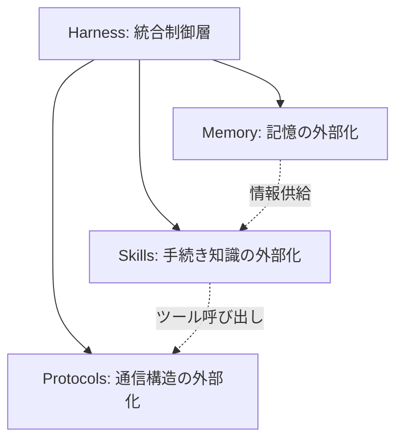

本記事は [Externalization in LLM Agents (arXiv:2604.08224)](https://arxiv.org/abs/2604.08224) の解説記事です。

## 論文概要（Abstract）

Zhou et al.（2026）は、LLMエージェントの能力拡張を**外部化（Externalization）**という統一的概念で整理したサーベイ論文を発表した。著者らは150本以上の先行研究を横断的にレビューし、外部化を**Memory（記憶）・Skills（手続き知識）・Protocols（通信構造）・Harness（統合制御）**の4次元で分類する体系を提案している。本サーベイは個別の技術を孤立的に扱うのではなく、認知科学の理論的基盤に基づいて統一フレームワークを構築した点に特徴がある。

この記事は [Zenn記事: LLMエージェントの外部化設計：Memory・Skills・Protocols・Harnessの統一的理解](https://zenn.dev/0h_n0/articles/73bdc5dd332f59) の深掘りです。

## 情報源

- **arXiv ID**: 2604.08224
- **URL**: [https://arxiv.org/abs/2604.08224](https://arxiv.org/abs/2604.08224)
- **著者**: Zhou et al.
- **発表年**: 2026年4月
- **分野**: cs.AI, cs.CL

## 背景と動機（Background & Motivation）

2020年代前半、LLMの能力向上は主にモデル重みの改善（パラメトリック知識の拡充）によって実現されてきた。しかし2023年以降、エージェントの実用化が進む中で、モデル自体の性能だけでは解決できない問題が顕在化した。具体例として以下が挙げられる。

- **長期記憶の欠如**: コンテキストウィンドウの有限性により、セッションをまたぐ情報保持ができない
- **手続き知識の非効率な再発明**: 同じワークフローをタスクごとにゼロから生成する必要がある
- **ツール連携の断片化**: エージェントごとに独自のツール接続方式が乱立している
- **品質制御の困難**: エージェントの出力を体系的に検証・改善する仕組みが不足している

著者らは認知科学者Donald Normanの「認知的アーティファクト」理論（1991）を理論的基盤として採用し、外部構造が「困難なタスクを、モデルがより確実に解ける形に変換する」という枠組みでこれらの課題を統一的に整理している。この理論的根拠が、単なる技術カタログではなく体系的な分類を可能にしている。

## 主要な貢献（Key Contributions）

著者らが主張する貢献は以下の3点である（論文Section 1より）。

- **貢献1**: 外部化を統一概念とした4次元分類体系（Memory / Skills / Protocols / Harness）の提案
- **貢献2**: 150本以上の先行研究の体系的分類と、各次元における進化段階の整理
- **貢献3**: パラメトリック知識と外部化のトレードオフ分析および未解決課題の特定

## 技術的詳細（Technical Details）

### 外部化の形式的定義

著者らは外部化を以下のように概念的に定義している。エージェントの全体的な能力 $C$ は、パラメトリック能力 $C_p$（モデル重み）と外部化された能力 $C_e$（ランタイム構造）の組み合わせで決まる。

$$
C_{\text{agent}} = f(C_p, C_e)
$$

ここで、

- $C_p$: パラメトリック能力（モデルの重みに格納された知識・推論能力）
- $C_e$: 外部化された能力（Memory、Skills、Protocols、Harnessの構造に格納）
- $f$: 統合関数（Harnessが担う役割）

この定式化により、エージェントの性能向上は $C_p$ の改善（モデル学習）だけでなく $C_e$ の設計（外部化エンジニアリング）によっても実現可能であることが明確になる。

### 4次元フレームワーク

著者らが提案する4次元の関係性は以下の構造である。Harnessが他の3次元を統合する上位レイヤーとして機能する。

各次元は独立ではなく相互依存しており、例えばSkillの実行にはMemoryからのコンテキスト供給が必要であり、外部ツールの呼び出しにはProtocolsが介在する。

### Memory外部化の4段階進化

著者らはMemory外部化の進化を以下の4段階に整理している（論文Section 3より）。

**第1段階: モノリシックコンテキスト（2020-2022）** — すべての情報をプロンプトに含める方式。実装が単純だが、コンテキストウィンドウの容量制限に束縛される。

**第2段階: コンテキスト＋外部ストレージ（2023）** — RAGに代表される方式。ベクトルストアや構造化DBに長期情報を格納し、検索パイプラインで関連情報を各ステップに注入する。著者らによれば、2026年時点の本番エージェントの大半がこの段階にあるとされる。

**第3段階: 階層的メモリ管理（2023-2024）** — MemGPT（Packer et al., 2023）が代表例。LLM自身がメモリ管理関数を呼び出し、ホット/コールドストレージ間でデータを能動的に移動する。OSのページング機構に着想を得た設計である。

**第4段階: 適応型メモリ（2025-）** — MemRL（強化学習による検索最適化）やGAM（Mixture-of-Experts による動的ルーティング）など、メモリアクセスパターン自体を学習する仕組みが出現している段階である。

著者らはまた、メモリを4種類に分類している。Working Memory（現在のタスク状態、セッション内）、Episodic Memory（過去の実行履歴、永続）、Semantic Memory（ドメイン知識、永続）、Personalized Memory（ユーザー固有情報、永続）である。この分類は認知科学における記憶システムの分類（短期記憶、エピソード記憶、意味記憶、自伝的記憶）に対応している。

### Skill外部化の3段階

著者らはSkillをToolの上位概念として定義している。Toolが単一の関数呼び出し（例: `get_weather(city="Tokyo")`）であるのに対し、Skillは手順書・参考資料・制約・メタデータを含む複数ステップの手順パッケージである。

**第1段階: アトミック実行プリミティブ** — Function Calling（2023年〜）に代表される単一関数呼び出し。

**第2段階: 大規模プリミティブ選択** — 数百のToolから適切なものを選択する段階。埋め込みベースの検索やカテゴリフィルタリングが必要になる。

**第3段階: パッケージ化されたSkill** — 手続き的知識をフォルダ単位でまとめ、発見・ロード・合成が可能な形にパッケージ化する段階。Skillの獲得経路として、人間による記述（Authored）、成功軌跡からの蒸留（Distilled）、試行錯誤での発見（Discovered）、既存Skillの合成（Composed）の4経路が整理されている。

著者らは、Li（2026）の研究（arXiv 2602.12430）を引用し、Skillライブラリが一定規模を超えると選択精度が急激に低下する「相転移」現象の存在を指摘している。この問題は、外部化されたSkillが増加するほど検索空間が拡大し、結果として正しいSkillの選択が困難になることを意味する。

### Communication外部化（Protocols）

著者らはAgent間通信を3つのレイヤーに分類している。

| レイヤー | 通信対象 | 代表的プロトコル |
|---|---|---|
| Agent-Tool | エージェント → ツール/API | MCP（Anthropic, 2024） |
| Agent-Agent | エージェント → エージェント | A2A（Google, 2025） |
| Agent-User | エージェント → 人間 | Approval Gates、HITL |

**MCP（Model Context Protocol）** はJSON-RPC 2.0ベースのクライアント-サーバー型プロトコルであり、Resources（読み取り専用データ）、Tools（副作用を持つアクション）、Prompts（テンプレート）、Sampling（サーバー→LLMリバースコール）の4機能を提供する。2026年のロードマップではステートレス化への移行が検討されている。

**A2A（Agent-to-Agent Protocol）** はGoogleが2025年4月に策定しLinux Foundationに寄贈したプロトコルで、Agent Card（`/.well-known/agent.json`）による発見メカニズムとタスクライフサイクル管理（working → input-required → completed/failed/canceled/rejected）を内蔵する。著者らは、MCPが「手を使う」プロトコル（ツール操作）、A2Aが「他者と協力する」プロトコル（タスク委譲）であり、実運用では両方の組み合わせが必要だと整理している。

### Harness Engineering

著者らはMartin Fowlerの定義「AIエージェントからモデルを除いたすべて」をHarnessの定義として採用し、6つの設計次元を提示している。Agent Loop & Control Flow（制御フロー）、Sandboxing（実行環境隔離）、Human Oversight（人間の介入ポイント）、Observability（可視化）、Configuration & Policy（ガバナンス）、Context Budget（トークン配分管理）である。

制御メカニズムはGuides（フィードフォワード制御、実行前の予防）とSensors（フィードバック制御、実行後の検査・修正）に大別される。著者らは、安価で高速な計算的制御（リンター、型チェッカー）を先に配置し、高コストな推論的制御（LLMによるレビュー）を後段に配置する「Shift Left」の原則を推奨している。

## パラメトリック知識と外部化のトレードオフ

著者らは、モデル重みに能力を持たせるか外部構造に委ねるかの判断を4つの評価軸で整理している（論文Section 7より）。

| 評価軸 | パラメトリック（重み） | 外部化 |
|---|---|---|
| 更新速度 | 再学習が必要（数時間〜数日） | 即時更新可能 |
| 再利用性 | モデルに紐づく | エージェント間で共有可能 |
| 監査可能性 | 不透明（数十億パラメータ内） | 検査可能なアーティファクト |
| レイテンシ | 追加コストなし | 検索・ロードのオーバーヘッド |

著者らの整理に基づけば、頻繁に変わる知識（APIバージョン、組織ルール）や監査が必要な判断（コンプライアンスルール）は外部化が適しており、安定した汎用知識（言語の文法、一般的パターン）や低レイテンシが必須の処理はパラメトリックに保持することが適切である。ただし著者らは、この境界はモデル能力の向上に伴い変化し続けるとも指摘している。

## 実装のポイント（Implementation）

本論文はサーベイであり直接的な実装物を含まないが、著者らは各次元について以下の設計チェックリストを提示している。

- **Memory設計**: 「コンテキストウィンドウが十分だから外部メモリ不要」は危険。Liu et al.（2024）が報告した「Lost in the Middle」現象（長いコンテキスト中間部の利用精度低下）により、コンテキスト拡大は検索の代替にならない
- **Skill設計**: Skillの粒度設計が最大の実装課題。細かすぎると組み合わせ爆発、粗すぎると再利用不可
- **Protocol設計**: MCP（ツール接続）とA2A（タスク委譲）は補完関係にあり、用途に応じた使い分けが必要
- **Harness設計**: 計算的センサー（リンター等）を推論的センサー（LLMレビュー）より先に配置する「Shift Left」が品質とコストの両面で有効

## 実運用への応用（Practical Applications）

本サーベイのフレームワークは、エージェントシステムの設計レビューに直接活用できる。具体的には、自身のエージェントシステムを4次元で棚卸しし、どの次元が弱いかを特定する診断ツールとして機能する。

OpenAIの報告によれば、Harness Engineeringを適用したチームが3名のエンジニアで5ヶ月間に約100万行のコード・1,500のPRを生成し、エンジニア1人あたり1日平均約3.5PRの生産性を実現している（出典: [OpenAI Harness Engineering](https://openai.com/index/harness-engineering/)）。一方、Datadogの調査（2026年4月）では、本番環境のAIモデルリクエストの約5%が失敗し、うち約60%がレート制限エラーに起因すると報告されている（出典: [Datadog State of AI Engineering](https://www.datadoghq.com/state-of-ai-engineering/)）。これらのデータは、Harnessの設計品質が生産性と運用安定性の双方に影響することを示唆している。

## 関連研究（Related Work）

- **CoALA（Sumers et al., 2024）**: 認知科学のACT-R/Soarモデルに基づきLLMエージェントを「Memory × Action Space × Decision Procedure」の3軸で分類。本サーベイはCoALAの分類をProtocols次元で拡張したものと位置付けられる
- **MemGPT（Packer et al., 2023）**: LLMをOS的に捉えた階層型メモリ管理。本サーベイのMemory外部化第3段階に該当
- **Agent Skills（Li, 2026, arXiv 2602.12430）**: Skillのライフサイクルと相転移現象の分析。本サーベイのSkills次元の主要参考文献
- **Martin Fowler - Harness Engineering（2026）**: Guide/Sensorパターンの実践的整理。本サーベイのHarness次元の概念基盤

## まとめと今後の展望

Zhou et al.（2026）は、LLMエージェントの外部化を4次元フレームワークとして統一的に整理した。この体系は個別技術の羅列ではなく、認知科学に基づく原理的な分類を提供している点に学術的意義がある。

著者らが指摘する未解決課題として、外部化の効果を定量測定する標準メトリクスの未成熟、外部化アーティファクトの増加に伴うガバナンスの複雑化、モデル能力向上に伴う外部化境界の変動が挙げられる。特に「Harness自体が経験から自己最適化する」自己進化型システムの実現が今後の研究方向として提示されている。

実務的には、このフレームワークを自身のエージェントシステムの設計レビューに活用し、4次元のうちどの軸が弱点であるかを特定することが推奨される。

## 参考文献

- **arXiv**: [https://arxiv.org/abs/2604.08224](https://arxiv.org/abs/2604.08224)
- **Related Zenn article**: [https://zenn.dev/0h_n0/articles/73bdc5dd332f59](https://zenn.dev/0h_n0/articles/73bdc5dd332f59)
- **OpenAI Harness Engineering**: [https://openai.com/index/harness-engineering/](https://openai.com/index/harness-engineering/)
- **Martin Fowler - Harness Engineering**: [https://martinfowler.com/articles/harness-engineering.html](https://martinfowler.com/articles/harness-engineering.html)
- **CoALA (Sumers et al., 2024)**: [https://arxiv.org/abs/2309.02427](https://arxiv.org/abs/2309.02427)
- **Agent Skills (Li, 2026)**: [https://arxiv.org/abs/2602.12430](https://arxiv.org/abs/2602.12430)
