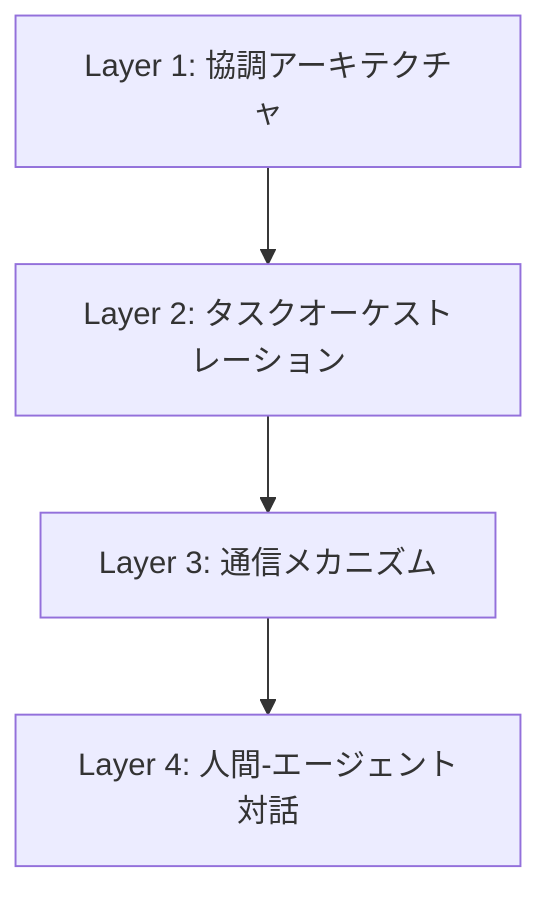

本記事は [arXiv:2604.18133](https://arxiv.org/abs/2604.18133) の解説記事です。

## 論文概要（Abstract）

Wang et al.（2026）は、マルチエージェントシステム（MAS）を古典的パラダイムからLLM（大規模言語モデル）駆動のパラダイムまで包括的にサーベイした論文である。古典的MASの閉ループ協調フレームワーク（知覚・通信・意思決定・制御の4次元）と、LLMベースMASの5コアモジュール（役割定義・知覚・計画・記憶・実行）を体系的に比較し、両者の相補的な関係性を明らかにしている。IEEE/CAA Journal of Automatica Sinicaに採択された本論文は、200件超の先行研究を横断的にレビューし、通信プロトコル標準化（MCP・A2A）や共進化フレームワークなど6つの今後の研究方向を提示している。

この記事は [Zenn記事: マルチエージェントシステムの進化：古典的MASからLLMベースMASへの技術比較](https://zenn.dev/0h_n0/articles/3848dd01781b58) の深掘りです。

## 情報源

- **arXiv ID**: 2604.18133
- **URL**: [https://arxiv.org/abs/2604.18133](https://arxiv.org/abs/2604.18133)
- **著者**: Wang et al.
- **発表年**: 2026
- **採択先**: IEEE/CAA Journal of Automatica Sinica
- **分野**: cs.AI, cs.MA, cs.LG

## 背景と動機（Background & Motivation）

マルチエージェントシステム（MAS）は1990年代の分散人工知能（DAI）研究に端を発し、ロボット群制御、交通管理、エネルギーグリッド最適化など多様な領域で実用化されてきた。しかし、従来の古典的MAS（CMAS）は低次元の構造化データに特化しており、テキスト・画像・音声といった非構造化データの処理や、未知のタスクへのゼロショット汎化には根本的な限界があった。

2023年以降、GPT-4やClaudeなどの大規模言語モデルの登場により、MASは「状態変数の交換」から「意味レベルの推論」へとパラダイムシフトを迎えている。Gartner調査ではMAS関連の問い合わせ数が2024年Q1から2025年Q2にかけて1,445%増加したと報告されている（Wang et al., Section 1より）。著者らはこの急速な変化の中で、古典的MASとLLMベースMASの両方を統一的に整理するフレームワークが不在であることを課題として指摘し、本サーベイを執筆した。

## 主要な貢献（Key Contributions）

- **貢献1**: 古典的MASを「知覚・通信・意思決定・制御」の4次元閉ループフレームワークで体系化し、各次元のアルゴリズム・設計パターンを網羅的に分類した
- **貢献2**: LLMベースMASを「役割定義・知覚・計画・記憶・実行」の5コアモジュールで構造化し、CMASとの対応関係を明確にした
- **貢献3**: 4層インタラクション階層（協調アーキテクチャ→タスクオーケストレーション→通信メカニズム→人間-エージェント対話）を提案し、MAS設計の実務的ガイドラインを提供した
- **貢献4**: MCP・A2A・ANPなど2025-2026年の通信プロトコル標準化動向を整理し、共進化フレームワークなど6つの研究方向を提示した

## 技術的詳細（Technical Details）

### 古典的MASの4次元閉ループフレームワーク

著者らは古典的MASを以下の4次元で構造化している。

#### 次元1: 知覚（Perception）

複数エージェントがセンサーデータを統合する方式として、Early Fusion（生データ統合）、Late Fusion（抽象出力統合）、Intermediate Fusion（特徴量統合）の3段階を整理している。著者らによると、Intermediate Fusionが現在の主流パラダイムであり、通信帯域と情報精度のトレードオフを最適化する。

#### 次元2: 通信（Communication）

通信設計は3つの視点で分析される。

**トポロジ**: 完全接続型はエージェント数 $n$ に対して $O(n^2)$ の通信コストが発生する。スパースなトポロジでは通信コストは下がるが、合意収束に時間を要する。

**頻度**: 固定間隔通信とイベントトリガ型通信に大別される。イベントトリガ型通信は、エージェントの状態変化 $\|x_i(t) - x_i(t_k)\|$ が閾値 $\delta_i$ を超えた場合にのみ送信する方式で、以下の条件で定式化される：

$$
f_i(t) = \begin{cases} 1 & \text{if } \|x_i(t) - x_i(t_k)\| \geq \delta_i \\ 0 & \text{otherwise} \end{cases}
$$

ここで、$x_i(t)$ はエージェント $i$ の時刻 $t$ における状態、$t_k$ は直前の送信時刻、$\delta_i$ はエージェント固有の閾値である。

**コンテンツ**: 明示的通信（直接メッセージ交換）と暗黙的通信（環境を介した間接的情報共有、スティグマジー）に分かれる。

#### 次元3: 意思決定（Decision-Making）

**モデルベース**: ゲーム理論や進化的最適化による解析的導出。環境モデルが既知の場合にナッシュ均衡やパレート最適解を保証できる。

**学習ベース**: マルチエージェント強化学習（MARL）。代表的な定式化は分散型部分観測マルコフ決定過程（Dec-POMDP）である：

$$
\langle \mathcal{I}, \mathcal{S}, \{\mathcal{A}_i\}, \mathcal{T}, \{R_i\}, \{\Omega_i\}, O, \gamma \rangle
$$

ここで、$\mathcal{I}$ はエージェント集合、$\mathcal{S}$ は状態空間、$\mathcal{A}_i$ はエージェント $i$ の行動空間、$\mathcal{T}: \mathcal{S} \times \mathcal{A} \to \Delta(\mathcal{S})$ は遷移関数、$R_i$ は報酬関数、$\Omega_i$ は観測空間、$O$ は観測関数、$\gamma$ は割引率である。

著者らは、MARLの課題として**サンプル効率・安定性・解釈可能性・汎化性能**の4点を指摘している。特に、エージェント数の増加に伴う行動空間の指数的爆発（$|\mathcal{A}| = \prod_i |\mathcal{A}_i|$）が実用上のボトルネックとなる。

#### 次元4: 制御（Control）

**合意制御**: 全エージェントの状態を漸近的に一致させる分散戦略。線形合意プロトコルは以下で定式化される：

$$
\dot{x}_i(t) = \sum_{j \in \mathcal{N}_i} a_{ij}(x_j(t) - x_i(t))
$$

ここで、$\mathcal{N}_i$ はエージェント $i$ の近傍集合、$a_{ij}$ は隣接行列の要素である。

**隊列制御**: リーダー・フォロワー型、仮想構造型、行動ベース型、学習ベース型の4アプローチが存在する。

### LLMベースMASの5コアモジュール

著者らはLMASを以下の5モジュールで構造化している。

#### モジュール1: 役割定義（Role Definition）

- **手動割当**: プロンプトテンプレートによる事前定義（ChatDev、MetaGPT）
- **タスク適応型**: メタエージェントによる動的生成（ADAS、Virtual Lab）

#### モジュール2: 知覚（Perception）の3層階層

CMASのセンサーフュージョンとは質的に異なる3層構造を著者らは提示している：
- **意味層（Semantic）**: 生入力を言語的・記号的表現に変換
- **状況層（Situational）**: コンテキスト依存の解釈（RoCoフレームワーク等）
- **認知層（Cognitive）**: 将来予測を含むワールドモデル

#### モジュール3: 計画（Planning）

Chain-of-Thought（CoT）プロンプティングによる構造化推論と、マルチエージェント批判メカニズムによるフィードバック駆動最適化を組み合わせる。著者らは計画モジュールの性能が「推論チェーンの深さ」と「批判エージェントの多様性」に依存すると分析している。

#### モジュール4: 記憶（Memory）

- **短期記憶**: タスク内コンテキスト（ReActの推論トレース等）
- **長期記憶**: タスク間知識（Expelの経験的軌跡蓄積等）

記憶モジュールの設計では、コンテキストウィンドウの制約（現在のLLMで128K〜200Kトークン）と検索精度のトレードオフが中心的課題である。

#### モジュール5: 実行（Execution）

言語生成に加え、ツール統合（HuggingGPT等）と身体的行動の分解が可能。著者らはMCPプロトコルがツール統合の標準化に寄与していると述べている。

### 4層インタラクション階層

著者らが本サーベイで提案する実務的フレームワークは以下の4層で構成される。



**Layer 1 — 協調アーキテクチャ**: 協調型（共有グローバル目標）、競争型（マルチエージェント議論による品質検証）、ハイブリッド型（動的切替）の3パラダイムから選択する。

**Layer 2 — タスクオーケストレーション**: 構造化ワークフロー（DAGベースのタスク分解、ReSoフレームワーク）と自律的自己組織化（MAS2の自己生成・自己構成・自己修正）に大別される。

**Layer 3 — 通信プロトコル**: MCP（エージェント-ツール通信、Anthropic発、AAIF標準化）、A2A（エージェント間通信、Google発、AAIF標準化）、ANP（組織横断通信、DIDベース）の3プロトコルを著者らは整理している。

**Layer 4 — 人間-エージェント対話**: 情報提供（ドメイン知識供給）、監督的ガバナンス（決定権限のオーバーライド）、反復フィードバック（評価・修正・選好推定）の3段階で設計する。

## 実験結果（Results）

本論文はサーベイであり独自の実験は含まないが、著者らは既存研究の定量的比較を以下のように整理している。

### CMASとLMASの定量的比較

| 比較軸 | CMAS | LMAS |
|--------|------|------|
| 知覚入力 | 低次元・構造化・単一モダリティ | 非構造化マルチモーダル |
| 通信帯域 | コンパクト・記号的・低帯域 | 自然言語・高帯域コスト |
| 応答周波数 | 高頻度リアルタイム（ms単位） | 低頻度（数百ms〜数秒） |
| 汎化性能 | タスク固有の再設計が必要 | ゼロ/少数ショット転移可能 |
| 推論コスト | 低（組み込みプロセッサで動作） | 高（1タスク$0.08〜$0.50） |

### スケーリング特性

著者らが引用するMACNETの研究では、エージェント数増加に伴う性能向上がロジスティック成長に従うことが報告されている。小規模（10エージェント未満）では協調スケーリング則が成立するが、大規模（数万〜数百万）では自然言語通信の帯域コストがボトルネックとなる。OASISの実験では100万エージェントによる社会シミュレーションが実現されているが、メッセージ剪定やプロトコル最適化なしにはトークンコストが実用的でないレベルに達すると著者らは指摘している。

## 実運用への応用（Practical Applications）

### Brain-Cerebellumモデル

著者らが特に注目している設計パターンが**Brain-Cerebellumモデル**である。LLMが高レベルの計画（Brain）を担当し、マルチエージェント強化学習が低レベルの制御（Cerebellum）を担当する階層的アーキテクチャである。この設計は、LLMの推論レイテンシ（数百ms〜数秒）がリアルタイム制御のボトルネックとなる問題を解消する。

```python
from dataclasses import dataclass
from typing import Protocol

@dataclass
class HighLevelPlan:
    goal: str
    subgoals: list[str]
    constraints: list[str]

@dataclass
class LowLevelAction:
    agent_id: int
    action_vector: list[float]
    timestamp: float

class BrainModule(Protocol):
    """LLMベースの高レベル計画モジュール"""
    async def plan(self, observation: str, memory: list[str]) -> HighLevelPlan: ...

class CerebellumModule(Protocol):
    """MARLベースの低レベル制御モジュール"""
    def act(self, state: list[float], subgoal: str) -> LowLevelAction: ...

class BrainCerebellumAgent:
    def __init__(self, brain: BrainModule, cerebellum: CerebellumModule):
        self.brain = brain
        self.cerebellum = cerebellum
        self.current_plan: HighLevelPlan | None = None

    async def step(self, observation: str, state: list[float], memory: list[str]) -> LowLevelAction:
        if self.current_plan is None or self._plan_completed():
            self.current_plan = await self.brain.plan(observation, memory)
        current_subgoal = self.current_plan.subgoals[0]
        return self.cerebellum.act(state, current_subgoal)

    def _plan_completed(self) -> bool:
        return len(self.current_plan.subgoals) == 0 if self.current_plan else True
```

### 通信プロトコル選択の判断基準

著者らの分析に基づくと、MCP（2026年3月時点でSDKダウンロード月間9,700万回）はエージェント-ツール接続の事実上の標準となっている。A2A（150以上の組織が本番採用）はエージェント間のタスク委譲に特化している。実務では両プロトコルを組み合わせ、MCPでツールアクセスを統一し、A2Aでエージェント間協調を行う**ハイブリッドパターン**が推奨される。

## 関連研究（Related Work）

- **Guo et al. (2024)**: LLMマルチエージェントに特化したサーベイ。環境・プロファイル・コミュニケーション・能力の4軸で分類。本論文はこれを古典的MASまで拡張した上位概念として位置づけられる
- **Talebirad & Nadiri (2023)**: LLMベースマルチエージェントの初期サーベイ。本論文はより最新の通信プロトコル標準化やスケーリング研究をカバーしている
- **Xi et al. (2023)**: LLMベースエージェントの一般的サーベイ。本論文はマルチエージェント間の「協調・競争・通信」に焦点を絞っている点で差別化される

## まとめと今後の展望

Wang et al.のサーベイは、古典的MASとLLMベースMASを統一的に俯瞰する2026年時点の包括的な参照文献として位置づけられる。著者らが提示する6つの研究方向のうち、特に以下が実務に直結する：

1. **共進化フレームワーク**: CMASの理論的保証（制御安定性、合意収束）とLMASの意味的推論を統合する共有知覚-行動抽象化層の構築
2. **デバイス-エッジ-クラウド協調推論**: 異種リソースのモデリングと非同期・帯域制限通信の設計。EcoAgentやRoboOSの「クラウドで計画、デバイスで実行」パターンが有望
3. **システムレベルの安全性**: 個々のエージェントを超えた価値整合、権限境界設計、監査可能性の確保

著者らは「LLMベースMASは古典的MASの代替ではなく相補的拡張である」と結論づけており、この視点が今後のMAS設計における重要な指針となる。

## 参考文献

- **arXiv**: [https://arxiv.org/abs/2604.18133](https://arxiv.org/abs/2604.18133)
- **Related Zenn article**: [https://zenn.dev/0h_n0/articles/3848dd01781b58](https://zenn.dev/0h_n0/articles/3848dd01781b58)
- **Guo et al. (2024)**: [https://arxiv.org/abs/2402.01680](https://arxiv.org/abs/2402.01680)
- **Xi et al. (2023)**: [https://arxiv.org/abs/2309.07864](https://arxiv.org/abs/2309.07864)
