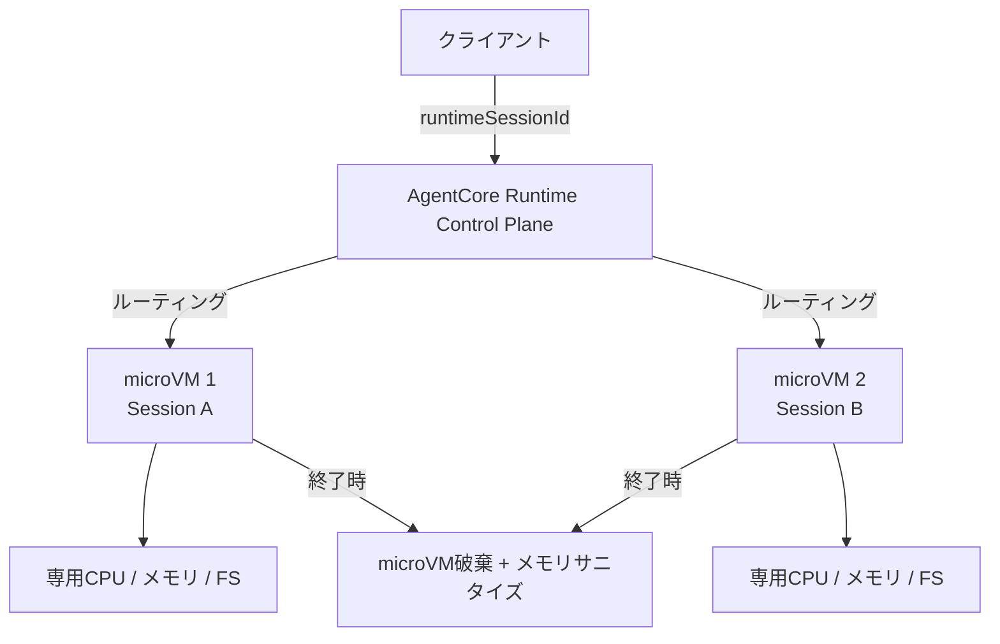

本記事は [Securely launch and scale your agents and tools on Amazon Bedrock AgentCore Runtime（AWS Machine Learning Blog、2025年8月13日公開）](https://aws.amazon.com/blogs/machine-learning/securely-launch-and-scale-your-agents-and-tools-on-amazon-bedrock-agentcore-runtime/) の解説記事です。

## ブログ概要（Summary）

AWS Machine Learning Blogで公開されたこの記事は、Amazon Bedrock AgentCore Runtimeのコアアーキテクチャを解説するものである。各ユーザーセッションを専用microVM上で実行するセッション分離モデル、Active/Idle/Terminatedの3状態ライフサイクル、I/O wait中のCPU無課金による従量課金モデルが主要な技術的論点として扱われている。著者らは、従来のリソース事前確保型と比較して約70%のCPUコスト削減が可能であると報告している。

この記事は [Zenn記事: Bedrock AgentCore Runtimeで8時間連続セッションと状態永続化を実装する](https://zenn.dev/0h_n0/articles/56ef5e7c7fa840) の深掘りです。

## 情報源

- **種別**: 企業テックブログ（AWS Machine Learning Blog）
- **URL**: [https://aws.amazon.com/blogs/machine-learning/securely-launch-and-scale-your-agents-and-tools-on-amazon-bedrock-agentcore-runtime/](https://aws.amazon.com/blogs/machine-learning/securely-launch-and-scale-your-agents-and-tools-on-amazon-bedrock-agentcore-runtime/)
- **組織**: Amazon Web Services — Shreyas Subramanian, Kosti Vasilakakis, Vivek Bhadauria
- **発表日**: 2025年8月13日

## 技術的背景（Technical Background）

マルチテナント環境でAIエージェントを運用する場合、テナント間のデータ分離と実行環境のセキュリティ確保が主要な課題となる。従来のコンテナベースのアプローチでは、共有カーネルを介した情報漏洩リスクが指摘されてきた。

AgentCore Runtimeは、この課題に対してmicroVMレベルの分離を採用している。AWSではFirecrackerをベースとしたmicroVM技術がLambdaやFargateで実績を持つが、AgentCore Runtimeはこれをエージェント固有のワークロード（長時間セッション、状態保持、ツール実行）向けに最適化した実行基盤として提供している。

学術的には、LLMエージェントの実行環境分離は比較的新しいトピックであり、AIOS（Mei et al., 2024）やOpenHands（Wang et al., 2024）のようなエージェントOS・プラットフォームの研究と並行して、クラウドベンダーによる商用実装が進んでいる状況にある。

## 実装アーキテクチャ（Architecture）

### セッション分離の仕組み

ブログによると、AgentCore Runtimeでは「各セッションが専用の仮想マシンを受け取り、CPU、メモリ、ファイルシステムのリソースが隔離される」と説明されている。セッション終了時にはmicroVM全体が破棄され、メモリがサニタイズされるため、あるユーザーのエージェントが別ユーザーのデータにアクセスする経路が構造的に排除される。



### セッションライフサイクル

ブログでは、セッションが3つの状態を持つと説明されている。

| 状態 | 説明 | 課金対象 |
|------|------|----------|
| **Active** | リクエスト処理中またはバックグラウンドタスク実行中 | CPU + メモリ |
| **Idle** | リクエスト待機中。次の呼び出しに即時応答可能 | メモリのみ |
| **Terminated** | microVM破棄済み。新規呼び出しで再プロビジョニング | なし |

デフォルトでは、アイドル状態が15分続くとTerminatedに遷移し、セッション全体の最大生存時間は8時間に設定されている。これらの値は`lifecycleConfiguration`で調整可能であり、ブログでは業務パターンに応じたチューニングが推奨されている。

### アイデンティティと認証

ブログでは、AgentCore Runtimeに埋め込みのアイデンティティシステムが実装されていると報告されている。

- **IAM SigV4認証**: AWSリソースへのアクセス
- **OAuth/JWTベアラートークン**: エンタープライズIDプロバイダとの連携
- **トークンの暗号学的バインディング**: 「ユーザー1のGoogleトークンは、アプリケーションロジックのエラーに関係なく、ユーザー2のリクエスト処理時にアクセスされることはない」とブログに明記されている

### フレームワーク非依存

ブログによると、AgentCore Runtimeはフレームワーク非依存の設計であり、LangGraph、CrewAI、Strandsなどの主要フレームワークや、複数のLLMプロバイダ（Claude、GPT、Gemini）をサポートしている。実装に必要なコード変更は最小限で、以下の4ステップで統合できると説明されている。

1. `BedrockAgentCoreApp`のインポート
2. アプリインスタンスの初期化
3. `@app.entrypoint`デコレータの追加
4. `app.run()`の実行

### 技術仕様

ブログに記載されている主要な技術仕様は以下の通りである。

| 項目 | 値 |
|------|-----|
| 最大ペイロードサイズ | 100MB / リクエスト |
| 最大セッション時間 | 8時間 |
| ストリーミング | ネイティブ対応 |
| サポートモダリティ | テキスト、画像、ドキュメント、音声 |

## パフォーマンス最適化（Performance）

### I/O wait無課金モデル

ブログにおける最も注目すべき技術的主張の一つは、I/O wait中のCPU課金が発生しない点である。ブログでは「CPUリソースやGBメモリの事前確保は不要であり、I/O wait期間中のCPUリソースに対して課金されない」と説明されている。

対話型エージェントでは、ユーザーの入力待ちや外部API応答待ちがセッション時間の大部分を占める。ブログの試算では、1セッション60秒のうちアクティブCPU使用率が30%のケースにおいて、以下のコスト構造が示されている。

| 項目 | 値 |
|------|-----|
| 1セッションあたりCPUコスト | $0.0004475 |
| 1セッションあたりメモリコスト | $0.000315 |
| 日次セッション数 | 10,000 |
| CPU課金削減率 | 約70%（従来型比） |

月間1,000万リクエストのカスタマーサポートエージェントにおいて、月額約$7,235という試算がブログに掲載されている。

### コスト構造の数式表現

AgentCore Runtimeのセッションコストは以下のように定式化できる。

$$
C_{\text{session}} = C_{\text{CPU}} \cdot t_{\text{active}} + C_{\text{mem}} \cdot t_{\text{total}}
$$

ここで、
- $C_{\text{CPU}}$: CPU単価（$0.0895 / vCPU時間）
- $C_{\text{mem}}$: メモリ単価（$0.00945 / GB時間）
- $t_{\text{active}}$: アクティブCPU時間（I/O wait除外）
- $t_{\text{total}}$: セッション総時間

従来型の場合は$t_{\text{active}}$の代わりに$t_{\text{total}}$がCPU課金対象となるため、I/O waitの割合を$r_{\text{io}}$とすると、

$$
\text{削減率} = r_{\text{io}} \cdot \frac{C_{\text{CPU}}}{C_{\text{CPU}} + C_{\text{mem}} / r_{\text{active}}}
$$

ブログの例（$r_{\text{io}} = 0.7$）では、CPU課金が全体の約62%を占めるため、全体コストへの影響も大きいと報告されている。

### トレードオフ

ブログでは明示的に述べられていないが、microVMベースのアーキテクチャには以下のトレードオフが存在する。

- **コールドスタートレイテンシ**: Terminated状態からの復帰時、新規microVMのプロビジョニングに数秒〜十数秒を要する
- **メモリオーバーヘッド**: microVM単位の分離は、プロセス分離やコンテナ分離と比較してメモリ消費が大きい
- **セッション数のスケーリング**: 各セッションが専用microVMを占有するため、同時セッション数にはホストリソースの上限がある

## Production Deployment Guide

### AWS実装パターン（コスト最適化重視）

AgentCore Runtimeは自身がマネージドサービスであるため、ここでは呼び出し側のバックエンドとAgentCore Runtimeとの統合パターンを示す。

**トラフィック量別の推奨構成**:

| 規模 | 月間リクエスト | 推奨構成 | 月額コスト目安 | 主要サービス |
|------|--------------|---------|-------------|------------|
| **Small** | ~3,000 (100/日) | Serverless | $80-200 | Lambda + AgentCore Runtime + DynamoDB |
| **Medium** | ~30,000 (1,000/日) | Hybrid | $500-1,500 | Lambda + ECS Fargate + AgentCore Runtime |
| **Large** | 300,000+ (10,000/日) | Container | $5,000-10,000 | EKS + AgentCore Runtime + ElastiCache |

**コスト試算の注意事項**: 上記は2026年4月時点のAWS ap-northeast-1リージョン料金に基づく概算値です。AgentCore Runtimeの料金（CPU $0.0895/vCPU時間、メモリ $0.00945/GB時間）は[公式料金ページ](https://aws.amazon.com/bedrock/agentcore/pricing/)で確認してください。

**Small構成の詳細（月額$80-200）**:
- **API Gateway**: REST API ($5/月)
- **Lambda**: セッション管理・ルーティング ($20/月)
- **AgentCore Runtime**: 100セッション/日 × 60秒active ($40-120/月)
- **DynamoDB**: セッションID管理 On-Demand ($10/月)
- **CloudWatch**: 基本監視 ($5/月)

**コスト削減テクニック**:
- `idleRuntimeSessionTimeout`を業務パターンに合わせて調整（短縮でメモリ課金削減）
- バッチ処理はBedrock Batch API活用で50%割引
- Prompt Caching有効化で入力トークンコスト30-90%削減

### Terraformインフラコード

**Small構成: Lambda + AgentCore Runtime呼び出し基盤**

```hcl
module "vpc" {
  source  = "terraform-aws-modules/vpc/aws"
  version = "~> 5.0"

  name = "agentcore-client-vpc"
  cidr = "10.0.0.0/16"
  azs  = ["ap-northeast-1a", "ap-northeast-1c"]
  private_subnets = ["10.0.1.0/24", "10.0.2.0/24"]

  enable_nat_gateway   = false
  enable_dns_hostnames = true
}

resource "aws_iam_role" "lambda_agentcore" {
  name = "lambda-agentcore-invoke-role"

  assume_role_policy = jsonencode({
    Version = "2012-10-17"
    Statement = [{
      Action = "sts:AssumeRole"
      Effect = "Allow"
      Principal = { Service = "lambda.amazonaws.com" }
    }]
  })
}

resource "aws_iam_role_policy" "agentcore_invoke" {
  role = aws_iam_role.lambda_agentcore.id

  policy = jsonencode({
    Version = "2012-10-17"
    Statement = [{
      Effect = "Allow"
      Action = [
        "bedrock-agentcore:InvokeAgentRuntime",
        "bedrock-agentcore:StopRuntimeSession"
      ]
      Resource = "arn:aws:bedrock-agentcore:ap-northeast-1:*:agent-runtime/*"
    }]
  })
}

resource "aws_lambda_function" "agentcore_proxy" {
  filename      = "lambda.zip"
  function_name = "agentcore-session-proxy"
  role          = aws_iam_role.lambda_agentcore.arn
  handler       = "index.handler"
  runtime       = "python3.12"
  timeout       = 120
  memory_size   = 512

  environment {
    variables = {
      AGENTCORE_RUNTIME_ARN = var.agentcore_runtime_arn
      SESSION_TABLE         = aws_dynamodb_table.sessions.name
    }
  }
}

resource "aws_dynamodb_table" "sessions" {
  name         = "agentcore-sessions"
  billing_mode = "PAY_PER_REQUEST"
  hash_key     = "user_id"
  range_key    = "session_id"

  attribute {
    name = "user_id"
    type = "S"
  }
  attribute {
    name = "session_id"
    type = "S"
  }

  ttl {
    attribute_name = "expire_at"
    enabled        = true
  }
}

resource "aws_cloudwatch_metric_alarm" "lambda_errors" {
  alarm_name          = "agentcore-proxy-errors"
  comparison_operator = "GreaterThanThreshold"
  evaluation_periods  = 2
  metric_name         = "Errors"
  namespace           = "AWS/Lambda"
  period              = 300
  statistic           = "Sum"
  threshold           = 5
  alarm_description   = "AgentCore呼び出しLambdaエラー検知"

  dimensions = {
    FunctionName = aws_lambda_function.agentcore_proxy.function_name
  }
}
```

### セキュリティベストプラクティス

1. **IAMロール**: 最小権限原則に従い、`bedrock-agentcore:InvokeAgentRuntime`と`bedrock-agentcore:StopRuntimeSession`のみ許可
2. **セッションID管理**: クライアント側でユーザーとセッションIDの対応を管理（AgentCore自体はこの対応を管理しない）
3. **ネットワーク**: AgentCore Runtimeは`networkMode: PUBLIC`または`VPC`を選択可能。エンタープライズ環境ではVPCモードを推奨
4. **シークレット管理**: APIキーやOAuthトークンはSecrets Managerで管理し、Lambda環境変数へのハードコード禁止

### 運用・監視設定

**CloudWatch Logs Insights クエリ**:

```sql
fields @timestamp, session_id, duration_ms, status_code
| stats avg(duration_ms) as avg_latency,
        pct(duration_ms, 95) as p95_latency,
        count() as total_requests
  by bin(5m)
| filter status_code >= 500
```

**セッション利用パターン分析**:

```python
import boto3

cloudwatch = boto3.client('cloudwatch')

cloudwatch.put_metric_alarm(
    AlarmName='agentcore-session-cold-start-rate',
    ComparisonOperator='GreaterThanThreshold',
    EvaluationPeriods=2,
    MetricName='ColdStartCount',
    Namespace='Custom/AgentCore',
    Period=3600,
    Statistic='Sum',
    Threshold=100,
    AlarmDescription='コールドスタート頻度異常（idleTimeout調整を検討）'
)
```

### コスト最適化チェックリスト

**アーキテクチャ選択**:
- [ ] ~100 req/日 → Lambda + AgentCore Runtime (Serverless)
- [ ] ~1000 req/日 → ECS Fargate + AgentCore Runtime (Hybrid)
- [ ] 10000+ req/日 → EKS + AgentCore Runtime (Container)

**AgentCore固有の最適化**:
- [ ] `idleRuntimeSessionTimeout`を業務パターンに合わせて設定
- [ ] `maxLifetime`を実際の利用時間に合わせて短縮（不要な長時間メモリ課金を防止）
- [ ] I/O waitの多いワークロードであることを確認（対話型エージェントは自然に適合）
- [ ] コールドスタート頻度をモニタリングし、idleTimeoutの最適値を導出

**LLMコスト削減**:
- [ ] Bedrock Batch API使用で50%割引（非リアルタイム処理）
- [ ] Prompt Caching有効化で30-90%削減
- [ ] モデル選択: テスト環境はHaiku、本番はSonnet
- [ ] max_tokens設定で過剰生成を防止

**監視・アラート**:
- [ ] AWS Budgets: 月額予算設定（80%で警告）
- [ ] CloudWatchアラーム: セッション数・レイテンシ・エラー率
- [ ] Cost Anomaly Detection有効化
- [ ] セッション利用パターンの週次レビュー

**リソース管理**:
- [ ] 不要なAgentCore Runtimeエンドポイントの削除
- [ ] タグ戦略: 環境別（dev/staging/prod）コスト可視化
- [ ] DynamoDBセッションテーブルのTTL設定
- [ ] CloudWatch Logsの保持期間設定（90日推奨）

## 運用での学び（Production Lessons）

ブログでは、AgentCore Runtimeの運用における以下の設計上の考慮点が示されている。

**セッションID管理の重要性**: AgentCore Runtimeはセッションアフィニティをヘッダーベースで制御するが、ユーザーとセッションIDの対応関係はクライアント側で管理する必要がある。セッションIDを指定しないリクエストは毎回新規microVMを起動するため、不要なコールドスタートと会話コンテキストの喪失につながる。

**ライフサイクル設定の段階的チューニング**: ブログの著者らは、まずデフォルト値（idleTimeout 15分、maxLifetime 8時間）で運用を開始し、CloudWatchメトリクスに基づいてチューニングすることを推奨している。コールドスタート率が高い場合はidleTimeoutを延長し、メモリコストが高い場合は短縮する。

**バージョン更新時の注意**: `update_agent_runtime`で新バージョンを作成した場合、新しいセッションから順次適用される。既存のアクティブセッションへの即時反映はされないため、全セッションへの反映には最大で現在の`maxLifetime`分の時間がかかる。

## 学術研究との関連（Academic Connection）

AgentCore Runtimeのアーキテクチャは、以下の学術研究と関連している。

- **AIOS（Mei et al., 2024, arXiv:2401.16158）**: LLMエージェントをOSプロセスとして管理するフレームワーク。AgentCore Runtimeのセッションライフサイクル管理は、AIOSのエージェントスケジューリングコンセプトの商用実装と位置づけられる
- **MemGPT（Packer et al., 2023, arXiv:2403.12881）**: エージェントの長期セッション管理における仮想メモリモデル。AgentCore RuntimeのSession Storage機能は、MemGPTのディスクページングに相当するファイルシステムレベルの永続化を提供する
- **OpenHands（Wang et al., 2024, arXiv:2405.04798）**: Dockerベースのサンドボックス実行環境。AgentCore Runtimeはこれをmicrovmレベルに強化し、マルチテナント環境でのセキュリティ要件に対応している

## まとめと実践への示唆

AWS公式ブログで解説されたAgentCore Runtimeのアーキテクチャは、microVM分離によるセキュリティ、3状態ライフサイクルによる柔軟なセッション管理、I/O wait無課金による対話型ワークロードへのコスト最適化という3つの柱で構成されている。著者らの試算では、カスタマーサポートエージェント（月間1,000万リクエスト）において月額約$7,235、従来型比70%のCPU課金削減が報告されている。

実務への示唆として、まずデフォルト設定で運用を開始し、CloudWatchメトリクスに基づく段階的チューニングが推奨される。セッションID管理はクライアント側の責務であり、DynamoDB等による対応表の設計が初期段階で必要となる。

## 参考文献

- **Blog URL**: [Securely launch and scale your agents and tools on Amazon Bedrock AgentCore Runtime](https://aws.amazon.com/blogs/machine-learning/securely-launch-and-scale-your-agents-and-tools-on-amazon-bedrock-agentcore-runtime/)
- **AgentCore Documentation**: [https://docs.aws.amazon.com/bedrock-agentcore/latest/devguide/](https://docs.aws.amazon.com/bedrock-agentcore/latest/devguide/)
- **AgentCore Pricing**: [https://aws.amazon.com/bedrock/agentcore/pricing/](https://aws.amazon.com/bedrock/agentcore/pricing/)
- **Related Papers**: AIOS (arXiv:2401.16158), MemGPT (arXiv:2403.12881), OpenHands (arXiv:2405.04798)
- **Related Zenn article**: [Bedrock AgentCore Runtimeで8時間連続セッションと状態永続化を実装する](https://zenn.dev/0h_n0/articles/56ef5e7c7fa840)
