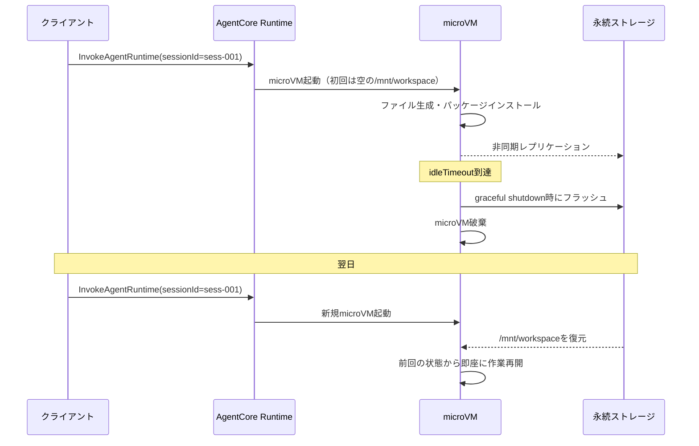

本記事は [Persist session state with filesystem configuration and execute shell commands（AWS Machine Learning Blog、2026年4月2日公開）](https://aws.amazon.com/blogs/machine-learning/persist-session-state-with-filesystem-configuration-and-execute-shell-commands/) の解説記事です。

## ブログ概要（Summary）

AWS Machine Learning Blogで公開されたこの記事は、Amazon Bedrock AgentCore Runtimeに追加された2つの新機能——Session Storage（パブリックプレビュー）とInvokeAgentRuntimeCommand——を解説するものである。Session Storageはセッションのstop/resumeサイクルをまたいでファイルシステム状態を永続化する機能であり、InvokeAgentRuntimeCommandはエージェントの推論とは独立してシェルコマンドを確定的に実行する機能である。著者らは、開発支援エージェントにおいてセッション再開時の環境再構築（約20分）を不要にできると報告している。

この記事は [Zenn記事: Bedrock AgentCore Runtimeで8時間連続セッションと状態永続化を実装する](https://zenn.dev/0h_n0/articles/56ef5e7c7fa840) の深掘りです。

## 情報源

- **種別**: 企業テックブログ（AWS Machine Learning Blog）
- **URL**: [https://aws.amazon.com/blogs/machine-learning/persist-session-state-with-filesystem-configuration-and-execute-shell-commands/](https://aws.amazon.com/blogs/machine-learning/persist-session-state-with-filesystem-configuration-and-execute-shell-commands/)
- **組織**: Amazon Web Services — Evandro Franco, Kosti Vasilakakis, Rui Cardoso, Abhimanyu Siwach, Adarsh Srikanth, Vignesh Somasundaram
- **発表日**: 2026年4月2日

## 技術的背景（Technical Background）

AgentCore Runtimeは各セッションを専用microVM上で実行するが、デフォルトではmicroVM停止時にファイルシステム上のすべてのデータが失われる。この揮発性は、コード生成・レビューのような開発支援エージェントにとって大きな課題である。

セッションを翌日に再開する場合、以下の環境再構築が毎回必要となる:

1. リポジトリのクローン
2. 依存パッケージのインストール（`npm install`、`pip install`等）
3. 環境設定ファイルの生成
4. 前回の作業状態の復元

ブログによると、この再セットアップに**約20分のコンピュート時間**がかかるケースが報告されている。Session Storageはこの課題を直接解決するために設計された機能である。

また、エージェントワークフローにおいて、AIの推論（非確定的）とビルド・テスト実行（確定的）を分離する必要性が指摘されている。`InvokeAgentRuntimeCommand`は後者をLLM推論パイプラインを経由せずに実行するためのAPIとして提供されている。

## 実装アーキテクチャ（Architecture）

### Session Storageの仕組み

ブログによると、Session Storageは`filesystemConfigurations`パラメータで有効化される。マウントパスは`/mnt`で始まる必要がある。

```python
control_client.create_agent_runtime(
    agentRuntimeName="dev-support-agent",
    agentRuntimeArtifact={
        "containerConfiguration": {
            "containerUri": f"{ACCOUNT_ID}.dkr.ecr.{REGION}.amazonaws.com/dev-agent:latest"
        }
    },
    filesystemConfigurations=[
        {
            "sessionStorage": {
                "mountPath": "/mnt/workspace"
            }
        }
    ],
    lifecycleConfiguration={
        "idleRuntimeSessionTimeout": 1800,
        "maxLifetime": 28800,
    },
    # ...
)
```

**Session Storageの仕様**（ブログより）:

| 項目 | 値 |
|------|-----|
| 最大容量 | 1GB / セッション |
| データ保持期間 | 14日間（アイドル状態） |
| サポート操作 | 通常ファイル、ディレクトリ、シンボリックリンク |
| 未サポート | ハードリンク、デバイスファイル、FIFO、UNIXソケット、xattr |
| 利用可能タイミング | エージェント呼び出し中のみ |

### Stop/Resumeライフサイクル

ブログで解説されているStop/Resumeの動作は以下の通りである。



**重要な制約**: ブログでは、マウントパスがエージェントの**呼び出し中にのみ利用可能**であると説明されている。コンテナの`ENTRYPOINT`や`CMD`からは`/mnt/workspace`にアクセスできない。初期化処理はエージェントのロジック内で実行する必要がある。

### InvokeAgentRuntimeCommandの仕組み

ブログによると、InvokeAgentRuntimeCommandはエージェントの推論処理と同一のmicroVM上でシェルコマンドを実行するAPIである。ファイルシステムを共有するため、エージェントが生成したコードをそのままテスト実行できる。

**実行モデルの特徴**（ブログより）:

- **ワンショット実行**: 各コマンドは新しいbashプロセスで起動される
- **環境の非継続性**: 前のコマンドで設定した環境変数やカレントディレクトリは引き継がれない
- **並行実行可能**: エージェントの呼び出しとコマンド実行は同時に実行できる
- **ストリーミング出力**: stdout/stderrがリアルタイムで返される

**ストリームイベント構造**（ブログより）:

| イベントタイプ | タイミング | 内容 |
|--------------|----------|------|
| `contentStart` | 開始時 | 実行確認 |
| `contentDelta` | 実行中 | stdout/stderr出力 |
| `contentStop` | 完了時 | exitCodeとstatus |

### エージェント×コマンドの連携パターン

ブログでは、以下のワークフローが典型的なユースケースとして紹介されている。

```mermaid
graph LR
    A[エージェント推論<br/>InvokeAgentRuntime] -->|コード生成| B[/mnt/workspace/code.py]
    B --> C[コマンド実行<br/>InvokeAgentRuntimeCommand]
    C -->|pytest実行| D{テスト結果}
    D -->|成功| E[git commit & push]
    D -->|失敗| F[エージェントに<br/>フィードバック]
    F --> A
```

このパターンでは、AIの推論（コード生成）と確定的操作（テスト実行、Git操作）が明確に分離されている。テスト失敗時にはその出力をエージェントにフィードバックし、修正を依頼するループを構成できる。

```python
def invoke_agent(prompt: str) -> str:
    response = runtime_client.invoke_agent_runtime(
        agentRuntimeArn=RUNTIME_ARN,
        runtimeSessionId=SESSION_ID,
        payload=json.dumps({"prompt": prompt}).encode(),
    )
    return response["response"].read().decode()

def run_command(command: str) -> tuple[str, int]:
    response = runtime_client.invoke_agent_runtime_command(
        agentRuntimeArn=RUNTIME_ARN,
        runtimeSessionId=SESSION_ID,
        body={"command": f"/bin/bash -c '{command}'", "timeout": 120},
    )
    output_lines = []
    exit_code = -1
    for event in response["stream"]:
        if "chunk" in event:
            chunk = event["chunk"]
            if "contentDelta" in chunk:
                delta = chunk["contentDelta"]
                if delta.get("stdout"):
                    output_lines.append(delta["stdout"])
            if "contentStop" in chunk:
                exit_code = chunk["contentStop"].get("exitCode", -1)
    return "".join(output_lines), exit_code
```

**制約事項**: ブログによると、AgentCore RuntimeのmicroVMにはデフォルトで開発ツール（git, npm, pip等）がインストールされていない。必要なツールはコンテナイメージに含めるか、エージェント実行時に動的にインストールする必要がある。

## Production Deployment Guide

### AWS実装パターン（コスト最適化重視）

Session Storageを活用する開発支援エージェント基盤の構成例を示す。

**トラフィック量別の推奨構成**:

| 規模 | 月間セッション | 推奨構成 | 月額コスト目安 | 主要サービス |
|------|--------------|---------|-------------|------------|
| **Small** | ~100 | Serverless | $100-250 | Lambda + AgentCore (Session Storage) |
| **Medium** | ~1,000 | Hybrid | $800-2,000 | ECS Fargate + AgentCore + S3 |
| **Large** | 10,000+ | Container | $5,000-15,000 | EKS + AgentCore + EFS |

**コスト試算の注意事項**: 上記は2026年4月時点のAWS ap-northeast-1リージョン料金に基づく概算値です。Session Storage料金はプレビュー期間中の参考値であり、GA時に変更される可能性があります。最新料金は[AWS料金計算ツール](https://calculator.aws/)で確認してください。

**Session Storageによるコスト削減効果**:

環境再構築に約20分のコンピュート時間がかかるケースにおいて:

$$
\text{月間削減額} = N_{\text{sessions}} \times t_{\text{setup}} \times C_{\text{CPU}}
$$

- $N_{\text{sessions}}$: 月間セッション再開回数（例: 22営業日 × 5回 = 110回）
- $t_{\text{setup}}$: セットアップ時間（20分 = 1/3時間）
- $C_{\text{CPU}}$: CPU単価（$0.0895/vCPU時間）

計算例: $110 \times \frac{1}{3} \times 0.0895 \approx \$3.28$/月（1ユーザー、1vCPU時）

ユーザー数が増えるほど削減効果は線形に拡大する。

### Terraformインフラコード

**Session Storage有効なAgentCore Runtime + Lambda呼び出し基盤**:

```hcl
resource "aws_iam_role" "agentcore_runtime" {
  name = "agentcore-runtime-role"

  assume_role_policy = jsonencode({
    Version = "2012-10-17"
    Statement = [{
      Action = "sts:AssumeRole"
      Effect = "Allow"
      Principal = { Service = "bedrock-agentcore.amazonaws.com" }
    }]
  })
}

resource "aws_iam_role_policy" "session_storage_access" {
  role = aws_iam_role.agentcore_runtime.id

  policy = jsonencode({
    Version = "2012-10-17"
    Statement = [
      {
        Effect = "Allow"
        Action = ["s3:GetObject", "s3:PutObject", "s3:ListBucket"]
        Resource = [
          "arn:aws:s3:::acr-storage-*-ap-northeast-1-an",
          "arn:aws:s3:::acr-storage-*-ap-northeast-1-an/*"
        ]
        Condition = {
          StringEquals = {
            "aws:PrincipalServiceName" = "bedrock-agentcore.amazonaws.com"
          }
        }
      }
    ]
  })
}

resource "aws_iam_role" "lambda_command" {
  name = "lambda-agentcore-command-role"

  assume_role_policy = jsonencode({
    Version = "2012-10-17"
    Statement = [{
      Action = "sts:AssumeRole"
      Effect = "Allow"
      Principal = { Service = "lambda.amazonaws.com" }
    }]
  })
}

resource "aws_iam_role_policy" "command_invoke" {
  role = aws_iam_role.lambda_command.id

  policy = jsonencode({
    Version = "2012-10-17"
    Statement = [{
      Effect = "Allow"
      Action = [
        "bedrock-agentcore:InvokeAgentRuntime",
        "bedrock-agentcore:InvokeAgentRuntimeCommand",
        "bedrock-agentcore:StopRuntimeSession"
      ]
      Resource = "arn:aws:bedrock-agentcore:ap-northeast-1:*:agent-runtime/*"
    }]
  })
}

resource "aws_lambda_function" "test_runner" {
  filename      = "test_runner.zip"
  function_name = "agentcore-test-runner"
  role          = aws_iam_role.lambda_command.arn
  handler       = "index.handler"
  runtime       = "python3.12"
  timeout       = 300
  memory_size   = 256

  environment {
    variables = {
      AGENTCORE_RUNTIME_ARN = var.agentcore_runtime_arn
    }
  }
}

resource "aws_cloudwatch_metric_alarm" "command_timeout" {
  alarm_name          = "agentcore-command-timeout"
  comparison_operator = "GreaterThanThreshold"
  evaluation_periods  = 1
  metric_name         = "Duration"
  namespace           = "AWS/Lambda"
  period              = 300
  statistic           = "Maximum"
  threshold           = 240000
  alarm_description   = "コマンド実行タイムアウト検知（4分超過）"

  dimensions = {
    FunctionName = aws_lambda_function.test_runner.function_name
  }
}
```

### 運用・監視設定

**Session Storage使用量モニタリング**:

```python
import boto3

cloudwatch = boto3.client('cloudwatch')

cloudwatch.put_metric_alarm(
    AlarmName='session-storage-high-usage',
    ComparisonOperator='GreaterThanThreshold',
    EvaluationPeriods=1,
    MetricName='StorageUsageBytes',
    Namespace='Custom/AgentCore',
    Period=3600,
    Statistic='Maximum',
    Threshold=900_000_000,  # 900MB（1GBリミットの90%）
    AlarmDescription='Session Storage使用量が上限に接近'
)
```

**コマンド実行監視**:

```sql
fields @timestamp, command, exit_code, duration_ms
| filter exit_code != 0
| stats count() as failure_count by command
| sort failure_count desc
| limit 10
```

### コスト最適化チェックリスト

**Session Storage最適化**:
- [ ] 不要な中間ファイルをSession Storageに保存しない（1GB上限）
- [ ] `.git`以外の大容量ディレクトリは外部ストレージ（S3）を利用
- [ ] Session Storage保持期間（14日）を超えるデータはS3にバックアップ
- [ ] バージョン更新時にSession Storageがリセットされる仕様を考慮した設計

**コマンド実行最適化**:
- [ ] timeout設定を適切に設定（デフォルト超過によるコスト増加防止）
- [ ] 必要なツールはコンテナイメージに含める（動的インストールのコスト回避）
- [ ] 複数コマンドは1回の呼び出しで連結実行（`&&`で結合）
- [ ] テスト失敗のフィードバックループ回数に上限を設定

**リソース管理**:
- [ ] セッションの明示的な`StopRuntimeSession`呼び出し（不要なIdle課金防止）
- [ ] `StopRuntimeSession`完了を待ってからResume（データ不整合防止）
- [ ] CloudWatch LogsのSession Storage関連ログ保持期間設定
- [ ] 開発環境のセッションは業務終了時に明示的停止

## パフォーマンス最適化（Performance）

### Session Storageのレイテンシ特性

ブログではSession Storageのレイテンシに関する具体的な数値は公開されていないが、以下の設計上の特性が推測される。

- **初回マウント**: 永続ストレージからの復元に一定時間を要する（ストレージ使用量に比例すると推測される）
- **非同期レプリケーション**: Active状態中のファイル書き込みは非同期でバックエンドストレージに同期される
- **graceful shutdown**: セッション停止時にフラッシュ処理が行われるため、`StopRuntimeSession`の応答時間にストレージ同期の待ち時間が含まれる

### コマンド実行のオーバーヘッド

InvokeAgentRuntimeCommandは各呼び出しで新しいbashプロセスを起動するため、以下のオーバーヘッドが存在する。

- **プロセス起動**: 数十ミリ秒（bashプロセスの起動コスト）
- **環境設定**: 環境変数やカレントディレクトリを毎回コマンド内で設定する必要がある
- **ストリーミング**: stdout/stderrのリアルタイム転送にネットワークレイテンシが加算される

これらのオーバーヘッドは、テスト実行やビルド処理のような秒単位の操作においてはごく小さい割合であるが、ミリ秒単位の操作を大量に実行するケースでは累積的な影響がある点に注意が必要である。

## 運用での学び（Production Lessons）

ブログおよび関連ドキュメントから得られる運用上の知見を以下にまとめる。

**安全なStop/Resume**: セッションを停止してから再開する場合、`StopRuntimeSession`の完了を必ず待つこと。停止処理中にデータのフラッシュが行われるため、完了前に再開するとデータが不完全になる可能性がある。

**バージョン更新とSession Storage**: `update_agent_runtime`で新バージョンを作成すると、Session Storageの内容がリセットされる。重要なデータはSession Storage以外（S3、DynamoDB等）にも保存する設計を推奨する。

**コンテナイメージの設計**: デフォルトのmicroVMには開発ツールが含まれないため、コンテナイメージに必要なツール（git, npm, pip, pytest等）を事前にインストールしておくことが推奨される。動的インストールはSession Storageに永続化されるが、バージョン更新時にリセットされる点に注意が必要である。

## 学術研究との関連（Academic Connection）

Session Storageの設計は、以下の学術研究のコンセプトと関連している。

- **MemGPT（Packer et al., 2023）**: セッション間のメモリ永続化というコンセプトにおいて、MemGPTのディスクページングモデルとSession Storageのファイルシステム永続化は同様の課題を異なるレベルで解決している
- **Checkpoint/Restore in Userspace（CRIU）**: Linuxプロセスのチェックポイント・リストア技術との類似性があり、Session Storageはファイルシステムレベルでのチェックポイントとして機能する
- **CodeAct（Wang et al., 2024, arXiv:2404.07219）**: コード実行をエージェントのプライマリアクション空間とする研究。InvokeAgentRuntimeCommandは、この「コード実行によるエージェント行動」を確定的操作として分離した実装と位置づけられる

## まとめと実践への示唆

AWS公式ブログで解説されたSession StorageとInvokeAgentRuntimeCommandは、AgentCore RuntimeのmicroVM分離モデルにおける2つの大きな課題——ステートの揮発性と確定的操作の分離——に対する直接的な解決策である。Session Storageにより、開発支援エージェントの場合は毎回のセットアップ時間（約20分）を削減できると報告されている。InvokeAgentRuntimeCommandにより、エージェントの推論と確定的なシェル操作を同一環境で安全に連携できる。

なお、Session Storageは2026年4月時点でパブリックプレビュー段階であり、GA時に仕様変更の可能性がある点に留意が必要である。

## 参考文献

- **Blog URL**: [Persist session state with filesystem configuration and execute shell commands](https://aws.amazon.com/blogs/machine-learning/persist-session-state-with-filesystem-configuration-and-execute-shell-commands/)
- **Session Storage Documentation**: [https://docs.aws.amazon.com/bedrock-agentcore/latest/devguide/runtime-persistent-filesystems.html](https://docs.aws.amazon.com/bedrock-agentcore/latest/devguide/runtime-persistent-filesystems.html)
- **Related Papers**: MemGPT (arXiv:2403.12881), CodeAct (arXiv:2404.07219)
- **Related Zenn article**: [Bedrock AgentCore Runtimeで8時間連続セッションと状態永続化を実装する](https://zenn.dev/0h_n0/articles/56ef5e7c7fa840)
