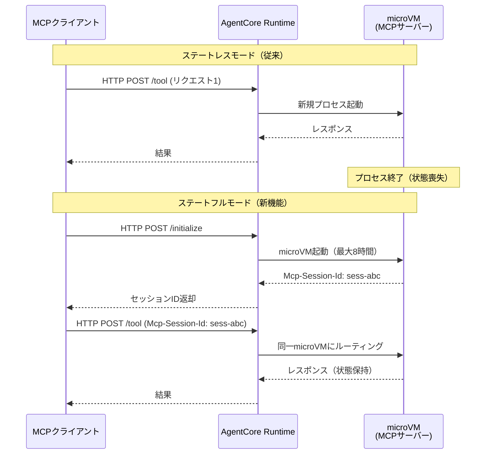

本記事は [Introducing stateful MCP client capabilities on Amazon Bedrock AgentCore Runtime（AWS Machine Learning Blog、2026年4月9日公開）](https://aws.amazon.com/blogs/machine-learning/introducing-stateful-mcp-client-capabilities-on-amazon-bedrock-agentcore-runtime/) の解説記事です。

## ブログ概要（Summary）

AWS Machine Learning Blogで公開されたこの記事は、Amazon Bedrock AgentCore RuntimeにおけるModel Context Protocol（MCP）のステートフル実装に追加された3つの双方向通信機能——Elicitation（ユーザー入力要求）、Sampling（LLM推論委譲）、Progress Notifications（進捗通知）——を解説するものである。ブログの著者らは、これらの機能により従来のステートレスHTTPリクエストでは不可能だったインタラクティブなマルチターンエージェントワークフローが実現されると述べている。

この記事は [Zenn記事: Bedrock AgentCore Runtimeで8時間連続セッションと状態永続化を実装する](https://zenn.dev/0h_n0/articles/56ef5e7c7fa840) の深掘りです。

## 情報源

- **種別**: 企業テックブログ（AWS Machine Learning Blog）
- **URL**: [https://aws.amazon.com/blogs/machine-learning/introducing-stateful-mcp-client-capabilities-on-amazon-bedrock-agentcore-runtime/](https://aws.amazon.com/blogs/machine-learning/introducing-stateful-mcp-client-capabilities-on-amazon-bedrock-agentcore-runtime/)
- **組織**: Amazon Web Services — Evandro Franco, Sayee Kulkarni, Phelipe Fabres, Zihang Huang
- **発表日**: 2026年4月9日

## 技術的背景（Technical Background）

Model Context Protocol（MCP）は、LLMアプリケーションと外部ツール・データソースを接続するオープンプロトコルとして、2024年後半にAnthropicにより提唱された。MCP仕様（バージョン2025-11-25）では、サーバーがクライアントに対して情報を要求する双方向通信パターンが定義されているが、多くの実装ではステートレスなHTTPリクエスト/レスポンスモデルにとどまっていた。

AgentCore Runtimeは各ユーザーセッションを専用microVM上で実行するアーキテクチャを採用しており、ステートフルモードではMCPサーバーがmicroVMのライフタイム（最大8時間）にわたってセッションコンテキストを維持できる。ブログでは、この永続的なセッション環境が、従来のステートレスHTTPモデルでは不可能だったMCPの双方向通信パターンを可能にしたと説明されている。

## 実装アーキテクチャ（Architecture）

### ステートレスモードとステートフルモードの違い

ブログによると、ステートフルモードは1つの設定パラメータで有効化される。

```python
stateless_http = False  # ステートフルモードを有効化
```

ステートフルモードでは、初期化ハンドシェイク時に`Mcp-Session-Id`ヘッダーが返され、以降のリクエストはこのIDを使ってセッションの継続性を確保する。



### 3つのクライアント機能

#### 1. Elicitation（ユーザー入力要求）

ブログによると、Elicitationはサーバーが実行を一時停止し、ユーザーに構造化入力を要求する機能である。2つのモードが提供されている。

- **Formモード**: MCPクライアント経由で直接データを収集する
- **URLモード**: OAuth認証や決済など、機密操作用の外部URLにユーザーをリダイレクトする

ユーザーの応答は3つのアクション（accept, decline, cancel）で表現される。

```python
@server.tool()
async def create_expense(ctx: Context) -> str:
    result = await ctx.elicit(
        message="経費情報を入力してください",
        requestedSchema={
            "type": "object",
            "properties": {
                "amount": {"type": "number", "description": "金額"},
                "category": {"type": "string", "description": "カテゴリ"},
                "date": {"type": "string", "format": "date"},
                "description": {"type": "string"}
            },
            "required": ["amount", "category", "date"]
        }
    )

    if result.action == "accept":
        return f"経費登録完了: {result.content}"
    elif result.action == "decline":
        return "経費登録がキャンセルされました"
    else:
        return "操作が中断されました"
```

#### 2. Sampling（LLM推論委譲）

ブログでは、Samplingはサーバーがクライアント側のLLMに推論処理を委譲する機能として説明されている。サーバー自身はモデル認証情報を保持する必要がなく、クライアントがモデル選択の制御権を維持する。

サーバーはcapability prioritiesを通じてモデル選択の希望を表明できる:
- `costPriority`: コスト重視度
- `speedPriority`: 速度重視度
- `intelligencePriority`: 知能重視度

```python
@server.tool()
async def analyze_spending(ctx: Context, data: str) -> str:
    result = await ctx.sample(
        messages=[{
            "role": "user",
            "content": f"以下の経費データを分析し、傾向をレポートしてください:\n{data}"
        }],
        maxTokens=2000,
        modelPreferences={
            "costPriority": 0.3,
            "speedPriority": 0.2,
            "intelligencePriority": 0.5
        }
    )
    return result.content
```

#### 3. Progress Notifications（進捗通知）

ブログによると、Progress Notificationsはfire-and-forget方式の非同期ステータス更新機能である。`notifications/progress`メッセージを送信するが、応答を待たないため、長時間処理のリアルタイム可視化に適している。

```python
@server.tool()
async def generate_report(ctx: Context, months: list[str]) -> str:
    total = len(months) * 3  # 各月3ステップ
    current = 0

    for month in months:
        # ステップ1: データ取得
        await ctx.report_progress(current, total)
        data = fetch_data(month)
        current += 1

        # ステップ2: 分析
        await ctx.report_progress(current, total)
        analysis = analyze(data)
        current += 1

        # ステップ3: レポート生成
        await ctx.report_progress(current, total)
        report = format_report(analysis)
        current += 1

    await ctx.report_progress(total, total)
    return "レポート生成完了"
```

### セッションの有効期限

ブログでは、セッションが期限切れまたはサーバー再起動後に期限切れのセッションIDでリクエストを送ると、404レスポンスが返されると説明されている。クライアントは再初期化して新しいセッションIDを取得する必要がある。

この動作は、AgentCore Runtimeのセッションライフサイクル（Active → Idle → Terminated）と一致している。ステートフルMCPセッションのライフタイムは、基盤となるmicroVMのライフサイクル設定（`idleRuntimeSessionTimeout`、`maxLifetime`）によって制御される。

## パフォーマンス最適化（Performance）

### Elicitationのレイテンシ特性

Elicitationはユーザーの応答を待つブロッキング操作であるため、サーバー処理のレイテンシは主にユーザーの応答速度に依存する。ブログでは具体的なレイテンシ数値は公開されていないが、microVMがIdleではなくActive状態を維持する間はCPU課金が発生する点に注意が必要である。

ただし、AgentCore Runtimeの課金モデルではI/O wait中のCPU課金が発生しないため、ユーザー入力待ちの間は実質的にメモリ課金のみとなる。これはElicitationパターンにとって有利な課金構造である。

### Samplingのモデル選択戦略

ブログで紹介されている`modelPreferences`のpriority設定は、コスト最適化において重要な設計ポイントである。

$$
\text{モデルスコア} = w_{\text{cost}} \cdot S_{\text{cost}} + w_{\text{speed}} \cdot S_{\text{speed}} + w_{\text{intel}} \cdot S_{\text{intel}}
$$

ここで、
- $w_{\text{cost}}, w_{\text{speed}}, w_{\text{intel}}$: ブログで定義されるpriority重み（合計は正規化不要）
- $S_{\text{cost}}, S_{\text{speed}}, S_{\text{intel}}$: 各モデルのスコア（クライアント側で定義）

この仕組みにより、サーバーはモデルの具体名を知らずに、タスクの性質に応じた適切なモデル選択を間接的に制御できる。

### Progress Notificationsの帯域効率

Progress Notificationsはfire-and-forget方式のため、ACK待ちによるブロッキングが発生しない。大量の進捗更新を送信してもサーバーのスループットに影響しない設計となっている。ただし、ネットワーク帯域やクライアント側の処理能力を考慮し、更新頻度を適切に制御する必要がある。

## 運用での学び（Production Lessons）

**Elicitationのタイムアウト設計**: ブログでは明示的に触れられていないが、ユーザー入力を待つElicitationには適切なタイムアウト設定が必要である。microVMの`maxLifetime`がハードリミットとなるが、実用的にはアプリケーションレベルで数分程度のタイムアウトを設定し、期限内に応答がない場合はキャンセル処理を行う設計が推奨される。

**Samplingの認証情報分離**: ブログで強調されている「サーバーがモデル認証情報を保持しない」という設計は、セキュリティ上の重要なメリットである。マルチテナント環境では、各テナントのAPIキーがサーバー側に漏洩するリスクを構造的に排除できる。

**Progress Notificationsの活用パターン**: 長時間のバッチ処理やレポート生成において、進捗通知はユーザー体験の向上に直結する。ただし、fire-and-forget方式のため、通知の到達を保証する仕組みはない点に注意が必要である。

## 学術研究との関連（Academic Connection）

MCPのステートフル通信モデルは、分散システムにおけるステートフルRPC（Remote Procedure Call）の研究と関連している。

- **MCP仕様（バージョン2025-11-25）**: Anthropicが主導するオープン仕様であり、ツール呼び出し、リソースアクセス、プロンプティングの標準化を目指している
- **A2A（Agent-to-Agent Protocol）**: Googleが提唱するエージェント間通信プロトコル。MCPがエージェント-ツール間の通信を標準化するのに対し、A2Aはエージェント-エージェント間の通信を標準化する。AgentCore Runtimeは両方のプロトコルをサポートしている
- **Function Calling**: OpenAIが2023年に導入したLLMからの関数呼び出しインターフェース。MCPはこのコンセプトをプロトコルレベルで標準化し、双方向通信を追加したものと位置づけられる

## まとめと実践への示唆

AWS公式ブログで解説されたステートフルMCPクライアント機能は、AgentCore Runtimeのmicrovm永続セッション基盤の上に構築された3つの双方向通信パターンを提供する。Elicitationによるユーザー入力要求、SamplingによるLLM推論委譲、Progress Notificationsによるリアルタイム進捗報告は、それぞれ異なるユースケースに対応しつつ、ステートフルセッションのメリットを最大限に活かしている。

実務への示唆として、`stateless_http=False`の1行でステートフルモードを有効化でき、既存のMCPサーバー実装に双方向通信を段階的に追加できる点が重要である。ただし、ステートフルモードではmicroVMリソースがセッション期間中占有されるため、同時セッション数とコストのバランスを設計段階で考慮する必要がある。

## 参考文献

- **Blog URL**: [Introducing stateful MCP client capabilities on Amazon Bedrock AgentCore Runtime](https://aws.amazon.com/blogs/machine-learning/introducing-stateful-mcp-client-capabilities-on-amazon-bedrock-agentcore-runtime/)
- **MCP Specification**: [https://spec.modelcontextprotocol.io/](https://spec.modelcontextprotocol.io/)
- **AgentCore Runtime Documentation**: [https://docs.aws.amazon.com/bedrock-agentcore/latest/devguide/](https://docs.aws.amazon.com/bedrock-agentcore/latest/devguide/)
- **Related Zenn article**: [Bedrock AgentCore Runtimeで8時間連続セッションと状態永続化を実装する](https://zenn.dev/0h_n0/articles/56ef5e7c7fa840)
