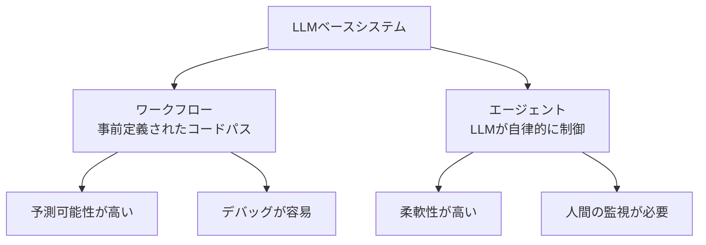

本記事は [Anthropic公式ブログ: Building Effective AI Agents](https://www.anthropic.com/research/building-effective-agents) の解説記事です。

## ブログ概要（Summary）

Anthropicが公式に公開したAIエージェント構築ガイドである。著者らは、LLMを活用したシステムを「ワークフロー」（事前定義されたコードパスによるオーケストレーション）と「エージェント」（LLMが自律的にプロセスとツール使用を制御）に分類し、5つの再利用可能なワークフローパターン（Prompt Chaining、Routing、Parallelization、Orchestrator-Workers、Evaluator-Optimizer）を提案している。また、エージェント設計ではシンプルさ・透明性・ツールドキュメントの3原則を強調し、評価手法についても実践的な指針を示している。

この記事は [Zenn記事: AgentFlow×LangGraphで構築するEC問い合わせエージェントのマルチターン精度評価](https://zenn.dev/0h_n0/articles/2fb081aea94bd5) の深掘りです。

## 情報源

- **種別**: 企業テックブログ
- **URL**: [https://www.anthropic.com/research/building-effective-agents](https://www.anthropic.com/research/building-effective-agents)
- **組織**: Anthropic
- **発表日**: 2024年12月（2025年に追加更新あり）

## 技術的背景（Technical Background）

LLMの能力が向上するにつれ、単純なプロンプト→レスポンスの使い方から、複数のLLM呼び出しとツールを組み合わせた複合システムへの移行が進んでいる。しかし、多くのチームが過度に複雑なフレームワークを導入し、かえってデバッグや保守が困難になるケースが報告されている。

Anthropicは自社のエージェント構築経験と顧客との協業を通じて、「シンプルなパターンを積み重ねる」アプローチが最も効果的であるとの知見を得ている。本ブログはその設計思想を体系化したものである。

## 実装アーキテクチャ（Architecture）

### ワークフロー vs エージェントの分類

Anthropicは、LLMベースシステムを2つのカテゴリに分類している。



この分類において重要なのは、**ワークフローを先に検討すべき**という推奨である。エージェントは柔軟だが、デバッグが困難で予測不可能な振る舞いを示す。測定可能な性能改善が確認された場合にのみ複雑さを追加すべきとされている。

### 5つのワークフローパターン

#### 1. Prompt Chaining（逐次チェーン）

タスクを固定的なサブタスク系列に分解し、各ステップのLLM出力を次のステップの入力とする。

**適用例**: マーケティングコピーを生成し、次にそれを翻訳する

**設計原則**: 各ステップで中間出力のバリデーション（ゲート）を挿入し、品質を段階的に保証する

#### 2. Routing（ルーティング）

入力を分類し、適切な下流プロセスへ振り分ける。**Zenn記事のAgentFlowのルーターパターンと直接対応する。**

**コスト最適化の例**: 簡単なクエリはHaikuなどの小型モデルへ、複雑なクエリはSonnet/Opusへルーティングすることで、品質を維持しつつコストを削減する。

```python
from typing import Literal


def route_query(
    query: str,
    complexity_score: float,
) -> Literal["haiku", "sonnet", "opus"]:
    """クエリの複雑さに基づいてモデルを選択する

    Anthropicの推奨: 簡単なクエリには小型モデル、
    複雑なクエリには大型モデルを使い分ける
    """
    if complexity_score < 0.3:
        return "haiku"
    elif complexity_score < 0.7:
        return "sonnet"
    else:
        return "opus"
```

#### 3. Parallelization（並列化）

独立したサブタスクを同時実行する。2つのバリエーションがある。

- **Sectioning**: 独立したサブタスクを並列実行（例: 異なるセクションを同時に要約）
- **Voting**: 同一タスクを複数回実行し、多数決で信頼度を上げる

#### 4. Orchestrator-Workers（オーケストレーター・ワーカー）

中央のLLMがタスクを動的に分解し、ワーカーに委任する。Prompt Chainingと異なり、サブタスクの数と内容が事前に決まっていない。

**適用例**: 複数ファイルにまたがるコード変更

Zenn記事のルーターパターンがRoutingに対応するのに対し、より複雑な意図解決（例: 注文変更→キャンセル→再注文のような動的フロー）にはOrchestrator-Workersパターンが適している。

#### 5. Evaluator-Optimizer（評価者・最適化ループ）

生成LLMが出力を生成し、評価LLMがフィードバックを返して反復改善する。

**適用条件**: 
- 明確な評価基準が定義可能であること
- 反復改善が測定可能な価値を提供すること

### エージェント設計の3原則

Anthropicは以下の3原則を強調している。

1. **シンプルさ**: エージェントは「環境フィードバックに基づいてツールを使うLLMのループ」に過ぎない。過度な抽象化を避ける
2. **透明性**: 計画ステップをユーザーに明示的に表示する
3. **ツールドキュメント**: Agent-Computer Interface (ACI) にHuman-Computer Interface (HCI) と同等の設計投資を行う

### ツール設計の最適化

ツール設計について、Anthropicは以下の具体的な推奨を示している。

- モデルが自然言語テキスト中で自然に出現する形式に近いフォーマットを優先する
- 行番号の正確なカウントや過剰なエスケープを要求するフォーマットは避ける
- ツールの説明にはエッジケースと使用例を含める
- **Poka-yoke設計**: ミスを困難にする設計にする（例: 相対パスではなく絶対パスを要求する）

SWE-benchのコーディングエージェントでは、全体プロンプトの最適化よりもツール設計の最適化に多くの工学的投資が費やされたと報告されている。

## パフォーマンス最適化（Performance）

### 評価アプローチ

Anthropicは自社のマルチエージェント研究システム構築において、以下の評価手法を報告している。

1. **代表クエリセット**: 実際の使用パターンを反映する約20のクエリから開始し、変更の影響を視覚的に確認
2. **LLM-as-judge**: ファクチュアル正確性・引用正確性・完全性・ソース品質・ツール効率の5次元をカバーする構造化ルーブリックを使用
3. **単一LLM呼び出し**: 複数の専門化されたジャッジよりも、単一LLMによる構造化プロンプトからのスコア出力の方が一貫性が高いと報告されている

### コスト vs 品質のトレードオフ

Routingパターンによるコスト最適化では、タスク難易度に応じたモデル選択が鍵となる。Anthropicの推奨設計では、エージェントが自身の不確実性を推定し、閾値を超えた場合にのみ上位モデルにエスカレーションする。

## 運用での学び（Production Lessons）

### 段階的な複雑さの追加

Anthropicは「シンプルなプロンプトから始め、包括的な評価で最適化し、シンプルな解決策が不十分な場合にのみマルチステップのエージェントシステムを追加せよ」と推奨している。

この原則は、Zenn記事で紹介したL1→L2→L3の段階的評価設計と整合する。まずL1（ツール正確性）で基本的な動作を保証し、それがパスした場合のみL2（応答品質）、L3（タスク完了率）へ進む。

### カスタマーサポートへの適用

Anthropicは、カスタマーサポートを検証済みのユースケースの1つとして紹介している。特徴は以下の通り。

- 会話フローとツール統合の組み合わせ（データ取得・返金処理・チケット更新）
- ユーザー定義の解決成功率による測定可能な品質保証
- 人間レビューのサフガードを組み込んだ構成

### フレームワーク選択の指針

Claude Agent SDKなどのフレームワークは実装を簡素化するが、Anthropicは「最初はLLM APIを直接使うことから始めよ」と助言している。多くのパターンは最小限のコードで実装でき、フレームワークの導入は内部機構を十分に理解してからにすべきとされている。

## 学術研究との関連（Academic Connection）

Anthropicの5つのワークフローパターンは、以下の学術研究と関連している。

- **Routing**: RouterBench (arXiv:2503.06806) で体系的に評価されているLLMルーティング戦略と対応。コスト・品質トレードオフの定量化が可能
- **Evaluator-Optimizer**: LLM-as-judge研究（arXiv:2501.08479）の知見が直接適用可能。評価基準の明確化とCoTプロンプティングの併用が推奨される
- **Orchestrator-Workers**: マルチエージェントシステムにおけるタスク委任パターン。SwarmBench (arXiv:2504.11893) で集中型/分散型コーディネーションの評価が進んでいる

## まとめと実践への示唆

Anthropicの「Building Effective Agents」は、LLMエージェント構築の実践的ガイドとして3つの重要な示唆を提供している。第一に、**ワークフローパターンを先に検討**し、測定可能な改善が確認された場合にのみエージェントに移行する。第二に、**ルーティングパターン**はZenn記事のAgentFlowのルーターパターンと構造的に同一であり、コスト最適化のための段階的モデル選択が有効である。第三に、**評価はシンプルな代表クエリセットから始め**、段階的にスケールさせることが成功の鍵である。

**制約**: 本ブログはAnthropicの自社経験に基づく定性的なガイドであり、具体的なベンチマーク数値は含まれていない。定量的な評価設計にはCustomerServiceBenchやRouterBenchなどの学術ベンチマークとの併用が推奨される。

## 参考文献

- **Blog URL**: [https://www.anthropic.com/research/building-effective-agents](https://www.anthropic.com/research/building-effective-agents)
- **Multi-agent research system**: [https://www.anthropic.com/engineering/multi-agent-research-system](https://www.anthropic.com/engineering/multi-agent-research-system)
- **Related Papers**: RouterBench (arXiv:2503.06806), JudgeBench (arXiv:2501.08479)
- **Related Zenn article**: [https://zenn.dev/0h_n0/articles/2fb081aea94bd5](https://zenn.dev/0h_n0/articles/2fb081aea94bd5)
