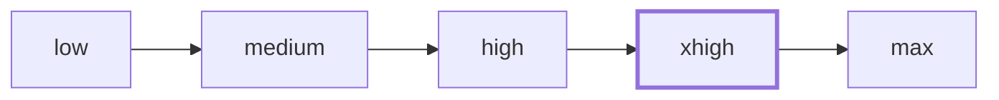
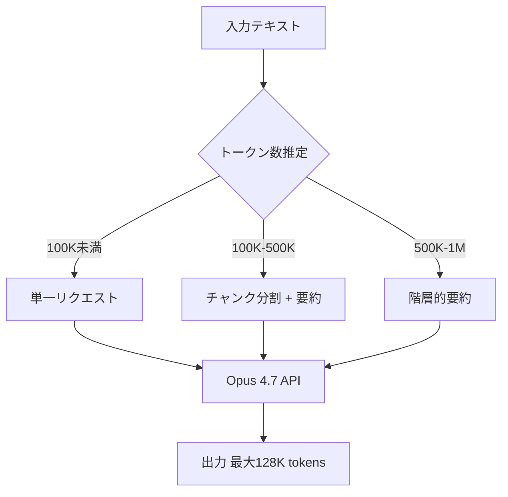

# Anthropic公式ブログ解説: Claude Opus 4.7 — 高解像度ビジョンとアダプティブ推論の技術詳細

## ブログ概要

本記事は [Anthropic公式ブログ: Introducing Claude Opus 4.7](https://www.anthropic.com/news/claude-opus-4-7) の解説記事です。

Claude Opus 4.7は2026年4月16日にリリースされたAnthropicの最新フラッグシップモデルであり、前世代のOpus 4.6と比較してコーディングベンチマークで13%の向上、プロダクション環境で3倍のタスク解決率を達成したとAnthropicは報告している。本記事では、高解像度ビジョン（3.75MP）、新トークナイザー、アダプティブ推論の`xhigh`レベル、SWE-Bench Pro 64.3%といった技術的な改善点を修士学生レベルの読者向けに解説する。

この記事は [Zenn記事: GPT-5.5徹底比較：Claude Opus 4.7・Gemini 3.1 Pro・DeepSeek V4との性能差を検証](https://zenn.dev/0h_n0/articles/b18fe46f73041d) の深掘りです。

---

## 情報源

- **種別**: 企業テックブログ（公式発表）
- **URL**: [https://www.anthropic.com/news/claude-opus-4-7](https://www.anthropic.com/news/claude-opus-4-7)
- **発表元**: Anthropic
- **発表日**: 2026年4月16日
- **モデルID**: `claude-opus-4-7-20260416`

---

## 技術的背景

### Opus 4.6からOpus 4.7への進化

Claude Opus 4.6（2026年2月リリース）は、エージェント型コーディングタスクにおいて高い評価を受けたモデルである。Opus 4.7はその後継として、特に長時間にわたる複雑なタスクの**一貫性（consistency）**と**厳密性（rigor）**の改善に重点を置いている。

Anthropicは、Opus 4.7が「複雑で長時間実行されるタスクを一貫性を持って処理する能力」が強化されたと述べている。これは単にベンチマークスコアの向上だけでなく、実際のプロダクション環境でのタスク完了率が3倍に改善されたことが裏付けとなる。

### 競合環境

2026年4月時点のフロンティアモデル競争は激化している。OpenAIのGPT-5.5、GoogleのGemini 3.1 Pro、DeepSeek V4がそれぞれ独自の強みを持つ中、Claude Opus 4.7はエージェント型コーディングとハルシネーション耐性で差別化を図っている。ただし、後述するように全領域で優位というわけではなく、Terminal-Bench 2.0ではGPT-5.5に及ばない点も報告されている。

---

## 高解像度ビジョン

### 解像度の向上

Claude Opus 4.7はClaudeシリーズで初めて高解像度画像をサポートしたモデルである。Anthropicの発表によると、入力画像の仕様は以下のように拡張された。

| パラメータ | Opus 4.6以前 | Opus 4.7 |
|---|---|---|
| 長辺最大 | 1568px | 2576px |
| 総画素数上限 | 1.15MP | 3.75MP |
| 画素数倍率 | — | **3.3倍** |

従来のClaudeモデルでは、1568px以上の画像は自動的にリサイズされていたため、回路図やアーキテクチャ図の細部が失われるケースがあった。Opus 4.7では3.75MP（例: 2576×1456px）まで原寸で処理できる。

### 1:1ピクセル座標マッピング

Opus 4.7のもう一つの重要な改善は、**1:1ピクセル座標マッピング**のサポートである。従来モデルではスケールファクターの計算が必要だった画像座標の取得が、直接的なピクセル単位の参照で可能となった。

```python
import anthropic

client = anthropic.Anthropic()

def detect_ui_elements(image_path: str) -> dict:
    """
    Opus 4.7の1:1ピクセル座標マッピングを利用した
    UI要素検出。スケールファクター変換が不要。
    
    Args:
        image_path: 解析対象の画像パス
    
    Returns:
        検出されたUI要素とそのピクセル座標
    """
    import base64
    with open(image_path, "rb") as f:
        image_data = base64.standard_b64encode(f.read()).decode("utf-8")
    
    response = client.messages.create(
        model="claude-opus-4-7-20260416",
        max_tokens=4096,
        messages=[{
            "role": "user",
            "content": [
                {
                    "type": "image",
                    "source": {
                        "type": "base64",
                        "media_type": "image/png",
                        "data": image_data,
                    },
                },
                {
                    "type": "text",
                    "text": "この画像内のボタン要素の位置をピクセル座標で列挙してください。"
                }
            ],
        }],
    )
    return {"raw_response": response.content[0].text}
```

この改善により、UIテスト自動化やドキュメントからの情報抽出など、座標精度が求められるユースケースでの利用が現実的となった。

### ビジョン処理のトークンコスト概算

画像入力のトークンコストはおおよそ以下の式で概算できるとされる。

$$
T_{\text{image}} \approx \frac{W \times H}{750}
$$

ここで $W$ は画像の幅（px）、$H$ は画像の高さ（px）、$T_{\text{image}}$ は消費トークン数である。3.75MPの画像（例: 2500×1500px）の場合：

$$
T_{\text{image}} \approx \frac{2500 \times 1500}{750} = 5000 \text{ tokens}
$$

入力トークン単価が$5/MTokであるため、1画像あたり約$0.025のコストとなる。

---

## 新トークナイザーの影響

### トークン数の変化

Opus 4.7では新しいトークナイザーが導入され、同一テキストに対して**1.0倍から1.35倍**のトークンが生成されるとAnthropicは報告している。これは語彙サイズや分割アルゴリズムの変更によるものと推測される。

$$
T_{4.7}(x) = \alpha \cdot T_{4.6}(x), \quad \alpha \in [1.0, 1.35]
$$

ここで $T_{v}(x)$ はモデルバージョン $v$ におけるテキスト $x$ のトークン数、$\alpha$ はトークン増加係数である。

### コストへの影響

トークン単価（$5/$25 per MTok）は据え置きであるため、トークン数の増加はそのまま実効コストの増加につながる。

| シナリオ | Opus 4.6 | Opus 4.7（最大） | コスト増加率 |
|---|---|---|---|
| 入力1000トークン相当 | 1000 tok / $0.005 | 1350 tok / $0.00675 | +35% |
| 出力1000トークン相当 | 1000 tok / $0.025 | 1350 tok / $0.03375 | +35% |

ただしAnthropicはトークン増加係数の範囲が1.0〜1.35と報告しており、テキストの言語や内容によって変動する。日本語テキストでは英語と異なる増加率になる可能性がある。移行前にトークナイザーのベンチマークを行い、実際のコスト影響を測定することが推奨される。

---

## アダプティブ推論システム

### Effort Levelの拡張

Opus 4.7では推論のeffort levelに新たに**`xhigh`**が追加された。従来の`low`、`medium`、`high`、`max`に加え、`high`と`max`の間に位置づけられる。



Anthropicによると、Claude Codeではデフォルトのeffort levelが`xhigh`に設定されている。これは日常的なコーディングタスクにおいて`max`ほどのコストをかけずに、`high`以上の推論品質を提供するバランスポイントとして設計されている。

### Adaptive Thinking（常時thinking-on）

Opus 4.7の注目すべき設計判断として、**思考モード（thinking）が常時有効**となっている点がある。Anthropicの内部評価において、thinking-onモードが拡張思考（extended thinking）を一貫して上回ったと報告されている。

これは、モデルが回答前に中間的な推論ステップを生成する仕組みが、明示的に長い思考チェーンを要求するよりも効果的であることを示唆する。

```python
# Opus 4.7でのeffort level指定
response = client.messages.create(
    model="claude-opus-4-7-20260416",
    max_tokens=8192,
    thinking={
        "type": "enabled",
        "budget_tokens": 10000  # thinking用トークン予算
    },
    messages=[{
        "role": "user",
        "content": "このコードベースのアーキテクチャ上の問題点を分析してください"
    }],
)

# thinkingブロックと回答ブロックの分離
for block in response.content:
    if block.type == "thinking":
        print(f"[思考過程] {block.thinking[:200]}...")
    elif block.type == "text":
        print(f"[回答] {block.text}")
```

### Task Budgets（パブリックベータ）

Opus 4.7ではTask Budgets機能がパブリックベータとして導入された。これは開発者がClaudeのトークン消費量を事前にガイドし、長時間実行されるエージェント型タスクのコスト制御を可能にする仕組みである。

---

## ベンチマーク詳細分析

### コーディングベンチマーク

Opus 4.7のコーディング能力について、Anthropicは以下のベンチマーク結果を報告している。

| ベンチマーク | Opus 4.7 | Opus 4.6 | GPT-5.5 | 備考 |
|---|---|---|---|---|
| CursorBench | **70%** | 58% | — | +12pt |
| SWE-bench Verified | **87.6%** | — | — | — |
| SWE-Bench Pro | **64.3%** | — | 58.6% | +5.7pt vs GPT-5.5 |
| Terminal-Bench 2.0 | 69.4% | — | — | GPT-5.5に及ばない |
| MCP-Atlas | **77.3%** | — | — | — |

SWE-Bench Proにおける64.3%はOpus 4.7がGPT-5.5（58.6%）を5.7ポイント上回る結果である。SWE-Bench Proは実際のGitHubリポジトリのissueを解決するタスクであり、リポジトリの全体構造の理解、関連ファイルの特定、テストの実行と修正を含む複合的な能力を評価する。

一方、**Terminal-Bench 2.0では69.4%**であり、Anthropicの発表ではGPT-5.5との直接比較が示されていないが、GPT-5.5がこの分野でリードしている可能性がある。全ベンチマークでの一様な優位性を主張するものではない。

### 推論・知識ベンチマーク

| ベンチマーク | Opus 4.7 | 説明 |
|---|---|---|
| GPQA Diamond | **94.2%** | 大学院レベルの科学質問 |
| HLE（ツールなし） | 46.9% | 高難度言語評価 |
| HLE（ツールあり） | **54.7%** | ツール使用時の向上 |

GPQA Diamond 94.2%は、物理学・化学・生物学の大学院レベルの問題に対する正答率であり、2026年4月時点で報告されている最高水準の一つである。

HLE（Humanity's Last Exam）のスコアは、ツール使用の有無で46.9%から54.7%に向上しており、外部ツール統合が推論能力を補完することを示している。

### レイテンシ特性

Anthropicの報告によると、Opus 4.7のレイテンシ特性は以下の通りである。

$$
\text{TTFT} \approx 0.5 \text{ s}, \quad \text{Throughput} \approx 42 \text{ tok/s}
$$

TTFT（Time to First Token）が約0.5秒、スループットが約42トークン/秒は、フラッグシップモデルとしては競争力のある数値である。ただし、thinking-onモードでの推論オーバーヘッドが含まれるかどうかはAnthropicの発表からは明確でない。

---

## ハルシネーション耐性

### AA Omniscience評価

Opus 4.7のハルシネーション率について、Anthropicは**AA Omniscience評価で36%**と報告している。これは同評価におけるGPT-5.5の86%と比較して大幅に低い数値である。

$$
\text{Hallucination Rate}_{Opus4.7} = 0.36 \quad \text{vs} \quad \text{Hallucination Rate}_{GPT\text{-}5.5} = 0.86
$$

この差は約2.4倍であり、事実の正確性が求められるユースケースにおいて大きな意味を持つ。ただし、以下の注意点がある。

1. **評価方法の限界**: AA Omniscience評価の具体的な手法、評価対象ドメイン、サンプルサイズはAnthropicの発表からは詳細に示されていない
2. **ドメイン依存性**: ハルシネーション率はドメインやプロンプトの種類によって大きく変動し得る
3. **自社評価の潜在的バイアス**: モデル開発者自身による評価には最適化バイアスの可能性が存在する

独立した第三者機関による追試・検証が重要であり、本数値はAnthropicの報告値として参照するのが適切である。

---

## Production Deployment Guide

### AWS Bedrockでの利用

Claude Opus 4.7はAmazon Bedrockを通じて利用可能である。以下にAWS環境でのデプロイパターンを示す。

```python
import boto3
from typing import Any

def create_bedrock_client(region: str = "us-east-1") -> Any:
    """
    Amazon Bedrock用のClaudeクライアントを生成する。
    
    Args:
        region: AWSリージョン
    
    Returns:
        Bedrock Runtimeクライアント
    """
    return boto3.client(
        service_name="bedrock-runtime",
        region_name=region,
    )


def invoke_opus_47(
    client: Any,
    prompt: str,
    max_tokens: int = 4096,
    effort: str = "xhigh",
) -> dict:
    """
    Claude Opus 4.7をBedrock経由で呼び出す。
    
    Args:
        client: Bedrock Runtimeクライアント
        prompt: ユーザープロンプト
        max_tokens: 最大出力トークン数
        effort: 推論effort level（low/medium/high/xhigh/max）
    
    Returns:
        レスポンス辞書
    """
    import json
    
    body = json.dumps({
        "anthropic_version": "bedrock-2023-05-31",
        "max_tokens": max_tokens,
        "thinking": {
            "type": "enabled",
            "budget_tokens": 8000,
        },
        "messages": [
            {"role": "user", "content": prompt}
        ],
    })
    
    response = client.invoke_model(
        body=body,
        modelId="anthropic.claude-opus-4-7-20260416-v1:0",
        accept="application/json",
        contentType="application/json",
    )
    
    return json.loads(response["body"].read())
```

### リトライとコスト制御のパターン

プロダクション環境では、レートリミットとコスト管理が不可欠である。以下にexponential backoff with jitterによるリトライパターンを示す。

```python
import time
import random
from dataclasses import dataclass


@dataclass(frozen=True)
class RetryConfig:
    """リトライ設定（イミュータブル）"""
    max_retries: int = 3
    base_delay: float = 1.0
    max_delay: float = 60.0
    jitter_range: float = 0.5


def invoke_with_retry(
    client: object,
    prompt: str,
    config: RetryConfig = RetryConfig(),
) -> dict:
    """
    Exponential backoff + jitterによるリトライ付き呼び出し。
    
    Args:
        client: Bedrockクライアント
        prompt: プロンプト
        config: リトライ設定
    
    Returns:
        APIレスポンス
    
    Raises:
        RuntimeError: 最大リトライ回数超過時
    """
    for attempt in range(config.max_retries + 1):
        try:
            return invoke_opus_47(client, prompt)
        except Exception as e:
            if attempt == config.max_retries:
                raise RuntimeError(
                    f"Max retries ({config.max_retries}) exceeded"
                ) from e
            
            delay = min(
                config.base_delay * (2 ** attempt),
                config.max_delay,
            )
            jitter = random.uniform(
                -config.jitter_range, config.jitter_range
            )
            time.sleep(max(0, delay + jitter))
    
    raise RuntimeError("Unreachable")  # 型チェッカー用
```

### トークンコスト監視

新トークナイザーによるコスト増加を監視するための簡易モニタリング関数を以下に示す。

```python
from dataclasses import dataclass, field
from datetime import datetime


@dataclass
class UsageRecord:
    """単一API呼び出しの使用量レコード"""
    timestamp: datetime
    input_tokens: int
    output_tokens: int
    model: str
    
    @property
    def cost_usd(self) -> float:
        """USD換算コストを計算（Opus 4.7料金: $5/$25 per MTok）"""
        input_cost = self.input_tokens * 5.0 / 1_000_000
        output_cost = self.output_tokens * 25.0 / 1_000_000
        return input_cost + output_cost


@dataclass
class CostTracker:
    """セッション内のトークンコスト追跡"""
    records: list[UsageRecord] = field(default_factory=list)
    budget_usd: float = 10.0
    
    def add(self, record: UsageRecord) -> None:
        self.records.append(record)
    
    @property
    def total_cost(self) -> float:
        return sum(r.cost_usd for r in self.records)
    
    @property
    def remaining_budget(self) -> float:
        return self.budget_usd - self.total_cost
    
    def is_over_budget(self) -> bool:
        return self.total_cost > self.budget_usd
```

### コンテキストウィンドウの設計

Opus 4.7のコンテキストウィンドウは**入力1M tokens、出力128K tokens**である。この大容量コンテキストを活用する際の設計指針を以下に示す。



大規模コンテキストを利用する場合、入力全体を単一リクエストに詰め込むよりも、タスクに応じた階層的な処理が効果的である。特にコスト面では、新トークナイザーの影響で最大35%のトークン増加があるため、不要な情報を事前にフィルタリングすることが重要となる。

---

## 関連研究

### Constitutional AIとRLHF

Claude Opus 4.7の訓練手法の詳細はAnthropicから公開されていないが、同社の研究方針であるConstitutional AI（CAI）の延長線上にあると推測される。CAIは、人間のフィードバックに依存するRLHFの限界を補完し、AIシステム自身が原則に基づいて出力を改善する手法である。

$$
\mathcal{L}_{\text{CAI}} = \mathcal{L}_{\text{RLHF}} + \lambda \cdot \mathcal{L}_{\text{critique}}
$$

ここで $\mathcal{L}_{\text{RLHF}}$ はRLHFの報酬モデル損失、$\mathcal{L}_{\text{critique}}$ はAI自身による批評に基づく補正項、$\lambda$ はバランスパラメータである。ハルシネーション率36%という低い数値は、この批評メカニズムの改善が寄与している可能性がある。

### 評価手法の進化

SWE-Bench ProやTerminal-Bench 2.0といった新しい評価ベンチマークは、従来の静的なQ&A形式ではなく、エージェントが環境と対話しながらタスクを遂行する能力を測定する。

- **SWE-Bench Pro**: 実際のGitHubリポジトリからissueを取得し、コード修正とテスト通過を要求する
- **Terminal-Bench 2.0**: ターミナル環境でのコマンド実行と問題解決を評価する
- **MCP-Atlas**: Model Context Protocol（MCP）を介したツール使用能力を評価する
- **HLE（Humanity's Last Exam）**: 各分野の専門家が作成した高難度問題での評価

これらのベンチマークはモデルの実用的な能力をより正確に反映するが、評価データセットの規模や問題の多様性には差があり、単一のベンチマークで総合的な優劣を判断することは適切でない。

---

## まとめ

Claude Opus 4.7はAnthropicのフラッグシップモデルとして、以下の技術的進展を達成している。

1. **高解像度ビジョン**: 3.75MP（3.3倍）のサポートにより、これまで情報が失われていた高解像度画像の処理が可能となった
2. **コーディング能力**: SWE-Bench Pro 64.3%でGPT-5.5を5.7pt上回り、CursorBenchでは70%（+12pt vs Opus 4.6）を記録
3. **ハルシネーション耐性**: AA Omniscience評価で36%と、GPT-5.5（86%）比で大幅な改善
4. **アダプティブ推論**: `xhigh` effort levelの追加と常時thinking-onモードによる推論品質の向上

一方で、以下の制約・注意点も存在する。

- **新トークナイザー**により同一テキストで最大35%のトークン増加が発生し、実効コストが上昇する
- **Terminal-Bench 2.0**では69.4%であり、全領域での一様な優位性は確認されていない
- **ベンチマーク結果**はAnthropicの自社報告であり、独立した第三者検証が待たれる

プロダクション環境への導入に際しては、新トークナイザーによるコスト増加の事前測定、リトライ・コスト監視の実装、コンテキストウィンドウの効率的な活用設計が推奨される。

---

## 参考文献

1. Anthropic, "Introducing Claude Opus 4.7," Anthropic Blog, April 16, 2026. [https://www.anthropic.com/news/claude-opus-4-7](https://www.anthropic.com/news/claude-opus-4-7)
2. Anthropic, "Claude API Documentation - Models," [https://docs.anthropic.com/en/docs/about-claude/models](https://docs.anthropic.com/en/docs/about-claude/models)
3. Anthropic, "Claude's Character," [https://docs.anthropic.com/en/docs/about-claude/claude-s-character](https://docs.anthropic.com/en/docs/about-claude/claude-s-character)
4. Y. Bai et al., "Constitutional AI: Harmlessness from AI Feedback," arXiv:2212.08073, 2022.
5. C. E. Jimenez et al., "SWE-bench: Can Language Models Resolve Real-World GitHub Issues?," arXiv:2310.06770, 2023.
6. SWE-Bench Pro, [https://www.swebench.com/](https://www.swebench.com/)
7. Zenn記事: GPT-5.5徹底比較, [https://zenn.dev/0h_n0/articles/b18fe46f73041d](https://zenn.dev/0h_n0/articles/b18fe46f73041d)
