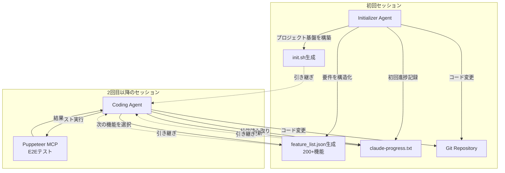

本記事は [Effective harnesses for long-running agents（Anthropic Engineering Blog、2025年11月26日公開）](https://www.anthropic.com/engineering/effective-harnesses-for-long-running-agents) の解説記事です。

## ブログ概要（Summary）

Anthropic Engineeringブログで公開されたこの記事は、コンテキストウィンドウを超える長時間実行エージェントを安定して運用するためのハーネス（制御基盤）設計パターンを解説するものである。著者のJustin Youngらは、2エージェントシステム（Initializer Agent + Coding Agent）による段階的進捗パターン、`claude-progress.txt`によるセッション間状態管理、`feature_list.json`による200以上の機能のトラッキング、Puppeteer MCPによるE2Eテスト自動化を報告している。ブログでは「これらの実践のインスピレーションは、効果的なソフトウェアエンジニアが毎日行っていることから得た」と述べられている。

この記事は [Zenn記事: Bedrock AgentCore Runtimeで8時間連続セッションと状態永続化を実装する](https://zenn.dev/0h_n0/articles/56ef5e7c7fa840) の深掘りです。

## 情報源

- **種別**: 企業テックブログ（Anthropic Engineering Blog）
- **URL**: [https://www.anthropic.com/engineering/effective-harnesses-for-long-running-agents](https://www.anthropic.com/engineering/effective-harnesses-for-long-running-agents)
- **組織**: Anthropic — Justin Young（主著者）、David Hershey, Prithvi Rajasakeran, Jeremy Hadfield, Naia Bouscal 他
- **発表日**: 2025年11月26日

## 技術的背景（Technical Background）

LLMエージェントのコンテキストウィンドウには上限があるため、1つのセッション内で大規模なタスクを完遂できない場合がある。例えば、200機能を持つWebアプリケーションの構築は、単一のコンテキストウィンドウでは処理しきれない。

この課題に対して、ブログでは2つのアプローチが検討されている:
1. **コンテキスト拡張**: より長いコンテキストウィンドウを使う（コスト・レイテンシの問題）
2. **セッション分割＋状態引き継ぎ**: 複数のセッションに分割し、セッション間で状態を引き継ぐ

ブログの著者らは後者のアプローチを採用し、人間のソフトウェアエンジニアの作業パターン——Gitによるバージョン管理、タスクボードによる進捗管理、テストスイートによる品質保証——をエージェントのハーネス設計に応用した。

## 実装アーキテクチャ（Architecture）

### 2エージェントシステム

ブログで提案されているアーキテクチャは、2種類のエージェントロールで構成される。



**Initializer Agent**: 初回セッションのみで使用され、以下を生成する:
- `init.sh`: 開発サーバー起動と基本的なE2Eテストの自動化スクリプト
- `feature_list.json`: 200以上の機能定義（各機能にテストステップと`passes`ブール値を含む）
- `claude-progress.txt`: セッション間で引き継がれる進捗ログ

**Coding Agent**: 2回目以降のセッションで使用され、以下の手順で作業する:
1. `pwd`で作業ディレクトリを確認
2. Gitログと`claude-progress.txt`を読み取り
3. `feature_list.json`から最優先の未完了機能を選択
4. `init.sh`で開発サーバーを起動
5. E2Eテストで基本動作を確認
6. 機能実装を開始

### 状態永続化の4つの柱

ブログでは、セッション間の状態引き継ぎを4つのアーティファクトで実現している。

| アーティファクト | 役割 | 更新タイミング |
|----------------|------|--------------|
| `init.sh` | 環境セットアップの自動化 | 初回のみ |
| `claude-progress.txt` | セッション単位の作業ログ | 各セッション終了時 |
| `feature_list.json` | 機能の完了/未完了状態 | 機能完了時 |
| Git Repository | コード変更の追跡 | コミット単位 |

ブログの著者らは「エージェントが作業の状態を素早く理解する方法を見つけることが重要な洞察だった」と述べている。これらのアーティファクトにより、新しいセッションのエージェントは数秒で前回の作業状態を把握できる。

### feature_list.jsonの構造

ブログによると、Initializer Agentは200以上の機能を含むJSONファイルを生成する。

```json
{
  "features": [
    {
      "id": "auth-login",
      "description": "ユーザーがメールアドレスとパスワードでログインできる",
      "priority": 1,
      "test_steps": [
        "ログインページに遷移する",
        "メールアドレスとパスワードを入力する",
        "ログインボタンをクリックする",
        "ダッシュボードにリダイレクトされることを確認する"
      ],
      "passes": false
    },
    {
      "id": "auth-register",
      "description": "新規ユーザーがアカウントを登録できる",
      "priority": 2,
      "test_steps": ["..."],
      "passes": false
    }
  ]
}
```

ブログでは「テストを削除または編集することは許容されない。これは機能の欠落やバグにつながる可能性がある」と明確に述べられている。この制約により、エージェントが「テストを修正して通す」という近道を防止している。

### E2Eテストの自動化

ブログでは、Puppeteer MCPによるブラウザ自動化テストが品質保証の中核として使用されている。エージェントは機能実装後、ユニットテストではなくE2Eテストでユーザーワークフローをシミュレーションして検証する。

**既知の制限事項**: ブログでは「ClaudeはPuppeteer MCP経由でブラウザネイティブのアラートモーダルを見ることができない」という制限が報告されている。

## パフォーマンス最適化（Performance）

### セッション起動のオーバーヘッド削減

ブログで紹介されている`init.sh`スクリプトは、セッション起動時のオーバーヘッドを削減する重要な要素である。

従来のアプローチでは、エージェントが毎回環境セットアップを試みるため、以下の重複作業が発生していた:

$$
T_{\text{overhead}} = T_{\text{env\_setup}} + T_{\text{dep\_install}} + T_{\text{server\_start}} + T_{\text{state\_restore}}
$$

`init.sh`の導入により:

$$
T_{\text{overhead}}' = T_{\text{init.sh}} + T_{\text{state\_read}} \ll T_{\text{overhead}}
$$

`init.sh`はべき等に設計されており、依存パッケージが既にインストールされている場合はスキップする。これにより、2回目以降のセッション起動時間が大幅に短縮される。

### 1機能ずつの段階的進捗

ブログの著者らは、エージェントが「一度に1つの機能のみに取り組む」ことを強調している。これは以下の理由による:

1. **コンテキストの効率利用**: 複数機能を並行すると、各機能のコンテキストが競合する
2. **障害の局所化**: 1機能が失敗しても他の機能に影響しない
3. **進捗の可視化**: `feature_list.json`の`passes`フラグで明確にトラッキングできる
4. **品質の担保**: 各機能完了後にE2Eテストで即座に検証できる

### AgentCore Runtimeとの接点

このハーネス設計パターンは、AgentCore Runtimeの以下の機能と組み合わせることでさらに効果を発揮する:

| ハーネス要素 | AgentCore対応機能 | メリット |
|------------|------------------|---------|
| `init.sh` | Session Storage `/mnt/workspace` | セットアップ済み環境の永続化 |
| `claude-progress.txt` | Session Storage | 進捗ファイルのセッション間引き継ぎ |
| `feature_list.json` | Session Storage | 機能状態のセッション間引き継ぎ |
| Puppeteer E2E | InvokeAgentRuntimeCommand | テスト実行の確定的制御 |
| Git操作 | InvokeAgentRuntimeCommand | コミット・プッシュの確定的実行 |

AgentCore RuntimeのSession Storageを使えば、`init.sh`による環境構築結果（インストール済みパッケージ、ビルド成果物）がmicroVM停止後も保持されるため、翌日のセッション再開時に`init.sh`の実行自体が不要になる。

## 運用での学び（Production Lessons）

ブログでは、長時間実行エージェントの運用で遭遇する典型的な障害モードとその対策が報告されている。

| 問題 | 対策 |
|------|------|
| エージェントが時期尚早に完了を宣言する | `feature_list.json`の`passes`フラグによる客観的な完了判定 |
| コードがバグのある状態で放置される | 各セッション終了時のGitコミット + `claude-progress.txt`更新 |
| テストなしで機能完了とマークされる | Puppeteer MCPによるE2Eテストの明示的な実行要求 |
| セットアップ作業の重複 | `init.sh`によるべき等な環境セットアップ |
| ブラウザ自動化の制限 | ネイティブアラートモーダル等の既知制限をシステムプロンプトに明記 |

**ブログの重要な引用**: 「これらの実践のインスピレーションは、効果的なソフトウェアエンジニアが毎日行っていることを知っていたことから得た」

この洞察は、エージェントシステムの設計において、人間のワークフロー（バージョン管理、タスクボード、テストスイート、ペアプログラミング）をそのまま適用することの有効性を示唆している。

## 学術研究との関連（Academic Connection）

ブログで提案されているハーネス設計パターンは、以下の学術研究と関連している。

- **SWE-bench（Jimenez et al., 2024）**: ソフトウェアエンジニアリングエージェントの評価ベンチマーク。ブログのハーネスパターンは、SWE-benchの「issue解決」タスクをスケールアップし、複数セッションにまたがるプロジェクト構築タスクに拡張したものと位置づけられる
- **OpenHands（Wang et al., 2024, arXiv:2405.04798）**: Dockerサンドボックスベースのエージェントプラットフォーム。ブログのハーネスパターンは、OpenHandsの実行環境上に構築可能な設計ガイドラインとして位置づけられる
- **AgentScope（Gao et al., 2023, arXiv:2312.07925）**: 分散マルチエージェントプラットフォーム。ブログの2エージェントシステム（Initializer + Coding）は、AgentScopeのエージェント間協調パターンの具体的な実装例である

## 将来の研究方向

ブログの最後で、著者らは以下のオープンクエスチョンを提示している:

- **マルチエージェント特化**: テストエージェント、QAエージェント、クリーンアップエージェントなど、役割を分化させた複数エージェント構成は単一汎用エージェントより効果的か
- **ドメイン汎化**: Web開発以外の分野（科学研究、金融モデリング）への適用可能性
- **特化型アーキテクチャ**: 専門エージェントアーキテクチャによる性能改善の可能性

## まとめと実践への示唆

Anthropic Engineeringブログで解説されたハーネス設計パターンは、長時間実行エージェントの3つの根本課題——コンテキスト制約の克服、セッション間状態の引き継ぎ、品質保証の自動化——に対する実践的な解決策を提示している。

実務への示唆として、以下の3点が重要である:

1. **状態永続化の明示的設計**: `claude-progress.txt`と`feature_list.json`のような、エージェントが読み書きする明示的な状態ファイルを定義する。暗黙的なコンテキスト依存ではなく、永続化された外部状態に基づく判断を促す設計にする
2. **確定的操作の分離**: エージェントの推論（非確定的）とテスト実行・Git操作（確定的）を分離する。AgentCore RuntimeのInvokeAgentRuntimeCommandはこの分離を支援する
3. **べき等な環境セットアップ**: `init.sh`に相当するべき等なセットアップスクリプトを用意し、AgentCore RuntimeのSession Storageと組み合わせてセットアップ時間を最小化する

## 参考文献

- **Blog URL**: [Effective harnesses for long-running agents](https://www.anthropic.com/engineering/effective-harnesses-for-long-running-agents)
- **Related Papers**: SWE-bench, OpenHands (arXiv:2405.04798), AgentScope (arXiv:2312.07925)
- **Related Tools**: [Puppeteer MCP](https://github.com/anthropics/anthropic-tools), [Claude Code](https://claude.ai/code)
- **Related Zenn article**: [Bedrock AgentCore Runtimeで8時間連続セッションと状態永続化を実装する](https://zenn.dev/0h_n0/articles/56ef5e7c7fa840)
