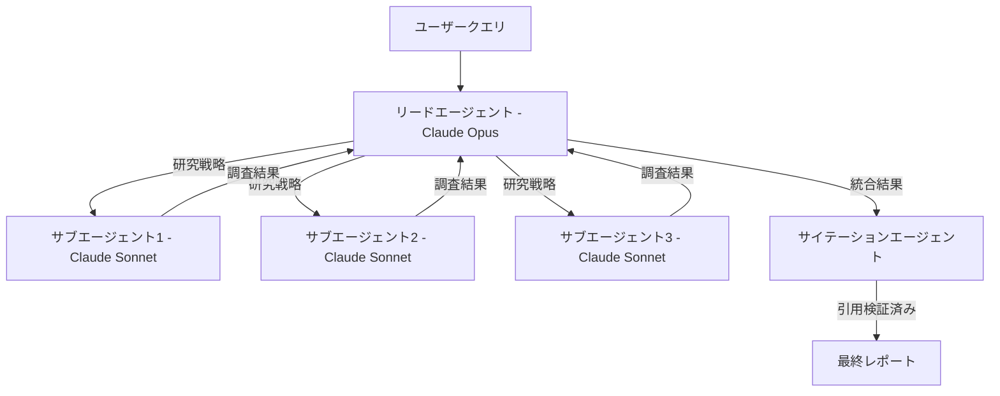

本記事は [Anthropic Engineering Blog: How we built our multi-agent research system](https://www.anthropic.com/engineering/multi-agent-research-system)（2025年6月13日公開）の解説記事です。

## ブログ概要（Summary）

Anthropicは2025年6月、自社のマルチエージェントリサーチプラットフォームの設計・実装・運用について詳細なエンジニアリングブログを公開した。このシステムは**オーケストレータ-ワーカーパターン**を採用し、リードエージェント（Claude Opus）が研究戦略を策定、複数のサブエージェント（Claude Sonnet）が並列に情報収集を実行、最後にサイテーションエージェントが引用元を検証する3層構成をとる。Anthropicの内部評価では、このマルチエージェント構成が単一Claude Opusに対して**90.2%の性能向上**を達成したと報告されている。一方で、マルチエージェントはチャットの約**15倍のトークン**を消費するため、高付加価値タスクにのみ経済的に正当化されるという知見も示されている。

この記事は [Zenn記事: マルチエージェントシステムの進化：古典的MASからLLMベースMASへの技術比較](https://zenn.dev/0h_n0/articles/3848dd01781b58) の深掘りです。

## 情報源

- **種別**: 企業テックブログ
- **URL**: [https://www.anthropic.com/engineering/multi-agent-research-system](https://www.anthropic.com/engineering/multi-agent-research-system)
- **組織**: Anthropic Engineering
- **発表日**: 2025年6月13日

## 技術的背景（Technical Background）

マルチエージェントシステムの研究では、単一の高性能LLMでは対応しきれない複雑なリサーチタスク（多面的な情報収集、相互矛盾する情報源の統合、引用の正確性検証）の需要が高まっていた。Anthropicは自社のClaudeモデルを用いてこの問題に取り組み、プロトタイプから本番サービスに至るまでのエンジニアリング過程を公開している。

このブログの学術的背景として、Wang et al. (2026) のサーベイが示す「4層インタラクション階層」のうち、Anthropicのシステムは**Layer 1（協調アーキテクチャ: 協調型）**と**Layer 2（タスクオーケストレーション: 構造化ワークフロー）**を実装したものと位置づけられる。

## 実装アーキテクチャ（Architecture）

### 3層エージェント構成



**リードエージェント（Lead Agent）**: ユーザークエリを受け取り、研究戦略を策定し、サブエージェントを生成（spawn）する。200,000トークンの上限に近づくと、永続化されたメモリに計画を保存してコンテキストを管理する。

**サブエージェント（Subagents）**: 各サブエージェントは独立した研究側面を担当し、Web検索とインターリーブドシンキング（逐次的な思考と情報評価の交互実行）を用いて情報を収集する。Anthropicはサブエージェントの並列実行と複数ツールの同時呼び出しにより、**リサーチ時間を最大90%短縮**したと報告している。

**サイテーションエージェント**: リサーチ出力を処理し、各主張に対する具体的な引用元を特定する専門エージェント。

### モデル混合戦略

Anthropicのシステムは**モデル混合戦略**の実例である：

| エージェントロール | 使用モデル | 選定理由 |
|----------------|-----------|---------|
| リードエージェント | Claude Opus | 研究戦略の策定、統合、判断に高度な推論能力が必要 |
| サブエージェント | Claude Sonnet | 情報収集タスクにはコスト効率の高いモデルで十分 |
| サイテーション | Claude Sonnet | 引用マッチングは構造化タスクであり軽量モデルで対応可能 |

この構成により、すべてのエージェントにOpusを使用する場合と比較して、コストを大幅に削減しながら性能を維持している。

### 8つのプロンプティング原則

Anthropicが開発過程で得た8つの原則を解説する：

1. **エージェント動作のシミュレーション**: デプロイ前にエージェントの挙動を手動でシミュレートし、障害モードを事前に特定する
2. **オーケストレーションスキルの教育**: サブエージェントに対して具体的な目標、出力形式、ツール利用ガイダンス、タスク境界を明示する
3. **努力の比例配分**: クエリの複雑度に応じてリソース配分を調整する明示的なガイドラインを組み込む
4. **ツール設計の最適化**: 各ツールの目的を明確に区別し、エージェントが適切なツールを選択できるよう説明を記述する
5. **自己改善の有効化**: Claudeが自身の失敗を診断し、プロンプト改善を提案する能力を活用する
6. **まず広く検索**: 狭いドリルダウンの前に、広い探索を優先する
7. **思考プロセスの誘導**: 拡張思考（extended thinking）とインターリーブドシンキングを活用する
8. **並列化**: サブエージェントの並列生成と複数ツールの同時呼び出しを導入する

### 初期段階の障害モード

Anthropicは開発初期に以下の問題に遭遇したと報告している：

- **過剰なサブエージェント生成**: 単純なクエリに対しても多数のサブエージェントを生成してしまう
- **無限検索ループ**: 存在しないソースを探し続ける
- **作業の重複**: 「半導体不足を調査」のような曖昧なタスク記述で、複数のサブエージェントが同一の検索を実行する

解決策として、サブエージェントへの具体的なタスク記述（検索対象・範囲・除外条件の明示）と、リードエージェントによる重複検出メカニズムを導入している。

## Production Deployment Guide

### AWS実装パターン（コスト最適化重視）

Anthropicのオーケストレータ-ワーカーパターンをAWSで実装する際の推奨構成：

| 規模 | 月間リクエスト | 推奨構成 | 月額コスト | 主要サービス |
|------|--------------|---------|-----------|------------|
| **Small** | ~3,000 (100/日) | Serverless | $150-400 | Lambda + Bedrock + SQS |
| **Medium** | ~30,000 (1,000/日) | Hybrid | $800-2,000 | ECS Fargate + Bedrock + ElastiCache |
| **Large** | 300,000+ (10,000/日) | Container | $5,000-15,000 | EKS + Karpenter + Spot Instances |

**Small構成の詳細**（月額$150-400）:
- **Lambda（リードエージェント）**: 4GB RAM, 300秒タイムアウト（$40/月）
- **Lambda（サブエージェント）**: 2GB RAM, 120秒タイムアウト × 並列3-5（$60/月）
- **Bedrock**: Claude Opus（リード）+ Claude Sonnet（サブ/サイテーション）（$200/月）
- **SQS**: サブエージェントタスクキュー（$5/月）
- **DynamoDB**: 研究メモリの永続化（$15/月）

**コスト削減テクニック**:
- Bedrock Prompt Caching: リードエージェントのシステムプロンプト（ロール定義+オーケストレーション指示）をキャッシュし30-90%削減
- モデル混合: リードのみOpus（$15/MTok）、サブエージェントはSonnet（$3/MTok）で約60%削減
- SQSバッチ処理: サブエージェントの結果を非同期で集約しLambda呼び出し回数を削減

**コスト試算の注意事項**: 上記は2026年4月時点のAWS ap-northeast-1（東京）リージョン料金に基づく概算値です。Bedrockの料金はモデルバージョンにより変動します。最新料金は [AWS料金計算ツール](https://calculator.aws/) で確認してください。

### Terraformインフラコード

```hcl
module "vpc" {
  source  = "terraform-aws-modules/vpc/aws"
  version = "~> 5.0"

  name = "multi-agent-research-vpc"
  cidr = "10.0.0.0/16"
  azs  = ["ap-northeast-1a", "ap-northeast-1c"]
  private_subnets = ["10.0.1.0/24", "10.0.2.0/24"]

  enable_nat_gateway   = false
  enable_dns_hostnames = true
}

resource "aws_iam_role" "lead_agent" {
  name = "lead-agent-role"
  assume_role_policy = jsonencode({
    Version = "2012-10-17"
    Statement = [{
      Action    = "sts:AssumeRole"
      Effect    = "Allow"
      Principal = { Service = "lambda.amazonaws.com" }
    }]
  })
}

resource "aws_iam_role_policy" "lead_bedrock" {
  role = aws_iam_role.lead_agent.id
  policy = jsonencode({
    Version = "2012-10-17"
    Statement = [
      {
        Effect   = "Allow"
        Action   = ["bedrock:InvokeModel", "bedrock:InvokeModelWithResponseStream"]
        Resource = [
          "arn:aws:bedrock:ap-northeast-1::foundation-model/anthropic.claude-opus*",
          "arn:aws:bedrock:ap-northeast-1::foundation-model/anthropic.claude-sonnet*"
        ]
      },
      {
        Effect   = "Allow"
        Action   = ["sqs:SendMessage", "sqs:ReceiveMessage", "sqs:DeleteMessage"]
        Resource = aws_sqs_queue.subagent_tasks.arn
      }
    ]
  })
}

resource "aws_lambda_function" "lead_agent" {
  filename      = "lead_agent.zip"
  function_name = "research-lead-agent"
  role          = aws_iam_role.lead_agent.arn
  handler       = "handler.lead_handler"
  runtime       = "python3.12"
  timeout       = 300
  memory_size   = 4096
  environment {
    variables = {
      LEAD_MODEL_ID    = "anthropic.claude-opus-4-6"
      SUB_MODEL_ID     = "anthropic.claude-sonnet-4-6"
      SQS_QUEUE_URL    = aws_sqs_queue.subagent_tasks.url
      DYNAMODB_TABLE   = aws_dynamodb_table.research_memory.name
    }
  }
}

resource "aws_sqs_queue" "subagent_tasks" {
  name                       = "subagent-task-queue"
  visibility_timeout_seconds = 180
  message_retention_seconds  = 3600
}

resource "aws_dynamodb_table" "research_memory" {
  name         = "research-memory"
  billing_mode = "PAY_PER_REQUEST"
  hash_key     = "session_id"
  range_key    = "memory_key"
  attribute {
    name = "session_id"
    type = "S"
  }
  attribute {
    name = "memory_key"
    type = "S"
  }
  ttl {
    attribute_name = "expire_at"
    enabled        = true
  }
}
```

### セキュリティベストプラクティス

- **IAMロール**: リードエージェントとサブエージェントに別々のIAMロールを割り当て、最小権限の原則を適用
- **SQS暗号化**: SSE-SQS（サーバーサイド暗号化）を有効化
- **DynamoDBリサーチメモリ**: KMS暗号化有効化、PII情報の検出・マスキングロジックを実装
- **VPCエンドポイント**: Bedrock、SQS、DynamoDBへのアクセスはVPCエンドポイント経由（パブリックインターネット不使用）

### 運用・監視設定

```python
import boto3

cloudwatch = boto3.client('cloudwatch')

cloudwatch.put_metric_alarm(
    AlarmName='research-agent-token-spike',
    ComparisonOperator='GreaterThanThreshold',
    EvaluationPeriods=1,
    MetricName='TokenUsage',
    Namespace='ResearchAgent/Bedrock',
    Period=3600,
    Statistic='Sum',
    Threshold=500000,
    AlarmDescription='リサーチエージェントのトークン使用量異常（15倍基準で50万トークン/時間超過）',
    ActionsEnabled=True,
    AlarmActions=['arn:aws:sns:ap-northeast-1:123456789:cost-alerts'],
)
```

### コスト最適化チェックリスト

- [ ] リードエージェントのみOpus、サブエージェント/サイテーションはSonnet
- [ ] Bedrock Prompt Caching有効化（システムプロンプト固定部分）
- [ ] サブエージェントの並列数上限設定（コスト制御）
- [ ] SQSバッチ処理による非同期集約
- [ ] DynamoDB On-Demand（低トラフィック時に最適）
- [ ] Lambda Reserved Concurrencyで並列実行数を制限
- [ ] CloudWatch Logs保持期間30日
- [ ] AWS Budgets: 月額予算$500で80%アラート
- [ ] X-Ray トレーシング有効化（ボトルネック特定）
- [ ] Cost Anomaly Detection有効化

## パフォーマンス最適化（Performance）

Anthropicが報告するパフォーマンス指標：

- **性能向上**: マルチエージェント構成が単一Claude Opusに対して90.2%の性能向上（内部リサーチ評価）
- **トークン消費**: チャットの約15倍（シングルエージェントの約4倍、マルチエージェントの約15倍）
- **分散の説明**: トークン使用量だけで品質の分散の80%を説明可能。モデル選択とツール呼び出しが残りの要因
- **並列化効果**: サブエージェントの並列生成と複数ツール同時呼び出しでリサーチ時間を最大90%短縮

**チューニングのポイント**:
- 20件程度の代表的クエリで初期評価を行い、劇的な改善が観測できる（小規模テストの有効性）
- LLM-as-judgeによる自動評価が有効だが、ハルシネーション・システム障害・ソース選択バイアスの検出には人間によるテストが不可欠

## 運用での学び（Production Lessons）

### 状態管理とエラー回復

長時間実行されるエージェントはチェックポイントベースの状態管理が必要である。Anthropicはエラー発生時に最初からやり直すのではなく、チェックポイントから再開する設計を採用している。LLMの知能を活用して、障害を「gracefulに」処理する。

### デバッグの複雑性

同一の入力に対しても非決定的な挙動が発生するため、「フルプロダクショントレーシング」が必須である。ただし、ユーザープライバシーを損なわない形でのトレーシング設計が課題となる。

### デプロイメント戦略

Anthropicは**レインボーデプロイメント**を実装している。通常のBlue-Greenデプロイメントと異なり、進行中のエージェントプロセスを中断せずに段階的にトラフィックを新バージョンに移行する方式である。これはエージェントの処理が数分〜数十分に及ぶため、従来のデプロイメント手法では進行中のタスクが失われるリスクがあるためである。

## 学術研究との関連（Academic Connection）

Anthropicのシステムは以下の学術的概念を実装している：

- **オーケストレータ-ワーカーパターン**: Wang et al. (2026) のLayer 2「構造化ワークフロー」に対応
- **モデル混合戦略**: Guo et al. (2024) が示す「コスト最適化のためのモデル選択」の実践例
- **インターリーブドシンキング**: Chain-of-Thought推論の拡張であり、情報収集と推論を交互に実行するReActパターンの変形

## まとめと実践への示唆

Anthropicのブログは、「プロトタイプと本番環境の間のギャップは予想以上に大きい」という重要な教訓を提示している。マルチエージェントシステムの本番運用には、包括的なテスト、精緻なプロンプトエンジニアリング、堅牢な運用プラクティス、リサーチ・プロダクト・エンジニアリングチーム間の密接な協力が不可欠である。トークン経済性の観点から、マルチエージェント構成はリサーチ、コード生成、複雑な分析など、高付加価値タスクにのみ正当化される。

## 参考文献

- **Blog URL**: [https://www.anthropic.com/engineering/multi-agent-research-system](https://www.anthropic.com/engineering/multi-agent-research-system)
- **Related Papers**: Wang et al. (2026) [https://arxiv.org/abs/2604.18133](https://arxiv.org/abs/2604.18133)
- **Related Zenn article**: [https://zenn.dev/0h_n0/articles/3848dd01781b58](https://zenn.dev/0h_n0/articles/3848dd01781b58)
