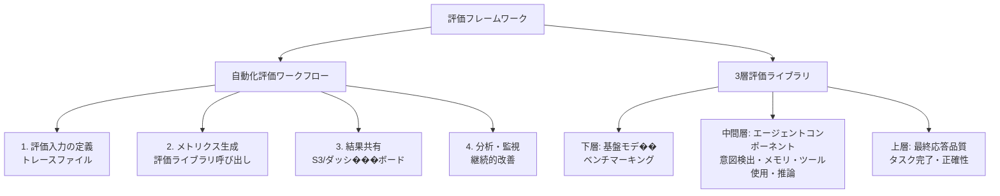

本記事は [AWS Machine Learning Blog: Evaluating AI agents: Real-world lessons from building agentic systems at Amazon](https://aws.amazon.com/blogs/machine-learning/evaluating-ai-agents-real-world-lessons-from-building-agentic-systems-at-amazon/) の解説記事です。

## ブログ概要（Summary）

Amazonは2025年以降、社内で数千のAIエージェントを構築した経験から、エージェント評価の包括的なフレームワークを公開した。著者らは、従来のLLMベンチマーク（単一モデルの静的評価）ではエージェントシステムの品質を測定できないと指摘し、**自動化評価ワークフロー**と**3層評価���イブラリ**からなる���レームワークを提案している。このフレームワークは、基盤モデル性能・エージェントコンポーネント品質・最終応答品質の3層を統合的に評価する。

この記事は [Zenn記事: AgentFlow×LangGraphで構築するEC問い合わせエージェントのマ��チターン精度評価](https://zenn.dev/0h_n0/articles/2fb081aea94bd5) の深掘りです。

## 情報源

- **種別**: 企業テックブログ
- **URL**: [https://aws.amazon.com/blogs/machine-learning/evaluating-ai-agents-real-world-lessons-from-building-agentic-systems-at-amazon/](https://aws.amazon.com/blogs/machine-learning/evaluating-ai-agents-real-world-lessons-from-building-agentic-systems-at-amazon/)
- **組織**: Amazon / AWS
- **発表日**: 2025年

## 技術的背景（Technical Background）

単一モデルベンチマーク（MMLU、HumanEvalなど）は、個々のLLMの能力を静的に測定するが、エージェントシステムの品質を十分に捕捉できない。著者らは以下の理由を挙げている。

1. **非決定的な実行パス**: エージェントは同一入力に対して異なるツール呼び出し系列を選択する可能性がある
2. **創発的な振る舞い**: マルチエージェント構成では、個々のエージェントの性能からは予測できない振る舞いが生じる
3. **ツール選択の精度**: 正しいツールを正しいパラメータで呼び出すという、従来のNLPタスクにはない評価次元が存在する
4. **メモリとコンテキスト管理**: 長いマルチターン対話でのコンテキスト保持能力は、静的ベンチマークでは測定不能

著者らは、「従来のLLM評価手法はエージェントシステムをブラックボックスとして扱い最終結果のみを評価するが、なぜ失敗したかを特定するには不十分」と指摘している。

## 実装アーキテクチャ（Architecture）

### 評価フレームワークの全体像

Amazonの評価フ���ームワークは2つのコアコンポーネントで構成される。



### 3層評価ライブラリの詳細

#### 下層: 基盤モデルベンチマーキング

使用する基盤モデル（Claude、Titan、Llama等）の基礎性能を標準ベンチマークで測定する。これはエージェントシステムの性能下限を規定する。

#### 中間層: エー���ェントコンポーネント評価

エージェントの各コンポーネントを独立して評価する。著者らが定義する評価次元は以下の通り。

| コンポーネント | メトリクス | 測定方法 |
|:--------------|:----------|:---------|
| 意図検出 | 意図分類正確性 | ゴールデンデータセットとの比較 |
| メモリ | コンテキスト検索正確性 | 検索結果の適合率・再現率 |
| ツール使用 | ツール選択正確性、パラメータ正確性 | グラウンド��ゥルースとの完全一致 |
| 推論 | 推論の根拠付け・忠実性 | LLM-as-judgeによる評価 |

この層は、Zenn記事のL1（ツール正確性）に対応する。ツール名とパラメータの正確性を独立して測定することで、ルーティングの問題とツール呼び出しの問題を切り分けられる。

#### 上層: 最終応答品質

ユーザーに対する最終的な応答の品質を測定する。

- **正確性（Correctness）**: 回答が事実に基づいているか
- **忠実性（Faithfulness）**: 取得した情報に忠実な回答か
- **有用性（Helpfulness）**: ユーザーのタスク達成に役立つか
- **関連性（Relevance）**: ユーザーの質問に関連する回答か
- **簡潔性（Conciseness）**: 冗長でない適切な長さか

### マルチエージェントシステムの評価

著者らは、マルチエージェントシステムでは個々のエージェント性能に加え、**集団動態**の評価が必要であると指摘している。

| メトリクス | 説明 |
|:----------|:-----|
| 計画スコア | サブタスクの適切な割り当て成功��� |
| 通信スコア | エージェント間メッセージの品質 |
| 協調成功率 | 複数エージェントが協調してタスクを完了した割合 |

## 実世界の適用事例

### ショッピングアシスタントエージェント

数百から数千のAPIを統合するショッピングアシスタントの評価課題として、著者らは以下を報告している。

- **ツールスキーマの標準化**: ツール署名・入力バリデーションスキーマ・出力コントラクトの統一フォーマットが必要
- **ゴールデンデータセット構築**: 過去の呼び出しログから正解セットを自動生成
- **LLMによるスキーマ生成の自動化**: LLMを使ってツールスキーマ生成を自動化し、ガバナンスフレームワークで品質を担保

### カスタマーサービスエージェント

意図検出の正確性評価に焦点を当てた事例。

- **LLMシミュレーター**: LLM駆動の仮想顧客ペルソナを使用して多様なユーザーシナリオをシミュレーション
- **匿名化された過去のインタラクション**: 実際の対話データから抽出したグラウンド���ゥルースとの比較
- **継続的なフィードバックループ**: 本番環境のトレースを収集し、評価データセットを定期的に更新

この事例は、Zenn記事のEC問い合わせエージェント評価シナリオと直接的に対応する。

## パフォーマンス最適化（Performance）

### エラー回復能力の評価

著者らは、プロダクショングレードのエージェントには以下のエラー回復能��が必要であると報告している。

1. **不適切な計画からの回復**: 推論モデルが生成した計画の誤りを検出して修正する能力
2. **無効なツール呼び出しの処理**: 存在しないツールの呼び出しや不正なパラメータからの回��
3. **メモリ検索エラーの処理**: コンテキスト情報の取得失敗時のフォールバック戦略
4. **例外後の対話一貫性維持**: エラー発生後も対話の整合性を保つ能力

```python
from dataclasses import dataclass
from enum import Enum


class FailureType(Enum):
    INVALID_PLAN = "invalid_plan"
    INVALID_TOOL_CALL = "invalid_tool_call"
    MALFORMED_PARAMS = "malformed_params"
    MEMORY_RETRIEVAL_ERROR = "memory_retrieval_error"
    TIMEOUT = "timeout"


@dataclass
class ErrorRecoveryMetric:
    """エラー回復能力の評価メ���リクス"""
    failure_type: FailureType
    detection_rate: float
    recovery_rate: float
    coherence_after_error: float

    @property
    def overall_resilience(self) -> float:
        """総合的なレジリエンススコア"""
        return (
            0.3 * self.detection_rate
            + 0.4 * self.recovery_rate
            + 0.3 * self.coherence_after_error
        )


def evaluate_error_recovery(
    agent_traces: list[dict],
    injected_failures: list[FailureType],
) -> list[ErrorRecoveryMetric]:
    """エージェントのエラー回復能力を評価する

    agent_traces: エージェント実行のトレースログ
    injected_failures: 意図的に注入された障害の種類リスト
    """
    metrics = []
    for failure_type in injected_failures:
        relevant_traces = [
            t for t in agent_traces
            if t.get("injected_failure") == failure_type.value
        ]
        detected = sum(
            1 for t in relevant_traces if t.get("failure_detected")
        )
        recovered = sum(
            1 for t in relevant_traces if t.get("recovery_successful")
        )
        coherent = sum(
            1 for t in relevant_traces if t.get("coherence_maintained")
        )
        total = len(relevant_traces) or 1

        metrics.append(ErrorRecoveryMetric(
            failure_type=failure_type,
            detection_rate=detected / total,
            recovery_rate=recovered / total,
            coherence_after_error=coherent / total,
        ))
    return metrics
```

## 運用での学び（Production Lessons）

### 4つの評価ベストプラクティス

著者らは以下の4原則を推奨している。

1. **多次元的な包括評価**: 品質・パ��ォーマンス・責任性・コスト最適化を一括で評価する。単一メトリクスへの過度な依存は盲点を生む
2. **アプリケーション固有メトリクスの定義**: ドメイン専門家が標準メトリクスを超えた独自の成功基準を定義する。ECならば「注文完了率」「返品処理時間」など
3. **Human-in-the-Loop (HITL) 検証**: 高リスクシナリオでは推論チェーンの検証とビジネス要件との整合性確認に人間レビューが不可欠
4. **継続的な本番監視**: ダッシュボード・アラート閾値・フィードバックループを組み合わせた実環境での追跡

### 隠れた障害モード

著者らは、エージェントシステムに特有の障害パターンとして以下を報告している。

- **スケール時の予測不能な振る舞い**: テスト環境で正常に動作するエージェントが、本番の予期しない入力で失敗する
- **もっともらしいが誤った出力**: エージェントが自信ありげに誤った回答を生成し、人間レビューなしでは検出困難
- **非決定的な経路選択**: 同一入力に対して非効率または不正確な判断経路を選択する場合がある

## 学術研究との関連（Academic Connection）

Amazonのフレームワークは以下の学術研究と関連している。

- **CustomerServiceBench** (arXiv:2504.10139): Amazonのカスタマーサービスエージェント評価事例と直接対応。5次元評価（TC/RQ/TUA/PA/DC）はAmazonの3層ライブラリの中間層・上層に対応する
- **JudgeBench** (arXiv:2501.08479): AmazonもLLM-as-judgeを推論の忠実性・根拠付け評価に使用。JudgeBenchのTriple-Eプロトコルはこの用途の信頼性向上に有用
- **AgentBench** (arXiv:2503.18960): インタラクティブ環境でのLLMエージェント評価。Amazonのマルチエージェント評価メトリクス（計画スコア・通信スコア）は独自の拡張

## まとめと実践への示唆

Amazonの評価フレームワークは、エンタープライズ規模でのAIエ��ジェント評価の実践知見を体系化したものである。著者らは、「���来のLLM評価はエージェントシステムの最���結果のみを評価し、な��失敗したかの洞察を提供しない」と指摘し、コンポーネントレベルの分解評価の重���性を強調している。

Zenn記事の3層評価（L1: ��ール正確性、L2: 応答品���、L3: タスク完了率）とAmazonの3層ライブラリ（下層: ��盤モデル、中間層: コ���ポーネント、上層: 応答品質）は構造的に対応しており、Amazonの中間層が提供するメモリ評価・推論忠実性評価はZenn記事の拡張候補として有用である。特に、LLMシミュレーターを使ったカスタマーサービス評価は、Zenn記事のDeepEvalによるシミュレーション生成と組み合わせることで、より現実的な評価が実現できる。

**制約**: 本ブログはAmazon/AWSのエコシステムに基づいており、具体的なメトリクスの数値（精度・閾値など）は公開されていない。また、Amazon Bedrock AgentCore Evaluationsとの連携が前提であり、他のプラットフォームへの移植には追加の作業が必要である。

## 参考文献

- **Blog URL**: [https://aws.amazon.com/blogs/machine-learning/evaluating-ai-agents-real-world-lessons-from-building-agentic-systems-at-amazon/](https://aws.amazon.com/blogs/machine-learning/evaluating-ai-agents-real-world-lessons-from-building-agentic-systems-at-amazon/)
- **Related**: [Strands Agents SDK & Arize AX evaluation](https://aws.amazon.com/blogs/machine-learning/observing-and-evaluating-ai-agentic-workflows-with-strands-agents-sdk-and-arize-ax/)
- **Related Zenn article**: [https://zenn.dev/0h_n0/articles/2fb081aea94bd5](https://zenn.dev/0h_n0/articles/2fb081aea94bd5)
