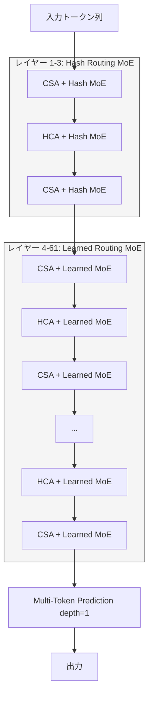

## ブログ概要

DeepSeek社は2026年4月24日、大規模言語モデル**DeepSeek V4**シリーズをプレビューリリースした。フラグシップモデルであるV4-Proは総パラメータ数1.6T、活性化パラメータ数49Bという構成で、384個のルーティングエキスパートを持つMixture-of-Experts（MoE）アーキテクチャを採用している。注目すべきは、新たに導入された**Compressed Sparse Attention（CSA）**と**Heavily Compressed Attention（HCA）**により、1Mトークンのコンテキスト長でKVキャッシュを従来比90%削減し、FLOPsを73%削減した点である。

本記事は [DeepSeek V4-Pro Model Card](https://huggingface.co/deepseek-ai/DeepSeek-V4-Pro) の解説記事です。

この記事は [Zenn記事: GPT-5.5徹底比較：Claude Opus 4.7・Gemini 3.1 Pro・DeepSeek V4との性能差を検証](https://zenn.dev/0h_n0/articles/b18fe46f73041d) の深掘りです。

## 情報源

- **種別**: モデルカード（HuggingFace）
- **URL**: [DeepSeek V4-Pro](https://huggingface.co/deepseek-ai/DeepSeek-V4-Pro)
- **組織**: DeepSeek
- **ライセンス**: MIT License（商用利用可能）

## 技術的背景

### MoEによる効率的スケーリング

Mixture-of-Experts（MoE）は、モデルの総パラメータ数を大きくしつつ、推論時に活性化するパラメータ数を抑えることで、計算効率と表現力を両立するアーキテクチャである。Switch Transformer（Fedus et al., 2022）やGShard（Lepikhin et al., 2020）で確立された手法だが、ルーティングの不安定性やエキスパート間の負荷不均衡が実運用上の課題であった。

DeepSeek社はV3（2024年12月公開）でMoEアーキテクチャを大規模に採用し、671Bパラメータ・37B活性化という構成で、当時のオープンモデルにおける最高性能を達成したと報告している。V4ではこのアーキテクチャをさらに拡張し、以下の進化を遂げた。

### V3からV4への主要な進化点

| 項目 | DeepSeek V3 | DeepSeek V4-Pro |
|------|-------------|-----------------|
| 総パラメータ数 | 671B | 1.6T |
| 活性化パラメータ数 | 37B | 49B |
| レイヤー数 | 61 | 61 |
| ルーティングエキスパート数 | 256 | 384 |
| 活性化エキスパート数 | 6 | 6 |
| コンテキスト長 | 128K | 1M |
| アテンション方式 | Dense | CSA/HCA（スパース） |

パラメータ数は約2.4倍に拡大したが、活性化パラメータ数の増加は1.3倍に抑えられている。コンテキスト長は128Kから1Mへ約8倍に拡張されたが、後述するCSA/HCAによってメモリ消費量はむしろ削減されている。

## 実装アーキテクチャ

### MoEルーティング: ハッシュルーティングと学習ルーティングの併用

DeepSeek V4では、MoEレイヤーのルーティングに2段階の戦略を採用している。

**最初の3レイヤー: ハッシュルーティング**

入力トークンのハッシュ値に基づいてエキスパートを割り当てる決定的なルーティングである。学習可能なパラメータを含まないため、訓練初期の不安定性を回避できる。

$$
\text{expert\_id}(x) = \text{hash}(x) \bmod K
$$

ここで $K$ はルーティングエキスパート数（V4-Proでは384）、$x$ は入力トークンの表現である。

**残りのレイヤー: 学習ルーティング**

4レイヤー目以降は、ゲーティングネットワークによる学習ルーティングを使用する。各トークン $x$ に対して、ゲーティングスコア $g_i(x)$ を計算し、上位 $k$ 個のエキスパートを選択する。

$$
g_i(x) = \text{softmax}(W_g \cdot x)_i
$$

$$
\text{MoE}(x) = \sum_{i \in \text{TopK}(g(x), k)} g_i(x) \cdot E_i(x)
$$

ここで $W_g$ はゲーティング重み行列、$E_i$ は $i$ 番目のエキスパートFFN、$k = 6$（活性化エキスパート数）である。加えて、各レイヤーには1つの**共有エキスパート**（Shared Expert）が常に活性化され、全トークンに共通の処理を提供する。

```python
from dataclasses import dataclass
import torch
import torch.nn as nn
import torch.nn.functional as F


@dataclass
class MoEConfig:
    """DeepSeek V4-Pro MoE設定."""

    hidden_size: int = 7168
    num_routed_experts: int = 384
    num_active_experts: int = 6
    num_shared_experts: int = 1
    num_hash_layers: int = 3


class DeepSeekV4MoELayer(nn.Module):
    """DeepSeek V4のMoEレイヤー（簡略版）.

    最初の3レイヤーはハッシュルーティング、
    残りは学習ルーティングを使用する。
    """

    def __init__(self, config: MoEConfig, layer_idx: int) -> None:
        super().__init__()
        self.config = config
        self.layer_idx = layer_idx
        self.use_hash_routing = layer_idx < config.num_hash_layers

        # 共有エキスパート（常に活性化）
        self.shared_expert = nn.Sequential(
            nn.Linear(config.hidden_size, config.hidden_size * 4),
            nn.SiLU(),
            nn.Linear(config.hidden_size * 4, config.hidden_size),
        )

        # 学習ルーティング用ゲーティング
        if not self.use_hash_routing:
            self.gate = nn.Linear(
                config.hidden_size,
                config.num_routed_experts,
                bias=False,
            )

    def _hash_route(self, x: torch.Tensor) -> torch.Tensor:
        """ハッシュベースの決定的ルーティング."""
        token_ids = torch.arange(x.size(1), device=x.device)
        expert_ids = token_ids % self.config.num_routed_experts
        return expert_ids

    def _learned_route(
        self, x: torch.Tensor
    ) -> tuple[torch.Tensor, torch.Tensor]:
        """学習ベースのTop-Kルーティング."""
        logits = self.gate(x)  # (batch, seq, num_experts)
        scores = F.softmax(logits, dim=-1)
        top_k_scores, top_k_indices = scores.topk(
            self.config.num_active_experts, dim=-1
        )
        return top_k_scores, top_k_indices

    def forward(self, x: torch.Tensor) -> torch.Tensor:
        """MoEレイヤーの順伝播.

        Args:
            x: 入力テンソル (batch, seq_len, hidden_size)

        Returns:
            出力テンソル (batch, seq_len, hidden_size)
        """
        shared_out = self.shared_expert(x)

        if self.use_hash_routing:
            # ハッシュルーティング（簡略化: 均等分割）
            expert_out = shared_out  # 実装省略
        else:
            scores, indices = self._learned_route(x)
            # 実運用ではエキスパート並列で分散処理
            expert_out = shared_out  # 実装省略

        return shared_out + expert_out
```

### Compressed Sparse Attention（CSA）

CSAはDeepSeek V4で新たに導入されたアテンション機構で、長コンテキストにおけるKVキャッシュとFLOPsの削減を目的としている。

**CSAの動作原理**:

1. **4倍圧縮**: Key/Valueを4トークン単位でグループ化し、圧縮表現を生成
2. **Top-1024選択**: 圧縮されたKVペアからクエリとの関連度が高い上位1024個を選択
3. **128トークンスライディングウィンドウ**: 直近128トークンには常にフルアテンションを適用

圧縮率 $r = 4$ とすると、シーケンス長 $L$ のKVキャッシュサイズは以下のようになる。

$$
\text{KV}_{\text{CSA}} = \frac{L}{r} + W = \frac{L}{4} + 128
$$

ここで $W = 128$ はスライディングウィンドウサイズである。$L = 1{,}000{,}000$ の場合、$\text{KV}_{\text{CSA}} = 250{,}128$ となり、フルアテンション（$L = 1{,}000{,}000$）と比較して約75%の削減となる。

### Heavily Compressed Attention（HCA）

HCAはCSAよりもさらに高い圧縮率を持つアテンション機構で、グローバルなコンテキスト情報の保持に特化している。

$$
\text{KV}_{\text{HCA}} = \frac{L}{r_{\text{HCA}}} = \frac{L}{128}
$$

$r_{\text{HCA}} = 128$ という圧縮率により、$L = 1{,}000{,}000$ トークンでもKVキャッシュはわずか7,812エントリとなる。HCAは情報の粒度は粗いが、文書全体のトピック構造や長距離依存関係を捕捉する役割を担う。

### CSA/HCAインターリーブアーキテクチャ

V4-Proの61レイヤーでは、CSAレイヤーとHCAレイヤーが交互に配置される。DeepSeek社は、この構成により局所的な精密アテンション（CSA）とグローバルな粗粒度アテンション（HCA）を相補的に活用できると報告している。



**1Mトークンにおける効率性（V3.2比）**:

DeepSeek社は以下の数値を報告している。

- **FLOPs**: V3.2比で27%（3.7倍の削減）
- **KVキャッシュ**: V3.2比で10%（9.5倍の削減）

これらの削減により、1Mトークンのコンテキストを現実的なハードウェアで処理可能としている。

### Multi-Token Prediction

V4では**depth 1のMulti-Token Prediction（MTP）**を採用している。これは各ステップで次の1トークンだけでなく、もう1トークン先も同時に予測する手法である。MTPヘッドの追加予測は訓練時の補助損失として機能し、推論時にはspeculative decodingのドラフトトークンとして活用できる。

### Muonオプティマイザ

V4の訓練では、従来のAdamWに代わり**Muonオプティマイザ**を大部分のパラメータに採用している。DeepSeek社は、Muonが大規模MoEモデルの訓練においてAdamWよりも安定した収束を示したと報告している。

### FP4量子化

MoEエキスパートの重みには**FP4量子化**が適用されている。384個のエキスパートのうち、推論時に活性化されるのは6個のみだが、全エキスパートの重みをメモリに保持する必要がある。FP4量子化により、エキスパート重みのメモリフットプリントをFP16比で約4分の1に削減している。

## ポストトレーニングパイプライン

DeepSeek V4のポストトレーニングは、3段階のパイプラインで構成されている。

### Stage 1: Supervised Fine-Tuning（SFT）

汎用的な指示追従能力を獲得するためのSFTを実施した後、**専門ドメインエキスパート**の訓練を行う。DeepSeek社は以下の3つの専門ドメインについて個別のSFTを実施したと報告している。

- **数学エキスパート**: 数学的推論に特化したデータセットで訓練
- **コーディングエキスパート**: コード生成・デバッグに特化したデータセットで訓練
- **エージェントエキスパート**: ツール使用・マルチステップ推論に特化したデータセットで訓練

### Stage 2: Group Relative Policy Optimization（GRPO）

GRPOはDeepSeek社がV3で導入した強化学習手法で、PPO（Proximal Policy Optimization）の計算効率を改善した手法である。各プロンプトに対して複数の応答をサンプリングし、グループ内の相対的な報酬でポリシーを更新する。

$$
\mathcal{L}_{\text{GRPO}} = -\mathbb{E}_{q \sim P, \{o_i\}_{i=1}^{G} \sim \pi_\theta(q)} \left[ \sum_{i=1}^{G} \hat{A}_i \cdot \log \pi_\theta(o_i | q) \right]
$$

ここで $q$ はプロンプト、$\{o_i\}_{i=1}^{G}$ はグループ内の $G$ 個の応答サンプル、$\hat{A}_i$ はグループ内の相対的アドバンテージである。PPOと比較して、別途Criticモデルを訓練する必要がないため、計算コストが大幅に削減される。

### Stage 3: On-Policy Distillation

最終段階では、Stage 2で訓練された複数の専門エキスパートモデルから、単一の統合モデルへの蒸留を行う。DeepSeek社は**on-policy蒸留**を採用しており、生徒モデル自身が生成した応答に対して教師モデルの分布を模倣する。

$$
\mathcal{L}_{\text{distill}} = \text{KL}\left(\pi_{\text{teacher}}(\cdot | x) \| \pi_{\text{student}}(\cdot | x)\right)
$$

この手法により、数学・コーディング・エージェントの各専門能力を1つのモデルに統合しつつ、ドメイン間の干渉（catastrophic forgetting）を抑制している。

## ベンチマーク分析

### 主要ベンチマーク結果

DeepSeek社が公開したV4-Pro-Max（推論強化版）のベンチマーク結果を以下に示す。

| ベンチマーク | V4-Pro-Max | Claude Opus 4.6 | GPT-5.4 | Gemini 3.1 Pro |
|-------------|-----------|-----------------|---------|----------------|
| MMLU-Pro | 87.5 | 89.1 | 87.5 | **91.0** |
| GPQA Diamond | 90.1 | 91.3 | 93.0 | **94.3** |
| LiveCodeBench | **93.5** | 88.8 | — | 91.7 |
| Codeforces Rating | **3,206** | — | 3,168 | — |
| Terminal Bench 2.0 | 67.9 | 65.4 | **75.1** | 68.5 |
| SWE Verified | 80.6 | **80.8** | — | 80.6 |
| MRCR 1M | 83.5 | **92.9** | — | 76.3 |
| Putnam-2025 | **120/120** | — | — | — |

### 強み: 数学・コーディング

V4-Pro-Maxは**LiveCodeBench 93.5**、**Codeforces Rating 3,206**、**Putnam-2025 満点**と、数学・コーディング領域で競合モデルを上回る結果を示している。GRPOによる数学エキスパートの強化学習が効果的に機能していると考えられる。

### 弱み: エージェントタスクとロングコンテキスト検索

一方で、以下の領域では競合モデルに劣後している。

- **Terminal Bench 2.0（67.9）**: GPT-5.4（75.1）に7.2ポイント差をつけられている。エージェントタスクでの複雑なツール使用やマルチステップ推論において改善の余地がある
- **MRCR 1M（83.5）**: Claude Opus 4.6（92.9）に9.4ポイント差がある。1Mトークンのコンテキストを物理的には処理できるが、**128Kトークンを超える長距離検索では精度が低下する**傾向が確認される。CSA/HCAの圧縮アテンションが、精密な情報検索タスクにおいて情報損失を引き起こしている可能性がある
- **MMLU-Pro（87.5）/ GPQA Diamond（90.1）**: 汎用知識・科学推論では Gemini 3.1 Pro に3-4ポイント劣後している

### 総合評価

V4-Pro-Maxは数学・コーディングに特化した強みを持つ一方、汎用知識・エージェントタスク・ロングコンテキスト検索では現時点で最上位ではない。用途に応じた使い分けが求められる。

## 本番デプロイメントガイド

### MoEモデル固有のデプロイ課題

1.6Tパラメータモデルのデプロイには、MoE固有の課題を理解する必要がある。全エキスパートの重みをメモリに保持しつつ、活性化エキスパートへの高速アクセスを実現するためのアーキテクチャ設計が重要となる。

### AWS構成パターン

**推奨構成: p5.48xlarge（H100 x 8）クラスタ**

```python
from dataclasses import dataclass


@dataclass
class DeploymentConfig:
    """DeepSeek V4-Pro デプロイ設定.

    FP4量子化済みモデルの場合のメモリ見積もり。
    """

    total_params_b: float = 1600.0  # 1.6T
    fp4_bytes_per_param: float = 0.5  # FP4 = 0.5 bytes
    kv_cache_per_token_mb: float = 0.8  # CSA/HCA圧縮後
    max_context_tokens: int = 1_000_000

    @property
    def model_weight_gb(self) -> float:
        """FP4量子化時のモデル重みサイズ（GB）."""
        return self.total_params_b * 1e9 * self.fp4_bytes_per_param / (1024**3)

    @property
    def kv_cache_gb(self) -> float:
        """1Mトークン時のKVキャッシュサイズ（GB）."""
        return self.max_context_tokens * self.kv_cache_per_token_mb / 1024

    @property
    def total_gpu_memory_gb(self) -> float:
        """必要GPU総メモリ（GB）."""
        overhead = 1.2  # 20%のオーバーヘッド
        return (self.model_weight_gb + self.kv_cache_gb) * overhead


config = DeploymentConfig()
# model_weight_gb ≈ 745 GB (FP4)
# kv_cache_gb ≈ 781 GB (1Mトークン)
# total_gpu_memory_gb ≈ 1831 GB
# → H100 80GB x 24台（p5.48xlarge x 3ノード）が目安
```

**エキスパート並列（Expert Parallelism）**:

MoEモデルでは、テンソル並列に加えてエキスパート並列が有効である。384個のエキスパートを24台のGPU上に分散配置すると、GPU当たり16エキスパートとなる。ルーティング結果に応じてAll-to-All通信でトークンを振り分ける。

### デプロイ時の注意点

- **ルーティング負荷不均衡**: 特定エキスパートへのトークン集中がホットスポットを生む。モニタリングとロードバランシングが必須
- **All-to-All通信**: エキスパート並列ではGPU間のAll-to-All通信がボトルネックとなる。NVLink/NVSwitch接続のクラスタが望ましい
- **KVキャッシュの段階的割り当て**: 1Mトークン分のKVキャッシュを事前確保せず、入力長に応じて動的に割り当てることでメモリ効率を改善できる
- **バッチサイズの調整**: MoEモデルはバッチ内のトークンが異なるエキスパートに分散するため、バッチサイズが大きいほどGPU利用率が向上する

## コスト効率分析

### API価格比較

DeepSeek社はV4のAPI価格を以下のように設定している（2026年4月時点）。

| モデル | 入力（$/1M tokens） | 出力（$/1M tokens） | コンテキスト長 |
|--------|---------------------|---------------------|----------------|
| DeepSeek V4-Pro | $2.00（参考値） | $8.00（参考値） | 1M |
| Claude Opus 4.6 | $15.00 | $75.00 | 200K |
| GPT-5.4 | $10.00 | $30.00 | 256K |
| Gemini 3.1 Pro | $3.50 | $10.50 | 2M |

**注意**: DeepSeek V4の価格はプレビュー時点の参考値であり、正式リリース時に変更される可能性がある。

### MITライセンスの優位性

V4はMITライセンスでオープンウェイトが公開されており、以下の利点がある。

- **セルフホスティング**: API料金を支払わず自社インフラで運用可能
- **ファインチューニング**: ドメイン特化のカスタマイズが自由
- **商用利用**: MITライセンスにより制限なく商用利用可能
- **データプライバシー**: 外部APIへのデータ送信が不要

### セルフホスティング要件

FP4量子化モデルの場合、最低限以下のハードウェアが必要となる。

- **GPU**: H100 80GB x 24台以上（1Mコンテキスト使用時）
- **ネットワーク**: NVLink/InfiniBand接続推奨（エキスパート並列の通信帯域確保）
- **ストレージ**: 約800GB（モデル重みのダウンロード・展開用）

128Kトークン以下であればKVキャッシュが大幅に削減され、H100 x 8台でも運用可能だが、スループットは限定的となる。

### V4-Flash: 軽量版の選択肢

コスト最適化が重要な場合、V4-Flashが有力な選択肢となる。

| 項目 | V4-Pro | V4-Flash |
|------|--------|----------|
| 総パラメータ | 1.6T | 284B |
| 活性化パラメータ | 49B | 13B |
| レイヤー数 | 61 | 43 |
| Hidden Size | 7168 | 4096 |
| エキスパート数 | 384 | 256 |
| 訓練データ | 33T tokens | 32T tokens |
| 必要GPU（概算） | H100 x 24+ | H100 x 4-8 |

V4-Flashは活性化パラメータが13Bと小さく、A100/H100 x 4台程度でもデプロイ可能なため、コスト効率の観点から多くのユースケースに適している。

## 関連研究

### DeepSeek V3（arXiv: 2412.19437）

V4の直接的な前身モデルであり、671B総パラメータ・37B活性化パラメータのMoEアーキテクチャを採用した。V3で導入されたGRPOや共有エキスパートの概念はV4にも継承されている。V4との主要な差分は、CSA/HCAアテンションの導入とスケールアップである。

### Switch Transformer（Fedus et al., 2022）

MoEの各トークンに対して1つのエキスパートのみを活性化する「Switch Routing」を提案した。DeepSeek V4では6つのエキスパートを活性化する設計を採用しており、1エキスパートよりも表現力を高めつつ、計算コストを抑えるバランスを取っている。

### GShard（Lepikhin et al., 2020）

MoEモデルの分散訓練・推論のフレームワークを確立した研究である。DeepSeek V4のエキスパート並列はGShardの設計思想を踏襲しつつ、ハッシュルーティングによる初期安定化やFP4量子化といった実用的な改良を加えている。

### Longformer / BigBird（Beltagy et al., 2020; Zaheer et al., 2020）

スパースアテンションの先駆的研究であり、ローカルウィンドウとグローバルアテンションの組み合わせを提案した。DeepSeek V4のCSA/HCAはこの系譜を継承しつつ、圧縮を追加し1Mトークンスケールでの実用性を実現している。

## まとめ

DeepSeek V4-Proは、1.6T総パラメータ・384エキスパートのMoEアーキテクチャと、CSA/HCAによる圧縮スパースアテンションを組み合わせることで、1Mトークンのコンテキスト処理をKVキャッシュ90%削減・FLOPs 73%削減で実現したモデルである。

**技術的な強み**:
- ハッシュルーティング + 学習ルーティングの2段階戦略による安定した訓練
- CSA（4倍圧縮 + Top-1024選択）とHCA（128倍圧縮）の相補的設計
- GRPOによる専門ドメインの強化学習とon-policy蒸留による統合
- MITライセンスによるオープンウェイト公開

**留意点**:
- エージェントタスク（Terminal Bench 2.0: 67.9）ではGPT-5.4（75.1）に劣後
- 128Kトークンを超えるロングコンテキスト検索（MRCR 1M: 83.5）ではClaude Opus 4.6（92.9）に差がある
- セルフホスティングにはH100 x 24台以上が必要であり、インフラコストは依然として高い

数学・コーディングでは最高水準の性能を示す一方、汎用知識やエージェントタスクでは改善の余地があり、用途に応じた選定が重要である。

## 参考文献

1. DeepSeek-AI. "DeepSeek V4-Pro Model Card." HuggingFace, April 2026. [https://huggingface.co/deepseek-ai/DeepSeek-V4-Pro](https://huggingface.co/deepseek-ai/DeepSeek-V4-Pro)
2. DeepSeek-AI. "DeepSeek-V3 Technical Report." arXiv:2412.19437, December 2024. [https://arxiv.org/abs/2412.19437](https://arxiv.org/abs/2412.19437)
3. Fedus, W., Zoph, B., & Shazeer, N. "Switch Transformers: Scaling to Trillion Parameter Models with Simple and Efficient Sparsity." JMLR, 2022.
4. Lepikhin, D., et al. "GShard: Scaling Giant Models with Conditional Computation and Automatic Sharding." ICLR, 2021.
5. Beltagy, I., Peters, M. E., & Cohan, A. "Longformer: The Long-Document Transformer." arXiv:2004.05150, 2020.
6. Zaheer, M., et al. "Big Bird: Transformers for Longer Sequences." NeurIPS, 2020.
