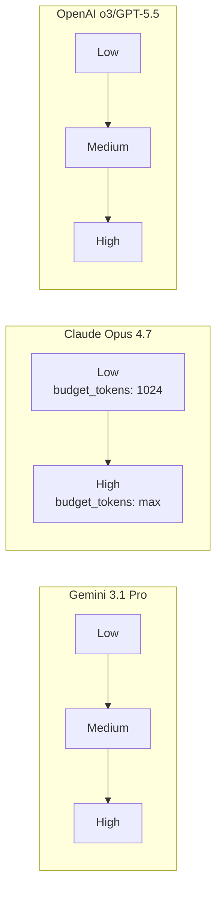
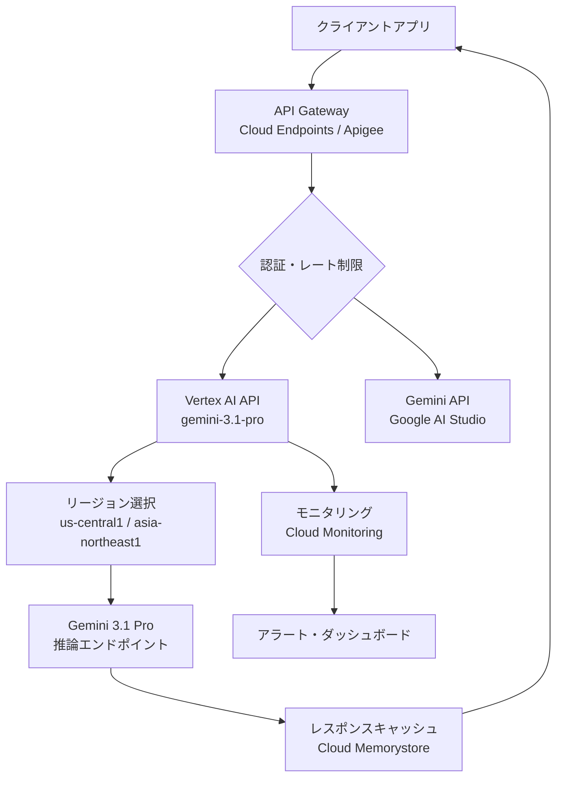

## ブログ概要

本記事は [Google DeepMind公式: Gemini 3.1 Pro](https://deepmind.google/models/gemini/pro/) の解説記事である。Google DeepMindは2026年2月19日にGemini 3.1 Proを公開した。Gemini 3.1 Proは、Transformer系Mixture-of-Experts（MoE）アーキテクチャに基づく推論特化型モデルであり、従来の2段階（low/high）に加えて中間レベル（medium）の推論モードを新設した3段階推論システムを導入している。テキスト・画像・音声・動画・PDF・コードリポジトリをネイティブに処理するマルチモーダルモデルであり、GPQA Diamondで94.3%、MMMULで92.6%を達成したとGoogleは報告している。ただし、Googleが主張する「16ベンチマーク中13で最高スコア」にはTerminal-Bench 2.0やExpert-SWEといったエージェント系ベンチマークが含まれていない点に注意が必要である。本記事の関連Zenn記事として「[GPT-5.5徹底比較：Claude Opus 4.7・Gemini 3.1 Pro・DeepSeek V4との性能差を検証](https://zenn.dev/0h_n0/articles/b18fe46f73041d)」も参照されたい。

## 情報源

| 項目 | 内容 |
|------|------|
| 種別 | 公式モデルカード / 企業テックブログ |
| URL | [https://deepmind.google/models/gemini/pro/](https://deepmind.google/models/gemini/pro/) |
| 組織 | Google DeepMind |
| 発表日 | 2026年2月19日 |
| 知識カットオフ | 2025年1月 |

## 技術的背景

### Gemini 3からGemini 3.1 Proへの進化

Gemini 3（2025年後半）は、Gemini 2世代から大幅にアーキテクチャを刷新し、MoEベースの推論モデルとして登場した。Gemini 3では推論レベルとしてlow（高速・低コスト）とhigh（深い推論・高精度）の2段階が提供されていた。

Gemini 3.1 Proではこの推論システムが拡張され、中間レベルのmediumモードが新設された。これにより、タスクの複雑性に応じて3段階の推論コストと精度のトレードオフを選択可能となった。

### MoEアーキテクチャの推論特化設計

Mixture-of-Experts（MoE）は、モデルの全パラメータのうち一部のエキスパートモジュールのみを活性化することで、計算効率と表現力を両立するアーキテクチャである。MoEにおけるゲーティング関数は以下のように定式化される。

入力トークン $$x$$ に対して、ゲーティングネットワーク $$G$$ が各エキスパート $$E_i$$ の重みを算出する。

$$
G(x) = \text{Softmax}(\text{TopK}(W_g \cdot x + \epsilon))
$$

ここで、$$W_g$$ はゲーティング重み行列、$$\epsilon$$ はロードバランシングのためのノイズ項、TopKは上位K個のエキスパートのみを選択する操作である。最終出力は選択されたエキスパートの重み付き和となる。

$$
y = \sum_{i \in \text{TopK}} G(x)_i \cdot E_i(x)
$$

Googleは、Gemini 3.1 Proにおいて推論タスクに特化したエキスパート構成を採用していると報告しているが、活性化パラメータ数や総パラメータ数は公開されていない。MoEの利点は、推論時の計算コストを総パラメータ数に比して低く抑えられる点にあり、大規模なコンテキストウィンドウ（1Mトークン）との相性が良い。

## 3段階推論システム

### Low / Medium / High の設計思想

Gemini 3.1 Proの3段階推論システムは、計算量と推論深度のトレードオフを明示的に制御する仕組みである。

| 推論レベル | 用途 | 推論深度 | レイテンシ |
|-----------|------|---------|-----------|
| Low | 単純な質問応答、要約、分類 | 浅い | 低 |
| Medium（新設） | 中程度の分析、コード生成、多段推論 | 中間 | 中 |
| High | 複雑な数学、科学的推論、高難度コーディング | 深い | 高 |

Mediumモードの新設は、実運用において「Lowでは精度が不足するがHighでは過剰にコストがかかる」というユースケースに対応するものである。

### 他モデルの推論システムとの比較

推論段階の制御は各社で異なるアプローチが採用されている。



AnthropicのClaude Opus 4.7はExtended Thinkingにおいて `budget_tokens` パラメータで推論トークン量を連続的に制御する設計を採用しており、離散的な段階ではなく連続的なスペクトルとなっている。一方、OpenAI o3/GPT-5.5もlow/medium/highの3段階を提供しており、Gemini 3.1 Proと同様の離散的制御を採用している。

推論レベルの選択は、以下のようにAPIリクエストで指定する。

```python
import google.generativeai as genai
from google.generativeai.types import GenerationConfig

client = genai.GenerativeModel("gemini-3.1-pro")

# Medium推論レベルでの生成
response = client.generate_content(
    contents="量子コンピュータにおけるエラー訂正の最新手法を分析してください。",
    generation_config=GenerationConfig(
        thinking_config={"thinking_level": "medium"},
        max_output_tokens=8192,
    ),
)

print(response.text)
```

## マルチモーダル処理

Gemini 3.1 Proは、テキスト・画像・音声・動画・PDF・コードリポジトリの6種類の入力をネイティブに処理する。「ネイティブ」とは、各モダリティを個別のエンコーダで前処理するのではなく、統合されたアーキテクチャ内で直接処理することを意味する。

### コンテキストウィンドウ設計

| パラメータ | Gemini 3.1 Pro | GPT-5.5 | Claude Opus 4.7 |
|-----------|---------------|---------|----------|
| 入力コンテキスト | 1,000,000 tokens | 1,000,000 tokens | 200,000 tokens |
| 最大出力 | 64,000 tokens | 128,000 tokens | 128,000 tokens |

Gemini 3.1 Proの最大出力トークン数は64K（一部ドキュメントでは65K）であり、GPT-5.5およびClaude Opus 4.7の128Kと比較して半分である。この制約は、長大なコード生成や詳細なレポート生成において実用上の差異を生む可能性がある。

一方、入力コンテキスト1Mトークンは書籍数冊分に相当し、大規模コードベース全体の解析や長時間の動画・音声処理に対応する。

### マルチモーダル入力の実装例

```python
import google.generativeai as genai
from pathlib import Path

model = genai.GenerativeModel("gemini-3.1-pro")

# PDF文書と画像を同時に処理
pdf_file = genai.upload_file(
    path=Path("technical_report.pdf"),
    display_name="技術レポート",
)
image_file = genai.upload_file(
    path=Path("architecture_diagram.png"),
    display_name="アーキテクチャ図",
)

response = model.generate_content(
    contents=[
        pdf_file,
        image_file,
        "このPDFの内容とアーキテクチャ図を比較し、"
        "設計上の改善点を技術的に分析してください。",
    ],
    generation_config={"max_output_tokens": 16384},
)

print(response.text)
```

## ベンチマーク詳細分析

### 主要ベンチマーク結果

Googleが報告している16ベンチマークのうち、他社モデルとの比較が可能な主要結果を以下に整理する。

| ベンチマーク | 評価対象 | Gemini 3.1 Pro | GPT-5.5 | Opus 4.7 |
|-------------|---------|---------------|---------|----------|
| GPQA Diamond | 大学院レベル科学推論 | **94.3%** | 93.6% | 94.2% |
| ARC-AGI-2 | 汎用知能推論 | 77.1% | **85.0%** | — |
| SWE-Bench Verified | ソフトウェア工学（検証済） | 80.6% | — | **87.6%** |
| SWE-Bench Pro | ソフトウェア工学（上級） | 54.2% | 58.6% | **64.3%** |
| Terminal-Bench 2.0 | ターミナル操作 | 68.5% | **82.7%** | 69.4% |
| BrowseComp | Web検索・情報収集 | **85.9%** | 84.4% | 79.3% |
| HLE (Search+Code) | 高難度学習評価 | 51.4% | 52.2% | **54.7%** |
| MMMU-Pro | マルチモーダル理解 | **80.5%** | — | — |
| MMMLU | 多言語知識 | **92.6%** | 83.2% | 91.5% |
| LiveCodeBench Pro | コーディング能力 | **2887 Elo** | — | — |

### 「16ベンチマーク中13で最高スコア」の検証

Googleは「16ベンチマーク中13で最高スコアを記録した」と主張している。しかし、SmartScope.blogの分析が指摘するように、この主張にはいくつかの留意点がある。

**含まれていないベンチマーク**:
- **Terminal-Bench 2.0**（68.5% vs GPT-5.5の82.7%）: ターミナル操作のエージェント的タスク
- **SWE-Bench Pro**（54.2% vs Opus 4.7の64.3%）: 高難度ソフトウェア工学
- **Expert-SWE**: エージェント系ベンチマーク全般

Googleが選択した16ベンチマークには、エージェント系のベンチマーク（ツール使用、長時間のタスク実行、自律的問題解決）が含まれていない傾向がある。エージェント系ベンチマークではGPT-5.5やClaude Opus 4.7が優位に立つケースが多く、ベンチマーク選定自体にバイアスが存在する可能性がある。

### ベンチマーク結果の統計的解釈

GPQA Diamondにおける各モデルのスコア差を検討する。Gemini 3.1 Proの94.3%とClaude Opus 4.7の94.2%の差は0.1ポイントであり、GPT-5.5の93.6%との差も0.7ポイントに過ぎない。GPQA Diamondの問題数（約198問）を考慮すると、この差が統計的に有意かどうかは慎重に判断する必要がある。

二項検定の観点から、正答率 $$p$$ の95%信頼区間は以下で近似される。

$$
p \pm 1.96 \sqrt{\frac{p(1-p)}{n}}
$$

$$n = 198$$、$$p = 0.943$$ の場合、95%信頼区間は約 $$\pm 3.2\%$$ となる。すなわち、94.3%と93.6%の差（0.7ポイント）は信頼区間内に収まっており、統計的有意差があるとは断言できない。

## 料金体系と200Kトークン境界

### 価格構造

Gemini 3.1 Proは、入力コンテキスト長に応じた2段階の価格体系を採用している。

| コンテキスト長 | 入力（/1M tokens） | 出力（/1M tokens） |
|--------------|-------|-------|
| ≤200K tokens | $2.00 | $12.00 |
| >200K tokens | $4.00 | $18.00 |

200Kトークンを超えると入力コストが2倍、出力コストが1.5倍に跳ね上がる。この境界は、長コンテキスト処理の計算コスト増大を反映したものである。

### 競合モデルとのコスト比較

以下に200K以下のコンテキストでの比較を示す。

| モデル | 入力（/1M tokens） | 出力（/1M tokens） | 入出力比 |
|-------|-------|-------|---------|
| Gemini 3.1 Pro | $2.00 | $12.00 | 1:6 |
| GPT-5.5 | $2.00 | $8.00 | 1:4 |
| Claude Opus 4.7 | $15.00 | $75.00 | 1:5 |

Gemini 3.1 ProはClaude Opus 4.7と比較して入力コストが約7.5分の1であるが、出力コストの入力比が1:6とやや高い。GPT-5.5は出力コストが$8.00と最も低く、出力量が多いタスクではコスト優位性がある。

### 長コンテキスト利用時のコスト試算

1Mトークンのコードベースを入力し、8Kトークンの分析レポートを出力するケースを試算する。

```python
from dataclasses import dataclass
from typing import Final


@dataclass(frozen=True)
class PricingTier:
    """モデルの料金体系を表すデータクラス."""

    input_per_million: float
    output_per_million: float
    context_threshold: int  # tokens


# Gemini 3.1 Proの2段階料金
GEMINI_LOW: Final[PricingTier] = PricingTier(2.0, 12.0, 200_000)
GEMINI_HIGH: Final[PricingTier] = PricingTier(4.0, 18.0, 1_000_000)


def calculate_gemini_cost(
    input_tokens: int,
    output_tokens: int,
) -> float:
    """Gemini 3.1 Proの2段階料金を計算する.

    Args:
        input_tokens: 入力トークン数
        output_tokens: 出力トークン数

    Returns:
        合計コスト（USD）
    """
    if input_tokens <= GEMINI_LOW.context_threshold:
        tier = GEMINI_LOW
    else:
        tier = GEMINI_HIGH

    input_cost = (input_tokens / 1_000_000) * tier.input_per_million
    output_cost = (output_tokens / 1_000_000) * tier.output_per_million
    return input_cost + output_cost


# 1Mトークン入力 + 8Kトークン出力のケース
cost = calculate_gemini_cost(1_000_000, 8_000)
print(f"Gemini 3.1 Pro (1M input + 8K output): ${cost:.2f}")
# => Gemini 3.1 Pro (1M input + 8K output): $4.14
```

この計算により、1Mトークンのフルコンテキスト利用時のコストは約$4.14となる。同等のタスクをClaude Opus 4.7（入力200K制限のため複数回に分割が必要）で実行する場合と比較して、Gemini 3.1 Proの長コンテキストは単一リクエストで処理可能という運用上の利点がある。

## Production Deployment Guide

### Vertex AI経由のデプロイメント

Google Cloud上でGemini 3.1 Proを本番運用する場合、Vertex AI APIを通じてアクセスする。以下にPython SDKによる実装パターンを示す。

```python
import vertexai
from vertexai.generative_models import GenerativeModel, GenerationConfig


def initialize_vertex_client(
    project_id: str,
    location: str = "us-central1",
) -> GenerativeModel:
    """Vertex AI経由でGemini 3.1 Proクライアントを初期化する.

    Args:
        project_id: Google CloudプロジェクトID
        location: リージョン（デフォルト: us-central1）

    Returns:
        GenerativeModelインスタンス
    """
    vertexai.init(project=project_id, location=location)
    return GenerativeModel("gemini-3.1-pro")


def generate_with_retry(
    model: GenerativeModel,
    prompt: str,
    *,
    thinking_level: str = "medium",
    max_output_tokens: int = 8192,
    max_retries: int = 3,
) -> str:
    """指数バックオフ付きリトライで生成を実行する.

    Args:
        model: GenerativeModelインスタンス
        prompt: 入力プロンプト
        thinking_level: 推論レベル（low/medium/high）
        max_output_tokens: 最大出力トークン数
        max_retries: 最大リトライ回数

    Returns:
        生成されたテキスト

    Raises:
        RuntimeError: 全リトライ失敗時
    """
    import time
    import random

    config = GenerationConfig(
        max_output_tokens=max_output_tokens,
        thinking_config={"thinking_level": thinking_level},
    )

    for attempt in range(max_retries):
        try:
            response = model.generate_content(
                contents=prompt,
                generation_config=config,
            )
            return response.text
        except Exception as e:
            if attempt == max_retries - 1:
                raise RuntimeError(
                    f"Generation failed after {max_retries} attempts: {e}"
                ) from e
            wait_time = (2 ** attempt) + random.uniform(0, 1)
            time.sleep(wait_time)

    raise RuntimeError("Unreachable")  # type guard
```

### Gemini API（Google AI Studio）経由のアクセス

Google Cloud以外の環境では、Gemini API（Google AI Studio）経由でアクセスする。

```python
import google.generativeai as genai
import os

# API キーによる認証
genai.configure(api_key=os.environ["GEMINI_API_KEY"])

model = genai.GenerativeModel(
    model_name="gemini-3.1-pro",
    system_instruction=(
        "あなたはソフトウェアアーキテクトです。"
        "技術的に正確かつ実装可能な提案を行ってください。"
    ),
)

# ストリーミング生成
response = model.generate_content(
    contents="マイクロサービスアーキテクチャにおける"
    "サーキットブレーカーパターンの実装設計を提案してください。",
    generation_config=genai.GenerationConfig(
        thinking_config={"thinking_level": "high"},
        max_output_tokens=16384,
    ),
    stream=True,
)

for chunk in response:
    if chunk.text:
        print(chunk.text, end="", flush=True)
```

### デプロイメントアーキテクチャ



### 本番運用のチェックリスト

- **レート制限**: Vertex AIのデフォルトクォータを確認し、必要に応じて引き上げ申請
- **リージョン**: `asia-northeast1`（東京）はGemini 3.1 Proの提供状況を事前確認
- **コンテキストキャッシング**: 繰り返し同じプロンプトを使用する場合、Context Cachingを活用してコスト削減
- **出力トークン上限**: 64Kトークンの制約を考慮し、長大な出力が必要な場合は分割生成を設計
- **フォールバック**: Gemini 3.1 Flashへのフォールバックを実装し、可用性を確保

## 安全性評価

### FSFプロトコルとCCL閾値

GoogleはGemini 3.1 Proの安全性評価において、Frontier Safety Framework（FSF）プロトコルに基づく評価を実施したと報告している。評価対象となるCritical Capability Levels（CCL）は以下の4領域である。

| CCL領域 | 評価内容 | 結果 |
|---------|---------|------|
| CBRN | 化学・生物・放射線・核兵器関連 | アラート閾値以下 |
| Harmful Manipulation | 有害な操作・欺瞞 | アラート閾値以下 |
| ML R&D | 機械学習研究開発の自律性 | アラート閾値以下 |
| Misalignment | ミスアラインメント | アラート閾値以下 |

Googleは全4領域でアラート閾値を下回ったと報告しているが、具体的な評価スコアや閾値の数値は公開されていない。この点は、Anthropicが責任あるスケーリングポリシー（RSP）でASL評価の詳細を公開しているのと対照的である。

### 安全性評価の限界

FSFプロトコルによる評価は、あくまで事前定義された危険能力の閾値テストであり、以下の側面はカバーされていない。

- **創発的リスク**: 学習データに含まれない新規のリスクパターン
- **マルチモーダル攻撃**: 画像や音声を介した間接的プロンプトインジェクション
- **長コンテキスト攻撃**: 1Mトークンのコンテキスト内に悪意あるコンテンツを埋め込む手法

## 競合モデルとの比較

### ポジショニングマップ

2026年2月時点の主要モデルの特性を整理する。

| 特性 | Gemini 3.1 Pro | GPT-5.5 | Claude Opus 4.7 | DeepSeek V4 |
|------|---------------|---------|----------|-------------|
| アーキテクチャ | MoE | Dense（推定） | Dense（推定） | MoE |
| 推論段階 | 3段階 | 3段階 | 連続的（budget_tokens） | 2段階 |
| 入力コンテキスト | 1M | 1M | 200K | 128K |
| 出力上限 | 64K | 128K | 128K | 64K |
| マルチモーダル | 6種類 | テキスト+画像+音声 | テキスト+画像 | テキスト+画像 |
| 入力コスト | $2/1M | $2/1M | $15/1M | $0.27/1M |

### 各モデルの強み

**Gemini 3.1 Pro**: マルチモーダルの幅広さ（6種類）、GPQA Diamond・MMMLU・BrowseCompでトップクラスのスコア、1Mコンテキストと低価格の組み合わせ。

**GPT-5.5**: ARC-AGI-2（85.0%）やTerminal-Bench 2.0（82.7%）といったエージェント系ベンチマークでの優位性。出力上限128Kにより長大な生成タスクに適する。

**Claude Opus 4.7**: SWE-Bench Verified（87.6%）やSWE-Bench Pro（64.3%）でのソフトウェア工学分野での優位性。Extended Thinkingによる連続的な推論制御。

**DeepSeek V4**: 圧倒的な低コスト（入力$0.27/1M tokens）。MoEアーキテクチャによる効率性。

### Gemini 3.1 Proの制約

1. **出力トークン上限**: 64Kは競合の128Kの半分であり、長大なコード生成やレポート作成で制約となる
2. **エージェント系ベンチマーク**: Terminal-Bench 2.0やSWE-Bench Proで競合に劣後しており、自律的なタスク遂行能力には改善の余地がある
3. **入力コンテキスト200K超の価格倍増**: 長コンテキストの利用コストが不連続に上昇する
4. **知識カットオフ**: 2025年1月であり、2025年後半以降の情報は含まれない

## まとめ

Gemini 3.1 Proは、MoEアーキテクチャと3段階推論システムにより、科学推論（GPQA Diamond 94.3%）、多言語知識（MMMLU 92.6%）、Web検索（BrowseComp 85.9%）で競合モデルと同等またはそれ以上のスコアを達成している。6種類のマルチモーダル入力と1Mトークンのコンテキストウィンドウは、大規模なドキュメント処理やコードベース分析において実用的な優位性を提供する。

一方で、出力トークン上限64Kの制約、エージェント系ベンチマークでの劣後、200Kトークン超の価格倍増など、用途によっては競合モデルが適する場面も存在する。Googleが主張する「16ベンチマーク中13で最高スコア」は、ベンチマーク選定にエージェント系タスクが含まれていない点を考慮した上で評価する必要がある。

実務的には、マルチモーダル処理の幅広さと長コンテキストの低コストを活かすユースケース（大規模ドキュメント分析、動画・音声を含む情報統合）でGemini 3.1 Proの採用が有利であり、自律的コーディングタスクではClaude Opus 4.7、エージェント系タスクではGPT-5.5が適切な選択肢となる。

## 参考文献

1. Google DeepMind. "Gemini 3.1 Pro Model Card." [https://deepmind.google/models/gemini/pro/](https://deepmind.google/models/gemini/pro/)
2. Google. "Gemini API Documentation." [https://ai.google.dev/gemini-api/docs](https://ai.google.dev/gemini-api/docs)
3. Google Cloud. "Vertex AI - Gemini Models." [https://cloud.google.com/vertex-ai/docs/generative-ai/model-reference/gemini](https://cloud.google.com/vertex-ai/docs/generative-ai/model-reference/gemini)
4. SmartScope.blog. "Gemini 3.1 Pro Benchmark Analysis." Benchmark選定バイアスの分析
5. Zenn記事: "GPT-5.5徹底比較：Claude Opus 4.7・Gemini 3.1 Pro・DeepSeek V4との性能差を検証." [https://zenn.dev/0h_n0/articles/b18fe46f73041d](https://zenn.dev/0h_n0/articles/b18fe46f73041d)
