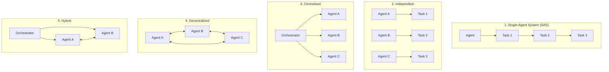
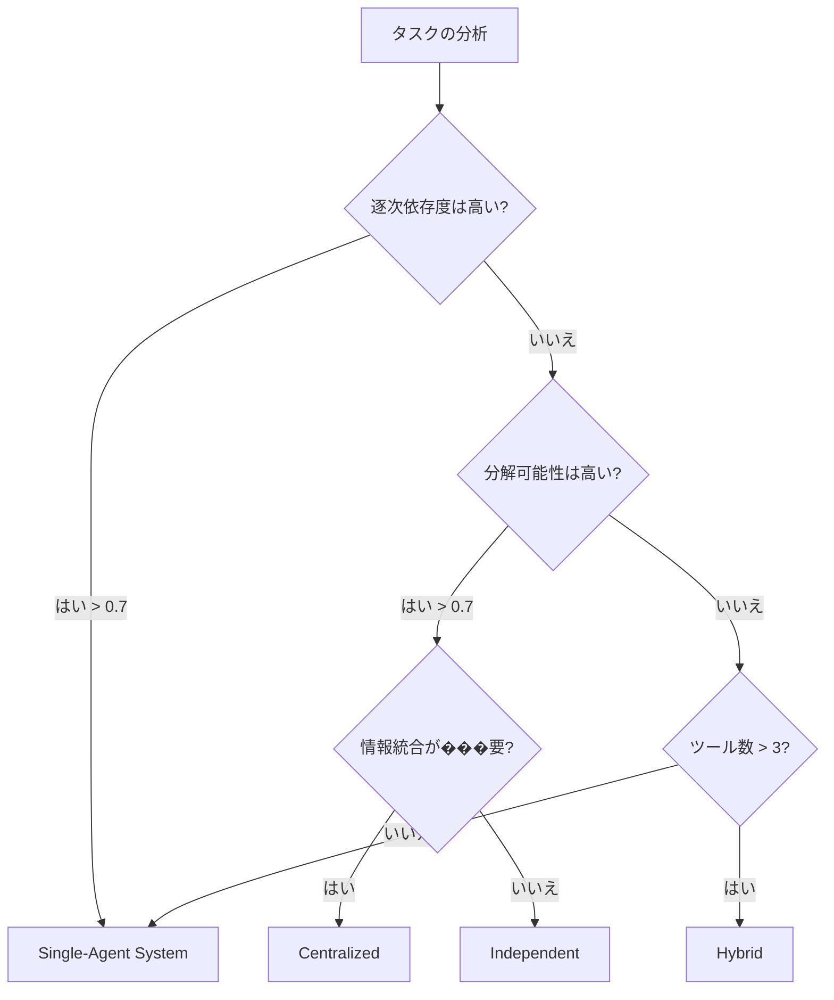

本記事は [Google Research Blog: Towards a Science of Scaling Agent Systems: When and Why Agent Systems Work](https://research.google/blog/towards-a-science-of-scaling-agent-systems-when-and-why-agent-systems-work/)（2026年1月28日公開）の解説記事です。

## ブログ概要（Summary）

Google ResearchのKim & Liu（2026）は、「エージェントを増やせば性能が上がる」という一般的な仮定に対して、180の構成（5アーキテクチャ × 4ベンチマーク × 複数パラメータ）を用いた制御実験を実施し、マルチエージェントシステムの性能がタスク特性に強く依存することを実証した。並列化可能なタスクでは集中型オーケストレーションが最大+81%の性能向上を達成する一方、逐次的なタスクではすべてのマルチエージェント構成が39-70%の性能低下を引き起こすことが報告されている。さらに、タスク特性（ツール数、分解可能性）からアーキテクチャ選択を予測するモデルが87%の精度を達成しており、実務でのアーキテクチャ選定に直接活用できる知見を提供している。

この記事は [Zenn記事: マルチエージェントシステムの���化：古典的MASからLLMベースMASへの技術比較](https://zenn.dev/0h_n0/articles/3848dd01781b58) の深掘りです。

## 情報源

- **種別**: 企業テックブログ（Google Research）
- **URL**: [https://research.google/blog/towards-a-science-of-scaling-agent-systems-when-and-why-agent-systems-work/](https://research.google/blog/towards-a-science-of-scaling-agent-systems-when-and-why-agent-systems-work/)
- **組織**: Google Research
- **著者**: Yubin Kim, Xin Liu
- **発表日**: 2026年1月28日

## 技術的背景（Technical Background）

2025年以降、マルチエージェントシステムの産業適用が急速に進む中、「どのアーキテクチャをどのタスクに適用すべきか」という基本的な問いに対する体系的な回答が不在であった。多くの企業がマルチエージェント構成をデフォルトで採用しているが、単一エージェントで十分なタスクにマルチエージェントを適用するとオーバーヘッドによる性能低下が生じるケースが報告されていた。

Google Researchは、この問題を**制御実験**のアプローチで解決しようと試みた。物理学や生物学における実験的手法をAIシステム設計に適用し、変数を制御しながらアーキテクチャの効果を定量的に測定する方法論を提案している。

## 実装アーキテクチャ（Architecture）

### 評価対象の5アーキテクチャ

著者らは以下の5つのアーキテクチャを評価している。



1. **Single-Agent System（SAS）**: 単一エージェントが統一メモリで逐次実行。ベースライン
2. **Independent**: サブタスクを分割し、エージェント間通信なしで並列実行
3. **Centralized**: ハブ-スポーク型。中央のオーケストレータがタスクを委譲し結果を統合
4. **Decentralized**: メッシュ型。全エージェントがピアツーピアで通信
5. **Hybrid**: 階層型とピアツーピアの複合。オーケストレータが存在しつつ、ワーカー間の直接通信も許容

### 評価ベンチマーク

著者らは4つのベンチマークを使用している：

| ベンチマーク | タスク特性 | 主な評価対象 |
|------------|-----------|------------|
| **Finance-Agent** | 並列化可能な金融推論 | 独立したデータソースからの情報統合 |
| **BrowseComp-Plus** | Web情報探索 | 並列検索と結果統合 |
| **PlanCraft** | 逐次的な計画立案 | 論理的順序依存のタスク分解 |
| **Workbench** | ツール使用 | 複数ツールの協調的使用 |

## 実験結果の詳細分析

### 並列化可能なタスクでの結果

Finance-Agent（金融推論）ベンチマークでは、Centralized（集中型）アーキテクチャが単一エージェント比で**+81%**の性能向上を達成したと著者らは報告している。これは、収益分析・コスト分析・市場比較といった独立したサブタスクを異なるエージェントに同時に割り当てることで、情報収集の並列化が効果を発揮した結果である。

### 逐次的なタスクでの結果

PlanCraft（計画立案）ベンチマークでは、すべてのマルチエージェント構成が**39-70%の性能低下**を示したと著者らは報告している。計画立案タスクでは各ステップが前のステップの結果に依存するため、タスクを分割すると推論の一貫性が失われる。通信オーバーヘッドが推論を断片化し、単一エージェントの逐次処理の方が効率的であった。

### エラー増幅の分析

著者らが示すエラー増幅の定量的分析は以下の通り：

$$
\text{Error Amplification Factor} = \frac{\text{Multi-Agent Error Rate}}{\text{Single-Agent Error Rate}}
$$

| アーキテクチャ | エラー増幅率 |
|-------------|------------|
| Independent | 最大17.2倍 |
| Centralized | 最大4.4倍 |
| Decentralized | 最大8.7倍 |
| Hybrid | 最大5.1倍 |

Independent構成はエージェント間の検証メカニズムがないため、エラーがそのまま最終結果に反映される。一方、Centralized構成ではオーケストレータが結果を統合する際にバリデーションを行うため、エラー増幅が4.4倍に抑制されている。

著者らは、このエラー増幅の非対称性を以下のように定式化している：

$$
P(\text{system error}) = 1 - \prod_{i=1}^{n} (1 - p_i \cdot \alpha_i)
$$

ここで、$n$ はエージェント��、$p_i$ はエージェント $i$ のエラー確率、$\alpha_i$ はアーキテクチャ依存のエラー伝播係数である。Centralizedでは $\alpha_i < 1$（オーケストレータのフィルタリング効果）、Independentでは $\alpha_i = 1$（フィルタリングなし）となる。

### 予測モデル

著者らは、タスク特性からアーキテクチャ選択を予測するモデルを構築し、**87%の精度**で未知の構成に対する最適アーキテクチャを予測できることを報告している。

予測に使用される主要な特徴量：
- **ツール数**: タスクが使用するツールの種類数
- **分解可能性**: タスクが独立したサブタスクに分割可能かどうか（0-1スコア）
- **逐次依存度**: ステップ間の依存関係の強さ
- **情報統合の必要性**: 複数の情報源を統合する必要があるか

```python
from dataclasses import dataclass

@dataclass
class TaskProperties:
    """タスク特性に基づくアーキテクチャ選択"""
    tool_count: int
    decomposability: float
    sequential_dependency: float
    information_integration: float

    def predict_architecture(self) -> str:
        """著者らのモデルに基づくアーキテクチャ推奨（簡略化）

        実際の予測モデルは180構成の実験データで学習された
        分類器であり、ここでは判断基準の概要を示す。
        """
        if self.sequential_dependency > 0.7:
            return "single_agent"

        if self.decomposability > 0.7 and self.tool_count > 3:
            return "centralized"

        if self.decomposability > 0.5 and self.information_integration > 0.5:
            return "hybrid"

        if self.decomposability > 0.5:
            return "independent"

        return "single_agent"

# 使用例
finance_task = TaskProperties(
    tool_count=5,
    decomposability=0.9,
    sequential_dependency=0.2,
    information_integration=0.8,
)
print(finance_task.predict_architecture())
# => "centralized" （金融推論: 高い分解可能性、低い逐次依存）

planning_task = TaskProperties(
    tool_count=2,
    decomposability=0.3,
    sequential_dependency=0.9,
    information_integration=0.4,
)
print(planning_task.predict_architecture())
# => "single_agent" （計画立案: 高い逐次依存性）
```

## Production Deployment Guide

### AWS実装パターン（コスト最適化重視）

Google Researchの知見に基づき、タスク特性に応じて動的にアーキテクチャを切り替えるシステムをAWSで実装する場合の構成：

| 規模 | 月間リクエスト | 推奨構成 | 月額コスト | 主要サービス |
|------|--------------|---------|-----------|------------|
| **Small** | ~3,000 (100/日) | Serverless | $100-250 | Lambda + Step Functions + Bedrock |
| **Medium** | ~30,000 (1,000/日) | Hybrid | $500-1,500 | ECS Fargate + Step Functions + Bedrock |
| **Large** | 300,000+ (10,000/日) | Container | $3,000-10,000 | EKS + Karpenter + Spot Instances |

**Small構成の詳細**（月額$100-250）:
- **Lambda（アーキテクチャ分類器）**: 512MB RAM, 10秒タイムアウト — タスク特性を分析し最適アーキテクチャを選択（$5/月）
- **Step Functions**: Single-Agent/Centralized/Hybridワークフローを動的に切り替え（$20/月）
- **Lambda（エージェント）**: 2GB RAM, 120秒タイムアウト（$50/月）
- **Bedrock**: Claude Haiku（分類器）+ Claude Sonnet（エージェント）（$150/月）
- **DynamoDB**: タスク特性と結果のログ保存（$10/月）

**コスト削減テクニック**:
- タスク分類器にHaiku（$0.25/MTok）を使用し、本処理のみSonnet/Opusを使用
- 逐次依存度の高いタスクはSingle-Agent構成に自動ルーティング（マルチエージェントのオーバーヘッド回避）
- Step Functions Express Workflows（短時間タスク向け、最大90%安価）

**コスト試算の注意事項**: 上記は2026年4月時点のAWS ap-northeast-1（東京）リージョン料金に基づく概算値です。最新料金は [AWS料金計算ツール](https://calculator.aws/) で確認してください。

### Terraformインフラコード

```hcl
module "vpc" {
  source  = "terraform-aws-modules/vpc/aws"
  version = "~> 5.0"

  name = "adaptive-agent-vpc"
  cidr = "10.0.0.0/16"
  azs  = ["ap-northeast-1a", "ap-northeast-1c"]
  private_subnets = ["10.0.1.0/24", "10.0.2.0/24"]

  enable_nat_gateway   = false
  enable_dns_hostnames = true
}

resource "aws_iam_role" "agent_lambda" {
  name = "adaptive-agent-lambda-role"
  assume_role_policy = jsonencode({
    Version = "2012-10-17"
    Statement = [{
      Action    = "sts:AssumeRole"
      Effect    = "Allow"
      Principal = { Service = "lambda.amazonaws.com" }
    }]
  })
}

resource "aws_iam_role_policy" "bedrock_policy" {
  role = aws_iam_role.agent_lambda.id
  policy = jsonencode({
    Version = "2012-10-17"
    Statement = [{
      Effect = "Allow"
      Action = ["bedrock:InvokeModel"]
      Resource = [
        "arn:aws:bedrock:ap-northeast-1::foundation-model/anthropic.claude-3-5-haiku*",
        "arn:aws:bedrock:ap-northeast-1::foundation-model/anthropic.claude-3-5-sonnet*"
      ]
    }]
  })
}

resource "aws_lambda_function" "task_classifier" {
  filename      = "classifier.zip"
  function_name = "task-architecture-classifier"
  role          = aws_iam_role.agent_lambda.arn
  handler       = "handler.classify"
  runtime       = "python3.12"
  timeout       = 10
  memory_size   = 512
  environment {
    variables = {
      CLASSIFIER_MODEL_ID = "anthropic.claude-3-5-haiku-20241022-v1:0"
    }
  }
}

resource "aws_sfn_state_machine" "adaptive_workflow" {
  name     = "adaptive-agent-workflow"
  role_arn = aws_iam_role.step_functions.arn
  definition = jsonencode({
    StartAt = "ClassifyTask"
    States = {
      ClassifyTask = {
        Type     = "Task"
        Resource = aws_lambda_function.task_classifier.arn
        Next     = "RouteByArchitecture"
      }
      RouteByArchitecture = {
        Type = "Choice"
        Choices = [
          {
            Variable     = "$.architecture"
            StringEquals = "single_agent"
            Next         = "SingleAgentExecution"
          },
          {
            Variable     = "$.architecture"
            StringEquals = "centralized"
            Next         = "CentralizedExecution"
          }
        ]
        Default = "SingleAgentExecution"
      }
      SingleAgentExecution = {
        Type     = "Task"
        Resource = "arn:aws:lambda:ap-northeast-1:ACCOUNT:function:agent-executor"
        End      = true
      }
      CentralizedExecution = {
        Type = "Parallel"
        Branches = [
          { StartAt = "SubAgent1", States = { SubAgent1 = { Type = "Task", Resource = "arn:aws:lambda:ap-northeast-1:ACCOUNT:function:agent-executor", End = true } } },
          { StartAt = "SubAgent2", States = { SubAgent2 = { Type = "Task", Resource = "arn:aws:lambda:ap-northeast-1:ACCOUNT:function:agent-executor", End = true } } }
        ]
        Next = "AggregateResults"
      }
      AggregateResults = {
        Type     = "Task"
        Resource = "arn:aws:lambda:ap-northeast-1:ACCOUNT:function:result-aggregator"
        End      = true
      }
    }
  })
}

resource "aws_iam_role" "step_functions" {
  name = "adaptive-step-functions-role"
  assume_role_policy = jsonencode({
    Version = "2012-10-17"
    Statement = [{
      Action    = "sts:AssumeRole"
      Effect    = "Allow"
      Principal = { Service = "states.amazonaws.com" }
    }]
  })
}
```

### セキュリティベストプラクティス

- **IAMロール**: 分類器とエージェントに別々のロールを割り当て、最小権限原則を適用
- **Step Functions**: 実行ログをCloudWatch Logsに暗号化保存
- **Bedrock**: VPCエンドポイント経由でのみアクセス

### コスト最適化チェックリスト

- [ ] タスク分類器でSingle-Agent/Multi-Agentを動的に選択
- [ ] 逐次依存度 > 0.7のタスクは自動的にSingle-Agent構成にルーティング
- [ ] 分類器にHaiku（低コスト）、本処理にSonnet（バランス型）を使用
- [ ] Step Functions Express Workflows（5分以内のタスク向け）
- [ ] Centralized構成のサブエージェント並列数上限設定
- [ ] DynamoDB On-Demand（低トラフィック時に最適）
- [ ] CloudWatch Logs保持期間30日
- [ ] AWS Budgets: 月額予算$300で80%アラート
- [ ] エラー増幅率の監視メトリクス設定
- [ ] タスク分類器の精度モニタリング（87%基準）

## パ��ォーマンス最適化（Performance）

### アーキテクチャ選択の判断フロー

著者らの実験結果に基づく実務的な判断基準：



### 実務での適用指針

| ユースケース | 推奨アーキテクチャ | 根拠（著者らの実験より） |
|------------|-----------------|---------------------|
| 金融レポート生成 | Centralized | 独立データソースの並列分析（+81%） |
| コードレビュー | Centralized/Hybrid | ファイル単位の並列レビュー |
| 複雑な計画立案 | Single-Agent | 逐次依存タスクでの性能低下防止（-39〜70%回避） |
| カスタマーサポート | Centralized | FAQ検索と専門知識の並列統合 |
| 逐次ワークフロー | Single-Agent | 論理的順序依存のタスク |

## 運用での学び（Production Lessons）

Google Researchの知見から得られる運用上の教訓：

1. **「とりあえずマルチエージェント」は危険**: 逐次的なタスクにマルチエージェントを適用すると、最大70%の性能低下が生じる
2. **エラー増幅の監視が必須**: Independent構成で最大17.2倍のエラー増幅が発生する。本番環境ではCentralized構成のバリデーション機構が不可欠
3. **タスク特性の事前分析**: 87%の精度でアーキテクチャを予測できるため、タスク分類器を実装する価値がある
4. **小規模実験からの拡大**: 180構成の網羅的テストにより、20件程度の代表的タスクで十分な傾向把握が可能

## 学術研究との関連（Academic Connection）

Google Researchのブログは以下の学術的知見と関連する：

- **Wang et al. (2026)**: 4層インタラクション階層のLayer 1（協調アーキテクチャ選択）に対する実証的エビデンスを提供
- **Guo et al. (2024)**: 通信構造（レイヤー型/スター型/メッシュ型）の選択に対する定量的根拠
- **MACNETの研究**: エージェント数とパフォーマンスのロジスティック成長関係との整合性

## まとめと実践への示唆

Google Researchの研究は、マルチエージェントシステムの設計における「科学的アプローチ」の重要性を示している。エージェント数を増やすことが常に性能向上につながるわけではなく、タスク特性に基づく適切なアーキテクチャ選択が不可欠である。特に、逐次依存度の高いタスクではSingle-Agent構成が最適であり、並列化可能なタスクではCentralized構成が効果的であるという知見は、実務でのアーキテクチャ設計に直接活用できる。

87%の精度で最適アーキテクチャを予測できるモデルの存在は、タスク分類器を本番環境に組み込み、動的にアーキテクチャを切り替える「適応型マルチエージェントシステム」の実現可能性を示唆している。

## 参考文献

- **Blog URL**: [https://research.google/blog/towards-a-science-of-scaling-agent-systems-when-and-why-agent-systems-work/](https://research.google/blog/towards-a-science-of-scaling-agent-systems-when-and-why-agent-systems-work/)
- **Related Papers**: Wang et al. (2026) [https://arxiv.org/abs/2604.18133](https://arxiv.org/abs/2604.18133)
- **Related Zenn article**: [https://zenn.dev/0h_n0/articles/3848dd01781b58](https://zenn.dev/0h_n0/articles/3848dd01781b58)
