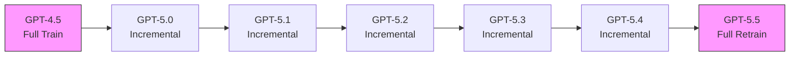
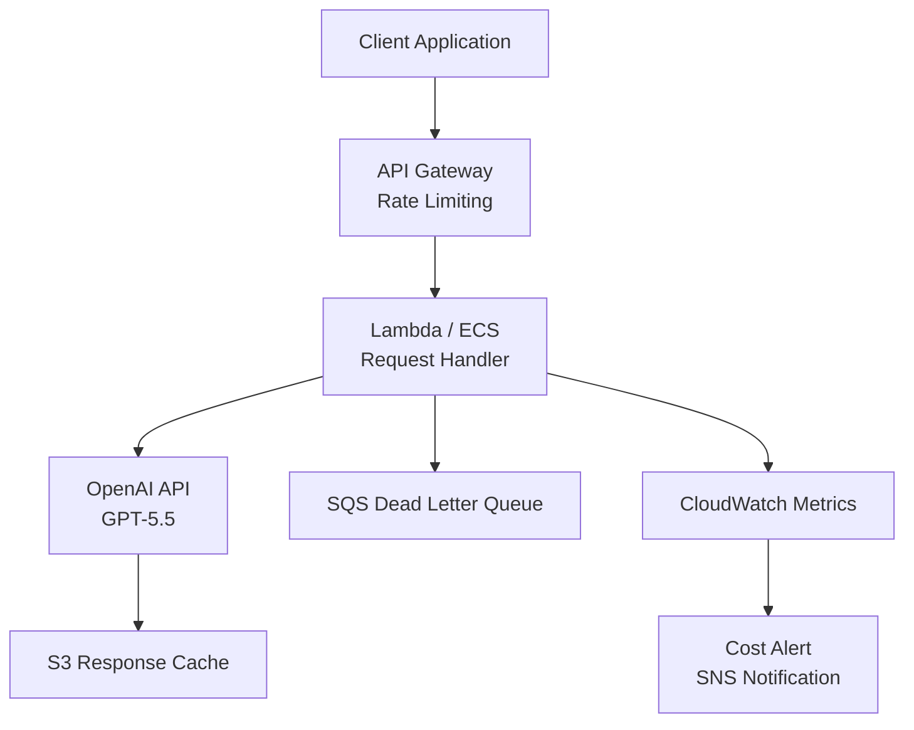

# OpenAI公式ブログ解説: GPT-5.5 — 完全再学習ベースモデルのアーキテクチャと性能分析

## ブログ概要

本記事は [OpenAI公式ブログ: Introducing GPT-5.5](https://openai.com/index/introducing-gpt-5-5/) の解説記事です。

2026年4月23日、OpenAIはGPT-5.5を発表した。GPT-5.5はGPT-4.5以来初となる**完全再学習（full retrain）ベースモデル**であり、GPT-5.0〜5.4が既存モデルへのインクリメンタルな改善であったのに対し、アーキテクチャ、事前学習コーパス、エージェント指向の学習目的関数のすべてを一から再設計している（公式ブログより）。

本記事では、公式発表に基づいてGPT-5.5の技術仕様、ベンチマーク結果、トークン効率、コスト構造、および実運用上の留意点を修士学生レベルの読者向けに解説する。特にエージェント型タスクにおける優位性と、ハルシネーション問題という明確な弱点の両面を分析する。

---

## 情報源

| 項目 | 内容 |
|------|------|
| **発信元** | OpenAI |
| **種別** | 企業公式テックブログ |
| **タイトル** | Introducing GPT-5.5 |
| **URL** | [https://openai.com/index/introducing-gpt-5-5/](https://openai.com/index/introducing-gpt-5-5/) |
| **発表日** | 2026年4月23日 |
| **関連Zenn記事** | [GPT-5.5徹底比較：Claude Opus 4.7・Gemini 3.1 Pro・DeepSeek V4との性能差を検証](https://zenn.dev/0h_n0/articles/b18fe46f73041d) |

---

## 技術的背景

### 完全再学習（Full Retrain）の意義

GPT-5.0からGPT-5.4までの系列は、GPT-4.5の事前学習済みウェイトを基盤としたインクリメンタルな更新であった。具体的には、追加データでのファインチューニング、RLHF/RLAIFの改善、推論チェーンの最適化などが中心であり、ベースアーキテクチャやトークナイザの根本的な変更は行われていなかった（公式ブログより）。

GPT-5.5では以下の3要素を同時に刷新している：

1. **アーキテクチャ**: ネイティブマルチモーダル統合アーキテクチャへの移行
2. **事前学習コーパス**: 学習データの完全な再構築
3. **学習目的関数**: エージェント型タスクを明示的に最適化対象に含めた設計

この「完全再学習」アプローチは計算コストが非常に大きいが、インクリメンタル更新の蓄積による性能上限（いわゆるスケーリングの天井）を突破するために必要とされる。OpenAIはGPT-5.5の学習にNVIDIA GB200およびGB300 NVL72ラックスケールシステムを用いた100,000-GPUクラスタを使用したと報告している（公式ブログより）。

### GPT系列の進化パス



GPT-4.5とGPT-5.5のみが完全再学習モデルであり、その間のバージョンはすべてインクリメンタル更新である。この設計判断は、完全再学習の計算コストとモデル性能改善のトレードオフを反映している。

---

## 実装アーキテクチャ

### ネイティブマルチモーダル統合

GPT-5.5はテキスト、画像、音声、動画を**単一の統合アーキテクチャ**で処理する。従来のGPTシリーズでは、各モダリティに対して個別のエンコーダを接続し、テキストトークン空間へマッピングする「ブリッジ方式」が採用されていた。GPT-5.5ではこれらが事前学習段階から統合されており、モダリティ間の相互参照がアーキテクチャレベルで可能になっている（公式ブログより）。

この設計により、たとえば「動画内の特定フレームに映る数式をテキストで説明し、その数式に基づくPythonコードを生成する」といったクロスモーダルなタスクチェーンが、外部パイプライン無しで実行可能となる。

### コンテキストウィンドウ

| 提供形態 | コンテキスト長 |
|----------|---------------|
| API | 1,000,000 トークン |
| Codex | 400,000 トークン |

1Mコンテキストの実効性は、後述のベンチマーク（MRCR v2, GraphWalks BFS）で検証されている。GPT-5.4の1Mコンテキストベンチマークスコアと比較して大幅な改善が確認されており、コンテキスト長の拡大が単なるスペック上の数値ではなく実用的な性能向上を伴っていることが示唆される。

### 推論レベル

GPT-5.5は2段階の推論レベルを提供する：

- **high**: 標準的な推論深度。大半のタスクに適用
- **xhigh**: 拡張推論モード。数学、形式検証、複雑なコード生成などに使用

推論レベルの切り替えはAPI側で制御可能であり、タスク特性に応じてレイテンシとコストのトレードオフを最適化できる。

### ハードウェアインフラストラクチャ

OpenAIはGPT-5.5をNVIDIA GB200およびGB300 NVL72ラックスケールシステム上で学習・推論している。GB300 NVL72は72基のGPUを単一のラックスケールシステムとして統合し、NVLink 5.0による1.8TB/sの帯域幅でGPU間通信を行う構成である。GPT-5.5の学習では100,000-GPUクラスタが使用されたと報告されている（公式ブログより）。

---

## ベンチマーク詳細分析

### エージェント型ベンチマーク

GPT-5.5が特に強みを示すのは、エージェント型タスク（ツール使用、環境操作、長期計画）に関するベンチマークである。

| ベンチマーク | GPT-5.5 | GPT-5.4 | Opus 4.7 | Gemini 3.1 Pro | 備考 |
|------------|---------|---------|----------|----------------|------|
| Terminal-Bench 2.0 | **82.7%** | 75.1% | 69.4% | 68.5% | ターミナル操作の自律性 |
| OSWorld-Verified | **78.7%** | 75.0% | 78.0% | — | OS操作タスク |
| BrowseComp (Pro) | **90.1%** | 89.3% | 79.3% | 85.9% | Web閲覧・情報収集 |
| CyberGym | **81.8%** | 79.0% | 73.1% | — | サイバーセキュリティ |

Terminal-Bench 2.0では、GPT-5.4から7.6ポイントの改善を達成しており、Opus 4.7（69.4%）およびGemini 3.1 Pro（68.5%）に対して13ポイント以上の差をつけている。これはエージェント指向の学習目的関数による効果と考えられる。

OSWorld-Verifiedでは、GPT-5.5（78.7%）とOpus 4.7（78.0%）が拮抗している点が注目に値する。OS操作という実世界タスクにおいては、モデル間の性能差が縮小している可能性がある。

### 知識・推論ベンチマーク

| ベンチマーク | GPT-5.5 | GPT-5.4 | Opus 4.7 | Gemini 3.1 Pro | 備考 |
|------------|---------|---------|----------|----------------|------|
| GDPval | **84.9%** | 83.0% | 80.3% | 67.3% | 汎用知識評価 |
| GPQA Diamond | 93.6% | 92.8% | **94.2%** | **94.3%** | 大学院レベル科学問題 |
| FrontierMath T4 (Pro) | **39.6%** | 38.0% | 22.9% | 16.7% | 高難度数学 |
| FrontierMath T1-3 | **51.7%** | 47.6% | — | — | 中難度数学 |
| ARC-AGI-2 | **85.0%** | 73.3% | — | 77.1% | 抽象推論 |

GPQA Diamondでは、GPT-5.5（93.6%）がOpus 4.7（94.2%）およびGemini 3.1 Pro（94.3%）にわずかに劣後している。大学院レベルの専門知識問題では、モデル間の性能差が1ポイント未満に収束しつつあることを示している。

一方、FrontierMath T4ではGPT-5.5（39.6%）がOpus 4.7（22.9%）を大きく上回っており、高難度の数学的推論においてはGPT-5.5が優位性を持つ。

### ロングコンテキストベンチマーク

| ベンチマーク | GPT-5.5 | GPT-5.4 | 改善幅 |
|------------|---------|---------|--------|
| MRCR v2 (1M) | **74.0%** | 36.6% | +37.4pt |
| GraphWalks BFS (1M) | **45.4%** | 9.4% | +36.0pt |

ロングコンテキストベンチマークにおける改善幅は劇的である。MRCR v2（1Mトークン）では37.4ポイント、GraphWalks BFS（1Mトークン）では36.0ポイントの改善を達成しており、GPT-5.4がロングコンテキストで大きな課題を抱えていたことと、GPT-5.5がこれを解決したことが明確に示されている。

### GPT-5.5が劣後するベンチマーク

GPT-5.5がすべてのベンチマークで最高性能を達成しているわけではない。第三者評価において以下の結果が報告されている：

| ベンチマーク | GPT-5.5 | Opus 4.7 | 差分 |
|------------|---------|----------|------|
| SWE-Bench Pro | 58.6% | **64.3%** | -5.7pt |
| MCP-Atlas | 75.3% | **77.3%** | -2.0pt |

ソフトウェアエンジニアリングタスク（SWE-Bench Pro）では、Opus 4.7が5.7ポイント上回っている。これは、大規模コードベースの理解と修正においては、エージェント型最適化とは異なる能力が要求される可能性を示唆している。

---

## トークン効率とコスト分析

### トークン効率

OpenAIはGPT-5.5がGPT-5.4と比較して**タスクあたり約40%少ないトークン**で同等の結果を達成すると報告している（公式ブログより）。これは新しいトークナイザの採用と、推論チェーンの効率化によるものと考えられる。

### 価格体系

| モデル | 入力 (per 1M tokens) | 出力 (per 1M tokens) | 備考 |
|--------|---------------------|---------------------|------|
| GPT-5.5 | $5.00 | $30.00 | 標準 |
| GPT-5.5 Pro | $30.00 | $180.00 | xhigh推論 |
| GPT-5.4 | $2.50 | $15.00 | 前世代 |
| Batch/Flex | 0.5x | 0.5x | 非同期処理 |

GPT-5.4からGPT-5.5への移行で、トークン単価は2倍に増加している。ただし、タスクあたりのトークン消費が40%削減されるため、実効コストの増加幅は単純な2倍よりも小さくなる。

### コスト試算の実装例

```python
"""GPT-5.4 → GPT-5.5 移行時の実効コスト比較."""

from dataclasses import dataclass


@dataclass(frozen=True)
class ModelPricing:
    """モデルの価格体系."""

    name: str
    input_per_1m: float
    output_per_1m: float
    token_efficiency: float = 1.0  # GPT-5.4比（1.0 = 同等）


def effective_cost(p: ModelPricing, in_tok: int, out_tok: int) -> float:
    """トークン効率を考慮した実効コスト（USD）を返す."""
    return (in_tok * p.token_efficiency / 1e6 * p.input_per_1m
            + out_tok * p.token_efficiency / 1e6 * p.output_per_1m)


# 1タスクあたり10,000入力 + 2,000出力トークン（GPT-5.4基準）
models = [
    ModelPricing("GPT-5.4", 2.50, 15.00),
    ModelPricing("GPT-5.5", 5.00, 30.00, token_efficiency=0.6),
    ModelPricing("GPT-5.5 Batch", 2.50, 15.00, token_efficiency=0.6),
]
for m in models:
    print(f"{m.name:>15}: ${effective_cost(m, 10_000, 2_000):.4f}")
# GPT-5.4: $0.0550 / GPT-5.5: $0.0660 / GPT-5.5 Batch: $0.0330
```

GPT-5.5の標準価格でもトークン効率の改善により実効コスト増は約20%に抑えられ、Batch/Flex割引を適用するとGPT-5.4比で約40%安くなる。

---

## Production Deployment Guide

### AWSにおけるGPT-5.5デプロイパターン

GPT-5.5をプロダクション環境で利用する際は、リトライ、レート制限、コスト管理を組み込んだ設計が必要となる。



### リトライとコスト管理の実装

```python
"""GPT-5.5 API呼び出しの指数バックオフリトライとコスト管理."""

import time
import random
import logging
from dataclasses import dataclass

import openai

logger = logging.getLogger(__name__)


@dataclass
class GPT55Config:
    """GPT-5.5 API呼び出しの設定."""

    model: str = "gpt-5.5"
    max_retries: int = 3
    base_delay: float = 1.0
    timeout: int = 120
    daily_budget_usd: float = 500.0


def call_gpt55(
    client: openai.OpenAI,
    messages: list[dict[str, str]],
    config: GPT55Config,
    cumulative_cost: float = 0.0,
) -> dict:
    """指数バックオフ+ジッタ付きリトライでGPT-5.5を呼び出す.

    Args:
        client: OpenAI APIクライアント
        messages: メッセージリスト
        config: 呼び出し設定
        cumulative_cost: 累計コスト（USD）。budget超過時にRuntimeError

    Returns:
        content, input_tokens, output_tokens, cost_usdを含む辞書
    """
    if cumulative_cost >= config.daily_budget_usd:
        raise RuntimeError(f"Budget exceeded: ${cumulative_cost:.2f}")

    for attempt in range(config.max_retries):
        try:
            resp = client.chat.completions.create(
                model=config.model, messages=messages, timeout=config.timeout,
            )
            cost = (resp.usage.prompt_tokens / 1e6 * 5.0
                    + resp.usage.completion_tokens / 1e6 * 30.0)
            logger.info("gpt55_ok", extra={
                "event": "gpt55_call", "attempt": attempt + 1, "cost_usd": cost,
            })
            return {"content": resp.choices[0].message.content, "cost_usd": cost}
        except (openai.RateLimitError, openai.APITimeoutError) as e:
            delay = config.base_delay * (2 ** attempt) + random.uniform(0, 1)
            logger.warning("gpt55_retry", extra={
                "event": type(e).__name__, "attempt": attempt + 1, "delay": delay,
            })
            time.sleep(delay)
    raise openai.APIError(f"Failed after {config.max_retries} retries")
```

### モニタリングの要点

| メトリクス | 閾値目安 | アラート条件 |
|-----------|---------|------------|
| TTFT | ~3.0秒 | > 10秒が5分間継続 |
| スループット | ~50 tokens/sec | < 20 tokens/sec |
| エラーレート | < 1% | > 5%が3分間継続 |
| 日次コスト | 予算依存 | 予算の80%到達 |

---

## パフォーマンス最適化

### レイテンシ特性

GPT-5.5のレイテンシ特性は以下の通りである（公式ブログより）：

| 指標 | 値 |
|------|------|
| TTFT (Time to First Token) | ~3.0秒 |
| スループット | ~50 tokens/sec |

TTFT 3.0秒はインタラクティブなチャットUIでは許容範囲であるが、リアルタイム音声対話のような低レイテンシ要件のアプリケーションには課題がある。ストリーミング応答を活用し、最初のトークン到着後に逐次表示することでUXへの影響を緩和できる。

### 推論レベルの使い分け

推論レベルの選択はコストとレイテンシに直接影響するため、タスク特性に応じた使い分けが重要である。

```python
"""推論レベル選択のルーティングロジック."""

from enum import Enum


class ReasoningLevel(Enum):
    """GPT-5.5の推論レベル.

    Attributes:
        HIGH: 標準推論。一般的なタスクに使用
        XHIGH: 拡張推論。数学・形式検証・複雑なコード生成に使用
    """

    HIGH = "high"
    XHIGH = "xhigh"


def select_reasoning_level(task_type: str, complexity_score: float) -> ReasoningLevel:
    """タスク種別と複雑度からGPT-5.5の推論レベルを選択する.

    Args:
        task_type: タスク種別（"math", "code", "chat", "analysis"等）
        complexity_score: 複雑度スコア（0.0〜1.0）

    Returns:
        選択された推論レベル

    Examples:
        >>> select_reasoning_level("math", 0.8)
        <ReasoningLevel.XHIGH: 'xhigh'>
        >>> select_reasoning_level("chat", 0.3)
        <ReasoningLevel.HIGH: 'high'>
    """
    xhigh_tasks = {"math", "formal_verification", "theorem_proving"}
    if task_type in xhigh_tasks:
        return ReasoningLevel.XHIGH
    if task_type == "code" and complexity_score > 0.7:
        return ReasoningLevel.XHIGH
    return ReasoningLevel.HIGH
```

### トークン効率の最大化

GPT-5.5のタスクあたり40%のトークン削減効果を最大限に活用するためには、プロンプト設計においても効率を意識する必要がある。具体的には：

1. **システムプロンプトの構造化**: JSON/YAML形式でコンパクトに記述
2. **Few-shot例の最適化**: 冗長な例を削減し、代表的な例に絞り込む
3. **出力フォーマットの指定**: 構造化出力を要求し、不要な前置きを排除

---

## 運用での学び

### ハルシネーション問題

GPT-5.5の最も深刻な課題はハルシネーション率の高さである。AA-Omniscience（事実正確性ベンチマーク）において、以下の結果が報告されている：

| モデル | 正確性 (Accuracy) | ハルシネーション率 |
|--------|-------------------|-----------------|
| GPT-5.5 | 57% | **86%** |
| Opus 4.7 | — | 36% |
| Gemini 3.1 Pro | — | 50% |

GPT-5.5のハルシネーション率86%は、Opus 4.7（36%）の2倍以上であり、事実に基づく回答の信頼性において大きな課題を抱えている。エージェント型タスクのベンチマークで高い性能を示す一方で、事実に関する正確性ではトレードオフが存在する可能性がある。

### 実運用上の対策

ハルシネーション率の高さを考慮すると、GPT-5.5をプロダクション環境で使用する際には以下の対策が必要となる：

1. **RAG（Retrieval-Augmented Generation）の併用**: 事実に基づく回答が必要な場合、外部知識ソースとの照合を必須とする
2. **出力の検証パイプライン**: 生成された内容をファクトチェックAPIやルールベースの検証器で後処理する
3. **適用領域の選定**: エージェント型タスク（ツール呼び出し、コード生成、環境操作）にはGPT-5.5を、事実検索型タスクにはOpus 4.7やGemini 3.1 Proを使い分ける

### SWE-Bench Proでの劣後

ソフトウェアエンジニアリングベンチマーク（SWE-Bench Pro）でOpus 4.7に5.7ポイント劣後している点は、実際のコーディング業務における選択にも影響する。大規模コードベースのバグ修正やリファクタリングなど、コード理解と精密な変更が求められるタスクでは、GPT-5.5以外のモデルも検討する価値がある。

---

## 学術研究との関連

### スケーリング則との関係

GPT-5.5の完全再学習アプローチは、Kaplan et al. (2020) が提示した**ニューラルスケーリング則**の延長線上にある。スケーリング則は、モデルサイズ $N$、データセットサイズ $D$、計算量 $C$ とテスト損失 $L$ の関係を以下のべき乗則で記述する：

$$L(N, D) \approx \left(\frac{N_c}{N}\right)^{\alpha_N} + \left(\frac{D_c}{D}\right)^{\alpha_D}$$

ここで $N_c, D_c$ は定数、$\alpha_N \approx 0.076, \alpha_D \approx 0.095$ である。インクリメンタル更新ではデータ $D$ のみを増加させるため、$\left(\frac{D_c}{D}\right)^{\alpha_D}$ の項のみが改善される。一方、完全再学習ではモデルアーキテクチャ（$N$ に影響）とデータの両方を同時に最適化できるため、両項を同時に削減する可能性がある。

### Dense vs MoE アーキテクチャ

GPT-5.5のアーキテクチャがDense（全パラメータを常時使用）かMoE（Mixture of Experts、条件付き計算）かは公式には明示されていない。ただし、タスクあたり40%のトークン効率改善と、エージェント型タスクでの選択的な性能向上は、MoEアーキテクチャの特性（タスクに応じたエキスパートの選択的活性化）と整合性がある。

DeepSeek-V3/V4やGemini 3.xがMoEを採用していることから、GPT-5.5もMoE系統のアーキテクチャを採用している可能性はあるが、現時点では推測の域を出ない。

### 評価方法論の課題

GPT-5.5のベンチマーク結果を解釈する際には、評価方法論自体の限界にも留意が必要である。AA-Omniscienceでハルシネーション率86%が報告される一方で、GDPval 84.9%、GPQA Diamond 93.6%という高スコアが並存する。これは、ベンチマーク間で測定している能力の次元が異なることを意味しており、単一のスコアでモデルの「知能」を評価することの限界を示している。

Raji et al. (2021) が指摘するように、AIベンチマークは特定のタスク分布に対する性能を測定しているに過ぎず、汎用的な能力の指標としては不十分である。GPT-5.5のエージェント型ベンチマークでの優位性が、実際のプロダクション環境での優位性に直結するかどうかは、個別のユースケースで検証する必要がある。

---

## まとめと実践への示唆

GPT-5.5はGPT-4.5以来初の完全再学習モデルとして、以下の特徴を持つ：

**強み（公式ベンチマークで確認）:**
- エージェント型タスク（Terminal-Bench 82.7%、BrowseComp 90.1%）での高い性能
- ロングコンテキスト処理の大幅改善（MRCR v2: 36.6% → 74.0%）
- タスクあたり40%のトークン効率改善
- ネイティブマルチモーダル統合

**弱み（第三者評価で確認）:**
- ハルシネーション率86%（AA-Omniscience）
- SWE-Bench Pro 58.6%（Opus 4.7の64.3%に劣後）
- トークン単価の2倍増（ただしトークン効率で緩和）

**実践上の推奨:**
1. エージェント型タスク（ツール使用、環境操作、自律的な問題解決）にはGPT-5.5が適している
2. 事実正確性が重要なタスクでは、RAGの併用またはOpus 4.7等との使い分けを検討する
3. コスト最適化にはBatch/Flex割引（0.5x）の活用を推奨する
4. ロングコンテキストが必要なタスクでは、GPT-5.5が現時点で最も信頼性の高い選択肢である

---

## 参考文献

1. OpenAI. "Introducing GPT-5.5." OpenAI Blog, April 23, 2026. [https://openai.com/index/introducing-gpt-5-5/](https://openai.com/index/introducing-gpt-5-5/)
2. Kaplan, J., McCandlish, S., Henighan, T., et al. "Scaling Laws for Neural Language Models." arXiv:2001.08361, 2020.
3. Raji, I. D., Bender, E. M., Paullada, A., et al. "AI and the Everything in the Whole Wide World Benchmark." NeurIPS 2021 Datasets and Benchmarks Track.
4. NVIDIA. "NVIDIA GB300 NVL72 Architecture." NVIDIA Technical Documentation, 2026.
5. OpenAI. "GPT-5.5 API Documentation." OpenAI Platform, 2026. [https://platform.openai.com/docs/models/gpt-5.5](https://platform.openai.com/docs/models/gpt-5.5)
