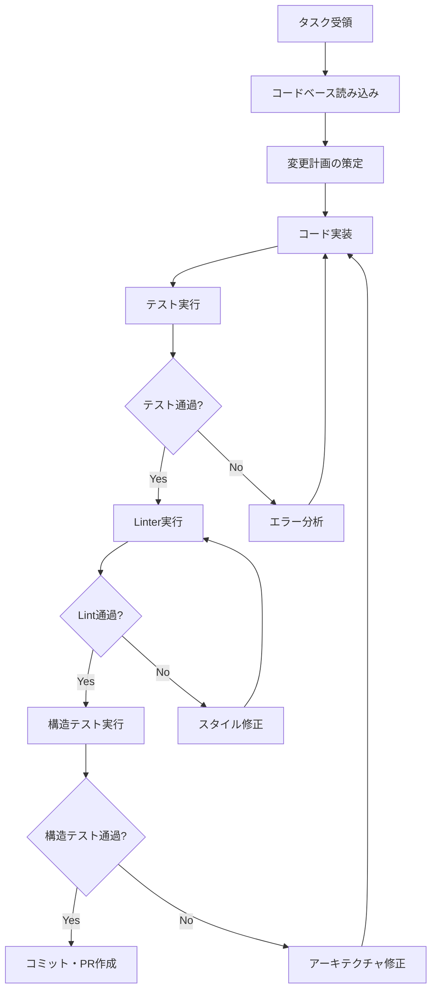
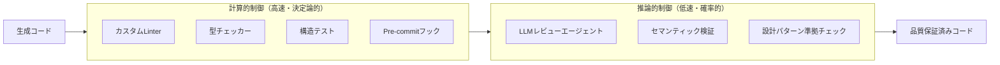
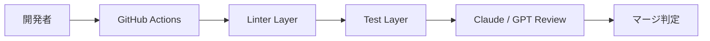
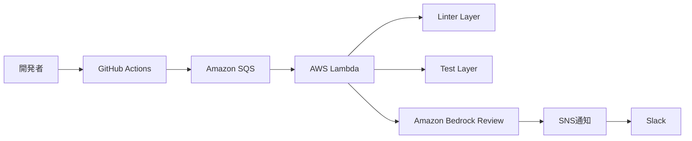
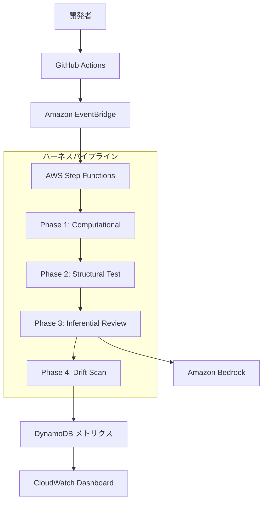
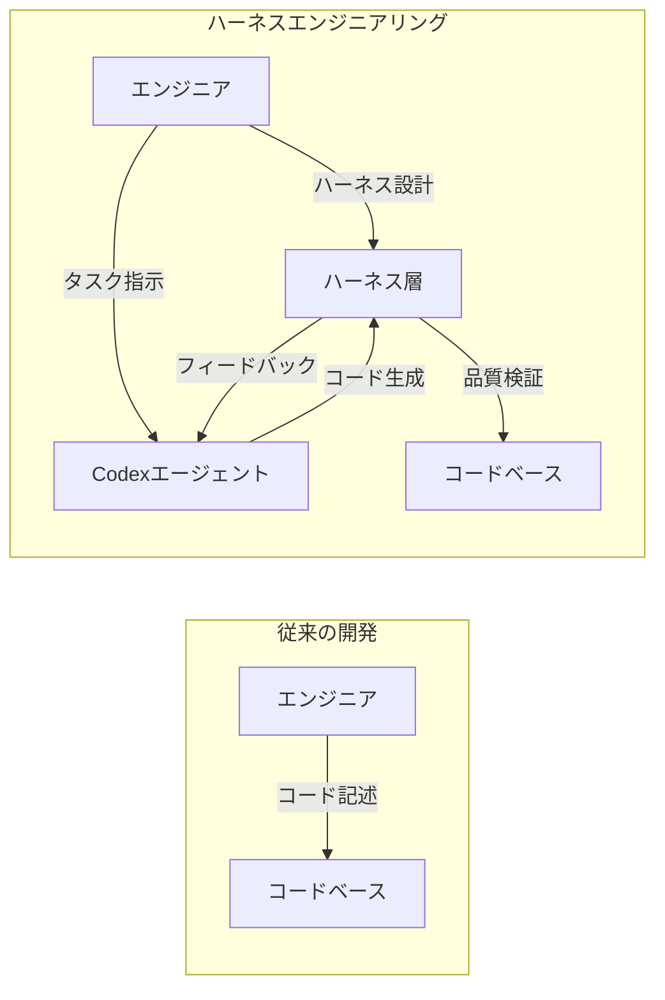

## ブログ概要

OpenAIエンジニアリングチームが、Codexエージェントを活用した5ヶ月間の実験で**約100万行のコードを生成**し、手動コーディングと比較して**約1/10の時間**で完了したと報告している。この実験を通じて得られた知見の中核が**Harness Engineering**（ハーネスエンジニアリング）という概念である。Agent = Model + Harnessというフレームワークに基づき、モデルの出力品質を決定論的・推論的な制御層で囲い込む設計パターンが体系化された。本記事では、この実践報告の技術的詳細を解説する。

この記事は [Zenn記事: LLMエージェントの外部化設計：Memory・Skills・Protocols・Harnessの統一的理解](https://zenn.dev/0h_n0/articles/73bdc5dd332f59) の深掘りです。Zenn記事ではMartin Fowlerのフレームワークを含む統一的な外部化設計を扱っていますが、本記事ではOpenAIチームの実践報告に焦点を当てます。

## 情報源

- **種別**: 企業テックブログ（OpenAI Engineering Blog）
- **URL**: [Harness Engineering](https://openai.com/index/harness-engineering/)
- **組織**: OpenAI
- **公開時期**: 2026年

## 技術的背景

### LLMエージェントにおける品質制御の課題

LLMベースのコーディングエージェントは、プロンプト一つで大量のコードを生成できる。しかし、生成されたコードが組織のスタイルガイド、アーキテクチャ規約、セキュリティポリシーに準拠しているかを担保する仕組みがなければ、技術的負債が急速に蓄積する。OpenAIチームは、3名のエンジニアから始めた実験で、この問題に正面から取り組んだと報告している。

従来のアプローチでは、プロンプトに規約を記述するか、生成後に人間がレビューするかの二択であった。前者はモデルが指示を無視するリスクがあり、後者はスケーラビリティに問題がある。OpenAIチームが提示した解決策は、**モデルの外側に決定論的な安全網を構築する**というハーネスエンジニアリングの考え方である。

### Agent = Model + Harness

この定式化は、Martin Fowlerが提唱したフレームワークと同一の構造を持つ。

$$
\text{Agent}_{\text{effective}} = \text{Model}(p, T) + \text{Harness}(L, S, R)
$$

ここで、$p$ はプロンプト、$T$ は温度パラメータ、$L$ はリンター群、$S$ は構造テスト、$R$ はレビューエージェントを表す。モデル単体の能力向上に依存せず、ハーネス層の設計で品質を制御する点が重要である。

## 実装アーキテクチャ

### Codex Agent Loop

OpenAIが報告するCodexエージェントは、サンドボックス環境内で自律的にコーディングを行うエージェントループである。



このループの特徴は、**テスト→リンター→構造テスト**の順に段階的な品質ゲートを通過させる点にある。各ゲートで不合格の場合、エージェントは自律的に修正を行い、再度検証を試みる。OpenAIチームはこのイテレーションにより、最終的なPRの品質が大幅に向上したと報告している。

### ハーネスコンポーネントの階層構造

OpenAIチームが構築したハーネスは、**計算的制御（Computational Controls）**と**推論的制御（Inferential Controls）**の2層で構成される。



この設計の根幹にあるのは、**決定論的な安全網を先に適用し、確率的な検証は後段で行う**という原則である。

#### 計算的制御の具体例

OpenAIチームが報告するカスタムリンターの例を示す。

```python
"""カスタムリンター: アーキテクチャ規約の強制"""
import ast
from pathlib import Path
from dataclasses import dataclass


@dataclass(frozen=True)
class LintViolation:
    file: Path
    line: int
    rule: str
    message: str


def check_import_boundaries(file_path: Path, source: str) -> list[LintViolation]:
    """モジュール間の依存方向を強制する。

    ドメイン層がインフラ層に依存している場合を検出する。
    """
    violations: list[LintViolation] = []
    tree = ast.parse(source)

    # ドメイン層のファイルがインフラ層をimportしていないか
    if "domain" in str(file_path):
        for node in ast.walk(tree):
            if isinstance(node, ast.Import):
                for alias in node.names:
                    if "infrastructure" in alias.name:
                        violations.append(
                            LintViolation(
                                file=file_path,
                                line=node.lineno,
                                rule="ARCH-001",
                                message=f"ドメイン層からインフラ層への直接依存: {alias.name}",
                            )
                        )
    return violations
```

このようなカスタムリンターは、コードスタイルだけでなく**アーキテクチャ上の不変条件**を機械的に検証する。OpenAIチームはこれを「構造テスト（Structural Tests）」と呼び、通常の単体テストとは区別している。

#### 推論的制御の役割

計算的制御では捕捉できないセマンティックな問題（変数名の意味的な不適切さ、設計意図との乖離、ドキュメントと実装の不整合など）を、LLMベースのレビューエージェントが検出する。OpenAIチームは、この推論的制御を計算的制御の**後段**に配置することで、LLMの推論コストを削減しつつ、品質を確保していると報告している。

### Janitor Armyパターン

OpenAIチームが報告するもう一つの重要なパターンが、**Janitor Army**（清掃員群）である。

```mermaid
flowchart TD
    subgraph JanitorArmy["Janitor Army（定期実行）"]
        J1[ドリフト検出エージェント]
        J2[依存関係更新エージェント]
        J3[デッドコード除去エージェント]
        J4[ドキュメント同期エージェント]
    end

    CB[コードベース] --> J1
    CB --> J2
    CB --> J3
    CB --> J4

    J1 -->|"差分レポート"| PR1[修正PR]
    J2 -->|"更新提案"| PR2[更新PR]
    J3 -->|"除去提案"| PR3[除去PR]
    J4 -->|"同期差分"| PR4[同期PR]

    PR1 --> Review[人間レビュー]
    PR2 --> Review
    PR3 --> Review
    PR4 --> Review
```



Janitor Armyは、タスク駆動のCodexエージェントとは別に**定期的にコードベース全体をスキャン**し、アーキテクチャのドリフト（意図せぬ逸脱）を検出・修正する。OpenAIチームはこのパターンを「ドリフトスキャンエージェント」と呼んでいる。

具体的には以下のような定期タスクが報告されている：

1. **アーキテクチャドリフト検出**: モジュール間の依存関係が設計意図から逸脱していないかを定期スキャン
2. **スタイル統一**: 新規コードが既存のコーディング規約に準拠しているかを検証
3. **技術的負債の検出**: TODO/FIXMEコメントの棚卸し、非推奨APIの使用箇所の検出

### スケーリング：3名から7名への拡大

OpenAIチームは実験期間中にチームを3名から7名に拡大したと報告している。この拡大において、ハーネスが果たした役割は大きい。新規参加メンバーは、ハーネスによる自動検証のおかげで、既存のアーキテクチャ規約を**暗黙知として学ぶ必要がなく**、リンターや構造テストのフィードバックを通じて規約を理解できた。

## Production Deployment Guide

OpenAIの報告に基づき、ハーネスエンジニアリングを自組織のCI/CDパイプラインに導入するための実践ガイドを示す。

### AWS構成パターン

チーム規模に応じた3段階の構成を提案する。

#### Small（チーム3-5名、月間PR 50件以下）



最小構成では、GitHub Actionsのみで完結する。

```hcl
# terraform/small/main.tf
resource "aws_s3_bucket" "harness_artifacts" {
  bucket = "${var.project_name}-harness-artifacts"
}

resource "aws_s3_bucket_lifecycle_configuration" "artifacts_lifecycle" {
  bucket = aws_s3_bucket.harness_artifacts.id
  rule {
    id     = "expire-old-artifacts"
    status = "Enabled"
    expiration { days = 30 }
  }
}

# GitHub Actions用のIAM Role（OIDC認証）
resource "aws_iam_role" "github_actions" {
  name               = "${var.project_name}-github-actions"
  assume_role_policy = jsonencode({
    Version = "2012-10-17"
    Statement = [{
      Effect    = "Allow"
      Principal = { Federated = aws_iam_openid_connect_provider.github.arn }
      Action    = "sts:AssumeRoleWithWebIdentity"
      Condition = {
        StringLike = {
          "token.actions.githubusercontent.com:sub" = "repo:${var.github_org}/${var.github_repo}:*"
        }
      }
    }]
  })
}
```

#### Medium（チーム5-15名、月間PR 200件以下）



```hcl
# terraform/medium/main.tf
resource "aws_sqs_queue" "review_queue" {
  name                       = "${var.project_name}-review-queue"
  visibility_timeout_seconds = 900
  redrive_policy = jsonencode({
    deadLetterTargetArn = aws_sqs_queue.review_dlq.arn
    maxReceiveCount     = 3
  })
}

resource "aws_lambda_function" "harness_reviewer" {
  function_name = "${var.project_name}-harness-reviewer"
  runtime       = "python3.12"
  handler       = "handler.lambda_handler"
  timeout       = 900
  memory_size   = 512
  environment {
    variables = {
      BEDROCK_MODEL_ID = "anthropic.claude-sonnet-4-20250514"
      REVIEW_BUCKET    = aws_s3_bucket.harness_artifacts.id
    }
  }
}
```

#### Large（チーム15名以上、月間PR 500件以上）



```hcl
# terraform/large/step_functions.tf
resource "aws_sfn_state_machine" "harness_pipeline" {
  name     = "${var.project_name}-harness-pipeline"
  role_arn = aws_iam_role.step_functions.arn
  definition = jsonencode({
    StartAt = "ComputationalChecks"
    States = {
      ComputationalChecks = {
        Type     = "Parallel"
        Branches = [
          { StartAt = "Linters", States = { Linters = { Type = "Task", Resource = aws_lambda_function.linter.arn, End = true } } },
          { StartAt = "TypeCheck", States = { TypeCheck = { Type = "Task", Resource = aws_lambda_function.type_checker.arn, End = true } } }
        ]
        Next = "StructuralTests"
      }
      StructuralTests   = { Type = "Task", Resource = aws_lambda_function.structural_test.arn, Next = "InferentialReview" }
      InferentialReview  = { Type = "Task", Resource = aws_lambda_function.harness_reviewer.arn, Next = "RecordMetrics" }
      RecordMetrics      = { Type = "Task", Resource = aws_lambda_function.metrics_recorder.arn, End = true }
    }
  })
}
```

### モニタリング

ハーネスパイプラインの有効性を継続的に測定するために、以下のメトリクスを監視する。

```python
"""CloudWatch Custom Metricsの送信例"""
import boto3
from datetime import datetime, timezone

METRIC_NAMES = ["LintViolations", "StructuralFailures", "InferentialFindings", "PipelineDuration"]

def publish_harness_metrics(namespace: str, **metrics: float) -> None:
    """ハーネスパイプラインのメトリクスをCloudWatchに送信する。"""
    cw = boto3.client("cloudwatch")
    ts = datetime.now(timezone.utc)
    cw.put_metric_data(
        Namespace=namespace,
        MetricData=[
            {"MetricName": k, "Timestamp": ts, "Value": v,
             "Unit": "Milliseconds" if "Duration" in k else "Count"}
            for k, v in metrics.items() if k in METRIC_NAMES
        ],
    )
```

### コスト最適化チェックリスト

| 項目 | 施策 | 期待削減率 |
|------|------|-----------|
| LLMレビュー呼び出し | 計算的制御で事前フィルタリング | 40-60% |
| Lambda実行時間 | Linterをコンテナイメージで事前ビルド | 20-30% |
| Bedrock推論コスト | Prompt Cachingの有効化 | 30-50% |
| S3ストレージ | ライフサイクルルールで自動削除 | 80-90% |
| Step Functions遷移 | Express Workflowの採用（高頻度の場合） | 50-70% |

特に重要なのは、**計算的制御による事前フィルタリング**である。Lintエラーが残ったままLLMレビューに送ると、LLMが構文エラーの指摘に推論トークンを浪費する。計算的制御を先に通すことで、推論的制御のコストを大幅に削減できる。

## パフォーマンス最適化

### 100万行コード生成の実績

OpenAIチームは、5ヶ月間の実験で以下の定量的成果を報告している。

| メトリクス | 値 | 備考 |
|-----------|-----|------|
| 生成コード量 | 約100万行 | 5ヶ月間の累計 |
| 時間効率 | 手動の約1/10 | OpenAIチームの報告値 |
| チーム規模 | 3名 → 7名 | 実験期間中に拡大 |

ここで注意すべきは、「1/10の時間」という数値は**ハーネスによる品質制御を含めた総時間**での比較であるという点である。エージェントが生成したコードの修正・レビュー・リファクタリングの工数を含めても、手動コーディングの1/10に収まったとOpenAIチームは報告している。

### スケーリング特性

エージェントによるコード生成のスケーリングにおいて、ハーネスの存在が決定的な役割を果たす。ハーネスなしでエージェントをスケールさせると、品質の低いコードが指数的に蓄積する。一方、適切なハーネスがあれば、エージェント数の増加に対して品質を線形に維持できるとOpenAIチームは報告している。

$$
Q_{\text{with\_harness}}(n) \approx Q_0 - \alpha \cdot \log(n)
$$

$$
Q_{\text{without\_harness}}(n) \approx Q_0 - \beta \cdot n \quad (\beta \gg \alpha)
$$

ここで、$Q$ はコード品質、$n$ は並行エージェント数、$Q_0$ は基準品質、$\alpha, \beta$ は劣化係数を表す。ハーネスありの場合は対数的な劣化にとどまるのに対し、ハーネスなしの場合は線形に劣化する。

## 運用での学び

### エンジニアの役割変化：Steering Loop

OpenAIチームが報告する最も重要な知見の一つは、エンジニアの役割が**「コードを書く人」から「エージェントを操縦しハーネスを構築する人」**に変化したという点である。



この役割変化を、OpenAIチームは**Steering Loop（操縦ループ）**と呼んでいる。エンジニアの作業時間の内訳が以下のように変化したと報告されている：

- **ハーネス設計・改善**: 約40%
- **タスク定義・エージェント指示**: 約30%
- **エージェント出力のレビュー**: 約20%
- **直接のコード記述**: 約10%

### 計算的制御 vs 推論的制御の使い分け

OpenAIチームは、制御の種類を以下のように使い分けることを推奨している。

| 問題の種類 | 制御の種類 | 例 |
|-----------|-----------|-----|
| 構文・フォーマット | 計算的 | インデント、import順序、命名規則 |
| 型安全性 | 計算的 | 型エラー、null安全性 |
| アーキテクチャ規約 | 計算的 | 依存方向、レイヤー境界 |
| セマンティックな正しさ | 推論的 | 変数名の意味的妥当性、ビジネスロジックの正確性 |
| 設計意図との整合 | 推論的 | 設計ドキュメントとの一致、コード意図の明確性 |
| セキュリティ脆弱性 | 両方 | 既知パターンは計算的、未知パターンは推論的 |

原則として、**ルールとして記述可能なものはすべて計算的制御に落とし込む**。推論的制御は、ルール化が困難な問題にのみ使用する。これにより、推論コストを最小化しつつ、検出率を最大化できる。

### Pre-commitフックによる品質ゲート

OpenAIチームは、エージェントのコミット時にpre-commitフックとして計算的制御を実行する構成を採用している。

```yaml
# .pre-commit-config.yaml（OpenAI報告に基づく構成例）
repos:
  - repo: local
    hooks:
      - id: custom-linter
        name: Architecture Boundary Check
        entry: python scripts/check_boundaries.py
        language: python
        types: [python]

      - id: structural-test
        name: Structural Invariant Test
        entry: pytest tests/structural/ -q --no-header
        language: python
        types: [python]

      - id: import-order
        name: Import Order Check
        entry: isort --check-only --diff
        language: python
        types: [python]
```

## 学術研究との関連

### Zhou et al. (2604.08224) との接続

Zhou et al.は、LLMエージェントの制御フレームワークに関する体系的な分析を提供している（arXiv: 2604.08224）。この研究では、エージェントの外部化設計を**Memory・Skills・Protocols・Harness**の4軸で整理しており、OpenAIの実践報告と理論的に一致する。

特に、Harnessの定義について：

- **Zhou et al.**: エージェントの行動を制約し、品質を担保する外部メカニズムの総称
- **OpenAI**: Agent = Model + Harness として、モデルの出力を制御する具体的な実装パターン

両者の共通点は、**モデルの能力向上だけでは解決できない問題を外部メカニズムで補完する**というアプローチにある。

### Martin Fowlerのフレームワークとの関係

Martin Fowlerは、LLMエージェントの設計パターンを「Building Blocks for Agentic AI」として整理している。FowlerのフレームワークにおけるHarnessは、OpenAIの報告と同じくAgent = Model + Harnessの定式化を採用しており、以下の対応関係がある：

| Fowlerの概念 | OpenAIの実装 |
|-------------|-------------|
| Guardrails | カスタムLinter、構造テスト |
| Tool Integration | Codex Agent Loopのサンドボックス |
| Orchestration | Steering Loop |
| Monitoring | Janitor Army（ドリフトスキャン） |

OpenAIの報告は、Fowlerの理論的フレームワークに対する**大規模な実証実験**として位置づけることができる。

## まとめと実践への示唆

OpenAIチームの5ヶ月間の実験から得られるハーネスエンジニアリングの主要な知見を整理する。

1. **Agent = Model + Harness**: モデルの能力に依存せず、ハーネス層の設計で品質を制御する
2. **階層型制御**: 計算的制御（高速・決定論的）→ 推論的制御（低速・確率的）の順に適用する
3. **Janitor Armyパターン**: 定期的なドリフトスキャンにより、コードベースの品質を維持する
4. **Steering Loop**: エンジニアの役割は「コードを書く」から「エージェントを操縦しハーネスを構築する」に変化する
5. **スケーラビリティ**: ハーネスの存在により、エージェント数の増加に対して品質を準線形に維持できる

実践においては、まず**計算的制御（リンター、構造テスト）を充実させる**ことから始めるべきである。推論的制御（LLMレビュー）は、計算的制御でカバーできない領域にのみ導入する。この優先順位により、コストとレイテンシを抑えつつ、品質を段階的に向上させることが可能となる。

## 参考文献

1. OpenAI Engineering Blog. "Harness Engineering." [https://openai.com/index/harness-engineering/](https://openai.com/index/harness-engineering/) (2026)
2. Zhou et al. "A Unified Framework for LLM Agent External Design." arXiv:2604.08224 (2026)
3. Fowler, M. "Building Blocks for Agentic AI." martinfowler.com (2025)
4. Zenn記事: [LLMエージェントの外部化設計：Memory・Skills・Protocols・Harnessの統一的理解](https://zenn.dev/0h_n0/articles/73bdc5dd332f59)
