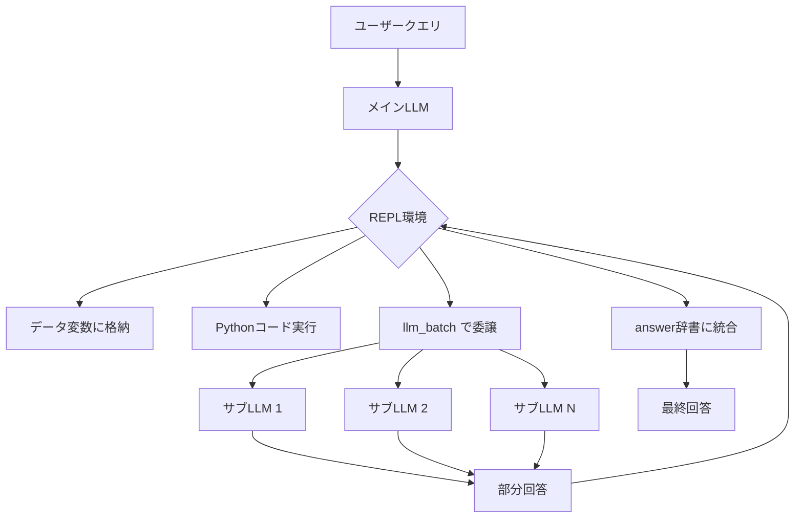

## ブログ概要（Summary）

本記事は [Prime Intellect: Recursive Language Models: the paradigm of 2026](https://www.primeintellect.ai/blog/rlm) の解説記事です。

Prime IntellectはRecursive Language Models（RLM）を独自に検証し、4つの異なるベンチマーク環境（DeepDive、math-python、Oolong、verbatim-copy）での結果を報告している。GPT-5-mini、GLM 4.6、INTELLECT-3（Prime Intellect独自モデル）の3モデルでRLMの効果を測定し、タスクごとの適性差と「環境ヒント（tips）」の効果を定量的に示している。

この記事は [Zenn記事: Recursive Language Models コンテキスト100倍超を実現する推論手法](https://zenn.dev/0h_n0/articles/acfc7763441dd1) の深掘りです。

## 情報源

- **種別**: 企業テックブログ
- **URL**: [https://www.primeintellect.ai/blog/rlm](https://www.primeintellect.ai/blog/rlm)
- **組織**: Prime Intellect
- **著者**: Sebastian
- **発表日**: 2026年1月1日

## 技術的背景（Technical Background）

Prime IntellectはRLMを「2026年のパラダイム」と位置づけ、独自の検証を行っている。RLMが解決する課題として以下の3点を挙げている。

1. **トークンコストの線形増加**: コンテキスト長に比例してper-tokenコストが増加する
2. **コンテキスト腐敗（Context Rot）**: コンテキストが長くなるほどモデル性能が劣化する
3. **エージェントのトークン消費**: 自律的なコード修正など複雑なタスクで大量のトークンが必要

従来のアプローチ（コンテキストウィンドウ拡張、要約ベースの圧縮）では、これらの課題を根本的に解決できないとPrime Intellectは主張している。RLMはコンテキストを「圧縮」するのではなく「委譲」する点が既存手法との決定的な差異である。

## 実装アーキテクチャ（Architecture）

### RLMの4つの設計要素

Prime Intellectのブログでは、RLMの実装を以下の4要素に整理している。

**1. Python REPL統合**: モデルは大規模データセットにPython経由でのみアクセスし、直接コンテキストウィンドウに入力を挿入しない。サブLLMがツール操作を担当し、メインモデルのコンテキストを軽量に保つ。

**2. サブLLM委譲**: `llm_batch()` 関数を通じて新しいモデルインスタンスに処理を並列委譲する。ツールはサブLLMにのみ提供され、メインモデルのトークン膨張を防止する。

**3. 反復的回答生成**: 最終回答は`answer`辞書（`"content"` と `"ready"` キー）を通じた拡散的プロセスで段階的に精製される。一括生成ではなく漸進的な改善が可能である。

**4. 環境制約**: REPL出力は1ターンあたり8,192文字に上限が設定されており（調整可能）、モデルにインテリジェントなデータ分解を強制する。



## パフォーマンス検証（Performance）

### 4つのベンチマーク環境

Prime Intellectは以下の4環境でRLMを検証した。

**1. DeepDive**: 複雑な調査クエリに対してWeb検索ツールを使用する環境。ツール呼び出し1回あたり数万トークンを生成する。ブログの報告によると、戦略的な分解指示（環境ヒント）を与えた場合に70%以上の改善が観測された。

**2. math-python**: 記号計算を用いた数学的問題解決。ブログによると、RLMは標準LLMに対して約20%の性能低下を示した。これはRLMがすべてのタスクに適するわけではないことを示す重要な結果である。

**3. Oolong**: 数百万文字にわたる長文コンテキスト情報検索。ブログの報告では、標準LLMが精度0%となる約150万文字のコンテキストにおいて、RLMが40-60%の精度を維持した。

**4. verbatim-copy**: JSON、CSV、コード、混合フォーマットなどのテキスト再現タスク。ブログによると、英数字コードを除くすべてのコンテンツタイプでRLMがベースラインを上回った。

### モデル別の検証結果

ブログで報告された各モデルの特徴は以下の通りである。

| モデル | DeepDive | math-python | Oolong | 特記事項 |
|---|---|---|---|---|
| **GPT-5-mini** | 改善あり | 低下 | 改善あり | RLM適応が最も良好 |
| **GLM 4.6** | 大幅改善（ヒントなし） | 低下 | — | DeepDiveでヒントなしでもほぼ100%改善 |
| **INTELLECT-3** | ヒント必要 | — | — | スキャフォールディング経験が学習課題として残存 |

**トークン効率**: ブログの報告によると、DeepDiveではメインモデルのトークン使用量が180%改善した（サブLLMが冗長なコンテンツを処理するため）。Oolongでは220%の改善が報告されている。

### 環境ヒント（Tips）の効果

Prime Intellectは「環境ヒント」と呼ばれる戦略的指示の効果を定量的に測定している。DeepDiveにおける指示例は以下の通りである。

> メインの質問をより小さな調査サブタスクに分割し、`llm_batch()` を使って並列委譲する。各サブLLMはWeb検索ツールにアクセスでき、発見した内容を組み合わせて相互参照する。

ブログによると、この指示により40-60パーセンテージポイントの性能改善が得られた。一方、INTELLECT-3はヒントなしではRLMの恩恵をほとんど受けられず、「スキャフォールディングの専門知識は学習のフロンティアとして残っている」とPrime Intellectは述べている。

### 実行時間のトレードオフ

ブログの報告では、RLMは一貫して実行時間が2-4倍に増加した。原因として以下が挙げられている。

- サブLLMのトークン予算増加
- 並列化の余地があるにもかかわらず逐次的なAPI呼び出しが必要
- Python実行のオーバーヘッド

ただし、長期的な推論タスクではこのコスト増は許容範囲であるとPrime Intellectは評価している。

## 運用での学び（Production Lessons）

### RLMが適さないケース

math-pythonでの約20%の性能低下は、RLMの万能性に対する重要な反例である。数学的推論のように計算の流れが直線的なタスクでは、REPL環境を介した分解・委譲のオーバーヘッドが精度を下げる。Prime Intellectはドメイン固有の学習が必要だと結論づけている。

### モデルごとの適応能力差

GLM 4.6がヒントなしでDeepDiveを大幅に改善した一方、INTELLECT-3がヒントを必要とした結果は、RLMの効果がベースモデルのコード生成能力とエージェント経験に大きく依存することを示唆している。

### 将来のロードマップ

Prime Intellectは今後の開発計画として以下を挙げている。

- **可変再帰深度**: サブLLMチェーンの有効化
- **カスタムREPL関数定義**: ユーザー定義関数のサポート
- **マルチターンコンテキスト圧縮**: 会話履歴の効率的管理
- **強化学習によるRLMスキャフォールド学習**: Prime Intellectは「モデルにコンテキスト管理をエンドツーエンドでRLにより学習させることが次の大きなブレークスルーになる」と述べている

## Production Deployment Guide

### AWS実装パターン（コスト最適化重視）

RLMの本番デプロイでは、LLM推論（メインモデル+サブLLM）とREPL実行環境（Pythonサンドボックス）の2レイヤーが必要になる。

| 規模 | 月間リクエスト | 推奨構成 | 月額コスト目安 |
|------|-------------|---------|-------------|
| **Small** | ~3,000 | Lambda + Bedrock | $50-150 |
| **Medium** | ~30,000 | ECS Fargate + Bedrock | $300-800 |
| **Large** | 300,000+ | EKS + Karpenter + Spot | $2,000-5,000 |

**コスト試算の注意事項**: 上記は2026年4月時点のAWS ap-northeast-1料金に基づく概算値である。RLMの再帰呼び出し回数によりBedrock利用料が変動するため、Batch APIの活用（50%割引）とPrompt Caching（30-90%削減）の併用を推奨する。

### Terraformインフラコード（Medium構成）

```hcl
resource "aws_ecs_cluster" "rlm" {
  name = "rlm-inference-cluster"
  setting {
    name  = "containerInsights"
    value = "enabled"
  }
}

resource "aws_ecs_task_definition" "rlm_repl" {
  family                   = "rlm-repl-worker"
  network_mode             = "awsvpc"
  requires_compatibilities = ["FARGATE"]
  cpu                      = "1024"
  memory                   = "2048"
  execution_role_arn       = aws_iam_role.ecs_execution.arn
  task_role_arn            = aws_iam_role.ecs_task.arn

  container_definitions = jsonencode([{
    name  = "rlm-repl"
    image = "${aws_ecr_repository.rlm.repository_url}:latest"
    environment = [
      { name = "BEDROCK_MODEL_ID", value = "anthropic.claude-sonnet-4-6-20260414" },
      { name = "RLM_REPL_MODE", value = "docker" },
      { name = "RLM_MAX_DEPTH", value = "1" },
    ]
    logConfiguration = {
      logDriver = "awslogs"
      options = {
        "awslogs-group"  = "/ecs/rlm-repl"
        "awslogs-region" = "ap-northeast-1"
      }
    }
  }])
}

resource "aws_ecs_service" "rlm_repl" {
  name            = "rlm-repl-service"
  cluster         = aws_ecs_cluster.rlm.id
  task_definition = aws_ecs_task_definition.rlm_repl.arn
  desired_count   = 2
  launch_type     = "FARGATE"

  network_configuration {
    subnets         = module.vpc.private_subnets
    security_groups = [aws_security_group.rlm.id]
  }
}
```

### コスト最適化チェックリスト

- [ ] Bedrock Batch API使用（非リアルタイム処理で50%削減）
- [ ] Prompt Caching有効化（システムプロンプト固定で30-90%削減）
- [ ] RLM再帰深度制限（depth-1推奨、depth-2以上はコスト急増）
- [ ] REPL出力8,192文字制限の維持（コンテキスト膨張防止）
- [ ] サブLLMにHaikuクラスモデル使用（コスト10分の1）
- [ ] Spot Instances活用（EKS構成で最大90%削減）
- [ ] AWS Budgets月額予算設定
- [ ] CloudWatch トークン使用量アラーム
- [ ] 95パーセンタイルのコストスパイク監視
- [ ] アイドルタイムのスケールダウン設定

## 学術研究との関連（Academic Connection）

Prime Intellectのブログは、Zhang et al. (2025) のRLM原論文（arXiv:2512.24601）の実装を独自環境で検証したものである。原論文がGPT-5とQwen3-Coderで評価したのに対し、Prime IntellectはGPT-5-mini、GLM 4.6、自社モデルINTELLECT-3で評価している点が独自の貢献である。

特に、「環境ヒント」の効果を定量化した点は、RLMの実用化において重要な知見である。原論文では言及されていなかったモデルの「スキャフォールディング能力」の差異が、RLMの効果を左右することを実証的に示している。

ブログの結論として「RLMとコンテキストフォールディングの真のポテンシャルはRLによる学習後に解放される」と述べており、これは原論文がSFTのみで検証した範囲を超える展望として注目に値する。

## まとめと実践への示唆

Prime IntellectのRLM検証は、原論文の成果を独立に確認するとともに、タスク適性（数学タスクでの性能低下）、モデル依存性（ヒント要否の差）、コスト特性（2-4倍の実行時間増）を定量的に示した。実務への示唆として、RLMの導入はコンテキストウィンドウを超える入力を扱うタスクに限定し、ベースモデルの選定時にはコード生成・エージェント能力を重視すべきである。

## 参考文献

- **Blog URL**: [https://www.primeintellect.ai/blog/rlm](https://www.primeintellect.ai/blog/rlm)
- **Related Paper**: [https://arxiv.org/abs/2512.24601](https://arxiv.org/abs/2512.24601)
- **Related Zenn article**: [https://zenn.dev/0h_n0/articles/acfc7763441dd1](https://zenn.dev/0h_n0/articles/acfc7763441dd1)
