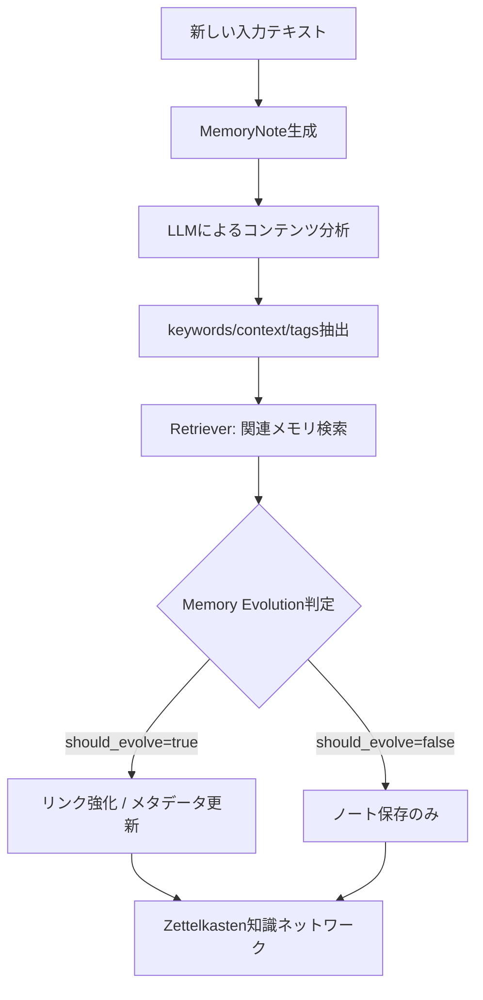
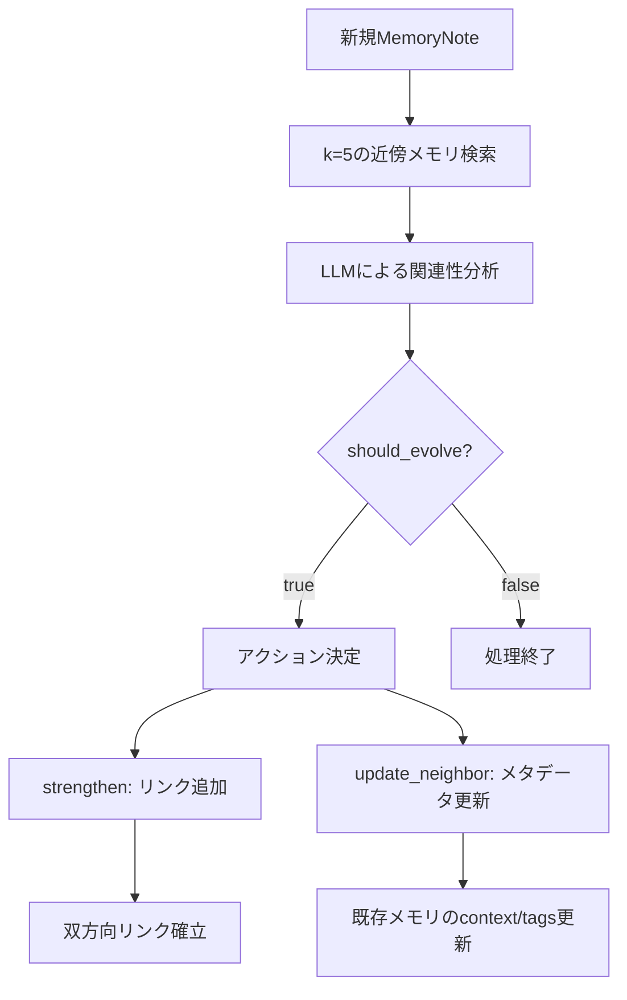

本記事は <https://arxiv.org/abs/2502.12110> の解説記事です。

## 論文概要（Abstract）

A-Memは、LLMエージェントのメモリを「エージェント自身が自律的に組織化する」という新しいパラダイムを提案するシステムである。社会学者Niklas Luhmannが考案したZettelkasten（ツェッテルカステン）方式の原理を応用し、個々のメモリをアトミックなノートとして構造化し、動的なインデキシングとリンク生成を通じてメモリ間の知識ネットワークを自律的に構築する。著者らは、6つの基盤モデルを用いた実験において、既存のSOTA手法を上回る性能を達成したと報告している。

この記事は [Zenn記事: AgentCore 3層メモリで構築するStateful Agent設計パターン](https://zenn.dev/0h_n0/articles/3a3eeb04d7f281) の深掘りです。

## 情報源

- **会議名**: NeurIPS 2025（Advances in Neural Information Processing Systems）
- **年**: 2025
- **URL**: <https://arxiv.org/abs/2502.12110>
- **著者**: Wujiang Xu, Zujie Liang, Kai Mei, Hang Gao, Juntao Tan, Yongfeng Zhang
- **採択率**: メイントラック全体で約24.5%（21,575件中5,290件採択）
- **発表形式**: Poster
- **コードリポジトリ**: <https://github.com/WujiangXu/A-mem>（MIT License）

## カンファレンス情報

NeurIPS（Neural Information Processing Systems）は、機械学習・人工知能分野における最高峰の国際会議の一つである。2025年のメイントラックには21,575件の有効な投稿があり、そのうち5,290件が採択された（採択率約24.5%）。A-Memはポスター発表として採択されている。分野はcs.CL（計算言語学）およびcs.HC（ヒューマンコンピュータインタラクション）に分類されている。

## 背景と動機（Background & Motivation）

LLMエージェントが長期的な対話や複数セッションにまたがるタスクを処理する際、過去の情報をどのように保持・活用するかは根本的な課題である。従来のメモリシステムには以下の限界があった。

**MemGPT**は仮想コンテキスト管理によりメインコンテキストと外部コンテキストの二層構造を採用しているが、メモリの組織化はページング方式に基づく受動的な管理にとどまる。**MemoryBank**はEbbinghausの忘却曲線に基づいてメモリを動的に更新するが、メモリ間の意味的な関連付けは行わない。**ReadAgent**は3ステップのエピソード分割・要約方式を採用するが、メモリ自体が進化する仕組みはない。

これらの手法に共通する問題は、メモリが「受動的に蓄積・検索されるもの」として扱われている点である。著者らは、メモリ自体をエージェント的（agentic）に振る舞わせ、能動的にメモリを再組織化・リンク・進化させるアプローチを提案している。

## 主要な貢献（Key Contributions）

- **Zettelkasten方式のLLMメモリへの応用**: アトミックなノート、一意のID、意味的リンクというZettelkastenの三原則をLLMエージェントのメモリ管理に適用した初の体系的手法
- **エージェント駆動のメモリ進化（Memory Evolution）**: 新しいメモリが追加されるたびに、LLMが既存メモリとの関連を分析し、リンクの強化やメタデータの更新を自律的に実行する仕組み
- **コスト効率の高い設計**: 1操作あたり約1,200トークンで処理を完結する設計により、ベースライン手法の約16,900トークンと比較して85-93%のトークン削減を実現

## 技術的詳細（Technical Details）

### アーキテクチャ概要

A-Memのアーキテクチャは、MemoryNote（メモリノート）、Retriever（検索器）、AgenticMemorySystem（メモリ管理オーケストレータ）の3つの主要コンポーネントで構成される。



### MemoryNoteのデータ構造

各メモリは以下の属性を持つ構造化ノートとして管理される。

```python
class MemoryNote:
    """Zettelkasten方式のアトミックなメモリユニット

    Attributes:
        content: メモリの本文テキスト
        id: UUID形式の一意識別子
        keywords: LLM分析により抽出された重要語リスト
        links: 関連メモリIDへの参照辞書（Zettelkasten接続）
        importance_score: 関連度の重み（デフォルト1.0）
        context: ドメイン・主題カテゴリの説明
        tags: カテゴリラベルのリスト
        evolution_history: コンテンツ変更履歴
    """
    def __init__(
        self,
        content: str,
        id: Optional[str] = None,
        keywords: Optional[List[str]] = None,
        links: Optional[Dict[str, str]] = None,
        importance_score: Optional[float] = None,
        retrieval_count: Optional[int] = None,
        timestamp: Optional[str] = None,
        last_accessed: Optional[str] = None,
        context: Optional[str] = None,
        evolution_history: Optional[List[Dict]] = None,
        category: Optional[str] = None,
        tags: Optional[List[str]] = None,
        llm_controller: Optional["LLMController"] = None,
    ) -> None:
        ...
```

ここで注目すべきは `links` フィールドである。これがZettelkasten方式の核心であり、メモリ間の双方向リンクを辞書形式（`{メモリID: リンク理由}`）で管理する。LuhmannのオリジナルZettelkastenでは、各カードに一意のIDを付与し、関連するカードのIDを手書きで記録していた。A-MemではこれをLLMの意味理解能力で自動化している。

### メモリ検索のハイブリッドアプローチ

A-Memは、セマンティック検索とBM25による語彙的検索を組み合わせたハイブリッド検索を実装している。

検索スコアの統合は以下の式で行われる。

$$
S_{\text{hybrid}}(q, d) = \alpha \cdot S_{\text{semantic}}(q, d) + (1 - \alpha) \cdot S_{\text{BM25}}(q, d)
$$

ここで、
- $q$: クエリテキスト
- $d$: メモリドキュメント
- $\alpha \in [0, 1]$: セマンティック検索とBM25の重みバランスパラメータ
- $S_{\text{semantic}}(q, d)$: SentenceTransformerによるコサイン類似度
- $S_{\text{BM25}}(q, d)$: BM25による語彙的マッチングスコア

```python
class HybridRetriever:
    """BM25とセマンティック検索のハイブリッド検索器

    Args:
        model_name: SentenceTransformerのモデル名
        alpha: セマンティック検索の重み（0-1）
    """
    def __init__(self, model_name: str = "all-MiniLM-L6-v2", alpha: float = 0.5) -> None:
        self.semantic_retriever = SimpleEmbeddingRetriever(model_name)
        self.bm25_retriever = BM25Retriever()
        self.alpha = alpha

    def retrieve(self, query: str, k: int = 5) -> List[int]:
        """ハイブリッドスコアで上位kメモリのインデックスを返す

        Args:
            query: 検索クエリ
            k: 返却するメモリ数

        Returns:
            関連度順のメモリインデックスリスト
        """
        semantic_scores = self.semantic_retriever.score(query)
        bm25_scores = self.bm25_retriever.score(query)

        # スコア正規化
        sem_norm = normalize(semantic_scores)
        bm25_norm = normalize(bm25_scores)

        # 重み付き統合
        hybrid_scores = self.alpha * sem_norm + (1 - self.alpha) * bm25_norm
        return top_k_indices(hybrid_scores, k)
```

検索時のドキュメント表現は、メモリの複数属性を結合した複合テキストとして構築される。

$$
d_{\text{composite}} = \text{content}(m) \oplus \text{context}(m) \oplus \text{keywords}(m) \oplus \text{tags}(m)
$$

ここで $m$ はMemoryNote、$\oplus$ はテキスト結合演算子を表す。この複合表現により、コンテンツだけでなくメタデータも含めた意味的検索が可能になる。

### Memory Evolution（メモリ進化）アルゴリズム

A-Memの最も特徴的な機構がMemory Evolutionである。新しいメモリが追加されるたびに、以下のプロセスが実行される。



具体的な進化プロセスは以下のアルゴリズムで表現できる。

```python
class AgenticMemorySystem:
    """A-Memのメモリ管理オーケストレータ

    Args:
        model_name: 埋め込みモデル名
        llm_backend: LLMバックエンド種別
        llm_model: 使用するLLMモデル名
        evo_threshold: メモリ進化の閾値数
    """
    def __init__(
        self,
        model_name: str = "all-MiniLM-L6-v2",
        llm_backend: str = "sglang",
        llm_model: str = "gpt-4o-mini",
        evo_threshold: int = 100,
    ) -> None:
        self.notes: List[MemoryNote] = []
        self.retriever = HybridRetriever(model_name)
        self.llm = LLMController(backend=llm_backend, model=llm_model)
        self.evo_threshold = evo_threshold

    def add_note(self, content: str, time: Optional[str] = None) -> str:
        """メモリを追加し、進化プロセスをトリガーする

        Args:
            content: メモリの本文
            time: タイムスタンプ（任意）

        Returns:
            生成されたメモリのUUID
        """
        note = MemoryNote(content=content, llm_controller=self.llm)
        note.analyze_content(content, self.llm)  # keywords/context/tags抽出

        should_evolve, evolved_note = self.process_memory(note)
        self.notes.append(evolved_note)
        self.retriever.add_document(evolved_note.composite_text)

        return evolved_note.id

    def process_memory(
        self, note: MemoryNote
    ) -> tuple[bool, MemoryNote]:
        """近傍メモリとの関連を分析し、進化アクションを実行

        Args:
            note: 処理対象のメモリノート

        Returns:
            (進化が発生したか, 処理後のノート)
        """
        related_text, indices = self.find_related_memories(note.content, k=5)

        # LLMに進化判定を依頼
        evolution_decision = self.llm.get_completion(
            prompt=self._build_evolution_prompt(note, related_text),
            temperature=0.3,
        )

        if evolution_decision["should_evolve"]:
            action = evolution_decision["action"]
            if action == "strengthen":
                # 双方向リンクを追加
                for target_id in evolution_decision["target_ids"]:
                    note.links[target_id] = evolution_decision["reason"]
                    self.notes[target_id].links[note.id] = evolution_decision["reason"]
            elif action == "update_neighbor":
                # 既存メモリのメタデータを更新
                for idx in evolution_decision["update_targets"]:
                    self.notes[idx].context = evolution_decision["new_context"]
                    self.notes[idx].tags.extend(evolution_decision["new_tags"])

            return True, note

        return False, note
```

Memory Evolutionの判定において、LLMは1-3回の条件付きAPI呼び出しで処理を完結させる。最初の呼び出しで進化の要否を判定し、進化が必要な場合にのみ追加の呼び出しでアクション詳細を決定する。この条件付き実行により、不要なAPI消費を抑制している。

### ロバスト版の拡張

実装リポジトリには `memory_layer_robust.py` として、プロダクション利用を意識した堅牢版が提供されている。主な拡張点は以下の通りである。

- **`@retry_llm_call` デコレータ**: 最大2回のリトライを指数バックオフ（基本遅延1.0秒）で実行
- **RobustLLMController**: OpenAI、Ollama、SGLang、vLLMの各バックエンドに対応するFactory Pattern実装
- **プレーンテキストパーシング**: JSON Schema依存を排除し、セクションマーカーによるテキスト解析で応答を処理
- **グレースフルデグレード**: メモリ分析の失敗時にヒューリスティックなフォールバックを実行

## 実装のポイント

A-Memを実際に導入する際の注意点を以下にまとめる。

**埋め込みモデルの選択**: デフォルトでは `all-MiniLM-L6-v2`（384次元）を使用している。日本語コンテンツを扱う場合は、`multilingual-e5-large` など多言語対応モデルへの差し替えが必要となる。

**メモリ統合（Consolidation）の頻度**: `consolidate_memories()` メソッドはRetrieverのインデックスを全メモリで再構築する操作であり、メモリ数が増加すると計算コストが増大する。`evo_threshold`パラメータ（デフォルト100）でトリガー頻度を制御できる。

**LLMバックエンドの選択**: GPT-4o-miniのようなクラウドAPIを使う場合、1操作あたり約1,200トークン（著者らの報告による）で約$0.0003のコストとなる。vLLMやSGLangによるローカルモデル推論を選択すれば、レイテンシとコストの最適化が可能である。

**リンクの爆発的増加への対策**: メモリ数が大規模になると、リンク数も指数的に増加する可能性がある。著者らの実装では近傍検索の $k=5$ という制約が暗黙的な上限として機能しているが、プロダクション環境ではリンク数の明示的な上限設定やリンクの重要度に基づく枝刈りが必要となる場合がある。

## Production Deployment Guide

A-MemはGitHub上でMITライセンスの実装が公開されており、プロダクション環境への展開が可能である。以下では、AWS上でA-Memベースのメモリ管理システムを構築する際の具体的な構成を示す。

### AWS実装パターン（コスト最適化重視）

**トラフィック量別の推奨構成**:

| 構成 | トラフィック | アーキテクチャ | 月額コスト概算 |
|------|-------------|---------------|---------------|
| Small | ~100 req/日 | Lambda + Bedrock + DynamoDB | $50-150 |
| Medium | ~1,000 req/日 | ECS Fargate + ElastiCache + Bedrock | $300-800 |
| Large | 10,000+ req/日 | EKS + Karpenter + Spot + Bedrock | $2,000-5,000 |

**Small構成の内訳（~100 req/日）**:
- Lambda（メモリ操作処理）: 月100K呼び出し想定で$5-10
- Bedrock（Claude 3.5 Haiku / GPT-4o-mini相当）: 1操作1,200トークン x 100 req x 30日 = 3.6Mトークン/月、$10-30
- DynamoDB（メモリノート永続化、On-Demand）: 書き込み3,000 WCU/月、$5-15
- S3（埋め込みベクトル保存）: $1-5
- CloudWatch（ログ・メトリクス）: $10-20

**Medium構成の内訳（~1,000 req/日）**:
- ECS Fargate（常駐型メモリサービス、0.5vCPU/1GB RAM x 2タスク）: $60-120
- ElastiCache（Redis、メモリキャッシュ用、cache.t4g.micro）: $15-30
- Bedrock: 36Mトークン/月、$100-300
- DynamoDB: $30-80
- Application Load Balancer: $20-30

**Large構成の内訳（10,000+ req/日）**:
- EKS（コントロールプレーン）: $73
- EC2 Spot Instances（m6i.xlarge x 3-5台、Karpenter管理）: $200-500（Spot割引適用後）
- Bedrock Batch API: 360Mトークン/月、Batch APIで50%削減して$500-1,500
- OpenSearch Serverless（ベクトル検索）: $300-600
- ElastiCache（Redis Cluster）: $100-200

**コスト削減テクニック**:
- Spot Instances活用: オンデマンド比で最大90%削減（m6i.xlarge: $0.192/h → ~$0.058/h）
- Reserved Instances（1年コミット）: 最大72%削減
- Bedrock Batch API: 非リアルタイム処理で50%削減
- Prompt Caching有効化: Memory Evolutionプロンプトのシステム部分キャッシュで30-90%削減

**注意**: 上記コスト試算は2026年4月時点のAWS ap-northeast-1（東京）リージョン料金に基づく概算値である。実際のコストはトラフィックパターン、リージョン、バースト使用量により変動する。最新料金はAWS料金計算ツールでの確認を推奨する。

### Terraformインフラコード

**Small構成（Serverless）: Lambda + Bedrock + DynamoDB**

```hcl
# A-Mem Serverless構成
# Lambda + Bedrock + DynamoDB

terraform {
  required_version = ">= 1.8"
  required_providers {
    aws = {
      source  = "hashicorp/aws"
      version = "~> 5.80"
    }
  }
}

provider "aws" {
  region = "ap-northeast-1"
}

# --- DynamoDB: メモリノート永続化 ---
resource "aws_dynamodb_table" "memory_notes" {
  name         = "amem-memory-notes"
  billing_mode = "PAY_PER_REQUEST" # On-Demandでコスト最適化
  hash_key     = "note_id"

  attribute {
    name = "note_id"
    type = "S"
  }

  server_side_encryption {
    enabled = true # KMS暗号化
  }

  point_in_time_recovery {
    enabled = true
  }

  tags = {
    Project = "a-mem"
    Env     = "production"
  }
}

# --- IAMロール: Lambda用（最小権限） ---
resource "aws_iam_role" "amem_lambda" {
  name = "amem-lambda-role"
  assume_role_policy = jsonencode({
    Version = "2012-10-17"
    Statement = [{
      Action = "sts:AssumeRole"
      Effect = "Allow"
      Principal = { Service = "lambda.amazonaws.com" }
    }]
  })
}

resource "aws_iam_role_policy" "amem_lambda_policy" {
  name = "amem-lambda-policy"
  role = aws_iam_role.amem_lambda.id
  policy = jsonencode({
    Version = "2012-10-17"
    Statement = [
      {
        Effect   = "Allow"
        Action   = ["dynamodb:PutItem", "dynamodb:GetItem", "dynamodb:Query", "dynamodb:UpdateItem"]
        Resource = aws_dynamodb_table.memory_notes.arn
      },
      {
        Effect   = "Allow"
        Action   = ["bedrock:InvokeModel"]
        Resource = "arn:aws:bedrock:ap-northeast-1::foundation-model/*"
      },
      {
        Effect   = "Allow"
        Action   = ["logs:CreateLogGroup", "logs:CreateLogStream", "logs:PutLogEvents"]
        Resource = "arn:aws:logs:ap-northeast-1:*:*"
      }
    ]
  })
}

# --- Lambda関数 ---
resource "aws_lambda_function" "amem_handler" {
  function_name = "amem-memory-handler"
  runtime       = "python3.12"
  handler       = "handler.lambda_handler"
  role          = aws_iam_role.amem_lambda.arn
  timeout       = 60   # Memory Evolution処理に十分な時間
  memory_size   = 512  # 埋め込み計算用

  filename         = "lambda_package.zip"
  source_code_hash = filebase64sha256("lambda_package.zip")

  environment {
    variables = {
      DYNAMODB_TABLE   = aws_dynamodb_table.memory_notes.name
      BEDROCK_MODEL_ID = "anthropic.claude-3-5-haiku-20241022-v1:0"
      EVO_THRESHOLD    = "100"
    }
  }

  tracing_config {
    mode = "Active" # X-Ray有効化
  }

  tags = {
    Project = "a-mem"
  }
}

# --- CloudWatchアラーム: コスト監視 ---
resource "aws_cloudwatch_metric_alarm" "lambda_duration" {
  alarm_name          = "amem-lambda-duration-high"
  comparison_operator = "GreaterThanThreshold"
  evaluation_periods  = 3
  metric_name         = "Duration"
  namespace           = "AWS/Lambda"
  period              = 300
  statistic           = "Average"
  threshold           = 30000 # 30秒超過で警告
  alarm_description   = "A-Mem Lambda execution time exceeds 30s"

  dimensions = {
    FunctionName = aws_lambda_function.amem_handler.function_name
  }
}
```

**Large構成（Container）: EKS + Karpenter + Spot Instances**

```hcl
# A-Mem Container構成
# EKS + Karpenter + Spot Instances

module "eks" {
  source  = "terraform-aws-modules/eks/aws"
  version = "~> 20.31"

  cluster_name    = "amem-cluster"
  cluster_version = "1.31"

  vpc_id     = module.vpc.vpc_id
  subnet_ids = module.vpc.private_subnets

  # Karpenter用のIRSA設定
  enable_cluster_creator_admin_permissions = true

  cluster_addons = {
    karpenter = {
      most_recent = true
    }
  }

  tags = {
    Project = "a-mem"
    Env     = "production"
  }
}

# --- Karpenter NodePool: Spot優先 ---
resource "kubectl_manifest" "karpenter_nodepool" {
  yaml_body = yamlencode({
    apiVersion = "karpenter.sh/v1"
    kind       = "NodePool"
    metadata   = { name = "amem-spot-pool" }
    spec = {
      template = {
        spec = {
          requirements = [
            { key = "karpenter.sh/capacity-type", operator = "In", values = ["spot", "on-demand"] },
            { key = "node.kubernetes.io/instance-type", operator = "In",
              values = ["m6i.xlarge", "m6a.xlarge", "m5.xlarge"] },
          ]
          nodeClassRef = { name = "default" }
        }
      }
      limits   = { cpu = "40", memory = "160Gi" }
      disruption = {
        consolidationPolicy = "WhenEmptyOrUnderutilized"
        consolidateAfter    = "60s"
      }
    }
  })
}

# --- Secrets Manager: Bedrock設定 ---
resource "aws_secretsmanager_secret" "bedrock_config" {
  name = "amem/bedrock-config"
}

resource "aws_secretsmanager_secret_version" "bedrock_config" {
  secret_id = aws_secretsmanager_secret.bedrock_config.id
  secret_string = jsonencode({
    model_id      = "anthropic.claude-3-5-haiku-20241022-v1:0"
    max_tokens    = 2048
    evo_threshold = 100
  })
}

# --- AWS Budgets: 予算アラート ---
resource "aws_budgets_budget" "amem_monthly" {
  name         = "amem-monthly-budget"
  budget_type  = "COST"
  limit_amount = "5000"
  limit_unit   = "USD"
  time_unit    = "MONTHLY"

  notification {
    comparison_operator       = "GREATER_THAN"
    threshold                 = 80
    threshold_type            = "PERCENTAGE"
    notification_type         = "ACTUAL"
    subscriber_email_addresses = ["ops-team@example.com"]
  }
}
```

### 運用・監視設定

**CloudWatch Logs Insights: メモリ操作の分析クエリ**

```
# 1時間あたりのMemory Evolution発生率
fields @timestamp, @message
| filter @message like /process_memory/
| stats count(*) as total,
        sum(case when @message like /should_evolve=true/ then 1 else 0 end) as evolved
  by bin(1h) as hour
| sort hour desc

# P95/P99レイテンシ分析
fields @timestamp, duration_ms
| filter event = "memory_operation"
| stats percentile(duration_ms, 95) as p95,
        percentile(duration_ms, 99) as p99,
        avg(duration_ms) as avg_ms
  by bin(1h)
```

**CloudWatchアラーム設定（Python）**:

```python
import boto3

cloudwatch = boto3.client("cloudwatch", region_name="ap-northeast-1")

def create_token_usage_alarm() -> None:
    """Bedrockトークン使用量のスパイク検知アラームを作成"""
    cloudwatch.put_metric_alarm(
        AlarmName="amem-bedrock-token-spike",
        MetricName="InputTokenCount",
        Namespace="AWS/Bedrock",
        Statistic="Sum",
        Period=3600,
        EvaluationPeriods=2,
        Threshold=500000,  # 1時間50万トークン超過
        ComparisonOperator="GreaterThanThreshold",
        AlarmActions=["arn:aws:sns:ap-northeast-1:123456789012:amem-alerts"],
    )
```

**X-Rayトレーシング設定（Python）**:

```python
from aws_xray_sdk.core import xray_recorder, patch_all
from aws_xray_sdk.core.models.subsegment import Subsegment

patch_all()  # boto3自動計装

def trace_memory_operation(operation: str, note_id: str) -> Subsegment:
    """メモリ操作のX-Rayサブセグメントを作成

    Args:
        operation: 操作種別（add_note, process_memory等）
        note_id: 対象メモリノートのID

    Returns:
        X-Rayサブセグメント
    """
    subsegment = xray_recorder.begin_subsegment(f"amem.{operation}")
    subsegment.put_annotation("note_id", note_id)
    subsegment.put_annotation("operation", operation)
    return subsegment
```

**Cost Explorer日次レポート（Python）**:

```python
import boto3
from datetime import datetime, timedelta

ce = boto3.client("ce", region_name="us-east-1")
sns = boto3.client("sns", region_name="ap-northeast-1")

def daily_cost_report() -> dict:
    """A-Memプロジェクトの日次コストレポートを取得し、閾値超過時にSNS通知"""
    today = datetime.utcnow().strftime("%Y-%m-%d")
    yesterday = (datetime.utcnow() - timedelta(days=1)).strftime("%Y-%m-%d")

    response = ce.get_cost_and_usage(
        TimePeriod={"Start": yesterday, "End": today},
        Granularity="DAILY",
        Metrics=["UnblendedCost"],
        Filter={
            "Tags": {"Key": "Project", "Values": ["a-mem"]}
        },
        GroupBy=[{"Type": "DIMENSION", "Key": "SERVICE"}],
    )

    total = sum(
        float(g["Metrics"]["UnblendedCost"]["Amount"])
        for r in response["ResultsByTime"]
        for g in r["Groups"]
    )

    if total > 100.0:  # $100/日超過
        sns.publish(
            TopicArn="arn:aws:sns:ap-northeast-1:123456789012:amem-cost-alerts",
            Subject="A-Mem Cost Alert",
            Message=f"Daily cost exceeded $100: ${total:.2f}",
        )

    return {"date": yesterday, "total_usd": total, "breakdown": response}
```

### コスト最適化チェックリスト

**アーキテクチャ選択**:
- [ ] トラフィック量に応じた構成選択（~100 req/日: Serverless、~1000: Hybrid、10000+: Container）
- [ ] バースト対応方針の決定（Lambda同時実行数制限 or Auto Scaling）

**リソース最適化**:
- [ ] EC2: Spot Instances優先（Karpenter `spot` > `on-demand` 順序設定）
- [ ] Reserved Instances: 1年コミットで定常ワークロードのベースライン確保
- [ ] Savings Plans: Compute Savings Plansで柔軟なコミット
- [ ] Lambda: メモリサイズのPower Tuning最適化（512MB推奨、埋め込み計算考慮）
- [ ] ECS/EKS: Karpenter Consolidation Policyでアイドル時自動スケールダウン
- [ ] DynamoDB: On-Demandモードで低トラフィック時のコスト最小化

**LLMコスト削減**:
- [ ] Bedrock Batch API: 非リアルタイムのMemory Evolution処理で50%削減
- [ ] Prompt Caching: Evolution System Promptのキャッシュ化で30-90%削減
- [ ] モデル選択ロジック: 単純なメモリ追加はHaiku、Evolution判定はSonnetと使い分け
- [ ] トークン数制限: max_tokens=2048の厳格な制限でコスト上限設定
- [ ] 条件付き呼び出し: should_evolve=falseの場合は追加LLM呼び出しをスキップ

**監視・アラート**:
- [ ] AWS Budgets: 月次予算アラート（80%/100%閾値）
- [ ] CloudWatch Alarms: Bedrockトークン使用量、Lambda Duration
- [ ] Cost Anomaly Detection: 自動異常検知の有効化
- [ ] 日次コストレポート: Cost Explorer + SNS通知
- [ ] X-Ray: メモリ操作のレイテンシトレーシング

**リソース管理**:
- [ ] 未使用リソース: 定期的なリソース棚卸し（月次）
- [ ] タグ戦略: `Project=a-mem`, `Env=production` の全リソース適用
- [ ] S3ライフサイクル: 古い埋め込みバックアップの自動削除（90日）
- [ ] DynamoDBバックアップ: PITRの有効化（コスト vs 復旧要件のバランス）
- [ ] 開発環境: 夜間・週末のEKSノード停止スケジュール

## 実験結果（Results）

### LoCoMoデータセットでの評価

著者らはLoCoMoデータセット（7,512のQAペア、5カテゴリ）を用いた評価を報告している。以下はGPT-4o-miniをバックエンドとした場合のF1スコアである（論文Table 2より）。

| カテゴリ | LoCoMo | ReadAgent | MemoryBank | MemGPT | **A-Mem** |
|----------|--------|-----------|------------|--------|-----------|
| Multi-Hop | 25.02 | - | - | - | **27.02** |
| Temporal | 18.41 | - | - | - | **45.85** |
| Open Domain | 12.04 | - | - | - | **12.14** |
| Single-Hop | 40.36 | - | - | - | **44.65** |
| Adversarial | **69.23** | - | - | - | 50.03 |

特に注目すべきはTemporal（時間推論）カテゴリでのF1スコアが18.41から45.85へと大幅に向上している点である。著者らは、Zettelkastenのリンク構造がメモリ間の時間的関連性の保持に有効に機能したと分析している。

一方、Adversarial（敵対的クエリ）カテゴリではLoCoMoベースラインの69.23に対しA-Memは50.03と低下している。この点について著者らは、メモリの能動的な組織化が「回答不能」と判定すべきクエリに対しても関連情報を見つけようとする傾向があるためと考察している。

### DialSimデータセットでの評価

DialSimデータセット（TVドラマから構成される長期対話、約350,000トークン）での結果は以下の通りである（論文Table 3より）。

| メトリクス | LoCoMo | MemGPT | **A-Mem** |
|-----------|--------|--------|-----------|
| F1 | 2.55 | 1.18 | **3.45** |
| BLEU-1 | 3.13 | 1.07 | **3.37** |
| ROUGE-L | 2.75 | 0.96 | **3.54** |
| SBERT | 15.76 | 8.54 | **19.51** |

全メトリクスでA-Memが最高スコアを記録している。ただし絶対値としてはいずれも低い水準であり、長期対話メモリの課題の困難さを示していると言える。

### Ablation Study

メモリ進化の各コンポーネントの寄与を分析したアブレーションスタディの結果は以下の通りである（論文Table 4より、GPT-4o-mini使用）。

| 構成 | Multi-Hop F1 | Temporal F1 | Single-Hop F1 |
|------|-------------|-------------|---------------|
| w/o LG & ME（リンクも進化もなし） | 9.65 | 24.55 | 13.28 |
| w/o ME（リンクのみ） | 21.35 | 31.24 | 39.17 |
| Full A-Mem（リンク+進化） | **27.02** | **45.85** | **44.65** |

ここで LG = Link Generation、ME = Memory Evolution を表す。リンク生成だけでも大幅な性能向上が見られ（Multi-Hop: 9.65 → 21.35）、さらにMemory Evolutionの追加により一貫した改善が得られている。この結果は、Zettelkastenのリンク構造とメモリ進化の両方がシステムの性能に不可欠であることを示唆している。

### コスト効率

著者らは、A-Memが1操作あたり約1,200トークンで処理を完結すると報告している。これはベースライン手法の約16,900トークンと比較して85-93%のトークン削減に相当し、GPT-4o-mini利用時のコストは1操作あたり$0.0003未満とされている。

## 実運用への応用（Practical Applications）

A-MemのZettelkasten方式によるメモリ管理は、Zenn記事で解説されているAWS AgentCoreの3層メモリ設計と密接に関連する。AgentCoreのSession Memory / Long-term Memory / Shared Memoryという階層構造に対して、A-Memのアプローチは以下のような実務的示唆を提供する。

**Stateful Agentのメモリ層への統合**: AgentCoreのLong-term Memoryとして、DynamoDBに永続化されたA-MemのMemoryNoteを利用することで、セッションをまたいだ知識の蓄積と自動組織化が可能になる。

**マルチエージェント環境での共有メモリ**: A-Memの双方向リンク構造は、複数エージェントが共有する知識ベースとして機能し得る。各エージェントが追加したメモリが自動的にリンクされることで、エージェント間の暗黙的な知識共有が実現する。

**スケーリングの考慮点**: LoCoMoデータセット（約9,000トークン/対話）での検証結果はプロダクションにおける対話規模の参考になるが、実運用では数十万メモリ規模での検索レイテンシやリンク構造の管理が課題となる。OpenSearch ServerlessやPgvectorなどのベクトルデータベースとの統合が実用化の鍵となる。

## 関連研究（Related Work）

- **MemGPT** (Packer et al., 2023): 仮想メモリページング方式によるLLMのコンテキスト管理。メインコンテキストと外部ストレージの二層構造を採用するが、メモリ間のリンク構造は持たない。A-Memはこれをベースラインの一つとして比較し、多くのカテゴリで上回る性能を報告している
- **Generative Agents** (Park et al., 2023): 時間重み・重要度・関連度の三要素による検索スコアリングでエージェントの記憶を管理。A-Memとの主な違いは、メモリの受動的検索 vs 能動的組織化のアプローチの差にある
- **MemoryBank** (Zhong et al., 2024): Ebbinghausの忘却曲線に基づく動的メモリ更新。時間経過に応じてメモリの重要度を減衰させるが、メモリ間の意味的関連付けは行わない
- **ReadAgent** (Lee et al., 2024): エピソード分割・ページネーション・要約の3ステップでコンテキスト長の制約に対応。メモリ自体の進化メカニズムは持たない

## まとめと今後の展望

A-Memは、Zettelkasten方式の原理をLLMエージェントのメモリ管理に適用し、メモリの能動的な組織化・リンク・進化を実現したシステムである。6つの基盤モデルでの評価において、特にTemporal（時間推論）やMulti-Hop（複数情報統合）カテゴリで既存手法を上回る性能が報告されている。1操作あたり約1,200トークンというコスト効率の高さも実用上の利点と言える。

今後の研究方向として、Adversarialカテゴリでの性能改善（回答不能判定の精度向上）、大規模メモリ環境でのリンク構造のスケーラビリティ、および複数エージェント間でのメモリ共有プロトコルの設計が挙げられる。AWS AgentCoreのようなStateful Agent基盤との統合により、A-Memの実用的価値がさらに高まることが期待される。

## 参考文献

- **Conference URL**: <https://neurips.cc/virtual/2025/poster/119020>
- **arXiv**: <https://arxiv.org/abs/2502.12110>
- **Code**: <https://github.com/WujiangXu/A-mem>
- **OpenReview**: <https://openreview.net/forum?id=FiM0M8gcct>
- **Related Zenn article**: <https://zenn.dev/0h_n0/articles/3a3eeb04d7f281>

---

*本記事はAIによって生成されました。内容の正確性には注意を払っていますが、最新の情報は原論文およびリポジトリをご確認ください。*
