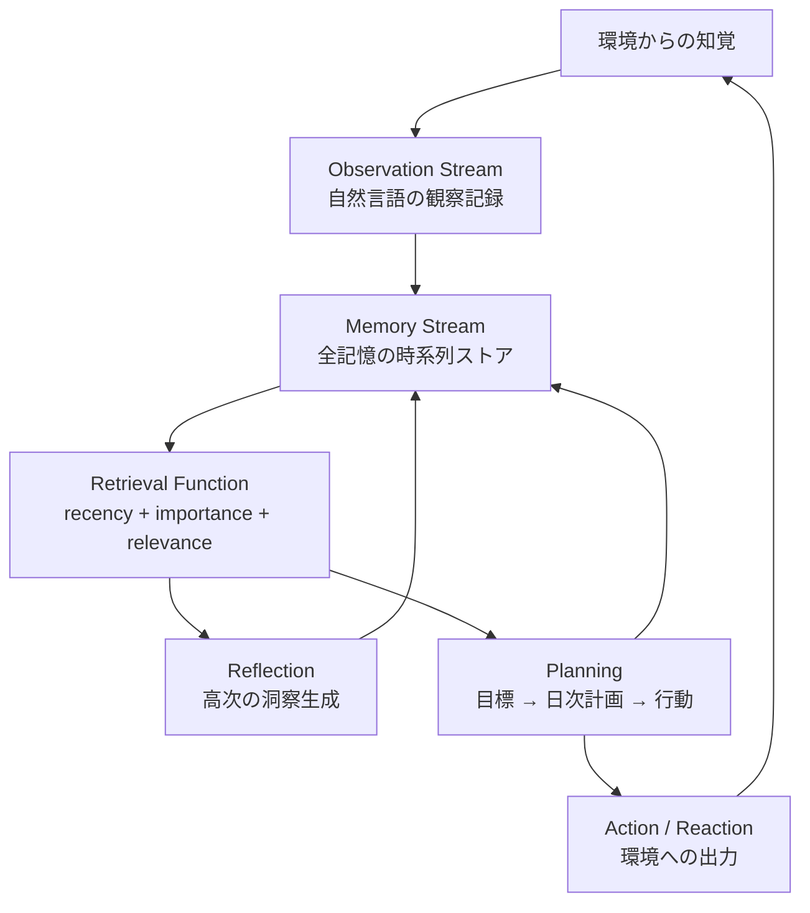
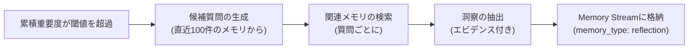

本記事は [https://arxiv.org/abs/2304.03442](https://arxiv.org/abs/2304.03442) の解説記事です。

## 論文概要（Abstract）

Generative Agentsは、大規模言語モデル（LLM）を拡張し、自然言語による経験の完全な記録・高次の反省（Reflection）への統合・動的な記憶検索を通じて、人間的な行動をシミュレートする計算エージェントである。著者らは25体のエージェントが暮らすサンドボックス環境「Smallville」を構築し、情報の伝播・人間関係の形成・バレンタインデーパーティの自発的な企画といった創発的社会行動が出現したと報告している。100名の人間評価者によるアブレーション評価では、Observation・Reflection・Planningの3要素すべてが信頼性のある行動に不可欠であることが示された。

この記事は [Zenn記事: AgentCore 3層メモリで構築するStateful Agent設計パターン](https://zenn.dev/0h_n0/articles/3a3eeb04d7f281) の深掘りです。Zenn記事が扱うAWS Bedrock AgentCoreの3層メモリ（Session Memory / Semantic Memory / Episodic Memory）の設計思想は、本論文のObservation / Reflection / Planningアーキテクチャに強い影響を受けており、両者の対応関係を理解することで実運用における設計判断がより明確になります。

## 情報源

- **arXiv ID**: 2304.03442
- **URL**: [https://arxiv.org/abs/2304.03442](https://arxiv.org/abs/2304.03442)
- **著者**: Joon Sung Park, Joseph C. O'Brien, Carrie J. Cai, et al.
- **発表年**: 2023（UIST 2023）
- **分野**: cs.HC, cs.AI

## 背景と動機（Background & Motivation）

対話型環境（ゲーム、ソーシャルシミュレーション、ロールプレイング等）において、信頼性のある（believable）行動を生成するエージェントは長年の研究課題である。従来手法は以下の制約を抱えていた。

1. **有限状態機械・ビヘイビアツリー**: 行動パターンをハードコードする必要があり、予期しない状況への対応が困難
2. **強化学習ベース**: 報酬関数の設計が難しく、自然言語での柔軟なコミュニケーションが不得意
3. **LLM単体**: 長期的な記憶が保持できず、過去の経験に基づく一貫した行動が取れない

著者らはこの課題に対し、LLMを「メモリアーキテクチャ」で拡張するアプローチを提案した。エージェントの全経験を自然言語のストリームとして保存し、文脈に応じた検索・統合・計画の機構を組み合わせることで、スクリプト不要で信頼性のある行動を実現する。

## 主要な貢献（Key Contributions）

- **3層メモリアーキテクチャ**: Observation（観察）・Reflection（反省）・Planning（計画）の3コンポーネントによるエージェントメモリシステム
- **検索スコアリング関数**: Recency（新しさ）・Importance（重要度）・Relevance（関連度）の3要素を統合したメモリ検索手法
- **創発的社会行動の実証**: 25体のエージェントによるサンドボックス環境で、事前にプログラムされていない社会的行動の出現を確認
- **アブレーション評価**: 各コンポーネントの除去による性能劣化を人間評価で定量的に示した

## 技術的詳細（Technical Details）

### 全体アーキテクチャ

Generative Agentsのアーキテクチャは、メモリストリームを中核に3つのモジュールが連携する構造を持つ。



**Memory Stream**はエージェントの全記憶を時系列に保持するデータストアである。各エントリは自然言語テキスト・作成タイムスタンプ・最終アクセスタイムスタンプ・重要度スコアで構成される。Observation・Reflection・Planの3種類がすべて同一ストリームに格納される点が設計上の特徴であり、検索時に種類を区別せず統一的にスコアリングできる。

### メモリ検索スコアリング

メモリストリームからの検索は、以下の3要素を組み合わせたスコアリング関数で行われる。

$$
\text{score}(m) = \alpha \cdot \text{recency}(m) + \beta \cdot \text{importance}(m) + \gamma \cdot \text{relevance}(m)
$$

ここで、
- $m$: メモリストリーム中の個別メモリエントリ
- $\alpha, \beta, \gamma$: 各要素の重み（論文では正規化後に等重み）

#### Recency（新しさ）

最近アクセスされたメモリほど高スコアを付与する指数減衰関数で定義される。

$$
\text{recency}(m) = e^{-\lambda \cdot \Delta t(m)}
$$

ここで、
- $\lambda$: 減衰率パラメータ（値が大きいほど古い記憶が急速に減衰）
- $\Delta t(m)$: メモリ$m$が最後にアクセスされてからの経過時間（シミュレーション時間）

この設計により、最近参照された記憶が優先的に検索される。直近の会話内容や行動が次の行動決定に反映されやすくなる。

#### Importance（重要度）

メモリの書き込み時にLLMが1〜10のスケールで重要度を採点する。

$$
\text{importance}(m) \in \{1, 2, \ldots, 10\}
$$

具体的には、LLMに「On a scale of 1 to 10, where 1 is purely mundane and 10 is extremely poignant, rate the likely poignancy of the following piece of memory.」というプロンプトを与え、整数値を得る。著者らは以下の例を報告している。

| メモリ内容 | 重要度スコア |
|-----------|------------|
| 歯を磨いた | 1 |
| 朝食を食べた | 2 |
| 恋人と別れた | 9 |
| 大学合格を知った | 8 |

この採点により、日常的な行為（歯磨き、食事）と人生の転機（失恋、合格）が区別される。検索時に重要な記憶が埋もれることを防ぐ役割を担う。

#### Relevance（関連度）

現在の状況や質問に対するメモリの意味的関連度を、埋め込みベクトルのコサイン類似度で算出する。

$$
\text{relevance}(m, q) = \frac{\mathbf{e}(m) \cdot \mathbf{e}(q)}{\|\mathbf{e}(m)\| \cdot \|\mathbf{e}(q)\|}
$$

ここで、
- $\mathbf{e}(m)$: メモリ$m$のテキスト埋め込みベクトル
- $\mathbf{e}(q)$: 現在のクエリ（状況記述や質問文）の埋め込みベクトル

著者らはOpenAI text-embedding-ada-002を使用したと報告している。

#### 統合スコアリングの実装

3要素はそれぞれ値域が異なるため（recencyは0〜1、importanceは1〜10、relevanceは-1〜1）、min-max正規化で0〜1に揃えた上で等重みで加算する。

```python
from dataclasses import dataclass, field
from datetime import datetime
import math
import numpy as np


@dataclass
class MemoryEntry:
    """メモリストリームの個別エントリ

    Args:
        text: 自然言語による記憶内容
        created_at: 作成タイムスタンプ
        last_accessed: 最終アクセスタイムスタンプ
        importance: LLMが採点した重要度 (1-10)
        embedding: テキストの埋め込みベクトル
        memory_type: 記憶の種類 (observation / reflection / plan)
    """
    text: str
    created_at: datetime
    last_accessed: datetime
    importance: int
    embedding: np.ndarray
    memory_type: str = "observation"


def compute_recency(memory: MemoryEntry, current_time: datetime, decay_rate: float = 0.995) -> float:
    """指数減衰によるRecencyスコアを計算

    Args:
        memory: メモリエントリ
        current_time: 現在のシミュレーション時間
        decay_rate: 減衰率 (0 < decay_rate < 1)

    Returns:
        0.0〜1.0のRecencyスコア
    """
    hours_since_access = (current_time - memory.last_accessed).total_seconds() / 3600
    return decay_rate ** hours_since_access


def compute_relevance(memory: MemoryEntry, query_embedding: np.ndarray) -> float:
    """コサイン類似度によるRelevanceスコアを計算

    Args:
        memory: メモリエントリ
        query_embedding: クエリの埋め込みベクトル

    Returns:
        -1.0〜1.0のコサイン類似度
    """
    dot_product = np.dot(memory.embedding, query_embedding)
    norm_product = np.linalg.norm(memory.embedding) * np.linalg.norm(query_embedding)
    if norm_product == 0:
        return 0.0
    return float(dot_product / norm_product)


def min_max_normalize(values: list[float]) -> list[float]:
    """Min-Max正規化で0〜1にスケーリング

    Args:
        values: 正規化対象のスコアリスト

    Returns:
        0.0〜1.0に正規化されたリスト
    """
    v_min, v_max = min(values), max(values)
    if v_max == v_min:
        return [1.0] * len(values)
    return [(v - v_min) / (v_max - v_min) for v in values]


def retrieve_memories(
    stream: list[MemoryEntry],
    query_embedding: np.ndarray,
    current_time: datetime,
    top_k: int = 10,
) -> list[MemoryEntry]:
    """3要素統合スコアリングによるメモリ検索

    Args:
        stream: メモリストリーム全体
        query_embedding: クエリの埋め込みベクトル
        current_time: 現在のシミュレーション時間
        top_k: 返却するメモリ数

    Returns:
        スコア上位のメモリエントリリスト
    """
    recency_scores = [compute_recency(m, current_time) for m in stream]
    importance_scores = [float(m.importance) for m in stream]
    relevance_scores = [compute_relevance(m, query_embedding) for m in stream]

    # Min-Max正規化で値域を統一
    norm_recency = min_max_normalize(recency_scores)
    norm_importance = min_max_normalize(importance_scores)
    norm_relevance = min_max_normalize(relevance_scores)

    # 等重みで統合
    final_scores = [
        r + i + rel
        for r, i, rel in zip(norm_recency, norm_importance, norm_relevance)
    ]

    # スコア降順でtop_k件を返却
    ranked_indices = sorted(range(len(final_scores)), key=lambda idx: final_scores[idx], reverse=True)
    return [stream[idx] for idx in ranked_indices[:top_k]]
```

### Reflection（反省）メカニズム

Reflectionは、蓄積された低レベルの観察から高レベルの洞察を抽出するプロセスである。



**トリガー条件**: 直近のイベントの累積重要度スコアが閾値を超えた時点で発火する。著者らの実装ではエージェントが1日あたり約2〜3回のReflectionを実行すると報告している。

**Reflectionのプロセス**:

1. **候補質問の生成**: 直近100件のメモリをLLMに与え、「Given only the information above, what are 3 most salient high-level questions we can answer about the subjects in the statements?」と質問する
2. **関連メモリの検索**: 生成された各質問をクエリとして検索関数を実行し、関連するメモリを収集する
3. **洞察の抽出**: 収集されたメモリをLLMに与え、引用元のメモリIDを明記した洞察（insight）を生成する

```python
def should_reflect(recent_memories: list[MemoryEntry], threshold: float = 150.0) -> bool:
    """Reflectionトリガー判定

    直近のメモリの累積重要度が閾値を超えたかを判定する。

    Args:
        recent_memories: 前回のReflection以降に追加されたメモリ
        threshold: 累積重要度の閾値

    Returns:
        Reflectionを実行すべきかどうか
    """
    cumulative_importance = sum(m.importance for m in recent_memories)
    return cumulative_importance >= threshold


def generate_reflection(
    recent_memories: list[MemoryEntry],
    memory_stream: list[MemoryEntry],
    query_embedding_fn,
    llm_fn,
    current_time: datetime,
) -> list[MemoryEntry]:
    """Reflectionプロセスの実行

    Args:
        recent_memories: 直近100件のメモリ
        memory_stream: メモリストリーム全体
        query_embedding_fn: テキスト→埋め込みベクトル変換関数
        llm_fn: LLM呼び出し関数
        current_time: 現在時刻

    Returns:
        生成されたReflectionメモリのリスト
    """
    # Step 1: 候補質問の生成
    memory_texts = "\n".join([f"- {m.text}" for m in recent_memories[-100:]])
    questions = llm_fn(
        f"Given only the information below, what are 3 most salient "
        f"high-level questions we can answer?\n{memory_texts}"
    )

    reflections = []
    for question in questions:
        # Step 2: 関連メモリの検索
        q_emb = query_embedding_fn(question)
        relevant = retrieve_memories(memory_stream, q_emb, current_time, top_k=20)

        # Step 3: 洞察の抽出（エビデンス付き）
        context = "\n".join([f"[{i}] {m.text}" for i, m in enumerate(relevant)])
        insight = llm_fn(
            f"Based on the following statements, generate a high-level insight. "
            f"Cite the evidence with [index].\n{context}"
        )

        reflection = MemoryEntry(
            text=insight,
            created_at=current_time,
            last_accessed=current_time,
            importance=8,  # Reflectionは高重要度
            embedding=query_embedding_fn(insight),
            memory_type="reflection",
        )
        reflections.append(reflection)

    return reflections
```

Reflectionの出力例として、著者らは以下を挙げている。「Klaus Muellerは研究に情熱を注いでいる [1, 6, 15]」「Klaus MuellerとMaria Lopezは互いに関心を持っている [3, 9, 14]」のように、具体的な観察から抽象的な人物理解が形成される。

### Planning（計画）メカニズム

Planningは、Reflectionで生成された高次の洞察とエージェントの性格記述を基に、トップダウンで行動計画を生成する。

**計画の階層構造**:

1. **日次計画**: その日の全体的な予定（例：「午前中は研究、午後は学生と面談」）
2. **時間帯計画**: 1時間単位の計画に分解
3. **行動レベル計画**: 5〜15分単位の具体的な行動に分解

```python
@dataclass
class PlanEntry:
    """計画エントリ

    Args:
        description: 計画の自然言語記述
        start_time: 開始時刻
        duration_minutes: 所要時間（分）
        granularity: 計画の粒度 (day / hour / action)
    """
    description: str
    start_time: datetime
    duration_minutes: int
    granularity: str = "action"


def generate_day_plan(
    agent_description: str,
    recent_reflections: list[MemoryEntry],
    llm_fn,
    current_date: datetime,
) -> list[PlanEntry]:
    """日次計画の生成

    Args:
        agent_description: エージェントの性格・職業等の記述
        recent_reflections: 直近のReflectionメモリ
        llm_fn: LLM呼び出し関数
        current_date: 現在の日付

    Returns:
        5-15分粒度の行動計画リスト
    """
    reflection_text = "\n".join([f"- {r.text}" for r in recent_reflections])

    # Step 1: 大まかな日次計画
    broad_plan = llm_fn(
        f"Name: {agent_description}\n"
        f"Recent thoughts:\n{reflection_text}\n"
        f"Generate a broad plan for {current_date.strftime('%A, %B %d')}. "
        f"List 5-8 major activities."
    )

    # Step 2: 時間帯に分解
    hourly_plan = llm_fn(
        f"Break down the following plan into hourly blocks:\n{broad_plan}"
    )

    # Step 3: 5-15分の行動単位に分解
    action_plan = llm_fn(
        f"Break down each hour into 5-15 minute action items:\n{hourly_plan}"
    )

    return parse_plan_entries(action_plan, current_date)
```

計画はメモリストリームに格納され、環境の変化（予期しない出会い、新しい情報）に応じて動的に修正される。例えば、エージェントが通りで知人に遭遇した場合、現在の計画とその人物に関する記憶を検索し、会話するか通り過ぎるかを決定する。

## 実装のポイント（Implementation）

著者らが公開したリポジトリ（[github.com/joonspk-research/generative_agents](https://github.com/joonspk-research/generative_agents)）に基づく実装上の注意点を整理する。

**LLM呼び出しの最適化**: 各エージェントは1日のシミュレーションで数十〜百回以上のLLM呼び出しを行う。25体のエージェントを並行稼働させると1日あたり数千回の呼び出しになるため、バッチ処理やキャッシュの活用が不可欠である。

**埋め込みベクトルの管理**: メモリストリームは時間とともに際限なく成長する。著者らの実装では数千件のメモリエントリが蓄積されるため、ベクトル検索の効率化（近似最近傍探索等）が長期シミュレーションでは重要になる。

**重要度スコアの安定性**: LLMによる1〜10の採点は確率的であり、同じ入力でも異なるスコアが返る場合がある。プロダクション環境では温度パラメータの低設定（temperature=0）や複数回採点の中央値取得が有効である。

**Reflectionの閾値調整**: 閾値が低すぎるとReflectionが頻発しコストが増大する。高すぎると高次の洞察が不足し、行動の一貫性が低下する。著者らのシミュレーションでは1日あたり2〜3回のReflectionが適切なバランスだったと報告している。

## Production Deployment Guide

本論文のメモリアーキテクチャは、AWS Bedrock AgentCoreのStateful Agent設計と直接対応する。以下では、Generative Agentsの3層メモリをAWS上で本番運用する際の構成を示す。

### AWS実装パターン（コスト最適化重視）

**トラフィック量別の推奨構成**:

| 構成 | トラフィック | AWSサービス | 月額概算 |
|------|-------------|------------|---------|
| Small | ~100 req/日 | Lambda + Bedrock + DynamoDB | $80-200 |
| Medium | ~1,000 req/日 | ECS Fargate + Bedrock + OpenSearch Serverless | $400-900 |
| Large | 10,000+ req/日 | EKS + Spot + Bedrock + OpenSearch | $2,500-6,000 |

**Small構成（~100 req/日）**: Lambda関数でメモリ検索・Reflection・Planning各フェーズを処理する。メモリストリームはDynamoDB（On-Demand）に格納し、埋め込みベクトルはDynamoDB上にバイナリ属性として保存する。Bedrock（Claude Haiku）でimportanceスコアリングとReflection生成を行う。Prompt Cachingで30-90%のコスト削減が見込める。

**Medium構成（~1,000 req/日）**: ECS Fargateでエージェントランタイムを常駐させる。メモリストリームのベクトル検索にはOpenSearch Serverlessを使用し、コサイン類似度検索を高速化する。Bedrock（Claude Sonnet）でReflection生成を行い、Batch APIで非同期処理可能なタスクをまとめて50%削減する。

**Large構成（10,000+ req/日）**: EKSクラスタにKarpenterを導入し、Spot Instances優先で最大90%のコンピューティングコスト削減を実現する。OpenSearch（マネージド）で大規模ベクトル検索を処理し、ElastiCacheでRecencyスコアのキャッシュを行う。

**コスト削減テクニック**:
- Spot Instances活用: EKSワーカーノードで最大90%削減
- Reserved Instances: OpenSearchの1年コミットで最大42%削減
- Bedrock Batch API: 非リアルタイムのReflection生成で50%削減
- Prompt Caching: importanceスコアリングの定型プロンプトで30-90%削減
- DynamoDB On-Demand: 低トラフィック時の過剰プロビジョニング回避

**コスト試算の注意事項**: 上記は2026年4月時点のAWS ap-northeast-1（東京）リージョン料金に基づく概算値である。実際のコストはトラフィックパターン、バースト使用量、モデル選択により変動する。最新料金はAWS料金計算ツールで確認を推奨する。

### Terraformインフラコード

**Small構成（Serverless）**: Lambda + Bedrock + DynamoDB

```hcl
# --- Small構成: Generative Agents Memory System ---
# Lambda + Bedrock + DynamoDB (Serverless)

provider "aws" {
  region = "ap-northeast-1"
}

# DynamoDB: メモリストリーム格納
resource "aws_dynamodb_table" "memory_stream" {
  name         = "generative-agents-memory-stream"
  billing_mode = "PAY_PER_REQUEST"  # On-Demand: 低トラフィック時のコスト最適化
  hash_key     = "agent_id"
  range_key    = "created_at"

  attribute {
    name = "agent_id"
    type = "S"
  }

  attribute {
    name = "created_at"
    type = "S"
  }

  # KMS暗号化
  server_side_encryption {
    enabled = true
  }

  point_in_time_recovery {
    enabled = true
  }

  tags = {
    Project = "generative-agents"
    Cost    = "on-demand"
  }
}

# IAMロール: Lambda用（最小権限）
resource "aws_iam_role" "lambda_role" {
  name = "generative-agents-lambda-role"

  assume_role_policy = jsonencode({
    Version = "2012-10-17"
    Statement = [{
      Action = "sts:AssumeRole"
      Effect = "Allow"
      Principal = { Service = "lambda.amazonaws.com" }
    }]
  })
}

resource "aws_iam_role_policy" "lambda_policy" {
  name = "generative-agents-lambda-policy"
  role = aws_iam_role.lambda_role.id

  policy = jsonencode({
    Version = "2012-10-17"
    Statement = [
      {
        Effect   = "Allow"
        Action   = ["dynamodb:GetItem", "dynamodb:PutItem", "dynamodb:Query", "dynamodb:UpdateItem"]
        Resource = aws_dynamodb_table.memory_stream.arn
      },
      {
        Effect   = "Allow"
        Action   = ["bedrock:InvokeModel"]
        Resource = "arn:aws:bedrock:ap-northeast-1::foundation-model/anthropic.claude-3-5-haiku-*"
      },
      {
        Effect   = "Allow"
        Action   = ["logs:CreateLogGroup", "logs:CreateLogStream", "logs:PutLogEvents"]
        Resource = "arn:aws:logs:ap-northeast-1:*:*"
      }
    ]
  })
}

# Lambda: メモリ検索・Reflection・Planning
resource "aws_lambda_function" "memory_agent" {
  function_name = "generative-agents-memory"
  runtime       = "python3.12"
  handler       = "handler.lambda_handler"
  role          = aws_iam_role.lambda_role.arn
  timeout       = 120       # Reflection生成に最大2分
  memory_size   = 512       # 埋め込みベクトル計算用

  environment {
    variables = {
      MEMORY_TABLE    = aws_dynamodb_table.memory_stream.name
      BEDROCK_MODEL   = "anthropic.claude-3-5-haiku-20241022-v1:0"
      DECAY_RATE      = "0.995"
      REFLECT_THRESHOLD = "150"
    }
  }

  tags = {
    Project = "generative-agents"
  }
}

# CloudWatch アラーム: コスト監視
resource "aws_cloudwatch_metric_alarm" "lambda_duration" {
  alarm_name          = "generative-agents-lambda-duration"
  comparison_operator = "GreaterThanThreshold"
  evaluation_periods  = 3
  metric_name         = "Duration"
  namespace           = "AWS/Lambda"
  period              = 300
  statistic           = "Average"
  threshold           = 90000  # 90秒
  alarm_description   = "Lambda実行時間が90秒を超過"

  dimensions = {
    FunctionName = aws_lambda_function.memory_agent.function_name
  }
}
```

**Large構成（Container）**: EKS + Karpenter + Spot Instances

```hcl
# --- Large構成: Generative Agents at Scale ---
# EKS + Karpenter (Spot優先) + OpenSearch

module "eks" {
  source  = "terraform-aws-modules/eks/aws"
  version = "~> 20.31"

  cluster_name    = "generative-agents-cluster"
  cluster_version = "1.31"

  vpc_id     = module.vpc.vpc_id
  subnet_ids = module.vpc.private_subnets

  # パブリックアクセス最小化
  cluster_endpoint_public_access  = false
  cluster_endpoint_private_access = true
}

# Karpenter: Spot優先の自動スケーリング
resource "kubectl_manifest" "karpenter_provisioner" {
  yaml_body = yamlencode({
    apiVersion = "karpenter.sh/v1"
    kind       = "NodePool"
    metadata   = { name = "agents-pool" }
    spec = {
      template = {
        spec = {
          requirements = [
            { key = "karpenter.sh/capacity-type", operator = "In", values = ["spot", "on-demand"] },
            { key = "node.kubernetes.io/instance-type", operator = "In",
              values = ["m6i.xlarge", "m6a.xlarge", "m7i.xlarge"] },
          ]
          nodeClassRef = { name = "default" }
        }
      }
      limits   = { cpu = "64", memory = "256Gi" }
      disruption = {
        consolidationPolicy = "WhenEmptyOrUnderutilized"
        consolidateAfter    = "30s"
      }
    }
  })
}

# Secrets Manager: Bedrock設定
resource "aws_secretsmanager_secret" "bedrock_config" {
  name        = "generative-agents/bedrock-config"
  description = "Bedrock model configuration for Generative Agents"
}

# AWS Budgets: 月額予算アラート
resource "aws_budgets_budget" "monthly" {
  name         = "generative-agents-monthly"
  budget_type  = "COST"
  limit_amount = "6000"
  limit_unit   = "USD"
  time_unit    = "MONTHLY"

  notification {
    comparison_operator       = "GREATER_THAN"
    threshold                 = 80
    threshold_type            = "PERCENTAGE"
    notification_type         = "ACTUAL"
    subscriber_email_addresses = ["ops-team@example.com"]
  }
}
```

### 運用・監視設定

**CloudWatch Logs Insights クエリ**（トークン使用量の異常検知）:

```
fields @timestamp, agent_id, token_count, operation
| filter operation in ["reflection", "importance_scoring", "planning"]
| stats sum(token_count) as total_tokens by bin(1h), operation
| sort total_tokens desc
```

**CloudWatch Logs Insights クエリ**（Reflection頻度の監視）:

```
fields @timestamp, agent_id, reflection_trigger_score
| filter operation = "reflection"
| stats count(*) as reflection_count by agent_id, bin(1d)
| sort reflection_count desc
```

**CloudWatch アラーム設定（Python）**:

```python
import boto3


def create_token_usage_alarm(cloudwatch_client: boto3.client) -> None:
    """Bedrockトークン使用量のスパイク検知アラームを作成

    Args:
        cloudwatch_client: CloudWatch Boto3クライアント
    """
    cloudwatch_client.put_metric_alarm(
        AlarmName="generative-agents-token-spike",
        MetricName="InputTokenCount",
        Namespace="AWS/Bedrock",
        Statistic="Sum",
        Period=3600,
        EvaluationPeriods=2,
        Threshold=500000,
        ComparisonOperator="GreaterThanThreshold",
        AlarmDescription="1時間あたりのBedrock入力トークンが50万を超過",
        AlarmActions=["arn:aws:sns:ap-northeast-1:123456789012:ops-alerts"],
    )
```

**X-Ray トレーシング設定（Python）**:

```python
from aws_xray_sdk.core import xray_recorder, patch_all

# boto3自動計装
patch_all()

xray_recorder.configure(
    sampling=True,
    context_missing="LOG_ERROR",
    daemon_address="127.0.0.1:2000",
)


def trace_memory_retrieval(agent_id: str, query: str, results_count: int) -> None:
    """メモリ検索のX-Rayトレーシング

    Args:
        agent_id: エージェント識別子
        query: 検索クエリ
        results_count: 検索結果件数
    """
    segment = xray_recorder.current_segment()
    segment.put_annotation("agent_id", agent_id)
    segment.put_annotation("operation", "memory_retrieval")
    segment.put_metadata("query", query, "memory")
    segment.put_metadata("results_count", results_count, "memory")
```

**Cost Explorer自動レポート（Python）**:

```python
import boto3
from datetime import datetime, timedelta


def get_daily_cost_report(ce_client: boto3.client, sns_client: boto3.client) -> dict:
    """日次コストレポートを取得し、閾値超過時にSNS通知

    Args:
        ce_client: Cost Explorer Boto3クライアント
        sns_client: SNS Boto3クライアント

    Returns:
        サービス別コスト辞書
    """
    today = datetime.utcnow().strftime("%Y-%m-%d")
    yesterday = (datetime.utcnow() - timedelta(days=1)).strftime("%Y-%m-%d")

    response = ce_client.get_cost_and_usage(
        TimePeriod={"Start": yesterday, "End": today},
        Granularity="DAILY",
        Metrics=["UnblendedCost"],
        Filter={
            "Tags": {"Key": "Project", "Values": ["generative-agents"]}
        },
        GroupBy=[{"Type": "DIMENSION", "Key": "SERVICE"}],
    )

    costs = {}
    total = 0.0
    for group in response["ResultsByTime"][0]["Groups"]:
        service = group["Keys"][0]
        amount = float(group["Metrics"]["UnblendedCost"]["Amount"])
        costs[service] = amount
        total += amount

    if total > 100.0:
        sns_client.publish(
            TopicArn="arn:aws:sns:ap-northeast-1:123456789012:cost-alerts",
            Subject="Generative Agents: 日次コスト超過",
            Message=f"日次コスト: ${total:.2f}\n内訳: {costs}",
        )

    return costs
```

### コスト最適化チェックリスト

**アーキテクチャ選択**:
- [ ] トラフィック量に基づく構成選択（Small: <100 req/日 / Medium: <1,000 req/日 / Large: 10,000+ req/日）
- [ ] エージェント数に応じたスケーリング戦略の決定

**リソース最適化**:
- [ ] EC2/EKS: Spot Instances優先（最大90%削減）
- [ ] Reserved Instances: OpenSearch 1年コミット（最大42%削減）
- [ ] Savings Plans: Fargate/Lambda向け検討
- [ ] Lambda: メモリサイズ最適化（Power Tuningで検証）
- [ ] EKS: Karpenterによるアイドル時スケールダウン（consolidateAfter: 30s）

**LLMコスト削減**:
- [ ] Bedrock Batch API: 非リアルタイムのReflection生成で50%削減
- [ ] Prompt Caching: importanceスコアリングの定型プロンプトで30-90%削減
- [ ] モデル選択ロジック: importanceスコアリングはHaiku、ReflectionはSonnetと用途別に使い分け
- [ ] トークン数制限: Reflection入力を直近100件に制限（論文準拠）
- [ ] 埋め込みモデル: Bedrock Titan Embeddings V2で低コスト埋め込み生成

**監視・アラート**:
- [ ] AWS Budgets: 月額予算の80%で警告
- [ ] CloudWatch アラーム: トークン使用量スパイク検知
- [ ] Cost Anomaly Detection: サービス別異常検知有効化
- [ ] 日次コストレポート: Cost Explorer API + SNS通知

**リソース管理**:
- [ ] 未使用リソース削除: 停止エージェントのメモリストリーム定期アーカイブ
- [ ] タグ戦略: Project / Environment / AgentID でタグ付け
- [ ] DynamoDBライフサイクル: TTLで古いObservationを自動削除
- [ ] 開発環境: 夜間のEKSノード停止（Karpenter disruption policy）
- [ ] メモリストリームのS3アーカイブ: 古い記憶をS3 Glacier Deep Archiveに移行

## 実験結果（Results）

著者らは25体のGenerative Agentsが2日間生活するサンドボックス環境「Smallville」を構築し、評価を行った。

### 評価手法

100名のAmazon Mechanical Turk評価者がインタビュー形式でエージェントの応答を評価した。5つの行動カテゴリ（自己認識・記憶・計画・反応・反省）について、以下の条件を比較する。

| 条件 | Observation | Reflection | Planning |
|------|:-----------:|:----------:|:--------:|
| Full architecture | あり | あり | あり |
| No reflection | あり | なし | あり |
| No planning | あり | あり | なし |
| No observation | なし | あり | あり |

### 結果

Kruskal-Wallis検定の結果、Full architectureが全アブレーション条件に対して統計的に有意な優位性を示した（論文Section 6.2）。著者らは各コンポーネントの除去による影響を以下のように報告している。

- **Reflection除去**: エージェントが過去の経験から高次の洞察を引き出せなくなり、行動の一貫性が低下した。例えば、ある人物との関係性を「知人」として扱い続け、複数回の深い対話の蓄積を反映できなかった
- **Planning除去**: 行動が場当たり的になり、1日の活動に構造がなくなった。食事・仕事・休息のバランスが崩れた
- **Observation除去**: 環境の変化に対応できず、他のエージェントとの対話で文脈を失った

### 創発的行動

事前にプログラムされていない社会的行動が観察された。

- **情報の伝播**: あるエージェントがバレンタインデーパーティを企画し、その情報が対話を通じて他のエージェントに広まった。最終的に5体のエージェントが自発的にパーティに参加した
- **関係性の形成**: 初対面のエージェント同士が複数回の対話を経て友人関係を形成し、Reflectionで「この人物は信頼できる」という洞察を生成した
- **協調的活動**: 研究者エージェントと学生エージェントが自発的にミーティングを設定し、研究テーマについて議論した

## 実運用への応用（Practical Applications）

本論文のメモリアーキテクチャは、Zenn記事で扱うAWS Bedrock AgentCoreの設計と以下のように対応する。

| Generative Agents | AgentCore 3層メモリ | 役割 |
|-------------------|--------------------|----|
| Observation Stream | Session Memory | 直近の対話・知覚の記録 |
| Reflection | Semantic Memory | 高次の知識・洞察 |
| Planning | Episodic Memory + Plan | 過去の行動パターンと将来の計画 |

**カスタマーサポートBot**: メモリストリームに過去の問い合わせ履歴を蓄積し、Reflectionで「この顧客はネットワーク関連の問題を繰り返し報告している」という洞察を生成する。Planningでエスカレーション判断を自動化する。

**コード生成エージェント**: Observation（エラーログ・コードレビューコメント）→ Reflection（「このリポジトリではnullチェックの漏れが頻出する」）→ Planning（コード生成時にnullチェックを自動挿入する計画）の流れで、プロジェクト固有の知識を蓄積しながらコード品質を継続的に改善する。

**スケーリングの課題**: メモリストリームが無制限に成長するため、本番環境ではTTLベースのObservation削除、Reflectionの定期圧縮（古い洞察を新しい洞察に統合）、ベクトルインデックスの再構築といった運用設計が必要になる。

## 関連研究（Related Work）

- **MemGPT** (Packer et al., 2023): OS仮想メモリの階層的ページング機構をLLMエージェントに適用し、メインコンテキストとアーカイブの2層でメモリを管理する。Generative Agentsの3層構造とは異なり、明示的なReflectionステップを持たない
- **Reflexion** (Shinn et al., 2023): 言語フィードバックによる自己反省を強化学習に組み込んだ手法。Generative AgentsのReflectionと動機は共通するが、Reflexionはタスク失敗時にのみ反省を行う点が異なる
- **Voyager** (Wang et al., 2023): Minecraftにおけるオープンエンドエージェントで、スキルライブラリをメモリとして蓄積する。Generative Agentsが自然言語の記憶を扱うのに対し、Voyagerは実行可能なコードスニペットを記憶として保存する

## まとめと今後の展望

Generative Agentsは、Observation・Reflection・Planningの3層メモリアーキテクチャにより、LLMベースのエージェントに長期記憶と一貫した行動生成を実現した。Recency・Importance・Relevanceの3要素を統合したメモリ検索スコアリングは、そのシンプルさと有効性から、AgentCoreをはじめとする後続のエージェントフレームワークに広く影響を与えている。

今後の研究方向としては、メモリストリームのスケーラビリティ改善（数万件以上のメモリに対する効率的な検索）、Reflectionの品質評価指標の確立、マルチエージェント間でのメモリ共有メカニズムが挙げられる。実務的には、本論文のアーキテクチャをAWS Bedrock AgentCoreやLangGraphなどのフレームワーク上でいかに効率的に実装するかが、Stateful Agentの普及における鍵となる。

## 参考文献

- **arXiv**: [https://arxiv.org/abs/2304.03442](https://arxiv.org/abs/2304.03442)
- **Code**: [https://github.com/joonspk-research/generative_agents](https://github.com/joonspk-research/generative_agents)
- **Related Zenn article**: [https://zenn.dev/0h_n0/articles/3a3eeb04d7f281](https://zenn.dev/0h_n0/articles/3a3eeb04d7f281)
