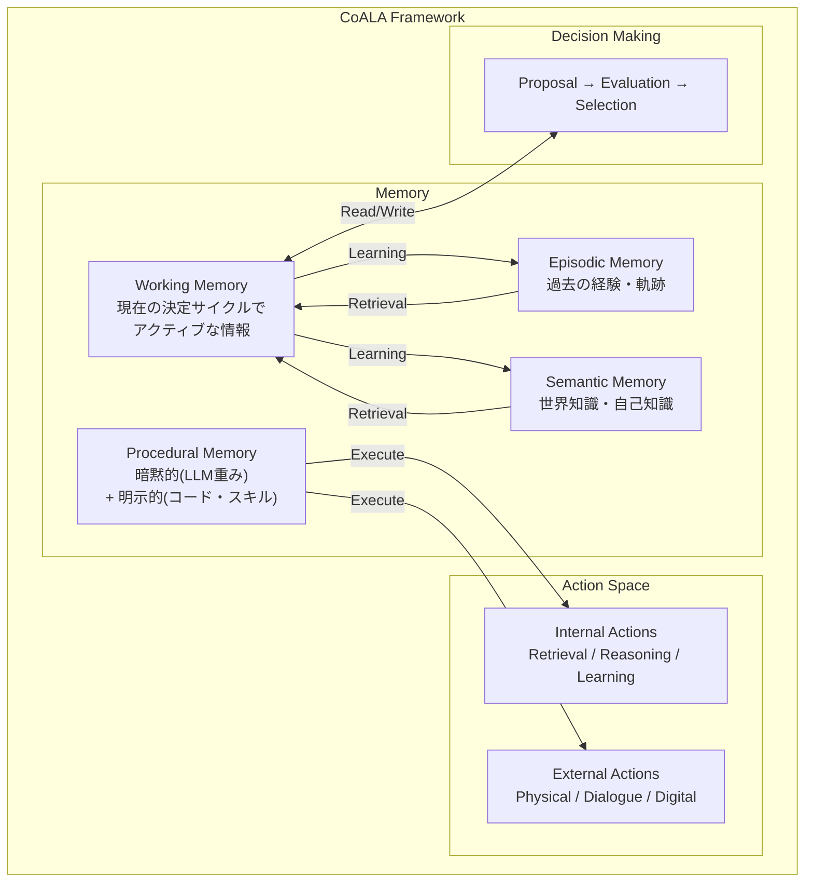
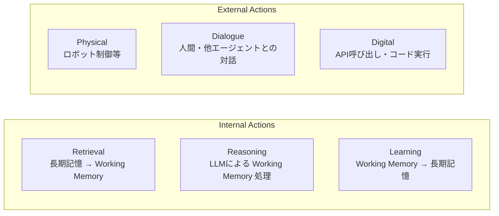
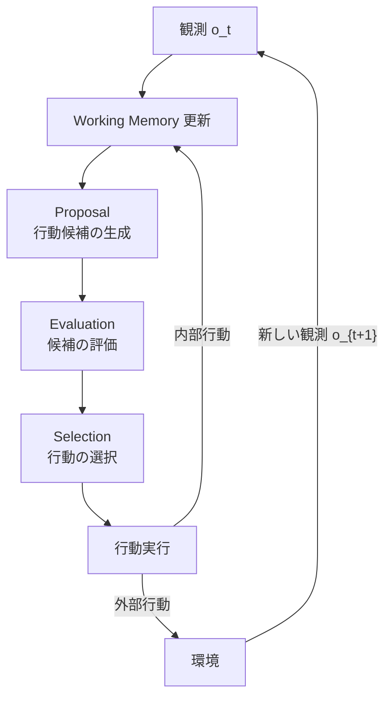
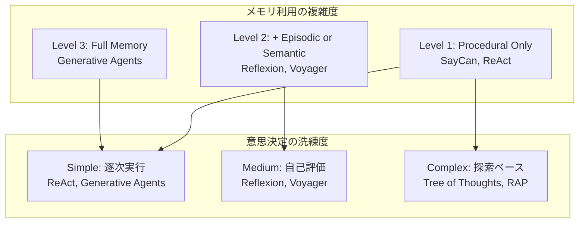

本記事は [https://arxiv.org/abs/2309.02427](https://arxiv.org/abs/2309.02427) の解説記事です。

## 論文概要（Abstract）

CoALA（Cognitive Architectures for Language Agents）は、認知科学における認知アーキテクチャの知見をLLMベースのエージェントに適用し、情報記憶（Memory）、行動空間（Action Space）、意思決定手続き（Decision-Making Procedure）の3次元でエージェントを体系的に分類するフレームワークである。著者らは、Working Memory・Episodic Memory・Semantic Memory・Procedural Memoryの4種類のメモリ分類体系を提案し、ReAct・Voyager・Generative Agentsなど既存のLLMエージェントをこの枠組みで統一的に整理している。本フレームワークにより、エージェント設計の空白領域や今後の研究方向が明確になると著者らは報告している。

この記事は [Zenn記事: AgentCore 3層メモリで構築するStateful Agent設計パターン](https://zenn.dev/0h_n0/articles/3a3eeb04d7f281) の深掘りです。Zenn記事ではAWS AgentCoreの3層メモリ（Working / Short-term / Long-term）を実装レベルで解説していますが、本記事ではその理論的背景となるCoALAの認知科学的メモリ分類体系を詳細に解説します。AgentCoreの設計がどのような学術的基盤の上に成立しているかを理解することで、独自のStateful Agent設計における判断精度が向上します。

## 情報源

- **arXiv ID**: 2309.02427
- **URL**: [https://arxiv.org/abs/2309.02427](https://arxiv.org/abs/2309.02427)
- **著者**: Theodore R. Sumers, Shunyu Yao, Karthik Narasimhan, Thomas L. Griffiths
- **発表年**: 2023
- **分野**: cs.AI, cs.CL

## 背景と動機（Background & Motivation）

LLMベースのエージェント研究は2023年時点で急速に発展していたが、各エージェントの設計は個別の問題設定に特化しており、統一的な比較・分類の枠組みが欠如していた。ReActは推論と行動を交互に行い、Voyagerはスキルライブラリを自律的に拡張し、Generative Agentsは仮想社会でエピソード記憶を活用する。しかし、これらのエージェントが「メモリ」「行動」「意思決定」のどの要素をどのように実装しているかを統一的に比較する方法は確立されていなかった。

著者らはこの課題に対し、認知科学で半世紀にわたり研究されてきた認知アーキテクチャ（Soar、ACT-R等）の知見を導入する。人間の認知を「記憶」「行動」「制御」の観点で整理する枠組みは、LLMエージェントにも適用可能であるという仮説のもと、CoALAフレームワークを提案している。この分類体系により、既存エージェントの設計上の選択が明示化され、未探索の設計空間が特定されることを目的としている。

## 主要な貢献（Key Contributions）

- **認知科学に基づくメモリ分類体系**: Working・Episodic・Semantic・Proceduralの4メモリタイプをLLMエージェントに適用する体系を確立
- **統一的なエージェント分析フレームワーク**: 情報記憶・行動空間・意思決定手続きの3次元でLLMエージェントを横断的に比較可能にする枠組みを提案
- **設計空間の可視化**: 既存エージェントのマッピングを通じて、未活用の設計パターンや今後の研究方向を明確化

## 技術的詳細（Technical Details）

### CoALAの全体アーキテクチャ

CoALAは認知アーキテクチャの3つの構成要素でLLMエージェントを記述する。



### メモリ分類体系

CoALAのメモリ分類体系は、認知心理学におけるAtkinson-Shiffrinモデルおよびその拡張（Tulvingのエピソード記憶理論等）に基づいている。著者らは以下の4種類のメモリを定義している。

#### Working Memory（作業記憶）

Working Memoryは、現在の決定サイクルにおいてアクティブに利用可能な情報を保持する短期的な記憶空間である。LLMエージェントにおいては、LLMのコンテキストウィンドウに含まれる情報がこれに相当する。

形式的には、時刻 $t$ におけるWorking Memoryの状態を $\mathbf{w}_t$ とすると、

$$
\mathbf{w}_t = \{o_t, r_1, r_2, \ldots, r_k, c_1, c_2, \ldots, c_m\}
$$

ここで、
- $o_t$: 時刻 $t$ における観測（環境からの入力）
- $r_i$: 長期記憶から検索された情報（$i = 1, \ldots, k$）
- $c_j$: 推論プロセスで生成された中間結果（$j = 1, \ldots, m$）

Working MemoryはCoALAにおける中央ハブであり、全てのコンポーネントとの双方向的な読み書きを担う。他のメモリタイプからの情報はRetrievalを通じてWorking Memoryに読み込まれ、Working Memoryからの情報はLearningを通じて長期記憶に書き込まれる。

#### Episodic Memory（エピソード記憶）

Episodic Memoryは、エージェントの過去の経験を時系列順に保持する長期記憶である。認知科学では「いつ・どこで・何が起きたか」という文脈付きの自伝的記憶に相当する。

LLMエージェントにおいては、以下のような情報が格納される。

- 過去の決定サイクルにおける状態-行動-結果の軌跡（trajectories）
- 学習用の訓練ペア（few-shot examples）
- イベントフロー（event streams）

エピソード $e$ は以下のタプルで表現される。

$$
e = (s, a, s', r, \tau)
$$

ここで、
- $s$: 状態（Working Memoryのスナップショット）
- $a$: 実行された行動
- $s'$: 遷移後の状態
- $r$: 報酬またはフィードバック
- $\tau$: タイムスタンプ

Episodic MemoryへのアクセスはRetrievalによる読み出しとLearningによる書き込みの2操作が定義される。Generative Agentsでは、エージェントの日常体験がエピソードとして蓄積され、リフレクション（反省）時に検索・再構成される。

#### Semantic Memory（意味記憶）

Semantic Memoryは、エージェントが保持する世界に関する一般的知識である。認知科学では「首都は東京である」のような文脈非依存の事実的知識に相当する。

LLMエージェントにおいては以下が該当する。

- 外部データベースやナレッジグラフ
- RAG（Retrieval-Augmented Generation）で利用するドキュメントストア
- エージェント自身が推論で獲得した知識

Semantic Memoryの知識 $k$ は以下で表現される。

$$
k = (h, v, \sigma)
$$

ここで、
- $h$: 知識の見出し（heading / key）
- $v$: 知識の内容（value）
- $\sigma$: 信頼度スコア（optional）

Semantic Memoryの特徴は、Episodic Memoryと異なりタイムスタンプに依存しない点である。知識はエージェントの推論によって自律的に追加・更新される場合もあれば、外部データベースとして事前に初期化される場合もある。

#### Procedural Memory（手続き記憶）

Procedural Memoryは、エージェントが「どのように行動するか」を規定する記憶であり、CoALAにおいて最も特異な構成要素である。著者らはこれを暗黙的（Implicit）と明示的（Explicit）の2つに分類している。

- **暗黙的手続き記憶**: LLMの重みパラメータ $\theta$ そのもの。事前学習によって獲得された言語能力・推論能力が含まれる
- **明示的手続き記憶**: エージェントのコード、プロンプトテンプレート、スキルライブラリなど。プログラムとして記述された行動規則

$$
\text{PM} = \underbrace{\theta}_{\text{Implicit}} \cup \underbrace{\{p_1, p_2, \ldots, p_n\}}_{\text{Explicit}}
$$

ここで、
- $\theta$: LLMのパラメータ（暗黙的）
- $p_i$: $i$ 番目のプログラム・スキル（明示的）

Voyagerのスキルライブラリは明示的手続き記憶の代表例である。エージェントが新しいMinecraftスキルをJavaScriptコードとして保存し、再利用可能な形で蓄積する。著者らは、手続き記憶の修正（特にLLM重みの変更）はリスクが高い操作であると指摘している。

### 行動空間（Action Space）

CoALAはエージェントの行動を内部行動（Internal Actions）と外部行動（External Actions）に分類する。



**内部行動**は環境に影響を与えずエージェント内部の情報処理のみを行う。

- **Retrieval**: 長期記憶（Episodic / Semantic / Procedural）からWorking Memoryに情報を読み出す操作。検索クエリ $q$ に対して類似度関数 $\text{sim}(q, m)$ を用いてメモリ項目 $m$ を選択する

$$
\text{Retrieve}(q, \mathcal{M}) = \arg\max_{m \in \mathcal{M}} \text{sim}(q, m)
$$

- **Reasoning**: Working Memory内の情報をLLMで処理し、新たな中間結果を生成する操作。Chain-of-Thought、Self-Reflection等が該当する
- **Learning**: Working Memoryの情報を長期記憶に書き込む操作。Episodic Memory への経験記録、Semantic Memoryへの知識追加、Procedural Memoryへのスキル保存が含まれる

**外部行動**は環境に影響を与える操作である。

- **Physical**: ロボット等の物理制御（SayCanが該当）
- **Dialogue**: 人間や他のエージェントとの自然言語対話
- **Digital**: API呼び出し、Webブラウジング、コード実行等

### 意思決定手続き（Decision-Making Procedure）

CoALAの意思決定は3段階のループで構成される。



**Proposal（提案）**: 推論や検索を通じて行動候補 $\{a_1, a_2, \ldots, a_n\}$ を生成する。単一のLLM呼び出しで1つの候補を生成する単純な方式から、Tree of Thoughtsのような複数候補の並列生成まで幅がある。

**Evaluation（評価）**: 各候補 $a_i$ に対して価値 $V(a_i)$ を割り当てる。評価方法は以下の4種類が報告されている。

$$
V(a_i) = \begin{cases}
\text{heuristic}(a_i) & \text{（ヒューリスティック）} \\
-\log p_{\text{LLM}}(a_i) & \text{（LLMパープレキシティ）} \\
V_\phi(a_i) & \text{（学習済み価値関数）} \\
\text{LLM\_reason}(a_i) & \text{（LLM推論による評価）}
\end{cases}
$$

ここで、
- $\text{heuristic}(a_i)$: ドメイン固有のルールに基づく評価
- $p_{\text{LLM}}(a_i)$: LLMが $a_i$ を生成する確率
- $V_\phi(a_i)$: パラメータ $\phi$ を持つ学習済み価値関数
- $\text{LLM\_reason}(a_i)$: LLM自身が推論で評価を行う方法

**Selection（選択）**: 評価結果に基づき実行する行動を決定する。

$$
a^* = \begin{cases}
\arg\max_i V(a_i) & \text{（argmax）} \\
\text{sample} \sim \text{softmax}(V(a_i) / T) & \text{（温度付きサンプリング）} \\
\text{majority\_vote}(\{a_i\}) & \text{（多数決）}
\end{cases}
$$

ここで、$T$ は温度パラメータであり、$T \to 0$ でargmaxに収束し、$T \to \infty$ でランダム選択に近づく。

## エージェント比較分析（Agent Mapping）

著者らはCoALAフレームワークを用いて既存のLLMエージェントを分析している。以下は論文の分析に基づく比較表である。

### メモリ構成の比較

| エージェント | Working Memory | Episodic Memory | Semantic Memory | Procedural Memory |
|:---|:---:|:---:|:---:|:---:|
| SayCan | コンテキスト | -- | -- | 暗黙的（LLM）+ 明示的（スキル） |
| ReAct | コンテキスト + 思考 | -- | -- | 暗黙的（LLM）のみ |
| Reflexion | コンテキスト + 思考 | 反省履歴 | -- | 暗黙的（LLM）のみ |
| Voyager | コンテキスト | -- | -- | 暗黙的 + スキルライブラリ |
| DEPS | コンテキスト + プラン | -- | -- | 暗黙的 + 明示的（分解計画） |
| Generative Agents | コンテキスト + 計画 | 体験ログ + リフレクション | 世界状態 | 暗黙的（LLM）のみ |
| Tree of Thoughts | 複数思考パス | -- | -- | 暗黙的（LLM）のみ |
| RAP | 世界モデル状態 | -- | -- | 暗黙的（LLM）のみ |

### 行動空間の比較

| エージェント | Retrieval | Reasoning | Learning | Physical | Dialogue | Digital |
|:---|:---:|:---:|:---:|:---:|:---:|:---:|
| SayCan | -- | -- | -- | Yes | -- | -- |
| ReAct | -- | CoT | -- | -- | -- | Yes |
| Reflexion | Yes | CoT + 反省 | 反省記録 | -- | -- | Yes |
| Voyager | Yes | CoT | スキル保存 | -- | -- | Yes |
| DEPS | -- | 分解 + 説明 | -- | -- | -- | Yes |
| Generative Agents | Yes | 計画 + 反省 | 体験記録 | -- | Yes | -- |
| Tree of Thoughts | -- | 複数パス探索 | -- | -- | -- | -- |
| RAP | -- | MCTS | -- | -- | -- | Yes |

### 意思決定手続きの比較

| エージェント | Proposal | Evaluation | Selection |
|:---|:---|:---|:---|
| SayCan | LLM生成 | アフォーダンス関数（物理的実行可能性） | argmax |
| ReAct | LLM推論 | なし（逐次実行） | 単一候補 |
| Reflexion | LLM推論 | 自己反省 | 反省ベース再生成 |
| Voyager | LLM推論 | 環境フィードバック | 成功まで再試行 |
| DEPS | LLM分解 | 説明ベース評価 | argmax |
| Generative Agents | LLM計画 | なし（逐次実行） | 単一候補 |
| Tree of Thoughts | 複数候補並列生成 | LLM推論による評価 | BFS / DFS |
| RAP | 世界モデルシミュレーション | 報酬関数 | MCTS |

### エージェント設計パターンの分布



この図から読み取れるのは、メモリの複雑度と意思決定の洗練度が必ずしも相関しないという点である。Generative Agentsは全メモリタイプを活用するが意思決定は逐次的であり、Tree of Thoughtsはメモリを持たないが意思決定は高度な探索ベースである。著者らはこの非対称性が設計空間における未探索の領域を示唆していると指摘している。

## 実装のポイント（Implementation）

CoALAは分類体系であり特定の実装を提供するものではないが、著者らの分析からエージェント設計における以下の実装上の考慮点が導出される。

**メモリの選択基準**: タスクの時間軸が重要な判断基準となる。短期的なQAタスクではWorking Memoryのみで十分であるが、長期的なプロジェクト管理や対話エージェントではEpisodic MemoryやSemantic Memoryが必要になる。

**Retrievalの設計**: 著者らはRetrievalの統合が十分に研究されていないと指摘している。類似度ベースの検索（ベクトル検索）だけでなく、時間的な近接性、重要度スコア、タスク関連度を組み合わせたハイブリッド検索が必要になる。Generative Agentsはrecency（新しさ）、importance（重要度）、relevance（関連度）の3要素を組み合わせた検索スコアを採用している。

$$
\text{score}(m, q) = \alpha \cdot \text{recency}(m) + \beta \cdot \text{importance}(m) + \gamma \cdot \text{relevance}(m, q)
$$

ここで、$\alpha, \beta, \gamma$ は重み係数であり、タスクに応じて調整される。

**手続き記憶の更新リスク**: Procedural Memoryの修正（特にLLMの重みやエージェントコードの変更）は、エージェントの基本的な動作を変えてしまう可能性があるため、高リスクな操作である。著者らは、明示的手続き記憶（スキルライブラリ等）の追加は比較的安全であるが、既存スキルの修正や暗黙的手続き記憶（LLM重み）のファインチューニングは慎重に行うべきであると報告している。

**擬似コードによる決定サイクル**:

```python
def decision_cycle(
    agent: "CoALAAgent",
    observation: str,
) -> str:
    """CoALAの1決定サイクル

    Args:
        agent: CoALAフレームワークに基づくエージェント
        observation: 環境からの観測

    Returns:
        実行結果の文字列
    """
    # 1. Working Memory 更新
    agent.working_memory.update(observation)

    # 2. 長期記憶からの検索（内部行動: Retrieval）
    episodic_results = agent.episodic_memory.retrieve(
        query=observation, top_k=5
    )
    semantic_results = agent.semantic_memory.retrieve(
        query=observation, top_k=3
    )
    agent.working_memory.extend(episodic_results + semantic_results)

    # 3. Proposal: 行動候補の生成（内部行動: Reasoning）
    candidates = agent.llm.generate_candidates(
        context=agent.working_memory.state,
        n_candidates=3,
    )

    # 4. Evaluation: 各候補の価値推定
    values = [
        agent.evaluate(candidate)
        for candidate in candidates
    ]

    # 5. Selection: 最良の行動を選択
    best_action = candidates[argmax(values)]

    # 6. 行動実行
    result = agent.execute(best_action)

    # 7. Learning: 経験を長期記憶に保存（内部行動: Learning）
    agent.episodic_memory.store(
        state=agent.working_memory.state,
        action=best_action,
        result=result,
    )

    return result
```

## CoALAとAWS AgentCoreの対応関係（Practical Applications）

Zenn記事で解説されているAWS AgentCoreの3層メモリ設計は、CoALAのメモリ分類体系と以下のように対応する。

| CoALA | AWS AgentCore | 役割 |
|:---|:---|:---|
| Working Memory | Working Memory（セッション内） | 現在の対話コンテキスト、推論の中間状態 |
| Episodic Memory | Short-term Memory（セッション跨ぎ） | 過去のセッション履歴、タスク軌跡 |
| Semantic Memory | Long-term Memory（永続） | ユーザープロファイル、ドメイン知識 |
| Procedural Memory（暗黙的） | Bedrock Foundation Model | LLMの重みパラメータ |
| Procedural Memory（明示的） | Agent Code + Tool定義 | エージェントのロジック、API定義 |

この対応関係から、AgentCoreの設計がCoALAの理論的枠組みに沿ったものであることが見て取れる。ただし、CoALAの4分類とAgentCoreの3層は一対一対応ではない。CoALAのProcedural Memoryに相当する部分はAgentCoreではメモリ層の外に位置しており、モデル自体とエージェントコードとして別途管理されている。

CoALAフレームワークの実務的な価値は、エージェント設計時の「チェックリスト」として機能する点にある。新しいエージェントを設計する際に、4種類のメモリそれぞれについて「このタスクにこのメモリは必要か」「どのような検索戦略を用いるか」「学習（書き込み）はどのタイミングで行うか」を体系的に検討できる。

## 関連研究（Related Work）

- **Soar / ACT-R**: CoALAの理論的基盤となった古典的認知アーキテクチャ。Soar（Laird, 1987）はProduction Systemベースの汎用認知アーキテクチャであり、Working Memory・Long-term Memory・手続き規則の3要素で構成される。ACT-R（Anderson, 1993）は宣言的記憶と手続き的記憶の区別を導入し、CoALAのSemantic/Procedural Memory区分の原型となっている
- **A Survey on Large Language Model based Autonomous Agents（Wang et al., 2023）**: LLMエージェントを「プロファイル」「メモリ」「計画」「行動」の4モジュールで分類するサーベイ。CoALAとは異なり認知科学的な基盤を持たないが、メモリを短期・長期に分ける点で類似した視点を提供している
- **Generative Agents（Park et al., 2023）**: CoALAの分類体系において最も包括的なエージェント実装として位置づけられる。全4種類のメモリと全4種類の行動タイプを実装した唯一の既存エージェントであると著者らは分析している
- **Voyager（Wang et al., 2023）**: Minecraftにおける自律エージェントで、スキルライブラリ（明示的手続き記憶）を自律的に拡張する機能を持つ。CoALAの文脈ではProcedural Memoryの動的更新の代表例として位置づけられている

## まとめと今後の展望

CoALAは、認知科学の知見をLLMエージェントの設計に体系的に導入した分類フレームワークである。Working・Episodic・Semantic・Proceduralの4メモリ分類、内部/外部行動の区分、Proposal-Evaluation-Selectionの意思決定ループという3次元の枠組みにより、既存エージェントの設計選択が統一的に比較可能になった。

著者らが指摘する今後の研究方向として、(1) Retrieval統合の高度化（複数メモリタイプからのハイブリッド検索）、(2) Procedural Memoryの安全な更新手法（メタ学習によるスキル獲得）、(3) メモリの削除・忘却メカニズム（unlearning）、(4) 生涯学習（lifelong learning）との統合が挙げられている。特にメモリの削除は、プライバシー保護や古い知識の除去の観点から実務的にも重要な課題である。

## 参考文献

- **arXiv**: [https://arxiv.org/abs/2309.02427](https://arxiv.org/abs/2309.02427)
- **Code**: [https://github.com/ysymyth/awesome-language-agents](https://github.com/ysymyth/awesome-language-agents)（関連リソース集）
- **Related Zenn article**: [https://zenn.dev/0h_n0/articles/3a3eeb04d7f281](https://zenn.dev/0h_n0/articles/3a3eeb04d7f281)
