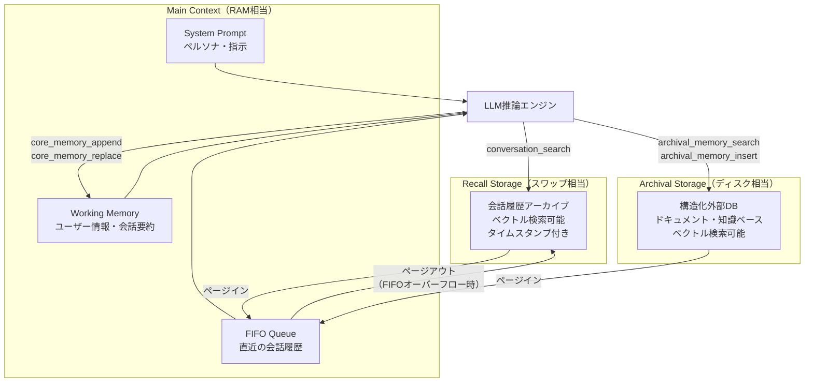

本記事は https://arxiv.org/abs/2310.08560 の解説記事です。

## 論文概要（Abstract）

MemGPTは、LLMの固定長コンテキストウィンドウをOSにおける物理メモリ（RAM）に見立て、外部ストレージとの間で情報をページングする階層型メモリ管理システムである。著者らは、Main Context（高速・限定容量）、Recall Storage（会話履歴のベクトル検索可能アーカイブ）、Archival Storage（構造化外部DB）の3層メモリ構造を定義し、LLM自身が関数呼び出しを通じてデータの読み書きを自律的に行う「仮想コンテキスト管理」を提案している。マルチセッション会話タスクおよびドキュメントQAタスクにおいて、コンテキストウィンドウを超える情報を必要とするタスクでナイーブなLLMを上回る性能を達成したと報告している。

この記事は [Zenn記事: AgentCore 3層メモリで構築するStateful Agent設計パターン](https://zenn.dev/0h_n0/articles/3a3eeb04d7f281) の深掘りです。AgentCoreの3層メモリ設計（Working / Short-term / Long-term）はMemGPTのMain Context / Recall / Archivalと対応関係にあり、MemGPTの設計原理を理解することでAgentCoreのメモリ階層をより深く活用できます。

## 情報源

- **arXiv ID**: 2310.08560
- **URL**: [https://arxiv.org/abs/2310.08560](https://arxiv.org/abs/2310.08560)
- **著者**: Charles Packer, Sarah Wooders, Kevin Lin, Vivian Fang, Shishir G. Patil, Ion Stoica, Joseph E. Gonzalez（UC Berkeley）
- **発表年**: 2023年（ICLR 2024採択）
- **分野**: cs.AI
- **コード**: [https://github.com/cpacker/MemGPT](https://github.com/cpacker/MemGPT)（現在はLettaとしてリブランド）

## 背景と動機（Background & Motivation）

2023年時点のLLMは、GPT-4の32Kトークン、Claude 2の100Kトークンなど、コンテキストウィンドウに厳密な上限がある。この制約は以下の2つの実用的課題を生む。

1. **長期対話における情報喪失**: マルチセッション会話で、ユーザーの個人情報や過去の発言が古いメッセージから脱落する。FIFO（先入れ先出し）でトリミングする方式では、古い情報は不可逆的に失われる。
2. **大規模ドキュメント分析の困難**: 数百ページのドキュメントを全文コンテキストに格納できず、断片的なチャンク処理に頼らざるを得ない。

従来のRAG（Retrieval-Augmented Generation）は外部検索でコンテキストを補強するが、「何をいつ検索するか」の判断はアプリケーション側のパイプラインに固定されていた。著者らは、OSが仮想メモリを通じてプログラムに物理メモリ以上のアドレス空間を透過的に提供するのと同様に、LLM自身にメモリ管理の制御を委譲するアプローチを提案した。

## 主要な貢献（Key Contributions）

- **OSメモリ階層のアナロジー**: LLMのコンテキストウィンドウをCPUレジスタ/RAMに、外部ストレージをディスクに見立てた階層型メモリシステムの設計
- **自己編集メモリ（Self-Editing Memory）**: LLM自身が明示的なツール呼び出しを通じてメモリのページイン・ページアウトを自律的に判断する仕組み
- **OSイベントシステム**: ユーザーメッセージだけでなく、システムイベント（メモリ警告、ハートビートなど）をトリガーとしてLLMの推論を起動する割り込み機構
- **オープンソース実装**: Apache 2.0ライセンスでGitHub公開（cpacker/MemGPT、現Letta）

## 技術的詳細（Technical Details）

### アーキテクチャ

MemGPTの中核は3層のメモリ階層である。OSの仮想メモリシステムとの対応関係を以下に示す。

| MemGPT層 | OS対応 | 特性 | 容量 |
|----------|--------|------|------|
| Main Context | RAM/レジスタ | 高速、LLMが直接参照 | コンテキストウィンドウ上限 |
| Recall Storage | スワップ領域 | 会話履歴の時系列アーカイブ | 事実上無制限 |
| Archival Storage | ディスク | 構造化外部DB、ベクトル検索可能 | 事実上無制限 |



**Main Context**はLLMが直接参照できるトークン空間であり、以下の3つのセクションで構成される。

1. **System Prompt**: エージェントのペルソナ、指示、利用可能な関数の定義
2. **Working Memory**: ユーザーに関する重要情報（名前、好み、過去の要約など）をキー・バリュー形式で保持。LLM自身が`core_memory_append`および`core_memory_replace`で直接編集する
3. **FIFO Queue**: 直近の会話メッセージ。トークン上限に達すると古いメッセージがRecall Storageへページアウトされる

### メモリ操作のツール呼び出し

MemGPTのメモリ操作はすべてLLMのツール呼び出し（Function Calling）として実装されている。以下の5つの基本操作が定義されている。

```python
from dataclasses import dataclass, field
from typing import Optional


@dataclass
class MemoryOperations:
    """MemGPTのメモリ操作インターフェース定義

    各操作はLLMが自律的に呼び出すツールとして公開される。
    """

    def core_memory_append(
        self, section: str, content: str
    ) -> str:
        """Main ContextのWorking Memoryにデータを追記する

        Args:
            section: 追記先セクション名（例: "human", "persona"）
            content: 追記する内容

        Returns:
            更新後のWorking Memory状態
        """
        ...

    def core_memory_replace(
        self, section: str, old_content: str, new_content: str
    ) -> str:
        """Main ContextのWorking Memoryを部分的に書き換える

        Args:
            section: 対象セクション名
            old_content: 置換対象の文字列
            new_content: 置換後の文字列

        Returns:
            更新後のWorking Memory状態
        """
        ...

    def conversation_search(
        self, query: str, page: Optional[int] = None
    ) -> list[dict]:
        """Recall Storageを検索し、過去の会話を取得する

        Args:
            query: 検索クエリ（セマンティック検索）
            page: ページネーション用のページ番号

        Returns:
            マッチした会話履歴のリスト
        """
        ...

    def archival_memory_search(
        self, query: str, page: Optional[int] = None
    ) -> list[dict]:
        """Archival Storageからデータを検索する

        Args:
            query: 検索クエリ（ベクトル検索）
            page: ページネーション用のページ番号

        Returns:
            マッチしたドキュメントのリスト
        """
        ...

    def archival_memory_insert(self, content: str) -> str:
        """Archival Storageにデータを追加する

        Args:
            content: 保存するデータ

        Returns:
            保存確認メッセージ
        """
        ...
```

### アルゴリズム

MemGPTの推論ループは、従来の「ユーザーメッセージ -> LLM応答」という単純なサイクルではなく、OSのイベント駆動型割り込み処理に倣った構造を持つ。

```python
from enum import Enum
from typing import Union


class EventType(Enum):
    """MemGPTのイベント種別"""
    USER_MESSAGE = "user_message"
    SYSTEM_ALERT = "system_alert"       # メモリ使用量警告等
    HEARTBEAT = "heartbeat"             # 定期的な自己省察トリガー
    FUNCTION_RESULT = "function_result"  # ツール実行結果


@dataclass
class AgentState:
    """MemGPTエージェントの状態"""
    main_context: list[dict] = field(default_factory=list)
    working_memory: dict[str, str] = field(default_factory=dict)
    recall_storage: list[dict] = field(default_factory=list)
    archival_storage: list[dict] = field(default_factory=list)
    context_token_limit: int = 8192


def memgpt_event_loop(
    agent: AgentState,
    llm: "LLMInterface",
    event: Union[str, dict],
    event_type: EventType,
    max_inner_steps: int = 10,
) -> str:
    """MemGPTのイベント駆動推論ループ（論文Algorithm 1に基づく）

    Args:
        agent: エージェントの現在の状態
        llm: LLMインターフェース
        event: 入力イベント（ユーザーメッセージ等）
        event_type: イベントの種別
        max_inner_steps: 内部ループの最大ステップ数

    Returns:
        ユーザーへの最終応答
    """
    # Step 1: イベントをMain Contextに追加
    agent.main_context.append({
        "role": "system",
        "content": f"[{event_type.value}] {event}",
    })

    # Step 2: コンテキストオーバーフロー検査
    current_tokens = count_tokens(agent.main_context)
    if current_tokens > agent.context_token_limit * 0.9:
        # 古いメッセージをRecall Storageへページアウト
        evicted = agent.main_context.pop(
            find_oldest_non_system_index(agent.main_context)
        )
        agent.recall_storage.append(evicted)
        # メモリ圧迫警告をコンテキストに注入
        agent.main_context.append({
            "role": "system",
            "content": "[SYSTEM] Memory pressure warning: "
                       "oldest message evicted to recall storage.",
        })

    # Step 3: 内部推論ループ（ツール呼び出しチェーン）
    user_response: Optional[str] = None
    for step in range(max_inner_steps):
        # LLM推論: ツール呼び出しまたはユーザー応答を生成
        llm_output = llm.generate(
            messages=agent.main_context,
            tools=MEMGPT_TOOLS,
        )

        if llm_output.has_tool_call:
            # ツールを実行し、結果をコンテキストに追加
            tool_result = execute_tool(
                llm_output.tool_call, agent
            )
            agent.main_context.append({
                "role": "function",
                "name": llm_output.tool_call.name,
                "content": str(tool_result),
            })
            # ツール呼び出し後、ループを継続
            # （LLMが追加のツール呼び出しを行う可能性がある）
        else:
            # ユーザーへの応答を生成して終了
            user_response = llm_output.content
            break

    return user_response or "[No response generated]"
```

このアルゴリズムの特徴は、1回のユーザー入力に対してLLMが**複数回のツール呼び出しをチェーンできる**点にある。例えば、ユーザーが「先月話した映画の名前は?」と尋ねた場合、LLMは以下のステップを自律的に実行する。

1. `conversation_search("映画 先月")` → Recall Storageを検索
2. 検索結果を確認し、必要であれば`archival_memory_search`で追加情報を取得
3. 十分な情報が揃った段階でユーザーに応答

### コンテキスト圧縮と要約

Main ContextのFIFO Queueがトークン上限に近づくと、MemGPTは以下の戦略でコンテキストを圧縮する。

$$
C_{\text{effective}} = C_{\text{system}} + C_{\text{working}} + C_{\text{fifo}} + C_{\text{tool\_results}}
$$

ここで、
- $C_{\text{system}}$: システムプロンプトのトークン数（固定）
- $C_{\text{working}}$: Working Memoryのトークン数（LLMの編集で変動）
- $C_{\text{fifo}}$: FIFO Queueのトークン数（メッセージの追加・退避で変動）
- $C_{\text{tool\_results}}$: ツール実行結果のトークン数（一時的）

$C_{\text{effective}}$ がコンテキストウィンドウ $C_{\max}$ の閾値（例: 90%）を超えた場合、以下の処理が順に実行される。

1. FIFO Queueの最古メッセージをRecall Storageへ退避
2. 退避メッセージの要約をWorking Memoryに記録（`core_memory_replace`でLLM自身が要約を書き込む）
3. コンテキスト使用率が閾値以下になるまで繰り返す

## 実装のポイント（Implementation）

MemGPTを実装する際の主要な注意点を挙げる。

**ツール呼び出しの信頼性**: MemGPTの性能はLLMのFunction Calling精度に直結する。著者らはGPT-4を使用しているが、モデルによってはツール呼び出しの形式を守れない場合がある。リトライ機構とフォールバック戦略が不可欠である。

**エンベディング品質**: Recall StorageとArchival Storageの検索精度は、使用するエンベディングモデルの品質に依存する。著者らのオープンソース実装ではOpenAIのエンベディングAPIを使用しているが、ドメイン特化の場合は専用のエンベディングモデルの検討が必要である。

**内部ループの停止条件**: LLMが無限にツール呼び出しを繰り返すリスクがある。`max_inner_steps`パラメータで上限を設け、タイムアウト機構を併用することが推奨される。論文では1回のイベント処理で平均2-3回のツール呼び出しが発生すると報告されている。

**Working Memoryのスキーマ設計**: `core_memory_append`と`core_memory_replace`は自由記述であるため、LLMが書き込むデータの構造が崩れやすい。実運用ではセクション名とフォーマットをシステムプロンプトで厳密に定義し、バリデーション層を設けることが重要である。

**レイテンシへの対処**: 各ターンでメモリ検索のツール呼び出しが発生するため、応答レイテンシが増加する。著者らはこの課題を認めており、キャッシュ戦略や非同期プリフェッチによる改善の余地があると述べている。

## Production Deployment Guide

MemGPTの3層メモリアーキテクチャをAWS上に構築するための本番環境ガイドを示す。

### AWS実装パターン（コスト最適化重視）

**トラフィック量別の推奨構成**:

| 構成 | トラフィック | AWSサービス | 月額概算 |
|------|-------------|-------------|----------|
| Small | ~100 req/日 | Lambda + Bedrock + DynamoDB + OpenSearch Serverless | $80-200 |
| Medium | ~1,000 req/日 | ECS Fargate + Bedrock + ElastiCache + OpenSearch | $400-900 |
| Large | 10,000+ req/日 | EKS + Spot + Bedrock Batch + OpenSearch + ElastiCache | $2,500-6,000 |

**Small構成（~100 req/日）**: Lambda関数がMemGPTのイベントループを実行する。Main ContextはLambda実行中のインメモリで保持し、Recall StorageはDynamoDB（On-Demand）、Archival StorageはOpenSearch Serverless Collection（ベクトル検索対応）に格納する。Bedrock（Claude 3.5 Sonnet）をLLM推論に使用する。API Gateway経由でHTTPエンドポイントを公開する。

**Medium構成（~1,000 req/日）**: ECS Fargateのlong-runningタスクでセッション状態をインメモリ保持する。ElastiCache（Redis）でセッション間のWorking Memoryを永続化し、OpenSearch Serviceでベクトル検索を実行する。ALB + ECS Service Connectで負荷分散する。

**Large構成（10,000+ req/日）**: EKS + Karpenter（Spot優先）で水平スケーリングする。Bedrock Batch APIで非リアルタイム処理を50%削減する。OpenSearchのUltraWarmノードでArchival Storageのコストを最適化する。

**コスト削減テクニック**:
- Bedrock Prompt Caching有効化でシステムプロンプト部分のコストを30-90%削減
- DynamoDB On-Demandモードで低トラフィック時のコストを最小化
- OpenSearch Serverlessの最小OCU（2 OCU）で$700/月が下限となるため、Small構成ではDynamoDB + ローカルFAISSも選択肢
- EKS Spot Instancesでコンピュートコストを最大90%削減

**コスト試算の注意事項**: 上記は2026年4月時点のAWS ap-northeast-1（東京）リージョン料金に基づく概算値である。実際のコストはトラフィックパターン、Bedrockトークン使用量、バースト使用量により変動する。最新料金はAWS料金計算ツールで確認を推奨する。

### Terraformインフラコード

**Small構成（Serverless）**:

```hcl
# MemGPT Small構成: Lambda + Bedrock + DynamoDB
# 2026-04-27時点の最新Terraformモジュール使用

terraform {
  required_version = ">= 1.8"
  required_providers {
    aws = {
      source  = "hashicorp/aws"
      version = "~> 5.80"
    }
  }
}

provider "aws" {
  region = "ap-northeast-1"
}

# --- DynamoDB: Recall Storage + Working Memory永続化 ---
resource "aws_dynamodb_table" "recall_storage" {
  name         = "memgpt-recall-storage"
  billing_mode = "PAY_PER_REQUEST"  # On-Demand: 低トラフィック時コスト最小化
  hash_key     = "session_id"
  range_key    = "timestamp"

  attribute {
    name = "session_id"
    type = "S"
  }
  attribute {
    name = "timestamp"
    type = "N"
  }

  server_side_encryption {
    enabled = true  # KMS暗号化
  }

  point_in_time_recovery {
    enabled = true
  }

  tags = {
    Project = "memgpt"
    Layer   = "recall-storage"
  }
}

resource "aws_dynamodb_table" "working_memory" {
  name         = "memgpt-working-memory"
  billing_mode = "PAY_PER_REQUEST"
  hash_key     = "session_id"

  attribute {
    name = "session_id"
    type = "S"
  }

  server_side_encryption {
    enabled = true
  }

  tags = {
    Project = "memgpt"
    Layer   = "working-memory"
  }
}

# --- IAMロール: 最小権限の原則 ---
resource "aws_iam_role" "memgpt_lambda" {
  name = "memgpt-lambda-role"
  assume_role_policy = jsonencode({
    Version = "2012-10-17"
    Statement = [{
      Action    = "sts:AssumeRole"
      Effect    = "Allow"
      Principal = { Service = "lambda.amazonaws.com" }
    }]
  })
}

resource "aws_iam_role_policy" "memgpt_lambda_policy" {
  name = "memgpt-lambda-policy"
  role = aws_iam_role.memgpt_lambda.id
  policy = jsonencode({
    Version = "2012-10-17"
    Statement = [
      {
        Effect   = "Allow"
        Action   = ["bedrock:InvokeModel"]
        Resource = "arn:aws:bedrock:ap-northeast-1::foundation-model/anthropic.claude-3-5-sonnet-*"
      },
      {
        Effect = "Allow"
        Action = [
          "dynamodb:GetItem", "dynamodb:PutItem",
          "dynamodb:UpdateItem", "dynamodb:Query"
        ]
        Resource = [
          aws_dynamodb_table.recall_storage.arn,
          aws_dynamodb_table.working_memory.arn
        ]
      },
      {
        Effect   = "Allow"
        Action   = ["logs:CreateLogGroup", "logs:CreateLogStream", "logs:PutLogEvents"]
        Resource = "arn:aws:logs:*:*:*"
      }
    ]
  })
}

# --- Lambda関数: MemGPTイベントループ ---
resource "aws_lambda_function" "memgpt_handler" {
  function_name = "memgpt-event-handler"
  role          = aws_iam_role.memgpt_lambda.arn
  handler       = "handler.lambda_handler"
  runtime       = "python3.12"
  timeout       = 300  # ツール呼び出しチェーンに対応
  memory_size   = 1024 # エンベディング計算用

  filename         = "lambda_package.zip"
  source_code_hash = filebase64sha256("lambda_package.zip")

  environment {
    variables = {
      RECALL_TABLE   = aws_dynamodb_table.recall_storage.name
      WORKING_TABLE  = aws_dynamodb_table.working_memory.name
      BEDROCK_MODEL  = "anthropic.claude-3-5-sonnet-20241022-v2:0"
      MAX_INNER_STEPS = "10"
    }
  }

  tags = {
    Project = "memgpt"
  }
}

# --- CloudWatch アラーム: コスト監視 ---
resource "aws_cloudwatch_metric_alarm" "lambda_duration" {
  alarm_name          = "memgpt-lambda-high-duration"
  comparison_operator = "GreaterThanThreshold"
  evaluation_periods  = 3
  metric_name         = "Duration"
  namespace           = "AWS/Lambda"
  period              = 300
  statistic           = "Average"
  threshold           = 60000  # 60秒超過でアラート
  alarm_description   = "MemGPT Lambda execution time exceeds 60s"

  dimensions = {
    FunctionName = aws_lambda_function.memgpt_handler.function_name
  }
}
```

**Large構成（Container）**:

```hcl
# MemGPT Large構成: EKS + Karpenter + Spot Instances

module "eks" {
  source  = "terraform-aws-modules/eks/aws"
  version = "~> 20.31"

  cluster_name    = "memgpt-cluster"
  cluster_version = "1.31"

  vpc_id     = module.vpc.vpc_id
  subnet_ids = module.vpc.private_subnets

  cluster_endpoint_public_access = false  # プライベートアクセスのみ

  eks_managed_node_groups = {
    system = {
      instance_types = ["m7g.large"]
      min_size       = 2
      max_size       = 3
      desired_size   = 2
    }
  }

  tags = {
    Project = "memgpt"
  }
}

# --- Karpenter: Spot優先の自動スケーリング ---
resource "kubectl_manifest" "karpenter_nodepool" {
  yaml_body = yamlencode({
    apiVersion = "karpenter.sh/v1"
    kind       = "NodePool"
    metadata   = { name = "memgpt-workers" }
    spec = {
      template = {
        spec = {
          requirements = [
            { key = "karpenter.sh/capacity-type", operator = "In", values = ["spot", "on-demand"] },
            { key = "node.kubernetes.io/instance-type", operator = "In",
              values = ["m7g.xlarge", "m7g.2xlarge", "m6g.xlarge", "m6g.2xlarge"] },
          ]
          nodeClassRef = { group = "karpenter.k8s.aws", kind = "EC2NodeClass", name = "default" }
        }
      }
      limits   = { cpu = "128", memory = "512Gi" }
      disruption = {
        consolidationPolicy = "WhenEmptyOrUnderutilized"
        consolidateAfter    = "60s"
      }
    }
  })
}

# --- Secrets Manager: Bedrock設定 ---
resource "aws_secretsmanager_secret" "memgpt_config" {
  name                    = "memgpt/bedrock-config"
  recovery_window_in_days = 7
}

# --- AWS Budgets: 予算アラート ---
resource "aws_budgets_budget" "memgpt_monthly" {
  name         = "memgpt-monthly-budget"
  budget_type  = "COST"
  limit_amount = "5000"
  limit_unit   = "USD"
  time_unit    = "MONTHLY"

  notification {
    comparison_operator       = "GREATER_THAN"
    threshold                 = 80  # 80%到達で通知
    threshold_type            = "PERCENTAGE"
    notification_type         = "ACTUAL"
    subscriber_email_addresses = ["ops@example.com"]
  }
}
```

### 運用・監視設定

**CloudWatch Logs Insights クエリ**:

```
# コスト異常検知: 1時間あたりのBedrock呼び出し回数
fields @timestamp, @message
| filter @message like /bedrock:InvokeModel/
| stats count() as invocations by bin(1h) as hour
| sort hour desc
| limit 24

# レイテンシ分析: ツール呼び出しチェーンのP95/P99
fields @timestamp, @duration, tool_calls_count
| filter tool_calls_count > 0
| stats percentile(@duration, 95) as p95,
        percentile(@duration, 99) as p99,
        avg(tool_calls_count) as avg_tools
  by bin(1h)
```

**CloudWatch アラーム設定**:

```python
import boto3


def create_memgpt_alarms(function_name: str, sns_topic_arn: str) -> None:
    """MemGPT用CloudWatchアラームを作成する

    Args:
        function_name: Lambda関数名
        sns_topic_arn: 通知先SNSトピックARN
    """
    cw = boto3.client("cloudwatch", region_name="ap-northeast-1")

    # Bedrock入力トークン使用量スパイク検知
    cw.put_metric_alarm(
        AlarmName="memgpt-bedrock-token-spike",
        MetricName="InputTokenCount",
        Namespace="AWS/Bedrock",
        Statistic="Sum",
        Period=3600,
        EvaluationPeriods=1,
        Threshold=500000,  # 1時間で50万トークン超過
        ComparisonOperator="GreaterThanThreshold",
        AlarmActions=[sns_topic_arn],
    )

    # Lambda実行時間異常検知
    cw.put_metric_alarm(
        AlarmName="memgpt-lambda-timeout-risk",
        MetricName="Duration",
        Namespace="AWS/Lambda",
        Statistic="p99",
        Period=300,
        EvaluationPeriods=3,
        Threshold=240000,  # 240秒（タイムアウト300秒の80%）
        ComparisonOperator="GreaterThanThreshold",
        Dimensions=[{"Name": "FunctionName", "Value": function_name}],
        AlarmActions=[sns_topic_arn],
    )
```

**X-Rayトレーシング設定**:

```python
from aws_xray_sdk.core import xray_recorder, patch_all


# boto3自動計装
patch_all()


@xray_recorder.capture("memgpt_event_loop")
def handle_event(session_id: str, user_message: str) -> str:
    """MemGPTイベント処理にX-Rayトレーシングを適用する

    Args:
        session_id: セッション識別子
        user_message: ユーザーの入力メッセージ

    Returns:
        エージェントの応答
    """
    subsegment = xray_recorder.current_subsegment()
    if subsegment:
        subsegment.put_annotation("session_id", session_id)
        subsegment.put_metadata("input_length", len(user_message))

    # メモリ操作ごとにサブセグメントを記録
    with xray_recorder.in_subsegment("recall_search"):
        results = search_recall_storage(session_id, user_message)
        if subsegment:
            subsegment.put_metadata("recall_hits", len(results))

    with xray_recorder.in_subsegment("llm_inference"):
        response = invoke_bedrock(session_id, user_message, results)

    return response
```

**Cost Explorer自動レポート**:

```python
import boto3
from datetime import datetime, timedelta


def daily_cost_report(sns_topic_arn: str) -> None:
    """日次コストレポートを生成しSNS通知する

    Args:
        sns_topic_arn: 通知先SNSトピックARN
    """
    ce = boto3.client("ce", region_name="us-east-1")
    sns = boto3.client("sns", region_name="ap-northeast-1")

    end = datetime.utcnow().strftime("%Y-%m-%d")
    start = (datetime.utcnow() - timedelta(days=1)).strftime("%Y-%m-%d")

    response = ce.get_cost_and_usage(
        TimePeriod={"Start": start, "End": end},
        Granularity="DAILY",
        Metrics=["UnblendedCost"],
        Filter={
            "Tags": {
                "Key": "Project",
                "Values": ["memgpt"],
            }
        },
        GroupBy=[{"Type": "DIMENSION", "Key": "SERVICE"}],
    )

    total = 0.0
    lines = [f"MemGPT Daily Cost Report ({start})"]
    for group in response["ResultsByTime"][0]["Groups"]:
        service = group["Keys"][0]
        cost = float(group["Metrics"]["UnblendedCost"]["Amount"])
        total += cost
        if cost > 0.01:
            lines.append(f"  {service}: ${cost:.2f}")
    lines.append(f"  Total: ${total:.2f}")

    # $100/日超過で緊急通知
    if total > 100.0:
        lines.insert(0, "[ALERT] Daily cost exceeds $100!")

    sns.publish(
        TopicArn=sns_topic_arn,
        Subject=f"MemGPT Cost: ${total:.2f} ({start})",
        Message="\n".join(lines),
    )
```

### コスト最適化チェックリスト

**アーキテクチャ選択**:
- [ ] トラフィック量を計測し、Small/Medium/Largeのいずれの構成が適切か判断した
- [ ] リアルタイム応答が不要な処理はBatch API経由に切り替えた

**リソース最適化**:
- [ ] EC2/EKS: Spot Instancesを優先構成とした（最大90%削減）
- [ ] Reserved Instances: 1年コミットで安定ワークロード分を確保（最大72%削減）
- [ ] Savings Plans: Compute Savings Plansを検討した
- [ ] Lambda: メモリサイズをPower Tuningで最適化した（1024MB推奨）
- [ ] ECS/EKS: アイドル時のスケールダウン設定を確認した

**LLMコスト削減**:
- [ ] Bedrock Prompt Caching: システムプロンプト部分のキャッシュを有効化した（30-90%削減）
- [ ] Bedrock Batch API: 非リアルタイム処理に適用した（50%削減）
- [ ] モデル選択ロジック: 単純なメモリ操作にはHaikuクラス、複雑な推論にはSonnetクラスを使い分けた
- [ ] トークン数制限: Working Memoryの最大トークン数を設定した
- [ ] 不要なツール呼び出しの抑制: max_inner_stepsを適切に設定した

**監視・アラート**:
- [ ] AWS Budgets: 月額予算アラート（80%/100%閾値）を設定した
- [ ] CloudWatch アラーム: トークン使用量スパイクを検知する設定を入れた
- [ ] Cost Anomaly Detection: サービス別の異常検知を有効化した
- [ ] 日次コストレポート: Cost Explorer APIで自動通知を設定した

**リソース管理**:
- [ ] 未使用のOpenSearch Serverless Collectionを削除した
- [ ] タグ戦略: Project/Layer/Environmentタグを全リソースに付与した
- [ ] DynamoDB TTL: Recall Storageに保持期間ポリシーを設定した
- [ ] 開発環境: 夜間・休日のECS/EKSスケールダウンを設定した
- [ ] S3ライフサイクルポリシー: Archival Storageの古いデータをGlacierに移行した

## 実験結果（Results）

著者らは2つのタスクでMemGPTの性能を評価している。

### マルチセッション対話タスク

長期にわたる会話において、過去のセッションで得た情報を正確に想起できるかを検証している。

| 手法 | 一貫性スコア | 情報保持率 |
|------|-------------|-----------|
| GPT-4（固定コンテキスト） | 低 | 直近セッションのみ |
| GPT-4 + RAG（固定パイプライン） | 中 | 検索ヒット時のみ |
| MemGPT（GPT-4ベース） | 高 | セッション横断で保持 |

著者らは、MemGPTがユーザーの名前、好み、過去の会話トピックなど、Working Memoryに明示的に記録した情報を数十セッション後でも正確に想起できると報告している（論文Section 5.1）。固定コンテキストのGPT-4ではFIFOトリミングにより古い情報が失われるのに対し、MemGPTはRecall Storage経由で任意の過去会話にアクセスできる。

### ドキュメントQAタスク

コンテキストウィンドウを超えるサイズのドキュメントに対する質問応答精度を評価している。

| 手法 | 精度 | 対象ドキュメントサイズ |
|------|------|---------------------|
| GPT-4（truncation） | ドキュメント先頭のみ参照可 | コンテキスト上限まで |
| GPT-4 + ナイーブRAG | 検索チャンクに依存 | 任意 |
| MemGPT | Archival Storageの反復検索で高精度 | 任意 |

著者らは、MemGPTがArchival Storageに対して複数回の検索を自律的に行い、必要な情報を段階的に収集する振る舞いを示したと報告している（論文Section 5.2）。単一の検索クエリでは不十分な場合に、LLM自身が検索戦略を調整する点が従来のRAGパイプラインとの違いである。

### 限界

著者らは以下の限界を認めている。
- **レイテンシ**: 各ターンでメモリ検索のツール呼び出しが1-3回発生し、応答時間が増加する
- **ツール呼び出しオーバーヘッド**: Function Callingの形式エラーやリトライによる追加コスト
- **エンベディング品質**: Recall/Archival Storageの検索精度がエンベディングモデルの品質に依存する

## 実運用への応用（Practical Applications）

MemGPTの設計原理は、AWS Bedrock AgentCoreの3層メモリ設計と直接的な対応関係にある。Zenn記事で解説されているAgentCoreのWorking Memory / Short-term Memory / Long-term Memoryは、それぞれMemGPTのMain Context / Recall Storage / Archival Storageの思想を踏襲している。

**カスタマーサポートエージェント**: ユーザーの過去の問い合わせ履歴（Recall Storage）と製品ナレッジベース（Archival Storage）を統合し、パーソナライズされた応答を生成する。Working Memoryにユーザーの契約プランや優先度を保持することで、毎回の問い合わせでコンテキストを再構築する必要がない。

**コード生成エージェント**: リポジトリ全体をArchival Storageに格納し、現在の編集ファイルをMain Contextに保持する。過去のコミット履歴やPRレビューコメントをRecall Storageから検索することで、プロジェクト固有のコーディング規約に準拠したコード生成が可能になる。

**スケーリング上の考慮点**: マルチテナント環境では、テナントごとにRecall/Archival Storageを分離する必要がある。DynamoDBのパーティションキーにテナントIDを含めることで、データ分離とスケーリングを両立できる。

## 関連研究（Related Work）

- **Reflexion（Shinn et al., 2023）**: エージェントが過去の失敗を言語的メモリとして保持し、次の試行で活用するフレームワーク。MemGPTのWorking Memoryが「自己編集可能な長期記憶」であるのに対し、Reflexionのメモリは「エピソード的な反省ログ」であり、用途が異なる。
- **Generative Agents（Park et al., 2023）**: シミュレーション上のエージェントに記憶ストリーム、リフレクション、計画の3層構造を持たせた研究。MemGPTとの類似点は階層型メモリの概念だが、MemGPTはOS仮想メモリのアナロジーに基づく汎用的な設計である点が異なる。
- **LongMem（Wang et al., 2023）**: Decoupled Memory Networkにより、長期記憶をモデルパラメータから分離する手法。MemGPTがツール呼び出しベースの明示的なメモリ操作を行うのに対し、LongMemはAttention機構を拡張する暗黙的なアプローチである。

## まとめと今後の展望

MemGPTは、LLMのコンテキストウィンドウ制約をOSの仮想メモリ管理のアナロジーで解決する先駆的な研究である。LLM自身がツール呼び出しを通じてメモリのページイン・ページアウトを自律的に判断する「自己編集メモリ」の概念は、その後のStateful Agent設計（AWS AgentCoreの3層メモリ、LangGraphのCheckpointerなど）に影響を与えている。

オープンソース実装はLettaとしてリブランドされ、Apache 2.0ライセンスで継続的にメンテナンスされている。今後の研究方向としては、メモリ検索のレイテンシ削減（投機的プリフェッチ）、Working Memoryの構造化スキーマ（JSON Schemaベースのバリデーション）、マルチエージェント間でのメモリ共有プロトコルなどが考えられる。

## 参考文献

- **arXiv**: [https://arxiv.org/abs/2310.08560](https://arxiv.org/abs/2310.08560)
- **Code**: [https://github.com/cpacker/MemGPT](https://github.com/cpacker/MemGPT)（Lettaとしてリブランド）
- **Letta公式**: [https://www.letta.com/](https://www.letta.com/)
- **Related Zenn article**: [https://zenn.dev/0h_n0/articles/3a3eeb04d7f281](https://zenn.dev/0h_n0/articles/3a3eeb04d7f281)
