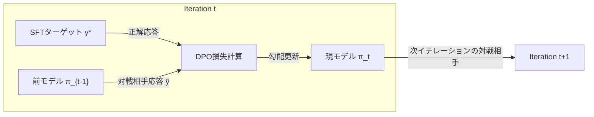

本記事は [arXiv:2401.01335 "SPIN: Self-Play Fine-Tuning Converts Weak Language Models to Strong Language Models"](https://arxiv.org/abs/2401.01335)（Chen, Deng, Yuan, Ji, Gu、ICML 2024）の解説記事です。

## 論文概要（Abstract）

SPIN（Self-Play Fine-Tuning）は、追加の人間アノテーションデータを用いずにLLMを強化するセルフプレイ手法である。各イテレーションで、現在のモデル $\pi_{\theta_t}$ が前イテレーションのモデル $\pi_{\theta_{t-1}}$ を「対戦相手」とし、SFTターゲットデータの分布に近づくようDPO（Direct Preference Optimization）ベースの損失関数で訓練される。著者らはZephyr-7B-SFTをベースモデルとして、MT-Benchスコアを5.94から6.78（Iteration 1）、さらに6.88（Iteration 2-3）まで改善したと報告している。また、SPINの各イテレーションにおける最適解の一意性と、SFTターゲット分布への収束を理論的に証明している。

この記事は [Zenn記事: Self-Guided Self-Play（SGS）で7Bモデルが671Bを超える仕組み](https://zenn.dev/0h_n0/articles/24599b7ac2e7a1) の深掘りです。SPINはLLMセルフプレイの基盤となった手法であり、SGSが改善する「分布ミスマッチ」問題を理解するにはSPINの設計を把握することが不可欠です。

## 情報源

- **arXiv ID**: 2401.01335
- **URL**: [https://arxiv.org/abs/2401.01335](https://arxiv.org/abs/2401.01335)
- **著者**: Zixiang Chen, Yihe Deng, Huizhuo Yuan, Kaixuan Ji, Quanquan Gu（UCLA）
- **発表**: ICML 2024
- **分野**: cs.LG

## 背景と動機（Background & Motivation）

LLMのファインチューニングにおいて、SFT（Supervised Fine-Tuning）は高品質な指示応答ペアを使ってモデルを調整する標準的手法である。しかし、SFTだけでは性能の上限が学習データの品質に制約される。RLHF（Reinforcement Learning from Human Feedback）はこの制約を緩和するが、新たな人間アノテーションが各イテレーションで必要となり、コストが高い。

著者らは、ゲーム理論のセルフプレイに着想を得て、追加の人間アノテーションなしでLLMを継続改善するSPINを提案した。核心的なアイデアは「現在のモデルが前バージョンの自分自身に勝つ」ことを学習目標とし、SFTターゲットデータを「正解」として使う点にある。

## 主要な貢献（Key Contributions）

- **追加アノテーション不要のセルフプレイ**: 既存のSFTデータのみで、反復的にLLMを強化するフレームワーク
- **理論的収束保証**: 各イテレーションの最適解が一意であり、SFTターゲット分布に収束することの数学的証明
- **実験的検証**: Zephyr-7B-SFTでMT-Benchスコアを大幅に改善し、追加の人間選好データを使うDPOと同等以上の性能を達成

## 技術的詳細（Technical Details）

### セルフプレイの構造

SPINは各イテレーション $t$ で以下のゲームを実行する。



- **Main Player（主プレイヤー）**: 現在のモデル $\pi_{\theta_t}$
- **Opponent（対戦相手）**: 前イテレーションのモデル $\pi_{\theta_{t-1}}$（凍結）
- **ターゲット**: SFTデータの正解応答 $y^*$

### DPOベースの損失関数

SPINの損失関数は以下の通りである。

$$\mathcal{L}_{\text{SPIN}}(\theta_t) = -\mathbb{E}_{(x, y^*) \sim \mathcal{D}} \left[ \log \sigma \left( \lambda \log \frac{\pi_{\theta_t}(y^* \mid x)}{\pi_{\theta_{t-1}}(y^* \mid x)} - \lambda \log \frac{\pi_{\theta_t}(\tilde{y} \mid x)}{\pi_{\theta_{t-1}}(\tilde{y} \mid x)} \right) \right]$$

ここで、

- $\mathcal{D}$: SFTデータセット（指示 $x$ と正解応答 $y^*$ のペア）
- $\tilde{y} \sim \pi_{\theta_{t-1}}(\cdot \mid x)$: 前モデルが生成した応答
- $\lambda > 0$: DPOの温度パラメータ
- $\sigma$: シグモイド関数

この損失関数は、現在のモデルに「SFTターゲットの応答 $y^*$ を前モデルの応答 $\tilde{y}$ より選好する」ことを学習させる。DPOの標準的な損失関数と同一の形式だが、選好ペアを人間アノテーションではなくセルフプレイで生成する点が新しい。

### 収束の理論的保証

著者らは以下の2つの理論的結果を証明している。

**定理1（最適解の一意性）**: 任意のイテレーション $t$ において、$\mathcal{L}_{\text{SPIN}}(\theta_t)$ の大域的最適解 $\theta_t^*$ は一意に存在する。

**定理2（収束）**: イテレーションを重ねるにつれて、$\pi_{\theta_t^*}$ はSFTデータの分布 $p_{\text{SFT}}$ に収束する。すなわち、

$$\lim_{t \to \infty} D_{\text{KL}}(\pi_{\theta_t^*} \| p_{\text{SFT}}) = 0$$

この収束結果は重要な示唆を含む。SPINは **SFTデータの分布に近づくことしかできない**。つまり、SFTデータの品質がSPINの性能上限を決定する。この制約はSGSやSTPなどの後続手法が解決しようとする課題の一つである。

### アルゴリズム

SPINの訓練ループは以下の通りである。

```python
def spin_training_loop(
    base_model: LLM,
    sft_dataset: list[tuple[str, str]],  # (instruction, target_response)
    num_iterations: int = 3,
    lambda_temp: float = 0.1,
):
    """SPINの訓練ループ（論文Algorithm 1に基づく）"""
    model_prev = base_model  # π_{t-1}

    for t in range(num_iterations):
        # Step 1: 前モデルで全データに対して応答を生成
        opponent_responses = {}
        for instruction, target in sft_dataset:
            y_tilde = model_prev.generate(instruction)
            opponent_responses[instruction] = y_tilde

        # Step 2: DPOペアを構成
        preference_pairs = []
        for instruction, target in sft_dataset:
            preference_pairs.append({
                "instruction": instruction,
                "chosen": target,          # y* (SFTターゲット)
                "rejected": opponent_responses[instruction],  # ỹ (前モデル生成)
            })

        # Step 3: DPO損失で訓練
        model_current = dpo_train(
            model=model_prev,
            pairs=preference_pairs,
            lambda_temp=lambda_temp,
            ref_model=model_prev,  # 前モデルが参照モデルを兼ねる
        )

        # Step 4: 前モデルを更新
        model_prev = model_current

    return model_current
```

## 実装のポイント（Implementation）

**DPO温度パラメータ $\lambda$**: 著者らは $\lambda = 0.1$ を推奨している。値が大きすぎるとSFTターゲットへの過適合が起き、小さすぎると学習が不安定になる。

**イテレーション数**: 実験では2〜3イテレーションで収束する傾向が報告されている。Iteration 1での改善が最も大きく（MT-Bench: 5.94→6.78）、Iteration 2以降の改善は漸減する（6.78→6.88）。

**参照モデルの選択**: SPINでは前イテレーションのモデル $\pi_{\theta_{t-1}}$ がDPOの参照モデルを兼ねる。このため、イテレーションが進むにつれて参照モデルと現モデルの乖離が大きくなり、勾配の品質が低下する可能性がある。

**応答生成のバッチサイズ**: SFTデータセット全体に対して前モデルの応答を生成する必要があるため、データセットサイズに比例した推論コストが発生する。

## 実験結果（Results）

### MT-Bench

著者らが報告したMT-Benchでの結果を以下に示す。

| イテレーション | MT-Bench スコア | ベースラインとの差 |
|-------------|----------------|-----------------|
| ベース（Zephyr-7B-SFT） | 5.94 | — |
| SPIN Iteration 1 | 6.78 | +0.84 |
| SPIN Iteration 2 | 6.86 | +0.92 |
| SPIN Iteration 3 | 6.88 | +0.94 |

（数値は論文Table 1より引用）

### Open LLM Leaderboard

| ベンチマーク | Zephyr-SFT | SPIN Iter 3 | 改善 |
|------------|-----------|------------|------|
| ARC | 55.1% | 58.3% | +3.2% |
| HellaSwag | 72.6% | 74.1% | +1.5% |
| TruthfulQA | 39.8% | 43.5% | +3.7% |
| Winogrande | 66.7% | 68.2% | +1.5% |

（数値は論文Table 2より引用）

### SPINの限界（SGSとの接続点）

SGSの著者らは、SPINを含む実験でLIVECODE（コード生成）とZEBRALOGIC（論理推論）のベンチマークにおいてSPINが**ベースモデルより性能が低下する**ことを報告している（論文arXiv:2604.20209のTable 1より）。

| ベンチマーク | Qwen2.5-7B（ベース） | SPIN | SGS |
|------------|---------------------|------|-----|
| LIVECODE | 24.5% | 22.4%（−2.1%） | 28.5% |
| ZEBRALOGIC | 43.1% | 40.2%（−2.9%） | 50.3% |

この劣化は、SPINの構造的な問題、すなわち前モデルの凍結スナップショットを対戦相手とすることによる**分布ミスマッチ**に起因すると考えられている。モデルが改善するにつれて凍結された対戦相手が時代遅れになり、生成される学習データが現在のモデルにとって有益でなくなる。

## 実運用への応用（Practical Applications）

SPINは実装が単純で追加データ不要という利点があり、以下のユースケースで有用と考えられる。

**SFTデータの効果最大化**: 高品質なSFTデータが限られている場合、SPINで数イテレーション回すだけでデータの利用効率を向上できる。

**コストの制約がある場合**: RLHFのような人間フィードバックループが予算的に困難な場合の代替手段。DPOのパイプラインがあれば、SPINの実装は最小限の変更で済む。

ただし、SFTデータの品質を超える改善は理論的に困難であり、推論タスク（数学、コード）でSFTデータの分布を大きく超えた性能が必要な場合はSGSやSTPなどの後続手法を検討すべきである。

## 関連研究（Related Work）

- **DPO（Direct Preference Optimization）**: SPINの損失関数の基盤。人間選好データではなくセルフプレイデータを使う点がSPINの新規性
- **SPPO（Self-Play Preference Optimization）**: SPINの後続手法。ナッシュ均衡定式化による改善を目指す
- **SGS（arXiv:2604.20209）**: SPINの分布ミスマッチ問題をSelf-Guidance機構で解決。Qwen2.5-7Bでの実験でSPINを大幅に上回る
- **STP（arXiv:2502.00212）**: 定理証明ドメインでのセルフプレイ。SPINとは異なりSFTではなく自己生成データで訓練

## まとめと今後の展望

SPINは「前バージョンの自分自身を対戦相手とする」という明快なアイデアで、追加の人間アノテーションなしにLLMを強化することに成功した。理論的な収束保証を持つ点も学術的価値が高い。

一方で、SPINの性能上限はSFTデータの品質に制約されること、凍結された対戦相手による分布ミスマッチが推論タスクで性能劣化を引き起こすことが後続研究で明らかになっている。SPINからSGSへの発展は「セルフプレイの対戦相手をどのように設計するか」という問いへの系譜であり、凍結スナップショット（SPIN）→外部教師モデル（GASP）→自己誘導（SGS）という設計選択の進化を理解する上でSPINの理解は不可欠である。

## 参考文献

- **arXiv**: [https://arxiv.org/abs/2401.01335](https://arxiv.org/abs/2401.01335)
- **Code**: [https://github.com/uclaml/SPIN](https://github.com/uclaml/SPIN)
- **Related Zenn article**: [https://zenn.dev/0h_n0/articles/24599b7ac2e7a1](https://zenn.dev/0h_n0/articles/24599b7ac2e7a1)

---

:::message
本記事は [arXiv:2401.01335](https://arxiv.org/abs/2401.01335) の解説記事です。記載内容は著者らの報告に基づいており、筆者自身が実験を行ったものではありません。数値は論文中のTableから引用しています。
:::
