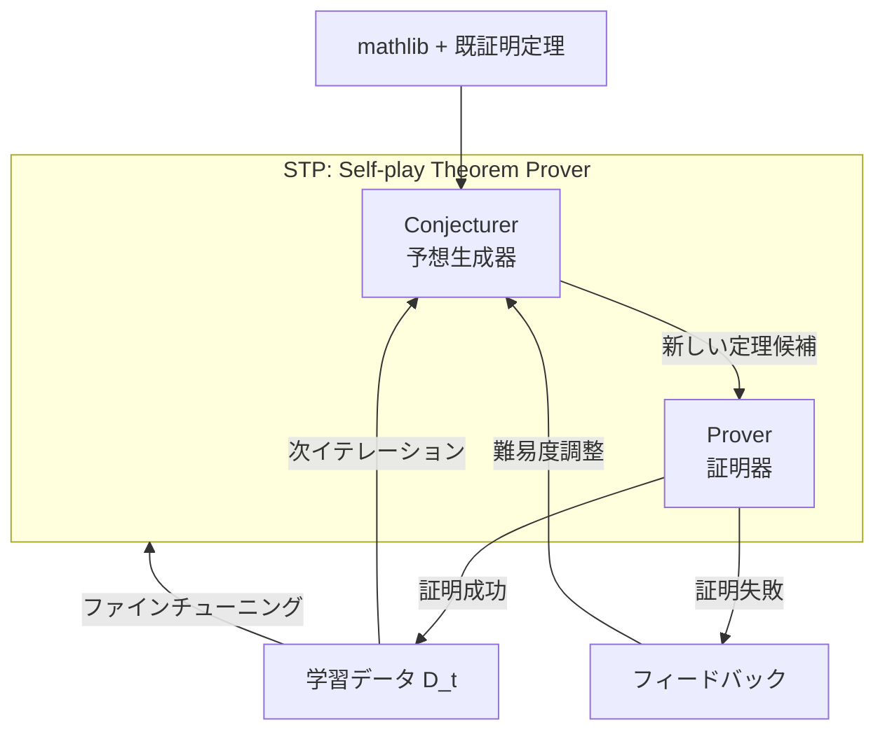

本記事は [arXiv:2502.00212 "STP: Self-play LLM Theorem Provers with Iterative Conjecturing and Proving"](https://arxiv.org/abs/2502.00212)（Dong, Liu, He, Poesia, Zelikman, Zhang, Han, Finn, Liang, Selsam、ICML 2025）の解説記事です。

## 論文概要（Abstract）

STP（Self-play Theorem Prover）は、LLMを用いた形式定理証明において「予想生成（Conjecturing）」と「証明（Proving）」の2つの役割を反復的に組み合わせるセルフプレイフレームワークである。既存手法が人手データや固定データセットに依存するのに対し、STPはモデル自身が証明可能な新しい定理を生成し、それを証明することで学習データを自己生成する。著者らは、DeepSeek-Prover-V1.5をベースモデルとしてminiF2F-testベンチマークにおいてPass@1で57.4%、木探索使用時に65.9%を達成したと報告している。

この記事は [Zenn記事: Self-Guided Self-Play（SGS）で7Bモデルが671Bを超える仕組み](https://zenn.dev/0h_n0/articles/24599b7ac2e7a1) の深掘りです。SGSが改善対象として直接比較しているSTPの内部構造を理解することで、セルフプレイ手法の設計選択がどのように性能に影響するかを把握できます。

## 情報源

- **arXiv ID**: 2502.00212
- **URL**: [https://arxiv.org/abs/2502.00212](https://arxiv.org/abs/2502.00212)
- **著者**: Kefan Dong, Zichen Liu, Jingxuan He, Gabriel Poesia, Eric Zelikman, Qiuyi Zhang, Jesse Michael Han, Chelsea Finn, Percy Liang, Daniel Selsam（Stanford HAI / Microsoft Research）
- **発表**: ICML 2025（Poster）
- **分野**: cs.AI, cs.LG

## 背景と動機（Background & Motivation）

LLMによる形式定理証明（Lean 4）では、学習データの不足が根本的な課題となっている。mathlibなどの既存ライブラリから得られる証明データは有限であり、強化学習（RL）やExpert Iterationで新しい証明を発見しても、正解証明が得られるケースが疎（sparse rewards）であるため性能が早期にプラトーに達する。

著者らはこの問題に対し、ゲーム理論におけるセルフプレイの発想を導入した。AlphaGoが対局を自己生成して棋力を向上させたように、定理証明でも「問題を自分で作り、自分で解く」ことで学習データの制約を突破できるという着想である。ただし、定理証明には「生成した問題が数学的に意味のある、かつ証明可能なものか」という品質制御の課題が加わる。

## 主要な貢献（Key Contributions）

- **コンジェクチャラー・プルーバーの二役セルフプレイ**: 単一のLLMが予想生成と証明の両方を担い、相互に強化しながら反復学習するフレームワーク
- **自動カリキュラム学習**: プルーバーの現在の能力に応じてコンジェクチャラーが難易度を自動調整する仕組み
- **外部データ非依存の証明データ生成**: mathlibの初期コンテキストのみで、数万件規模の新規定理・証明ペアを自己生成
- **miniF2F-testで当時のSOTA**: DeepSeek-Prover-V1.5-RLのPass@1 50.0%からSTPで57.4%（木探索時65.9%）へ向上

## 技術的詳細（Technical Details）

### アーキテクチャ

STPは単一のLLMを2つのモードで動作させる。



**Conjecturer（コンジェクチャラー）**: 既存の証明済み定理を文脈として受け取り、関連する新しいLean 4定理文（statement）を生成する。良い予想の条件は以下の3つである。

1. **Provable（証明可能）**: プルーバーが実際に証明できること
2. **Non-trivial（非自明）**: `trivial` / `rfl` / `simp` 等で即座に閉じないこと
3. **Relevant（関連性）**: 入力文脈の定理と数学的に関連していること

**Prover（プルーバー）**: コンジェクチャラーが生成した定理候補に対してLean 4の証明（tactic proof）を生成する。whole-proof generation（一括証明生成）とtree-search（MCTS）の両方をサポートする。

### アルゴリズム

STPの訓練ループは以下の擬似コードで表現される。

```python
def stp_training_loop(
    base_model: LLM,
    mathlib_theorems: list[Theorem],
    num_iterations: int = 5,
    conjecture_budget: int = 50000,
):
    """STPの訓練ループ（論文Algorithm 1に基づく）"""
    D_t = mathlib_theorems  # 初期データ: mathlibの既知定理

    for t in range(num_iterations):
        # Step 1: Conjecturing
        context_theorems = sample(D_t, k=16)
        candidates = []
        for _ in range(conjecture_budget):
            new_theorem = base_model.generate_conjecture(context_theorems)
            if is_well_formed(new_theorem):  # Lean 4の構文チェック
                candidates.append(new_theorem)

        # Step 2: Proving
        new_pairs = []
        for theorem in candidates:
            proof = base_model.generate_proof(theorem, max_attempts=8)
            if lean4_verify(theorem, proof):  # 形式検証
                new_pairs.append((theorem, proof))

        # Step 3: Filtering (非自明性チェック)
        filtered = [
            (t, p) for t, p in new_pairs
            if not is_trivial(p)  # simp/rfl/trivialで閉じない
        ]

        D_t = D_t + filtered  # データプールに追加

        # Step 4: Training (SFTでモデル更新)
        base_model = finetune(base_model, D_t)

    return base_model
```

### 報酬関数と難易度制御

STPでは明示的な報酬関数を使わず、**証明成功の二値シグナル**（Lean 4コンパイラによる検証結果）のみを用いる。

カリキュラム難易度の制御は、各イテレーションの証明成功率 $\rho_t$ を監視することで実現される。

$$\rho_t = \frac{|\{(\tilde{T}, P) \mid \text{lean4\_verify}(\tilde{T}, P) = \text{True}\}|}{|\text{candidates}_t|}$$

ここで $\tilde{T}$ は生成された定理候補、$P$ はその証明である。

- $\rho_t$ が高すぎる場合（定理が易しすぎる）: コンジェクチャラーへの文脈に難易度の高い定理を多く含める
- $\rho_t$ が低すぎる場合（定理が難しすぎる）: より基礎的な定理を文脈として提示する

この難易度調整は著者らによれば経験的なヒューリスティックであり、最適性の理論的保証はない。

### SGSとの設計上の違い

STPとSGSはどちらもコンジェクチャラー・プルーバー（ソルバー）構造を持つが、SGSが追加する**Guide（品質評価器）** がSTPには存在しない。この違いが意味するのは以下の通りである。

| 設計要素 | STP | SGS |
|---------|-----|-----|
| 品質制御 | 証明成功率 $\rho_t$ の監視のみ | Guide による3軸評価（関連性・複雑さ・冗長性） |
| 報酬ハッキング対策 | なし（暗黙的に非自明性フィルタ） | Guide スコアが報酬に乗算 |
| 訓練目的関数 | SFT（教師あり微調整） | REINFORCE$^{1/2}$（強化学習） |
| 役割数 | 2（Conjecturer + Prover） | 3（Solver + Conjecturer + Guide） |

SGSの著者らは、STPの設計では長時間訓練時にコンジェクチャラーが退化（不自然な論理和を含む命題の生成等）する問題が起きると指摘しており、Guideの導入はこの退化を防ぐことが主目的であると述べている。

## 実装のポイント（Implementation）

STPを再現する際の重要な注意点を整理する。

**Lean 4検証のボトルネック**: 各定理候補の証明検証にはLean 4コンパイラの起動が必要であり、著者らの実験環境では最大128 CPUワーカーを並列稼働させている。検証1件あたり数秒〜数十秒かかるため、候補数が50,000件の場合、検証だけで数時間を要する。

**コンジェクチャラーの文脈設計**: 文脈として渡す定理は16件程度が適切と報告されている。少なすぎると生成される定理の多様性が低下し、多すぎるとコンテキスト長の上限に達する。

**非自明性フィルタの実装**: 証明が `by simp` / `by rfl` / `by trivial` のみで構成される場合は除外する。このフィルタがないと、学習データの大半が自明な定理で占められ、モデルの改善が停滞する。

**イテレーション数**: 著者らの実験では3〜5イテレーションで収束する傾向が報告されている。各イテレーションでコンジェクチャラーが約10,000〜50,000の定理候補を生成し、そのうち30〜40%が証明に成功する。

## 実験結果（Results）

### メインベンチマーク

著者らが報告したminiF2F-test（244問の高校数学オリンピック問題をLean 4形式に変換したベンチマーク）での結果を以下に示す。

| 手法 | Pass@1 | Pass@K（木探索） | データソース |
|------|--------|-----------------|-------------|
| GPT-4（few-shot） | 23.5% | — | なし |
| Hypertree Proof Search | 41.0% | — | 人手データ |
| COPRA | 48.0% | — | 外部知識検索 |
| DeepSeek-Prover-V1.5-RL | 50.0% | 60.2%（Pass@3200） | mathlib + RL |
| **STP（1イテレーション）** | 53.3% | — | 自己生成 |
| **STP（最終）** | **57.4%** | **65.9%**（MCTS） | 自己生成 |

（数値は論文Table 1より引用）

### ProofNet（大学数学）

| 手法 | Pass@1 |
|------|--------|
| DeepSeek-Prover-V1.5-RL | 16.0% |
| **STP** | **21.7%** |

（数値は論文Table 2より引用）

### アブレーション実験

著者らが実施したアブレーション実験の結果：

- **コンジェクチャラーなし**（固定データのみでExpert Iteration）: miniF2Fで約5ポイント低下
- **フィードバックループなし**（難易度調整を無効化）: 約3ポイント低下
- **非自明性フィルタなし**: 約4ポイント低下（自明な定理がデータを汚染）

これらのアブレーション結果は、コンジェクチャラーとフィードバックループの両方がSTPの性能に不可欠であることを示している。

## 実運用への応用（Practical Applications）

STPの設計思想は、形式定理証明以外の「自動検証が可能なドメイン」にも応用可能と考えられる。

**コード生成**: テストスイートが自動検証器として機能する。コンジェクチャラーが「プログラミング問題＋テストケース」を生成し、プルーバーが解答コードを生成、テスト実行で検証するパイプラインが構成可能である。

**制約充足問題**: SAT/SMTソルバーが検証器として使える論理式の充足可能性判定において、STPのフレームワークを適用できる可能性がある。

ただし、自然言語生成やオープンエンドなタスクでは自動検証が困難であり、STPの直接適用は難しい。この制約はSGSでも共有されている。

## 関連研究（Related Work）

- **Expert Iteration（ExIt）**: 外部データから証明を見つけ、成功した証明で再訓練する手法。STPはコンジェクチャラーを追加することでデータ不足を克服
- **DSTEP**: ステップレベルDPOによる定理証明改善。STPとは訓練目的関数が異なる（DPO vs SFT）
- **DeepSeek-Prover-V1.5**: STPのベースモデル。サブゴール分解とMCTSによる証明探索を採用
- **SGS（arXiv:2604.20209）**: STPにGuide（品質評価器）を追加し、報酬ハッキングを防止。STPの直接的な後継手法

## まとめと今後の展望

STPは「予想者と証明者のセルフプレイ」という明快な設計で、外部データに依存せずLLMの定理証明能力を向上させることに成功した。miniF2F-testでの57.4%（木探索時65.9%）はDeepSeek-Prover-V1.5-RLの50.0%を上回る成果である。

一方で、STPにはGuideに相当する品質制御メカニズムがなく、長時間訓練でのコンジェクチャラー退化の問題が残されている。この課題を解決するのがSGSであり、STPからSGSへの発展は「セルフプレイの品質制御をいかに設計するか」という問いへの回答と位置づけられる。

## 参考文献

- **arXiv**: [https://arxiv.org/abs/2502.00212](https://arxiv.org/abs/2502.00212)
- **ICML 2025 Poster**: [https://icml.cc/virtual/2025/poster/43472](https://icml.cc/virtual/2025/poster/43472)
- **Related Zenn article**: [https://zenn.dev/0h_n0/articles/24599b7ac2e7a1](https://zenn.dev/0h_n0/articles/24599b7ac2e7a1)

---

:::message
本記事は [arXiv:2502.00212](https://arxiv.org/abs/2502.00212) の解説記事です。記載内容は著者らの報告に基づいており、筆者自身が実験を行ったものではありません。数値は論文中のTable 1, Table 2から引用しています。
:::
