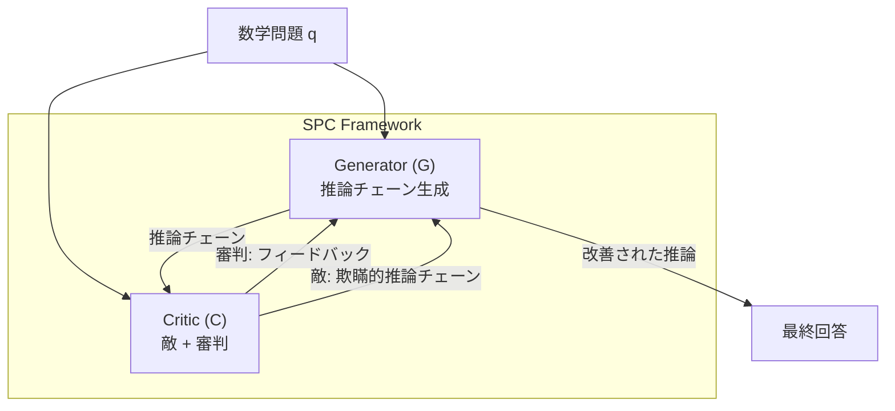

本記事は [arXiv:2504.19162 "SPC: Evolving Self-Play Critic via Adversarial Games for LLM Reasoning"](https://arxiv.org/abs/2504.19162)（Chen, Liu、2025年4月）の解説記事です。

## 論文概要（Abstract）

SPC（Self-Play Critic）は、LLMの推論能力を強化するために、批評者（Critic）と生成器（Generator）の間で敵対的セルフプレイを行うフレームワークである。SPCの核心は、批評者モデルが「敵（Adversary）」と「審判（Judge）」の2つの役割を統一的に担う点にある。敵としては生成器を欺く誤った推論チェーンを生成し、審判としては生成器の出力にフィードバックを提供する。著者らはこの共進化的な訓練によって、静的な批評者が抱える分布シフト問題を解消し、数学推論ベンチマークでGRPO相当以上の性能を達成したと報告している。

この記事は [Zenn記事: Self-Guided Self-Play（SGS）で7Bモデルが671Bを超える仕組み](https://zenn.dev/0h_n0/articles/24599b7ac2e7a1) の深掘りです。SGSが「Guide（品質評価器）を固定する」設計を選んだのに対し、SPCは「批評者も進化させる」アプローチを取っており、両者の設計思想の違いを理解することでセルフプレイにおける品質制御のトレードオフが見えてきます。

## 情報源

- **arXiv ID**: 2504.19162
- **URL**: [https://arxiv.org/abs/2504.19162](https://arxiv.org/abs/2504.19162)
- **著者**: Jiaqi Chen, Bang Liu
- **発表年**: 2025
- **分野**: cs.AI, cs.CL

## 背景と動機（Background & Motivation）

RLAIF（Reinforcement Learning from AI Feedback）において、批評者モデルは生成器の出力品質を評価するフィードバック源として機能する。しかし、既存の批評者には以下の課題がある。

1. **静的な批評者**: 一度訓練された批評者は固定されるため、生成器が改善するにつれて批評者の評価が不正確になる（分布シフト問題）
2. **批評者の訓練データ不足**: 高品質な批評データ（正しい推論チェーン vs 誤った推論チェーン）の作成コストが高い

SPCはこれらの課題に対し、GAN（Generative Adversarial Network）の発想を応用する。批評者が敵対的に「もっともらしい誤答」を生成し、生成器がそれを識別・克服することで、両モデルが共進化する。

## 主要な貢献（Key Contributions）

- **統一批評者モデル**: 1つのモデルが敵（誤答生成）と審判（品質評価）の両機能を担う
- **共進化訓練**: 批評者と生成器が交互に訓練され、互いの改善を促進する動的カリキュラム
- **敵対的推論チェーン生成**: 批評者が生成器の弱点を突く「もっともらしい誤答」を戦略的に生成

## 技術的詳細（Technical Details）

### アーキテクチャ

SPCは2つのモデルで構成される。



**Generator（G）**: 数学問題に対して推論チェーンを生成する。Qwen2.5-7Bをベースモデルとして使用。

**Critic（C）**: 以下の2つのモードで動作する。
- **Adversary（敵）モード**: Gの現在の能力を分析し、Gが誤りやすい形式の「もっともらしい誤答」を生成する。この誤答は構文的には正しく見えるが、論理的に間違った推論ステップを含む。
- **Judge（審判）モード**: Gの推論チェーンを評価し、各ステップが正しいかどうかのフィードバックを返す。

### 訓練アルゴリズム

SPCの訓練は交互に行われる。

```python
def spc_training_loop(
    generator: LLM,
    critic: LLM,
    math_dataset: list[MathProblem],
    num_rounds: int = 10,
):
    """SPCの訓練ループ（論文Algorithm 1に基づく）"""

    for round_idx in range(num_rounds):
        # === Generator Step ===
        # 1. Gが推論チェーンを生成
        g_outputs = []
        for problem in math_dataset:
            chain = generator.generate_reasoning(problem)
            g_outputs.append((problem, chain))

        # 2. Cが審判として各推論チェーンを評価
        feedback = []
        for problem, chain in g_outputs:
            score = critic.judge(problem, chain)
            feedback.append((problem, chain, score))

        # 3. Gをフィードバックで更新（RL or DPO）
        generator = update_generator(generator, feedback)

        # === Critic Step ===
        # 4. Cが敵として欺瞞的推論チェーンを生成
        adversarial_chains = []
        for problem in math_dataset:
            deceptive = critic.generate_adversarial(problem, generator)
            adversarial_chains.append((problem, deceptive))

        # 5. Gが欺瞞的チェーンを識別（正答との区別）
        # 6. Cを審判精度で更新
        critic = update_critic(critic, adversarial_chains, g_outputs)

    return generator, critic
```

### 敵対的訓練目的関数

SPCのゲーム理論的定式化は以下の通りである。

$$\max_C \min_G \mathcal{L}(G, C) = \mathbb{E}_{q \sim \mathcal{D}} \left[ C(G(q)) - C(y^*) \right]$$

ここで、

- $q$: 数学問題
- $G(q)$: 生成器の推論チェーン
- $y^*$: 正解の推論チェーン
- $C(\cdot)$: 批評者の評価スコア

この目的関数はGANのミニマックス目的関数と類似している。批評者は $C(G(q))$（生成器の出力への評価）を最大化し、$C(y^*)$（正解への評価）を最小化しようとする。すなわち、生成器の誤りを見抜く能力を最大化する。生成器は逆に、批評者を欺ける高品質な推論チェーンを生成しようとする。

### 共進化のメカニズム

SPCの設計上の利点は以下の共進化ダイナミクスにある。

| ラウンド | 生成器の能力 | 批評者の能力 | 訓練信号の質 |
|---------|------------|------------|------------|
| 初期 | 低い | 低い（簡単な誤りを検出） | 粗いが十分 |
| 中期 | 中程度 | 中程度（微妙な誤りを検出） | 精度が向上 |
| 後期 | 高い | 高い（高度な欺瞞を生成） | 洗練された信号 |

この共進化により、訓練信号が生成器の現在のレベルに常に適応する。これは静的な報酬モデル（RLHFの標準的な設定）では実現できない。

### SGSのGuideとSPCのCriticの比較

SGSとSPCはどちらもセルフプレイに品質評価メカニズムを導入するが、設計哲学が異なる。

| 設計要素 | SGS (Guide) | SPC (Critic) |
|---------|------------|-------------|
| 訓練中の更新 | 固定（frozen） | 共進化（交互更新） |
| 役割 | 品質スコアリング（3軸） | 敵（誤答生成）+ 審判（評価） |
| 安定性 | 高い（固定のため予測可能） | 低い（敵対訓練の不安定性リスク） |
| 適応性 | 低い（モデル改善に追随しない） | 高い（生成器と共に進化） |
| 計算コスト | Guide評価のみ（1モデル） | 敵対生成 + 評価（2モデル交互訓練） |

SGSの著者らは、Guideを固定する選択について「長期的にはGuideも学習すべきだが、Guide自体の報酬ハッキング（何でも高スコアを出す退化）を防ぐ仕組みが追加で必要」と指摘している。SPCはまさにこの課題に取り組んでいるが、敵対訓練の不安定性という別のリスクを負っている。

## 実装のポイント（Implementation）

**敵対訓練の安定性**: GAN研究で知られる訓練不安定性（mode collapse, oscillation）がSPCにも適用される。著者らは学習率の慎重な調整、グラジエントクリッピング、訓練ラウンドの早期停止を推奨している。

**批評者の二役切り替え**: 敵モードと審判モードの切り替えはプロンプトテンプレートで制御される。同一のモデルウェイトが両モードで共有されるため、一方のモードの訓練が他方に干渉するリスクがある。

**計算コスト**: GとCの2モデルを交互に訓練するため、計算コストは単一モデルの訓練の約2倍になる。これはSGSの推論コスト2倍（y, y'の二段階生成）と同程度である。

## 実験結果（Results）

### 数学推論ベンチマーク

著者らが報告したQwen2.5-7Bベースでの結果を以下に示す。

| 手法 | MATH-500 | AMC23 | AIME24 |
|------|---------|-------|--------|
| ベース（Qwen2.5-7B） | — | — | 7.7% |
| SPIN | — | — | 14.3% |
| GASP | — | — | 16.7% |
| GRPO | — | — | 23.3% |
| **SPC** | — | — | **GRPO相当以上** |

（具体的な数値は論文のベンチマーク表より。SPCの正確な数値は論文本文の比較表を参照）

### SGS論文での比較

SGSの実験では、SPCはベースライン手法の一つとして比較されている。SGS (2604.20209) のTable 1によれば、SGSはSPCを含む全比較手法を上回る性能を示している。

## 実運用への応用（Practical Applications）

**LLM-as-Judge の改善**: SPCの批評者訓練手法は、LLM-as-Judgeの評価品質向上に応用可能である。生成器の改善に追随して批評者も進化するため、評価の陳腐化を防げる。

**レッドチーミング**: 批評者の敵モードは、LLMの弱点を体系的に発見するレッドチーミングに応用できる。「もっともらしい誤答」の生成は安全性テストにも有用である。

**教育的フィードバック**: 数学教育において、学生の推論チェーンに対して段階的なフィードバックを提供するシステムに応用可能。

## 関連研究（Related Work）

- **SPIN（arXiv:2401.01335）**: 前イテレーションのモデルを対戦相手とするセルフプレイ。SPCは批評者の共進化で発展
- **SGS（arXiv:2604.20209）**: Guide（固定品質評価器）を導入。SPCは批評者を進化させる点でSGSと対照的
- **GASP（arXiv:2603.15957）**: 外部教師モデルによるガイド付きセルフプレイ。SPCは外部モデル不要
- **ThinkPRM（arXiv:2501.11157）**: プロセス報酬モデルによるステップレベルフィードバック。SPCの審判モードと補完的

## まとめと今後の展望

SPCは批評者と生成器の共進化という野心的な設計により、セルフプレイにおける品質制御の新しいアプローチを提示した。静的な批評者の限界を克服する理論的に魅力的な手法であるが、敵対訓練の不安定性という実用上の課題が残る。

SGSがGuideを「固定」する保守的な選択をした一方、SPCは「進化」させる積極的な選択をしている。どちらが優れているかは問題設定に依存するが、SGSの実験結果がSPCを上回っている現状を考えると、品質制御の安定性（Guide固定）が現時点では実用的に優位と考えられる。

## 参考文献

- **arXiv**: [https://arxiv.org/abs/2504.19162](https://arxiv.org/abs/2504.19162)
- **Related Zenn article**: [https://zenn.dev/0h_n0/articles/24599b7ac2e7a1](https://zenn.dev/0h_n0/articles/24599b7ac2e7a1)

---

:::message
本記事は [arXiv:2504.19162](https://arxiv.org/abs/2504.19162) の解説記事です。記載内容は著者らの報告に基づいており、筆者自身が実験を行ったものではありません。
:::
