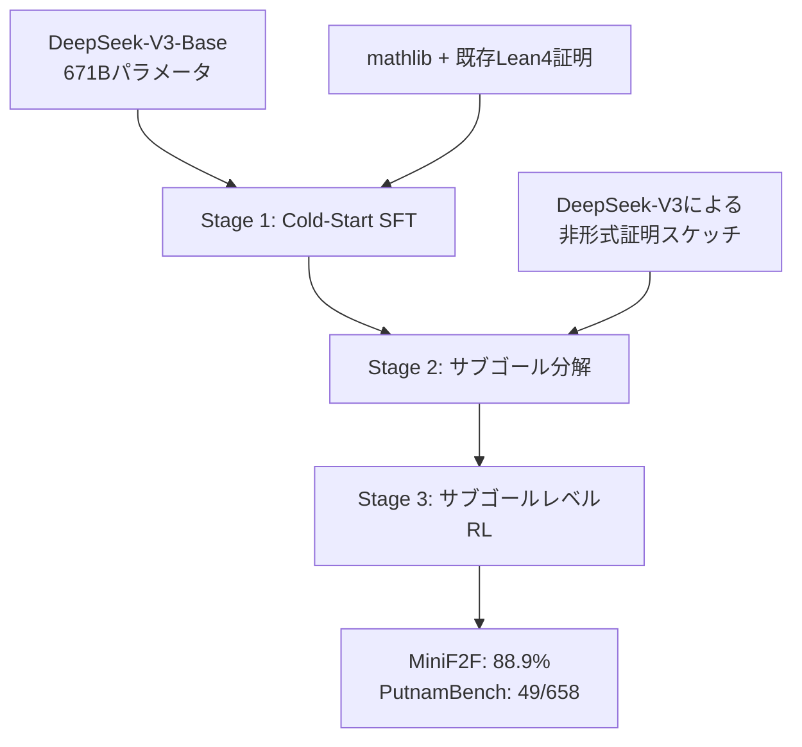

本記事は [arXiv:2504.21801 "DeepSeek-Prover-V2: Advancing Formal Mathematical Reasoning via Reinforcement Learning for Subgoal Decomposition"](https://arxiv.org/abs/2504.21801)（DeepSeek-AI、2025年4月）の解説記事です。

## 論文概要（Abstract）

DeepSeek-Prover-V2は、Lean 4における形式定理証明に特化したオープンソースLLMである。DeepSeek-V3-Baseを初期化に使い、(1) DeepSeek-V3による非形式的な証明のサブゴール分解、(2) 大規模なLean 4証明データセットの構築、(3) サブゴールレベルの強化学習（RL）、(4) MCTS（Monte Carlo Tree Search）バリアントによる証明探索を組み合わせる。著者らは、671Bモデルが MiniF2F-test で88.9%、PutnamBenchで658問中49問を解いたと報告しており、これは神経定理証明器としてのSOTAである。

この記事は [Zenn記事: Self-Guided Self-Play（SGS）で7Bモデルが671Bを超える仕組み](https://zenn.dev/0h_n0/articles/24599b7ac2e7a1) の深掘りです。Zenn記事で言及される「SGSで訓練された7BモデルがDeepSeek-Prover-V2の671Bモデルのpass@4を超えた」という結果の比較対象がこのモデルです。

## 情報源

- **arXiv ID**: 2504.21801
- **URL**: [https://arxiv.org/abs/2504.21801](https://arxiv.org/abs/2504.21801)
- **著者**: DeepSeek-AI（Z. Z. Ren et al.）
- **発表年**: 2025
- **分野**: cs.AI, cs.LG

## 背景と動機（Background & Motivation）

形式定理証明は、数学的命題の正しさをLean 4やIsabelleなどの証明支援システムで機械的に検証する営みである。LLMを用いた自動証明生成は有望なアプローチだが、以下の課題がある。

1. **証明の複雑さ**: 高度な定理の証明は多数のステップを含み、各ステップで正しいtacticを選択する必要がある
2. **探索空間の爆発**: 各証明ステップで取りうる選択肢が多く、深さ・幅の両方で指数的に増加
3. **報酬の疎性**: 証明の成否は最終ステップでしか判明せず、中間的なフィードバックが乏しい

DeepSeek-Prover-V2は、サブゴール分解によって複雑な証明を管理可能な部分問題に分割し、サブゴールレベルのRLで中間報酬を導入することで、これらの課題に対処する。

## 主要な貢献（Key Contributions）

- **サブゴール分解**: DeepSeek-V3を使って非形式的な証明スケッチからサブゴールを抽出し、各サブゴールを独立に証明
- **MCTS証明探索**: 各ノードが「部分証明＋残ゴール」を表す木構造で証明空間を効率的に探索
- **サブゴールレベルRL**: 個々のサブゴールの証明成否で報酬を与え、疎な報酬問題を緩和
- **SOTA性能**: MiniF2F-test 88.9%、PutnamBench 49/658問
- **オープンソース**: モデルと訓練データを公開

## 技術的詳細（Technical Details）

### 全体パイプライン

DeepSeek-Prover-V2の訓練パイプラインは3段階で構成される。

**Stage 1: Cold-Start SFT**: DeepSeek-V3-Baseをmathlibおよび関連するLean 4証明データで教師ありファインチューニングする。この段階でモデルはLean 4の構文と基本的なtacticの使い方を学習する。

**Stage 2: サブゴール分解**: DeepSeek-V3（非形式推論に強い）を使って定理の非形式的な証明スケッチを生成し、そこからサブゴールを抽出する。各サブゴールはLean 4のstatementとして形式化される。

**Stage 3: サブゴールレベルRL**: 各サブゴールの証明成否に基づいてRLで訓練する。

### サブゴール分解の詳細

サブゴール分解は以下のプロセスで行われる。

1. **非形式証明生成**: DeepSeek-V3が定理の自然言語による証明スケッチを生成
2. **サブゴール抽出**: 証明スケッチから中間的な主張（レンマ）を抽出
3. **形式化**: 各サブゴールをLean 4のstatementとして記述
4. **検証**: Lean 4の型チェッカーで各サブゴールが well-typed であることを確認

例として、$a^2 + b^2 \geq 2ab$ の証明を考えると、サブゴールは以下のように分解される。

- サブゴール1: $(a - b)^2 \geq 0$（非負二乗）
- サブゴール2: $(a - b)^2 = a^2 - 2ab + b^2$（展開）
- サブゴール3: サブゴール1, 2より $a^2 + b^2 \geq 2ab$（結合）

### MCTS証明探索

証明探索にはMCTSのバリアントを使用する。

- **ノード表現**: 各ノードは $(P_{\text{partial}}, G_{\text{remaining}})$ のペア。$P_{\text{partial}}$ は部分証明、$G_{\text{remaining}}$ は残りのゴール
- **展開**: 現在の証明状態に適用可能なtacticを生成
- **評価**: 学習済み価値ネットワークで証明成功確率を推定
- **選択**: UCB（Upper Confidence Bound）に基づく探索・活用のバランス

### サブゴールレベルRL

RLの訓練目的関数は以下の通りである。

$$\mathcal{L}_{\text{RL}} = -\mathbb{E} \left[ \sum_{i=1}^{N} r_i \log \pi_\theta(a_i \mid s_i) \right]$$

ここで、

- $N$: サブゴールの総数
- $r_i$: $i$ 番目のサブゴールの報酬（成功: $+1$、失敗: $-1$）
- $a_i$: 状態 $s_i$ で適用されたtactic
- $\pi_\theta$: 方策ネットワーク

全証明が完了した場合は追加のボーナス報酬が与えられる。この設計により、証明の最終的な成否だけでなく、各サブゴールの進捗に対してもフィードバックが与えられる。

## 実装のポイント（Implementation）

**モデルサイズの影響**: 671Bモデルは推論時に大規模なGPUクラスタが必要である。著者らの実験環境の詳細は公開されていないが、同等のDeepSeek-V3推論にはA100 80GB×8枚以上が必要とされる。

**サブゴール分解の品質**: サブゴール分解はDeepSeek-V3の非形式推論品質に依存する。不適切な分解（サブゴールが元の定理を含意しない、または過度に細かい分解）は証明効率を低下させる。

**Lean 4コンパイラのバージョン**: 実験はLean 4の特定バージョンで実施されており、mathlibのバージョンとの互換性に注意が必要である。

**7Bモデルとの比較**: DeepSeek-Prover-V2は7Bバージョンも公開している。Zenn記事で言及されるSGSとの比較は671Bモデルのpass@4との比較であり、7Bモデル同士の比較ではない点に注意が必要である。

## 実験結果（Results）

### MiniF2F-test

| 手法 | Pass率 | モデルサイズ |
|------|--------|------------|
| GPT-4 | 75.0% | — |
| DeepSeek-Prover-V1.5-RL | 60.2%（Pass@3200） | 7B |
| STP | 65.9%（MCTS） | 7B |
| **DeepSeek-Prover-V2** | **88.9%** | **671B** |

（数値は論文より引用）

### PutnamBench

| 手法 | 解いた問題数 / 658 |
|------|-------------------|
| 先行研究のベスト | ~25問 |
| **DeepSeek-Prover-V2** | **49問** |

（数値は論文より引用）

### SGSとの関係

Zenn記事で紹介されているSGSの結果との対比を以下に示す。

SGSの著者ら（Bailey, Wen, Dong, Hashimoto, Ma）は、DeepSeek-Prover-V2-7Bをベースモデルとして使用し、SGS訓練200ラウンド後に671Bモデルの**pass@4性能を超えた**と報告している。ただし、これは以下の限定条件下での比較である。

- **比較メトリクス**: pass@4（4回の試行で1回でも正解すれば成功）
- **データセット**: D₃ₖ（3,323個のLean4定理）
- **671Bモデルの条件**: pass@4のみ（pass@8192などの大規模サンプリングとは未比較）

この結果は「適切な訓練手法（セルフプレイ）があれば、モデルサイズの差を克服できる可能性がある」ことを示唆する一方で、671Bモデルが大規模サンプリングで発揮する能力を完全に超えたわけではない点に注意が必要である。

## 実運用への応用（Practical Applications）

**数学研究支援**: 研究者が証明の方針をスケッチし、サブゴールへの分解と各サブゴールの証明をDeepSeek-Prover-V2に委任するワークフローが実現可能。

**形式検証**: ソフトウェアの正当性証明やプロトコル検証において、Lean 4での形式化支援ツールとして活用できる。

**教育**: 数学教育において、学生が提出した証明スケッチに対して形式的な検証とフィードバックを自動提供するシステムの構築に使える可能性がある。

ただし、671Bモデルの推論コストが高いため、リアルタイムのインタラクティブ利用には7Bモデルの使用が現実的である。

## 関連研究（Related Work）

- **DeepSeek-Prover-V1.5**: 前バージョン。whole-proof generationとtree-searchを組み合わせた初期モデル
- **Hypertree Proof Search**: 値ネットワークを使った木探索による証明。DeepSeek-Prover-V2はMCTSで改善
- **STP（arXiv:2502.00212）**: セルフプレイによるデータ自己生成。DeepSeek-Prover-V1.5をベースにSTPを適用した実験がある
- **SGS（arXiv:2604.20209）**: DeepSeek-Prover-V2-7Bをベースにセルフプレイを適用し、671Bモデルのpass@4を超えた

## まとめと今後の展望

DeepSeek-Prover-V2は、サブゴール分解とサブゴールレベルRLの組み合わせにより、形式定理証明で圧倒的なSOTA性能を達成した。特に、非形式推論（DeepSeek-V3）と形式検証（Lean 4）の橋渡しとしてのサブゴール分解は、「考える」と「証明する」の分離という設計原則を体現している。

今後の課題として、(1) 671BモデルのコストをSGSのようなセルフプレイ手法で7Bモデルに蒸留する研究、(2) Lean 4以外の証明支援システム（Isabelle, Coq）への拡張、(3) より一般的な数学推論への応用が挙げられる。

## 参考文献

- **arXiv**: [https://arxiv.org/abs/2504.21801](https://arxiv.org/abs/2504.21801)
- **Code / Models**: [https://github.com/deepseek-ai/DeepSeek-Prover-V2](https://github.com/deepseek-ai/DeepSeek-Prover-V2)
- **Related Zenn article**: [https://zenn.dev/0h_n0/articles/24599b7ac2e7a1](https://zenn.dev/0h_n0/articles/24599b7ac2e7a1)

---

:::message
本記事は [arXiv:2504.21801](https://arxiv.org/abs/2504.21801) の解説記事です。記載内容は著者らの報告に基づいており、筆者自身が実験を行ったものではありません。数値は論文中のTableから引用しています。
:::
