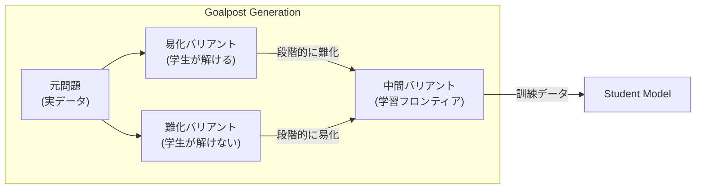
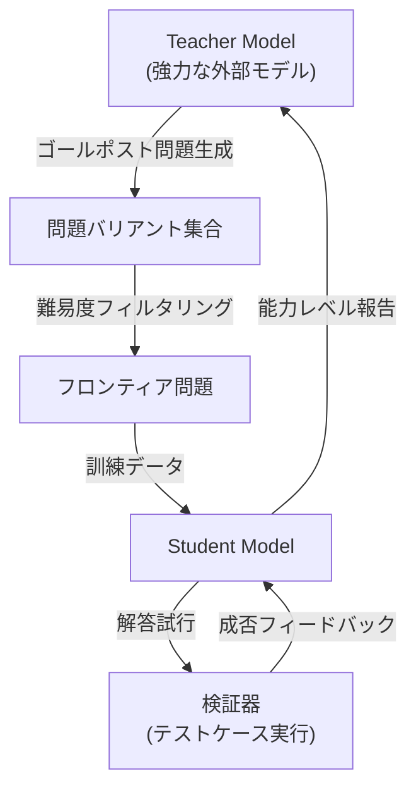

本記事は [arXiv:2603.15957 "GASP: Guided Asymmetric Self-Play for Continued Improvement of LLMs"](https://arxiv.org/abs/2603.15957)（Song et al.、2025年3月）の解説記事です。

## 論文概要（Abstract）

GASP（Guided Asymmetric Self-Play）は、外部の強力な教師モデル（Teacher）を用いて学生モデル（Student）の弱点を体系的に突く訓練データを生成し、学生を継続的に改善する非対称セルフプレイフレームワークである。GASPの設計上の特徴は、実データに基づく「ゴールポスト問題」を起点として、教師が易しいバリアント→難しいバリアントを段階的に生成する点にある。著者らは、コーディングタスクにおいてGASPがSPINやGRPO等のベースラインを上回る性能を達成したと報告している。

この記事は [Zenn記事: Self-Guided Self-Play（SGS）で7Bモデルが671Bを��える仕組み](https://zenn.dev/0h_n0/articles/24599b7ac2e7a1) の深掘りです。SGSとGASPは「ガイド付きセルフプレイ」という共通の設計哲学を持ちますが、ガイドの実現方法が根本的に異なります。GASPは外部教師モデルに依存し、SGSはモデル自身をガイドとして使うことでこの依存を排除しています。

## 情報源

- **arXiv ID**: 2603.15957
- **URL**: [https://arxiv.org/abs/2603.15957](https://arxiv.org/abs/2603.15957)
- **著者**: Yue Song et al.
- **発表年**: 2025
- **分野**: cs.AI, cs.LG

## 背景と動機（Background & Motivation）

LLMのPost-Training（SFT後の追加訓練）において、セルフプレイは有望なアプローチだが、2つの根本的な課題がある。

1. **分布ミスマッチ**: SPINのように前バージョンのモデルを対戦相手にすると、モデルが改善するにつれて対戦相手が時代遅れになる
2. **訓練データの品質**: セルフプレイで生成される問題が学生の能力向上に実際に寄与するとは限らない

GASPは「非対称セルフプレイ」の発想を導入する。対称セルフプレイ（SPIN: モデルが自分自身と対戦）ではなく、より強い教師モデルが問題を設計し、学生がそれを解くという非対称な関係を構築する。これは教育における「教師がレベルに合った問題を出し、生徒がそれを解く」というモデルに対応する。

## 主要な貢献（Key Contributions）

- **ゴールポスト問題ベースの問題生成**: 実データのタスクを起点として、教師が難易度を段階的に調整した問題バリアントを生成
- **外部教師モデルによる品質保���**: 教師モデル（SFTレベルまたはそれ以上のモデル）が問題品質を直接保証
- **コーディングタスクでの有効性**: LiveCodeBenchなどのコーディングベンチマークでSPINや非ガイドセルフプレイを上回る性能

## 技術的詳細（Technical Details）

### ゴールポスト問題の設計

GASPの核心は「ゴールポスト問題」の概念にある。



**ゴールポスト問題**とは、実データのタスク（例：LeetCode問題）を基にして教師モデルが生成する「難易度調整されたバリアント」である。

- **易しいバリアント**: 元の問題の制約を緩和し、学生が確実に解ける難易度にする
- **難しいバリアント**: 元の問題に追加の制約や複雑さを加え、学生の限界を超える難易度にする
- **フロンティアバリアント**: 学生が「ギリギリ解ける/解けない」境界に位置する問題

### 非対称セルフプレイの構造



GASPの訓練フローは以下の通りである。

```python
def gasp_training_loop(
    student: LLM,
    teacher: LLM,  # 外部の強力なモデル
    seed_problems: list[CodingProblem],
    num_rounds: int = 10,
):
    """GASPの訓練ループ（論文に基づく）"""

    for round_idx in range(num_rounds):
        # Step 1: 学生の能力を診断
        diagnostics = diagnose_student(student, seed_problems)

        # Step 2: 教師がゴールポスト問題を生成
        goalpost_problems = []
        for problem in seed_problems:
            # 易しいバリアント → 中間 → 難しいバリアント
            variants = teacher.generate_variants(
                problem,
                student_level=diagnostics[problem],
                num_variants=5,
            )
            goalpost_problems.extend(variants)

        # Step 3: 学生が各バリアントを解く
        frontier_data = []
        for variant in goalpost_problems:
            solution = student.generate(variant)
            passed = run_tests(variant, solution)

            if not passed:
                # 学生が解けなかった問題 = 学習フロンティア
                correct_solution = teacher.generate(variant)
                if run_tests(variant, correct_solution):
                    frontier_data.append({
                        "problem": variant,
                        "correct": correct_solution,
                        "student_attempt": solution,
                    })

        # Step 4: フロンティア問題で学生を訓練（Rejection Sampling）
        student = train_on_frontier(student, frontier_data)

    return student
```

### SGSとGASPの設計思想の比較

SGSとGASPは「ガイド付きセルフプレイ」という同じ方向性を持つが、ガイドの実現方法が根本的に異なる。

| 設計要素 | GASP | SGS |
|---------|------|-----|
| ガイドの実体 | 外部教師モデル（より強いLLM） | 自分自身（Self-Guidance） |
| 外部モデルへの依存 | あり（教師モデルが必要） | なし（単一モデルで完結） |
| 難易度制御 | 教師がバリアント生成で直接制御 | Conjecturerの報酬関数で間接制御 |
| スケーラビリティ | 教師の能力に制約される | モデル改善に伴いガイドも改善 |
| ドメイン | コード生成（テスト実行で検証） | 形式定理証明（Lean4で検証） |

GASPの根本的な制約は、**学生モデルが教師モデルの能力を超えられない**点にある。教師が解けない問題のバリアントは生成できないためである。SGSはこの制約を、外部教師モデルを使わず自己誘導（Self-Guidance）で解消している。

一方で、GASPには教師モデルが問題品質を直接保証できるという利点がある。SGSのConjecturerは訓練中に退化する可能性があり、Guideの導入はこの退化を防ぐためのものである。

### コーディングドメインでの検証パイプライン

GASPがコーディングタスクで有効な理由は、**テストケース実行による自動検証**が可能である点にある。

1. 教師モデルが問題バリアントとテストケースを同時に生成
2. 学生モデルが解答コードを生成
3. テストケースを実行して正誤を判定（二値シグナル）
4. 不正解の場合、教師の正答で訓練

この検証パイプラインはLean 4コンパイラによる形式検証と構造的に同等であり、SGSが定理証明で成功した理由とGASPがコード生成で成功した理由は同じ「自動検証の利用可能性」に帰着する。

## 実装のポイント（Implementation）

**教師モデルの選択**: 教師モデルは学生モデルより十分に強い必要がある。著者らの実験では、学生がQwen2.5-7Bの場合、教師にはそれより大きなSFTモデルまたはAPI経由の大規模モデルが使われている。

**バリアント生成の品質制御**: 教師が生成するバリアントの品質を確保するため、テストケースの正当性検証（教師自身が解けるか）を事前に実施する。テストケースが不正確な場合、誤った訓練信号が発生する。

**フロンティア問題の選択**: 「学生が解けない、かつ教師が解ける」問題のみを訓練データとする。学生が既に解ける問題は訓練に寄与しないため除外する。

**計算コスト**: 教師モデルによるバリアント生成とソリューション生成が追加コストとな���。学生モデルのみの訓練と比較して2〜3倍の推論コストが発生する。

## 実験結果（Results）

### コーディングベンチマーク

SGSの論文（arXiv:2604.20209）に記載されたGASPの比較結果を以下に示す。

| 手法 | AIME24 | LIVECODE | ZEBRALOGIC |
|------|--------|----------|------------|
| Qwen2.5-7B（ベース） | 7.7% | 24.5% | 43.1% |
| SPIN | 14.3% | 22.4% | 40.2% |
| **GASP** | **16.7%** | **26.1%** | **45.8%** |
| GRPO | 23.3% | 27.9% | 45.6% |
| SGS | 26.7% | 28.5% | 50.3% |

（数値はSGS論文 arXiv:2604.20209 のTable 1より引用）

GASPはSPINを上回るが、GRPOやSGSには及ばない。この結果は、外部教師モデルへの依存がスケーラビリティを制約していることを示唆する。

### GASPとSGSの差異が生まれる理由

GASPがSGSに及ばない理由について、SGSの著者らは以下を指摘している。

1. **外部モデルの能力上限**: GASPの教師モデルが生成できる問題は教師の能力に制約される。学生が教師に近づくにつれて、有効なフロンティア問題が減少する
2. **分布の結合**: GASPの訓練ターゲットは教師モデルの分布に結合されるため、教師とは異なる戦略で問題を解くことを学習しにくい
3. **SGSの自己適応性**: SGSでは誘導応答 $y'$ が常に現在のモデル $\theta$ から生成されるため、モデル改善に伴いガイドの品質も自動的に向上する

## 実運用への応用（Practical Applications）

**教師モデルが利用可能な場合**: API経由でGPT-4やClaude等の大規模モデルにアクセスできる環境では、GASPは実装が比較的容易でありながら効果的な手法である。

**コード生成の改善**: テストケースによる自動検証が可能なコーディングタスクは、GASPが最も効果を発揮するドメインである。

**段階的な難易度調整**: GASPのゴールポスト問題は、教育的なカリキュラム設計に直接応用できる。学習者のレベルに合わせた問題を自動生成するシステムの構築が可能である。

ただし、教師モデルのAPI利用コストと、バリアント生成の品質管理が実運用上の課題となる。

## 関連研究（Related Work）

- **SPIN（arXiv:2401.01335）**: 対称セルフプレイの基盤。GASPは非対称（教師→学生）に拡張
- **SGS（arXiv:2604.20209）**: 外部教師を使わないSelf-Guidanceで、GASPの外部依存を排除
- **SPC（arXiv:2504.19162）**: 批評者と生成器の共進化。GASPとは異なり外部モデル不要
- **Absolute Zero（arXiv:2505.03335）**: シードデータも外部モデルも使わないゼロデータのセルフプレイ推論

## まとめと今後の展望

GASPは「外部の強力な教師モデルによるガイド付き問題生成」という直感的な設計で、SPINを超える性能を達成した。特にコーディングドメインでの成功は、自動検証が利用可能な環境でのセルフプレイの有効性を実証している。

しかし、外部教師モデルへの依存はスケーラビリティの制約となっており、SGSはこの制約を自己誘導で解消している。GASP→SGSの発展は「セルフプレイのガイドをどこから調達するか」という設計問題への回答であり、外部教師（GASP）→固定ガイド（SGS）→進化する批評者（SPC）という設計空間の探索が現在進行形で進んでいる。

## 参考文献

- **arXiv**: [https://arxiv.org/abs/2603.15957](https://arxiv.org/abs/2603.15957)
- **Related Zenn article**: [https://zenn.dev/0h_n0/articles/24599b7ac2e7a1](https://zenn.dev/0h_n0/articles/24599b7ac2e7a1)

---

:::message
本記事は [arXiv:2603.15957](https://arxiv.org/abs/2603.15957) の解説記事です。記載内容は著者らの報告に基づいており、筆者自身が実験を行ったものではありません。数値はSGS論文（arXiv:2604.20209）のTable 1から引用しています。
:::
