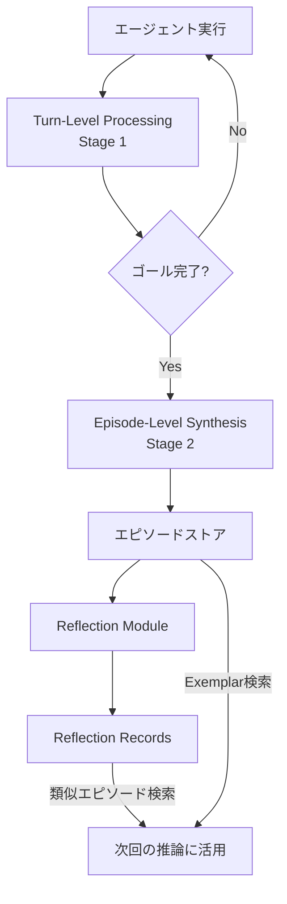
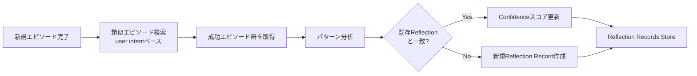

## ブログ概要（Summary）

本記事は [AWS Machine Learning Blog: Build agents to learn from experiences using Amazon Bedrock AgentCore episodic memory](https://aws.amazon.com/blogs/machine-learning/build-agents-to-learn-from-experiences-using-amazon-bedrock-agentcore-episodic-memory/) の解説記事です。Amazon Bedrock AgentCoreのエピソディックメモリは、エージェントが過去の経験（ゴール、推論ステップ、アクション、結果、振り返り）をセッションをまたいで蓄積し、類似タスクの再実行時に過去の成功・失敗パターンを活用する仕組みです。著者らは、2段階の知識抽出パイプライン（Turn-Level Processing + Episode-Level Synthesis）とクロスエピソード反省（Reflection）モジュールにより、エージェントが経験から汎化可能な知識を獲得できると報告しています。

この記事は [Zenn記事: AgentCore 3層メモリで構築するStateful Agent設計パターン](https://zenn.dev/0h_n0/articles/3a3eeb04d7f281) の深掘りです。

## 情報源

- **種別**: 企業テックブログ（AWS Machine Learning Blog）
- **URL**: [Build agents to learn from experiences using Amazon Bedrock AgentCore episodic memory](https://aws.amazon.com/blogs/machine-learning/build-agents-to-learn-from-experiences-using-amazon-bedrock-agentcore-episodic-memory/)
- **組織**: Amazon Web Services, Machine Learning チーム
- **著者**: Jiarong Jiang, Akarsha Sehwag, Mani Khanuja, Peng Shi, Ruo Cheng, Anil Gurrala
- **発表日**: 2026年1月21日

## 技術的背景（Technical Background）

LLMベースのエージェントは、単一セッション内では推論・計画・ツール呼び出しを実行できますが、セッション間で経験を蓄積・再利用する能力を持ちません。これは人間の学習プロセスとの本質的な差異です。人間は過去の経験から「何がうまくいったか」「何が失敗したか」を記憶し、類似状況で適応的に行動できます。

心理学の知見では、記憶は大きく以下のように分類されます。

- **セマンティックメモリ（意味記憶）**: 事実や概念に関する知識（例: 「東京は日本の首都」）
- **エピソディックメモリ（エピソード記憶）**: 特定の経験・出来事の記憶（例: 「先週のデプロイで設定ミスがあり、ロールバックした」）

AgentCoreのメモリアーキテクチャは、この区分に対応した設計になっています。セマンティックメモリが静的な事実知識を保持するのに対し、エピソディックメモリはエージェントが「どのようにして解決に至ったか」というプロセス知識を保持します。ブログの著者らは、このプロセス知識こそがエージェントのクロスセッション学習に不可欠であると述べています。

この技術的アプローチは、Tulving (1972) の記憶分類理論や、近年のLLMエージェント研究（Reflexion: Shinn et al., 2023; Voyager: Wang et al., 2023）に基づいています。特にReflexionは、エージェントが過去の試行の反省テキストを次の試行のプロンプトに追加する手法を提案しており、AgentCoreのReflectionモジュールはこのアイデアをマネージドサービスとして実装したものと位置づけられます。

## 実装アーキテクチャ（Architecture）

### エピソディックメモリの全体構成

ブログで解説されているエピソディックメモリの処理パイプラインは、2段階の知識抽出と1つの反省モジュールで構成されます。



### Stage 1: Turn-Level Processing

第1段階では、エージェントとユーザーの個別のやり取り（ターン）を分析し、以下の6次元で構造化された知識を抽出します。

| 次元 | 説明 | 具体例 |
|------|------|--------|
| **Turn Situation** | そのターンの状況・コンテキスト | 「ユーザーがホテル予約の変更を要求」 |
| **Turn Intent** | そのターンでのユーザーの意図 | 「チェックイン日を3日後に変更したい」 |
| **Turn Action** | エージェントが実行したアクション | 「予約APIのupdate_reservationを呼び出し」 |
| **Turn Thought** | エージェントの推論プロセス | 「日付変更にはreservation_idが必要」 |
| **Turn Assessment** | そのターンの成否判定 | 「API呼び出し成功、変更完了」 |
| **Goal Assessment** | 全体ゴールの進捗評価 | 「予約変更の主目的は達成、確認メール送信が残存」 |

この6次元の抽出により、単なる入出力ペアではなく、エージェントの推論の過程が構造化されて記録されます。著者らは、この構造化がICL（In-Context Learning）での活用時に、単なる会話履歴をそのまま渡す場合と比較して、情報密度の高いプロンプトを構成できると述べています。

### Stage 2: Episode-Level Synthesis

第2段階は、ゴールの完了時にトリガーされます。Stage 1で蓄積されたターンレベルの情報を統合し、エピソード全体としての知識を生成します。

抽出される情報は以下の4次元です。

- **Episode Situation**: エピソード全体の状況（例: 「航空券とホテルの同時予約タスク」）
- **Episode Intent**: エピソード全体を通じたユーザーの目的
- **Success Evaluation**: エピソードの成否判定（成功/部分的成功/失敗）
- **Evaluation Justification**: 成否判定の根拠
- **Episode Insights**: エピソードから得られた知見（例: 「航空券変更時はホテルの日程も同時確認が必要」）

このEpisode Insightsが、エピソディックメモリの核心的な価値です。個々のターンからは見えない「エピソード全体を通じた教訓」を自動的に抽出します。

### Reflectionモジュール: クロスエピソード反省

Reflectionモジュールは、複数のエピソードを横断的に分析し、汎化可能な知識（Reflection Records）を生成する仕組みです。



Reflection Recordは以下の3つのフィールドで構成されます。

- **Use Case**: どのようなタスクに適用できるか
- **Hints/Insights**: 具体的な推奨アクションや注意事項
- **Confidence Score**: 信頼度スコア（$0.1 \leq c \leq 1.0$）

ここで、信頼度スコア$c$は、そのReflection Recordがどれだけの成功エピソードによって裏付けられているかを反映します。新規作成時は低い値（例: $c = 0.3$）から始まり、同様のパターンが繰り返し確認されるたびに増加します。

$$
c_{t+1} = \min\left(1.0, \; c_t + \alpha \cdot \Delta c\right)
$$

ここで、
- $c_t$: 時刻$t$での信頼度スコア
- $\alpha$: 学習率（更新の大きさを制御）
- $\Delta c$: 新規エビデンスによるスコア変化量

このスコアリングにより、偶発的な成功パターンと、繰り返し確認された堅牢なパターンを区別できます。著者らは、高い信頼度スコアを持つReflection Recordほど、エージェントの推論時に優先的に参照されると説明しています。

## 知識の検索と活用メカニズム

エピソディックメモリに蓄積された知識は、2つのツールを通じてエージェントの推論時に利用されます。

### retrieve_exemplarsツール

過去の類似エピソードを検索し、ICL（In-Context Learning）のexemplarとして活用します。検索はユーザーの意図（intent）に基づくセマンティック類似度で実行されます。

```python
import boto3
from typing import Any


def retrieve_exemplars(
    session_id: str,
    memory_id: str,
    namespace: str,
    query: str,
    max_results: int = 5,
) -> list[dict[str, Any]]:
    """エピソディックメモリからexemplarを検索する

    Args:
        session_id: 現在のセッションID
        memory_id: メモリストアの識別子
        namespace: 階層名前空間（例: travel_booking/users/userABC）
        query: 検索クエリ（ユーザーの意図を記述）
        max_results: 最大取得件数

    Returns:
        類似エピソードのリスト（situation, intent, actions, insights含む）
    """
    client = boto3.client("bedrock-agentcore", region_name="us-east-1")

    response = client.retrieve_episodes(
        memoryId=memory_id,
        namespace=namespace,
        query=query,
        maxResults=max_results,
        filters={
            "successOnly": True,  # 成功エピソードのみ取得
        },
    )

    exemplars = []
    for episode in response.get("episodes", []):
        exemplars.append({
            "situation": episode["episodeSituation"],
            "intent": episode["episodeIntent"],
            "actions": episode["turnActions"],
            "insights": episode["episodeInsights"],
            "success": episode["successEvaluation"],
        })

    return exemplars
```

### retrieve_reflectionsツール

クロスエピソード反省から生成された汎化知識を検索します。exemplarが「具体的な過去事例」であるのに対し、reflectionは「複数事例から抽出された一般的な指針」です。

```python
import boto3
from typing import Any


def retrieve_reflections(
    memory_id: str,
    namespace: str,
    query: str,
    min_confidence: float = 0.5,
    max_results: int = 3,
) -> list[dict[str, Any]]:
    """Reflection Recordsから汎化知識を検索する

    Args:
        memory_id: メモリストアの識別子
        namespace: 階層名前空間
        query: 検索クエリ
        min_confidence: 最小信頼度スコア（低品質な反省を除外）
        max_results: 最大取得件数

    Returns:
        Reflection Recordのリスト（use_case, hints, confidence含む）
    """
    client = boto3.client("bedrock-agentcore", region_name="us-east-1")

    response = client.retrieve_reflections(
        memoryId=memory_id,
        namespace=namespace,
        query=query,
        maxResults=max_results,
        filters={
            "minConfidence": min_confidence,
        },
    )

    reflections = []
    for record in response.get("reflections", []):
        reflections.append({
            "use_case": record["useCase"],
            "hints": record["hints"],
            "confidence": record["confidenceScore"],
        })

    # 信頼度スコア降順でソート
    reflections.sort(key=lambda r: r["confidence"], reverse=True)
    return reflections
```

### 階層名前空間によるスコープ制御

エピソディックメモリは階層名前空間（hierarchical namespace）を使って、知識のスコープを制御できます。

```
travel_booking/
├── users/
│   ├── userABC/
│   │   └── episodes/     # userABC固有の経験
│   └── userDEF/
│       └── episodes/     # userDEF固有の経験
├── shared/
│   └── episodes/         # 全ユーザー共通の経験
└── admin/
    └── episodes/         # 管理者タスクの経験
```

この設計により、ユーザー固有の好みや過去の行動パターンと、全ユーザーに共通するベストプラクティスを分離して管理できます。例えば、特定ユーザーが常に窓側席を好む情報はユーザー名前空間に、「国際線の予約変更は24時間前までに行う必要がある」という一般知識は共有名前空間に格納されます。

## パフォーマンス最適化（Performance）

### tau-2-benchによるベンチマーク結果

著者らは、エピソディックメモリの有効性をtau-2-bench（エージェント評価ベンチマーク）で検証しています。tau-2-benchは、小売業と航空業の2つのドメインにおけるエージェントのタスク完了率を測定するベンチマークです。

| 構成 | メモリタイプ | 小売 Pass@1 | 小売 Pass@3 | 航空 Pass@1 | 航空 Pass@3 |
|------|-------------|-------------|-------------|-------------|-------------|
| ベースライン | メモリなし | 65.80% | 42.10% | 47.00% | 24.00% |
| メモリ拡張 | エピソードICL | 69.30% | 43.40% | 55.00% | 43.00% |
| メモリ拡張 | クロスエピソード反省 | 77.20% | 55.70% | 58.00% | 41.00% |

**Pass@1**は1回の試行での成功率、**Pass@3**は3回の試行のうちすべてが成功する確率を表します。Pass@3はより厳しい指標であり、エージェントの安定性を測定します。

この結果から、著者らは以下の知見を報告しています。

1. **エピソードICLによる改善**: メモリなしベースラインと比較して、小売ドメインでPass@1が+3.5pt、航空ドメインでPass@1が+8.0pt向上しています。航空ドメインでの改善幅が大きい点について、著者らは航空業務の方がルールが複雑で、過去の成功事例がより有用であるためと分析しています
2. **クロスエピソード反省の効果**: 特に小売ドメインでは、エピソードICLよりもさらにPass@1が+7.9pt、Pass@3が+12.3pt改善しています。汎化された知識が個別事例よりも安定的な性能向上をもたらすことを示唆しています
3. **航空ドメインでのPass@3の差異**: 航空ドメインにおいては、エピソードICL（43.00%）がクロスエピソード反省（41.00%）をPass@3でわずかに上回っています。この点について、ブログでは詳細な分析は記載されていませんが、航空業務の個別性が高く、汎化よりも具体的な過去事例の参照が有効なケースがあることを示唆している可能性があります

### カスタム構成によるチューニング

エピソディックメモリはデフォルト設定でも動作しますが、以下のカスタマイズが可能であると著者らは説明しています。

- **カスタムプロンプト**: Stage 1/Stage 2の抽出プロンプトをドメイン固有に変更
- **カスタムモデル**: 抽出・統合・反省の各ステージで異なるLLMを使用可能
- **名前空間設計**: ユースケースに応じた階層構造の定義

## 運用での学び（Production Lessons）

### エピソディックメモリの適用が有効なケース

ブログの内容から、エピソディックメモリが特に有効なユースケースは以下の3つです。

1. **複雑な多段階タスク**: 複数のAPI呼び出しやツール連携が必要なタスク。過去の成功パターンを参照することで、中間ステップのエラーを回避できます
2. **繰り返しワークフロー**: 類似のリクエストが定期的に発生する業務。蓄積されたエピソードが増えるほど、タスク完了率が向上します
3. **ドメイン固有の問題**: 一般的なLLM知識だけでは対応が難しい、業界固有のルールや手順がある領域。エピソード内のInsightsがドメイン知識として機能します

### 注意すべき制約

一方で、以下の制約にも留意が必要です。

- **コールドスタート問題**: エピソードが蓄積されていない初期段階では、メモリの効果は限定的です。初期データの投入戦略（シミュレーション実行や手動エピソード登録）が必要になります
- **ストレージと検索コスト**: エピソード数の増加に伴い、検索レイテンシとストレージコストが増大します。名前空間の適切な設計とmax_resultsの制限が重要です
- **反省の品質依存**: Reflection Recordの品質は、基盤となるエピソードの質に依存します。不正確なエピソードが蓄積された場合、誤った汎化知識が生成されるリスクがあります

## 学術研究との関連（Academic Connection）

AgentCoreのエピソディックメモリは、以下の学術研究と関連が深い技術です。

- **Reflexion (Shinn et al., 2023, arXiv:2303.11366)**: LLMエージェントが過去の試行の「反省」テキストを生成し、次の試行で活用する手法です。AgentCoreのReflectionモジュールはこのアイデアをクロスエピソード化し、マネージドサービスとして提供しています
- **Voyager (Wang et al., 2023, arXiv:2305.16291)**: Minecraftエージェントがスキルライブラリを構築し、過去のスキルを再利用する手法です。エピソディックメモリの「過去の成功パターンを再利用する」という概念と共通しています
- **MemoryBank (Zhong et al., 2024, AAAI 2024)**: LLMの長期記憶を管理するフレームワークで、Ebbinghaus忘却曲線に基づく記憶の強化・減衰メカニズムを導入しています。AgentCoreのConfidence Scoreによる記憶の重み付けと類似のアプローチです
- **Generative Agents (Park et al., 2023, UIST 2023)**: LLMエージェントが日常生活の経験を記憶し、反省する仕組みを構築した研究です。エピソードの構造化と反省の自動化という点でAgentCoreの設計思想と共通しています

## Production Deployment Guide

本ブログではAgentCoreエピソディックメモリのAPIとアーキテクチャが詳細に解説されているため、AWS上での本番環境構築ガイドを以下に示します。

### AWS実装パターン（コスト最適化重視）

**トラフィック量別の推奨構成**:

| 構成 | トラフィック | アーキテクチャ | 月額コスト概算 |
|------|-------------|---------------|---------------|
| **Small** | ~100 req/日 | Lambda + Bedrock AgentCore + DynamoDB | $50-150 |
| **Medium** | ~1,000 req/日 | ECS Fargate + Bedrock AgentCore + ElastiCache | $300-800 |
| **Large** | 10,000+ req/日 | EKS + Karpenter (Spot) + Bedrock AgentCore + ElastiCache | $2,000-5,000 |

**Small構成の内訳** (~100 req/日):
- Lambda: ~$5/月（128MB, 平均30秒実行 x 3,000回）
- Bedrock AgentCore Memory API: ~$30-80/月（エピソード検索・保存）
- Bedrock LLM (Claude 3.5 Sonnet): ~$15-50/月（抽出・反省用）
- DynamoDB (On-Demand): ~$5/月（セッション管理）
- CloudWatch Logs: ~$5/月

**Large構成の内訳** (10,000+ req/日):
- EKS コントロールプレーン: ~$73/月
- EC2 Spot Instances (m7g.xlarge x 3): ~$150/月（オンデマンド比70%削減）
- Bedrock AgentCore Memory API: ~$500-1,500/月
- Bedrock LLM (Claude 3.5 Sonnet, Batch API): ~$800-2,000/月（Batch APIで50%削減）
- ElastiCache (r7g.large): ~$200/月
- NAT Gateway + データ転送: ~$100/月

**コスト削減テクニック**:
- **Spot Instances**: EKSワーカーノードにSpot Instancesを使用し、最大90%のコスト削減
- **Bedrock Batch API**: 非リアルタイムの反省処理（Reflection）をBatch APIで実行し、50%削減
- **Prompt Caching**: エピソード抽出プロンプトのシステムプロンプト部分をキャッシュし、30-90%削減
- **名前空間による検索最適化**: 適切な名前空間設計でmax_resultsを削減し、API呼び出しコストを抑制

> 上記のコスト試算は2026年4月時点のAWS ap-northeast-1（東京）リージョン料金に基づく概算値です。実際のコストはトラフィックパターン、リージョン、バースト使用量により変動します。最新料金はAWS料金計算ツール（https://calculator.aws/）で確認を推奨します。

### Terraformインフラコード

**Small構成（Serverless）: Lambda + Bedrock AgentCore + DynamoDB**

```hcl
# small_episodic_memory/main.tf
# AgentCore Episodic Memory - Small構成（Serverless）

terraform {
  required_version = ">= 1.8"
  required_providers {
    aws = {
      source  = "hashicorp/aws"
      version = "~> 5.80"
    }
  }
}

provider "aws" {
  region = "us-east-1" # AgentCore対応リージョン
}

# --- IAMロール（最小権限） ---
resource "aws_iam_role" "agent_lambda" {
  name = "episodic-memory-agent-lambda"
  assume_role_policy = jsonencode({
    Version = "2012-10-17"
    Statement = [{
      Action = "sts:AssumeRole"
      Effect = "Allow"
      Principal = { Service = "lambda.amazonaws.com" }
    }]
  })
}

resource "aws_iam_role_policy" "agent_lambda_policy" {
  name = "episodic-memory-agent-policy"
  role = aws_iam_role.agent_lambda.id
  policy = jsonencode({
    Version = "2012-10-17"
    Statement = [
      {
        Effect = "Allow"
        Action = [
          "bedrock-agentcore:RetrieveEpisodes",
          "bedrock-agentcore:RetrieveReflections",
          "bedrock-agentcore:StoreEpisode",
          "bedrock-agentcore:UpdateReflection",
        ]
        Resource = "arn:aws:bedrock-agentcore:*:*:memory/*"
      },
      {
        Effect = "Allow"
        Action = [
          "bedrock:InvokeModel",
        ]
        Resource = "arn:aws:bedrock:*:*:model/anthropic.claude-3-5-sonnet-*"
      },
      {
        Effect = "Allow"
        Action = [
          "dynamodb:GetItem",
          "dynamodb:PutItem",
          "dynamodb:Query",
          "dynamodb:DeleteItem",
        ]
        Resource = aws_dynamodb_table.sessions.arn
      },
      {
        Effect = "Allow"
        Action = [
          "logs:CreateLogGroup",
          "logs:CreateLogStream",
          "logs:PutLogEvents",
        ]
        Resource = "arn:aws:logs:*:*:*"
      },
    ]
  })
}

# --- DynamoDB（セッション管理） ---
resource "aws_dynamodb_table" "sessions" {
  name         = "episodic-memory-sessions"
  billing_mode = "PAY_PER_REQUEST" # On-Demandでコスト最適化
  hash_key     = "session_id"

  attribute {
    name = "session_id"
    type = "S"
  }

  ttl {
    attribute_name = "expires_at"
    enabled        = true
  }

  server_side_encryption {
    enabled = true # KMS暗号化
  }

  tags = {
    Project = "episodic-memory-agent"
    Env     = "production"
  }
}

# --- Lambda関数 ---
resource "aws_lambda_function" "agent" {
  function_name = "episodic-memory-agent"
  role          = aws_iam_role.agent_lambda.arn
  runtime       = "python3.13"
  handler       = "handler.main"
  filename      = "lambda_package.zip"
  timeout       = 120 # Bedrock API呼び出しを考慮
  memory_size   = 256

  environment {
    variables = {
      MEMORY_ID          = "episodic-memory-store-prod"
      DEFAULT_NAMESPACE  = "production/shared"
      MAX_EXEMPLARS      = "5"
      MIN_CONFIDENCE     = "0.5"
      DYNAMODB_TABLE     = aws_dynamodb_table.sessions.name
    }
  }

  tracing_config {
    mode = "Active" # X-Ray有効化
  }

  tags = {
    Project = "episodic-memory-agent"
  }
}

# --- CloudWatchアラーム（コスト監視） ---
resource "aws_cloudwatch_metric_alarm" "lambda_duration" {
  alarm_name          = "episodic-memory-lambda-duration-high"
  comparison_operator = "GreaterThanThreshold"
  evaluation_periods  = 3
  metric_name         = "Duration"
  namespace           = "AWS/Lambda"
  period              = 300
  statistic           = "Average"
  threshold           = 90000 # 90秒（タイムアウト120秒の75%）
  alarm_description   = "Lambda実行時間が90秒を超過"
  alarm_actions       = [] # SNS ARNを設定

  dimensions = {
    FunctionName = aws_lambda_function.agent.function_name
  }
}
```

**Large構成（Container）: EKS + Karpenter + Spot Instances**

```hcl
# large_episodic_memory/main.tf
# AgentCore Episodic Memory - Large構成（Container）

# --- EKSクラスタ ---
module "eks" {
  source  = "terraform-aws-modules/eks/aws"
  version = "~> 20.31"

  cluster_name    = "episodic-memory-cluster"
  cluster_version = "1.31"

  vpc_id     = module.vpc.vpc_id
  subnet_ids = module.vpc.private_subnets

  # パブリックアクセス最小化
  cluster_endpoint_public_access  = false
  cluster_endpoint_private_access = true

  # Karpenter用IAM
  enable_irsa = true

  tags = {
    Project = "episodic-memory-agent"
    Env     = "production"
  }
}

# --- Karpenter Provisioner（Spot優先） ---
resource "kubectl_manifest" "karpenter_nodepool" {
  yaml_body = yamlencode({
    apiVersion = "karpenter.sh/v1"
    kind       = "NodePool"
    metadata   = { name = "episodic-memory-pool" }
    spec = {
      template = {
        spec = {
          requirements = [
            { key = "karpenter.sh/capacity-type", operator = "In", values = ["spot", "on-demand"] },
            { key = "node.kubernetes.io/instance-type", operator = "In", values = ["m7g.xlarge", "m7g.2xlarge", "m6g.xlarge"] },
          ]
          nodeClassRef = { name = "default" }
        }
      }
      limits   = { cpu = "64", memory = "256Gi" }
      disruption = {
        consolidationPolicy = "WhenEmptyOrUnderutilized"
        consolidateAfter    = "30s"
      }
    }
  })
}

# --- Secrets Manager（Bedrock設定） ---
resource "aws_secretsmanager_secret" "bedrock_config" {
  name        = "episodic-memory/bedrock-config"
  description = "AgentCore Memory設定"

  tags = {
    Project = "episodic-memory-agent"
  }
}

# --- AWS Budgets（予算アラート） ---
resource "aws_budgets_budget" "monthly" {
  name         = "episodic-memory-monthly"
  budget_type  = "COST"
  limit_amount = "5000"
  limit_unit   = "USD"
  time_unit    = "MONTHLY"

  notification {
    comparison_operator       = "GREATER_THAN"
    threshold                 = 80
    threshold_type            = "PERCENTAGE"
    notification_type         = "ACTUAL"
    subscriber_email_addresses = ["ops-team@example.com"]
  }

  notification {
    comparison_operator       = "GREATER_THAN"
    threshold                 = 100
    threshold_type            = "PERCENTAGE"
    notification_type         = "FORECASTED"
    subscriber_email_addresses = ["ops-team@example.com"]
  }
}
```

### 運用・監視設定

**CloudWatch Logs Insights: エピソディックメモリ検索の分析**

```
# エピソード検索のレイテンシ分析（P95, P99）
fields @timestamp, @message
| filter @message like /retrieve_episodes/
| stats
    avg(duration_ms) as avg_latency,
    pct(duration_ms, 95) as p95_latency,
    pct(duration_ms, 99) as p99_latency,
    count(*) as total_requests
  by bin(1h)
| sort @timestamp desc
```

```
# Reflection更新頻度と信頼度スコア分布
fields @timestamp, @message
| filter @message like /update_reflection/
| parse @message '"confidence":*,' as confidence
| stats
    count(*) as updates,
    avg(confidence) as avg_confidence
  by bin(1d)
```

**CloudWatchアラーム設定（Python）**:

```python
import boto3


def create_episodic_memory_alarms(sns_topic_arn: str) -> None:
    """エピソディックメモリ監視用CloudWatchアラームを作成する

    Args:
        sns_topic_arn: 通知先SNSトピックのARN
    """
    cw = boto3.client("cloudwatch")

    # Bedrock AgentCore API エラー率アラーム
    cw.put_metric_alarm(
        AlarmName="episodic-memory-api-error-rate",
        ComparisonOperator="GreaterThanThreshold",
        EvaluationPeriods=3,
        MetricName="Errors",
        Namespace="AWS/Lambda",
        Period=300,
        Statistic="Sum",
        Threshold=10,
        AlarmDescription="エピソディックメモリAPI呼び出しエラーが5分間で10件超過",
        AlarmActions=[sns_topic_arn],
        Dimensions=[
            {"Name": "FunctionName", "Value": "episodic-memory-agent"},
        ],
    )

    # 検索レイテンシP95アラーム
    cw.put_metric_alarm(
        AlarmName="episodic-memory-search-latency-p95",
        ComparisonOperator="GreaterThanThreshold",
        EvaluationPeriods=2,
        MetricName="Duration",
        Namespace="AWS/Lambda",
        Period=300,
        ExtendedStatistic="p95",
        Threshold=5000,  # 5秒
        AlarmDescription="エピソード検索P95レイテンシが5秒超過",
        AlarmActions=[sns_topic_arn],
        Dimensions=[
            {"Name": "FunctionName", "Value": "episodic-memory-agent"},
        ],
    )
```

**X-Rayトレーシング設定（Python）**:

```python
from aws_xray_sdk.core import xray_recorder, patch_all


# boto3を含む全AWSクライアントの自動計装
patch_all()


@xray_recorder.capture("retrieve_episodic_memory")
def retrieve_memory_with_tracing(
    memory_id: str,
    namespace: str,
    query: str,
) -> dict:
    """X-Rayトレース付きエピソディックメモリ検索

    Args:
        memory_id: メモリストアID
        namespace: 検索対象の名前空間
        query: 検索クエリ

    Returns:
        検索結果（exemplarsとreflections）
    """
    subsegment = xray_recorder.current_subsegment()
    subsegment.put_annotation("memory_id", memory_id)
    subsegment.put_annotation("namespace", namespace)
    subsegment.put_metadata("query", query, "episodic_memory")

    exemplars = retrieve_exemplars(
        session_id="current",
        memory_id=memory_id,
        namespace=namespace,
        query=query,
    )
    reflections = retrieve_reflections(
        memory_id=memory_id,
        namespace=namespace,
        query=query,
    )

    subsegment.put_metadata("exemplar_count", len(exemplars), "episodic_memory")
    subsegment.put_metadata("reflection_count", len(reflections), "episodic_memory")

    return {"exemplars": exemplars, "reflections": reflections}
```

**Cost Explorer自動レポート（Python）**:

```python
import boto3
from datetime import datetime, timedelta


def generate_daily_cost_report(sns_topic_arn: str) -> dict:
    """日次コストレポートを生成し、閾値超過時にSNS通知する

    Args:
        sns_topic_arn: 通知先SNSトピックARN

    Returns:
        コストレポートの辞書
    """
    ce = boto3.client("ce")
    sns = boto3.client("sns")

    end_date = datetime.utcnow().strftime("%Y-%m-%d")
    start_date = (datetime.utcnow() - timedelta(days=1)).strftime("%Y-%m-%d")

    response = ce.get_cost_and_usage(
        TimePeriod={"Start": start_date, "End": end_date},
        Granularity="DAILY",
        Metrics=["UnblendedCost"],
        Filter={
            "Tags": {
                "Key": "Project",
                "Values": ["episodic-memory-agent"],
            }
        },
        GroupBy=[
            {"Type": "DIMENSION", "Key": "SERVICE"},
        ],
    )

    total_cost = 0.0
    service_costs = {}
    for group in response["ResultsByTime"][0]["Groups"]:
        service = group["Keys"][0]
        cost = float(group["Metrics"]["UnblendedCost"]["Amount"])
        service_costs[service] = cost
        total_cost += cost

    # $100/日超過でSNS通知
    if total_cost > 100:
        sns.publish(
            TopicArn=sns_topic_arn,
            Subject="[ALERT] Episodic Memory日次コスト超過",
            Message=f"日次コスト: ${total_cost:.2f}\n内訳: {service_costs}",
        )

    return {"date": start_date, "total": total_cost, "services": service_costs}
```

### コスト最適化チェックリスト

**アーキテクチャ選択**:
- [ ] トラフィック量に基づいて構成を選択（~100/日: Serverless、~1,000/日: Hybrid、10,000+/日: Container）
- [ ] エピソード抽出の非同期化（リアルタイム不要な場合はBatch API）

**リソース最適化**:
- [ ] EC2/EKS: Spot Instancesを優先使用（最大90%削減）
- [ ] Reserved Instances: 1年コミットで最大72%削減
- [ ] Savings Plans: Compute Savings Plansの適用を検討
- [ ] Lambda: メモリサイズをPower Tuningで最適化（256MB推奨）
- [ ] ECS/EKS: アイドル時のスケールダウン設定（Karpenter consolidation）
- [ ] ElastiCache: Reserved Nodesで最大55%削減

**LLMコスト削減**:
- [ ] Bedrock Batch API: Reflection生成を非同期バッチ実行（50%削減）
- [ ] Prompt Caching: エピソード抽出のシステムプロンプトをキャッシュ（30-90%削減）
- [ ] モデル選択ロジック: Turn-Level抽出はHaiku、Episode-Level合成はSonnetと使い分け
- [ ] トークン数制限: max_resultsとmax_tokensを適切に設定
- [ ] 名前空間フィルタ: 検索スコープを狭めてAPI呼び出し回数を削減

**監視・アラート**:
- [ ] AWS Budgets: 月額予算アラートを設定（80%/100%閾値）
- [ ] CloudWatch アラーム: Lambda実行時間、エラー率、Bedrockトークン使用量
- [ ] Cost Anomaly Detection: 異常支出の自動検知を有効化
- [ ] 日次コストレポート: Cost Explorer APIで自動取得、$100/日超過で通知

**リソース管理**:
- [ ] 未使用リソースの定期削除（古いエピソードのTTL設定）
- [ ] タグ戦略: Project/Env/Ownerタグの統一適用
- [ ] ライフサイクルポリシー: CloudWatch Logsの保持期間を30日に設定
- [ ] 開発環境の夜間停止: EKSノードのスケジュールスケーリング
- [ ] DynamoDB TTL: セッションデータの自動削除（24時間後）

## まとめと実践への示唆

AgentCoreのエピソディックメモリは、LLMエージェントに「経験からの学習」という能力を付与するマネージドサービスです。2段階の知識抽出パイプライン（Turn-Level + Episode-Level）により、エージェントの推論プロセスが構造化されて保存されます。さらに、Reflectionモジュールによるクロスエピソード分析が、個別事例を超えた汎化可能な知識の獲得を実現しています。

tau-2-benchの結果では、特に小売ドメインのPass@3でクロスエピソード反省が+13.6ptの改善を示しており、安定性の向上という点で顕著な効果が報告されています。一方で、航空ドメインのPass@3ではエピソードICLが反省を上回るケースもあり、ドメイン特性に応じた戦略選択が重要です。

実践への示唆として、以下の3点を挙げます。

1. **段階的導入**: まずセマンティックメモリで事実知識を整備し、次にエピソディックメモリで経験学習を追加するアプローチが堅実です
2. **名前空間設計の重要性**: ユーザー固有の経験と共有知識を分離する階層設計が、検索精度とコスト効率の両方に影響します
3. **Reflectionの活用判断**: ドメインの個別性が高い場合はエピソードICL、汎用的なパターンが多い場合はクロスエピソード反省を優先する使い分けが有効です

## 参考文献

- **Blog URL**: [Build agents to learn from experiences using Amazon Bedrock AgentCore episodic memory](https://aws.amazon.com/blogs/machine-learning/build-agents-to-learn-from-experiences-using-amazon-bedrock-agentcore-episodic-memory/)
- **AgentCore Memory Documentation**: [Amazon Bedrock AgentCore Memory](https://docs.aws.amazon.com/bedrock-agentcore/latest/devguide/memory.html)
- **Related Papers**:
  - Shinn et al. (2023), "Reflexion: Language Agents with Verbal Reinforcement Learning", arXiv:2303.11366
  - Wang et al. (2023), "Voyager: An Open-Ended Embodied Agent with Large Language Models", arXiv:2305.16291
  - Park et al. (2023), "Generative Agents: Interactive Simulacra of Human Behavior", UIST 2023
- **Related Zenn article**: [AgentCore 3層メモリで構築するStateful Agent設計パターン](https://zenn.dev/0h_n0/articles/3a3eeb04d7f281)
