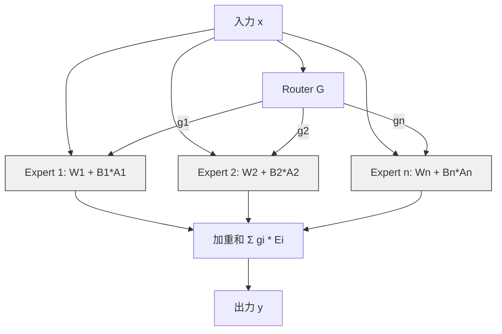

## 論文概要（Abstract）

本記事は [https://arxiv.org/abs/2402.00367](https://arxiv.org/abs/2402.00367) の解説記事です。

Mixture-of-Experts（MoE）モデルは近年のLLM開発において有力なアーキテクチャとして注目されているが、パラメータ数の膨大さからフルファインチューニングが困難である。本論文では、MoEモデルのexpert層のみにLoRAアダプタを適用するMoE-LoRAを提案している。著者らは、全パラメータの6.2%のみを更新することで、フルファインチューニングに迫る性能を達成したと報告している。

この記事は [Zenn記事: Gemma 4 26B-A4BをコードレビューBotにLoRAファインチューニングする実践ガイド](https://zenn.dev/0h_n0/articles/928d985b1268cd) の深掘りです。

## 情報源

- **arXiv ID**: 2402.00367
- **URL**: [https://arxiv.org/abs/2402.00367](https://arxiv.org/abs/2402.00367)
- **著者**: Zefeng Wang, Shengyu Zhang, Jiezhong Qiu, et al.
- **発表年**: 2024
- **分野**: cs.LG, cs.CL

## 背景と動機（Background & Motivation）

Mixture-of-Experts（MoE）アーキテクチャは、パラメータ数を大幅に増加させつつも、推論時にはルーターによって選択された一部のエキスパートのみを活性化させることで計算コストを抑える手法である。Mixtral-8x7B、Gemma 4 26B-A4B（128エキスパート中4つを活性化）、Switch Transformerなどがこのアプローチを採用している。

しかし、MoEモデルのフルファインチューニングには大量のGPUメモリと計算資源が必要になる。例えばMixtral-8x7Bは約47Bパラメータを持ち、全パラメータの勾配を保持するには数百GBのメモリが求められる。一方、既存のパラメータ効率的ファインチューニング（PEFT）手法であるLoRAをMoEモデルに適用する際、「どの層にアダプタを挿入すべきか」という設計判断は十分に検討されていなかった。

本論文は、MoEモデルの構造的特性に着目し、expert層のみにLoRAを適用するという戦略がメモリ効率と性能の両面で最適であることを実験的に示している。

## 主要な貢献（Key Contributions）

- **Expert層特化のLoRA戦略**: MoEモデルのexpert層のみにLoRAアダプタを適用する手法を提案し、non-expert層（attention等）への適用よりも高い性能を達成
- **パラメータ効率**: フルファインチューニングの6.2%のパラメータ更新で、Commonsense推論タスクにおいてフルFT比99.1%の性能を達成
- **メモリ効率**: フルファインチューニング比で4-5倍のメモリ削減を実現し、限られたGPU環境でのMoEモデル適応を可能に

## 技術的詳細（Technical Details）

### MoE層の構造

MoEモデルの各Transformerブロックは、Self-Attentionブロックと、通常のFFN（Feed-Forward Network）を複数のエキスパートで置き換えたMoE層から構成される。MoE層の出力は以下の式で定義される。

$$
\mathbf{y} = \sum_{i \in \text{Top-}k} g_i \cdot E_i(\mathbf{x})
$$

ここで、
- $\mathbf{x}$: MoE層への入力ベクトル
- $E_i$: $i$番目のエキスパートネットワーク（各々がFFNを構成）
- $g_i$: ルーター$G$が算出する$i$番目のエキスパートのゲーティングスコア
- $\text{Top-}k$: ゲーティングスコア上位$k$個のエキスパートのインデックス集合

ルーターは入力$\mathbf{x}$に対してソフトマックスを適用し、各エキスパートの重みを算出する。Mixtral-8x7Bでは$k=2$（8エキスパート中2つを活性化）、Gemma 4 26B-A4Bでは$k=4$（128エキスパート中4つを活性化）である。

### MoE-LoRA: Expert層へのLoRA適用

標準LoRAでは、事前学習済み重み行列$\mathbf{W} \in \mathbb{R}^{d \times d}$に対して低ランク行列のペア$\mathbf{B} \in \mathbb{R}^{d \times r}$, $\mathbf{A} \in \mathbb{R}^{r \times d}$を加算する。

$$
\mathbf{W}' = \mathbf{W} + \mathbf{B}\mathbf{A}
$$

ここで、$r \ll d$がLoRAのランクであり、更新パラメータ数は$2 \times d \times r$となる。

MoE-LoRAでは、この適用をexpert層の重み行列に限定する。各エキスパート$E_i$の重み行列$\mathbf{W}_i$に対して、**個別の**LoRAアダプタ$(\mathbf{A}_i, \mathbf{B}_i)$を割り当てる。

$$
\mathbf{W}'_i = \mathbf{W}_i + \mathbf{B}_i \mathbf{A}_i \quad \forall i \in \{1, \ldots, n\}
$$

ここで、
- $\mathbf{W}_i$: $i$番目のエキスパートの凍結された事前学習済み重み行列
- $\mathbf{B}_i \in \mathbb{R}^{d \times r}$: $i$番目のエキスパート専用のLoRA行列B
- $\mathbf{A}_i \in \mathbb{R}^{r \times d}$: $i$番目のエキスパート専用のLoRA行列A
- $n$: エキスパート数

各エキスパートが独立したLoRAアダプタを持つことで、エキスパートごとに異なるタスク特化の適応が可能となる。これはMoEアーキテクチャの本来の設計思想 -- 異なるエキスパートが入力空間の異なる部分を担当する -- と整合する。

### アーキテクチャの全体像

以下のMermaidダイアグラムは、MoE-LoRAの適用構造を示す。



重要な設計判断として、**ルーター$G$の重みは凍結**したままとする。ルーターはエキスパートの選択パターンを決定するが、事前学習で獲得した選択パターンを維持することで、エキスパートの専門性の分離を保つ。

### なぜExpert層への適用が有効なのか

著者らは、expert層がMoEモデルの全パラメータの60-70%を占めると報告している。Mixtral-8x7Bでは、8つのエキスパート（各エキスパートが3層のFFN）がモデルの大部分のパラメータを構成する。一方、attention層やLayerNormなどのnon-expert層はパラメータ数が相対的に少ない。

タスク適応において重要なのは、エキスパート内部の知識表現を更新することである。ルーターは「どのエキスパートを使うか」を決定するが、「エキスパートが何を出力するか」を制御するのはエキスパートの重み行列自体である。LoRAをexpert層に集中させることで、限られた更新パラメータ数で最大のタスク適応効果を得られる。

### 学習の設定

学習は標準的な言語モデルの交差エントロピー損失で行う。

$$
\mathcal{L} = -\frac{1}{T} \sum_{t=1}^{T} \log p(y_t \mid y_{<t}, \mathbf{x}; \theta_{\text{frozen}}, \theta_{\text{LoRA}})
$$

ここで、
- $T$: シーケンス長
- $y_t$: $t$番目のトークン
- $\theta_{\text{frozen}}$: 凍結された事前学習済みパラメータ（全体の93.8%）
- $\theta_{\text{LoRA}}$: 更新対象のLoRAパラメータ（全体の6.2%）

基盤モデルの重みは完全に凍結し、LoRAアダプタのパラメータ$\{\mathbf{A}_i, \mathbf{B}_i\}_{i=1}^{n}$のみを勾配降下法で更新する。

### アルゴリズム

```python
import torch
import torch.nn as nn
from typing import Optional


class MoELoRAExpert(nn.Module):
    """MoE-LoRA: Expert層にLoRAアダプタを適用したエキスパートモジュール

    各エキスパートの重み行列W_iに対して、独立した低ランクアダプタ
    (B_i, A_i)を追加する。推論時はW'_i = W_i + B_i @ A_iとして動作する。

    Args:
        base_expert: 事前学習済みエキスパートのFFN層
        rank: LoRAのランク（低ランク分解の次元数）
        alpha: LoRAのスケーリング係数
    """

    def __init__(
        self,
        base_expert: nn.Linear,
        rank: int = 16,
        alpha: float = 16.0,
    ) -> None:
        super().__init__()
        self.base_expert = base_expert
        self.rank = rank
        self.scaling = alpha / rank

        in_features: int = base_expert.in_features
        out_features: int = base_expert.out_features

        # LoRAアダプタ: B @ A を W に加算
        self.lora_A = nn.Linear(in_features, rank, bias=False)
        self.lora_B = nn.Linear(rank, out_features, bias=False)

        # 初期化: Aはランダム正規分布、Bはゼロ（初期状態でW' = W）
        nn.init.kaiming_normal_(self.lora_A.weight)
        nn.init.zeros_(self.lora_B.weight)

        # 基盤重みを凍結
        for param in self.base_expert.parameters():
            param.requires_grad = False

    def forward(self, x: torch.Tensor) -> torch.Tensor:
        """順伝播: base_expert(x) + scaling * lora_B(lora_A(x))

        Args:
            x: 入力テンソル (batch_size, seq_len, in_features)

        Returns:
            出力テンソル (batch_size, seq_len, out_features)
        """
        base_output = self.base_expert(x)
        lora_output = self.lora_B(self.lora_A(x)) * self.scaling
        return base_output + lora_output


class MoELayerWithLoRA(nn.Module):
    """MoE層全体: Router + MoE-LoRA適用済みエキスパート群

    Args:
        router: ゲーティングネットワーク（凍結）
        experts: エキスパートのリスト
        top_k: 活性化するエキスパート数
        rank: LoRAのランク
    """

    def __init__(
        self,
        router: nn.Linear,
        experts: nn.ModuleList,
        top_k: int = 2,
        rank: int = 16,
    ) -> None:
        super().__init__()
        self.top_k = top_k

        # ルーターは凍結
        self.router = router
        for param in self.router.parameters():
            param.requires_grad = False

        # 各エキスパートにLoRAを適用
        self.experts = nn.ModuleList(
            [MoELoRAExpert(expert, rank=rank) for expert in experts]
        )

    def forward(self, x: torch.Tensor) -> torch.Tensor:
        """MoE層の順伝播

        Args:
            x: 入力テンソル (batch_size, seq_len, d_model)

        Returns:
            出力テンソル (batch_size, seq_len, d_model)
        """
        # ルーターでゲーティングスコアを計算
        gate_logits = self.router(x)  # (batch_size, seq_len, num_experts)
        gate_scores = torch.softmax(gate_logits, dim=-1)

        # Top-kエキスパートを選択
        top_k_scores, top_k_indices = torch.topk(
            gate_scores, self.top_k, dim=-1
        )

        # Top-kスコアを再正規化
        top_k_scores = top_k_scores / top_k_scores.sum(dim=-1, keepdim=True)

        # 各エキスパートの出力を加重和
        output = torch.zeros_like(x)
        for k_idx in range(self.top_k):
            expert_idx = top_k_indices[..., k_idx]  # (batch, seq_len)
            score = top_k_scores[..., k_idx].unsqueeze(-1)  # (batch, seq_len, 1)

            for e_idx in range(len(self.experts)):
                mask = (expert_idx == e_idx).unsqueeze(-1)
                if mask.any():
                    expert_input = x * mask.float()
                    expert_out = self.experts[e_idx](expert_input)
                    output = output + score * expert_out * mask.float()

        return output
```

## 実装のポイント（Implementation）

MoE-LoRAを実装する際の重要な注意点を以下に整理する。

**ランクの選択**: 著者らの実験（論文Table記載）では、$r=16$が最良の結果を示している。$r=4$で77.1%、$r=8$で78.3%、$r=16$で78.6%、$r=32$で78.4%と報告されており、$r=32$では性能が頭打ちになる。これはLoRAの低ランク近似の表現力とオーバーフィッティングのトレードオフによるものと考えられる。

**エキスパートごとの独立アダプタ**: 全エキスパートでLoRAアダプタを共有する方式も考えられるが、MoE-LoRAでは各エキスパートに独立したアダプタを割り当てる。これにより、各エキスパートが異なる入力パターンに対して異なる適応を行える。

**メモリ最適化**: LoRAアダプタは低ランクであるため、勾配のメモリフットプリントも小さい。Mixtral-8x7Bの場合、$r=16$で各エキスパートのLoRAパラメータは元の重み行列に比べて大幅に削減される。著者らはフルFT比で4-5倍のメモリ削減を報告している。

**Gemma 4 26B-A4Bへの適用**: Zenn記事で扱われているGemma 4 26B-A4Bは128エキスパート中4つを活性化するMoEモデルである。本論文の知見を適用すると、attention層とMLP全体にLoRAを適用する代わりに、128個のエキスパート層のみにLoRAを集中させることで、より効率的なファインチューニングが期待できる。ただし、Gemma 4はMixtralとはアーキテクチャの詳細が異なるため、ランクやスケーリング係数のチューニングが必要になる可能性がある。

## Production Deployment Guide

### AWS実装パターン（コスト最適化重視）

MoE-LoRAによるファインチューニングパイプラインとその推論エンドポイントをAWS上に構築する構成を、トラフィック量別に示す。以下のコスト試算はAWS ap-northeast-1（東京）リージョンの2026年4月時点の概算値であり、実際のコストはトラフィックパターンやバースト使用量により変動する。最新料金はAWS料金計算ツールで確認を推奨する。

**Small構成（~100 req/日）: SageMaker Training + S3**

| サービス | 用途 | 月額概算 |
|---------|------|---------|
| SageMaker Training (ml.g5.xlarge) | LoRAファインチューニング | $80-120（ジョブ実行時のみ） |
| S3 | モデルアーティファクト・データセット保存 | $5-10 |
| SageMaker Serverless Inference | 推論エンドポイント | $30-60 |
| CloudWatch | ログ・メトリクス | $5 |
| **合計** | | **$120-195/月** |

**Medium構成（~1,000 req/日）: SageMaker + ECS推論エンドポイント**

| サービス | 用途 | 月額概算 |
|---------|------|---------|
| SageMaker Training (ml.g5.2xlarge) | LoRAファインチューニング | $150-250 |
| ECS Fargate (4vCPU, 16GB) | 推論エンドポイント（vLLM） | $200-350 |
| Application Load Balancer | トラフィック分散 | $30 |
| S3 + ECR | アーティファクト・コンテナイメージ | $15-20 |
| CloudWatch + X-Ray | 監視・トレーシング | $15 |
| **合計** | | **$410-665/月** |

**Large構成（10,000+ req/日）: EKS + SageMaker + Spot Instances**

| サービス | 用途 | 月額概算 |
|---------|------|---------|
| SageMaker Training (p4d.24xlarge Spot) | 大規模ファインチューニング | $800-1,500（Spot利用で最大60%削減） |
| EKS + Karpenter | 推論クラスタ自動スケーリング | $800-1,200 |
| GPU Spot Instances (g5.xlarge x 3-5台) | 推論ノード | $300-600 |
| S3 + ECR + EFS | ストレージ | $50-80 |
| CloudWatch + X-Ray + Cost Explorer | 監視・コスト管理 | $30-50 |
| **合計** | | **$1,980-3,430/月** |

**コスト削減テクニック**:
- Spot Instances: SageMaker Training Jobでmanaged spotを有効化し最大60-90%削減
- Reserved Instances: EKSワーカーノードに1年RIで最大72%削減
- SageMaker Savings Plans: ML利用に対して最大64%削減
- モデル量子化（INT4/INT8）: 推論GPU要件を削減し、より安価なインスタンスタイプで運用可能

### Terraformインフラコード

**Small構成（SageMaker Training + S3）**

```hcl
# MoE-LoRA Fine-tuning Pipeline - Small構成
# SageMaker Training + S3 + Serverless Inference

terraform {
  required_version = ">= 1.9"
  required_providers {
    aws = {
      source  = "hashicorp/aws"
      version = "~> 5.50"
    }
  }
}

provider "aws" {
  region = "ap-northeast-1"
}

# --- S3: モデルアーティファクト・データセット保存 ---
resource "aws_s3_bucket" "model_artifacts" {
  bucket = "moe-lora-artifacts-${data.aws_caller_identity.current.account_id}"

  tags = {
    Project = "moe-lora-finetuning"
    Env     = "small"
  }
}

resource "aws_s3_bucket_server_side_encryption_configuration" "model_artifacts" {
  bucket = aws_s3_bucket.model_artifacts.id
  rule {
    apply_server_side_encryption_by_default {
      sse_algorithm = "aws:kms"
    }
  }
}

resource "aws_s3_bucket_public_access_block" "model_artifacts" {
  bucket                  = aws_s3_bucket.model_artifacts.id
  block_public_acls       = true
  block_public_policy     = true
  ignore_public_acls      = true
  restrict_public_buckets = true
}

# --- IAM: SageMaker実行ロール（最小権限） ---
data "aws_caller_identity" "current" {}

resource "aws_iam_role" "sagemaker_execution" {
  name = "moe-lora-sagemaker-role"

  assume_role_policy = jsonencode({
    Version = "2012-10-17"
    Statement = [{
      Action = "sts:AssumeRole"
      Effect = "Allow"
      Principal = {
        Service = "sagemaker.amazonaws.com"
      }
    }]
  })
}

resource "aws_iam_role_policy" "sagemaker_s3_access" {
  name = "s3-access"
  role = aws_iam_role.sagemaker_execution.id

  policy = jsonencode({
    Version = "2012-10-17"
    Statement = [
      {
        Effect = "Allow"
        Action = [
          "s3:GetObject",
          "s3:PutObject",
          "s3:ListBucket"
        ]
        Resource = [
          aws_s3_bucket.model_artifacts.arn,
          "${aws_s3_bucket.model_artifacts.arn}/*"
        ]
      },
      {
        Effect = "Allow"
        Action = [
          "logs:CreateLogGroup",
          "logs:CreateLogStream",
          "logs:PutLogEvents"
        ]
        Resource = "arn:aws:logs:ap-northeast-1:${data.aws_caller_identity.current.account_id}:*"
      }
    ]
  })
}

# --- CloudWatch: コスト監視アラーム ---
resource "aws_cloudwatch_metric_alarm" "training_cost" {
  alarm_name          = "moe-lora-training-duration"
  comparison_operator = "GreaterThanThreshold"
  evaluation_periods  = 1
  metric_name         = "TrainingJobDuration"
  namespace           = "AWS/SageMaker"
  period              = 3600
  statistic           = "Maximum"
  threshold           = 14400 # 4時間超過でアラート
  alarm_description   = "SageMaker Training Jobが4時間を超過"
  alarm_actions       = [] # SNS ARNを設定
}

# --- AWS Budgets: 月額予算アラート ---
resource "aws_budgets_budget" "monthly" {
  name         = "moe-lora-monthly-budget"
  budget_type  = "COST"
  limit_amount = "200"
  limit_unit   = "USD"
  time_unit    = "MONTHLY"

  notification {
    comparison_operator       = "GREATER_THAN"
    threshold                 = 80
    threshold_type            = "PERCENTAGE"
    notification_type         = "FORECASTED"
    subscriber_email_addresses = ["alerts@example.com"]
  }
}
```

**Large構成（EKS + Karpenter + Spot Instances）**

```hcl
# MoE-LoRA Inference Cluster - Large構成
# EKS + Karpenter + Spot GPU Instances

terraform {
  required_version = ">= 1.9"
  required_providers {
    aws = {
      source  = "hashicorp/aws"
      version = "~> 5.50"
    }
  }
}

provider "aws" {
  region = "ap-northeast-1"
}

# --- EKS Cluster ---
module "eks" {
  source  = "terraform-aws-modules/eks/aws"
  version = "~> 20.14"

  cluster_name    = "moe-lora-inference"
  cluster_version = "1.30"

  vpc_id     = module.vpc.vpc_id
  subnet_ids = module.vpc.private_subnets

  # パブリックアクセス最小化
  cluster_endpoint_public_access  = true
  cluster_endpoint_private_access = true

  # Karpenter用IRSA
  enable_irsa = true

  # マネージドノードグループ（システムPod用）
  eks_managed_node_groups = {
    system = {
      instance_types = ["m6i.large"]
      min_size       = 1
      max_size       = 2
      desired_size   = 1

      labels = {
        role = "system"
      }
    }
  }

  tags = {
    Project = "moe-lora-inference"
    Env     = "large"
  }
}

# --- VPC ---
module "vpc" {
  source  = "terraform-aws-modules/vpc/aws"
  version = "~> 5.9"

  name = "moe-lora-vpc"
  cidr = "10.0.0.0/16"

  azs             = ["ap-northeast-1a", "ap-northeast-1c"]
  private_subnets = ["10.0.1.0/24", "10.0.2.0/24"]
  public_subnets  = ["10.0.101.0/24", "10.0.102.0/24"]

  enable_nat_gateway = true
  single_nat_gateway = true # コスト削減: 単一NAT Gateway

  tags = {
    Project = "moe-lora-inference"
  }
}

# --- Karpenter: GPU Spot優先の自動スケーリング ---
resource "aws_eks_addon" "karpenter" {
  cluster_name = module.eks.cluster_name
  addon_name   = "karpenter"

  tags = {
    Project = "moe-lora-inference"
  }
}

# Karpenter NodePool（Spot GPU優先）
resource "kubectl_manifest" "karpenter_nodepool" {
  yaml_body = <<-YAML
    apiVersion: karpenter.sh/v1
    kind: NodePool
    metadata:
      name: gpu-inference
    spec:
      template:
        spec:
          requirements:
            - key: "karpenter.sh/capacity-type"
              operator: In
              values: ["spot", "on-demand"]  # Spot優先
            - key: "node.kubernetes.io/instance-type"
              operator: In
              values: ["g5.xlarge", "g5.2xlarge"]
            - key: "topology.kubernetes.io/zone"
              operator: In
              values: ["ap-northeast-1a", "ap-northeast-1c"]
          nodeClassRef:
            group: karpenter.k8s.aws
            kind: EC2NodeClass
            name: gpu-nodes
      limits:
        cpu: "64"
        memory: "256Gi"
        nvidia.com/gpu: "8"
      disruption:
        consolidationPolicy: WhenEmptyOrUnderutilized
        consolidateAfter: 60s
  YAML
}

# --- Secrets Manager: モデル設定 ---
resource "aws_secretsmanager_secret" "model_config" {
  name        = "moe-lora/model-config"
  description = "MoE-LoRA model configuration"

  tags = {
    Project = "moe-lora-inference"
  }
}

# --- AWS Budgets: 予算アラート ---
resource "aws_budgets_budget" "large_monthly" {
  name         = "moe-lora-large-monthly"
  budget_type  = "COST"
  limit_amount = "3500"
  limit_unit   = "USD"
  time_unit    = "MONTHLY"

  notification {
    comparison_operator       = "GREATER_THAN"
    threshold                 = 70
    threshold_type            = "PERCENTAGE"
    notification_type         = "FORECASTED"
    subscriber_email_addresses = ["alerts@example.com"]
  }

  notification {
    comparison_operator       = "GREATER_THAN"
    threshold                 = 90
    threshold_type            = "PERCENTAGE"
    notification_type         = "ACTUAL"
    subscriber_email_addresses = ["alerts@example.com"]
  }
}
```

### 運用・監視設定

**CloudWatch Logs Insights クエリ: ファインチューニングジョブ監視**

```
# GPU使用率とメモリ使用率の時系列分析
fields @timestamp, gpu_utilization, gpu_memory_used_mb
| filter @logGroup like /sagemaker/
| stats avg(gpu_utilization) as avg_gpu, max(gpu_memory_used_mb) as peak_mem by bin(5m)
| sort @timestamp desc

# LoRA学習の損失値推移
fields @timestamp, training_loss, learning_rate, epoch
| filter @message like /loss/
| sort @timestamp asc
```

**CloudWatch アラーム設定（Python）**

```python
import boto3
from typing import Any


def create_training_alarms(sns_topic_arn: str) -> list[dict[str, Any]]:
    """SageMaker Training Job用のCloudWatchアラームを作成する

    Args:
        sns_topic_arn: 通知先のSNSトピックARN

    Returns:
        作成されたアラームの情報リスト
    """
    client = boto3.client("cloudwatch", region_name="ap-northeast-1")
    alarms: list[dict[str, Any]] = []

    # GPU使用率低下アラーム（学習停滞の検知）
    client.put_metric_alarm(
        AlarmName="moe-lora-gpu-underutil",
        MetricName="GPUUtilization",
        Namespace="AWS/SageMaker",
        Statistic="Average",
        Period=600,
        EvaluationPeriods=3,
        Threshold=30.0,
        ComparisonOperator="LessThanThreshold",
        AlarmDescription="GPU使用率が30%以下: データローダーのボトルネックの可能性",
        AlarmActions=[sns_topic_arn],
    )
    alarms.append({"name": "moe-lora-gpu-underutil", "threshold": 30.0})

    # メモリ使用量スパイクアラーム（OOM予防）
    client.put_metric_alarm(
        AlarmName="moe-lora-gpu-memory-high",
        MetricName="GPUMemoryUtilization",
        Namespace="AWS/SageMaker",
        Statistic="Maximum",
        Period=300,
        EvaluationPeriods=2,
        Threshold=90.0,
        ComparisonOperator="GreaterThanThreshold",
        AlarmDescription="GPUメモリ使用率90%超過: OOMリスク",
        AlarmActions=[sns_topic_arn],
    )
    alarms.append({"name": "moe-lora-gpu-memory-high", "threshold": 90.0})

    return alarms
```

**X-Ray トレーシング設定（Python）: 推論エンドポイント**

```python
from aws_xray_sdk.core import xray_recorder, patch_all
from aws_xray_sdk.core.models.segment import Segment
import torch


# boto3を含む全AWSクライアントを自動計装
patch_all()


def trace_inference(
    model_input: dict[str, torch.Tensor],
    model_name: str = "moe-lora-mixtral",
) -> dict[str, object]:
    """推論リクエストをX-Rayでトレーシングする

    Args:
        model_input: モデル入力テンソルの辞書
        model_name: モデル識別名

    Returns:
        推論結果とトレーシングメタデータ
    """
    segment: Segment = xray_recorder.begin_segment("moe-lora-inference")
    segment.put_annotation("model", model_name)
    segment.put_metadata("input_shape", {
        k: list(v.shape) for k, v in model_input.items()
    })

    try:
        subsegment = xray_recorder.begin_subsegment("expert_routing")
        # ルーティング + エキスパート実行
        subsegment.put_annotation("top_k", 2)
        xray_recorder.end_subsegment()

        result = {"status": "success", "trace_id": segment.trace_id}
    except Exception as e:
        segment.add_exception(e, stack=True)
        raise
    finally:
        xray_recorder.end_segment()

    return result
```

**Cost Explorer自動レポート（Python）**

```python
import boto3
import json
from datetime import datetime, timedelta
from typing import Any


def get_daily_cost_report() -> dict[str, Any]:
    """MoE-LoRAパイプラインの日次コストレポートを取得する

    Returns:
        サービス別コスト内訳を含むレポート辞書
    """
    ce_client = boto3.client("ce", region_name="us-east-1")
    sns_client = boto3.client("sns", region_name="ap-northeast-1")

    today = datetime.utcnow().strftime("%Y-%m-%d")
    yesterday = (datetime.utcnow() - timedelta(days=1)).strftime("%Y-%m-%d")

    response = ce_client.get_cost_and_usage(
        TimePeriod={"Start": yesterday, "End": today},
        Granularity="DAILY",
        Metrics=["UnblendedCost"],
        GroupBy=[{"Type": "DIMENSION", "Key": "SERVICE"}],
        Filter={
            "Tags": {
                "Key": "Project",
                "Values": ["moe-lora-finetuning", "moe-lora-inference"],
            }
        },
    )

    total_cost = 0.0
    service_costs: dict[str, float] = {}
    for group in response["ResultsByTime"][0]["Groups"]:
        service = group["Keys"][0]
        cost = float(group["Metrics"]["UnblendedCost"]["Amount"])
        service_costs[service] = cost
        total_cost += cost

    report = {
        "date": yesterday,
        "total_cost_usd": round(total_cost, 2),
        "services": service_costs,
    }

    # $100/日超過でSNS通知
    if total_cost > 100.0:
        sns_client.publish(
            TopicArn="arn:aws:sns:ap-northeast-1:ACCOUNT_ID:cost-alerts",
            Subject=f"MoE-LoRA Cost Alert: ${total_cost:.2f}/day",
            Message=json.dumps(report, indent=2),
        )

    return report
```

### コスト最適化チェックリスト

**アーキテクチャ選択**
- [ ] トラフィック量に応じた構成を選択（Small: Serverless / Medium: Hybrid / Large: Container）
- [ ] ファインチューニング頻度を考慮（週次ならオンデマンド、日次ならReserved検討）
- [ ] 推論レイテンシ要件で判断（リアルタイム: ECS/EKS、バッチ: SageMaker Batch Transform）

**リソース最適化**
- [ ] SageMaker Training: Managed Spot Instancesを有効化（最大90%削減）
- [ ] EKS/ECS: Spot Instancesを優先設定（Karpenter consolidationPolicy活用）
- [ ] Reserved Instances: 推論ノードに1年コミットで最大72%削減
- [ ] Savings Plans: ML利用にSageMaker Savings Plansで最大64%削減
- [ ] GPU選択: モデルサイズに応じた最小インスタンス（g5.xlargeで十分ならp4dは不要）
- [ ] Lambda: メモリサイズをPower Tuningで最適化

**LLMコスト削減**
- [ ] モデル量子化（INT4/INT8）で推論GPU要件を削減
- [ ] LoRAランク最適化（$r=16$が性能/コスト比最良、$r=32$は不要）
- [ ] バッチ推論: 非リアルタイム処理はSageMaker Batch Transformで50%削減
- [ ] Prompt Caching: 類似入力のキャッシュで30-90%削減
- [ ] vLLMの連続バッチ処理でGPU利用率を向上

**監視・アラート**
- [ ] AWS Budgets: 月額予算設定、70%/90%でアラート通知
- [ ] CloudWatch アラーム: GPU使用率低下・メモリ超過を検知
- [ ] Cost Anomaly Detection: 異常なコスト増加を自動検知
- [ ] 日次コストレポート: Cost Explorer APIで自動生成、$100/日超過でSNS通知
- [ ] Training Job Duration: 想定時間超過でアラート

**リソース管理**
- [ ] 未使用SageMakerエンドポイントの自動削除（Lambda + EventBridge）
- [ ] タグ戦略: Project/Env/Ownerタグを全リソースに付与
- [ ] S3ライフサイクルポリシー: 古いモデルアーティファクトを90日後にGlacierへ
- [ ] 開発環境: 夜間・週末のEKSノードスケールダウン（Karpenter TTL設定）
- [ ] ECRライフサイクル: 古いコンテナイメージを自動削除（保持数上限設定）

## 実験結果（Results）

著者らはMixtral-8x7B-Instructを用いて、LoRAの適用対象層を変えた比較実験を行っている。以下は論文から引用した結果である。

| 手法 | Commonsense Avg | GSM8K | MATH |
|------|----------------|-------|------|
| Full Fine-tuning | 79.3 | 68.4 | 32.1 |
| LoRA（全層） | 77.8 | 65.9 | 29.8 |
| LoRA（non-expert層のみ） | 74.2 | 61.3 | 26.7 |
| **MoE-LoRA（expert層のみ）** | **78.6** | **67.2** | **31.4** |

この結果から以下の知見が読み取れる。

**Expert層への集中適用の有効性**: MoE-LoRA（expert層のみ）はフルFTのCommonsense Avg 79.3に対して78.6を達成しており、差はわずか0.7ポイントである。一方、non-expert層のみへのLoRA適用は74.2と、4.4ポイント低い。これは、MoEモデルにおけるタスク適応において、expert層が支配的な役割を果たすことを示している。

**パラメータ効率**: MoE-LoRAの更新パラメータ数はフルFTの6.2%であり、94%近いパラメータを凍結したままで同等水準の性能を達成している。

**ランク感度分析**: 著者らは$r \in \{4, 8, 16, 32\}$での比較も報告している。$r=4$: 77.1%、$r=8$: 78.3%、$r=16$: 78.6%、$r=32$: 78.4%であり、$r=16$が最良である。$r=32$でわずかに性能が低下する点は、過剰なパラメータが正則化不足を招く可能性を示唆している。

**メモリ効率**: フルFT比で4-5倍のメモリ削減が報告されている。これにより、Mixtral-8x7Bのファインチューニングがより少ないGPU数で実行可能になる。

## 実運用への応用（Practical Applications）

### Gemma 4 26B-A4Bへの適用可能性

Zenn記事で扱われているGemma 4 26B-A4Bは128エキスパート・Top-4活性化のMoEモデルである。本論文の知見を直接適用すると、128個のエキスパートそれぞれに独立したLoRAアダプタを配置し、attention層やLayerNormへのLoRA適用を省略する戦略が考えられる。

Zenn記事ではattention + MLP全体にLoRAを適用しているが、本論文はexpert層への集中適用がより効率的であることを示唆している。ただし、Gemma 4のエキスパート数（128）はMixtral（8）と比べて大幅に多いため、全エキスパートにLoRAを適用すると総パラメータ数が増加する点に注意が必要である。対策として、活性化頻度の高いエキスパートのみにLoRAを適用する選択的戦略が考えられるが、これは本論文の範囲外であり、追加の検証が必要である。

### コードレビューBotへの適用

Zenn記事のユースケースであるコードレビューBotでは、コード理解・問題検出・修正提案という異なるサブタスクが存在する。MoEアーキテクチャでは、異なるエキスパートがこれらのサブタスクを分担している可能性がある。Expert層へのLoRA適用は、各エキスパートの専門性を個別に強化できるため、このようなマルチタスク性の高いユースケースと相性が良いと考えられる。

### スケーリングと運用の考慮事項

- **ファインチューニング時間**: LoRAにより更新パラメータが削減されるため、エポックあたりの計算時間が短縮される。著者らの報告ではメモリ4-5倍削減であり、より小型のGPUインスタンスでの実行が可能になる
- **推論時のオーバーヘッド**: LoRAアダプタはベース重みにマージ可能（$\mathbf{W}' = \mathbf{W} + \mathbf{B}\mathbf{A}$）であり、推論時の追加コストはゼロにできる
- **マルチタスク対応**: 異なるタスク向けのLoRAアダプタを複数保持し、推論時に切り替えることで、1つのベースモデルで複数の用途に対応可能

## 関連研究（Related Work）

- **LoRA（Hu et al., 2022）**: 低ランク行列の加算による効率的ファインチューニング手法。本論文はLoRAの適用戦略をMoEモデル向けに最適化した位置づけである
- **Switch Transformer（Fedus et al., 2022）**: 1つのエキスパートのみを活性化するMoEアーキテクチャ。MoEモデルの設計思想としてexpert層の重要性を示した先行研究である
- **QLoRA（Dettmers et al., 2023）**: 量子化とLoRAを組み合わせた手法。MoE-LoRAと組み合わせることで、さらなるメモリ削減が期待できる
- **Mixtral-8x7B（Jiang et al., 2024）**: 本論文の主な実験対象モデル。8エキスパート・Top-2活性化のMoEアーキテクチャを採用しており、MoE-LoRAの有効性実証に使用されている

## まとめと今後の展望

MoE-LoRAは、MoEモデルのexpert層のみにLoRAアダプタを適用するという明快な戦略により、フルファインチューニングの6.2%のパラメータで同等水準の性能を達成する手法である。著者らの実験では、non-expert層への適用と比較して4.4ポイントの性能優位が確認されており、MoEモデルにおけるタスク適応においてexpert層が中心的な役割を果たすことが示されている。

実務上の示唆として、Gemma 4 26B-A4Bのような大規模MoEモデルのファインチューニングにおいて、限られたGPUリソースで効率的に適応する手段を提供する。今後の研究方向としては、エキスパート選択的なLoRA適用（活性化頻度に基づく選択）、QLoRAとの組み合わせによるさらなるメモリ削減、ルーターの共同最適化といった拡張が考えられる。ただし、著者らも指摘しているように、高度にドメイン特化したタスクではフルFTほどの汎化性能が得られない可能性がある点は留意すべきである。

## 参考文献

- **arXiv**: [https://arxiv.org/abs/2402.00367](https://arxiv.org/abs/2402.00367)
- **LoRA**: Hu, E. J., et al. "LoRA: Low-Rank Adaptation of Large Language Models." ICLR 2022. [https://arxiv.org/abs/2106.09685](https://arxiv.org/abs/2106.09685)
- **Mixtral-8x7B**: Jiang, A. Q., et al. "Mixtral of Experts." 2024. [https://arxiv.org/abs/2401.04088](https://arxiv.org/abs/2401.04088)
- **QLoRA**: Dettmers, T., et al. "QLoRA: Efficient Finetuning of Quantized LLMs." NeurIPS 2023. [https://arxiv.org/abs/2305.14314](https://arxiv.org/abs/2305.14314)
- **Related Zenn article**: [https://zenn.dev/0h_n0/articles/928d985b1268cd](https://zenn.dev/0h_n0/articles/928d985b1268cd)
