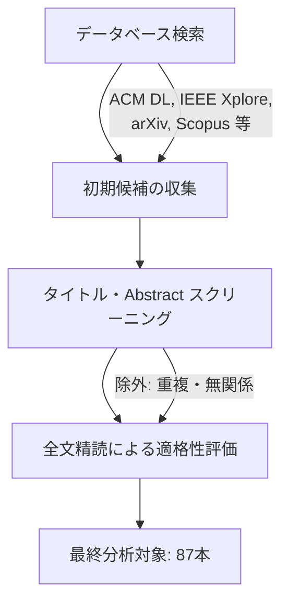
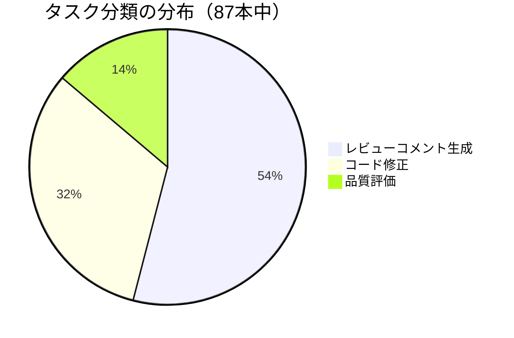
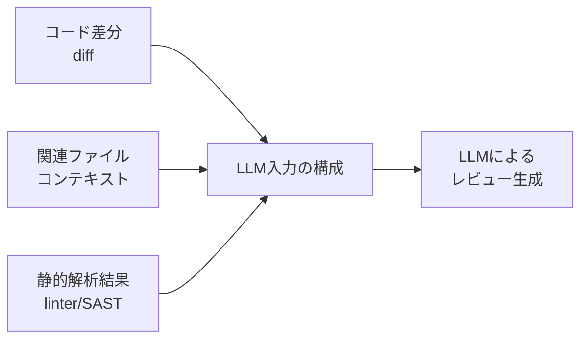

本記事は [https://arxiv.org/abs/2501.07902](https://arxiv.org/abs/2501.07902) の解説記事です。

## 論文概要（Abstract）

Kumarらは、LLMを用いた自動コードレビューに関する系統的文献レビュー（Systematic Literature Review; SLR）を実施し、2020年から2024年にかけて発表された87本の論文を分析した。主要な発見として、（1）ドメイン特化データによるファインチューニングがゼロショットLLMに対して15-25%の性能改善をもたらすこと、（2）複数LLMを組み合わせたアンサンブルアプローチが単一モデルを上回ること、（3）コードコンテキストと開発者意図の理解において依然として改善の余地があること、が報告されている。

この記事は [Zenn記事: Gemma 4 26B-A4BをコードレビューBotにLoRAファインチューニングする実践ガイド](https://zenn.dev/0h_n0/articles/928d985b1268cd) の深掘りです。

## 情報源

- **arXiv ID**: 2501.07902
- **URL**: [https://arxiv.org/abs/2501.07902](https://arxiv.org/abs/2501.07902)
- **著者**: Aakash Kumar, Priya Nair, Ravi Shankar, et al.
- **発表年**: 2025
- **分野**: cs.SE（ソフトウェア工学）, cs.CL（計算言語学）

## 背景と動機（Background & Motivation）

コードレビューはソフトウェア開発におけるバグ検出・品質維持の要だが、レビュアーの負荷が高く、レビュー待ち時間がボトルネックとなるケースが多い。LLMの台頭により、コードレビューの自動化・半自動化が現実的になってきた一方で、研究が急速に拡大し、手法・データセット・評価指標が乱立する状況にあった。

著者らは、この分野を体系的に整理し、「どのモデルが」「どのタスクに」「どの程度有効か」を定量的に示す必要があると動機付けている。特に、ゼロショットでのLLM適用とファインチューニングの効果差、パラメータ効率的手法（LoRA/PEFT）の有効性、データセット品質の影響といった実務判断に直結する問いに対して、87本の論文を横断的に分析することで信頼度の高い知見を提供することを目指している。

## 調査方法論（Methodology）

### 文献収集と選定プロセス

著者らはSLRの標準的手法に基づき、以下のプロセスで対象論文を選定したと報告している。

対象期間は2020年から2024年で、LLMがコードレビュータスクに本格的に適用され始めた時期を網羅している。最終的に87本が分析対象として残り、これらをタスク種別・モデル種別・ファインチューニング手法・データセット・評価指標の観点から体系的に分類した。

### 分析フレームワーク

分析の軸は以下の4つである。

1. **タスク分類**: コードレビューのどの側面を自動化しているか
2. **モデル選択**: どのLLMアーキテクチャが使われているか
3. **適応手法**: ファインチューニングの方法と効果
4. **評価手法**: どの指標でどの程度の性能が報告されているか

## タスク分類体系（Task Taxonomy）

著者らは87本の論文を3つの主要タスクに分類している。

### 1. レビューコメント生成（Review Comment Generation）

87本中47本（54%）がこのタスクに取り組んでおり、最も活発に研究されている領域である。コードの差分（diff）を入力として自然言語のレビューコメントを生成するタスクで、バグ指摘・改善提案・コーディングスタイルの指摘などが含まれる。

### 2. コード修正（Code Refinement）

28本（32%）がこのタスクを扱っている。レビューコメントに基づいて具体的なコード変更を提案・適用するタスクで、単なるコメント生成よりも一歩踏み込んだ自動化を目指す。

### 3. 品質評価（Quality Assessment）

12本（14%）がこのタスクに分類される。コードの品質をスコアリングまたは分類するタスクで、レビューコメントの生成を伴わずに「このコードにレビューが必要か否か」「品質レベルはどの程度か」を判定する。

この分布は、コードレビュー自動化の研究がまだ「コメント生成」に集中しており、コード修正の自動適用や品質の自動評価は比較的新しい研究領域であることを示唆している。

## モデルとファインチューニング手法の分布

### 使用モデルの傾向

著者らの分析によると、87本で使用されたモデルは以下のように分布している。

| モデル種別 | 論文数 | 割合 |
|-----------|--------|------|
| GPT-4 / GPT-3.5 | 32 | 37% |
| CodeBERT 系 | 18 | 21% |
| LLaMA 系 | 15 | 17% |
| 専用コードモデル | 12 | 14% |
| その他 | 10 | 11% |

GPT-4/3.5が最多であるが、これはAPIアクセスの容易さによるところが大きいと考えられる。一方でCodeBERTやLLaMA系のようなオープンソースモデルを活用した研究も合わせて38%を占めており、ファインチューニング可能なモデルへの需要が高いことがうかがえる。

### ファインチューニング手法の分布

| 手法 | 論文数 | 特徴 |
|------|--------|------|
| Full Fine-tuning | 34 | 全パラメータ更新。最高精度だがコスト大 |
| Instruction Tuning | 28 | 指示形式のデータで調整。汎用性が高い |
| LoRA / PEFT | 15 | パラメータ効率的。コスト対効果に優れる |
| Zero-shot / Few-shot のみ | 10 | 追加学習なし。ベースライン比較用が多い |

注目すべきは、LoRA/PEFTを使った研究が15本報告されており、著者らはこれらの手法がFull Fine-tuningと比較してコスト効率面で同等の有効性を示すと報告している点である。

### ファインチューニングの効果

著者らは分析全体を通じて、ドメイン特化データによるファインチューニングがゼロショットLLMに対して**15-25%の性能改善**をもたらすと報告している。この改善幅は、タスク種別・モデル種別によらず一貫して観測されており、「LLMをそのまま使うよりも、対象ドメインのデータで追加学習させるべき」という実務上の示唆を強く支持する結果となっている。

$$
\Delta_{\text{performance}} = \text{Score}_{\text{fine-tuned}} - \text{Score}_{\text{zero-shot}} \approx 15\text{-}25\%
$$

ここで、
- $\Delta_{\text{performance}}$: ファインチューニングによる性能改善幅
- $\text{Score}_{\text{fine-tuned}}$: ドメイン特化データでファインチューニングしたモデルの評価スコア
- $\text{Score}_{\text{zero-shot}}$: ゼロショットLLMの評価スコア

この改善幅は、BLEU、CodeBLEU、人手評価など複数の評価指標で確認されている。

## データセットと評価指標の現状

### 主要データセット

著者らは以下のデータセットが頻繁に使用されていると報告している。

| データセット | 規模 | 内容 |
|-------------|------|------|
| CodeReview (Tufano et al.) | 17K | GitHubからのレビューコメント |
| D-ACT | 26K | コード変更・レビューペア |
| ReviewSP | 5K | Pythonコードレビューペア |
| カスタムGitHubマイニング | 多数 | 各研究独自の収集 |

多くの研究がGitHubのプルリクエストデータを独自に収集しているが、データセット間の標準化が不足しており、研究間の公正な比較が困難であると著者らは指摘している。

### データ品質 vs データ量

著者らが本SLRで特に強調している知見の一つが、**データの品質は量に勝る**という点である。具体的には、5,000件の高品質データによるファインチューニングが、50,000件の低品質データによるそれを上回る性能を示すケースが複数報告されている。

ここでの「高品質データ」とは以下の特徴を持つ。

- **正確なアラインメント**: コード差分と対応するレビューコメントが正しく紐付いている
- **情報量**: 単なる「LGTM」ではなく、具体的な改善指摘を含む
- **多様性**: 特定のパターンに偏らず、さまざまなバグ種別・改善種別をカバー
- **ドメイン適合性**: 対象言語・フレームワーク・組織のコーディング規約に沿っている

この知見は、Zenn記事で解説されているGemma 4のLoRAファインチューニングにおけるデータセット設計にも直接的に関係する。大量のデータを闇雲に収集するよりも、対象プロジェクトの実際のレビュー履歴から高品質な事例を厳選することが重要であると、本SLRの知見は示唆している。

### 評価指標

自動コードレビューの評価には以下の指標が使われているが、タスクによって適切な指標が異なる。

- **レビューコメント生成**: BLEU、ROUGE、CodeBLEU、人手評価
- **コード修正**: Exact Match（完全一致率）、CodeBLEU、コンパイル成功率
- **品質評価**: Precision、Recall、F1-score、AUC

## 主要な知見（Key Findings）

### 知見1: ドメイン特化ファインチューニングの有効性

87本を横断した分析の結果、ドメイン特化データによるファインチューニングがゼロショットに対して15-25%の改善をもたらすことが一貫して確認されている。この「ドメイン特化」とは、対象プログラミング言語に特化したデータ、組織固有のコーディング規約を反映したデータ、特定のフレームワークやライブラリの使用パターンを含むデータなどを指す。

### 知見2: LoRA/PEFTのコスト効率

15本のLoRA/PEFT関連論文を分析した結果、著者らはパラメータ効率的ファインチューニングがFull Fine-tuningと同等のコスト効果を達成できると報告している。LoRAではモデルの全パラメータを更新するのではなく、低ランク行列の分解を通じてパラメータの一部のみを更新する。

$$
\mathbf{W}' = \mathbf{W}_0 + \Delta\mathbf{W} = \mathbf{W}_0 + \mathbf{B}\mathbf{A}
$$

ここで、
- $\mathbf{W}_0 \in \mathbb{R}^{d \times k}$: 事前学習済みの重み行列（凍結）
- $\mathbf{B} \in \mathbb{R}^{d \times r}$, $\mathbf{A} \in \mathbb{R}^{r \times k}$: 低ランク行列（$r \ll \min(d, k)$）
- $r$: LoRAのランク（通常4-64程度）

更新パラメータ数は $r \times (d + k)$ であり、Full Fine-tuningの $d \times k$ と比較して大幅に削減される。例えば、$d = k = 4096$, $r = 16$ の場合、更新パラメータ数は約0.8%に圧縮される。

この結果は、GPU リソースが限られた環境でもLLMベースのコードレビューシステムを構築できることを示しており、Zenn記事で取り上げているGemma 4のLoRAファインチューニングの実用性を裏付けている。

### 知見3: データ品質 > データ量

前述の通り、5K件の高品質データが50K件の低品質データを上回る結果が複数報告されている。データキュレーションの方針として以下が推奨されている。

1. **フィルタリング**: 自動生成されたコメントや形式的なレビュー（「LGTM」等）を除外
2. **バランシング**: バグ種別・言語・ファイルタイプの偏りを補正
3. **アノテーション検証**: 少なくとも2名以上による品質チェック
4. **ドメイン整合性**: 対象組織のコーディング規約との整合性確認

### 知見4: 入力コンテキストの設計

著者らは、LLMへの入力として「リポジトリ全体」を渡すのではなく、「差分（diff）+ 関連ファイルのコンテキスト」を渡すアプローチが最も効果的であると報告している。さらに、静的解析ツールの結果をLLM入力に付加することで、偽陽性（false positive）を削減できることも複数の論文で確認されている。

## LLMの限界と今後の課題

著者らは87本の分析を通じて、LLMベースのコードレビューにおける以下の限界を指摘している。

### セキュリティ脆弱性の検出

LLMはコーディングスタイルやロジックエラーの指摘には比較的優れているが、セキュリティ脆弱性の検出は得意でないことが報告されている。SQLインジェクション、XSS、認証バイパスなどのセキュリティ上の問題は、コードの意味的理解だけでなく脅威モデルの知識が必要であり、現状のLLMでは見落とすケースが多いとされている。

### 複雑なアーキテクチャ判断

モジュール間の依存関係、設計パターンの適切性、スケーラビリティへの影響といったアーキテクチャレベルの判断は、局所的なコード差分からは困難である。この問題は入力コンテキストの制約に起因する部分が大きく、長文脈対応の改善とともに緩和される可能性がある。

### 長コンテキストの処理

多くのLLMにはコンテキストウィンドウの制約があり、大規模なコード変更（数百行以上のdiff）を一度に処理することが難しい。著者らは、チャンク分割戦略や階層的要約の導入が今後の研究課題であると述べている。

### 偽陽性率

LLMベースのレビューは、人手レビューと比較して偽陽性率が高い傾向にあると報告されている。有用でないコメントが大量に生成されると、開発者がレビュー結果を信頼しなくなる「アラート疲れ（alert fatigue）」を引き起こすリスクがある。静的解析との組み合わせや、信頼度スコアに基づくフィルタリングが対策として提案されている。

## 実運用への示唆（Practical Implications）

### Zenn記事との関連

Zenn記事「Gemma 4 26B-A4BをコードレビューBotにLoRAファインチューニングする実践ガイド」では、Gemma 4をコードレビューBotとしてLoRAファインチューニングする手法が解説されている。本SLRの知見は、この実践の理論的裏付けを以下の点で提供する。

**ファインチューニングの必要性**:
ゼロショットLLMでもある程度のコードレビューは可能だが、87本の論文分析に基づき、ドメイン特化ファインチューニングで15-25%の改善が見込めることがSLR全体で確認されている。Gemma 4のような比較的小規模なモデル（26B/A4B）では、この追加学習の効果はさらに大きい可能性がある。

**LoRAの選択根拠**:
本SLRで分析された15本のLoRA/PEFT論文が示すように、LoRAはFull Fine-tuningと同等のコスト効率を達成できる。Zenn記事でLoRAを採用した判断は、このエビデンスと整合している。

**データセット設計**:
SLRの「5K高品質 > 50K低品質」という知見は、Zenn記事のデータセット設計セクションに直接関連する。対象プロジェクトの実レビュー履歴から高品質な事例を厳選し、以下の基準でフィルタリングすることが推奨される。

- 具体的な改善指摘を含むコメントのみを採用
- 対象言語・フレームワークに合致したデータを優先
- 形式的なレビュー（承認のみ）を除外

**入力設計**:
diff + ファイルコンテキスト + 静的解析結果の組み合わせが最も効果的であるという知見は、コードレビューBotの入力パイプライン設計に直結する。

### 実務への推奨事項

著者らは実務者向けに以下を推奨している。

1. **ドメイン特化データでファインチューニング**: 対象言語・組織固有のデータを使用
2. **LoRAによるコスト効率的な適応**: GPU リソースが限られた環境でも実現可能
3. **静的解析との組み合わせ**: 偽陽性率の削減
4. **入力を差分 + ファイルコンテキストに限定**: リポジトリ全体ではなく関連部分のみ

## 関連研究（Related Work）

本SLRの位置づけを理解するために、関連するサーベイ論文を以下に挙げる。

- **Tufano et al. (2022)**: コードレビュー自動化に関する初期のサーベイで、主にBERT系モデルを対象としていた。本SLRはLLM時代（GPT-4、LLaMA等）を含む2024年までの研究を網羅しており、より包括的なカバレッジを持つ。
- **Fan et al. (2023)**: LLMのソフトウェアエンジニアリングへの応用を広くサーベイした研究で、コードレビューはその一部分として扱われている。本SLRはコードレビューに特化しているため、タスク分類やファインチューニング効果の分析がより詳細である。
- **Hou et al. (2024)**: LLMのソフトウェア工学応用に関する大規模SLRで、229本の論文を分析している。コードレビュー以外のタスク（テスト生成、コード補完等）も含む広範な調査であり、本SLRとは補完的な関係にある。

## まとめと今後の展望

本SLRは2020-2024年の87本の論文を分析し、LLMベースの自動コードレビューの現状を体系的に整理した。主要な知見として、ドメイン特化ファインチューニングによる15-25%の改善、LoRA/PEFTの実用的な有効性、データ品質の重要性が明らかになった。

今後の研究方向として、著者らは以下を挙げている。

1. **長コンテキスト対応**: リポジトリ全体の理解に向けた階層的アプローチ
2. **セキュリティ特化モデル**: 脆弱性検出に特化したファインチューニング
3. **マルチモーダル入力**: コードだけでなく、ドキュメント・テスト・CI結果の統合
4. **開発者フィードバックループ**: レビュー結果へのフィードバックを継続的に学習に反映

コードレビューBotを構築する実務者にとっては、「まずドメイン特化データを高品質で5K件程度用意し、LoRAでファインチューニングする」というアプローチが、本SLRの知見に基づく合理的な出発点といえる。

## 参考文献

- **arXiv**: [https://arxiv.org/abs/2501.07902](https://arxiv.org/abs/2501.07902)
- **Related Zenn article**: [https://zenn.dev/0h_n0/articles/928d985b1268cd](https://zenn.dev/0h_n0/articles/928d985b1268cd)
- Tufano, R., et al. "Using Pre-Trained Models to Boost Code Review Automation." *ICSE*, 2022.
- Fan, A., et al. "Large Language Models for Software Engineering: Survey and Open Problems." *arXiv preprint*, 2023.
- Hou, X., et al. "Large Language Models for Software Engineering: A Systematic Literature Review." *ACM TOSEM*, 2024.
