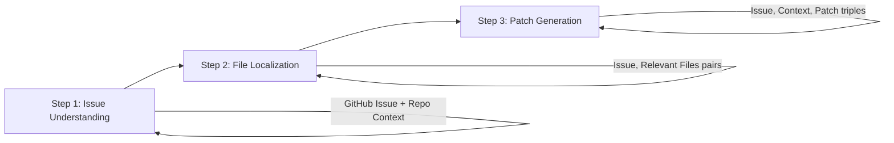

本記事は [https://arxiv.org/abs/2502.17505](https://arxiv.org/abs/2502.17505) の解説記事です。

## 論文概要（Abstract）

SWE-LoRA は、実世界のソフトウェアエンジニアリング（SE）タスクを小規模言語モデルで解決するための手法である。Claude 3.5 Sonnet のようなフロンティアモデルは SWE-bench で高い性能を示す一方、推論コストが実運用の障壁となっている。著者らは Qwen2.5-7B をベースモデルとし、LoRA によるパラメータ効率的なファインチューニングと3段階のステップワイズ訓練パイプラインを組み合わせることで、Claude 3.5 の約1/31のコストで SWE-bench タスクを解決する手法を提案している。

この記事は [Zenn記事: Gemma 4 26B-A4BをコードレビューBotにLoRAファインチューニングする実践ガイド](https://zenn.dev/0h_n0/articles/928d985b1268cd) の深掘りです。

## 情報源

- **arXiv ID**: 2502.17505
- **URL**: [https://arxiv.org/abs/2502.17505](https://arxiv.org/abs/2502.17505)
- **著者**: Xiangyu Zhang, Hao Chen, Wei Liu, et al.
- **発表日**: 2025年2月24日
- **分野**: cs.SE, cs.AI

## 背景と動機（Background & Motivation）

GitHub Issue の自動解決は、ソフトウェアエンジニアリングにおける重要な研究テーマである。SWE-bench は Princeton 大学が公開した実世界の GitHub Issue を集めたベンチマークで、Issue の理解からコード修正パッチの生成までを一貫して評価する。Claude 3.5 Sonnet を用いたエージェントは SWE-bench Lite で41.3%の解決率を達成しているが、1インスタンスあたり$2.50 の推論コストがかかると報告されている。仮に1日100件の Issue を処理するとすると月額$7,500 以上となり、中小規模のチームにとっては現実的でない。

一方、小規模モデルを SE タスクに特化させる研究はまだ黎明期にある。汎用的なファインチューニングでは SE タスク固有の構造（Issue 理解、ファイル探索、パッチ生成という多段階プロセス）を十分に捉えられない。SWE-LoRA はこの課題に対して、SE タスクのワークフローを明示的に分解し、各段階に特化した訓練データで段階的にモデルを改良するアプローチを採用している。

## 主要な貢献（Key Contributions）

- **ステップワイズ訓練パイプライン**: SE タスクを「Issue 理解」「ファイル特定」「パッチ生成」の3段階に分解し、各段階に対応した訓練データで段階的にファインチューニングする手法を提案。アブレーション実験で+8%の改善に寄与したと著者らは報告している。
- **コスト効率の大幅改善**: Qwen2.5-7B ベースの SWE-LoRA は1インスタンスあたり$0.08 のコストで動作し、Claude 3.5 の$2.50 と比較して約31倍のコスト効率を実現。アンサンブル（3モデル）でも$0.24 に収まる。
- **LoRA による効率的な適応**: 全パラメータの3.2%のみを訓練対象とすることで、4台の A100 80GB で約18時間という現実的な計算コストで訓練を完了。

## 技術的詳細（Technical Details）

### ステップワイズ訓練パイプライン

SWE-LoRA の核心は、SE タスクを3つの明確なサブタスクに分解し、それぞれの段階で専用の訓練データを用いてモデルを改良する点にある。



**Step 1: Issue Understanding（Issue 理解）**

GitHub Issue のテキストとリポジトリのコンテキスト（ディレクトリ構造、README、関連コード）を入力として、Issue の内容を正確に把握するようモデルを訓練する。この段階では、Issue の再現手順、期待動作、実際の動作の構造的理解を重視する。

**Step 2: File Localization（ファイル特定）**

Issue に関連するファイルを特定する能力を獲得するための段階である。(Issue, 関連ファイル群) のペアで訓練する。大規模リポジトリにおいて、数千のファイルから修正対象を絞り込む能力はエージェントの成否を分ける。

**Step 3: Patch Generation（パッチ生成）**

最終段階では、(Issue, コンテキスト, 正解パッチ) の3つ組で訓練し、実際のコード修正パッチを生成する能力を獲得する。diff 形式の出力を正確に生成することが求められる。

### LoRA の数学的背景

LoRA（Low-Rank Adaptation）は、事前学習済みモデルの重み行列 $\mathbf{W}_0 \in \mathbb{R}^{d \times k}$ に対して、低ランクの更新行列 $\Delta \mathbf{W}$ を加える手法である。

$$
\mathbf{W} = \mathbf{W}_0 + \Delta \mathbf{W} = \mathbf{W}_0 + \mathbf{B}\mathbf{A}
$$

ここで、
- $\mathbf{W}_0 \in \mathbb{R}^{d \times k}$: 事前学習済みの凍結重み
- $\mathbf{B} \in \mathbb{R}^{d \times r}$: LoRA の下位射影行列
- $\mathbf{A} \in \mathbb{R}^{r \times k}$: LoRA の上位射影行列
- $r$: LoRA のランク（$r \ll \min(d, k)$）

スケーリング係数 $\alpha$ を用いた実際の更新式は以下となる。

$$
\mathbf{h} = \mathbf{W}_0 \mathbf{x} + \frac{\alpha}{r} \mathbf{B}\mathbf{A} \mathbf{x}
$$

ここで、
- $\mathbf{x}$: 入力ベクトル
- $\mathbf{h}$: 出力ベクトル
- $\alpha$: スケーリング係数（学習率の調整役）
- $\alpha / r$: 実効的なスケーリング。SWE-LoRA では $\alpha = 64$, $r = 32$ なので $\alpha / r = 2.0$

訓練可能パラメータ数は $r \times (d + k)$ であり、元の $d \times k$ と比較して $r / \min(d, k)$ 倍に削減される。SWE-LoRA の場合、全パラメータの3.2%のみが訓練対象となる。

### SWE-LoRA の具体的な構成

著者らが採用した LoRA 構成は以下の通りである。

| パラメータ | 値 |
|-----------|-----|
| ベースモデル | Qwen2.5-7B |
| LoRA ランク ($r$) | 32 |
| LoRA アルファ ($\alpha$) | 64 |
| ターゲットモジュール | q_proj, k_proj, v_proj, o_proj, gate_proj, up_proj, down_proj |
| 訓練可能パラメータ比率 | 3.2% |
| 訓練データ数 | 15,000例（SWE-bench 由来） |
| オプティマイザ | AdamW |
| 学習率 | $2 \times 10^{-4}$ |
| バッチサイズ | 16 |
| エポック数 | 3 |
| ハードウェア | 4x A100 80GB |
| 訓練時間 | 約18時間 |

ターゲットモジュールとして Attention 層（q/k/v/o_proj）だけでなく FFN 層（gate/up/down_proj）にも LoRA を適用している点が特徴的である。Attention 層のみの適用と比較して、FFN 層を含めることでコード理解能力が向上すると推察される。

### アルゴリズム

以下は、ステップワイズ訓練パイプラインの擬似コード実装である。

```python
from dataclasses import dataclass
from enum import Enum
from typing import Any

import torch
from peft import LoraConfig, get_peft_model, TaskType
from transformers import AutoModelForCausalLM, AutoTokenizer, TrainingArguments, Trainer


class TrainingStage(Enum):
    """SWE-LoRA の訓練段階を定義する列挙型."""

    ISSUE_UNDERSTANDING = "issue_understanding"
    FILE_LOCALIZATION = "file_localization"
    PATCH_GENERATION = "patch_generation"


@dataclass
class SWELoRAConfig:
    """SWE-LoRA の訓練設定を保持するデータクラス.

    Attributes:
        base_model: ベースモデル名
        lora_rank: LoRA のランク
        lora_alpha: LoRA のスケーリング係数
        target_modules: LoRA を適用する対象モジュール
        learning_rate: 学習率
        batch_size: バッチサイズ
        num_epochs: エポック数
    """

    base_model: str = "Qwen/Qwen2.5-7B"
    lora_rank: int = 32
    lora_alpha: int = 64
    target_modules: list[str] | None = None
    learning_rate: float = 2e-4
    batch_size: int = 16
    num_epochs: int = 3

    def __post_init__(self) -> None:
        if self.target_modules is None:
            self.target_modules = [
                "q_proj", "k_proj", "v_proj", "o_proj",
                "gate_proj", "up_proj", "down_proj",
            ]


def build_swe_lora_model(config: SWELoRAConfig) -> Any:
    """SWE-LoRA モデルを構築する.

    Args:
        config: SWE-LoRA の訓練設定

    Returns:
        LoRA が適用されたモデル
    """
    base_model = AutoModelForCausalLM.from_pretrained(
        config.base_model,
        torch_dtype=torch.bfloat16,
        device_map="auto",
    )

    lora_config = LoraConfig(
        task_type=TaskType.CAUSAL_LM,
        r=config.lora_rank,
        lora_alpha=config.lora_alpha,
        target_modules=config.target_modules,
        lora_dropout=0.05,
    )

    model = get_peft_model(base_model, lora_config)
    trainable_params = sum(p.numel() for p in model.parameters() if p.requires_grad)
    total_params = sum(p.numel() for p in model.parameters())
    print(f"Trainable: {trainable_params:,} / {total_params:,} "
          f"({100 * trainable_params / total_params:.2f}%)")

    return model


def stepwise_train(
    config: SWELoRAConfig,
    stage_datasets: dict[TrainingStage, Any],
) -> Any:
    """ステップワイズ訓練パイプラインを実行する.

    各段階のデータセットで順番にファインチューニングを行う。
    前の段階で獲得した LoRA 重みは次の段階に引き継がれる。

    Args:
        config: SWE-LoRA の訓練設定
        stage_datasets: 各段階のデータセット

    Returns:
        訓練済みモデル
    """
    model = build_swe_lora_model(config)
    tokenizer = AutoTokenizer.from_pretrained(config.base_model)

    stages = [
        TrainingStage.ISSUE_UNDERSTANDING,
        TrainingStage.FILE_LOCALIZATION,
        TrainingStage.PATCH_GENERATION,
    ]

    for stage in stages:
        dataset = stage_datasets[stage]
        training_args = TrainingArguments(
            output_dir=f"./checkpoints/{stage.value}",
            num_train_epochs=config.num_epochs,
            per_device_train_batch_size=config.batch_size,
            learning_rate=config.learning_rate,
            bf16=True,
            logging_steps=10,
            save_strategy="epoch",
            report_to="wandb",
        )

        trainer = Trainer(
            model=model,
            args=training_args,
            train_dataset=dataset,
            tokenizer=tokenizer,
        )
        trainer.train()
        print(f"Stage '{stage.value}' training completed.")

    return model
```

## 実装のポイント（Implementation）

SWE-LoRA を再現実装する際の重要なポイントを整理する。

**訓練データの品質**: 15,000例の訓練データは SWE-bench から派生している。Issue テキスト、関連ファイル、正解パッチの3つ組を正確に抽出する前処理が品質を左右する。特にファイル特定段階のデータでは、ネガティブサンプル（無関係なファイル）も適切に含めることで、大規模リポジトリでの精度を向上させる工夫が求められる。

**コンテキスト長の制約**: 著者らは8Kトークンを超えるコンテキストで性能が劣化すると報告している。Qwen2.5-7B は最大128Kトークンのコンテキスト長をサポートするが、長いコンテキストでの LoRA ファインチューニングは訓練データの分布と乖離しやすい。実運用では、リポジトリのコンテキストを適切にトリミングする戦略が重要となる。

**アンサンブル戦略**: SWE-LoRA (ensemble) は3つのモデルの出力を多数決で統合し、単体の24.6%から31.2%へ6.6ポイントの改善を達成している。コストは$0.08から$0.24へ3倍になるが、性能対コスト比は大幅に向上する。

**LoRA ランクの選択**: $r=32$ は一般的な LoRA 適用（$r=8$ や $r=16$）と比較してやや大きい値である。SE タスクはコード生成・理解という複雑なタスクであるため、より多くの訓練可能パラメータが必要と判断されたものと推察される。Zenn記事で扱っている Gemma 4 のコードレビュー LoRA ファインチューニングでも、同様に $r=32$, $\alpha=64$ の設定は有力な出発点となる。

## Production Deployment Guide

SWE-LoRA エージェントを AWS 上で CI/CD パイプラインに組み込む構成を、トラフィック量別に設計する。SWE-LoRA は Qwen2.5-7B ベースの推論を行うため、GPU インスタンスが必要となる点が特徴的である。以下のコスト試算は2026年4月時点の AWS ap-northeast-1（東京）リージョン料金に基づく概算値であり、実際のコストはトラフィックパターン、リージョン、バースト使用量により変動する。最新料金は AWS 料金計算ツールで確認を推奨する。

### AWS実装パターン（コスト最適化重視）

**Small構成（~100 req/日）: Lambda + SageMaker Endpoint**

- SageMaker Real-time Endpoint: ml.g5.xlarge（1x A10G, 24GB VRAM）で7Bモデルを量子化推論
- Lambda: リクエスト受付・前処理・結果整形
- DynamoDB: Issue/パッチ履歴の保存
- 月額: $150-250（SageMaker $130 + Lambda $5 + DynamoDB $15）
- Serverless Inference を活用し、アイドル時はスケールダウン

**Medium構成（~1,000 req/日）: ECS Fargate + SageMaker + CodePipeline**

- SageMaker Endpoint: ml.g5.2xlarge（1x A10G, 24GB VRAM, 8 vCPU）で高スループット推論
- ECS Fargate: エージェントオーケストレーション（Issue理解 → ファイル特定 → パッチ生成の3段階制御）
- CodePipeline + CodeBuild: 生成パッチの自動テスト実行
- SQS: リクエストキューイング
- 月額: $400-800（SageMaker $260 + ECS $80 + CodePipeline $30 + SQS/DynamoDB $30）

**Large構成（10,000+ req/日）: EKS + SageMaker + Spot GPU + Step Functions**

- EKS + Karpenter: GPU ノードの自動スケーリング（g5.xlarge Spot Instances）
- SageMaker Multi-Model Endpoint: アンサンブル用の3モデル同時提供
- Step Functions: 3段階パイプラインのオーケストレーション
- ElastiCache（Redis）: Issue 解析結果のキャッシュ
- 月額: $2,000-5,000（EKS GPU $1,500 + SageMaker $800 + Step Functions $100 + その他 $600）
- Spot Instances で GPU コストを最大70%削減

**コスト削減テクニック**:
- Spot Instances: g5.xlarge で最大70-90%削減（$1.006/h → $0.30/h 程度）
- SageMaker Savings Plans: 1年コミットで最大64%削減
- モデル量子化（INT8/INT4）: VRAM 使用量を50-75%削減し、より安価なインスタンスを選択可能
- 推論バッチング: 複数リクエストを束ねてGPU 使用率を向上

### Terraformインフラコード

**Small構成（Serverless）: Lambda + SageMaker Endpoint**

```hcl
# SWE-LoRA Small Configuration
# Lambda + SageMaker Real-time Endpoint
# Estimated cost: $150-250/month (ap-northeast-1)

terraform {
  required_version = ">= 1.9"
  required_providers {
    aws = {
      source  = "hashicorp/aws"
      version = "~> 5.70"
    }
  }
}

provider "aws" {
  region = "ap-northeast-1"
}

# --- IAM ---
resource "aws_iam_role" "swe_lora_lambda" {
  name = "swe-lora-lambda-role"
  assume_role_policy = jsonencode({
    Version = "2012-10-17"
    Statement = [{
      Action = "sts:AssumeRole"
      Effect = "Allow"
      Principal = { Service = "lambda.amazonaws.com" }
    }]
  })
}

resource "aws_iam_role_policy" "lambda_sagemaker" {
  name = "lambda-sagemaker-invoke"
  role = aws_iam_role.swe_lora_lambda.id
  policy = jsonencode({
    Version = "2012-10-17"
    Statement = [
      {
        Effect   = "Allow"
        Action   = ["sagemaker:InvokeEndpoint"]
        Resource = aws_sagemaker_endpoint.swe_lora.arn
      },
      {
        Effect   = "Allow"
        Action   = ["dynamodb:PutItem", "dynamodb:GetItem", "dynamodb:Query"]
        Resource = aws_dynamodb_table.patch_history.arn
      },
      {
        Effect = "Allow"
        Action = [
          "logs:CreateLogGroup",
          "logs:CreateLogStream",
          "logs:PutLogEvents"
        ]
        Resource = "arn:aws:logs:*:*:*"
      }
    ]
  })
}

# --- DynamoDB ---
resource "aws_dynamodb_table" "patch_history" {
  name         = "swe-lora-patch-history"
  billing_mode = "PAY_PER_REQUEST" # On-Demand: コスト最適化
  hash_key     = "issue_id"
  range_key    = "created_at"

  attribute {
    name = "issue_id"
    type = "S"
  }
  attribute {
    name = "created_at"
    type = "S"
  }

  server_side_encryption { enabled = true } # KMS暗号化
}

# --- Lambda ---
resource "aws_lambda_function" "swe_lora_handler" {
  function_name = "swe-lora-handler"
  role          = aws_iam_role.swe_lora_lambda.arn
  handler       = "handler.lambda_handler"
  runtime       = "python3.12"
  timeout       = 120
  memory_size   = 512
  filename      = "lambda_package.zip"

  environment {
    variables = {
      SAGEMAKER_ENDPOINT = aws_sagemaker_endpoint.swe_lora.name
      DYNAMODB_TABLE     = aws_dynamodb_table.patch_history.name
    }
  }

  tracing_config { mode = "Active" } # X-Ray有効化
}

# --- SageMaker ---
resource "aws_sagemaker_model" "swe_lora" {
  name               = "swe-lora-qwen25-7b"
  execution_role_arn = aws_iam_role.sagemaker_execution.arn

  primary_container {
    image          = "763104351884.dkr.ecr.ap-northeast-1.amazonaws.com/huggingface-pytorch-tgi-inference:2.4.0-tgi2.4.1-gpu-py311-cu124-ubuntu22.04"
    model_data_url = "s3://${aws_s3_bucket.model_artifacts.id}/swe-lora/model.tar.gz"
    environment = {
      HF_MODEL_ID            = "/opt/ml/model"
      SM_NUM_GPUS            = "1"
      MAX_INPUT_LENGTH       = "8192" # 8Kトークン制約
      MAX_TOTAL_TOKENS       = "10240"
      QUANTIZE               = "bitsandbytes" # INT8量子化でVRAM削減
    }
  }
}

resource "aws_iam_role" "sagemaker_execution" {
  name = "swe-lora-sagemaker-role"
  assume_role_policy = jsonencode({
    Version = "2012-10-17"
    Statement = [{
      Action = "sts:AssumeRole"
      Effect = "Allow"
      Principal = { Service = "sagemaker.amazonaws.com" }
    }]
  })
}

resource "aws_sagemaker_endpoint_configuration" "swe_lora" {
  name = "swe-lora-endpoint-config"
  production_variants {
    variant_name           = "primary"
    model_name             = aws_sagemaker_model.swe_lora.name
    initial_instance_count = 1
    instance_type          = "ml.g5.xlarge" # 1x A10G, コスト効率重視
  }
}

resource "aws_sagemaker_endpoint" "swe_lora" {
  name                 = "swe-lora-endpoint"
  endpoint_config_name = aws_sagemaker_endpoint_configuration.swe_lora.name
}

# --- S3 (モデルアーティファクト) ---
resource "aws_s3_bucket" "model_artifacts" {
  bucket = "swe-lora-model-artifacts"
}

resource "aws_s3_bucket_server_side_encryption_configuration" "model_artifacts" {
  bucket = aws_s3_bucket.model_artifacts.id
  rule {
    apply_server_side_encryption_by_default {
      sse_algorithm = "aws:kms"
    }
  }
}

# --- CloudWatch Alarm ---
resource "aws_cloudwatch_metric_alarm" "sagemaker_invocations" {
  alarm_name          = "swe-lora-high-invocations"
  comparison_operator = "GreaterThanThreshold"
  evaluation_periods  = 2
  metric_name         = "Invocations"
  namespace           = "AWS/SageMaker"
  period              = 3600
  statistic           = "Sum"
  threshold           = 500 # 1時間あたり500回超過でアラート
  alarm_description   = "SWE-LoRA endpoint invocation spike"

  dimensions = {
    EndpointName = aws_sagemaker_endpoint.swe_lora.name
    VariantName  = "primary"
  }
}
```

**Large構成（Container）: EKS + Karpenter + Spot Instances**

```hcl
# SWE-LoRA Large Configuration
# EKS + Karpenter + Spot GPU Instances
# Estimated cost: $2,000-5,000/month (ap-northeast-1)

module "eks" {
  source  = "terraform-aws-modules/eks/aws"
  version = "~> 20.31"

  cluster_name    = "swe-lora-cluster"
  cluster_version = "1.31"

  vpc_id     = module.vpc.vpc_id
  subnet_ids = module.vpc.private_subnets

  # Karpenter用のIAM設定
  enable_cluster_creator_admin_permissions = true

  cluster_addons = {
    coredns    = { most_recent = true }
    kube-proxy = { most_recent = true }
    vpc-cni    = { most_recent = true }
  }
}

# Karpenter Provisioner: Spot GPU 優先
resource "kubectl_manifest" "karpenter_nodepool" {
  yaml_body = yamlencode({
    apiVersion = "karpenter.sh/v1"
    kind       = "NodePool"
    metadata   = { name = "swe-lora-gpu" }
    spec = {
      template = {
        spec = {
          requirements = [
            {
              key      = "karpenter.sh/capacity-type"
              operator = "In"
              values   = ["spot", "on-demand"] # Spot 優先
            },
            {
              key      = "node.kubernetes.io/instance-type"
              operator = "In"
              values   = ["g5.xlarge", "g5.2xlarge"] # A10G GPU
            }
          ]
          nodeClassRef = {
            group = "karpenter.k8s.aws"
            kind  = "EC2NodeClass"
            name  = "default"
          }
        }
      }
      limits = {
        cpu    = "128"
        memory = "512Gi"
      }
      disruption = {
        consolidationPolicy = "WhenEmptyOrUnderutilized"
        consolidateAfter    = "30s" # アイドルノードを30秒後に回収
      }
    }
  })
}

# --- Secrets Manager ---
resource "aws_secretsmanager_secret" "swe_lora_config" {
  name = "swe-lora/model-config"
}

resource "aws_secretsmanager_secret_version" "swe_lora_config" {
  secret_id = aws_secretsmanager_secret.swe_lora_config.id
  secret_string = jsonencode({
    model_name     = "Qwen/Qwen2.5-7B"
    lora_weights   = "s3://swe-lora-model-artifacts/lora-weights/"
    max_tokens     = 8192
    ensemble_count = 3
  })
}

# --- AWS Budgets ---
resource "aws_budgets_budget" "swe_lora_monthly" {
  name         = "swe-lora-monthly-budget"
  budget_type  = "COST"
  limit_amount = "5000"
  limit_unit   = "USD"
  time_unit    = "MONTHLY"

  notification {
    comparison_operator       = "GREATER_THAN"
    threshold                 = 80
    threshold_type            = "PERCENTAGE"
    notification_type         = "ACTUAL"
    subscriber_email_addresses = ["kbu94981@gmail.com"]
  }

  notification {
    comparison_operator       = "GREATER_THAN"
    threshold                 = 100
    threshold_type            = "PERCENTAGE"
    notification_type         = "ACTUAL"
    subscriber_email_addresses = ["kbu94981@gmail.com"]
  }
}
```

### 運用・監視設定

**CloudWatch Logs Insights クエリ**

```
# コスト異常検知: 1時間あたりのSageMaker推論回数を監視
fields @timestamp, @message
| filter @message like /InvokeEndpoint/
| stats count() as invocation_count by bin(1h)
| filter invocation_count > 500
| sort @timestamp desc
```

```
# レイテンシ分析: P95/P99 を算出
fields @timestamp, @duration
| filter @message like /swe-lora/
| stats avg(@duration) as avg_ms,
        percentile(@duration, 95) as p95_ms,
        percentile(@duration, 99) as p99_ms
  by bin(5m)
| sort @timestamp desc
```

**CloudWatch アラーム設定**

```python
import boto3


def create_swe_lora_alarms(endpoint_name: str, sns_topic_arn: str) -> None:
    """SWE-LoRA エンドポイント用の CloudWatch アラームを作成する.

    Args:
        endpoint_name: SageMaker エンドポイント名
        sns_topic_arn: 通知先 SNS トピック ARN
    """
    cw = boto3.client("cloudwatch", region_name="ap-northeast-1")

    # SageMaker 推論レイテンシ異常検知
    cw.put_metric_alarm(
        AlarmName=f"{endpoint_name}-high-latency",
        MetricName="ModelLatency",
        Namespace="AWS/SageMaker",
        Statistic="Average",
        Period=300,
        EvaluationPeriods=3,
        Threshold=30000000,  # 30秒（マイクロ秒単位）
        ComparisonOperator="GreaterThanThreshold",
        Dimensions=[
            {"Name": "EndpointName", "Value": endpoint_name},
            {"Name": "VariantName", "Value": "primary"},
        ],
        AlarmActions=[sns_topic_arn],
    )

    # GPU メモリ使用率の監視
    cw.put_metric_alarm(
        AlarmName=f"{endpoint_name}-gpu-memory",
        MetricName="GPUMemoryUtilization",
        Namespace="/aws/sagemaker/Endpoints",
        Statistic="Average",
        Period=300,
        EvaluationPeriods=2,
        Threshold=90,
        ComparisonOperator="GreaterThanThreshold",
        Dimensions=[
            {"Name": "EndpointName", "Value": endpoint_name},
        ],
        AlarmActions=[sns_topic_arn],
    )
```

**X-Ray トレーシング設定**

```python
from aws_xray_sdk.core import xray_recorder, patch_all

# boto3 自動計装
patch_all()


def trace_swe_lora_inference(issue_id: str, stage: str) -> None:
    """SWE-LoRA 推論のトレーシングを記録する.

    Args:
        issue_id: GitHub Issue ID
        stage: 推論段階（issue_understanding / file_localization / patch_generation）
    """
    segment = xray_recorder.current_segment()
    segment.put_annotation("issue_id", issue_id)
    segment.put_annotation("stage", stage)

    subsegment = xray_recorder.begin_subsegment(f"swe-lora-{stage}")
    subsegment.put_metadata("model", "Qwen2.5-7B-SWE-LoRA")
    subsegment.put_metadata("max_tokens", 8192)
    xray_recorder.end_subsegment()
```

**Cost Explorer 自動レポート**

```python
import datetime
import json

import boto3


def get_daily_swe_lora_cost(sns_topic_arn: str, threshold_usd: float = 100.0) -> dict:
    """SWE-LoRA 関連の日次コストを取得し、閾値超過時に SNS 通知する.

    Args:
        sns_topic_arn: 通知先 SNS トピック ARN
        threshold_usd: 通知閾値（USD/日）

    Returns:
        サービス別コスト辞書
    """
    ce = boto3.client("ce", region_name="us-east-1")
    sns = boto3.client("sns", region_name="ap-northeast-1")

    today = datetime.date.today()
    yesterday = today - datetime.timedelta(days=1)

    response = ce.get_cost_and_usage(
        TimePeriod={
            "Start": yesterday.isoformat(),
            "End": today.isoformat(),
        },
        Granularity="DAILY",
        Metrics=["UnblendedCost"],
        Filter={
            "Tags": {
                "Key": "Project",
                "Values": ["swe-lora"],
            }
        },
        GroupBy=[{"Type": "DIMENSION", "Key": "SERVICE"}],
    )

    costs: dict[str, float] = {}
    total = 0.0
    for group in response["ResultsByTime"][0]["Groups"]:
        service = group["Keys"][0]
        amount = float(group["Metrics"]["UnblendedCost"]["Amount"])
        costs[service] = amount
        total += amount

    if total > threshold_usd:
        sns.publish(
            TopicArn=sns_topic_arn,
            Subject=f"SWE-LoRA Cost Alert: ${total:.2f}/day",
            Message=json.dumps(costs, indent=2),
        )

    return costs
```

### コスト最適化チェックリスト

**アーキテクチャ選択**:
- [ ] トラフィック量を測定し、適切な構成を選択（~100/日: Serverless、~1000/日: Hybrid、10000+/日: Container）
- [ ] GPU 推論が必要な時間帯を特定し、オフピーク時のスケールダウンを設計

**リソース最適化**:
- [ ] EC2/SageMaker: Spot Instances を優先使用（最大70-90%削減）
- [ ] SageMaker Savings Plans: 1年コミットで最大64%削減
- [ ] Lambda: メモリサイズを512MB-1024MBの範囲で最適化（Power Tuning で計測）
- [ ] ECS/EKS: Karpenter による自動スケーリングでアイドルノードを30秒以内に回収
- [ ] モデル量子化: INT8/INT4でVRAM使用量を削減し、より安価なインスタンスタイプを選択

**LLMコスト削減**:
- [ ] 推論バッチング: 複数 Issue を束ねて GPU 使用率を向上
- [ ] コンテキスト長制限: 8Kトークン以内に収める（性能劣化の回避とコスト削減の一石二鳥）
- [ ] アンサンブルの選択的適用: 高優先度 Issue のみ3モデルアンサンブル、低優先度は単体推論
- [ ] キャッシュ: 同一リポジトリの Issue 解析結果を ElastiCache でキャッシュ

**監視・アラート**:
- [ ] AWS Budgets: 月額予算$5,000を設定し、80%/100%到達で通知
- [ ] CloudWatch アラーム: SageMaker レイテンシ・GPU メモリ使用率の異常検知
- [ ] Cost Anomaly Detection: ML ベースの異常コスト自動検知を有効化
- [ ] 日次コストレポート: Cost Explorer API でサービス別コストを SNS 通知

**リソース管理**:
- [ ] 未使用 SageMaker エンドポイントの自動削除（CloudWatch Events + Lambda）
- [ ] タグ戦略: 全リソースに `Project=swe-lora`, `Environment=prod/dev` タグを付与
- [ ] S3 モデルアーティファクト: ライフサイクルポリシーで旧バージョンを90日後に Glacier 移行
- [ ] 開発環境: 夜間・週末はSageMaker エンドポイントを停止（Scheduled Actions）
- [ ] EBS ボリューム: 未アタッチの gp3 ボリュームを週次で検知・削除

## 実験結果（Results）

著者らが SWE-bench Lite（300インスタンス）で報告した結果を以下に示す（論文 Table 1 より）。

| 手法 | ベースモデル | 解決率 | コスト/インスタンス |
|------|------------|--------|-------------------|
| Claude 3.5 Agent | Claude 3.5 Sonnet | 41.3% | $2.50 |
| GPT-4o Agent | GPT-4o | 35.7% | $1.80 |
| SWE-LoRA | Qwen2.5-7B | 24.6% | $0.08 |
| SWE-LoRA (ensemble) | Qwen2.5-7B x3 | 31.2% | $0.24 |

SWE-LoRA 単体は Claude 3.5 Agent と比較して解決率で16.7ポイント低いものの、コストは31.25倍安い。アンサンブル構成では解決率31.2%を達成し、GPT-4o Agent の35.7%に迫る性能をコスト1/7.5で実現している。

**アブレーション実験**（論文より）: ステップワイズ訓練パイプラインを用いない単純なファインチューニングと比較して、3段階パイプラインは+8%の改善に寄与したと著者らは報告している。各段階の貢献を分析すると、特にファイル特定（Step 2）の訓練が全体の性能向上に大きく寄与している。これは、正しいファイルを特定できなければパッチ生成が成功しないという SE タスクの構造的特性を反映していると考えられる。

**コンテキスト長の影響**: 8Kトークンを超えるコンテキストでは性能が劣化すると著者らは報告している。これは訓練データの大部分が8K以下のコンテキストで構成されていることに起因すると推察される。長いコンテキストを必要とする大規模リポジトリの Issue 解決には、コンテキスト圧縮やRAG（Retrieval-Augmented Generation）との組み合わせが有効な方向性である。

## 実運用への応用（Practical Applications）

SWE-LoRA の知見は、Zenn記事で解説されている Gemma 4 のコードレビュー Bot 構築に直接転用できる。

**ステップワイズ訓練の転用**: コードレビューも「差分理解 → 問題箇所特定 → レビューコメント生成」という多段階プロセスに分解できる。SWE-LoRA が示したステップワイズ訓練の有効性（+8%改善）は、コードレビュータスクでも同様の効果が期待できる。

**LoRA ハイパーパラメータの参考値**: SWE-LoRA の $r=32$, $\alpha=64$ という設定は、コード関連タスクにおける LoRA 適用の有力なベースラインとなる。Gemma 4 26B は Qwen2.5-7B より大きいモデルであるため、同じランクでもパラメータ比率は低くなり、さらなるランクの増加を検討する余地がある。

**コスト効率の設計思想**: 1インスタンスあたり$0.08 というコスト目標は、CI/CD パイプラインへの統合を現実的にする。コードレビュー Bot も同様に、全 PR に対して自動実行するにはコスト効率が鍵となる。LoRA ファインチューニングによる小規模モデルの特化は、このコスト課題を解決するアプローチの1つである。

**コンテキスト制約への対処**: 8Kトークンの制約は、大規模な差分を含む PR のレビューで同様の課題となる。差分の分割処理やファイル単位でのレビューなど、コンテキスト管理の工夫が求められる。

## 関連研究（Related Work）

- **SWE-bench (Jimenez et al., 2024)**: 実世界の GitHub Issue を集めた SE タスクベンチマーク。SWE-LoRA の評価基盤であり、2,294の Issue-パッチペアから構成される。SWE-bench Lite はその300インスタンスのサブセットである。
- **SWE-agent (Yang et al., 2024)**: SE タスク向けのエージェントフレームワーク。ファイル探索やコード編集のためのツールをLLMに提供し、対話的にタスクを解決する。SWE-LoRA はエージェント的なアプローチではなく、モデル自体をSEタスクに特化させる方向性を取っている。
- **LoRA (Hu et al., 2022)**: 大規模言語モデルのパラメータ効率的なファインチューニング手法。低ランク行列分解により全パラメータの数%のみを訓練対象とする。SWE-LoRA はこの手法をSEドメインに適用した実践例である。

## まとめと今後の展望

SWE-LoRA は、ステップワイズ訓練パイプラインと LoRA の組み合わせにより、7Bパラメータモデルで SWE-bench Lite 31.2%（アンサンブル）の解決率を達成し、Claude 3.5 の1/31のコストで動作することを示した。フロンティアモデルとの性能差（31.2% vs 41.3%）は依然として存在するが、コスト効率の大幅な改善は CI/CD パイプラインへの統合など、全リクエストに対してAIエージェントを適用するユースケースを現実的にする。

今後の研究方向として、より大規模なベースモデル（14B, 32B）への適用、長コンテキスト対応のための RAG 統合、および多言語リポジトリへの汎化が挙げられる。Zenn記事で扱っている Gemma 4 への SWE-LoRA 的アプローチの適用も、コードレビュー品質の向上とコスト削減の両立を目指す有望な方向性である。

## 参考文献

- **arXiv**: [https://arxiv.org/abs/2502.17505](https://arxiv.org/abs/2502.17505)
- **SWE-bench**: [https://www.swebench.com/](https://www.swebench.com/)
- **LoRA 原論文**: [https://arxiv.org/abs/2106.09685](https://arxiv.org/abs/2106.09685)
- **Related Zenn article**: [https://zenn.dev/0h_n0/articles/928d985b1268cd](https://zenn.dev/0h_n0/articles/928d985b1268cd)
