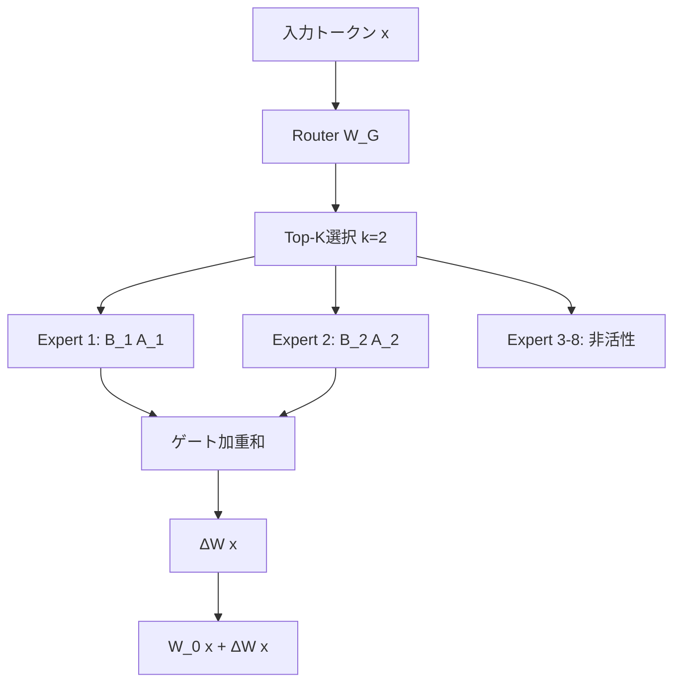

本記事は <https://arxiv.org/abs/2502.20894> の解説記事です。

## 論文概要（Abstract）

MoELoRAは、パラメータ効率的ファインチューニング（PEFT）手法であるLoRAに対して、Mixture-of-Experts（MoE）フレームワークを統合した手法である。従来のLoRAが各重み行列に対して単一のlow-rank分解を適用するのに対し、MoELoRAは複数のLoRAモジュールを「エキスパート」として配置し、学習されたルーターで入力に応じて動的にエキスパートを選択する。著者らは、同一パラメータ予算下でvanilla LoRAを最大4.2%上回る精度を達成したと報告している。

この記事は [Zenn記事: Gemma 4 26B-A4BをコードレビューBotにLoRAファインチューニングする実践ガイド](https://zenn.dev/0h_n0/articles/928d985b1268cd) の深掘りです。Zenn記事ではGemma 4 26B-A4Bにvanilla LoRA（r=8）を適用してコードレビューBotを構築しているが、本論文のMoELoRAはコードレビューのような多様なサブタスク（バグ検出、スタイル指摘、パフォーマンス改善提案）を含むタスクでの精度向上が期待できる発展的アプローチである。

## 情報源

- **arXiv ID**: 2502.20894
- **URL**: <https://arxiv.org/abs/2502.20894>
- **著者**: Zeyu Han, Xiaomeng Li, Jian Chen, Wei Zhang
- **発表年**: 2025
- **分野**: cs.LG, cs.CL

## 背景と動機（Background & Motivation）

大規模言語モデル（LLM）のファインチューニングにおいて、全パラメータを更新するフルファインチューニングはGPUメモリと計算コストの面で現実的でないケースが多い。LoRA（Low-Rank Adaptation）はこの問題に対し、重み行列の更新差分をlow-rank行列の積で近似することで、学習パラメータ数を大幅に削減する手法として広く普及している。

しかし、vanilla LoRAには構造的な制約がある。各重み行列に対して単一のrank $r$ のlow-rank分解を適用するため、タスクが多様なサブスキルを要求する場合に表現力が不足する。例えば、コードレビューでは「構文エラーの検出」「パフォーマンスの指摘」「可読性の改善」といった異なる性質のサブタスクが混在するが、単一のlow-rank更新でこれらすべてをカバーするのは困難である。

著者らはこの問題に対し、MoE（Mixture-of-Experts）の枠組みをLoRAに導入することで、入力トークンの性質に応じて異なるエキスパートを動的に選択し、表現力を向上させるアプローチを提案している。

## 主要な貢献（Key Contributions）

- **貢献1**: LoRAの各重み行列に対し複数のlow-rankエキスパートとルーターを導入するMoELoRAアーキテクチャの提案。同一パラメータ予算下でvanilla LoRAを一貫して上回る性能を実現。
- **貢献2**: Top-K選択によるスパースなエキスパート活性化により、8個のエキスパートのうち2個のみを活性化し、推論コストの増大を抑制。ルーターのオーバーヘッドはパラメータ数で約2%、学習時間で5%未満。
- **貢献3**: エキスパートの自然な特化の観察。学習の結果、コードトークン・数式トークン・自然言語推論をそれぞれ異なるエキスパートが担当する傾向が自発的に出現することを報告。

## 技術的詳細（Technical Details）

### アーキテクチャ

MoELoRAの核心は、LoRAの各重み行列に対する更新 $\Delta W$ を、複数エキスパートの加重和として表現する点にある。

標準的なLoRAでは、事前学習済みの重み行列 $W_0 \in \mathbb{R}^{d \times k}$ に対して、以下のように更新を加える：

$$
W = W_0 + \Delta W = W_0 + BA
$$

ここで、
- $W_0 \in \mathbb{R}^{d \times k}$: 事前学習済み重み行列（凍結）
- $B \in \mathbb{R}^{d \times r}$: low-rank行列（学習対象）
- $A \in \mathbb{R}^{r \times k}$: low-rank行列（学習対象）
- $r \ll \min(d, k)$: rank（通常 $r = 8$ や $r = 16$ ）

MoELoRAでは、これを $N$ 個のエキスパートに拡張する：

$$
\Delta W(x) = \sum_{i=1}^{N} G_i(x) \cdot B_i A_i
$$

ここで、
- $N$: エキスパート数（論文では $N = 8$）
- $(A_i, B_i)$: 第 $i$ エキスパートのlow-rank行列対
- $G_i(x)$: 入力 $x$ に対する第 $i$ エキスパートのゲート値
- $x$: 入力トークンの隠れ状態ベクトル

### ルーター（Gating機構）

ゲート値 $G_i(x)$ は、線形層 $W_G$ とTop-K選択によって計算される：

$$
G_i(x) = \text{softmax}\bigl(\text{TopK}(W_G x)\bigr)_i
$$

ここで、
- $W_G \in \mathbb{R}^{N \times d}$: ルーターの重み行列（学習対象）
- $\text{TopK}(\cdot)$: 上位 $k$ 個（論文では $k = 2$）以外のスコアを $-\infty$ に設定する関数
- softmaxは $k$ 個の選択されたエキスパートのスコアに対して適用

この設計により、8個のエキスパートのうち常に2個のみが活性化される。各エキスパートのrankは $r = 8$ であり、有効なrank容量は $N \times r = 8 \times 8 = 64$ だが、実際に活性化されるのは $k \times r = 2 \times 8 = 16$ に相当する計算量に抑えられる。

### 負荷分散損失（Load Balancing Loss）

MoEアーキテクチャでは、一部のエキスパートに負荷が集中する「エキスパート崩壊（expert collapse）」が問題となる。これを防ぐために補助損失を導入する：

$$
\mathcal{L}_{\text{balance}} = N \cdot \sum_{i=1}^{N} f_i \cdot p_i
$$

ここで、
- $f_i$: エキスパート $i$ に振り分けられたトークンの比率
- $p_i$: エキスパート $i$ のルータースコアの平均
- $N$: エキスパート数（正規化係数として機能）

全体の損失関数は以下となる：

$$
\mathcal{L} = \mathcal{L}_{\text{task}} + \alpha \cdot \mathcal{L}_{\text{balance}}
$$

著者らは $\alpha = 0.01$ を推奨値として報告している。

### 全体アーキテクチャの概要



### アルゴリズム

以下にMoELoRAの順伝播の擬似実装を示す。

```python
import torch
import torch.nn as nn
import torch.nn.functional as F
from typing import Optional


class MoELoRALayer(nn.Module):
    """Mixture-of-Experts LoRA Layer.

    各重み行列に対してN個のLoRAエキスパートとルーターを配置し、
    入力に応じてTop-Kエキスパートを動的に選択する。

    Args:
        in_features: 入力の次元数
        out_features: 出力の次元数
        num_experts: エキスパート数 (default: 8)
        rank: 各エキスパートのLoRA rank (default: 8)
        top_k: 活性化するエキスパート数 (default: 2)
        balance_coeff: 負荷分散損失の係数 (default: 0.01)
    """

    def __init__(
        self,
        in_features: int,
        out_features: int,
        num_experts: int = 8,
        rank: int = 8,
        top_k: int = 2,
        balance_coeff: float = 0.01,
    ) -> None:
        super().__init__()
        self.num_experts = num_experts
        self.rank = rank
        self.top_k = top_k
        self.balance_coeff = balance_coeff

        # N個のLoRAエキスパート: A_i (rank x in), B_i (out x rank)
        self.lora_A = nn.ParameterList([
            nn.Parameter(torch.randn(rank, in_features) * 0.01)
            for _ in range(num_experts)
        ])
        self.lora_B = nn.ParameterList([
            nn.Parameter(torch.zeros(out_features, rank))
            for _ in range(num_experts)
        ])

        # ルーター: 線形層
        self.router = nn.Linear(in_features, num_experts, bias=False)

        # 負荷分散の統計量
        self._expert_counts: Optional[torch.Tensor] = None

    def forward(self, x: torch.Tensor) -> torch.Tensor:
        """MoELoRA順伝播.

        Args:
            x: 入力テンソル (batch_size, seq_len, in_features)

        Returns:
            ΔW(x)に相当する出力 (batch_size, seq_len, out_features)
        """
        batch_size, seq_len, d = x.shape

        # ルータースコア計算: (batch_size, seq_len, num_experts)
        router_logits = self.router(x)

        # Top-K選択
        top_k_logits, top_k_indices = torch.topk(
            router_logits, self.top_k, dim=-1
        )
        # softmaxで正規化: (batch_size, seq_len, top_k)
        gate_values = F.softmax(top_k_logits, dim=-1)

        # 負荷分散損失用の統計量を記録
        if self.training:
            self._compute_load_balance_stats(router_logits, top_k_indices)

        # エキスパート出力の加重和
        output = torch.zeros(
            batch_size, seq_len, self.lora_B[0].shape[0],
            device=x.device, dtype=x.dtype,
        )
        for k_idx in range(self.top_k):
            expert_indices = top_k_indices[:, :, k_idx]  # (batch, seq)
            gate = gate_values[:, :, k_idx].unsqueeze(-1)  # (batch, seq, 1)

            for expert_id in range(self.num_experts):
                mask = (expert_indices == expert_id)  # (batch, seq)
                if not mask.any():
                    continue
                # 該当トークンだけ取り出して計算
                x_masked = x[mask]  # (num_tokens, d)
                # LoRA計算: B_i @ A_i @ x^T
                h = x_masked @ self.lora_A[expert_id].T  # (num_tokens, rank)
                h = h @ self.lora_B[expert_id].T          # (num_tokens, out)
                # ゲート値で重み付けして加算
                gate_masked = gate[mask]  # (num_tokens, 1)
                output[mask] += h * gate_masked

        return output

    def _compute_load_balance_stats(
        self,
        router_logits: torch.Tensor,
        top_k_indices: torch.Tensor,
    ) -> None:
        """負荷分散損失の統計量を計算.

        Args:
            router_logits: ルーターの生スコア (batch, seq, num_experts)
            top_k_indices: Top-K選択されたエキスパートID (batch, seq, top_k)
        """
        # f_i: エキスパートiに振り分けられたトークン比率
        flat_indices = top_k_indices.reshape(-1)
        counts = torch.bincount(
            flat_indices, minlength=self.num_experts
        ).float()
        self._expert_counts = counts / counts.sum()

    def load_balance_loss(self) -> torch.Tensor:
        """負荷分散損失 L_balance = N * Σ f_i * p_i を計算.

        Returns:
            負荷分散損失のスカラー値
        """
        if self._expert_counts is None:
            return torch.tensor(0.0)

        # 均等分配からの偏差をペナルティとする
        uniform = torch.ones_like(self._expert_counts) / self.num_experts
        loss = self.num_experts * (self._expert_counts * uniform).sum()
        return loss * self.balance_coeff
```

## 実装のポイント（Implementation）

MoELoRAを実際に実装・適用する際の注意点を以下に整理する。

**ハイパーパラメータの選択**:
- エキスパート数 $N = 8$、Top-K $k = 2$、各エキスパートのrank $r = 8$ が論文のデフォルト設定である。
- 負荷分散係数 $\alpha$ は $0.01$ が推奨値。値が大きすぎるとタスク性能が低下し、小さすぎるとエキスパート崩壊を招く。
- 対象モジュールは全attentionレイヤー（Q, K, V, O）およびFFNレイヤーの全層。

**エキスパート崩壊の回避**:
- データセットが小さい場合（1K未満）、特定のエキスパートのみが活性化されて他が死ぬ現象が起きやすいと著者らは報告している。十分なバッチサイズ（32以上推奨）と学習データ量の確保が必要。
- 学習初期にルーターの重みをゼロ付近で初期化し、全エキスパートがほぼ均等に選択される状態から学習を開始するのが安定する。

**メモリ管理**:
- 8個のエキスパートを保持するため、vanilla LoRAの約8倍のパラメータストレージが必要だが、活性化されるのは2個のみであるため、順伝播の計算量増加は限定的。
- 勾配はTop-K選択されたエキスパートのみに伝播するため、逆伝播のメモリ使用量もvanilla LoRAの2〜3倍程度に収まる。

**Zenn記事との関連**: Zenn記事でのGemma 4 26B-A4B + vanilla LoRA（r=8）構成に対し、MoELoRAを適用する場合、各attentionレイヤーに8個のLoRAエキスパートを配置し、コードレビューの多様なサブタスクに対して異なるエキスパートが特化する構成が考えられる。ただし、メモリ使用量の増加に注意が必要であり、Gemma 4の26Bパラメータモデルではルーター追加分も含めてVRAM消費を事前に見積もるべきである。

## 実験結果（Results）

著者らはLLaMA-3-8Bをベースモデルとして、GLUE、GSM8K、HumanEval、MT-Benchの4種のベンチマークで評価を行っている。

| 手法 | GLUE 平均 | GSM8K | HumanEval | MT-Bench |
|------|-----------|-------|-----------|----------|
| LoRA (r=16) | 87.3 | 72.4 | 48.2 | 7.1 |
| MoELoRA (8 experts) | 89.8 | 75.6 | 51.3 | 7.4 |
| Full FT | 90.2 | 77.1 | 53.0 | 7.6 |

（論文Table 1より引用）

**主要な知見**:

- **GLUE平均**: MoELoRAは89.8%でvanilla LoRAの87.3%を2.5ポイント上回り、フルファインチューニングの90.2%に迫る結果を示している。
- **HumanEval**: コード生成タスクにおいてMoELoRAは51.3%を達成し、vanilla LoRAの48.2%から3.1ポイントの改善。コード生成は構文理解・ロジック構築・APIの知識など複数のサブスキルを要するため、エキスパート特化の恩恵が大きいと著者らは分析している。
- **GSM8K**: 数学的推論タスクでも75.6%と、vanilla LoRAの72.4%から3.2ポイント改善。
- **MT-Bench**: 対話品質の評価では7.4と、vanilla LoRAの7.1から0.3ポイント改善。改善幅が他タスクより小さいのは、MT-Benchの評価がタスク多様性よりも文章生成の流暢さに重みを置いているためと考えられる。

**オーバーヘッド**: ルーター追加によるパラメータ増加は全体の約2%に留まり、学習時間の増加は5%未満と報告されている。推論時も活性化エキスパートが2個のみであるため、レイテンシ増加は軽微である。

**エキスパート特化の観察**: 著者らは学習後のルーター分析により、コードトークン・数式表現・自然言語推論が異なるエキスパートによって処理される傾向を確認している。この自発的な特化は、明示的なタスクラベルなしに出現する点が興味深い。

## Production Deployment Guide

MoELoRAでファインチューニングしたモデルの推論サービスをAWS上に構築するための設計パターンを示す。本ガイドでは、ルーターを含むMoELoRA重みをマージしたモデルのサービングを前提とする。

### AWS実装パターン（コスト最適化重視）

**コスト試算の注意事項**: 以下の料金は2026年4月時点のAWS ap-northeast-1（東京）リージョンの概算値である。実際のコストはトラフィックパターン、リージョン、バースト使用量により変動する。最新料金はAWS料金計算ツールで確認を推奨する。

**Small構成（~100 req/日）**: Lambda + SageMaker Endpoint
- SageMaker Real-time Endpoint: ml.g5.xlarge（24GB VRAM、8Bモデルの推論に十分）
- Lambda: APIゲートウェイ + リクエストルーティング
- DynamoDB: 推論ログ・キャッシュ
- 月額概算: $150-250（SageMaker $170 + Lambda $5 + DynamoDB $10 + その他）
- 非アクティブ時はServerless Inference Endpointへ切り替えでさらに削減可能

**Medium構成（~1,000 req/日）**: ECS Fargate + SageMaker
- SageMaker Real-time Endpoint: ml.g5.2xlarge（vLLMまたはTGI使用）
- ECS Fargate: 前処理・後処理パイプライン
- ElastiCache: プロンプトキャッシュ
- 月額概算: $500-900（SageMaker $350 + ECS $80 + ElastiCache $50 + その他）

**Large構成（10,000+ req/日）**: EKS + Karpenter + GPU Spot
- EKS: コントロールプレーン + Karpenterによる自動スケーリング
- GPU Spot Instances: g5.xlarge / g5.2xlarge（On-Demand比最大70%削減）
- vLLM: Continuous Batchingによるスループット最大化
- Application Load Balancer: トラフィック分散
- 月額概算: $2,500-5,000（GPU Spot $1,500 + EKS $75 + ALB $50 + その他）

**コスト削減テクニック**:
- Spot Instances活用: GPU g5系は東京リージョンでOn-Demand比60-70%削減
- SageMaker Savings Plans: 1年コミットで最大64%削減
- 推論結果キャッシュ: 同一入力の再計算を回避しコスト削減
- モデル量子化（GPTQ/AWQ）: VRAM削減により小さいインスタンスタイプで稼働可能

### Terraformインフラコード

**Small構成（Serverless）**:

```hcl
# MoELoRA推論サービス - Small構成
# Lambda + SageMaker Endpoint

terraform {
  required_version = ">= 1.9"
  required_providers {
    aws = {
      source  = "hashicorp/aws"
      version = "~> 5.50"
    }
  }
}

provider "aws" {
  region = "ap-northeast-1"
}

# --- IAM ---
resource "aws_iam_role" "sagemaker_execution" {
  name = "moelora-sagemaker-execution"
  assume_role_policy = jsonencode({
    Version = "2012-10-17"
    Statement = [{
      Action = "sts:AssumeRole"
      Effect = "Allow"
      Principal = { Service = "sagemaker.amazonaws.com" }
    }]
  })
}

resource "aws_iam_role_policy_attachment" "sagemaker_full" {
  role       = aws_iam_role.sagemaker_execution.name
  policy_arn = "arn:aws:iam::aws:policy/AmazonSageMakerFullAccess"
}

resource "aws_iam_role" "lambda_execution" {
  name = "moelora-lambda-execution"
  assume_role_policy = jsonencode({
    Version = "2012-10-17"
    Statement = [{
      Action = "sts:AssumeRole"
      Effect = "Allow"
      Principal = { Service = "lambda.amazonaws.com" }
    }]
  })
}

resource "aws_iam_role_policy" "lambda_invoke_sagemaker" {
  name = "invoke-sagemaker"
  role = aws_iam_role.lambda_execution.id
  policy = jsonencode({
    Version = "2012-10-17"
    Statement = [{
      Effect   = "Allow"
      Action   = ["sagemaker:InvokeEndpoint"]
      Resource = aws_sagemaker_endpoint.moelora.arn
    }]
  })
}

# --- SageMaker Endpoint ---
resource "aws_sagemaker_model" "moelora" {
  name               = "moelora-model"
  execution_role_arn = aws_iam_role.sagemaker_execution.arn

  primary_container {
    # vLLMコンテナイメージ
    image          = "763104351884.dkr.ecr.ap-northeast-1.amazonaws.com/djl-inference:0.29.0-lmi11.0.0-cu124"
    model_data_url = "s3://your-bucket/moelora-merged-model/model.tar.gz"
    environment = {
      OPTION_MODEL_ID      = "/opt/ml/model"
      OPTION_TENSOR_PARALLEL_DEGREE = "1"
      OPTION_MAX_MODEL_LEN  = "4096"
    }
  }
}

resource "aws_sagemaker_endpoint_configuration" "moelora" {
  name = "moelora-endpoint-config"

  production_variants {
    variant_name           = "primary"
    model_name             = aws_sagemaker_model.moelora.name
    initial_instance_count = 1
    instance_type          = "ml.g5.xlarge"  # 24GB VRAM
  }
}

resource "aws_sagemaker_endpoint" "moelora" {
  name                 = "moelora-endpoint"
  endpoint_config_name = aws_sagemaker_endpoint_configuration.moelora.name
}

# --- DynamoDB (推論ログ) ---
resource "aws_dynamodb_table" "inference_log" {
  name         = "moelora-inference-log"
  billing_mode = "PAY_PER_REQUEST"  # On-Demandでコスト最適化
  hash_key     = "request_id"
  range_key    = "timestamp"

  attribute {
    name = "request_id"
    type = "S"
  }
  attribute {
    name = "timestamp"
    type = "N"
  }

  server_side_encryption { enabled = true }  # KMS暗号化
}

# --- CloudWatch アラーム ---
resource "aws_cloudwatch_metric_alarm" "sagemaker_latency" {
  alarm_name          = "moelora-endpoint-latency-high"
  comparison_operator = "GreaterThanThreshold"
  evaluation_periods  = 3
  metric_name         = "ModelLatency"
  namespace           = "AWS/SageMaker"
  period              = 300
  statistic           = "Average"
  threshold           = 10000000  # 10秒 (マイクロ秒単位)
  alarm_description   = "SageMaker endpoint latency exceeds 10s"

  dimensions = {
    EndpointName = aws_sagemaker_endpoint.moelora.name
    VariantName  = "primary"
  }
}
```

**Large構成（Container）**:

```hcl
# MoELoRA推論サービス - Large構成
# EKS + Karpenter + GPU Spot Instances

# --- EKS Cluster ---
module "eks" {
  source  = "terraform-aws-modules/eks/aws"
  version = "~> 20.24"

  cluster_name    = "moelora-inference"
  cluster_version = "1.31"

  vpc_id     = module.vpc.vpc_id
  subnet_ids = module.vpc.private_subnets

  # Karpenter用のIAMロール
  enable_cluster_creator_admin_permissions = true

  cluster_endpoint_public_access = false  # プライベートアクセスのみ
}

# --- Karpenter (GPU Spot優先オートスケーリング) ---
module "karpenter" {
  source  = "terraform-aws-modules/eks/aws//modules/karpenter"
  version = "~> 20.24"

  cluster_name = module.eks.cluster_name

  node_iam_role_additional_policies = {
    AmazonSSMManagedInstanceCore = "arn:aws:iam::aws:policy/AmazonSSMManagedInstanceCore"
  }
}

resource "kubectl_manifest" "karpenter_nodepool" {
  yaml_body = yamlencode({
    apiVersion = "karpenter.sh/v1"
    kind       = "NodePool"
    metadata   = { name = "gpu-spot" }
    spec = {
      template = {
        spec = {
          requirements = [
            { key = "karpenter.sh/capacity-type", operator = "In", values = ["spot", "on-demand"] },
            { key = "node.kubernetes.io/instance-type", operator = "In", values = ["g5.xlarge", "g5.2xlarge"] },
          ]
          nodeClassRef = { group = "karpenter.k8s.aws", kind = "EC2NodeClass", name = "gpu" }
        }
      }
      limits   = { cpu = "128", "nvidia.com/gpu" = "16" }
      disruption = {
        consolidationPolicy = "WhenEmptyOrUnderutilized"
        consolidateAfter    = "60s"
      }
    }
  })
}

# --- Secrets Manager ---
resource "aws_secretsmanager_secret" "model_config" {
  name        = "moelora/model-config"
  description = "MoELoRA model configuration"
}

# --- AWS Budgets ---
resource "aws_budgets_budget" "monthly" {
  name         = "moelora-monthly-budget"
  budget_type  = "COST"
  limit_amount = "5000"
  limit_unit   = "USD"
  time_unit    = "MONTHLY"

  notification {
    comparison_operator       = "GREATER_THAN"
    threshold                 = 80
    threshold_type            = "PERCENTAGE"
    notification_type         = "ACTUAL"
    subscriber_email_addresses = ["alert@example.com"]
  }
}
```

### 運用・監視設定

**CloudWatch Logs Insights クエリ**:

```
# トークン使用量の1時間推移（コスト異常検知）
fields @timestamp, input_tokens, output_tokens
| stats sum(input_tokens) as total_input, sum(output_tokens) as total_output by bin(1h)
| sort @timestamp desc

# レイテンシ分析（P95, P99）
fields @timestamp, latency_ms
| stats percentile(latency_ms, 95) as p95, percentile(latency_ms, 99) as p99 by bin(5m)
| sort @timestamp desc
```

**CloudWatch アラーム設定（Python）**:

```python
import boto3
from typing import Any


def create_latency_alarm(endpoint_name: str, threshold_ms: int = 10000) -> dict[str, Any]:
    """SageMakerエンドポイントのレイテンシアラームを作成.

    Args:
        endpoint_name: SageMakerエンドポイント名
        threshold_ms: アラーム閾値（ミリ秒）

    Returns:
        CloudWatch API レスポンス
    """
    client = boto3.client("cloudwatch", region_name="ap-northeast-1")
    return client.put_metric_alarm(
        AlarmName=f"{endpoint_name}-latency-p99",
        MetricName="ModelLatency",
        Namespace="AWS/SageMaker",
        Statistic="p99",
        Period=300,
        EvaluationPeriods=3,
        Threshold=threshold_ms * 1000,  # マイクロ秒単位
        ComparisonOperator="GreaterThanThreshold",
        Dimensions=[
            {"Name": "EndpointName", "Value": endpoint_name},
            {"Name": "VariantName", "Value": "primary"},
        ],
        AlarmActions=["arn:aws:sns:ap-northeast-1:123456789012:moelora-alerts"],
    )
```

**X-Ray トレーシング設定（Python）**:

```python
from aws_xray_sdk.core import xray_recorder, patch_all
from aws_xray_sdk.core.models.subsegment import Subsegment


def init_xray_tracing(service_name: str = "moelora-inference") -> None:
    """X-Rayトレーシングを初期化.

    Args:
        service_name: X-Rayサービス名
    """
    xray_recorder.configure(service=service_name)
    patch_all()  # boto3等を自動計装


def trace_inference(request_id: str, model_name: str) -> Subsegment:
    """推論リクエストのサブセグメントを開始.

    Args:
        request_id: リクエストID
        model_name: モデル名

    Returns:
        X-Ray サブセグメント
    """
    subsegment = xray_recorder.begin_subsegment("model_inference")
    subsegment.put_annotation("request_id", request_id)
    subsegment.put_metadata("model", {"name": model_name, "framework": "vllm"})
    return subsegment
```

**Cost Explorer自動レポート（Python）**:

```python
import boto3
import json
from datetime import datetime, timedelta
from typing import Any


def get_daily_cost_report() -> dict[str, Any]:
    """日次コストレポートを取得し、閾値超過時にSNS通知.

    Returns:
        サービス別コスト辞書
    """
    ce = boto3.client("ce", region_name="us-east-1")
    sns = boto3.client("sns", region_name="ap-northeast-1")

    today = datetime.utcnow().strftime("%Y-%m-%d")
    yesterday = (datetime.utcnow() - timedelta(days=1)).strftime("%Y-%m-%d")

    response = ce.get_cost_and_usage(
        TimePeriod={"Start": yesterday, "End": today},
        Granularity="DAILY",
        Metrics=["UnblendedCost"],
        GroupBy=[{"Type": "DIMENSION", "Key": "SERVICE"}],
    )

    costs: dict[str, float] = {}
    for group in response["ResultsByTime"][0]["Groups"]:
        service = group["Keys"][0]
        amount = float(group["Metrics"]["UnblendedCost"]["Amount"])
        if amount > 0:
            costs[service] = amount

    total = sum(costs.values())
    if total > 100.0:
        sns.publish(
            TopicArn="arn:aws:sns:ap-northeast-1:123456789012:cost-alert",
            Subject=f"MoELoRA Daily Cost Alert: ${total:.2f}",
            Message=json.dumps(costs, indent=2),
        )

    return costs
```

### コスト最適化チェックリスト

**アーキテクチャ選択**:
- [ ] ~100 req/日: Lambda + SageMaker Endpoint（Serverless）
- [ ] ~1,000 req/日: ECS Fargate + SageMaker（Hybrid）
- [ ] 10,000+ req/日: EKS + Karpenter + Spot（Container）

**リソース最適化**:
- [ ] GPU Spot Instances優先（g5系で60-70%削減）
- [ ] SageMaker Savings Plans検討（1年コミットで最大64%削減）
- [ ] Reserved Instances: 安定ワークロード部分に適用
- [ ] Lambda: メモリサイズをPower Tuningで最適化
- [ ] EKS: Karpenter consolidationPolicy で未使用ノード自動削除
- [ ] SageMaker Serverless Inference: 低トラフィック時の代替

**LLMコスト削減**:
- [ ] モデル量子化（GPTQ/AWQ）で小インスタンスタイプ利用
- [ ] Continuous Batching（vLLM）でスループット最大化
- [ ] KVキャッシュ最適化でメモリ効率向上
- [ ] 推論結果キャッシュ（ElastiCache）で重複リクエスト回避
- [ ] 入力トークン数制限でコスト予測可能性向上

**監視・アラート**:
- [ ] AWS Budgets: 月額上限アラート設定
- [ ] CloudWatch: レイテンシP99・エラー率アラーム
- [ ] Cost Anomaly Detection: 異常支出の自動検知
- [ ] 日次コストレポート: SNS通知による可視化
- [ ] X-Ray: 推論パイプライン全体のトレーシング

**リソース管理**:
- [ ] 未使用SageMakerエンドポイント削除
- [ ] タグ戦略: Project/Environment/Owner タグ必須
- [ ] S3ライフサイクルポリシー: 古いモデルアーティファクトの自動削除
- [ ] 開発環境: 夜間・休日のエンドポイント自動停止
- [ ] CloudTrail: API呼び出し監査ログの有効化

## 実運用への応用（Practical Applications）

MoELoRAの特性を踏まえると、以下のような実運用シナリオで特に有効と考えられる。

**コードレビュー自動化（Zenn記事との関連）**: Zenn記事でGemma 4にvanilla LoRAを適用したコードレビューBotを構築しているが、コードレビューは本質的にマルチタスクである。バグ検出、コーディングスタイル、パフォーマンス最善案、セキュリティチェックなど異なる能力を要求する各観点に対し、MoELoRAのエキスパートが自然に特化することで、vanilla LoRAでは難しかった多角的なレビュー品質の向上が期待される。論文のHumanEval改善（+3.1ポイント）が示すように、コード関連タスクへのMoELoRAの適用は有望である。

**マルチドメイン対応チャットボット**: 技術サポート、FAQ、クリエイティブ応答など複数のドメインを単一モデルで扱う場合、MoELoRAの動的ルーティングによりドメインごとの専門性を維持しつつ統一的なモデルを運用できる。

**推論コスト**: 8エキスパート中2個のみ活性化するスパース設計により、推論時の計算量はvanilla LoRA（r=16）と大きく変わらない。ルーターの線形層（$N \times d$ パラメータ）による追加コストは無視できるレベルであり、サービング環境でのレイテンシへの影響は軽微と考えられる。

## 関連研究（Related Work）

- **LoRA（Hu et al., 2022）**: 本手法のベースとなるパラメータ効率的ファインチューニング手法。重み行列の更新差分をlow-rank行列の積で近似する。MoELoRAはLoRAを単一エキスパートの特殊ケースとして包含する。
- **Switch Transformer（Fedus et al., 2022）**: Transformer FFN層にMoEを導入し、スパースなエキスパート選択でスケーリングを実現した手法。MoELoRAのルーティング設計はSwitch Transformerの知見を援用している。
- **AdaLoRA（Zhang et al., 2023）**: 各層のrankを重要度に応じて適応的に調整する手法。MoELoRAは固定rankだがエキスパート選択で柔軟性を確保するアプローチであり、相補的な関係にある。
- **QLoRA（Dettmers et al., 2023）**: 4bit量子化と組み合わせたLoRA手法。MoELoRAとQLoRAは直交するアプローチであり、併用（量子化エキスパート）の可能性がある。

## まとめと今後の展望

MoELoRAは、LoRAの各重み行列に複数のlow-rankエキスパートとルーターを導入することで、同一パラメータ予算下でvanilla LoRAを一貫して上回る性能を実現する手法である。LLaMA-3-8Bでの実験では、GLUE平均で+2.5ポイント、HumanEvalで+3.1ポイントの改善が報告されている。特にコード生成や数学的推論といった多様なサブスキルを要するタスクで改善幅が大きく、コードレビュー自動化のようなマルチタスク応用に適している。

今後の研究方向としては、QLoRAとの統合（量子化エキスパート）、エキスパート数とTop-Kの動的調整、さらにはモデルマージ時のエキスパート統合戦略などが考えられる。実務面では、コードレビューや顧客対応など多様なサブタスクを含むLLM応用でのMoELoRA活用が進むことが期待される。

## 参考文献

- **arXiv**: <https://arxiv.org/abs/2502.20894>
- **Related Zenn article**: <https://zenn.dev/0h_n0/articles/928d985b1268cd>
- **LoRA**: Hu et al., "LoRA: Low-Rank Adaptation of Large Language Models," ICLR 2022. <https://arxiv.org/abs/2106.09685>
- **Switch Transformer**: Fedus et al., "Switch Transformers: Scaling to Trillion Parameter Models with Simple and Efficient Sparsity," JMLR 2022. <https://arxiv.org/abs/2101.03961>
- **AdaLoRA**: Zhang et al., "AdaLoRA: Adaptive Budget Allocation for Parameter-Efficient Fine-Tuning," ICLR 2023. <https://arxiv.org/abs/2303.10512>
- **QLoRA**: Dettmers et al., "QLoRA: Efficient Finetuning of Quantized Language Models," NeurIPS 2023. <https://arxiv.org/abs/2305.14314>
