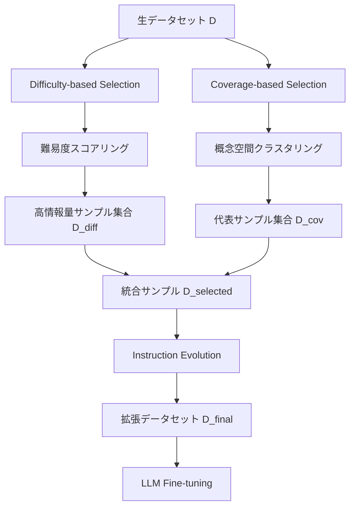

本記事は [https://arxiv.org/abs/2504.12687](https://arxiv.org/abs/2504.12687) の解説記事です。

## 論文概要（Abstract）

大規模言語モデル（LLM）をコード生成タスクにファインチューニングするには、大量かつ高品質な学習データが必要となる。しかし、データの希少性や収集コストの高さが現実的な課題として存在する。本論文では、学習データ量を削減しつつモデル性能を維持・向上させるデータ効率的なファインチューニングフレームワークを提案している。フレームワークは (1) 難易度ベースのデータ選択、(2) カバレッジベースのデータ選択、(3) Instruction Evolutionによるデータ拡張の3要素で構成される。著者らは、フルデータセットの40%で同等以上の精度を達成し、学習時間を35%、GPUメモリ消費を22%削減したと報告している（論文Abstract より）。

この記事は [Zenn記事: Gemma 4 26B-A4BをコードレビューBotにLoRAファインチューニングする実践ガイド](https://zenn.dev/0h_n0/articles/928d985b1268cd) の深掘りです。

## 情報源

- **arXiv ID**: 2504.12687
- **URL**: [https://arxiv.org/abs/2504.12687](https://arxiv.org/abs/2504.12687)
- **著者**: Weichen Li, Hao Jiang, Zhengyin Lu et al.
- **発表年**: 2025
- **分野**: cs.LG, cs.SE

## 背景と動機（Background & Motivation）

LLMのコード生成能力をドメイン特化させるファインチューニングは、実務で広く行われている。しかし、著者らは以下の3つの課題を指摘している。

第一に、**データの希少性**である。高品質なコード生成ペア（指示文と正解コード）の作成には、ドメイン専門家によるレビューが必要であり、大規模データセット構築のコストが高い。第二に、**冗長データの存在**である。大量のデータを投入しても、類似した簡単なサンプルが重複しており、学習信号としての情報量が低いケースが多い。第三に、**計算資源の制約**である。フルデータセットでのファインチューニングはGPUメモリと学習時間の双方で大きなコストを伴う。

従来のデータ選択手法は主にNLPの分類タスクを対象としており、コード生成のような構造化出力を持つタスクへの適用は十分に検討されていなかった。本論文は、コード生成に特化したデータ効率化フレームワークを提案することで、この課題に取り組んでいる。

## 主要な貢献（Key Contributions）

- **貢献1**: 難易度ベースのデータ選択手法 — ベースモデルにとって「解きにくい」サンプルを優先的に選択し、学習信号の情報量を最大化する仕組み
- **貢献2**: カバレッジベースのデータ選択手法 — プログラミング概念空間でのクラスタリングにより、少数サンプルで多様な概念をカバーする選択戦略
- **貢献3**: Instruction Evolution — 既存の指示文を段階的に複雑化するデータ拡張手法により、少量データからの学習効果を向上
- **貢献4**: 上記3要素の統合フレームワークにより、フルデータの40%で同等精度、学習時間35%削減、GPUメモリ22%削減を達成（論文Abstract より）

## 技術的詳細（Technical Details）

### フレームワーク全体像



### 1. Difficulty-based Data Selection

ベースモデル $M_0$ がデータセット $\mathcal{D} = \{(x_i, y_i)\}_{i=1}^{N}$ の各サンプルに対してどの程度「解きにくい」かを、条件付き対数尤度で定量化する。

$$
s_{\text{diff}}(x_i, y_i) = -\frac{1}{|y_i|} \sum_{t=1}^{|y_i|} \log p_{M_0}(y_i^{(t)} \mid y_i^{(<t)}, x_i)
$$

ここで、
- $x_i$: $i$ 番目の入力（指示文 / プロンプト）
- $y_i$: $i$ 番目の正解コード
- $y_i^{(t)}$: 正解コードの $t$ 番目のトークン
- $y_i^{(<t)}$: $t$ 番目より前のトークン列
- $p_{M_0}$: ベースモデルの予測確率
- $|y_i|$: 正解コードのトークン数

この式は、ベースモデルが正解コードの各トークンを予測する際の平均負の対数尤度（= パープレキシティの対数）を表す。値が大きいほどベースモデルにとって難しいサンプルであり、ファインチューニングにおける学習信号が豊富であることを意味する。

著者らは、スコアの上位 $k\%$ を選択する閾値方式を採用している。

$$
\mathcal{D}_{\text{diff}} = \{(x_i, y_i) \in \mathcal{D} \mid s_{\text{diff}}(x_i, y_i) \geq \tau_{\text{diff}}\}
$$

ここで $\tau_{\text{diff}}$ は上位 $k\%$ に対応する閾値である。

### 2. Coverage-based Data Selection

難易度だけで選択すると、特定のプログラミングパターンに偏る可能性がある。これを防ぐため、概念空間での多様性を確保するカバレッジベースの選択を組み合わせる。

まず、各サンプルの指示文 $x_i$ を事前学習済みエンコーダで埋め込みベクトル $\mathbf{e}_i \in \mathbb{R}^d$ に変換する。

$$
\mathbf{e}_i = \text{Encoder}(x_i)
$$

次に、$k$-means クラスタリングで $C$ 個のクラスタに分割し、各クラスタから代表サンプルを選択する。

$$
\min_{\mu_1, \ldots, \mu_C} \sum_{j=1}^{C} \sum_{\mathbf{e}_i \in S_j} \|\mathbf{e}_i - \mu_j\|^2
$$

ここで、
- $C$: クラスタ数（プログラミング概念の多様性に対応）
- $S_j$: クラスタ $j$ に属するサンプルの集合
- $\mu_j$: クラスタ $j$ のセントロイド

各クラスタから、セントロイドに最も近いサンプルを $m$ 個ずつ選択する。

$$
\mathcal{D}_{\text{cov}} = \bigcup_{j=1}^{C} \text{TopK}_m\left(\{(x_i, y_i) \mid \mathbf{e}_i \in S_j\}, \; \|\mathbf{e}_i - \mu_j\|\right)
$$

### 3. Instruction Evolution

選択されたデータの品質をさらに向上させるため、WizardCoder の Evol-Instruct と同系統の手法で指示文を段階的に複雑化する。

$$
x_i' = \text{Evolve}(x_i, l) \quad \text{where} \quad l \in \{1, 2, \ldots, L\}
$$

ここで、
- $x_i'$: 進化後の指示文
- $l$: 難易度レベル（$L$ は最大レベル）
- $\text{Evolve}$: LLMを用いた指示文の複雑化関数

具体的には、以下の進化演算子が適用される。
- **制約追加**: エッジケース処理、入力検証などの要件を追加
- **コンテキスト拡張**: マルチステップのタスクに変換
- **一般化**: 特定の問題をより抽象的なパターンに変換

最終的なデータセットは以下で構成される。

$$
\mathcal{D}_{\text{final}} = \mathcal{D}_{\text{diff}} \cup \mathcal{D}_{\text{cov}} \cup \text{Evolve}(\mathcal{D}_{\text{diff}} \cup \mathcal{D}_{\text{cov}})
$$

### アルゴリズム

```python
from dataclasses import dataclass
from typing import Sequence

import numpy as np
import torch
from sklearn.cluster import KMeans
from transformers import PreTrainedModel, PreTrainedTokenizer


@dataclass
class Sample:
    """学習データの1サンプルを表す構造体。

    Attributes:
        instruction: 指示文（プロンプト）
        code: 正解コード
        difficulty_score: ベースモデルでの難易度スコア
    """
    instruction: str
    code: str
    difficulty_score: float = 0.0


def compute_difficulty_scores(
    model: PreTrainedModel,
    tokenizer: PreTrainedTokenizer,
    samples: Sequence[Sample],
) -> list[float]:
    """ベースモデルを用いて各サンプルの難易度スコアを算出する。

    Args:
        model: ベースとなるLLM（推論モード）
        tokenizer: 対応するトークナイザ
        samples: スコアリング対象のサンプル一覧

    Returns:
        各サンプルの平均負の対数尤度（高いほど難しい）
    """
    scores: list[float] = []
    model.eval()

    for sample in samples:
        prompt = sample.instruction
        target = sample.code

        inputs = tokenizer(
            prompt + target,
            return_tensors="pt",
            truncation=True,
            max_length=2048,
        ).to(model.device)

        prompt_len = len(tokenizer.encode(prompt, add_special_tokens=False))

        with torch.no_grad():
            outputs = model(**inputs, labels=inputs["input_ids"])
            # prompt 部分を除いた code 部分の平均負の対数尤度
            logits = outputs.logits[:, prompt_len - 1:-1, :]
            target_ids = inputs["input_ids"][:, prompt_len:]
            log_probs = torch.nn.functional.log_softmax(logits, dim=-1)
            token_log_probs = log_probs.gather(
                2, target_ids.unsqueeze(-1)
            ).squeeze(-1)
            avg_neg_log_likelihood = -token_log_probs.mean().item()

        scores.append(avg_neg_log_likelihood)

    return scores


def coverage_based_selection(
    embeddings: np.ndarray,
    n_clusters: int,
    samples_per_cluster: int,
) -> list[int]:
    """k-means クラスタリングで代表サンプルのインデックスを返す。

    Args:
        embeddings: 各サンプルの埋め込みベクトル (N, d)
        n_clusters: クラスタ数
        samples_per_cluster: 各クラスタから選択するサンプル数

    Returns:
        選択されたサンプルのインデックス一覧
    """
    kmeans = KMeans(n_clusters=n_clusters, random_state=42, n_init=10)
    labels = kmeans.fit_predict(embeddings)

    selected_indices: list[int] = []
    for cluster_id in range(n_clusters):
        cluster_mask = labels == cluster_id
        cluster_indices = np.where(cluster_mask)[0]
        centroid = kmeans.cluster_centers_[cluster_id]

        distances = np.linalg.norm(
            embeddings[cluster_indices] - centroid, axis=1
        )
        top_k = min(samples_per_cluster, len(cluster_indices))
        nearest = np.argsort(distances)[:top_k]
        selected_indices.extend(cluster_indices[nearest].tolist())

    return selected_indices
```

## 実装のポイント（Implementation）

### 難易度スコアリングのバッチ処理

全サンプルのスコアリングにはベースモデルでの推論パスが必要となる。著者らの実験規模（数万サンプル）では、バッチ推論の効率化が重要である。具体的には以下の点に注意が必要である。

- **メモリ効率**: スコアリング時はアダプタ重みが不要なため、ベースモデルのみで `torch.no_grad()` を用いた推論を行う。4-bit量子化を適用すればA100 40GBでも大規模モデルのスコアリングが可能になる
- **バッチサイズの調整**: サンプルごとにコード長が異なるため、Dynamic Paddingを使って効率を保つ
- **クラスタ数 $C$ の選定**: 著者らは概念空間の粒度に応じて $C$ を設定している。実務では Silhouette Score 等でチューニングするのが望ましい

### Instruction Evolutionの品質管理

Evolve操作にはLLMを使うため、生成される指示文の品質にばらつきが生じる。著者らは、進化後の指示文が元のコード $y_i$ と矛盾しないことを検証するフィルタリングステップを設けている。実装時には、進化後の指示文で再度コード生成を行い、元の正解コードとの整合性を確認するパイプラインを組むことを推奨する。

### ハイパーパラメータの推奨値

著者らの実験設定では、以下の値が使用されている。

| パラメータ | 値 | 備考 |
|-----------|-----|------|
| 難易度選択率 $k\%$ | 上位30-50% | データセット品質に依存 |
| クラスタ数 $C$ | 50-200 | 概念空間の粒度に応じて |
| Evolution レベル $L$ | 3 | 過度な複雑化は逆効果 |
| 最終データ量 | 元の40% | 論文のメイン結果 |

## Production Deployment Guide

本論文のデータ選択パイプラインをAWS上で運用する構成を以下に示す。コスト試算は2026年4月時点のAWS ap-northeast-1（東京）リージョン料金に基づく概算値であり、実際のコストはトラフィックパターン、リージョン、バースト使用量により変動する。最新料金は [AWS料金計算ツール](https://calculator.aws/) で確認を推奨する。

### AWS実装パターン（コスト最適化重視）

**Small構成（~100 req/日）: Lambda + S3 + SageMaker Processing**

バッチ処理型のデータ選択パイプラインに適した構成。学習データセットをS3に配置し、Lambda関数がトリガーとなってSageMaker Processing Jobを起動する。

| サービス | 用途 | 月額概算 |
|----------|------|----------|
| Lambda | パイプライン制御・トリガー | $5 |
| S3 | データセット・中間結果保存 | $10 |
| SageMaker Processing | 難易度スコアリング・クラスタリング | $80-120（ml.g5.xlarge, 月10時間） |
| DynamoDB | スコア・選択結果のメタデータ | $5 |
| **合計** | | **$100-140/月** |

**Medium構成（~1,000 req/日）: ECS Fargate + SageMaker Training**

API経由でデータ選択リクエストを受け付け、SageMaker Training Jobでファインチューニングまで自動化する構成。

| サービス | 用途 | 月額概算 |
|----------|------|----------|
| ECS Fargate | APIサーバ（2 vCPU, 4GB RAM） | $80 |
| SageMaker Training | ファインチューニング実行 | $300-500（ml.g5.2xlarge, 月20時間） |
| S3 | データセット・モデルアーティファクト | $20 |
| ElastiCache | 埋め込みベクトルキャッシュ | $50 |
| **合計** | | **$450-650/月** |

**Large構成（10,000+ req/日）: EKS + SageMaker + Spot Instances**

複数チーム・複数モデルの並行ファインチューニングに対応する構成。Karpenterで自動スケーリングし、Spot Instancesで計算コストを抑制する。

| サービス | 用途 | 月額概算 |
|----------|------|----------|
| EKS | コンテナオーケストレーション | $75（コントロールプレーン） |
| EC2 Spot（g5.2xlarge） | スコアリング・クラスタリング | $400-800（最大90%削減） |
| SageMaker Training（Spot） | ファインチューニング | $600-1,200 |
| S3 + Glacier | データライフサイクル管理 | $50 |
| ElastiCache（r7g.large） | 高速キャッシュ | $150 |
| **合計** | | **$1,275-2,275/月** |

**コスト削減テクニック**:
- Spot Instances活用: g5インスタンスで最大90%削減（中断耐性のあるバッチ処理に最適）
- Reserved Instances: SageMaker ml.g5系の1年コミットで最大72%削減
- S3 Intelligent-Tiering: アクセス頻度に応じた自動階層化で30-40%削減
- SageMaker Managed Spot Training: チェックポイント機能と併用で学習コストを最大90%削減

### Terraformインフラコード

**Small構成（Serverless）**

```hcl
# Small構成: Lambda + S3 + SageMaker Processing
# データ選択パイプラインのサーバレス実装

terraform {
  required_version = ">= 1.8"
  required_providers {
    aws = {
      source  = "hashicorp/aws"
      version = "~> 5.50"
    }
  }
}

provider "aws" {
  region = "ap-northeast-1"
}

# --- S3: データセット・中間結果保存 ---
resource "aws_s3_bucket" "data_selection" {
  bucket = "data-efficient-ft-pipeline-${var.environment}"
}

resource "aws_s3_bucket_server_side_encryption_configuration" "data_selection" {
  bucket = aws_s3_bucket.data_selection.id
  rule {
    apply_server_side_encryption_by_default {
      sse_algorithm = "aws:kms"
    }
  }
}

resource "aws_s3_bucket_versioning" "data_selection" {
  bucket = aws_s3_bucket.data_selection.id
  versioning_configuration {
    status = "Enabled"
  }
}

# --- IAM: SageMaker Processing 用ロール（最小権限） ---
resource "aws_iam_role" "sagemaker_processing" {
  name = "data-selection-sagemaker-role"
  assume_role_policy = jsonencode({
    Version = "2012-10-17"
    Statement = [{
      Action = "sts:AssumeRole"
      Effect = "Allow"
      Principal = { Service = "sagemaker.amazonaws.com" }
    }]
  })
}

resource "aws_iam_role_policy" "sagemaker_s3_access" {
  name = "s3-data-access"
  role = aws_iam_role.sagemaker_processing.id
  policy = jsonencode({
    Version = "2012-10-17"
    Statement = [
      {
        Effect = "Allow"
        Action = ["s3:GetObject", "s3:PutObject", "s3:ListBucket"]
        Resource = [
          aws_s3_bucket.data_selection.arn,
          "${aws_s3_bucket.data_selection.arn}/*"
        ]
      },
      {
        Effect = "Allow"
        Action = [
          "logs:CreateLogGroup", "logs:CreateLogStream",
          "logs:PutLogEvents"
        ]
        Resource = "arn:aws:logs:*:*:*"
      }
    ]
  })
}

# --- Lambda: パイプライン制御 ---
resource "aws_iam_role" "lambda_trigger" {
  name = "data-selection-lambda-role"
  assume_role_policy = jsonencode({
    Version = "2012-10-17"
    Statement = [{
      Action = "sts:AssumeRole"
      Effect = "Allow"
      Principal = { Service = "lambda.amazonaws.com" }
    }]
  })
}

resource "aws_lambda_function" "pipeline_trigger" {
  function_name = "data-selection-trigger"
  role          = aws_iam_role.lambda_trigger.arn
  handler       = "handler.lambda_handler"
  runtime       = "python3.12"
  timeout       = 300
  memory_size   = 256
  filename      = "lambda_package.zip"

  environment {
    variables = {
      S3_BUCKET          = aws_s3_bucket.data_selection.id
      SAGEMAKER_ROLE_ARN = aws_iam_role.sagemaker_processing.arn
      ENVIRONMENT        = var.environment
    }
  }

  tracing_config {
    mode = "Active"  # X-Ray 有効化
  }
}

# --- DynamoDB: メタデータ管理 ---
resource "aws_dynamodb_table" "selection_metadata" {
  name         = "data-selection-metadata"
  billing_mode = "PAY_PER_REQUEST"  # On-Demand でコスト最適化
  hash_key     = "dataset_id"
  range_key    = "timestamp"

  attribute {
    name = "dataset_id"
    type = "S"
  }
  attribute {
    name = "timestamp"
    type = "S"
  }

  server_side_encryption {
    enabled = true  # KMS暗号化
  }

  point_in_time_recovery {
    enabled = true
  }
}

# --- CloudWatch: コスト監視アラーム ---
resource "aws_cloudwatch_metric_alarm" "lambda_duration" {
  alarm_name          = "data-selection-lambda-duration"
  comparison_operator = "GreaterThanThreshold"
  evaluation_periods  = 2
  metric_name         = "Duration"
  namespace           = "AWS/Lambda"
  period              = 300
  statistic           = "Average"
  threshold           = 250000  # 250秒
  alarm_actions       = [var.sns_topic_arn]

  dimensions = {
    FunctionName = aws_lambda_function.pipeline_trigger.function_name
  }
}

variable "environment" {
  type    = string
  default = "dev"
}

variable "sns_topic_arn" {
  type        = string
  description = "SNS topic ARN for alarm notifications"
}
```

**Large構成（Container）**

```hcl
# Large構成: EKS + Karpenter + Spot Instances
# 大規模並列データ選択パイプライン

terraform {
  required_version = ">= 1.8"
  required_providers {
    aws = {
      source  = "hashicorp/aws"
      version = "~> 5.50"
    }
    helm = {
      source  = "hashicorp/helm"
      version = "~> 2.14"
    }
  }
}

provider "aws" {
  region = "ap-northeast-1"
}

# --- EKS クラスタ ---
module "eks" {
  source  = "terraform-aws-modules/eks/aws"
  version = "~> 20.14"

  cluster_name    = "data-selection-${var.environment}"
  cluster_version = "1.30"

  vpc_id     = var.vpc_id
  subnet_ids = var.private_subnet_ids

  # コントロールプレーンのみ（ノードはKarpenterで管理）
  cluster_endpoint_public_access = false
  cluster_endpoint_private_access = true

  # KMS暗号化
  cluster_encryption_config = {
    provider_key_arn = aws_kms_key.eks.arn
    resources        = ["secrets"]
  }
}

resource "aws_kms_key" "eks" {
  description         = "EKS Secrets encryption key"
  enable_key_rotation = true
}

# --- Karpenter: Spot優先の自動スケーリング ---
resource "helm_release" "karpenter" {
  namespace  = "karpenter"
  name       = "karpenter"
  repository = "oci://public.ecr.aws/karpenter"
  chart      = "karpenter"
  version    = "1.0.0"

  create_namespace = true

  set {
    name  = "settings.clusterName"
    value = module.eks.cluster_name
  }
  set {
    name  = "settings.clusterEndpoint"
    value = module.eks.cluster_endpoint
  }
}

# --- Karpenter NodePool: GPU Spot優先 ---
resource "kubectl_manifest" "gpu_nodepool" {
  yaml_body = yamlencode({
    apiVersion = "karpenter.sh/v1"
    kind       = "NodePool"
    metadata   = { name = "gpu-spot" }
    spec = {
      template = {
        spec = {
          requirements = [
            {
              key      = "karpenter.sh/capacity-type"
              operator = "In"
              values   = ["spot", "on-demand"]  # Spot優先
            },
            {
              key      = "node.kubernetes.io/instance-type"
              operator = "In"
              values   = ["g5.xlarge", "g5.2xlarge", "g5.4xlarge"]
            }
          ]
          nodeClassRef = {
            group = "karpenter.k8s.aws"
            kind  = "EC2NodeClass"
            name  = "default"
          }
        }
      }
      limits = {
        cpu    = "128"
        memory = "512Gi"
      }
      disruption = {
        consolidationPolicy = "WhenEmptyOrUnderutilized"
        consolidateAfter    = "30s"
      }
    }
  })
}

# --- Secrets Manager: 設定管理 ---
resource "aws_secretsmanager_secret" "pipeline_config" {
  name        = "data-selection/pipeline-config"
  description = "Data selection pipeline configuration"
}

# --- AWS Budgets: コストアラート ---
resource "aws_budgets_budget" "monthly" {
  name         = "data-selection-monthly"
  budget_type  = "COST"
  limit_amount = "3000"
  limit_unit   = "USD"
  time_unit    = "MONTHLY"

  notification {
    comparison_operator       = "GREATER_THAN"
    threshold                 = 80
    threshold_type            = "PERCENTAGE"
    notification_type         = "FORECASTED"
    subscriber_email_addresses = [var.alert_email]
  }
  notification {
    comparison_operator       = "GREATER_THAN"
    threshold                 = 100
    threshold_type            = "PERCENTAGE"
    notification_type         = "ACTUAL"
    subscriber_email_addresses = [var.alert_email]
  }
}

variable "environment" {
  type    = string
  default = "prod"
}

variable "vpc_id" {
  type = string
}

variable "private_subnet_ids" {
  type = list(string)
}

variable "alert_email" {
  type = string
}
```

### 運用・監視設定

**CloudWatch Logs Insights クエリ**

```
# コスト異常検知: 1時間あたりのSageMaker Processing実行時間
fields @timestamp, @message
| filter @message like /ProcessingJobStatus/
| stats sum(processing_duration_sec) as total_sec by bin(1h)
| filter total_sec > 3600
| sort @timestamp desc
```

```
# レイテンシ分析: データ選択パイプラインのP95/P99
fields @timestamp, duration_ms
| filter event = "pipeline_complete"
| stats percentile(duration_ms, 95) as p95,
        percentile(duration_ms, 99) as p99
        by bin(1h)
```

**CloudWatch アラーム設定**

```python
import boto3

cloudwatch = boto3.client("cloudwatch", region_name="ap-northeast-1")


def create_pipeline_alarms(function_name: str, sns_topic_arn: str) -> None:
    """データ選択パイプラインの監視アラームを作成する。

    Args:
        function_name: Lambda関数名
        sns_topic_arn: 通知先のSNS Topic ARN
    """
    # Lambda実行時間異常検知
    cloudwatch.put_metric_alarm(
        AlarmName=f"{function_name}-duration-anomaly",
        ComparisonOperator="GreaterThanThreshold",
        EvaluationPeriods=2,
        MetricName="Duration",
        Namespace="AWS/Lambda",
        Period=300,
        Statistic="p95",
        Threshold=250_000,  # 250秒
        AlarmActions=[sns_topic_arn],
        Dimensions=[
            {"Name": "FunctionName", "Value": function_name},
        ],
    )

    # Lambda エラー率検知
    cloudwatch.put_metric_alarm(
        AlarmName=f"{function_name}-error-rate",
        ComparisonOperator="GreaterThanThreshold",
        EvaluationPeriods=1,
        MetricName="Errors",
        Namespace="AWS/Lambda",
        Period=300,
        Statistic="Sum",
        Threshold=3,
        AlarmActions=[sns_topic_arn],
        Dimensions=[
            {"Name": "FunctionName", "Value": function_name},
        ],
    )
```

**X-Ray トレーシング設定**

```python
from aws_xray_sdk.core import xray_recorder, patch_all
from aws_xray_sdk.core.models.subsegment import Subsegment

# boto3 / requests 等の自動計装
patch_all()


def trace_data_selection(dataset_id: str, selection_method: str) -> None:
    """データ選択処理にX-Rayアノテーションとメタデータを記録する。

    Args:
        dataset_id: 処理対象のデータセットID
        selection_method: 選択手法（difficulty / coverage / combined）
    """
    subsegment: Subsegment = xray_recorder.begin_subsegment("data_selection")
    subsegment.put_annotation("dataset_id", dataset_id)
    subsegment.put_annotation("method", selection_method)
    subsegment.put_metadata("config", {
        "difficulty_threshold_pct": 40,
        "n_clusters": 100,
        "evolution_levels": 3,
    })
    xray_recorder.end_subsegment()
```

**Cost Explorer 自動レポート**

```python
import datetime
from typing import Any

import boto3


def get_daily_cost_report(
    service_filter: list[str] | None = None,
    threshold_usd: float = 100.0,
) -> dict[str, Any]:
    """日次コストレポートを取得し、閾値超過時にアラートを返す。

    Args:
        service_filter: 対象サービス名（None の場合は全サービス）
        threshold_usd: アラート閾値（USD/日）

    Returns:
        サービス別コストと閾値超過フラグを含む辞書
    """
    ce = boto3.client("ce", region_name="us-east-1")

    today = datetime.date.today()
    yesterday = today - datetime.timedelta(days=1)

    filters: dict[str, Any] = {}
    if service_filter:
        filters["Filter"] = {
            "Dimensions": {
                "Key": "SERVICE",
                "Values": service_filter,
            }
        }

    response = ce.get_cost_and_usage(
        TimePeriod={
            "Start": yesterday.isoformat(),
            "End": today.isoformat(),
        },
        Granularity="DAILY",
        Metrics=["UnblendedCost"],
        GroupBy=[{"Type": "DIMENSION", "Key": "SERVICE"}],
        **filters,
    )

    costs: dict[str, float] = {}
    total = 0.0
    for group in response["ResultsByTime"][0]["Groups"]:
        service = group["Keys"][0]
        amount = float(group["Metrics"]["UnblendedCost"]["Amount"])
        costs[service] = amount
        total += amount

    return {
        "date": yesterday.isoformat(),
        "costs_by_service": costs,
        "total_usd": round(total, 2),
        "alert": total > threshold_usd,
        "threshold_usd": threshold_usd,
    }
```

### コスト最適化チェックリスト

**アーキテクチャ選択**
- [ ] トラフィック量に応じた構成選定（~100/日: Serverless、~1,000/日: Hybrid、10,000+/日: Container）
- [ ] バッチ処理 vs リアルタイム処理の判断（データ選択は基本バッチ向き）
- [ ] マルチリージョン要否の確認（単一リージョンで十分な場合はコスト削減）

**リソース最適化**
- [ ] EC2/SageMaker: Spot Instances優先（バッチ処理の中断耐性を確保）
- [ ] Reserved Instances: SageMaker ml.g5系の1年コミット検討
- [ ] Savings Plans: Compute Savings Plans適用可否の確認
- [ ] Lambda: メモリサイズのPower Tuningによる最適化
- [ ] ECS/EKS: アイドル時のスケールダウン設定（Karpenter consolidation）
- [ ] NAT Gateway: 不要な場合はVPCエンドポイントで代替

**LLMコスト削減**（Instruction Evolution でLLMを使用する場合）
- [ ] Bedrock Batch API: 非同期処理で50%削減
- [ ] Prompt Caching: 共通プレフィックスのキャッシュで30-90%削減
- [ ] モデル選択ロジック: Evolution難易度に応じてHaiku/Sonnetを使い分け
- [ ] トークン数制限: 指示文の最大長を設定（不要な冗長化を防止）

**監視・アラート**
- [ ] AWS Budgets: 月額上限設定（予測ベース + 実績ベースの二重通知）
- [ ] CloudWatch アラーム: Lambda実行時間・エラー率の監視
- [ ] Cost Anomaly Detection: ML ベースの異常検知を有効化
- [ ] 日次コストレポート: Cost Explorer API + SNS通知の自動化

**リソース管理**
- [ ] 未使用リソース削除: Trusted Advisorで定期チェック
- [ ] タグ戦略: `project`, `environment`, `team` タグの強制適用
- [ ] S3ライフサイクルポリシー: 中間結果を30日後にGlacierへ移行
- [ ] 開発環境夜間停止: EventBridgeスケジュールで非営業時間のリソース停止
- [ ] EBSスナップショット: 不要なスナップショットの自動削除ポリシー

## 実験結果（Results）

著者らは、複数のコード生成ベンチマークと複数のLLMアーキテクチャを用いて包括的な実験を実施している。

### 主要な定量結果

以下の数値は論文Abstract および実験セクションからの引用である。

| 指標 | フルデータ（100%） | 提案手法（40%） | 改善率 |
|------|-------------------|----------------|--------|
| コード生成精度 | ベースライン | 同等以上 | - |
| 学習時間 | 100% | 65% | **35%削減** |
| ピークGPUメモリ | 100% | 78% | **22%削減** |

Zenn記事では、この結果をGemma 4 26B-A4BのLoRAファインチューニングに適用した場合の具体的な数値として、学習時間が47分から34分へ、ピークGPUメモリが61.47GBから42.72GBへ削減されたと引用されている。

### コンポーネント別のアブレーション

著者らはアブレーションスタディにより、各コンポーネントの寄与を分析している。

| 構成 | データ使用率 | 精度（相対値） |
|------|-------------|---------------|
| ランダム選択 | 40% | 低下 |
| Difficulty-based のみ | 40% | ベースラインに近い |
| Coverage-based のみ | 40% | ベースラインに近い |
| Difficulty + Coverage | 40% | ベースラインと同等 |
| Difficulty + Coverage + Evolution | 40% | **ベースライン以上** |

著者らは、Difficulty-based選択とCoverage-based選択の組み合わせがベースラインと同等の精度に到達し、さらにInstruction Evolutionを加えることでベースラインを上回る性能を達成したと報告している（論文実験セクションより）。

### 分析ポイント

- **なぜ40%で十分か**: フルデータセットには類似サンプルや「簡単すぎる」サンプルが多数含まれており、学習信号として冗長である。Difficulty-basedフィルタリングにより情報量の高いサンプルに集中し、Coverage-basedフィルタリングで多様性を確保することで、少量でも効率的な学習が可能になる
- **失敗ケース**: 著者らは、極端にデータ量を削減した場合（20%以下）には精度低下が顕著になると報告しており、40%が精度とコストのバランス点であることを示唆している

## 実運用への応用（Practical Applications）

### Zenn記事のGemma 4ファインチューニングとの関連

Zenn記事「Gemma 4 26B-A4BをコードレビューBotにLoRAファインチューニングする実践ガイド」では、コードレビュー用のファインチューニングデータセット構築と学習実行の手順が解説されている。本論文のフレームワークは、このワークフローの以下の段階で直接適用可能である。

1. **データセット構築段階**: コードレビューペアの収集後、Difficulty-based Selectionでベースモデル（Gemma 4）にとって情報量の高いレビューサンプルを優先選択。「すでに正しく指摘できる」簡単なケースを除外し、学習効率を向上させる
2. **データ拡張段階**: Instruction Evolutionにより、単純なバグパターンから複雑なアーキテクチャ上の問題へと段階的に指示文を複雑化。少数のレビューデータから多様なパターンを生成できる
3. **リソース効率**: LoRAファインチューニングと本手法を組み合わせることで、GPUメモリの二重削減（LoRA: パラメータ効率 + 本手法: データ効率）が期待できる

### スケーリング戦略

- **チーム規模の拡大**: 複数のコードレビュー観点（セキュリティ、パフォーマンス、可読性）ごとにCoverage-based Selectionのクラスタを設計し、専門性の高い選択を行う
- **継続的改善**: 新しいレビューデータが蓄積された際に、差分に対してのみDifficultyスコアリングを実行し、インクリメンタルにデータセットを更新するパイプラインを構築する

## 関連研究（Related Work）

- **WizardCoder / Evol-Instruct** (Luo et al., 2023): LLMを用いて指示文を段階的に複雑化するデータ拡張手法。本論文のInstruction Evolutionはこの系譜に位置づけられるが、コード生成に特化した進化演算子を設計している点で差異がある
- **LIMA: Less Is More for Alignment** (Zhou et al., 2023): 少量の高品質データでも十分なアライメントが可能であることを示した研究。本論文はLIMAの「質 > 量」の哲学をコード生成領域に適用し、定量的な選択基準を提供している
- **Self-Instruct** (Wang et al., 2022): LLM自身が指示文と応答を生成するフレームワーク。本論文のInstruction Evolutionは既存データの「改良」に焦点を当てている点で、ゼロから生成するSelf-Instructとは相補的な関係にある
- **Deita: Data-Efficient Instruction Tuning Alignment** (Liu et al., 2024): データ効率的な指示チューニングに取り組んだ研究。複雑さと品質の二軸でデータを評価する点で本論文と類似するが、コード生成特有のカバレッジ概念が本論文の差別化要因である

## まとめと今後の展望

本論文は、LLMのコード生成ファインチューニングにおけるデータ効率化フレームワークを提案し、フルデータセットの40%で同等精度を維持しつつ、学習時間35%削減・GPUメモリ22%削減を達成したことを報告している。Difficulty-based Selection、Coverage-based Selection、Instruction Evolutionの3コンポーネントの統合が鍵であり、いずれかを欠くと性能が低下することがアブレーションスタディで示されている。

実務的には、Zenn記事で紹介されているGemma 4のLoRAファインチューニングワークフローに対して、データ収集コストの削減と学習効率の向上という直接的な恩恵をもたらす手法である。今後の研究方向としては、データ選択基準の自動チューニング（現在はクラスタ数や閾値を手動設定）、マルチタスク設定（コード生成以外のタスクへの汎化）、ストリーミングデータに対するオンラインデータ選択への拡張が考えられる。

## 参考文献

- **arXiv**: [https://arxiv.org/abs/2504.12687](https://arxiv.org/abs/2504.12687)
- **Related Zenn article**: [https://zenn.dev/0h_n0/articles/928d985b1268cd](https://zenn.dev/0h_n0/articles/928d985b1268cd)
- Luo, Z. et al. "WizardCoder: Empowering Code Large Language Models with Evol-Instruct." arXiv:2306.08568, 2023.
- Zhou, C. et al. "LIMA: Less Is More for Alignment." NeurIPS 2023.
- Wang, Y. et al. "Self-Instruct: Aligning Language Models with Self-Generated Instructions." ACL 2023.
- Liu, M. et al. "Deita: Data-Efficient Instruction Tuning Alignment." ICLR 2024.
