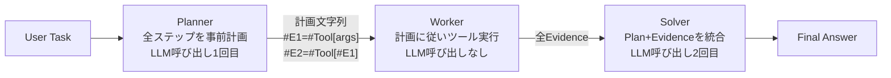

本記事は [ReWOO: Decoupling Reasoning from Observations for Efficient Augmented Language Models](https://arxiv.org/abs/2305.18323)（Xu et al., 2023）の解説記事です。

## 論文概要（Abstract）

ReWOO（Reasoning WithOut Observation）は、Augmented Language Model（ALM）における推論プロセスをツール実行結果の観察から分離し、トークン消費量を削減するフレームワークである。従来のReActパターンでは各推論ステップでLLMが過去のすべてのObservationを含むコンテキストを再読み込みするため、トークン消費が二次関数的に増大する。ReWOOはPlanner-Worker-Solverの3段階設計により、LLM呼び出しをPlanner（1回）とSolver（1回）の計2回に固定する。著者らは6つの公開NLPベンチマークと独自キュレーションデータセットで評価し、HotpotQAにおいてReActと比較して5倍のトークン効率と4ポイントの精度向上を報告している。

この記事は [Zenn記事: Bedrock Agentsカスタムオーケストレーターで配送ルート最適化の並列ツール実行を設計する](https://zenn.dev/0h_n0/articles/7264a42f5fe87e) の理論的基盤を解説するものです。

## 情報源

- **arXiv ID**: 2305.18323
- **URL**: [https://arxiv.org/abs/2305.18323](https://arxiv.org/abs/2305.18323)
- **著者**: Binfeng Xu, Zhiyuan Peng, Bowen Lei, Subhabrata Mukherjee, Yuchen Liu, Dongkuan Xu
- **発表年**: 2023
- **分野**: cs.CL, cs.AI
- **コード**: [https://github.com/billxbf/ReWOO](https://github.com/billxbf/ReWOO)

## 背景と動機（Background & Motivation）

ReActパターンでは、エージェントが「Thought -> Action -> Observation -> Thought -> ...」のループを繰り返す。この設計には構造的な非効率性がある。OpenAIのChatGPT APIはステートレスであるため、各推論ステップで過去のすべてのコンテキストプロンプト、Few-shot例、推論履歴、Observation結果をまとめてLLMに再送する必要がある。タスクの推論ステップ数が増えるほど、この冗長なプロンプトが膨張し、トークン消費は二次関数的に増大する。

著者らは論文Section 1で、Auto-GPTのようなALMシステムでは単一のマルチステップタスク実行で容易に1ドルを超えるAPI費用が発生すると指摘している。しかし、従来このトークン消費の削減に取り組んだ研究は存在しなかったとされている。ReWOOはこの問題に対して「LLMは中間のツール実行結果を逐次確認しなくても、事前に実行計画を立てられるのではないか」という仮説（著者らが"foreseeable reasoning"と呼ぶ能力）に基づいて提案されたフレームワークである。

## 主要な貢献（Key Contributions）

- **推論と観察の分離**: LLMの推論プロセスをツール実行結果の観察から構造的に分離するモジュラー設計（Planner-Worker-Solver）を提案。LLM呼び出しを2回に固定し、トークン消費を線形スケーリングに抑制
- **包括的な実験評価**: 6つの公開NLPベンチマークとキュレーションデータセット（SOTUQA）にわたり、ReActと比較して平均64%のトークン削減と4.4ポイントの絶対精度向上を報告。ツール障害時のロバスト性も実証
- **小規模モデルへの蒸留**: Plannerモジュールの推論能力をGPT-3.5（175Bパラメータ）からLLaMA 7Bへinstruction fine-tuningで転移する手法を提示。25倍小さいモデルでGPT-3.5と同等の計画生成性能を達成

## 技術的詳細（Technical Details）

### Planner-Worker-Solverアーキテクチャ

ReWOOは3つのモジュールで構成される。



**Planner**はLLMのforeseeable reasoning能力を活用し、タスク全体の解決計画を一括生成する。計画は連続するタプル$(Plan, \#E)$で構成され、$Plan$は各ステップの説明、$\#E_s$は対応するWorkerの実行結果を格納するプレースホルダー変数である。後続ステップの入力に前ステップの$\#E_s$を参照させることで、ステップ間の依存関係を表現する。

**Worker**はPlannerの計画に従い、指定されたツールを実行して$\#E_s$に実際のエビデンスを格納する。Worker段階ではLLM呼び出しは発生しない（LLMベースのツールを除く）。

**Solver**はすべてのPlanとEvidenceのペアを受け取り、最終回答を生成する。著者らは、Solverに提供されたエビデンスを「cautionを持って」使用するよう指示することで性能が向上したと報告している（論文Section 2.1）。

### Plannerの出力形式

論文Figure 1より、Plannerが生成する計画文字列の例を示す。

```text
Plan: Search for more information about The Hennchata.
#E1 = Wikipedia[The Hennchata]
Plan: Find out the main ingredient of The Hennchata.
#E2 = LLM[What is the main ingredient of The Hennchata? Given context: #E1]
Plan: Search for more information about the main ingredient.
#E3 = Wikipedia[#E2]
Plan: Find out the cognac house that makes the main ingredient.
#E4 = LLM[What is the name of the cognac house that makes #E2? Given context: #E3]
```

この例では`#E2`が`#E1`の結果に、`#E3`が`#E2`の結果に依存しているため、`#E1` -> `#E2` -> `#E3` -> `#E4`は順次実行される。依存関係のないステップが存在する場合は並列実行が可能である。

### トークン消費量の理論的比較

論文Section 2.2のEq.(1)およびEq.(2)より、2つのパラダイムのトークン消費量を比較する。

**ReAct（Observation依存推論）**: コンテキストプロンプト$C$、$n$個のFew-shot例$\mathcal{S}$、質問$Q$、$k$ステップの推論を行う場合の入力トークン総数は以下の通りである。

$$
\#Token_I^{TAO} = \underbrace{k\Theta(Q)}_{\text{Question}} + \underbrace{k\Theta(C)}_{\text{Context}} + \underbrace{k\Theta(\mathcal{S})}_{\text{Exemplars}} + \underbrace{\sum_{j=1}^{k-1} (k-j)\Theta(T_j + A_j + O_j)}_{\text{TAOs}}
$$

ここで$\Theta(p)$はテキスト列$p$のトークン数、$(T_j, A_j, O_j)$は第$j$ステップのThought・Action・Observationである。$C$と$\mathcal{S}$が毎ステップ再送されるため、ステップ数$k$に対して**二次関数的**にトークンが増大する。

**ReWOO**: PlannerとSolverの2回のLLM呼び出しのみであり、入力トークン総数は以下の通りである。

$$
\#Token_I^{ReWOO} = \underbrace{2\Theta(Q)}_{\text{Question}} + \underbrace{2\Theta(C)}_{\text{Context}} + \underbrace{\Theta(\mathcal{S})}_{\text{Exemplars}} + \underbrace{\sum_{j=1}^{k} \Theta(P_j + E_j)}_{\text{PEs}}
$$

ここで$(P_j, E_j)$は第$j$ステップの計画とエビデンスである。$C$と$\mathcal{S}$の係数が$k$から定数（2および1）に削減されるため、タスクの複雑さに対して**線形**にスケーリングする。

### Solverの入出力定義

Solverは以下の入力を受け取り、最終回答を生成する。

$$
\text{answer} = \text{LLM}_{\text{solver}}(\text{task}, \{(P_i, E_i)\}_{i=1}^{k})
$$

著者らが開示しているSolverプロンプト（論文Appendix B.2）は以下の通りである。

> "Solve the following task or problem. To solve the problem, we have made step-by-step Plan and retrieved corresponding Evidence to each Plan. Use them with caution since long evidence might contain irrelevant information."

## 実装のポイント（Implementation）

### 依存関係グラフの構築と並列実行

Plannerの出力から`#E{n}`の参照関係を解析し、依存関係グラフを構築することで並列実行可能なステップを特定できる。以下はその実装例である。

```python
import re
from collections import defaultdict


def build_dependency_graph(
    plan_steps: list[dict[str, str]],
) -> dict[str, list[str]]:
    """計画ステップから依存関係グラフを構築する。

    Args:
        plan_steps: 各ステップを表す辞書のリスト。
            例: [{"id": "#E1", "action": "Search[query]"}, ...]

    Returns:
        依存関係の隣接リスト。キーはステップID、値は依存先IDのリスト。
    """
    graph: dict[str, list[str]] = defaultdict(list)

    for step in plan_steps:
        step_id = step["id"]
        action = step["action"]
        refs = re.findall(r"#E\d+", action)
        for ref in refs:
            if ref != step_id:
                graph[step_id].append(ref)

    return dict(graph)


def get_parallel_batches(
    graph: dict[str, list[str]],
    all_steps: list[str],
) -> list[list[str]]:
    """トポロジカルソートで並列実行可能なバッチを生成する。

    Args:
        graph: 依存関係グラフ。
        all_steps: 全ステップIDのリスト。

    Returns:
        並列実行可能なバッチのリスト。各バッチ内のステップは
        互いに依存関係がなく同時実行できる。
    """
    in_degree: dict[str, int] = {s: 0 for s in all_steps}
    for step_id, deps in graph.items():
        in_degree[step_id] = len(deps)

    batches: list[list[str]] = []
    remaining = set(all_steps)

    while remaining:
        batch = [s for s in remaining if in_degree.get(s, 0) == 0]
        if not batch:
            break
        batches.append(sorted(batch))
        for completed in batch:
            remaining.remove(completed)
            for step_id, deps in graph.items():
                if completed in deps:
                    in_degree[step_id] -= 1

    return batches
```

### Plannerのプロンプト設計

論文Appendix B.2で開示されているPlannerプロンプトの構造は以下の通りである。

```text
For the following task, make plans that can solve the problem step by step.
For each plan, indicate which external tool together with tool input to
retrieve evidence. You can store the evidence into a variable #E that
can be called by later tools. (Plan, #E1, Plan, #E2, Plan, ...)

Tools can be one of the following:
(1) Wikipedia[input]: Worker that searches for similar page contents ...
(2) Google[input]: Worker that searches results from Google ...
(3) LLM[input]: A pretrained LLM like yourself ...
...

<Few-shot exemplars>

Begin! Describe your plans with rich details. Each Plan should be
followed by only one #E.
<Task>
```

Few-shot例は対象ベンチマークに応じて1-6件設定されている。著者らはHotpotQAに6件、TriviaQAとGSM8Kに各1件の例を使用したと報告している（論文Section 3.1）。

## Production Deployment Guide

ReWOOのPlanner-Worker-Solverパイプラインは、LLM呼び出しが2回に固定されるため、AWSサーバーレスアーキテクチャとの親和性が高い。以下に3つの規模の実装パターンを示す。

### 構成の比較

| 規模 | 月間リクエスト | 推奨構成 | 月額コスト概算 | 主要サービス |
|------|--------------|---------|-------------|------------|
| **Small** | ~3,000 (100/日) | Serverless | $30-80 | Lambda + Bedrock + SQS |
| **Medium** | ~30,000 (1,000/日) | Hybrid | $150-400 | ECS Fargate + Bedrock + ElastiCache |
| **Large** | 300,000+ (10,000/日) | Container | $800-2,000 | EKS + Karpenter + Spot Instances |

**コスト試算の注意事項**: 上記は2026年4月時点のAWS ap-northeast-1（東京）リージョン料金に基づく概算値です。ReWOOのコストはほぼLLM呼び出し2回分に収束するため、モデル選択が最大のコスト要因です。最新料金は [AWS料金計算ツール](https://calculator.aws/) で確認してください。

### Small構成: Lambda + SQS + Bedrock

```hcl
# -----------------------------------------------
# Small構成: ReWOO Planner-Worker-Solver on Lambda
# -----------------------------------------------

terraform {
  required_version = ">= 1.5"
  required_providers {
    aws = {
      source  = "hashicorp/aws"
      version = "~> 5.0"
    }
  }
}

provider "aws" {
  region = "ap-northeast-1"
}

# --- IAM Role ---
resource "aws_iam_role" "rewoo_lambda" {
  name = "rewoo-lambda-role"
  assume_role_policy = jsonencode({
    Version = "2012-10-17"
    Statement = [{
      Action = "sts:AssumeRole"
      Effect = "Allow"
      Principal = { Service = "lambda.amazonaws.com" }
    }]
  })
}

resource "aws_iam_role_policy_attachment" "lambda_basic" {
  role       = aws_iam_role.rewoo_lambda.name
  policy_arn = "arn:aws:iam::aws:policy/service-role/AWSLambdaBasicExecutionRole"
}

resource "aws_iam_role_policy" "bedrock_access" {
  name = "bedrock-invoke"
  role = aws_iam_role.rewoo_lambda.id
  policy = jsonencode({
    Version = "2012-10-17"
    Statement = [{
      Effect   = "Allow"
      Action   = ["bedrock:InvokeModel", "bedrock:InvokeModelWithResponseStream"]
      Resource = "arn:aws:bedrock:ap-northeast-1::foundation-model/*"
    }]
  })
}

# --- Lambda: Planner ---
resource "aws_lambda_function" "rewoo_planner" {
  filename      = "rewoo_planner.zip"
  function_name = "rewoo-planner"
  role          = aws_iam_role.rewoo_lambda.arn
  handler       = "index.handler"
  runtime       = "python3.12"
  timeout       = 90
  memory_size   = 512

  environment {
    variables = {
      MODEL_ID       = "anthropic.claude-sonnet-4-20250514"
      WORKER_QUEUE   = aws_sqs_queue.worker_tasks.url
      RESULT_TABLE   = aws_dynamodb_table.worker_results.name
      PLAN_CACHE     = aws_dynamodb_table.plan_cache.name
    }
  }
}

# --- SQS: Worker非同期実行キュー ---
resource "aws_sqs_queue" "worker_tasks" {
  name                       = "rewoo-worker-tasks"
  visibility_timeout_seconds = 120
  message_retention_seconds  = 3600
  redrive_policy = jsonencode({
    deadLetterTargetArn = aws_sqs_queue.worker_dlq.arn
    maxReceiveCount     = 3
  })
}

resource "aws_sqs_queue" "worker_dlq" {
  name                      = "rewoo-worker-tasks-dlq"
  message_retention_seconds = 86400
}

# --- Lambda: Worker ---
resource "aws_lambda_function" "rewoo_worker" {
  filename      = "rewoo_worker.zip"
  function_name = "rewoo-worker"
  role          = aws_iam_role.rewoo_lambda.arn
  handler       = "index.handler"
  runtime       = "python3.12"
  timeout       = 30
  memory_size   = 256

  environment {
    variables = {
      RESULT_TABLE = aws_dynamodb_table.worker_results.name
    }
  }
}

resource "aws_lambda_event_source_mapping" "worker_sqs" {
  event_source_arn                   = aws_sqs_queue.worker_tasks.arn
  function_name                      = aws_lambda_function.rewoo_worker.arn
  batch_size                         = 5
  maximum_batching_window_in_seconds = 5
}

# --- Lambda: Solver ---
resource "aws_lambda_function" "rewoo_solver" {
  filename      = "rewoo_solver.zip"
  function_name = "rewoo-solver"
  role          = aws_iam_role.rewoo_lambda.arn
  handler       = "index.handler"
  runtime       = "python3.12"
  timeout       = 60
  memory_size   = 512

  environment {
    variables = {
      MODEL_ID     = "anthropic.claude-sonnet-4-20250514"
      RESULT_TABLE = aws_dynamodb_table.worker_results.name
    }
  }
}

# --- DynamoDB: 計画キャッシュ + Worker結果 ---
resource "aws_dynamodb_table" "plan_cache" {
  name         = "rewoo-plan-cache"
  billing_mode = "PAY_PER_REQUEST"
  hash_key     = "task_hash"

  attribute {
    name = "task_hash"
    type = "S"
  }

  ttl {
    attribute_name = "expire_at"
    enabled        = true
  }
}

resource "aws_dynamodb_table" "worker_results" {
  name         = "rewoo-worker-results"
  billing_mode = "PAY_PER_REQUEST"
  hash_key     = "execution_id"
  range_key    = "step_id"

  attribute {
    name = "execution_id"
    type = "S"
  }

  attribute {
    name = "step_id"
    type = "S"
  }

  ttl {
    attribute_name = "expire_at"
    enabled        = true
  }
}

# --- Step Functions: オーケストレーション ---
resource "aws_sfn_state_machine" "rewoo_pipeline" {
  name     = "rewoo-pipeline"
  role_arn = aws_iam_role.step_functions.arn

  definition = jsonencode({
    Comment = "ReWOO Planner-Worker-Solver Pipeline"
    StartAt = "Planner"
    States = {
      Planner = {
        Type     = "Task"
        Resource = aws_lambda_function.rewoo_planner.arn
        Next     = "WaitForWorkers"
      }
      WaitForWorkers = {
        Type    = "Wait"
        Seconds = 10
        Next    = "CheckWorkerCompletion"
      }
      CheckWorkerCompletion = {
        Type     = "Task"
        Resource = aws_lambda_function.rewoo_checker.arn
        Next     = "WorkersComplete?"
      }
      "WorkersComplete?" = {
        Type = "Choice"
        Choices = [{
          Variable     = "$.all_complete"
          BooleanEquals = true
          Next         = "Solver"
        }]
        Default = "WaitForWorkers"
      }
      Solver = {
        Type     = "Task"
        Resource = aws_lambda_function.rewoo_solver.arn
        End      = true
      }
    }
  })
}

resource "aws_iam_role" "step_functions" {
  name = "rewoo-sfn-role"
  assume_role_policy = jsonencode({
    Version = "2012-10-17"
    Statement = [{
      Action = "sts:AssumeRole"
      Effect = "Allow"
      Principal = { Service = "states.amazonaws.com" }
    }]
  })
}

resource "aws_lambda_function" "rewoo_checker" {
  filename      = "rewoo_checker.zip"
  function_name = "rewoo-worker-checker"
  role          = aws_iam_role.rewoo_lambda.arn
  handler       = "index.handler"
  runtime       = "python3.12"
  timeout       = 10
  memory_size   = 128

  environment {
    variables = {
      RESULT_TABLE = aws_dynamodb_table.worker_results.name
    }
  }
}
```

### Medium構成: ECS Fargate + ElastiCache

Medium構成ではECS Fargateでステートフルなオーケストレーターを稼働させ、ElastiCacheでWorker結果の中間キャッシュを行う。

- **ECS Fargate**: Planner-Solver統合コンテナ（vCPU 0.5, メモリ 1GB）
- **ElastiCache（Redis）**: Worker結果の一時保存、TTL 1時間
- **Bedrock**: Claude Sonnet（Prompt Caching有効）
- **SQS FIFO**: Worker間の順序保証が必要な場合

### Large構成: EKS + Karpenter + Spot Instances

```hcl
# -----------------------------------------------
# Large構成: ReWOO on EKS with Karpenter
# -----------------------------------------------

module "eks" {
  source  = "terraform-aws-modules/eks/aws"
  version = "~> 20.0"

  cluster_name    = "rewoo-cluster"
  cluster_version = "1.31"

  vpc_id     = module.vpc.vpc_id
  subnet_ids = module.vpc.private_subnets

  eks_managed_node_groups = {
    system = {
      instance_types = ["m7i.large"]
      min_size       = 2
      max_size       = 3
      desired_size   = 2
      labels = {
        role = "system"
      }
    }
  }

  tags = {
    Environment = "production"
    Project     = "rewoo"
  }
}

# --- Karpenter NodePool: Worker用Spot ---
resource "kubectl_manifest" "karpenter_nodepool_worker" {
  yaml_body = yamlencode({
    apiVersion = "karpenter.sh/v1"
    kind       = "NodePool"
    metadata = {
      name = "rewoo-workers"
    }
    spec = {
      template = {
        metadata = {
          labels = {
            role = "rewoo-worker"
          }
        }
        spec = {
          requirements = [
            {
              key      = "karpenter.sh/capacity-type"
              operator = "In"
              values   = ["spot", "on-demand"]
            },
            {
              key      = "node.kubernetes.io/instance-type"
              operator = "In"
              values   = ["m7i.medium", "m7i.large", "m6i.medium", "m6i.large", "c7i.medium", "c7i.large"]
            }
          ]
          nodeClassRef = {
            group = "karpenter.k8s.aws"
            kind  = "EC2NodeClass"
            name  = "default"
          }
        }
      }
      limits = {
        cpu    = "100"
        memory = "200Gi"
      }
      disruption = {
        consolidationPolicy = "WhenEmptyOrUnderutilized"
        consolidateAfter    = "30s"
      }
    }
  })
}

# --- Karpenter NodePool: Planner/Solver用On-Demand ---
resource "kubectl_manifest" "karpenter_nodepool_orchestrator" {
  yaml_body = yamlencode({
    apiVersion = "karpenter.sh/v1"
    kind       = "NodePool"
    metadata = {
      name = "rewoo-orchestrator"
    }
    spec = {
      template = {
        metadata = {
          labels = {
            role = "rewoo-orchestrator"
          }
        }
        spec = {
          requirements = [
            {
              key      = "karpenter.sh/capacity-type"
              operator = "In"
              values   = ["on-demand"]
            },
            {
              key      = "node.kubernetes.io/instance-type"
              operator = "In"
              values   = ["m7i.large", "m7i.xlarge"]
            }
          ]
          nodeClassRef = {
            group = "karpenter.k8s.aws"
            kind  = "EC2NodeClass"
            name  = "default"
          }
        }
      }
      limits = {
        cpu    = "32"
        memory = "64Gi"
      }
    }
  })
}
```

### CloudWatch / X-Ray 監視設定

```hcl
# --- CloudWatch Alarms ---
resource "aws_cloudwatch_metric_alarm" "planner_errors" {
  alarm_name          = "rewoo-planner-errors"
  comparison_operator = "GreaterThanThreshold"
  evaluation_periods  = 2
  metric_name         = "Errors"
  namespace           = "AWS/Lambda"
  period              = 300
  statistic           = "Sum"
  threshold           = 5
  alarm_description   = "Planner Lambda errors exceed threshold"
  alarm_actions       = [aws_sns_topic.alerts.arn]

  dimensions = {
    FunctionName = aws_lambda_function.rewoo_planner.function_name
  }
}

resource "aws_cloudwatch_metric_alarm" "solver_duration" {
  alarm_name          = "rewoo-solver-high-latency"
  comparison_operator = "GreaterThanThreshold"
  evaluation_periods  = 3
  metric_name         = "Duration"
  namespace           = "AWS/Lambda"
  period              = 300
  statistic           = "p99"
  threshold           = 45000
  alarm_description   = "Solver p99 latency exceeds 45s"
  alarm_actions       = [aws_sns_topic.alerts.arn]

  dimensions = {
    FunctionName = aws_lambda_function.rewoo_solver.function_name
  }
}

resource "aws_cloudwatch_metric_alarm" "worker_dlq_depth" {
  alarm_name          = "rewoo-worker-dlq-messages"
  comparison_operator = "GreaterThanThreshold"
  evaluation_periods  = 1
  metric_name         = "ApproximateNumberOfMessagesVisible"
  namespace           = "AWS/SQS"
  period              = 300
  statistic           = "Sum"
  threshold           = 0
  alarm_description   = "Dead letter queue has unprocessed messages"
  alarm_actions       = [aws_sns_topic.alerts.arn]

  dimensions = {
    QueueName = aws_sqs_queue.worker_dlq.name
  }
}

resource "aws_sns_topic" "alerts" {
  name = "rewoo-alerts"
}

# --- X-Ray Tracing ---
resource "aws_lambda_function" "rewoo_planner_xray" {
  # Planner Lambda に X-Ray トレーシングを追加
  # (既存の rewoo_planner リソースに以下を追加)
  tracing_config {
    mode = "Active"
  }
}

# --- CloudWatch Logs Insights クエリ例 ---
# Planner計画品質分析:
# fields @timestamp, execution_id, plan_step_count, solver_confidence
# | stats avg(plan_step_count) as avg_steps,
#         avg(solver_confidence) as avg_conf
#         by bin(1h)
# | filter solver_confidence < 0.5

# Worker実行時間分析:
# fields @timestamp, step_id, tool_name, duration_ms
# | stats avg(duration_ms) as avg_ms,
#         max(duration_ms) as max_ms,
#         count(*) as invocations
#         by tool_name
# | sort avg_ms desc

# エラー率トレンド:
# fields @timestamp, @message
# | filter @message like /ERROR/
# | stats count(*) as error_count by bin(5m)
```

### コスト最適化チェックリスト（20項目）

**LLM呼び出し最適化**

- [ ] LLM呼び出しがPlanner + Solverの2回のみであることを確認（Worker内のLLMツールは別カウント）
- [ ] Bedrock Prompt Cachingを有効化し、システムプロンプト部分のキャッシュヒット率を監視
- [ ] Plannerのmax_tokensを計画生成に必要な最小値（1024-2048）に制限
- [ ] Solverのmax_tokensを回答生成に必要な最小値（256-512）に制限
- [ ] 類似タスクのPlanner出力をDynamoDBにキャッシュし、キャッシュヒット時はLLM呼び出しをスキップ

**Worker最適化**

- [ ] Worker用Lambdaのメモリサイズを256MBに制限（LLM呼び出し不要のため低スペックで十分）
- [ ] 依存関係のないWorkerステップをSQSバッチで並列実行
- [ ] Worker Lambdaのタイムアウトを30秒に設定（ツール応答の上限）
- [ ] DLQ（Dead Letter Queue）でリトライ上限3回を設定し、無限リトライを防止
- [ ] Worker結果のDynamoDB TTLを1時間に設定し、ストレージコストを抑制

**インフラ最適化**

- [ ] Lambda Graviton2（arm64）ランタイムでコスト20%削減
- [ ] Step Functionsの代わりにSQS + Lambda Event Source MappingでSolver起動を検討（Express Workflowsより安価な場合あり）
- [ ] Large構成ではKarpenter Spot Instancesを使用し、Worker Podのコストを最大70%削減
- [ ] ElastiCache（Medium構成）のノードサイズをcache.t4g.microから開始し、監視に基づいてスケール

**監視・運用**

- [ ] CloudWatch Logs Insightsでトークン消費量を日次集計し、異常な増加を検知
- [ ] X-Rayトレーシングでend-to-endレイテンシを可視化し、ボトルネックを特定
- [ ] Planner計画品質メトリクス（ステップ数、ツール使用分布）をCloudWatchカスタムメトリクスとして送信
- [ ] Solver信頼度スコアが閾値以下の場合にアラートを発報
- [ ] 月次コストレポートでLLM呼び出し費用とインフラ費用の比率を確認
- [ ] Bedrock利用量のService Quotasアラームを設定し、スロットリングを事前検知

## 実験結果（Results）

### 主要ベンチマーク比較

論文Table 2より、gpt-3.5-turboベースの各手法の評価結果を以下に示す。Accはgpt-4ベースの意味的精度、#Tokensは平均入力トークン数、$Cost_{1k}$は1000クエリあたりのAPI費用（USD）である。

| データセット | 手法 | Acc | F1 | EM | #Tokens | $Cost_{1k} |
|------------|------|-----|-----|-----|---------|-----------|
| **HotpotQA** (1000件) | Direct | 37.8 | 36.2 | 28.0 | 55.5 | $0.11 |
| | CoT | 41.6 | 30.8 | 22.4 | 481.9 | $0.96 |
| | ReAct | 40.8 | 39.6 | **32.2** | 9,795.1 | $19.59 |
| | **ReWOO** | **42.4** | **40.1** | 30.4 | **1,986.2** | **$3.97** |
| **TriviaQA** (1000件) | Direct | 80.6 | 74.0 | 64.2 | 43.4 | $0.09 |
| | ReAct | 59.4 | 53.2 | 47.4 | 4,212.9 | $8.43 |
| | **ReWOO** | **66.6** | **60.6** | **51.8** | **1,340.9** | **$2.68** |
| **GSM8K** (1000件) | CoT | **67.4** | **62.7** | - | 495.6 | $0.99 |
| | ReAct | 62.0 | 37.3 | - | 1,874.3 | $3.75 |
| | **ReWOO** | **62.4** | 36.2 | - | **1,089.3** | **$2.18** |
| **StrategyQA** (300件) | ReAct | 64.6 | 64.6 | 64.6 | 1,686.3 | $3.37 |
| | **ReWOO** | **66.6** | **66.6** | **66.6** | **1,287.1** | **$2.57** |
| **PhysicsQA** (53件) | ReAct | 64.1 | 16.2 | - | 2,163.3 | $4.33 |
| | **ReWOO** | **66.0** | 14.0 | - | **1,225.7** | **$2.45** |
| **SportsU.** (300件) | ReAct | 58.6 | 51.9 | 49.3 | 1,720.0 | $3.44 |
| | **ReWOO** | **61.3** | **55.8** | **55.3** | **854.2** | **$1.71** |
| **SOTUQA** (Curated) | ReAct | 64.8 | 42.7 | - | 1,840.3 | $3.68 |
| | **ReWOO** | **70.2** | **44.8** | - | **1,048.8** | **$2.09** |

著者らは、6つの公開ベンチマーク全体で平均してReWOOがReActに対して**トークン消費を64%削減**し、**精度を4.4ポイント向上**させたと報告している（論文Section 3.2.1）。HotpotQAではReActの9,795トークンに対してReWOOは1,986トークン（約5倍の効率化）を達成している。

### ツール障害時のロバスト性

論文Table 3より、全ツールが"No evidence found."を返す障害シナリオでのHotpotQA結果を示す。

| 条件 | 手法 | Acc | #Tokens | $Cost_{1k} |
|------|------|-----|---------|-----------|
| 正常時 | ReAct | 40.8 | 9,795.1 | $21.29 |
| | ReWOO | **42.4** | 1,986.2 | $3.97 |
| 障害時の変化量 | ReAct | **-40.8** | +851.1 | +$1.70 |
| | ReWOO | **-29.2** | -110.8 | -$0.22 |

ReActは障害時にAccが40.8ポイント低下（実質0%）しているのに対し、ReWOOは29.2ポイントの低下に留まっている（論文Table 3）。著者らは、ReActではツール障害時に無限ループ（toolA失敗 -> toolB試行 -> toolB失敗 -> toolA再試行 -> ...）が発生しトークン制限に達するケースが多いのに対し、ReWOOはPlannerが障害と無関係に合理的な計画を生成できるためと分析している（論文Appendix A.2）。

### 小規模モデルへの蒸留

論文Figure 6より、ReWOOのPlannerモジュールをGPT-3.5からAlpaca 7B、Planner 7B（Alpaca 7BをPlanner計画データで追加fine-tuning）に置き換えた場合の比較を以下に示す。

著者らは、HotpotQAとTriviaQAの訓練データからGPT-3.5で4,000件の計画軌跡を生成し、正解に至った約2,000件をフィルタしてPlanner instructionデータとした。Alpaca 7BをLoRA（r=8、学習率1e-4、バッチサイズ128）で10エポックfine-tuningし、Planner 7Bを得ている（論文Appendix B.1）。

著者らはHotpotQA、TriviaQA、StrategyQAにおいて、Planner 7BがGPT-3.5（175Bパラメータ）と同等の性能を達成したと報告している（論文Figure 6）。訓練データに含まれないGoogleやCalculatorツールに対しても、in-context descriptionと組み合わせることで対応可能であったとされている。

## 実運用への応用（Practical Applications）

### Bedrock Agentsカスタムオーケストレーターとの関連

[関連Zenn記事](https://zenn.dev/0h_n0/articles/7264a42f5fe87e)で解説されているBedrock Agentsのカスタムオーケストレーターは、ReWOOのPlanner-Worker-Solver分離を実装する有力な方法の一つである。Bedrockのカスタムオーケストレーターではユーザーが推論ループの各フェーズを制御でき、以下のようにReWOOの3段階に対応させることが可能とされている。

- **Planner段階**: カスタムオーケストレーターの初回呼び出しで、全ステップの計画文字列を生成
- **Worker段階**: 生成された計画をパースし、Action Groupsの各ツールを依存関係に従って順次/並列に実行
- **Solver段階**: 全Worker結果を集約し、最終回答をLLMで生成

### 配送ルート最適化での適用

関連Zenn記事が扱う配送ルート最適化問題は、ReWOOが有効な典型的ユースケースである。配送計画タスクでは「顧客情報取得 -> 距離行列計算 -> ルート最適化 -> コスト計算」のように処理パイプラインが事前に定義でき、各ステップのツール（データベース検索、地理API、最適化ソルバー）が予測可能であるためである。

### ReWOOが不向きなケース

論文Section 4で著者らが議論している制約として、以下のケースではReWOOは不適切とされている。

- **環境探索型タスク**: AlfWorldのように、行動結果を逐次観察して次の行動を決める必要があるタスク。Plannerが環境に関する事前知識を持たないため、全可能性を列挙する計画が必要になり、最悪ケースではReActと同等のステップ数になる
- **対話的タスク**: ユーザーの追加入力に応じて方針変更が必要な場合
- **計画修正が必要なタスク**: 中間結果が予想と大きく異なり、計画の根本的な見直しが必要な場合

## 関連研究（Related Work）

- **ReAct**（Yao et al., 2023, [arXiv:2210.03629](https://arxiv.org/abs/2210.03629)）: Thought-Action-Observationの逐次推論型フレームワーク。ReWOOの主要な比較対象であり、ReWOOはReActの「推論と観察の結合」を分離することでトークン効率を改善
- **Toolformer**（Schick et al., 2023, [arXiv:2302.04761](https://arxiv.org/abs/2302.04761)）: LLMが自律的にツール使用を学習する手法。自己教師あり学習でfine-tuningが必要だが、独立したツール呼び出しに限定されマルチステップ推論には対応していない
- **HuggingGPT**（Shen et al., 2023, [arXiv:2303.17580](https://arxiv.org/abs/2303.17580)）: LLMをコントローラーとして複数のAIモデルを連携させるフレームワーク。ReWOOのPlanner-Worker-Solver構造と類似するが、WorkerがAIモデルである点が異なる
- **ART**（Paranjape et al., 2023, [arXiv:2303.09014](https://arxiv.org/abs/2303.09014)）: Automatic Reasoning and Tool-use。タスクライブラリからの自動検索による推論テンプレート生成

## まとめと今後の展望

ReWOOは推論と観察を構造的に分離するモジュラー設計により、ALMシステムのトークン消費をReAct比で平均64%削減し、6ベンチマーク全体で精度を4.4ポイント向上させたフレームワークである。ツール障害時のロバスト性も実証されており、さらに175BパラメータのGPT-3.5の計画生成能力を7BのLLaMAに蒸留できることが示されている。

一方で、計画の動的修正ができないという構造的制約があり、環境探索型タスクや対話的タスクには不向きである。著者らは今後の方向性として、モジュールごとのfine-tuning、ツール表現学習、DAGベースのシステムグラフ最適化を挙げている（論文Section 4）。

## 参考文献

- Xu, B., Peng, Z., Lei, B., Mukherjee, S., Liu, Y., & Xu, D. (2023). ReWOO: Decoupling Reasoning from Observations for Efficient Augmented Language Models. [arXiv:2305.18323](https://arxiv.org/abs/2305.18323)
- Yao, S., Zhao, J., Yu, D., Du, N., Shafran, I., Narasimhan, K., & Cao, Y. (2023). ReAct: Synergizing Reasoning and Acting in Language Models. ICLR 2023. [arXiv:2210.03629](https://arxiv.org/abs/2210.03629)
- Schick, T. et al. (2023). Toolformer: Language Models Can Teach Themselves to Use Tools. [arXiv:2302.04761](https://arxiv.org/abs/2302.04761)
- Shen, Y. et al. (2023). HuggingGPT: Solving AI Tasks with ChatGPT and its Friends in Hugging Face. [arXiv:2303.17580](https://arxiv.org/abs/2303.17580)
- **関連Zenn記事**: [Bedrock Agentsカスタムオーケストレーターで配送ルート最適化の並列ツール実行を設計する](https://zenn.dev/0h_n0/articles/7264a42f5fe87e)
- **公式実装**: [https://github.com/billxbf/ReWOO](https://github.com/billxbf/ReWOO)
