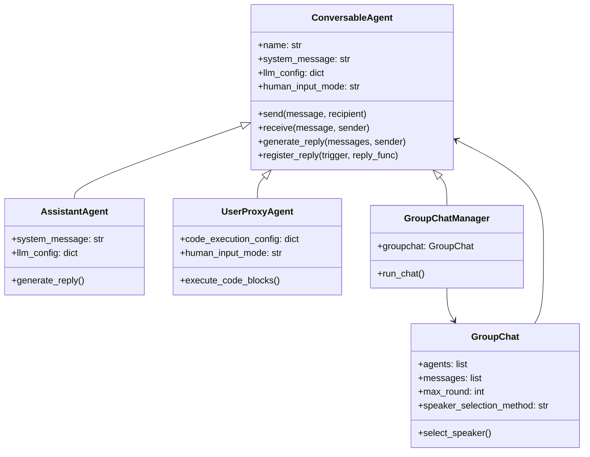
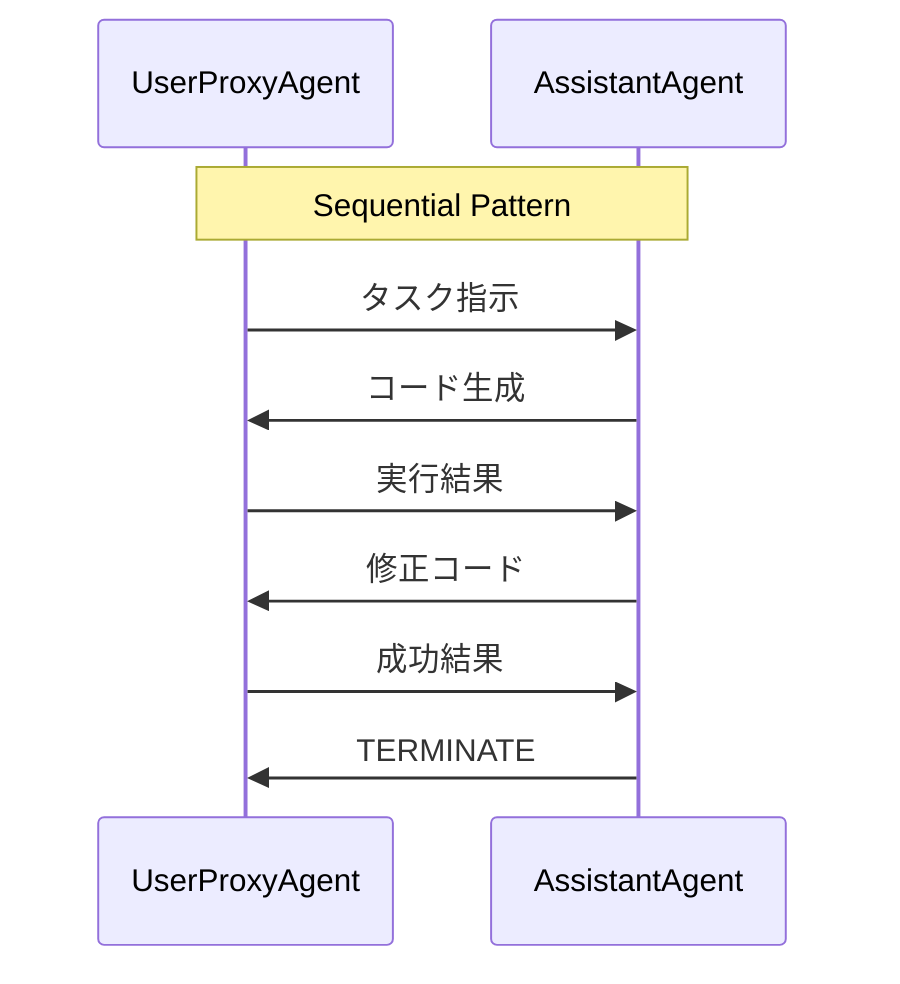

本記事は [arXiv:2308.08155 AutoGen: Enabling Next-Gen LLM Applications via Multi-Agent Conversation](https://arxiv.org/abs/2308.08155) の解説記事です。

## 論文概要（Abstract）

AutoGenは、複数のエージェントが相互に会話することでタスクを遂行するLLMアプリケーションを構築するためのオープンソースフレームワークである。各エージェントはカスタマイズ可能かつ会話可能であり、LLM・人間入力・ツールを組み合わせた多様なモードで動作する。自然言語とコードの両方を用いて柔軟な会話パターンをプログラミングでき、数学・コーディング・QA・オペレーションズリサーチ・オンライン意思決定など幅広いドメインでの有効性が実証されている（論文Abstractより）。

この記事は [Zenn記事: Bedrock Agentsカスタムオーケストレーターで配送ルート最適化の並列ツール実行を設計する](https://zenn.dev/0h_n0/articles/7264a42f5fe87e) の深掘りです。

## 情報源

- **arXiv ID**: 2308.08155
- **URL**: [https://arxiv.org/abs/2308.08155](https://arxiv.org/abs/2308.08155)
- **著者**: Qingyun Wu, Gagan Bansal, Jieyu Zhang, Yiran Wu, Beibin Li, Erkang Zhu, Li Jiang, Xiaoyun Zhang, Shaokun Zhang, Jiale Liu, Ahmed Hassan Awadallah, Ryen W. White, Doug Burger, Chi Wang（Microsoft Research）
- **発表年**: 2023（初版2023年8月、改訂版2023年10月）
- **分野**: cs.AI, cs.CL
- **コード**: [GitHub: microsoft/autogen](https://github.com/microsoft/autogen) -> 後継 [GitHub: ag2ai/ag2](https://github.com/ag2ai/ag2)（MITライセンス）

## 背景と動機（Background & Motivation）

LLMの急速な発展により、コード生成・推論・対話といった個々のタスクでは高い性能が達成されている。しかし、現実のアプリケーションでは複数のステップを跨ぐ複雑なワークフロー、人間によるフィードバックの統合、外部ツールの呼び出しなどが必要となる。単一エージェントの限界として、著者らは以下の課題を指摘している。

1. **タスク分解の困難さ**: 複雑なタスクを1つのLLM呼び出しで解決しようとすると、エラーの伝播や品質低下が生じる
2. **人間介入の組み込み困難**: 単一エージェント設計では、人間のフィードバックをワークフローの途中で自然に取り込む仕組みが欠如する
3. **スケーラビリティの制約**: タスクの種類が増えるたびに専用のプロンプトチェーンを設計する必要があり、再利用性が低い

これらの課題に対して、著者らは「会話（conversation）」を統一的な抽象として採用することで、エージェント間の協調を柔軟に設計できるフレームワークを提案した。会話ベースの設計により、エージェントの追加・削除が容易になり、人間とAIを同一インターフェースで扱えるようになる点がAutoGenの中核的な設計思想である。

## 主要な貢献（Key Contributions）

- **会話可能エージェント（ConversableAgent）の設計**: LLM・人間・ツールを統一的に扱う`ConversableAgent`基底クラスを導入し、エージェントの構成・拡張を容易にした。`AssistantAgent`（LLMベースの応答生成）と`UserProxyAgent`（人間入力の代理・コード実行）を具象クラスとして提供している
- **柔軟な会話パターンの定型化**: Sequential（二者間往復）、Group Chat（複数エージェント参加・発言者選択）、Nested Chat（会話内で別会話を起動）の3パターンを定義し、これらの組み合わせで多様なワークフローを構築できることを示した
- **6領域での実証評価**: 数学（MATH）、コーディング（HumanEval）、QA、オペレーションズリサーチ（OptiGuide）、オンライン意思決定、ゲームの6タスク群で、マルチエージェント設計がシングルエージェントに対して性能向上をもたらすことを実験的に示した

## 技術的詳細（Technical Details）

### ConversableAgentアーキテクチャ

AutoGenのアーキテクチャは、全エージェントの基盤となる`ConversableAgent`クラスを中心に設計されている。以下にクラス階層と会話フローを示す。



`ConversableAgent`は以下の3つの応答生成メカニズムを内部に持つ。

1. **LLMベース応答**: `llm_config`で指定されたモデルにメッセージ履歴を渡して応答を生成
2. **コード実行応答**: 受信メッセージ中のコードブロックをDockerコンテナまたはローカル環境で実行し、結果を返却
3. **人間入力応答**: `human_input_mode`の設定に応じて、人間にプロンプトを表示し入力を取得

これらのメカニズムは`register_reply`メソッドで優先順位を制御でき、後から登録された関数が先にチェックされる設計になっている。

### 会話パターン

AutoGenが定義する3つの会話パターンについて、それぞれのメッセージフローを以下に示す。



Sequential（逐次）パターンでは、2つのエージェントが交互にメッセージを送り合う。`AssistantAgent`がコードを生成し、`UserProxyAgent`がそれを実行して結果をフィードバックするループが典型例である。

Group Chatパターンでは、`GroupChatManager`が発言者選択（speaker selection）を担う。選択方法として`auto`（LLMが次の発言者を決定）、`round_robin`（順番に発言）、`random`（ランダム選択）、`manual`（人間が選択）の4種が提供されている。

$$
\text{next\_speaker} = \arg\max_{a \in \mathcal{A}} P_{\text{LLM}}(a \mid \mathbf{m}_{1:t}, \text{role\_descriptions})
$$

ここで、
- $\mathcal{A}$: 参加エージェントの集合
- $\mathbf{m}_{1:t}$: 時刻 $t$ までのメッセージ履歴
- $P_{\text{LLM}}$: LLMによる発言者選択確率（`auto`モード時）

Nested Chatパターンでは、あるエージェントの`generate_reply`内で別のエージェントペアとの新しい会話セッションを起動する。これにより、サブタスクの委譲やリフレクション（自己検証）のワークフローが実現される。

### 会話終了制御

AutoGenでは、会話の終了条件を明示的に設定する必要がある。`is_termination_msg`パラメータで終了判定関数を指定し、特定のキーワード（例: `"TERMINATE"`）を含むメッセージを受信した際に会話を終了する。また、`max_consecutive_auto_reply`で連続自動応答回数の上限を設定できる。著者らは、この終了制御の設計がマルチエージェントシステムの安定性にとって重要であると述べている。

## 実装のポイント（Implementation）

### 基本的な二者間会話

```python
from autogen import AssistantAgent, UserProxyAgent


def create_coding_agents(
    model: str = "gpt-4",
    work_dir: str = "./workspace",
) -> tuple[AssistantAgent, UserProxyAgent]:
    """コード生成・実行の二者間エージェントを構築する。

    Args:
        model: 使用するLLMモデル名
        work_dir: コード実行用の作業ディレクトリ

    Returns:
        AssistantAgentとUserProxyAgentのタプル
    """
    assistant = AssistantAgent(
        name="code_assistant",
        system_message=(
            "あなたはPythonコード生成アシスタントです。"
            "ユーザーの要求に対してPythonコードを生成してください。"
            "タスクが完了したら TERMINATE と応答してください。"
        ),
        llm_config={"model": model, "temperature": 0},
    )

    user_proxy = UserProxyAgent(
        name="executor",
        human_input_mode="NEVER",
        max_consecutive_auto_reply=5,
        is_termination_msg=lambda msg: "TERMINATE" in msg.get("content", ""),
        code_execution_config={
            "work_dir": work_dir,
            "use_docker": True,
        },
    )

    return assistant, user_proxy
```

### ツール登録

```python
from typing import Annotated

from autogen import ConversableAgent, register_function


def get_weather(
    city: Annotated[str, "都市名（例: Tokyo）"],
) -> dict[str, str | float]:
    """指定都市の天気情報を取得する。

    Args:
        city: 天気を取得する都市名

    Returns:
        都市名、天気、気温を含む辞書
    """
    # 実際のAPIコールに置き換える
    return {"city": city, "weather": "sunny", "temperature": 22.5}


def register_weather_tool(
    assistant: ConversableAgent,
    executor: ConversableAgent,
) -> None:
    """天気取得ツールをエージェントに登録する。

    Args:
        assistant: ツールを呼び出すエージェント
        executor: ツールを実行するエージェント
    """
    register_function(
        get_weather,
        caller=assistant,
        executor=executor,
        name="get_weather",
        description="指定都市の天気情報を取得する",
    )
```

### GroupChat設定

```python
from autogen import AssistantAgent, GroupChat, GroupChatManager


def create_planning_group(
    model: str = "gpt-4",
    max_round: int = 15,
) -> GroupChatManager:
    """計画立案用のグループチャットを構築する。

    Args:
        model: 使用するLLMモデル名
        max_round: 最大会話ラウンド数

    Returns:
        GroupChatManagerインスタンス
    """
    planner = AssistantAgent(
        name="planner",
        system_message="タスクを分解し実行計画を立案するエージェントです。",
        llm_config={"model": model},
    )

    coder = AssistantAgent(
        name="coder",
        system_message="計画に基づいてPythonコードを生成するエージェントです。",
        llm_config={"model": model},
    )

    reviewer = AssistantAgent(
        name="reviewer",
        system_message="生成コードの品質をレビューし改善提案するエージェントです。",
        llm_config={"model": model},
    )

    group_chat = GroupChat(
        agents=[planner, coder, reviewer],
        messages=[],
        max_round=max_round,
        speaker_selection_method="auto",
        allow_repeat_speaker=False,
    )

    manager = GroupChatManager(
        groupchat=group_chat,
        llm_config={"model": model},
    )

    return manager
```

`speaker_selection_method="auto"`を指定すると、`GroupChatManager`がメッセージ履歴とエージェントのロール記述に基づいて次の発言者をLLMで自動選択する。`allow_repeat_speaker=False`により同一エージェントの連続発言を防ぎ、会話の膠着を回避する。

## Production Deployment Guide

AutoGenベースのマルチエージェントシステムをAWS上で運用するためのアーキテクチャパターンを、トラフィック量別に示す。なお、以下のコスト試算は2026年4月時点のAWS東京リージョン（ap-northeast-1）の料金に基づく概算値であり、実際のコストはトラフィックパターン、リージョン、バースト使用量により変動する。最新料金は[AWS料金計算ツール](https://calculator.aws/)で確認を推奨する。

### AWS実装パターン（コスト最適化重視）

| 構成 | トラフィック | コンピュート | 状態管理 | LLM | 月額目安 |
|------|------------|------------|---------|-----|---------|
| Small | ~100 req/日 | Lambda | DynamoDB | Bedrock (Claude) | $50-150 |
| Medium | ~1,000 req/日 | ECS Fargate | Redis (ElastiCache) + SQS | Bedrock (Claude) | $300-800 |
| Large | 10,000+ req/日 | EKS + Spot | ElastiCache Cluster + SQS FIFO | Bedrock (Claude) | $2,000-5,000 |

**Small構成の内訳**（~100 req/日想定）:
- Lambda: 100 req x 平均120秒 x 1024MB = 月12,000GB秒 -> 約$2.40（Free Tier超過分）
- DynamoDB On-Demand: 100 req x 3 read/write -> 約$0.50
- Bedrock Claude 3.5 Sonnet: 100 req x 平均3,000トークン -> 約$45
- CloudWatch Logs: 約$3
- 合計: 約$50-55（LLMコスト比率約85%）

**Medium構成の内訳**（~1,000 req/日想定）:
- ECS Fargate: 2 vCPU x 4GB x 24h = 約$120/月
- ElastiCache (cache.t3.micro): 約$13/月
- SQS: 約$1/月
- Bedrock Claude 3.5 Sonnet: 1,000 req x 平均3,000トークン -> 約$450/月
- 合計: 約$600

**Large構成の内訳**（10,000+ req/日想定）:
- EKS Control Plane: $73/月
- EC2 Spot (m5.xlarge x 3): 約$180/月（Spot割引後）
- ElastiCache (cache.r6g.large): 約$120/月
- SQS FIFO: 約$5/月
- Bedrock Claude 3.5 Sonnet: 10,000 req x 平均3,000トークン -> 約$4,500/月
- 合計: 約$4,900

**コスト削減テクニック**:
- Bedrock Batch API使用で推論コスト50%削減（リアルタイム性不要のバッチ処理向け）
- Prompt Caching有効化で同一プレフィックスのプロンプトコスト30-90%削減
- Spot Instances活用でEC2コスト最大90%削減（EKS Large構成）
- Reserved Instances（1年コミット）でオンデマンド比最大72%削減

### Terraformインフラコード

#### Small構成（Serverless）: Lambda + Bedrock + DynamoDB

```hcl
# small_autogen_stack.tf
# AutoGen マルチエージェント - Small構成 (Serverless)

terraform {
  required_version = ">= 1.9"
  required_providers {
    aws = {
      source  = "hashicorp/aws"
      version = "~> 5.80"
    }
  }
}

provider "aws" {
  region = "ap-northeast-1"
}

# ---------- IAM ----------
resource "aws_iam_role" "autogen_lambda" {
  name = "autogen-lambda-role"
  assume_role_policy = jsonencode({
    Version = "2012-10-17"
    Statement = [{
      Action    = "sts:AssumeRole"
      Effect    = "Allow"
      Principal = { Service = "lambda.amazonaws.com" }
    }]
  })
}

resource "aws_iam_role_policy" "autogen_lambda" {
  name = "autogen-lambda-policy"
  role = aws_iam_role.autogen_lambda.id
  policy = jsonencode({
    Version = "2012-10-17"
    Statement = [
      {
        Effect = "Allow"
        Action = [
          "bedrock:InvokeModel",
          "bedrock:InvokeModelWithResponseStream",
        ]
        Resource = "arn:aws:bedrock:ap-northeast-1::foundation-model/anthropic.claude-3-5-sonnet-*"
      },
      {
        Effect = "Allow"
        Action = [
          "dynamodb:PutItem",
          "dynamodb:GetItem",
          "dynamodb:Query",
          "dynamodb:UpdateItem",
        ]
        Resource = aws_dynamodb_table.conversations.arn
      },
      {
        Effect = "Allow"
        Action = [
          "logs:CreateLogGroup",
          "logs:CreateLogStream",
          "logs:PutLogEvents",
        ]
        Resource = "arn:aws:logs:ap-northeast-1:*:*"
      },
    ]
  })
}

# ---------- DynamoDB ----------
resource "aws_dynamodb_table" "conversations" {
  name         = "autogen-conversations"
  billing_mode = "PAY_PER_REQUEST"
  hash_key     = "session_id"
  range_key    = "turn_id"

  attribute {
    name = "session_id"
    type = "S"
  }
  attribute {
    name = "turn_id"
    type = "N"
  }

  ttl {
    attribute_name = "expires_at"
    enabled        = true
  }

  server_side_encryption {
    enabled = true
  }
}

# ---------- Lambda ----------
resource "aws_lambda_function" "autogen_handler" {
  function_name = "autogen-multi-agent"
  role          = aws_iam_role.autogen_lambda.arn
  handler       = "handler.lambda_handler"
  runtime       = "python3.12"
  timeout       = 900 # マルチエージェント会話は長時間化しうる
  memory_size   = 1024

  filename         = "lambda_package.zip"
  source_code_hash = filebase64sha256("lambda_package.zip")

  environment {
    variables = {
      DYNAMODB_TABLE        = aws_dynamodb_table.conversations.name
      BEDROCK_MODEL_ID      = "anthropic.claude-3-5-sonnet-20241022-v2:0"
      MAX_CONVERSATION_TURNS = "10"
    }
  }
}

# ---------- CloudWatch Alarm (コスト監視) ----------
resource "aws_cloudwatch_metric_alarm" "lambda_duration" {
  alarm_name          = "autogen-lambda-duration-high"
  comparison_operator = "GreaterThanThreshold"
  evaluation_periods  = 3
  metric_name         = "Duration"
  namespace           = "AWS/Lambda"
  period              = 300
  statistic           = "p95"
  threshold           = 600000 # 600秒超過で警告
  alarm_actions       = [] # SNS ARNを設定

  dimensions = {
    FunctionName = aws_lambda_function.autogen_handler.function_name
  }
}
```

#### Large構成（Container）: EKS + Karpenter + Spot Instances

```hcl
# large_autogen_stack.tf
# AutoGen マルチエージェント - Large構成 (EKS)

terraform {
  required_version = ">= 1.9"
  required_providers {
    aws = {
      source  = "hashicorp/aws"
      version = "~> 5.80"
    }
  }
}

provider "aws" {
  region = "ap-northeast-1"
}

# ---------- EKS Cluster ----------
module "eks" {
  source  = "terraform-aws-modules/eks/aws"
  version = "~> 20.31"

  cluster_name    = "autogen-agents"
  cluster_version = "1.31"

  vpc_id     = var.vpc_id
  subnet_ids = var.private_subnet_ids

  cluster_endpoint_public_access = false # プライベートアクセスのみ

  eks_managed_node_groups = {
    system = {
      instance_types = ["m5.large"]
      min_size       = 1
      max_size       = 2
      desired_size   = 1
      labels         = { role = "system" }
    }
  }
}

# ---------- Karpenter (Spot優先) ----------
resource "kubectl_manifest" "karpenter_nodepool" {
  yaml_body = <<-YAML
    apiVersion: karpenter.sh/v1
    kind: NodePool
    metadata:
      name: autogen-agents
    spec:
      template:
        spec:
          requirements:
            - key: karpenter.sh/capacity-type
              operator: In
              values: ["spot", "on-demand"]
            - key: node.kubernetes.io/instance-type
              operator: In
              values: ["m5.xlarge", "m5.2xlarge", "m6i.xlarge", "m6i.2xlarge"]
          nodeClassRef:
            group: karpenter.k8s.aws
            kind: EC2NodeClass
            name: default
      limits:
        cpu: "64"
        memory: 256Gi
      disruption:
        consolidationPolicy: WhenEmptyOrUnderutilized
        consolidateAfter: 60s
  YAML
}

# ---------- Secrets Manager (Bedrock設定) ----------
resource "aws_secretsmanager_secret" "bedrock_config" {
  name       = "autogen/bedrock-config"
  kms_key_id = var.kms_key_arn
}

resource "aws_secretsmanager_secret_version" "bedrock_config" {
  secret_id = aws_secretsmanager_secret.bedrock_config.id
  secret_string = jsonencode({
    model_id             = "anthropic.claude-3-5-sonnet-20241022-v2:0"
    max_tokens           = 4096
    temperature          = 0
    region               = "ap-northeast-1"
    max_conversation_turns = 15
  })
}

# ---------- AWS Budgets ----------
resource "aws_budgets_budget" "autogen_monthly" {
  name         = "autogen-monthly-budget"
  budget_type  = "COST"
  limit_amount = "5000"
  limit_unit   = "USD"
  time_unit    = "MONTHLY"

  cost_filter {
    name   = "TagKeyValue"
    values = ["user:Project$autogen-agents"]
  }

  notification {
    comparison_operator       = "GREATER_THAN"
    threshold                 = 80
    threshold_type            = "PERCENTAGE"
    notification_type         = "ACTUAL"
    subscriber_email_addresses = [var.alert_email]
  }

  notification {
    comparison_operator       = "GREATER_THAN"
    threshold                 = 100
    threshold_type            = "PERCENTAGE"
    notification_type         = "FORECASTED"
    subscriber_email_addresses = [var.alert_email]
  }
}
```

### 運用・監視設定

#### CloudWatch Logs Insights クエリ

```
# 1時間あたりのBedrock トークン使用量の推移（コスト異常検知）
fields @timestamp, @message
| filter @message like /bedrock_invoke/
| stats sum(input_tokens) as total_input,
        sum(output_tokens) as total_output,
        count(*) as invocations
  by bin(1h) as hour
| sort hour desc
```

```
# エージェント会話のレイテンシ分析（P95, P99）
fields @timestamp, duration_ms, agent_name, conversation_id
| filter @message like /agent_reply/
| stats percentile(duration_ms, 95) as p95,
        percentile(duration_ms, 99) as p99,
        avg(duration_ms) as avg_ms
  by agent_name
| sort p95 desc
```

#### CloudWatch アラーム設定（Python）

```python
import boto3


def create_bedrock_token_alarm(
    sns_topic_arn: str,
    threshold: float = 100000,
) -> dict:
    """Bedrockトークン使用量のスパイク検知アラームを作成する。

    Args:
        sns_topic_arn: 通知先SNSトピックのARN
        threshold: 5分間のトークン合計閾値

    Returns:
        CloudWatch PutMetricAlarm APIレスポンス
    """
    client = boto3.client("cloudwatch", region_name="ap-northeast-1")
    return client.put_metric_alarm(
        AlarmName="autogen-bedrock-token-spike",
        MetricName="InputTokenCount",
        Namespace="AWS/Bedrock",
        Statistic="Sum",
        Period=300,
        EvaluationPeriods=2,
        Threshold=threshold,
        ComparisonOperator="GreaterThanThreshold",
        AlarmActions=[sns_topic_arn],
        Dimensions=[
            {"Name": "ModelId", "Value": "anthropic.claude-3-5-sonnet-20241022-v2:0"},
        ],
    )
```

#### X-Ray トレーシング設定（Python）

```python
from aws_xray_sdk.core import xray_recorder, patch_all


def configure_xray_tracing(service_name: str = "autogen-agents") -> None:
    """X-Rayトレーシングを設定しboto3を自動計装する。

    Args:
        service_name: X-Rayに表示されるサービス名
    """
    xray_recorder.configure(service=service_name)
    patch_all()  # boto3, requests等を自動計装


def trace_agent_conversation(
    conversation_id: str,
    agent_name: str,
    turn: int,
) -> None:
    """エージェント会話にX-Rayアノテーションとメタデータを記録する。

    Args:
        conversation_id: 会話セッションID
        agent_name: 応答エージェント名
        turn: 会話ターン番号
    """
    segment = xray_recorder.current_segment()
    segment.put_annotation("conversation_id", conversation_id)
    segment.put_annotation("agent_name", agent_name)
    segment.put_metadata("turn", turn, "autogen")
```

#### Cost Explorer 日次レポート（Python）

```python
from datetime import date, timedelta

import boto3


def get_daily_cost_report() -> dict[str, float]:
    """前日のサービス別コストを取得する。

    Returns:
        サービス名をキー、USD金額を値とする辞書
    """
    client = boto3.client("ce", region_name="us-east-1")
    yesterday = date.today() - timedelta(days=1)
    response = client.get_cost_and_usage(
        TimePeriod={
            "Start": yesterday.isoformat(),
            "End": date.today().isoformat(),
        },
        Granularity="DAILY",
        Metrics=["UnblendedCost"],
        Filter={
            "Tags": {
                "Key": "Project",
                "Values": ["autogen-agents"],
            }
        },
        GroupBy=[{"Type": "DIMENSION", "Key": "SERVICE"}],
    )
    costs: dict[str, float] = {}
    for group in response["ResultsByTime"][0]["Groups"]:
        service = group["Keys"][0]
        amount = float(group["Metrics"]["UnblendedCost"]["Amount"])
        if amount > 0:
            costs[service] = round(amount, 2)
    return costs


def alert_if_over_budget(
    costs: dict[str, float],
    daily_budget: float = 100.0,
    sns_topic_arn: str = "",
) -> None:
    """日次コストが予算超過の場合にSNS通知する。

    Args:
        costs: サービス別コスト辞書
        daily_budget: 1日あたりの予算上限（USD）
        sns_topic_arn: 通知先SNSトピックARN
    """
    total = sum(costs.values())
    if total > daily_budget and sns_topic_arn:
        sns = boto3.client("sns", region_name="ap-northeast-1")
        sns.publish(
            TopicArn=sns_topic_arn,
            Subject=f"AutoGen日次コスト超過: ${total:.2f}",
            Message=(
                f"日次コスト合計: ${total:.2f} (予算: ${daily_budget:.2f})\n\n"
                + "\n".join(f"  {svc}: ${amt:.2f}" for svc, amt in sorted(costs.items(), key=lambda x: -x[1]))
            ),
        )
```

### コスト最適化チェックリスト

**アーキテクチャ選択**:
- [ ] トラフィック ~100 req/日 -> Serverless（Lambda + DynamoDB）
- [ ] トラフィック ~1,000 req/日 -> Hybrid（ECS Fargate + ElastiCache）
- [ ] トラフィック 10,000+ req/日 -> Container（EKS + Karpenter）
- [ ] 会話時間 > 15分のタスクがある場合 -> Lambda不可、ECS/EKS選択

**リソース最適化**:
- [ ] EC2: Karpenter Spot優先設定（on-demandフォールバック）
- [ ] Reserved Instances: 常時稼働ノードは1年コミットで最大72%削減
- [ ] Savings Plans: コンピュート全般の割引検討
- [ ] Lambda: メモリサイズ最適化（AWS Lambda Power Tuning実行）
- [ ] ECS/EKS: アイドル時のレプリカ数0へスケールダウン設定

**LLMコスト削減**:
- [ ] Bedrock Batch API: 非リアルタイム処理で50%削減
- [ ] Prompt Caching: 共通system_messageのキャッシュで30-90%削減
- [ ] モデル選択ロジック: 簡易タスクにHaiku、複雑タスクにSonnetを動的切替
- [ ] max_tokens制限: 各エージェントに適切な上限設定
- [ ] 会話ターン上限: `max_consecutive_auto_reply`と`max_round`で発散防止

**監視・アラート**:
- [ ] AWS Budgets: 月次予算アラート（80%/100%/120%の3段階）
- [ ] CloudWatch アラーム: トークン使用量スパイク検知
- [ ] Cost Anomaly Detection: ML検知有効化
- [ ] 日次コストレポート: Cost Explorer API + SNS通知

**リソース管理**:
- [ ] 未使用リソース削除: Trusted Advisorチェック定期実行
- [ ] タグ戦略: `Project=autogen-agents`タグを全リソースに付与
- [ ] DynamoDB TTL: 会話履歴の自動削除（30日等）
- [ ] CloudWatch Logs: ログ保持期間設定（90日等）
- [ ] 開発環境: 夜間・週末のEKSノード停止（Karpenter consolidation）

## 実験結果（Results）

著者らは6つのアプリケーションドメインでAutoGenの有効性を評価している。以下に主要な結果を示す。

**数学問題解決（MATH）**: GPT-4ベースのAutoGen（AssistantAgent + UserProxyAgent）は、Auto-GPT、ChatGPT+Plugin、ChatGPT+Code Interpreter、LangChain ReActと比較して、最も高い正答率を記録したと報告されている（論文Section 6.1）。特にUserProxyAgentによるコード実行フィードバックループが、計算エラーの自己修正に寄与している。

**コーディング**: HumanEvalベンチマークにおいて、エージェントがpass/failフィードバックを受けて繰り返し修正するループにより、単一呼び出しと比較して精度が向上した。GPT-4o使用時にAutoGenは85.3%（HumanEval）、85.9%（MBPP）の精度を達成したとの報告がある。

**OptiGuide（オペレーションズリサーチ）**: サプライチェーン最適化タスクにおいて、安全でないコードの検出F1スコアがGPT-4で8%、GPT-3.5-turboで35%向上したと著者らは報告している。また、ChatGPT+Code Interpreterと比較してユーザーの操作時間を約3倍削減し、ユーザーインタラクション回数を3-5回削減したとされる（論文Section 6.4）。

**会話設計のインパクト**: 著者らは、グループチャット設計（複数の専門エージェントによる協調）がタスク依存で15-40%の成功率向上をもたらすケースがあると報告している。ただし、会話パターンの選択がタスク特性に依存するため、すべてのタスクで一律に改善するわけではないと注記されている。

## 実運用への応用（Practical Applications）

### Bedrock Agents Supervisor modeとの比較

関連Zenn記事で解説されているAWS Bedrock AgentsのSupervisor modeは、AutoGenのGroupChatパターンと類似の設計思想を持つ。両者の設計を以下に比較する。

| 観点 | AutoGen GroupChat | Bedrock Agents Supervisor |
|------|------------------|--------------------------|
| 発言者選択 | LLMベース（auto） / round_robin / manual | Supervisor agentがルーティング |
| コード実行 | UserProxyAgent（Docker内） | Lambda関数 |
| 状態管理 | インメモリ（ConversableAgent内） | Bedrock Sessions API |
| 人間介入 | human_input_mode設定 | Return of Control |
| デプロイ | 自前インフラ（ECS/EKS等） | フルマネージド |

Zenn記事の配送ルート最適化ユースケースでは、Bedrock AgentsのカスタムオーケストレーターでOR-Toolsを並列実行する設計が紹介されている。AutoGenの文脈では、これはGroupChat内で`route_optimizer`、`constraint_checker`、`result_formatter`の3エージェントを配置し、Nested Chatでサブ最適化問題を委譲する設計に対応する。ただし、AutoGenは会話ベースの設計であるため、ReWOOのような精密な依存グラフ管理には向かず、会話の逐次実行がボトルネックとなる場合がある。

### 制約と限界

AutoGenの実運用にあたっては、以下の制約に留意が必要である。

- **会話発散リスク**: 終了条件の設定が不十分な場合、エージェント間の会話が無限ループに陥る可能性がある。`is_termination_msg`と`max_consecutive_auto_reply`の適切な設定が必須
- **LLM APIコスト**: マルチエージェント会話は単一呼び出しの数倍-数十倍のトークンを消費する。コスト監視とモデル使い分けの設計が重要
- **発言順序制御の複雑性**: GroupChatで`speaker_selection_method="auto"`を使用する場合、LLMによる発言者選択の精度がワークフロー全体の品質に直結する

## 関連研究（Related Work）

- **MetaGPT** (Hong et al., 2023): ソフトウェア開発プロセスをSOP（Standard Operating Procedure）としてエンコードし、各エージェントにロールを割り当てるフレームワーク。AutoGenが汎用的な会話パターンを提供するのに対し、MetaGPTはソフトウェア開発ドメインに特化した構造化ワークフローを提供する
- **CAMEL** (Li et al., 2023): ロールプレイングに基づく2エージェント会話フレームワーク。AI同士の自律的対話を通じてタスクを遂行する。AutoGenのSequentialパターンと類似するが、人間介入やコード実行の統合はAutoGenがより柔軟
- **AgentScope** (Gao et al., 2024): 分散マルチエージェントプラットフォーム。大規模エージェントシステムのスケーラビリティに焦点を当てている
- **Magentic-One** (Fourney et al., 2024): AutoGenの後継にあたるMicrosoft Researchの汎用マルチエージェントシステム。Orchestratorが動的にタスク台帳を管理する設計

## まとめと今後の展望

AutoGenは、マルチエージェント会話を統一的に扱うフレームワークとして、LLMアプリケーション開発の設計パターンに大きな影響を与えた。ConversableAgentの設計、GroupChatによる複数エージェント協調、Nested Chatによるサブタスク委譲の3パターンは、後続のフレームワーク（CrewAI、LangGraphなど）にも設計思想が受け継がれている。

2026年4月現在、AutoGenは以下の3つの後継に分岐している。

1. **AG2** (ag2ai/ag2): オープンソースコミュニティ主導のフォーク。v0.8系で安定版に向けた整理が進行中
2. **Microsoft Agent Framework**: AutoGenとSemantic Kernelを統合した公式プロダクション向けフレームワーク。2026年3月にv1.0リリース
3. **Magentic-One**: Microsoft Researchによる汎用マルチエージェントシステム

プロトタイピングにはAG2、プロダクション環境にはMicrosoft Agent Frameworkの使用が推奨されている。

## 参考文献

- **arXiv**: [https://arxiv.org/abs/2308.08155](https://arxiv.org/abs/2308.08155)
- **Code (Original)**: [https://github.com/microsoft/autogen](https://github.com/microsoft/autogen)
- **Code (AG2 Fork)**: [https://github.com/ag2ai/ag2](https://github.com/ag2ai/ag2)
- **Microsoft Agent Framework Migration Guide**: [https://learn.microsoft.com/en-us/agent-framework/migration-guide/from-autogen/](https://learn.microsoft.com/en-us/agent-framework/migration-guide/from-autogen/)
- **AG2 Documentation**: [https://docs.ag2.ai/](https://docs.ag2.ai/)
- **Related Zenn article**: [https://zenn.dev/0h_n0/articles/7264a42f5fe87e](https://zenn.dev/0h_n0/articles/7264a42f5fe87e)
